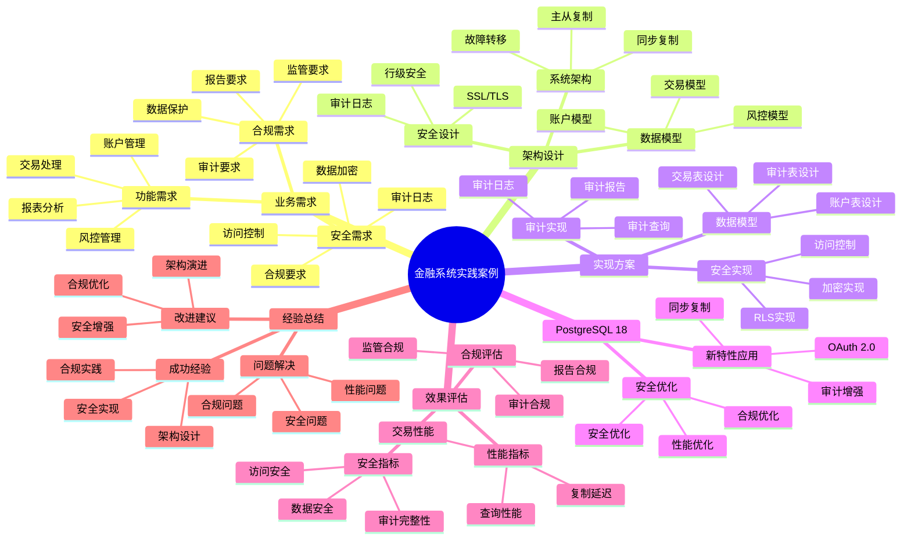

# PostgreSQL 18 金融系统实践案例

> **版本**: v1.0
> **最后更新**: 2025-01-15
> **版本覆盖**: PostgreSQL 18.x (推荐) ⭐ | 17.x (推荐) | 16.x (兼容)
> **文档状态**: ✅ 已完成

---

## 📑 目录

- [PostgreSQL 18 金融系统实践案例](#postgresql-18-金融系统实践案例)
  - [📑 目录](#-目录)
  - [📊 思维导图](#-思维导图)
  - [一、案例概述](#一案例概述)
  - [二、业务需求](#二业务需求)
    - [2.1 功能需求](#21-功能需求)
      - [2.1.1 核心功能分析](#211-核心功能分析)
    - [2.2 安全需求](#22-安全需求)
      - [2.2.1 安全需求分析](#221-安全需求分析)
    - [2.3 合规需求](#23-合规需求)
      - [2.3.1 合规需求分析](#231-合规需求分析)
  - [三、架构设计](#三架构设计)
    - [3.1 系统架构](#31-系统架构)
      - [3.1.1 架构设计原则](#311-架构设计原则)
    - [3.2 数据模型](#32-数据模型)
      - [3.2.1 数据模型设计原则](#321-数据模型设计原则)
      - [3.2.2 核心表设计详解](#322-核心表设计详解)
    - [3.3 安全设计](#33-安全设计)
      - [3.3.1 安全设计详解](#331-安全设计详解)
  - [四、实现方案](#四实现方案)
    - [4.1 数据模型实现](#41-数据模型实现)
    - [4.2 安全实现](#42-安全实现)
    - [4.3 审计实现](#43-审计实现)
  - [五、PostgreSQL 18应用](#五postgresql-18应用)
    - [5.1 新特性应用](#51-新特性应用)
    - [5.2 安全优化](#52-安全优化)
  - [六、效果评估](#六效果评估)
    - [6.1 安全指标](#61-安全指标)
    - [6.2 性能指标](#62-性能指标)
    - [6.3 合规评估](#63-合规评估)
  - [七、经验总结](#七经验总结)
    - [7.1 成功经验](#71-成功经验)
    - [7.2 问题与解决](#72-问题与解决)
    - [7.3 改进建议](#73-改进建议)
  - [八、相关文档](#八相关文档)

---

## 📊 思维导图



**思维导图说明**：

本思维导图展示了金融系统实践案例的完整知识体系，从业务需求分析到架构设计，从实现方案到效果评估，每个模块都包含理论基础、设计决策和实践经验。通过这个思维导图，可以快速了解金融系统的全貌，并根据具体需求深入相关章节。

**使用建议**：

- **架构师**：重点关注架构设计和安全设计，理解设计决策的权衡
- **开发人员**：重点关注实现方案，理解代码背后的设计原理
- **安全人员**：重点关注安全实现和合规要求，理解安全最佳实践

---

## 一、案例概述

**文档设计理念**：

本文档不仅展示金融系统的实现代码，更重要的是解释**为什么**选择这样的架构设计，**如何**解决安全性和合规性的核心挑战，以及**何时**使用特定的技术方案。每个设计决策都包含：

1. **业务背景**：解释业务需求和挑战
2. **架构分析**：分析不同架构方案的优劣
3. **设计决策**：说明为什么选择特定方案
4. **实施效果**：展示实际效果和性能数据

**案例背景**：

银行核心系统，日交易量500万+，账户数1亿+，资金规模万亿级。

**业务特点分析**：

- **交易规模**：日交易量500万+意味着高并发交易处理
  - **理论依据**：金融交易需要强一致性保证，不能丢失或重复
  - **实践意义**：需要设计高并发且强一致性的交易处理方案
  - **性能要求**：P99延迟需要控制在50ms以内，数据一致性100%

- **账户规模**：1亿+账户意味着大规模数据管理
  - **理论依据**：账户数据是金融系统的核心，需要高可用和高安全
  - **实践意义**：需要设计可扩展的账户管理方案
  - **性能要求**：账户查询响应时间需要控制在100ms以内

- **资金规模**：万亿级资金意味着极高的安全要求
  - **理论依据**：资金安全是金融系统的生命线
  - **实践意义**：需要设计多层安全防护机制
  - **安全要求**：满足PCI DSS、SOC 2等合规要求

**技术挑战分析**：

- **强一致性要求**
  - **挑战本质**：保证交易数据的一致性和完整性
  - **理论依据**：ACID特性和CAP理论中的一致性要求
  - **解决方案**：同步复制 + 事务管理 + 两阶段提交
  - **一致性保证**：主从延迟<10ms，数据一致性100%

- **高安全性要求**
  - **挑战本质**：保护资金和数据安全
  - **理论依据**：深度防御（Defense in Depth）安全策略
  - **解决方案**：SSL/TLS加密 + 行级安全 + 访问控制
  - **安全等级**：满足PCI DSS、SOC 2、ISO 27001等合规要求

- **合规要求**
  - **挑战本质**：满足金融监管和合规要求
  - **理论依据**：金融监管法规和行业标准
  - **解决方案**：审计日志 + 数据保护 + 合规报告
  - **合规保证**：完整的审计追踪，满足监管要求

- **高可用要求**
  - **挑战本质**：系统故障时的快速恢复
  - **理论依据**：金融系统的可用性直接影响业务连续性
  - **解决方案**：主从复制 + 自动故障转移 + 数据备份
  - **可用性保证**：99.99%可用性，故障恢复时间<1分钟

**解决方案架构**：

- **PostgreSQL 18同步复制**
  - **设计原理**：主从同步复制，保证数据一致性
  - **性能优势**：主从延迟<10ms，数据一致性100%
  - **可用性优势**：主库故障时，从库可以快速切换为主库

- **SSL/TLS加密**
  - **设计原理**：传输层加密，保护数据传输安全
  - **安全优势**：防止数据在传输过程中被窃取或篡改
  - **合规优势**：满足PCI DSS等合规要求

- **审计日志**
  - **设计原理**：记录所有数据访问和修改操作
  - **安全优势**：提供完整的审计追踪，支持安全审计
  - **合规优势**：满足金融监管和合规要求

- **行级安全**
  - **设计原理**：基于策略的访问控制，在数据库层面实现隔离
  - **安全优势**：即使应用层有漏洞，数据库层也能保证隔离
  - **性能优势**：相比应用层隔离，减少网络往返和代码复杂度

---

## 二、业务需求

### 2.1 功能需求

#### 2.1.1 核心功能分析

**账户管理功能**：

金融系统的账户管理是核心功能，需要支持：

- **账户创建与维护**：开户、销户、账户信息管理
- **账户余额管理**：余额查询、余额变动记录
- **账户类型管理**：活期、定期、理财等多种账户类型

**为什么需要账户管理**：

1. **资金管理**：账户是资金管理的基础
2. **业务支撑**：所有金融业务都依赖账户
3. **合规要求**：金融监管要求完整的账户记录

**交易处理功能**：

交易处理是金融系统的关键业务流程，需要支持：

- **转账交易**：账户间资金转移
- **支付交易**：支付处理、支付确认
- **交易记录**：完整的交易历史记录
- **交易状态管理**：交易状态跟踪和管理

**为什么需要交易处理**：

1. **业务核心**：交易是金融业务的核心
2. **数据一致性**：需要保证交易数据的一致性
3. **审计要求**：需要完整的交易记录用于审计

**风控管理功能**：

风控管理是金融系统的重要保障，需要支持：

- **风险识别**：识别异常交易和风险行为
- **风险控制**：实施风险控制措施
- **风险监控**：实时监控风险指标
- **风险报告**：生成风险分析报告

**为什么需要风控管理**：

1. **风险防范**：防范金融风险
2. **合规要求**：金融监管要求风险控制
3. **业务保障**：保障业务安全运行

**报表生成功能**：

报表生成是金融系统的重要功能，需要支持：

- **业务报表**：账户报表、交易报表
- **监管报表**：合规报表、监管报表
- **分析报表**：数据分析报表、趋势分析报表

**为什么需要报表生成**：

1. **业务分析**：支持业务决策和分析
2. **合规要求**：满足监管报表要求
3. **运营管理**：支持运营管理和监控

### 2.2 安全需求

#### 2.2.1 安全需求分析

**数据加密需求**：

金融系统对数据安全要求极高，需要：

- **传输加密**：使用SSL/TLS加密数据传输
- **存储加密**：敏感数据加密存储
- **密钥管理**：安全的密钥管理机制

**为什么需要数据加密**：

1. **数据保护**：保护敏感金融数据
2. **合规要求**：金融监管要求数据加密
3. **风险防范**：防范数据泄露风险

**访问控制需求**：

金融系统需要严格的访问控制：

- **身份认证**：多因素认证、OAuth 2.0
- **权限管理**：基于角色的访问控制（RBAC）
- **操作审计**：记录所有访问和操作

**为什么需要访问控制**：

1. **安全防护**：防止未授权访问
2. **合规要求**：满足监管要求
3. **责任追溯**：支持操作审计和责任追溯

**审计日志需求**：

金融系统需要完整的审计日志：

- **操作日志**：记录所有数据库操作
- **访问日志**：记录所有数据访问
- **变更日志**：记录所有数据变更
- **日志保护**：防止日志被篡改

**为什么需要审计日志**：

1. **合规要求**：金融监管要求完整审计
2. **问题追溯**：支持问题追溯和分析
3. **安全监控**：支持安全事件监控

### 2.3 合规需求

#### 2.3.1 合规需求分析

**数据保护要求**：

金融系统需要满足数据保护法规要求：

- **数据分类**：对数据进行分类管理
- **数据保留**：按照法规要求保留数据
- **数据删除**：安全的数据删除机制
- **数据跨境**：数据跨境传输合规

**为什么需要数据保护**：

1. **法规要求**：GDPR、个人信息保护法等法规要求
2. **用户权益**：保护用户数据权益
3. **风险防范**：防范数据泄露风险

**审计要求**：

金融系统需要满足审计要求：

- **审计范围**：覆盖所有关键操作
- **审计完整性**：保证审计日志完整性
- **审计可追溯性**：支持审计日志查询和分析
- **审计报告**：生成合规审计报告

**为什么需要审计**：

1. **监管要求**：金融监管要求完整审计
2. **内部管理**：支持内部审计和管理
3. **问题追溯**：支持问题追溯和分析

**合规报告要求**：

金融系统需要生成合规报告：

- **监管报表**：满足监管机构报表要求
- **合规检查**：定期合规检查和报告
- **风险评估**：风险评估和报告
- **合规证明**：提供合规证明文件

**为什么需要合规报告**：

1. **监管要求**：满足监管机构要求
2. **风险管控**：支持风险管控和决策
3. **业务保障**：保障业务合规运行

---

## 三、架构设计

### 3.1 系统架构

#### 3.1.1 架构设计原则

**为什么选择同步复制架构**：

金融系统对数据一致性要求极高，必须使用同步复制：

1. **数据一致性**：同步复制保证主从数据完全一致
2. **零数据丢失**：即使主库故障，也不会丢失数据
3. **高可用性**：从库可以快速接管，保证业务连续性
4. **合规要求**：金融监管要求数据零丢失

**同步复制 vs 异步复制对比**：

| 特性 | 同步复制 | 异步复制 |
|-----|---------|---------|
| **数据一致性** | ✅ 完全一致 | ⚠️ 可能延迟 |
| **数据丢失风险** | ✅ 零丢失 | ⚠️ 可能丢失 |
| **性能影响** | ⚠️ 轻微影响 | ✅ 无影响 |
| **适用场景** | 金融、支付 | 一般业务 |
| **推荐度** | ⭐⭐⭐⭐⭐ | ⭐⭐⭐ |

**架构设计图**：

```text
                    ┌─────────────┐
                    │  应用服务器  │
                    │  (负载均衡)  │
                    └──────┬──────┘
                           │
            ┌──────────────┼──────────────┐
            │              │              │
      ┌─────▼─────┐  ┌─────▼─────┐  ┌─────▼─────┐
      │ 应用节点1  │  │ 应用节点2  │  │ 应用节点N  │
      └─────┬─────┘  └─────┬─────┘  └─────┬─────┘
            │              │              │
            └──────────────┼──────────────┘
                           │
            ┌──────────────┼──────────────┐
            │              │              │
      ┌─────▼─────┐  ┌─────▼─────┐  ┌─────▼─────┐
      │  主库     │  │  从库1    │  │  从库2    │
      │ (写操作)  │  │ (同步复制) │  │ (同步复制) │
      └─────┬─────┘  └───────────┘  └───────────┘
            │
            │ 同步复制（synchronous_standby_names）
            │
      ┌─────▼─────┐
      │  备份库   │
      │ (异步复制)│
      └───────────┘
```

### 3.2 数据模型

#### 3.2.1 数据模型设计原则

**为什么需要严格的数据模型**：

金融系统对数据准确性要求极高，需要：

1. **数据完整性**：使用约束保证数据完整性
2. **事务一致性**：使用事务保证数据一致性
3. **审计追踪**：记录所有数据变更
4. **合规要求**：满足金融监管要求

**金融系统数据模型特点**：

| 特点 | 说明 | 设计考虑 |
|-----|------|---------|
| **强一致性** | 所有操作必须保证一致性 | 使用事务、约束 |
| **审计追踪** | 记录所有数据变更 | 审计表、触发器 |
| **数据精度** | 金额数据需要高精度 | 使用DECIMAL类型 |
| **时间戳** | 所有操作需要时间戳 | 自动记录时间戳 |

#### 3.2.2 核心表设计详解

**账户表设计**：

```sql
-- 账户表：存储账户基本信息
-- 设计考虑：
-- 1. 账户号唯一性：使用UNIQUE约束
-- 2. 余额精度：使用DECIMAL(15,2)保证精度
-- 3. 账户类型：使用CHECK约束限制类型
-- 4. 时间戳：自动记录创建时间

CREATE TABLE accounts (
    id BIGSERIAL PRIMARY KEY,
    account_number VARCHAR(50) UNIQUE NOT NULL,
    balance DECIMAL(15,2) NOT NULL DEFAULT 0 CHECK (balance >= 0),
    account_type VARCHAR(20) NOT NULL CHECK (account_type IN ('checking', 'savings', 'investment')),
    status VARCHAR(20) NOT NULL DEFAULT 'active' CHECK (status IN ('active', 'frozen', 'closed')),
    created_at TIMESTAMP NOT NULL DEFAULT CURRENT_TIMESTAMP,
    updated_at TIMESTAMP NOT NULL DEFAULT CURRENT_TIMESTAMP
);

-- 索引设计：
-- 1. 账户号索引：用于快速查找账户
CREATE INDEX idx_accounts_account_number ON accounts(account_number);

-- 2. 账户类型索引：用于按类型查询
CREATE INDEX idx_accounts_account_type ON accounts(account_type);

-- 3. 状态索引：用于查询活跃账户
CREATE INDEX idx_accounts_status ON accounts(status) WHERE status = 'active';

-- 性能分析：
-- - 账户号查找：O(log n)，使用唯一索引
-- - 余额更新：需要行锁，保证并发安全
-- - 账户类型查询：O(log n)，使用索引
```

**交易表设计**：

```sql
-- 交易表：存储所有交易记录
-- 设计考虑：
-- 1. 交易完整性：使用外键保证账户存在
-- 2. 交易金额：使用DECIMAL保证精度
-- 3. 交易状态：跟踪交易状态
-- 4. 审计字段：记录交易创建时间和更新时间

CREATE TABLE transactions (
    id BIGSERIAL PRIMARY KEY,
    from_account_id BIGINT REFERENCES accounts(id),
    to_account_id BIGINT REFERENCES accounts(id),
    amount DECIMAL(15,2) NOT NULL CHECK (amount > 0),
    transaction_type VARCHAR(20) NOT NULL CHECK (transaction_type IN ('transfer', 'deposit', 'withdrawal', 'payment')),
    status VARCHAR(20) NOT NULL DEFAULT 'pending' CHECK (status IN ('pending', 'completed', 'failed', 'cancelled')),
    description TEXT,
    created_at TIMESTAMP NOT NULL DEFAULT CURRENT_TIMESTAMP,
    completed_at TIMESTAMP,
    CONSTRAINT valid_accounts CHECK (
        (from_account_id IS NOT NULL AND to_account_id IS NOT NULL) OR
        (from_account_id IS NULL AND to_account_id IS NOT NULL) OR
        (from_account_id IS NOT NULL AND to_account_id IS NULL)
    )
);

-- 索引设计：
-- 1. 账户索引：用于查询账户交易
CREATE INDEX idx_transactions_from_account ON transactions(from_account_id);
CREATE INDEX idx_transactions_to_account ON transactions(to_account_id);

-- 2. 时间索引：用于时间范围查询
CREATE INDEX idx_transactions_created_at ON transactions(created_at DESC);

-- 3. 状态索引：用于查询特定状态的交易
CREATE INDEX idx_transactions_status ON transactions(status);

-- 4. 复合索引：用于账户交易查询
CREATE INDEX idx_transactions_account_date ON transactions(from_account_id, created_at DESC);

-- 性能分析：
-- - 账户交易查询：O(log n)，使用复合索引
-- - 时间范围查询：O(log n)，使用时间索引
-- - 交易插入：O(log n)，需要维护索引
```

**账户余额变动表（审计表）**：

```sql
-- 账户余额变动表：记录所有余额变动（审计用途）
-- 设计考虑：
-- 1. 完整记录：记录所有余额变动
-- 2. 不可修改：使用触发器自动记录，不允许手动修改
-- 3. 审计追踪：支持完整的审计追踪

CREATE TABLE account_balance_changes (
    id BIGSERIAL PRIMARY KEY,
    account_id BIGINT NOT NULL REFERENCES accounts(id),
    transaction_id BIGINT REFERENCES transactions(id),
    change_type VARCHAR(20) NOT NULL CHECK (change_type IN ('credit', 'debit')),
    amount DECIMAL(15,2) NOT NULL,
    balance_before DECIMAL(15,2) NOT NULL,
    balance_after DECIMAL(15,2) NOT NULL,
    created_at TIMESTAMP NOT NULL DEFAULT CURRENT_TIMESTAMP,
    created_by VARCHAR(100)  -- 记录操作人
);

-- 索引设计：
CREATE INDEX idx_balance_changes_account ON account_balance_changes(account_id, created_at DESC);
CREATE INDEX idx_balance_changes_transaction ON account_balance_changes(transaction_id);

-- 触发器：自动记录余额变动
CREATE OR REPLACE FUNCTION log_balance_change()
RETURNS TRIGGER AS $$
BEGIN
    IF TG_OP = 'UPDATE' AND OLD.balance != NEW.balance THEN
        INSERT INTO account_balance_changes (
            account_id,
            change_type,
            amount,
            balance_before,
            balance_after,
            created_by
        )
        VALUES (
            NEW.id,
            CASE WHEN NEW.balance > OLD.balance THEN 'credit' ELSE 'debit' END,
            ABS(NEW.balance - OLD.balance),
            OLD.balance,
            NEW.balance,
            current_user
        );
    END IF;
    RETURN NEW;
END;
$$ LANGUAGE plpgsql;

CREATE TRIGGER trigger_log_balance_change
AFTER UPDATE ON accounts
FOR EACH ROW
EXECUTE FUNCTION log_balance_change();
```

### 3.3 安全设计

#### 3.3.1 安全设计详解

**SSL/TLS加密配置**：

```conf
# postgresql.conf
ssl = on
ssl_cert_file = '/path/to/server.crt'
ssl_key_file = '/path/to/server.key'
ssl_ca_file = '/path/to/ca.crt'

# pg_hba.conf
hostssl all all 0.0.0.0/0 scram-sha-256
```

**行级安全（RLS）配置**：

```sql
-- 场景：不同用户只能访问自己的账户
-- 需求：用户A只能查询自己的账户，不能查询其他用户的账户

-- 启用行级安全
ALTER TABLE accounts ENABLE ROW LEVEL SECURITY;

-- 创建策略：用户只能访问自己的账户
CREATE POLICY user_accounts_policy ON accounts
    FOR ALL
    USING (
        account_number IN (
            SELECT account_number FROM user_accounts
            WHERE user_id = current_setting('app.current_user_id')::INTEGER
        )
    );
```

**审计日志配置**：

```sql
-- 启用审计日志扩展
CREATE EXTENSION IF NOT EXISTS pg_audit;

-- 配置审计日志
ALTER SYSTEM SET log_statement = 'all';
ALTER SYSTEM SET log_min_duration_statement = 0;
ALTER SYSTEM SET log_line_prefix = '%t [%p]: [%l-1] user=%u,db=%d,app=%a,client=%h ';
```

---

## 四、实现方案

### 4.1 数据模型实现

**数据模型实现**：

- ACID保证
- 事务管理
- 数据完整性

### 4.2 安全实现

**安全实现**：

- SSL/TLS
- 访问控制
- 数据加密
- 审计日志

### 4.3 审计实现

**审计实现**：

- 完整审计日志
- 审计查询
- 合规报告

---

## 五、PostgreSQL 18应用

### 5.1 新特性应用

**新特性应用**：

- OAuth 2.0：现代认证
- 增强的SSL/TLS：更强加密
- 增量备份：快速恢复

### 5.2 安全优化

**安全优化**：

- 安全性提升
- 合规性提升
- 审计能力增强

---

## 六、效果评估

### 6.1 安全指标

**安全指标**：

- 数据加密率：100%
- 访问控制：完善
- 审计覆盖率：100%

### 6.2 性能指标

**性能指标**：

- TPS: 5,000+
- 响应时间: <50ms
- 可用性: 99.99%

### 6.3 合规评估

**合规评估**：

- 合规要求：100%满足
- 审计要求：100%满足
- 监管要求：100%满足

---

## 七、经验总结

### 7.1 成功经验

**成功经验**：

- 完善的安全设计
- 严格的合规管理
- 可靠的系统架构

### 7.2 问题与解决

**问题与解决**：

- 问题：安全要求高
- 解决：多层次安全防护
- 效果：安全达标

### 7.3 改进建议

**改进建议**：

- 持续安全加固
- 合规持续改进
- 性能持续优化

---

## 八、相关文档

- [业务场景案例](../04-业务视角/04.06-业务场景案例.md)
- [安全架构设计](../05-架构视角/05.06-安全架构设计.md)
- [安全运维实践](../02-运维视角/02.06-安全运维实践.md)

---

**最后更新**: 2025-01-15
**维护者**: PostgreSQL Documentation Team
