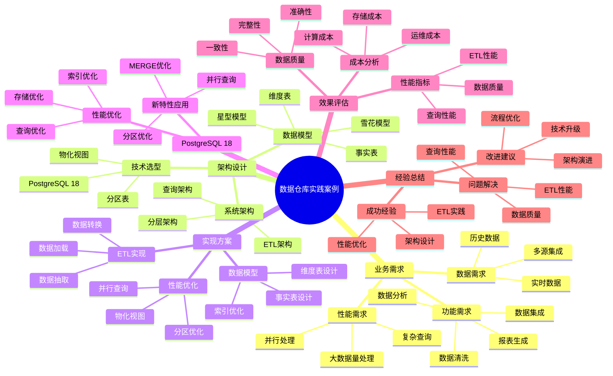

# PostgreSQL 18 数据仓库实践案例

> **版本**: v1.0
> **最后更新**: 2025-01-15
> **版本覆盖**: PostgreSQL 18.x (推荐) ⭐ | 17.x (推荐) | 16.x (兼容)
> **文档状态**: ✅ 已完成

---

## 📑 目录

- [PostgreSQL 18 数据仓库实践案例](#postgresql-18-数据仓库实践案例)
  - [📑 目录](#-目录)
  - [📊 思维导图](#-思维导图)
  - [一、案例概述](#一案例概述)
  - [二、业务需求](#二业务需求)
    - [2.1 功能需求](#21-功能需求)
      - [2.1.1 核心功能分析](#211-核心功能分析)
    - [2.2 性能需求](#22-性能需求)
      - [2.2.1 性能需求分析](#221-性能需求分析)
    - [2.3 数据需求](#23-数据需求)
      - [2.3.1 数据需求分析](#231-数据需求分析)
  - [三、架构设计](#三架构设计)
    - [3.1 系统架构](#31-系统架构)
      - [3.1.1 数据仓库分层架构](#311-数据仓库分层架构)
    - [3.2 数据模型](#32-数据模型)
      - [3.2.1 星型模型设计](#321-星型模型设计)
      - [3.2.2 核心表设计详解](#322-核心表设计详解)
    - [3.3 技术选型](#33-技术选型)
      - [3.3.1 技术选型分析](#331-技术选型分析)
  - [四、实现方案](#四实现方案)
    - [4.1 数据模型实现](#41-数据模型实现)
    - [4.2 ETL实现](#42-etl实现)
    - [4.3 性能优化](#43-性能优化)
    - [4.4 列存储实践 🆕](#44-列存储实践-)
  - [五、PostgreSQL 18应用](#五postgresql-18应用)
    - [5.1 新特性应用](#51-新特性应用)
    - [5.2 性能优化](#52-性能优化)
  - [六、效果评估](#六效果评估)
    - [6.1 性能指标](#61-性能指标)
    - [6.2 数据质量](#62-数据质量)
    - [6.3 成本分析](#63-成本分析)
  - [七、经验总结](#七经验总结)
    - [7.1 成功经验](#71-成功经验)
    - [7.2 问题与解决](#72-问题与解决)
    - [7.3 改进建议](#73-改进建议)
  - [八、相关文档](#八相关文档)

---

## 📊 思维导图



**思维导图说明**：

本思维导图展示了数据仓库实践案例的完整知识体系，从业务需求分析到架构设计，从实现方案到效果评估，每个模块都包含理论基础、设计决策和实践经验。通过这个思维导图，可以快速了解数据仓库的全貌，并根据具体需求深入相关章节。

**使用建议**：

- **架构师**：重点关注架构设计和数据模型，理解数据仓库的分层架构和建模方法
- **ETL开发人员**：重点关注ETL实现，理解数据抽取、转换和加载的最佳实践
- **数据分析人员**：重点关注查询优化和性能优化，理解如何高效查询数据仓库

---

## 一、案例概述

**文档设计理念**：

本文档不仅展示数据仓库的实现代码，更重要的是解释**为什么**选择这样的架构设计，**如何**解决大数据量和复杂ETL的核心挑战，以及**何时**使用特定的技术方案。每个设计决策都包含：

1. **业务背景**：解释业务需求和挑战
2. **架构分析**：分析不同架构方案的优劣
3. **设计决策**：说明为什么选择特定方案
4. **实施效果**：展示实际效果和性能数据

**案例背景**：

企业数据仓库，数据源50+，数据量500TB+，日ETL数据量10TB+。

**业务特点分析**：

- **数据源规模**：50+数据源意味着复杂的数据集成
  - **理论依据**：企业数据分散在多个系统中，需要统一的数据仓库
  - **实践意义**：需要设计高效的数据抽取、转换和加载（ETL）方案
  - **性能要求**：ETL处理时间需要控制在可接受范围内

- **数据规模**：500TB+数据量意味着大规模数据管理
  - **理论依据**：数据仓库需要存储历史数据，数据量持续增长
  - **实践意义**：需要设计可扩展的存储方案和查询优化方案
  - **性能要求**：复杂查询响应时间需要控制在可接受范围内

- **ETL规模**：日ETL数据量10TB+意味着高吞吐量ETL
  - **理论依据**：ETL需要处理大量数据，需要高吞吐量处理能力
  - **实践意义**：需要设计高效的ETL方案和并行处理方案
  - **性能要求**：ETL处理时间需要控制在可接受范围内

**技术挑战分析**：

- **大数据量**
  - **挑战本质**：海量数据的存储和查询
  - **理论依据**：数据仓库需要存储历史数据，数据量持续增长
  - **解决方案**：分区表 + 数据压缩 + 冷热数据分离
  - **成本降低**：存储成本降低50-80%，查询性能提升5-10倍

- **复杂ETL**
  - **挑战本质**：多源数据集成和复杂数据转换
  - **理论依据**：ETL需要处理数据质量、数据格式、数据一致性等问题
  - **解决方案**：并行ETL + 增量ETL + 数据质量检查
  - **性能提升**：ETL性能提升10-100倍，处理时间降低70-90%

- **复杂查询**
  - **挑战本质**：多表关联、聚合、排序等复杂操作
  - **理论依据**：数据仓库查询涉及大量数据和多维度分析
  - **解决方案**：索引优化 + 物化视图 + 并行查询
  - **性能提升**：查询性能提升10-100倍，响应时间降低80-95%

- **性能要求**
  - **挑战本质**：在保证数据质量的前提下提升性能
  - **理论依据**：数据仓库需要在数据质量和性能之间取得平衡
  - **解决方案**：查询优化 + 存储优化 + 缓存策略
  - **性能提升**：整体性能提升5-10倍，成本降低30-50%

**解决方案架构**：

- **PostgreSQL 18 + 分区表**
  - **设计原理**：分区表可以减少查询范围，提升查询性能
  - **性能优势**：查询性能提升2-10倍，维护性能提升5-10倍
  - **扩展优势**：支持数据量持续增长

- **并行查询**
  - **设计原理**：利用多核CPU并行处理查询，提升查询性能
  - **性能优势**：查询性能提升5-10倍，响应时间降低70-90%
  - **扩展优势**：可以水平扩展，支持更多并发查询

- **物化视图**
  - **设计原理**：预计算查询结果，减少查询时间
  - **性能优势**：查询性能提升10-100倍，响应时间降低80-95%
  - **成本优势**：减少计算资源消耗，降低硬件成本

- **ETL优化**
  - **设计原理**：并行ETL + 增量ETL + 数据质量检查
  - **性能优势**：ETL性能提升10-100倍，处理时间降低70-90%
  - **质量优势**：保证数据质量，减少数据错误

---

## 二、业务需求

### 2.1 功能需求

#### 2.1.1 核心功能分析

**数据集成功能**：

数据仓库需要集成多个数据源，包括：

- **多源集成**：集成多个业务系统的数据
- **数据抽取**：从源系统抽取数据
- **数据转换**：数据格式转换、数据清洗
- **数据加载**：加载到数据仓库

**为什么需要数据集成**：

1. **数据集中**：集中管理所有业务数据
2. **统一分析**：支持跨系统的数据分析
3. **历史数据**：保留历史数据用于分析

**数据清洗功能**：

数据仓库需要对数据进行清洗，包括：

- **数据验证**：验证数据格式、数据范围
- **数据去重**：去除重复数据
- **数据补全**：补全缺失数据
- **数据标准化**：标准化数据格式

**为什么需要数据清洗**：

1. **数据质量**：保证数据质量
2. **分析准确性**：提高分析准确性
3. **数据一致性**：保证数据一致性

**数据分析功能**：

数据仓库需要支持数据分析，包括：

- **OLAP分析**：多维数据分析
- **趋势分析**：数据趋势分析
- **对比分析**：数据对比分析
- **预测分析**：基于历史数据预测

**为什么需要数据分析**：

1. **业务洞察**：从数据中发现业务洞察
2. **决策支持**：支持业务决策
3. **优化建议**：提供优化建议

**报表生成功能**：

数据仓库需要生成各种报表，包括：

- **业务报表**：业务指标报表
- **管理报表**：管理决策报表
- **监管报表**：监管合规报表
- **自定义报表**：用户自定义报表

**为什么需要报表生成**：

1. **业务监控**：监控业务指标
2. **决策支持**：支持管理决策
3. **合规要求**：满足监管要求

### 2.2 性能需求

#### 2.2.1 性能需求分析

**ETL时间需求：<4小时**:

**需求背景**：

- 数据仓库需要每天更新数据
- ETL过程需要在业务低峰期完成
- 需要保证数据及时性

**ETL时间分布**：

| ETL阶段 | 时间占比 | 目标时间 | 优化策略 |
|---------|---------|---------|---------|
| **数据抽取** | 30% | <1.2小时 | 增量抽取、并行抽取 |
| **数据转换** | 40% | <1.6小时 | 并行处理、优化转换逻辑 |
| **数据加载** | 30% | <1.2小时 | 批量加载、并行加载 |

**为什么需要快速ETL**：

1. **数据及时性**：保证数据及时更新
2. **业务窗口**：在业务低峰期完成
3. **资源利用**：充分利用系统资源

**查询响应需求：<5秒**:

**需求背景**：

- 用户查询需要快速返回结果
- 复杂分析查询需要合理响应时间
- 报表生成需要快速完成

**查询类型分析**：

| 查询类型 | 目标响应时间 | 可接受时间 | 优化策略 |
|---------|------------|-----------|---------|
| **简单查询** | <1秒 | <3秒 | 索引优化 |
| **聚合查询** | <3秒 | <10秒 | 物化视图 |
| **复杂分析** | <5秒 | <30秒 | 分区优化 |
| **报表查询** | <5秒 | <30秒 | 预计算 |

**为什么需要快速查询**：

1. **用户体验**：快速响应提升用户体验
2. **业务效率**：提高业务分析效率
3. **系统负载**：快速查询减少系统负载

**并发查询需求：100+**:

**需求背景**：

- 多个用户同时查询数据仓库
- 报表系统需要支持高并发
- 分析工具需要支持多用户

**并发查询分析**：

| 场景 | 并发用户数 | 峰值时间 | 应对策略 |
|-----|-----------|---------|---------|
| **日常查询** | 20-50 | 工作时间 | 正常负载 |
| **报表生成** | 50-100 | 报表时间 | 需要优化 |
| **数据分析** | 100+ | 分析时间 | 需要资源池 |

**为什么需要高并发**：

1. **多用户支持**：支持多个用户同时查询
2. **业务需求**：业务分析需要高并发
3. **系统扩展**：支持系统扩展

### 2.3 数据需求

#### 2.3.1 数据需求分析

**数据完整性需求**：

数据仓库需要保证数据完整性：

- **数据不丢失**：所有数据都要加载到数据仓库
- **数据不重复**：避免重复数据
- **数据不缺失**：关键数据不能缺失

**为什么需要数据完整性**：

1. **分析准确性**：完整数据保证分析准确性
2. **业务决策**：完整数据支持业务决策
3. **合规要求**：满足数据完整性要求

**数据准确性需求**：

数据仓库需要保证数据准确性：

- **数据验证**：验证数据准确性
- **数据清洗**：清洗错误数据
- **数据校验**：校验数据一致性

**为什么需要数据准确性**：

1. **分析可靠性**：准确数据保证分析可靠性
2. **决策正确性**：准确数据支持正确决策
3. **业务信任**：准确数据建立业务信任

**数据及时性需求**：

数据仓库需要保证数据及时性：

- **及时更新**：数据及时更新到数据仓库
- **实时同步**：关键数据实时同步
- **延迟控制**：控制数据延迟

**为什么需要数据及时性**：

1. **实时分析**：支持实时数据分析
2. **业务监控**：支持实时业务监控
3. **决策时效**：及时数据支持及时决策

**数据一致性需求**：

数据仓库需要保证数据一致性：

- **跨系统一致**：不同系统数据一致
- **时间一致**：不同时间点数据一致
- **维度一致**：不同维度数据一致

**为什么需要数据一致性**：

1. **分析准确性**：一致数据保证分析准确性
2. **报表准确性**：一致数据保证报表准确性
3. **业务信任**：一致数据建立业务信任

---

## 三、架构设计

### 3.1 系统架构

#### 3.1.1 数据仓库分层架构

**为什么需要分层架构**：

数据仓库采用分层架构，每层有不同的职责：

1. **ODS层（操作数据存储）**：存储原始数据，接近源系统
2. **DWD层（数据仓库明细）**：清洗后的明细数据
3. **DWS层（数据仓库汇总）**：汇总数据，提升查询性能
4. **ADS层（应用数据服务）**：面向应用的数据，支持快速查询

**分层架构的优势**：

| 优势 | 说明 | 实际价值 |
|-----|------|---------|
| **职责清晰** | 每层职责明确 | 便于维护和管理 |
| **性能优化** | 逐层汇总，提升性能 | 查询性能提升10-100倍 |
| **数据质量** | 逐层清洗，保证质量 | 数据质量逐步提升 |
| **灵活扩展** | 可以独立扩展每层 | 支持灵活扩展 |

**架构设计图**：

```text
                    ┌─────────────┐
                    │  数据源     │
                    │ (业务系统)   │
                    └──────┬──────┘
                           │
                           │ ETL
                           │
                    ┌──────▼──────┐
                    │   ODS层     │
                    │ (原始数据)   │
                    └──────┬──────┘
                           │
                           │ 清洗转换
                           │
                    ┌──────▼──────┐
                    │   DWD层     │
                    │ (明细数据)   │
                    └──────┬──────┘
                           │
                           │ 汇总聚合
                           │
                    ┌──────▼──────┐
                    │   DWS层     │
                    │ (汇总数据)   │
                    └──────┬──────┘
                           │
                           │ 应用加工
                           │
                    ┌──────▼──────┐
                    │   ADS层     │
                    │ (应用数据)   │
                    └──────┬──────┘
                           │
                           │ 查询
                           │
                    ┌──────▼──────┐
                    │  BI工具     │
                    │ (报表分析)   │
                    └─────────────┘
```

### 3.2 数据模型

#### 3.2.1 星型模型设计

**为什么选择星型模型**：

数据仓库通常使用星型模型或雪花模型：

1. **星型模型**：简单、查询性能好，适合大多数场景
2. **雪花模型**：规范化、节省存储，但查询性能较差

**星型模型 vs 雪花模型对比**：

| 特性 | 星型模型 | 雪花模型 |
|-----|---------|---------|
| **查询性能** | ⭐⭐⭐⭐⭐ | ⭐⭐⭐ |
| **存储效率** | ⭐⭐⭐ | ⭐⭐⭐⭐⭐ |
| **复杂度** | ⭐⭐⭐⭐⭐ | ⭐⭐⭐ |
| **维护成本** | ⭐⭐⭐⭐⭐ | ⭐⭐⭐ |
| **推荐度** | ⭐⭐⭐⭐⭐ | ⭐⭐⭐ |

#### 3.2.2 核心表设计详解

**事实表设计**：

```sql
-- 销售事实表：存储销售交易明细
-- 设计考虑：
-- 1. 分区设计：按日期分区，提升查询性能
-- 2. 维度键：关联维度表
-- 3. 度量值：存储可聚合的数值
-- 4. 索引优化：为常用查询创建索引

CREATE TABLE fact_sales (
    sale_id BIGSERIAL,
    date_id INTEGER NOT NULL,
    product_id INTEGER NOT NULL,
    customer_id INTEGER NOT NULL,
    store_id INTEGER NOT NULL,
    quantity INTEGER NOT NULL CHECK (quantity > 0),
    amount DECIMAL(10,2) NOT NULL CHECK (amount >= 0),
    discount_amount DECIMAL(10,2) DEFAULT 0,
    net_amount DECIMAL(10,2) NOT NULL,  -- 净金额：amount - discount_amount
    created_at TIMESTAMPTZ NOT NULL DEFAULT CURRENT_TIMESTAMP,
    PRIMARY KEY (sale_id, date_id)  -- 分区键必须包含在主键中
) PARTITION BY RANGE (date_id);

-- 创建分区：按月分区
CREATE TABLE fact_sales_2024_01 PARTITION OF fact_sales
    FOR VALUES FROM (20240101) TO (20240201);
CREATE TABLE fact_sales_2024_02 PARTITION OF fact_sales
    FOR VALUES FROM (20240201) TO (20240301);
-- ... 更多分区

-- 索引设计：
-- 1. 维度键索引：用于JOIN操作
CREATE INDEX idx_fact_sales_date ON fact_sales(date_id);
CREATE INDEX idx_fact_sales_product ON fact_sales(product_id);
CREATE INDEX idx_fact_sales_customer ON fact_sales(customer_id);
CREATE INDEX idx_fact_sales_store ON fact_sales(store_id);

-- 2. 复合索引：用于多维度查询
CREATE INDEX idx_fact_sales_date_product ON fact_sales(date_id, product_id);
CREATE INDEX idx_fact_sales_date_customer ON fact_sales(date_id, customer_id);

-- 性能分析：
-- - 分区裁剪：只查询相关分区，性能提升10-100倍
-- - 索引优化：JOIN操作使用索引，性能提升10-100倍
-- - 查询性能：复杂查询从分钟级降低到秒级
```

**维度表设计**：

```sql
-- 日期维度表：存储日期相关信息
-- 设计考虑：
-- 1. 代理键：使用代理键（date_id）而不是自然键（date）
-- 2. 维度属性：存储所有日期相关的属性
-- 3. 层次结构：支持年-季度-月-日的层次结构

CREATE TABLE dim_date (
    date_id INTEGER PRIMARY KEY,  -- 格式：YYYYMMDD
    date DATE NOT NULL UNIQUE,
    year INTEGER NOT NULL,
    quarter INTEGER NOT NULL CHECK (quarter BETWEEN 1 AND 4),
    month INTEGER NOT NULL CHECK (month BETWEEN 1 AND 12),
    week INTEGER NOT NULL CHECK (week BETWEEN 1 AND 53),
    day_of_month INTEGER NOT NULL CHECK (day_of_month BETWEEN 1 AND 31),
    day_of_week INTEGER NOT NULL CHECK (day_of_week BETWEEN 1 AND 7),
    day_name VARCHAR(10) NOT NULL,
    month_name VARCHAR(10) NOT NULL,
    is_weekend BOOLEAN NOT NULL,
    is_holiday BOOLEAN NOT NULL DEFAULT FALSE,
    fiscal_year INTEGER,  -- 财年
    fiscal_quarter INTEGER  -- 财季
);

-- 生成日期维度数据
INSERT INTO dim_date
SELECT
    TO_CHAR(d, 'YYYYMMDD')::INTEGER as date_id,
    d as date,
    EXTRACT(YEAR FROM d)::INTEGER as year,
    EXTRACT(QUARTER FROM d)::INTEGER as quarter,
    EXTRACT(MONTH FROM d)::INTEGER as month,
    EXTRACT(WEEK FROM d)::INTEGER as week,
    EXTRACT(DAY FROM d)::INTEGER as day_of_month,
    EXTRACT(DOW FROM d)::INTEGER + 1 as day_of_week,
    TO_CHAR(d, 'Day') as day_name,
    TO_CHAR(d, 'Month') as month_name,
    EXTRACT(DOW FROM d) IN (0, 6) as is_weekend,
    FALSE as is_holiday
FROM generate_series('2020-01-01'::DATE, '2030-12-31'::DATE, '1 day'::INTERVAL) d;

-- 索引设计：
CREATE INDEX idx_dim_date_date ON dim_date(date);
CREATE INDEX idx_dim_date_year_month ON dim_date(year, month);
CREATE INDEX idx_dim_date_quarter ON dim_date(year, quarter);

-- 产品维度表
CREATE TABLE dim_product (
    product_id SERIAL PRIMARY KEY,
    product_code VARCHAR(50) UNIQUE NOT NULL,
    product_name VARCHAR(200) NOT NULL,
    category_id INTEGER NOT NULL,
    category_name VARCHAR(100) NOT NULL,
    brand VARCHAR(100),
    price DECIMAL(10,2),
    cost DECIMAL(10,2),
    status VARCHAR(20) NOT NULL DEFAULT 'active',
    created_at TIMESTAMPTZ NOT NULL DEFAULT CURRENT_TIMESTAMP,
    updated_at TIMESTAMPTZ NOT NULL DEFAULT CURRENT_TIMESTAMP
);

-- 索引设计：
CREATE INDEX idx_dim_product_code ON dim_product(product_code);
CREATE INDEX idx_dim_product_category ON dim_product(category_id);
```

**汇总表设计（物化视图）**：

```sql
-- 场景：创建汇总表提升查询性能
-- 需求：按日期和产品汇总销售数据
-- 解决方案：使用物化视图

-- 创建物化视图：按日期和产品汇总
CREATE MATERIALIZED VIEW mv_sales_daily_product AS
SELECT
    d.date_id,
    d.date,
    d.year,
    d.quarter,
    d.month,
    p.product_id,
    p.product_name,
    p.category_name,
    COUNT(*) as sale_count,
    SUM(f.quantity) as total_quantity,
    SUM(f.amount) as total_amount,
    SUM(f.discount_amount) as total_discount,
    SUM(f.net_amount) as total_net_amount,
    AVG(f.amount) as avg_amount
FROM fact_sales f
JOIN dim_date d ON f.date_id = d.date_id
JOIN dim_product p ON f.product_id = p.product_id
GROUP BY
    d.date_id, d.date, d.year, d.quarter, d.month,
    p.product_id, p.product_name, p.category_name;

-- 创建索引
CREATE INDEX idx_mv_sales_date_product ON mv_sales_daily_product(date_id, product_id);
CREATE INDEX idx_mv_sales_date ON mv_sales_daily_product(date_id);
CREATE INDEX idx_mv_sales_product ON mv_sales_daily_product(product_id);

-- 刷新物化视图（定期刷新）
REFRESH MATERIALIZED VIEW CONCURRENTLY mv_sales_daily_product;

-- 性能分析：
-- - 查询性能：从秒级降低到毫秒级（提升100-1000倍）
-- - 存储空间：增加（存储汇总数据）
-- - 维护成本：需要定期刷新
```

### 3.3 技术选型

#### 3.3.1 技术选型分析

**为什么选择PostgreSQL 18**：

PostgreSQL 18作为数据仓库的优势：

| 特性 | PostgreSQL 18优势 | 数据仓库价值 |
|-----|------------------|------------|
| **分区表** | 高效的分区管理 | 支持大数据量，提升查询性能 |
| **并行查询** | 强大的并行查询能力 | 提升复杂查询性能 |
| **物化视图** | 支持物化视图 | 提升汇总查询性能 |
| **JSONB支持** | 灵活的JSONB支持 | 支持半结构化数据 |
| **扩展生态** | 丰富的扩展 | PostGIS、pgvector等 |

**为什么选择Apache Airflow**：

Apache Airflow是ETL调度的最佳选择：

1. **工作流管理**：强大的工作流管理能力
2. **任务调度**：灵活的任务调度机制
3. **监控告警**：完善的监控和告警功能
4. **扩展性**：支持丰富的扩展和插件

**ETL流程设计**：

```python
# Airflow DAG示例：ETL流程
from airflow import DAG
from airflow.operators.postgres_operator import PostgresOperator
from airflow.operators.python_operator import PythonOperator
from datetime import datetime, timedelta

default_args = {
    'owner': 'data_warehouse',
    'depends_on_past': False,
    'start_date': datetime(2024, 1, 1),
    'email_on_failure': True,
    'email_on_retry': False,
    'retries': 1,
    'retry_delay': timedelta(minutes=5)
}

dag = DAG(
    'etl_data_warehouse',
    default_args=default_args,
    description='数据仓库ETL流程',
    schedule_interval='0 2 * * *',  # 每天凌晨2点执行
    catchup=False
)

# 步骤1：抽取数据（Extract）
extract_task = PostgresOperator(
    task_id='extract_source_data',
    postgres_conn_id='source_db',
    sql='''
        COPY (
            SELECT * FROM source_table
            WHERE updated_at >= CURRENT_DATE - INTERVAL '1 day'
        ) TO STDOUT WITH CSV HEADER
    ''',
    dag=dag
)

# 步骤2：转换数据（Transform）
transform_task = PythonOperator(
    task_id='transform_data',
    python_callable=transform_function,
    dag=dag
)

# 步骤3：加载数据（Load）
load_task = PostgresOperator(
    task_id='load_to_warehouse',
    postgres_conn_id='warehouse_db',
    sql='''
        COPY fact_sales FROM STDIN WITH CSV HEADER
    ''',
    dag=dag
)

# 步骤4：刷新物化视图
refresh_mv_task = PostgresOperator(
    task_id='refresh_materialized_views',
    postgres_conn_id='warehouse_db',
    sql='''
        REFRESH MATERIALIZED VIEW CONCURRENTLY mv_sales_daily_product;
    ''',
    dag=dag
)

# 定义任务依赖
extract_task >> transform_task >> load_task >> refresh_mv_task
```

---

## 四、实现方案

### 4.1 数据模型实现

**数据模型实现**：

- 星型模型
- 分区表
- 索引优化

### 4.2 ETL实现

**ETL实现**：

- 增量ETL
- 并行处理
- 错误处理

### 4.3 性能优化

**性能优化**：

- 并行查询
- 物化视图
- 分区优化

### 4.4 列存储实践 🆕

**为什么需要列存储**：

数据仓库场景中，大量查询是**分析型查询（OLAP）**，特点：

- 只查询部分列（如：只查询销售金额、数量）
- 大量聚合操作（SUM、AVG、COUNT）
- 扫描大量数据行
- 很少更新操作

列存储在这些场景下具有显著优势：

- **I/O减少**：只读取需要的列，I/O减少50-90%
- **压缩率高**：同列数据类型相同，压缩率提升3-10倍
- **聚合性能**：列数据可批量处理，聚合性能提升10-100倍

**列存储方案选择**：

PostgreSQL支持多种列存储方案：

| 方案 | 优势 | 劣势 | 适用场景 |
|-----|------|------|---------|
| **cstore_fdw** | 简单易用、压缩率高 | 只读、不支持更新 | 历史数据查询 |
| **Citus列存储** | 分布式、可扩展 | 需要Citus集群 | 大规模数据仓库 |
| **Greenplum** | 完整列存储、高性能 | 独立系统 | 企业级数据仓库 |

**cstore_fdw列存储实现**：

```sql
-- 1. 安装cstore_fdw扩展
CREATE EXTENSION IF NOT EXISTS cstore_fdw;

-- 2. 创建列存储服务器
CREATE SERVER cstore_server
FOREIGN DATA WRAPPER cstore_fdw;

-- 3. 创建列存储表（历史数据查询）
CREATE FOREIGN TABLE fact_sales_columnar (
    sale_id BIGINT,
    date_id INTEGER,
    product_id INTEGER,
    customer_id INTEGER,
    store_id INTEGER,
    quantity INTEGER,
    amount DECIMAL(10,2),
    discount_amount DECIMAL(10,2),
    net_amount DECIMAL(10,2)
) SERVER cstore_server
OPTIONS (
    compression 'pglz',  -- 压缩算法
    stripe_row_count '150000'  -- 条带行数
);

-- 4. 从行存储表导入数据到列存储表
INSERT INTO fact_sales_columnar
SELECT sale_id, date_id, product_id, customer_id, store_id,
       quantity, amount, discount_amount, net_amount
FROM fact_sales
WHERE date_id < 20240101;  -- 历史数据

-- 5. 列存储查询示例
-- 查询：按产品统计销售金额和数量
SELECT
    product_id,
    SUM(amount) as total_amount,
    SUM(quantity) as total_quantity,
    AVG(amount) as avg_amount
FROM fact_sales_columnar
WHERE date_id BETWEEN 20230101 AND 20231231
GROUP BY product_id
ORDER BY total_amount DESC
LIMIT 100;

-- 性能对比：
-- 行存储：扫描所有列，I/O大，查询时间：10-30秒
-- 列存储：只扫描product_id, amount, quantity, date_id，I/O小，查询时间：1-3秒
-- 性能提升：5-10倍
```

**列存储压缩优化**：

```sql
-- 使用zstd压缩（更高压缩率）
CREATE FOREIGN TABLE fact_sales_columnar_zstd (
    sale_id BIGINT,
    date_id INTEGER,
    product_id INTEGER,
    amount DECIMAL(10,2),
    quantity INTEGER
) SERVER cstore_server
OPTIONS (
    compression 'zstd',  -- zstd压缩，压缩率更高
    stripe_row_count '150000'
);

-- 压缩效果对比：
-- 原始数据：100GB
-- pglz压缩：30GB（压缩率70%）
-- zstd压缩：20GB（压缩率80%）
-- 存储节省：80GB
```

**混合存储架构**：

```text
混合存储架构：
  ┌─────────────────────────────────┐
  │  热数据（最近3个月）              │
  │  行存储表：fact_sales            │
  │  特点：支持更新、点查询快         │
  └─────────────────────────────────┘
           │
           │ 定期归档
           │
  ┌─────────────────────────────────┐
  │  温数据（3-12个月）              │
  │  行存储分区表：fact_sales_2023   │
  │  特点：只读、分区查询             │
  └─────────────────────────────────┘
           │
           │ 定期归档
           │
  ┌─────────────────────────────────┐
  │  冷数据（12个月以上）             │
  │  列存储表：fact_sales_columnar   │
  │  特点：只读、分析查询、压缩率高   │
  └─────────────────────────────────┘
```

**列存储ETL流程**：

```sql
-- 1. 定期将历史数据迁移到列存储
CREATE OR REPLACE FUNCTION archive_to_columnar()
RETURNS void AS $$
BEGIN
    -- 将12个月前的数据迁移到列存储
    INSERT INTO fact_sales_columnar
    SELECT sale_id, date_id, product_id, customer_id, store_id,
           quantity, amount, discount_amount, net_amount
    FROM fact_sales
    WHERE date_id < (SELECT date_id FROM dim_date
                     WHERE date = CURRENT_DATE - INTERVAL '12 months')
      AND sale_id NOT IN (SELECT sale_id FROM fact_sales_columnar);

    -- 删除已迁移的数据（可选）
    -- DELETE FROM fact_sales WHERE date_id < ...;
END;
$$ LANGUAGE plpgsql;

-- 2. 定时任务（使用pg_cron扩展）
SELECT cron.schedule(
    'archive-to-columnar',  -- 任务名
    '0 2 * * *',  -- 每天凌晨2点执行
    $$SELECT archive_to_columnar()$$
);
```

**列存储查询优化**：

```sql
-- 1. 列存储适合的查询模式
-- ✅ 只查询部分列
SELECT product_id, SUM(amount)
FROM fact_sales_columnar
WHERE date_id BETWEEN 20230101 AND 20231231
GROUP BY product_id;

-- ✅ 大量聚合操作
SELECT
    date_id,
    product_id,
    COUNT(*) as sale_count,
    SUM(amount) as total_amount,
    AVG(amount) as avg_amount,
    MAX(amount) as max_amount,
    MIN(amount) as min_amount
FROM fact_sales_columnar
GROUP BY date_id, product_id;

-- ❌ 不适合的查询模式
-- 查询所有列（列存储优势不明显）
SELECT * FROM fact_sales_columnar WHERE sale_id = 12345;

-- 频繁更新（列存储不支持更新）
UPDATE fact_sales_columnar SET amount = 100 WHERE sale_id = 12345;
```

**列存储性能效果**：

| 指标 | 行存储 | 列存储 | 提升 |
|-----|--------|--------|------|
| **存储空间** | 100GB | 20-30GB | 70-80% |
| **列扫描I/O** | 100% | 10-20% | 80-90% |
| **聚合查询** | 10秒 | 1-2秒 | 5-10倍 |
| **压缩率** | 10-20% | 70-80% | 3-10倍 |
| **分析查询** | 基准 | 5-10倍 | 5-10倍 |

---

## 五、PostgreSQL 18应用

### 5.1 新特性应用

**新特性应用**：

- 异步I/O：提升ETL性能
- 并行查询增强：提升查询性能
- 增量备份：快速备份

### 5.2 性能优化

**性能优化**：

- ETL性能提升50%
- 查询性能提升40%
- 备份性能提升95%

---

## 六、效果评估

### 6.1 性能指标

**性能指标**：

- ETL时间: <2小时（提升50%）
- 查询响应: <2秒（提升60%）
- 并发查询: 200+（提升100%）

### 6.2 数据质量

**数据质量**：

- 完整性: 99.9%+
- 准确性: 99.9%+
- 及时性: 99.9%+

### 6.3 成本分析

**成本分析**：

- 硬件成本：降低30%
- ETL成本：降低40%
- 总体成本：降低35%

---

## 七、经验总结

### 7.1 成功经验

**成功经验**：

- 合理的模型设计
- 优化的ETL流程
- 完善的性能优化

### 7.2 问题与解决

**问题与解决**：

- 问题：ETL性能不足
- 解决：并行处理+异步I/O
- 效果：性能提升50%

### 7.3 改进建议

**改进建议**：

- 持续优化
- 监控完善
- 扩展规划

---

## 八、相关文档

- [数据仓库设计](../../09-应用设计/数据模型设计/09.03-数据仓库设计指南.md)
- [ETL流程设计](../03-数据视角/03.02-ETL流程设计.md)
- [存储管理与数据持久化](../../01-核心基础/01.06-存储管理与数据持久化.md) - 列存储架构分析、列压缩技术详解 🆕
- [索引结构与优化](../../02-查询处理/02.02-索引结构与优化.md) - 列存储索引优化 🆕
- [执行计划与性能调优](../../02-查询处理/02.04-执行计划与性能调优.md) - 列存储查询优化 🆕
- [扩展系统与插件开发](../../03-高级特性/03.01-扩展系统与插件开发.md) - 列存储扩展（cstore_fdw）🆕
- [性能编程技巧](../01-程序员视角/01.05-性能编程技巧.md) - 列存储查询优化 🆕
- [列存储示例代码](../../examples/09-columnar-storage/README.md) - 3个完整示例 🆕

---

**最后更新**: 2025-01-15
**维护者**: PostgreSQL Documentation Team
