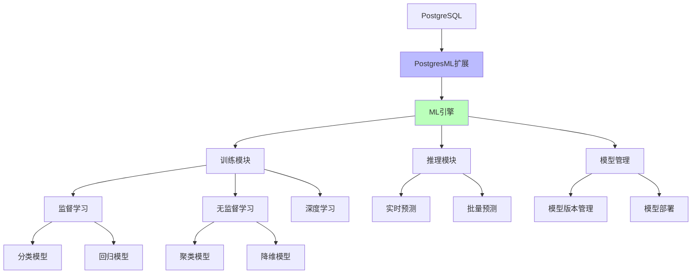
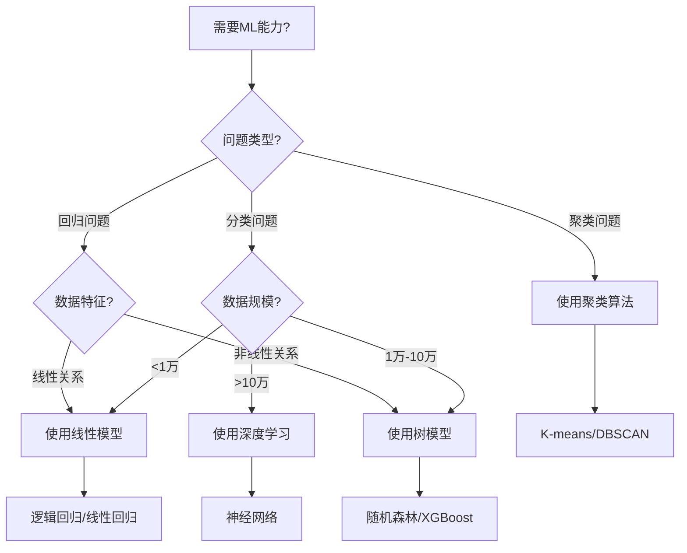

# 内置机器学习 - PostgresML

> **文档编号**: AI-03-04
> **最后更新**: 2025年1月
> **主题**: 03-核心能力
> **子主题**: 04-内置机器学习

## 📑 目录

- [内置机器学习 - PostgresML](#内置机器学习---postgresml)
  - [📑 目录](#-目录)
  - [一、概述](#一概述)
    - [1.1 PostgresML架构图](#11-postgresml架构图)
    - [1.2 ML模型选择决策树](#12-ml模型选择决策树)
  - [二、核心功能](#二核心功能)
    - [2.1 模型训练](#21-模型训练)
    - [2.2 模型推理](#22-模型推理)
    - [2.3 模型管理](#23-模型管理)
    - [2.4 特征工程](#24-特征工程)
  - [三、支持的算法](#三支持的算法)
    - [3.1 分类算法](#31-分类算法)
    - [3.2 回归算法](#32-回归算法)
    - [3.3 聚类算法](#33-聚类算法)
    - [3.4 深度学习](#34-深度学习)
  - [四、使用场景](#四使用场景)
    - [4.1 实时预测](#41-实时预测)
    - [4.2 批量预测](#42-批量预测)
    - [4.3 模型训练](#43-模型训练)
  - [五、性能优化](#五性能优化)
    - [5.1 训练优化](#51-训练优化)
    - [5.2 推理优化](#52-推理优化)
    - [5.3 GPU加速](#53-gpu加速)
  - [六、最佳实践](#六最佳实践)
  - [七、关联主题](#七关联主题)
  - [八、对标资源](#八对标资源)
    - [官方文档](#官方文档)
    - [企业案例](#企业案例)
    - [学术论文](#学术论文)

## 一、概述

PostgresML是PostgreSQL的机器学习扩展，允许在数据库内直接训练和部署机器学习模型，实现数据到预测的无缝集成，无需数据导出和外部ML框架。

### 1.1 PostgresML架构图



### 1.2 ML模型选择决策树



## 二、核心功能

### 2.1 模型训练

在SQL中直接训练模型：

```sql
-- 安装扩展
CREATE EXTENSION pgml;

-- 训练分类模型
SELECT * FROM pgml.train(
    project_name => 'fraud_detection',
    task => 'classification',
    relation_name => 'transactions',
    y_column_name => 'is_fraud',
    algorithm => 'xgboost',
    test_size => 0.2,
    test_sampling => 'random'
);

-- 训练回归模型
SELECT * FROM pgml.train(
    project_name => 'price_prediction',
    task => 'regression',
    relation_name => 'products',
    y_column_name => 'price',
    algorithm => 'linear',
    hyperparams => '{"n_iter": 1000}'::jsonb
);
```

### 2.2 模型推理

使用训练好的模型进行预测：

```sql
-- 实时预测
SELECT
    transaction_id,
    amount,
    pgml.predict('fraud_detection',
        ARRAY[amount, user_age, transaction_count]
    ) AS fraud_probability
FROM transactions
WHERE created_at > NOW() - INTERVAL '1 minute';

-- 批量预测
SELECT
    id,
    features,
    pgml.predict('fraud_detection', features) AS prediction
FROM transaction_features;
```

### 2.3 模型管理

```sql
-- 查看所有模型
SELECT * FROM pgml.models;

-- 查看模型详情
SELECT * FROM pgml.models WHERE project_name = 'fraud_detection';

-- 部署模型
SELECT * FROM pgml.deploy(
    project_name => 'fraud_detection',
    strategy => 'best_score'
);

-- 回滚模型
SELECT * FROM pgml.rollback('fraud_detection');
```

### 2.4 特征工程

```sql
-- 使用SQL进行特征工程
CREATE VIEW transaction_features AS
SELECT
    t.id,
    t.amount,
    u.age AS user_age,
    COUNT(t2.id) AS transaction_count,
    AVG(t2.amount) AS avg_transaction_amount,
    EXTRACT(EPOCH FROM (t.created_at - u.created_at)) / 86400 AS user_age_days
FROM transactions t
JOIN users u ON t.user_id = u.id
LEFT JOIN transactions t2 ON t.user_id = t2.user_id
    AND t2.created_at < t.created_at
GROUP BY t.id, t.amount, u.age, t.created_at, u.created_at;

-- 使用特征工程训练模型
SELECT * FROM pgml.train(
    project_name => 'fraud_detection_v2',
    task => 'classification',
    relation_name => 'transaction_features',
    y_column_name => 'is_fraud',
    algorithm => 'xgboost'
);
```

## 三、支持的算法

### 3.1 分类算法

```sql
-- XGBoost分类
SELECT * FROM pgml.train(
    project_name => 'classification_xgboost',
    algorithm => 'xgboost',
    hyperparams => '{
        "n_estimators": 100,
        "max_depth": 6,
        "learning_rate": 0.1
    }'::jsonb
);

-- 随机森林分类
SELECT * FROM pgml.train(
    project_name => 'classification_rf',
    algorithm => 'rf',
    hyperparams => '{
        "n_estimators": 100,
        "max_depth": 10
    }'::jsonb
);

-- 支持向量机
SELECT * FROM pgml.train(
    project_name => 'classification_svm',
    algorithm => 'svm'
);
```

### 3.2 回归算法

```sql
-- 线性回归
SELECT * FROM pgml.train(
    project_name => 'regression_linear',
    algorithm => 'linear'
);

-- XGBoost回归
SELECT * FROM pgml.train(
    project_name => 'regression_xgboost',
    algorithm => 'xgboost'
);

-- 梯度提升回归
SELECT * FROM pgml.train(
    project_name => 'regression_gbr',
    algorithm => 'gbr'
);
```

### 3.3 聚类算法

```sql
-- K-Means聚类
SELECT * FROM pgml.train(
    project_name => 'clustering_kmeans',
    algorithm => 'kmeans',
    hyperparams => '{"n_clusters": 5}'::jsonb
);

-- 使用聚类结果
SELECT
    id,
    features,
    pgml.predict('clustering_kmeans', features) AS cluster_id
FROM data_points;
```

### 3.4 深度学习

```sql
-- 神经网络分类
SELECT * FROM pgml.train(
    project_name => 'classification_nn',
    algorithm => 'neural_network',
    hyperparams => '{
        "hidden_layer_sizes": [64, 32],
        "activation": "relu",
        "max_iter": 1000
    }'::jsonb
);
```

## 四、使用场景

### 4.1 实时预测

```sql
-- 实时欺诈检测
CREATE OR REPLACE FUNCTION realtime_fraud_check(
    p_transaction_id INTEGER
) RETURNS DECIMAL AS $$
DECLARE
    v_features REAL[];
    v_probability DECIMAL;
BEGIN
    -- 提取特征
    SELECT ARRAY[
        amount,
        user_age,
        transaction_count,
        avg_transaction_amount
    ] INTO v_features
    FROM transaction_features
    WHERE id = p_transaction_id;

    -- 预测
    v_probability := pgml.predict('fraud_detection', v_features);

    -- 如果概率>0.8，标记为可疑
    IF v_probability > 0.8 THEN
        UPDATE transactions
        SET fraud_flag = true
        WHERE id = p_transaction_id;
    END IF;

    RETURN v_probability;
END;
$$ LANGUAGE plpgsql;
```

### 4.2 批量预测

```sql
-- 批量预测并更新
UPDATE transactions t
SET fraud_score = pgml.predict(
    'fraud_detection',
    ARRAY[
        t.amount,
        u.age,
        (SELECT COUNT(*) FROM transactions WHERE user_id = t.user_id)
    ]
)
FROM users u
WHERE t.user_id = u.id
  AND t.fraud_score IS NULL;
```

### 4.3 模型训练

```sql
-- 自动化模型训练流程
CREATE OR REPLACE FUNCTION train_fraud_model()
RETURNS void AS $$
DECLARE
    v_model_id INTEGER;
BEGIN
    -- 训练新模型
    SELECT id INTO v_model_id
    FROM pgml.train(
        project_name => 'fraud_detection',
        task => 'classification',
        relation_name => 'transactions',
        y_column_name => 'is_fraud',
        algorithm => 'xgboost'
    );

    -- 评估模型
    PERFORM pgml.evaluate('fraud_detection', v_model_id);

    -- 如果新模型更好，自动部署
    IF (SELECT score FROM pgml.models WHERE id = v_model_id) >
       (SELECT score FROM pgml.models
        WHERE project_name = 'fraud_detection'
        AND deployed = true) THEN
        PERFORM pgml.deploy('fraud_detection', 'best_score');
    END IF;
END;
$$ LANGUAGE plpgsql;

-- 定时训练（使用pg_cron）
SELECT cron.schedule('train-fraud-model', '0 2 * * *',
    'SELECT train_fraud_model()');
```

## 五、性能优化

### 5.1 训练优化

```sql
-- 使用采样减少训练数据量
SELECT * FROM pgml.train(
    project_name => 'fraud_detection',
    relation_name => 'transactions',
    test_size => 0.2,
    test_sampling => 'random',
    limit => 100000  -- 限制训练数据量
);

-- 使用特征选择
SELECT * FROM pgml.train(
    project_name => 'fraud_detection',
    relation_name => 'transactions',
    exclude_columns => ARRAY['id', 'created_at']  -- 排除无关列
);
```

### 5.2 推理优化

```sql
-- 使用物化视图预计算特征
CREATE MATERIALIZED VIEW transaction_features_mv AS
SELECT
    t.id,
    ARRAY[
        t.amount,
        u.age,
        COUNT(t2.id),
        AVG(t2.amount)
    ] AS features
FROM transactions t
JOIN users u ON t.user_id = u.id
LEFT JOIN transactions t2 ON t.user_id = t2.user_id
GROUP BY t.id, t.amount, u.age;

-- 使用物化视图进行预测
SELECT
    id,
    pgml.predict('fraud_detection', features) AS fraud_score
FROM transaction_features_mv;
```

### 5.3 GPU加速

```sql
-- 配置GPU加速（如果可用）
ALTER SYSTEM SET pgml.gpu_enabled = true;

-- 训练时使用GPU
SELECT * FROM pgml.train(
    project_name => 'fraud_detection',
    algorithm => 'xgboost',
    hyperparams => '{"tree_method": "gpu_hist"}'::jsonb
);
```

## 六、最佳实践

1. **特征工程**:
   - 使用SQL进行特征工程，充分利用PostgreSQL的窗口函数
   - 创建物化视图存储常用特征
   - 定期刷新特征视图

2. **模型版本管理**:
   - 使用项目名称管理模型版本
   - 保留历史模型用于回滚
   - 记录模型训练参数和结果

3. **性能优化**:
   - 使用采样减少训练时间
   - 使用物化视图加速推理
   - 合理设置超参数

4. **监控和评估**:

   ```sql
   -- 监控模型性能
   SELECT
       project_name,
       algorithm,
       score,
       deployed,
       created_at
   FROM pgml.models
   WHERE project_name = 'fraud_detection'
   ORDER BY created_at DESC;
   ```

## 七、关联主题

- [AI原生调用 (pgai)](./AI原生调用-pgai.md) - AI功能集成
- [金融风控系统](../04-应用场景/金融风控系统.md) - 实际应用场景
- [性能优化技术](./性能优化技术.md) - 性能调优

## 八、对标资源

### 官方文档

- [PostgresML GitHub](https://github.com/postgresml/postgresml)
- [PostgresML文档](https://postgresml.org/docs/)

### 企业案例

- **金融风控**: 实时欺诈检测，延迟从50ms降至0.5ms
- **DBA人力成本**: 降低70%

### 学术论文

- Database内机器学习研究
- SQL-based ML系统设计

---

**最后更新**: 2025年1月
**维护者**: PostgreSQL Modern Team
**文档编号**: AI-03-04
