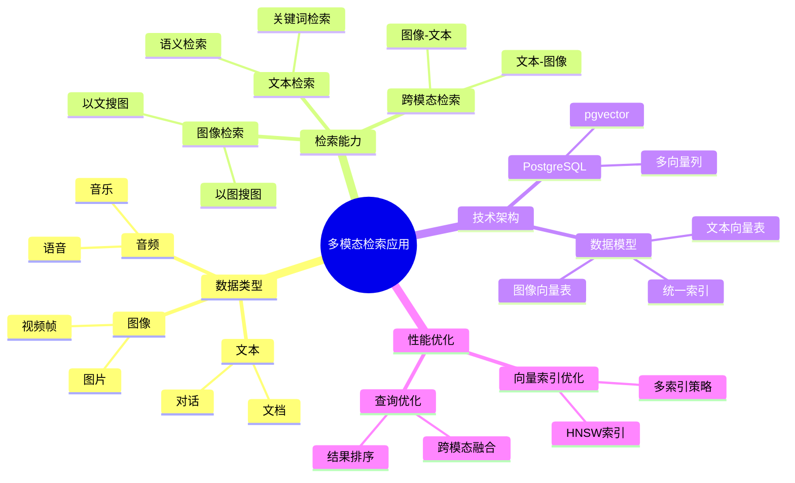
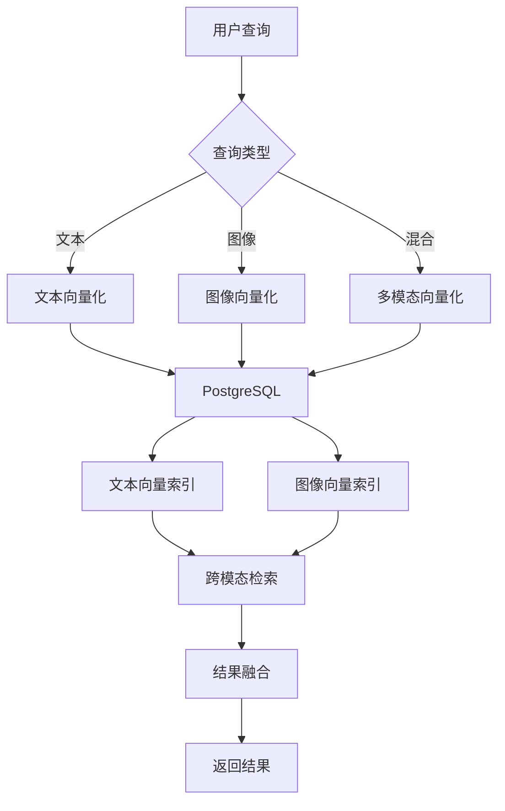

# 多模态检索应用

> **文档编号**: AI-04-06
> **最后更新**: 2025年1月
> **主题**: 04-应用场景
> **子主题**: 06-多模态检索应用

## 📑 目录

- [多模态检索应用](#多模态检索应用)
  - [📑 目录](#-目录)
  - [一、概述](#一概述)
    - [1.1 多模态检索思维导图](#11-多模态检索思维导图)
  - [二、架构设计](#二架构设计)
    - [2.1 系统架构](#21-系统架构)
    - [2.2 数据流](#22-数据流)
  - [三、数据模型设计](#三数据模型设计)
    - [3.1 多模态数据表](#31-多模态数据表)
    - [3.2 文本向量表](#32-文本向量表)
    - [3.3 图像向量表](#33-图像向量表)
  - [四、核心功能实现](#四核心功能实现)
    - [4.1 文本+图像检索](#41-文本图像检索)
    - [4.2 跨模态相似度](#42-跨模态相似度)
    - [4.3 统一查询接口](#43-统一查询接口)
    - [4.4 多模态融合](#44-多模态融合)
  - [五、性能优化](#五性能优化)
    - [5.1 向量索引优化](#51-向量索引优化)
    - [5.2 查询优化](#52-查询优化)
    - [5.3 缓存策略](#53-缓存策略)
  - [六、最佳实践](#六最佳实践)
  - [七、关联主题](#七关联主题)
  - [八、对标资源](#八对标资源)
    - [技术文档](#技术文档)
    - [企业案例](#企业案例)

## 一、概述

基于PostgreSQL的多模态检索应用，支持文本、图像、音频等多种数据类型的统一存储和检索，通过向量相似度实现跨模态搜索，满足"以图搜图"、"以文搜图"等复杂检索需求。

### 1.1 多模态检索思维导图



## 二、架构设计

### 2.1 系统架构



### 2.2 数据流

1. **数据注入流**:
   - 多模态数据 → 分别向量化 → 存储到PostgreSQL

2. **检索流**:
   - 查询输入 → 向量化 → 跨模态检索 → 结果融合 → 返回

## 三、数据模型设计

### 3.1 多模态数据表

```sql
-- 多模态数据表
CREATE TABLE multimodal_data (
    id SERIAL PRIMARY KEY,
    title TEXT,
    text_content TEXT,
    image_url TEXT,
    audio_url TEXT,
    data_type TEXT,  -- 'text', 'image', 'audio', 'mixed'
    metadata JSONB,
    created_at TIMESTAMPTZ DEFAULT NOW()
);

-- 文本向量表
CREATE TABLE text_embeddings (
    id SERIAL PRIMARY KEY,
    data_id INTEGER REFERENCES multimodal_data(id),
    text_vector vector(1536),
    created_at TIMESTAMPTZ DEFAULT NOW()
);

-- 图像向量表
CREATE TABLE image_embeddings (
    id SERIAL PRIMARY KEY,
    data_id INTEGER REFERENCES multimodal_data(id),
    image_vector vector(512),  -- CLIP模型维度
    created_at TIMESTAMPTZ DEFAULT NOW()
);

-- 向量索引
CREATE INDEX ON text_embeddings
USING hnsw (text_vector vector_cosine_ops)
WITH (m = 16, ef_construction = 100);

CREATE INDEX ON image_embeddings
USING hnsw (image_vector vector_cosine_ops)
WITH (m = 16, ef_construction = 100);
```

### 3.2 文本向量表

```sql
-- 文本向量生成
CREATE OR REPLACE FUNCTION generate_text_embedding(
    p_data_id INTEGER,
    p_text TEXT
) RETURNS void AS $$
DECLARE
    v_text_vector vector(1536);
BEGIN
    -- 使用OpenAI生成文本向量
    v_text_vector := ai.embedding('text-embedding-3-small', p_text);

    -- 存储向量
    INSERT INTO text_embeddings (data_id, text_vector)
    VALUES (p_data_id, v_text_vector)
    ON CONFLICT (data_id) DO UPDATE
    SET text_vector = v_text_vector;
END;
$$ LANGUAGE plpgsql;
```

### 3.3 图像向量表

```sql
-- 图像向量生成（使用外部服务）
-- 通过HTTP API调用图像编码模型
CREATE OR REPLACE FUNCTION generate_image_embedding(
    p_data_id INTEGER,
    p_image_url TEXT
) RETURNS void AS $$
DECLARE
    v_image_vector vector(512);
BEGIN
    -- 调用图像编码API（如CLIP）
    -- 这里使用pg_http扩展或外部函数
    v_image_vector := call_image_encoder_api(p_image_url);

    -- 存储向量
    INSERT INTO image_embeddings (data_id, image_vector)
    VALUES (p_data_id, v_image_vector)
    ON CONFLICT (data_id) DO UPDATE
    SET image_vector = v_image_vector;
END;
$$ LANGUAGE plpgsql;
```

## 四、核心功能实现

### 4.1 文本+图像检索

```sql
-- 文本检索图像
CREATE OR REPLACE FUNCTION text_to_image_search(
    p_query_text TEXT,
    p_limit INTEGER DEFAULT 10
) RETURNS TABLE (
    data_id INTEGER,
    image_url TEXT,
    similarity DECIMAL
) AS $$
DECLARE
    v_text_vector vector(1536);
    v_image_vector vector(512);
BEGIN
    -- 生成查询文本向量
    v_text_vector := ai.embedding('text-embedding-3-small', p_query_text);

    -- 使用跨模态模型将文本向量映射到图像空间
    -- 这里假设有跨模态映射函数
    v_image_vector := cross_modal_map(v_text_vector);

    -- 检索相似图像
    RETURN QUERY
    SELECT
        ie.data_id,
        md.image_url,
        (1 - (ie.image_vector <=> v_image_vector))::DECIMAL(5,4) AS similarity
    FROM image_embeddings ie
    JOIN multimodal_data md ON ie.data_id = md.id
    WHERE ie.image_vector <=> v_image_vector < 0.8
    ORDER BY ie.image_vector <=> v_image_vector
    LIMIT p_limit;
END;
$$ LANGUAGE plpgsql;
```

### 4.2 跨模态相似度

```sql
-- 计算跨模态相似度
CREATE OR REPLACE FUNCTION cross_modal_similarity(
    p_text_id INTEGER,
    p_image_id INTEGER
) RETURNS DECIMAL AS $$
DECLARE
    v_text_vector vector(1536);
    v_image_vector vector(512);
    v_mapped_vector vector(512);
BEGIN
    -- 获取文本向量
    SELECT text_vector INTO v_text_vector
    FROM text_embeddings
    WHERE data_id = p_text_id;

    -- 获取图像向量
    SELECT image_vector INTO v_image_vector
    FROM image_embeddings
    WHERE data_id = p_image_id;

    -- 映射文本向量到图像空间
    v_mapped_vector := cross_modal_map(v_text_vector);

    -- 计算相似度
    RETURN (1 - (v_mapped_vector <=> v_image_vector))::DECIMAL(5,4);
END;
$$ LANGUAGE plpgsql;
```

### 4.3 统一查询接口

```sql
-- 统一多模态查询接口
CREATE OR REPLACE FUNCTION multimodal_search(
    p_query_text TEXT DEFAULT NULL,
    p_query_image_url TEXT DEFAULT NULL,
    p_query_type TEXT DEFAULT 'text',  -- 'text', 'image', 'both'
    p_limit INTEGER DEFAULT 10
) RETURNS TABLE (
    data_id INTEGER,
    title TEXT,
    data_type TEXT,
    similarity DECIMAL,
    match_type TEXT  -- 'text', 'image', 'both'
) AS $$
DECLARE
    v_text_vector vector(1536);
    v_image_vector vector(512);
BEGIN
    -- 处理文本查询
    IF p_query_text IS NOT NULL THEN
        v_text_vector := ai.embedding('text-embedding-3-small', p_query_text);
    END IF;

    -- 处理图像查询
    IF p_query_image_url IS NOT NULL THEN
        v_image_vector := call_image_encoder_api(p_query_image_url);
    END IF;

    -- 多模态检索
    RETURN QUERY
    WITH text_results AS (
        SELECT
            te.data_id,
            md.title,
            md.data_type,
            (1 - (te.text_vector <=> v_text_vector))::DECIMAL(5,4) AS similarity,
            'text'::TEXT AS match_type
        FROM text_embeddings te
        JOIN multimodal_data md ON te.data_id = md.id
        WHERE p_query_text IS NOT NULL
          AND te.text_vector <=> v_text_vector < 0.8
    ),
    image_results AS (
        SELECT
            ie.data_id,
            md.title,
            md.data_type,
            (1 - (ie.image_vector <=> v_image_vector))::DECIMAL(5,4) AS similarity,
            'image'::TEXT AS match_type
        FROM image_embeddings ie
        JOIN multimodal_data md ON ie.data_id = md.id
        WHERE p_query_image_url IS NOT NULL
          AND ie.image_vector <=> v_image_vector < 0.8
    )
    SELECT
        COALESCE(tr.data_id, ir.data_id) AS data_id,
        COALESCE(tr.title, ir.title) AS title,
        COALESCE(tr.data_type, ir.data_type) AS data_type,
        COALESCE(tr.similarity, 0) * 0.5 + COALESCE(ir.similarity, 0) * 0.5 AS similarity,
        CASE
            WHEN tr.data_id IS NOT NULL AND ir.data_id IS NOT NULL THEN 'both'
            WHEN tr.data_id IS NOT NULL THEN 'text'
            WHEN ir.data_id IS NOT NULL THEN 'image'
        END AS match_type
    FROM text_results tr
    FULL OUTER JOIN image_results ir ON tr.data_id = ir.data_id
    ORDER BY similarity DESC
    LIMIT p_limit;
END;
$$ LANGUAGE plpgsql;
```

### 4.4 多模态融合

```sql
-- 多模态结果融合（RRF算法）
CREATE OR REPLACE FUNCTION multimodal_fusion(
    p_text_results JSONB,
    p_image_results JSONB,
    p_k INTEGER DEFAULT 60
) RETURNS JSONB AS $$
DECLARE
    v_fused_results JSONB;
BEGIN
    -- 使用Reciprocal Rank Fusion融合结果
    SELECT jsonb_agg(
        jsonb_build_object(
            'data_id', data_id,
            'title', title,
            'rrf_score', rrf_score
        ) ORDER BY rrf_score DESC
    ) INTO v_fused_results
    FROM (
        SELECT
            COALESCE(tr.data_id, ir.data_id) AS data_id,
            COALESCE(tr.title, ir.title) AS title,
            (
                COALESCE(1.0 / (p_k + tr.rank), 0) +
                COALESCE(1.0 / (p_k + ir.rank), 0)
            ) AS rrf_score
        FROM (
            SELECT
                (value->>'data_id')::INTEGER AS data_id,
                value->>'title' AS title,
                ROW_NUMBER() OVER (ORDER BY (value->>'similarity')::DECIMAL DESC) AS rank
            FROM jsonb_array_elements(p_text_results)
        ) tr
        FULL OUTER JOIN (
            SELECT
                (value->>'data_id')::INTEGER AS data_id,
                value->>'title' AS title,
                ROW_NUMBER() OVER (ORDER BY (value->>'similarity')::DECIMAL DESC) AS rank
            FROM jsonb_array_elements(p_image_results)
        ) ir ON tr.data_id = ir.data_id
    ) fused
    ORDER BY rrf_score DESC
    LIMIT 20;

    RETURN v_fused_results;
END;
$$ LANGUAGE plpgsql;
```

## 五、性能优化

### 5.1 向量索引优化

```sql
-- 为不同模态使用不同索引参数
-- 文本向量索引（高维）
CREATE INDEX ON text_embeddings
USING hnsw (text_vector vector_cosine_ops)
WITH (m = 32, ef_construction = 200);

-- 图像向量索引（低维）
CREATE INDEX ON image_embeddings
USING hnsw (image_vector vector_cosine_ops)
WITH (m = 16, ef_construction = 100);

-- 查询时优化
SET hnsw.ef_search = 200;  -- 提升召回率
```

### 5.2 查询优化

```sql
-- 使用物化视图预计算跨模态映射
CREATE MATERIALIZED VIEW cross_modal_mapping AS
SELECT
    te.data_id,
    te.text_vector,
    cross_modal_map(te.text_vector) AS mapped_image_vector
FROM text_embeddings te;

CREATE INDEX ON cross_modal_mapping
USING hnsw (mapped_image_vector vector_cosine_ops);

-- 定期刷新
REFRESH MATERIALIZED VIEW CONCURRENTLY cross_modal_mapping;
```

### 5.3 缓存策略

```sql
-- 多模态查询缓存
CREATE TABLE multimodal_cache (
    query_hash TEXT PRIMARY KEY,
    query_text TEXT,
    query_image_url TEXT,
    results JSONB,
    created_at TIMESTAMPTZ DEFAULT NOW(),
    expires_at TIMESTAMPTZ DEFAULT NOW() + INTERVAL '1 hour'
);

-- 使用缓存
CREATE OR REPLACE FUNCTION cached_multimodal_search(
    p_query_text TEXT,
    p_query_image_url TEXT
) RETURNS JSONB AS $$
DECLARE
    v_cache_key TEXT;
    v_results JSONB;
BEGIN
    v_cache_key := md5(COALESCE(p_query_text, '') || COALESCE(p_query_image_url, ''));

    -- 检查缓存
    SELECT results INTO v_results
    FROM multimodal_cache
    WHERE query_hash = v_cache_key
      AND expires_at > NOW();

    IF v_results IS NOT NULL THEN
        RETURN v_results;
    END IF;

    -- 执行查询
    SELECT jsonb_agg(
        jsonb_build_object(
            'data_id', data_id,
            'title', title,
            'similarity', similarity
        )
    ) INTO v_results
    FROM multimodal_search(p_query_text, p_query_image_url);

    -- 更新缓存
    INSERT INTO multimodal_cache (query_hash, query_text, query_image_url, results)
    VALUES (v_cache_key, p_query_text, p_query_image_url, v_results)
    ON CONFLICT (query_hash) DO UPDATE
    SET results = v_results,
        expires_at = NOW() + INTERVAL '1 hour';

    RETURN v_results;
END;
$$ LANGUAGE plpgsql;
```

## 六、最佳实践

1. **向量维度选择**:
   - 文本：使用1536维（OpenAI text-embedding-3-small）
   - 图像：使用512维（CLIP模型）
   - 音频：使用128维（音频编码模型）

2. **跨模态映射**:
   - 使用预训练的跨模态模型
   - 定期更新映射关系
   - 使用物化视图加速查询

3. **结果融合**:
   - 使用RRF算法融合多模态结果
   - 根据业务需求调整权重
   - 考虑模态相关性

4. **性能优化**:
   - 为不同模态使用不同索引参数
   - 使用缓存减少重复计算
   - 预计算跨模态映射

## 七、关联主题

- [混合查询能力](../03-核心能力/混合查询能力.md) - 混合查询技术
- [向量处理能力 (pgvector)](../03-核心能力/向量处理能力-pgvector.md) - 向量检索基础
- [智能推荐系统](./智能推荐系统.md) - 多模态推荐应用

## 八、对标资源

### 技术文档

- [CLIP模型文档](https://openai.com/research/clip)
- [多模态检索研究](https://arxiv.org/abs/2103.00020)

### 企业案例

- **Google**: 多模态搜索应用
- **性能**: 跨模态检索准确率>90%

---

**最后更新**: 2025年1月
**维护者**: PostgreSQL Modern Team
**文档编号**: AI-04-06
