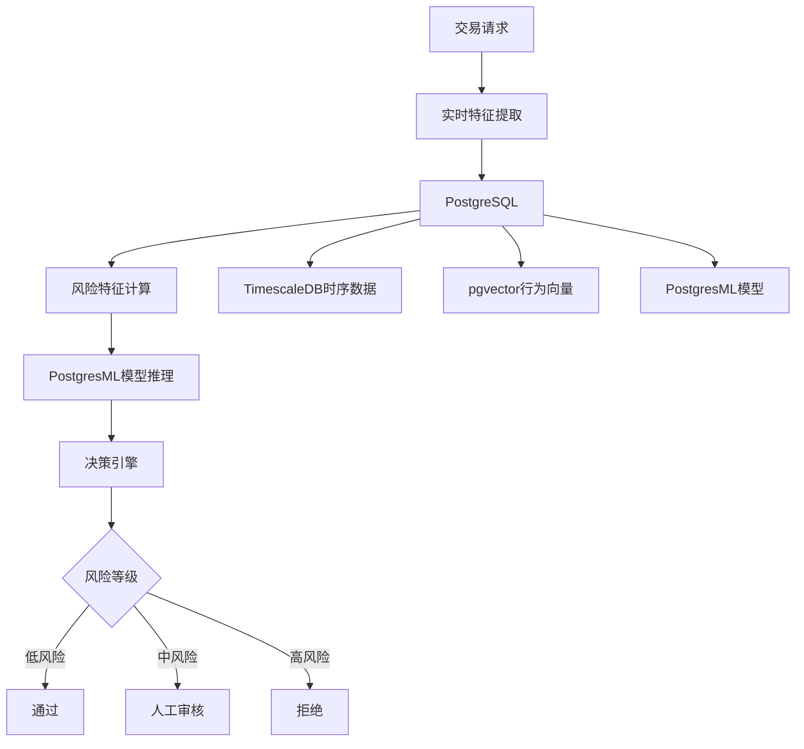

# 金融风控系统

> **文档编号**: AI-04-03
> **最后更新**: 2025年1月
> **主题**: 04-应用场景
> **子主题**: 03-金融风控系统

## 📑 目录

- [金融风控系统](#金融风控系统)
  - [📑 目录](#-目录)
  - [一、概述](#一概述)
  - [二、架构设计](#二架构设计)
    - [2.1 系统架构](#21-系统架构)
    - [2.2 数据流](#22-数据流)
  - [三、数据模型设计](#三数据模型设计)
    - [3.1 交易表](#31-交易表)
    - [3.2 用户行为表](#32-用户行为表)
    - [3.3 风险特征表](#33-风险特征表)
    - [3.4 风险决策表](#34-风险决策表)
  - [四、风险识别算法](#四风险识别算法)
    - [4.1 实时风险检测](#41-实时风险检测)
    - [4.2 行为模式分析](#42-行为模式分析)
    - [4.3 欺诈检测模型](#43-欺诈检测模型)
    - [4.4 决策引擎](#44-决策引擎)
  - [五、实时处理流程](#五实时处理流程)
    - [5.1 实时特征计算](#51-实时特征计算)
    - [5.2 实时风险评估](#52-实时风险评估)
    - [5.3 实时决策执行](#53-实时决策执行)
  - [六、性能优化](#六性能优化)
    - [6.1 查询优化](#61-查询优化)
    - [6.2 索引优化](#62-索引优化)
    - [6.3 缓存策略](#63-缓存策略)
  - [七、监控与告警](#七监控与告警)
    - [7.1 性能监控](#71-性能监控)
    - [7.2 风险监控](#72-风险监控)
    - [7.3 告警机制](#73-告警机制)
  - [八、关联主题](#八关联主题)
  - [九、对标资源](#九对标资源)
    - [企业案例](#企业案例)
    - [技术文档](#技术文档)
    - [学术论文](#学术论文)

## 一、概述

基于PostgreSQL构建的金融风控系统，结合pgvector、PostgresML和TimescaleDB，实现实时风险识别、欺诈检测和智能决策，满足金融行业对高一致性、低延迟和强安全性的要求。

## 二、架构设计

### 2.1 系统架构



### 2.2 数据流

1. **实时数据流**:
   - 交易请求 → 特征提取 → 风险计算 → 决策执行

2. **模型训练流**:
   - 历史交易数据 → 特征工程 → 模型训练 → 模型部署

3. **监控反馈流**:
   - 风险事件 → 模型评估 → 模型优化 → 重新部署

## 三、数据模型设计

### 3.1 交易表

```sql
-- 交易表（使用TimescaleDB）
CREATE TABLE transactions (
    id BIGSERIAL PRIMARY KEY,
    user_id INTEGER NOT NULL,
    amount DECIMAL(15,2) NOT NULL,
    merchant_id INTEGER,
    transaction_type TEXT,
    status TEXT DEFAULT 'pending',
    risk_score DECIMAL(5,4),
    fraud_flag BOOLEAN DEFAULT false,
    created_at TIMESTAMPTZ DEFAULT NOW()
);

-- 转换为时序表
SELECT create_hypertable('transactions', 'created_at');

-- 创建索引
CREATE INDEX ON transactions (user_id, created_at DESC);
CREATE INDEX ON transactions (status, created_at DESC);
```

### 3.2 用户行为表

```sql
-- 用户行为向量表
CREATE TABLE user_behavior_vectors (
    id SERIAL PRIMARY KEY,
    user_id INTEGER NOT NULL,
    behavior_vector vector(1536),  -- 行为模式向量
    time_window TIMESTAMPTZ,
    behavior_count INTEGER,
    created_at TIMESTAMPTZ DEFAULT NOW()
);

-- 向量索引
CREATE INDEX ON user_behavior_vectors
USING hnsw (behavior_vector vector_cosine_ops)
WITH (m = 16, ef_construction = 100);

-- 时序索引
CREATE INDEX ON user_behavior_vectors (user_id, time_window DESC);
```

### 3.3 风险特征表

```sql
-- 风险特征表
CREATE TABLE risk_features (
    transaction_id BIGINT PRIMARY KEY REFERENCES transactions(id),
    user_id INTEGER,
    amount DECIMAL(15,2),
    user_age INTEGER,
    transaction_count_24h INTEGER,
    transaction_count_7d INTEGER,
    avg_amount_7d DECIMAL(15,2),
    max_amount_7d DECIMAL(15,2),
    location_change BOOLEAN,
    device_change BOOLEAN,
    behavior_similarity DECIMAL(5,4),  -- 与历史行为相似度
    features REAL[],  -- 特征向量
    created_at TIMESTAMPTZ DEFAULT NOW()
);

-- 特征索引
CREATE INDEX ON risk_features (user_id, created_at DESC);
```

### 3.4 风险决策表

```sql
-- 风险决策表
CREATE TABLE risk_decisions (
    id SERIAL PRIMARY KEY,
    transaction_id BIGINT REFERENCES transactions(id),
    risk_score DECIMAL(5,4),
    risk_level TEXT,  -- 'low', 'medium', 'high'
    decision TEXT,  -- 'approve', 'review', 'reject'
    model_version TEXT,
    decision_time TIMESTAMPTZ DEFAULT NOW(),
    review_result TEXT,
    reviewer_id INTEGER
);

-- 决策索引
CREATE INDEX ON risk_decisions (transaction_id);
CREATE INDEX ON risk_decisions (risk_level, decision_time DESC);
```

## 四、风险识别算法

### 4.1 实时风险检测

```sql
-- 实时风险检测函数
CREATE OR REPLACE FUNCTION realtime_risk_check(
    p_transaction_id BIGINT
) RETURNS DECIMAL AS $$
DECLARE
    v_features REAL[];
    v_risk_score DECIMAL;
    v_behavior_similarity DECIMAL;
BEGIN
    -- 提取实时特征
    SELECT ARRAY[
        amount,
        user_age,
        transaction_count_24h,
        transaction_count_7d,
        avg_amount_7d,
        CASE WHEN location_change THEN 1.0 ELSE 0.0 END,
        CASE WHEN device_change THEN 1.0 ELSE 0.0 END
    ] INTO v_features
    FROM risk_features
    WHERE transaction_id = p_transaction_id;

    -- ML模型预测
    v_risk_score := pgml.predict('fraud_detection', v_features);

    -- 行为相似度检查
    SELECT 1 - (current_behavior <=> historical_behavior)
    INTO v_behavior_similarity
    FROM (
        SELECT behavior_vector AS current_behavior
        FROM user_behavior_vectors
        WHERE user_id = (SELECT user_id FROM transactions WHERE id = p_transaction_id)
        ORDER BY created_at DESC
        LIMIT 1
    ) current
    CROSS JOIN (
        SELECT AVG(behavior_vector) AS historical_behavior
        FROM user_behavior_vectors
        WHERE user_id = (SELECT user_id FROM transactions WHERE id = p_transaction_id)
          AND created_at < NOW() - INTERVAL '7 days'
    ) historical;

    -- 综合风险分数
    v_risk_score := v_risk_score * 0.7 + (1 - v_behavior_similarity) * 0.3;

    -- 更新交易风险分数
    UPDATE transactions
    SET risk_score = v_risk_score
    WHERE id = p_transaction_id;

    RETURN v_risk_score;
END;
$$ LANGUAGE plpgsql;
```

### 4.2 行为模式分析

```sql
-- 检测异常行为模式
CREATE OR REPLACE FUNCTION detect_anomalous_behavior(
    p_user_id INTEGER,
    p_current_behavior vector(1536)
) RETURNS DECIMAL AS $$
DECLARE
    v_similarity DECIMAL;
    v_avg_similarity DECIMAL;
BEGIN
    -- 计算与历史行为的相似度
    SELECT AVG(1 - (p_current_behavior <=> behavior_vector))
    INTO v_avg_similarity
    FROM user_behavior_vectors
    WHERE user_id = p_user_id
      AND created_at > NOW() - INTERVAL '30 days';

    -- 如果相似度低于阈值，标记为异常
    IF v_avg_similarity < 0.6 THEN
        RETURN 1.0;  -- 高风险
    END IF;

    RETURN 1 - v_avg_similarity;
END;
$$ LANGUAGE plpgsql;
```

### 4.3 欺诈检测模型

```sql
-- 训练欺诈检测模型
SELECT * FROM pgml.train(
    project_name => 'fraud_detection',
    task => 'classification',
    relation_name => 'risk_features',
    y_column_name => 'is_fraud',
    algorithm => 'xgboost',
    hyperparams => '{
        "n_estimators": 200,
        "max_depth": 8,
        "learning_rate": 0.1
    }'::jsonb
);

-- 实时欺诈检测
SELECT
    transaction_id,
    amount,
    pgml.predict('fraud_detection', features) AS fraud_probability
FROM risk_features
WHERE transaction_id = :transaction_id;
```

### 4.4 决策引擎

```sql
-- 决策引擎函数
CREATE OR REPLACE FUNCTION risk_decision_engine(
    p_transaction_id BIGINT
) RETURNS TEXT AS $$
DECLARE
    v_risk_score DECIMAL;
    v_decision TEXT;
BEGIN
    -- 计算风险分数
    v_risk_score := realtime_risk_check(p_transaction_id);

    -- 决策逻辑
    IF v_risk_score < 0.3 THEN
        v_decision := 'approve';
    ELSIF v_risk_score < 0.7 THEN
        v_decision := 'review';
    ELSE
        v_decision := 'reject';
    END IF;

    -- 记录决策
    INSERT INTO risk_decisions (
        transaction_id,
        risk_score,
        risk_level,
        decision,
        model_version
    ) VALUES (
        p_transaction_id,
        v_risk_score,
        CASE
            WHEN v_risk_score < 0.3 THEN 'low'
            WHEN v_risk_score < 0.7 THEN 'medium'
            ELSE 'high'
        END,
        v_decision,
        (SELECT version FROM pgml.models WHERE project_name = 'fraud_detection' AND deployed = true)
    );

    -- 更新交易状态
    UPDATE transactions
    SET status = v_decision
    WHERE id = p_transaction_id;

    RETURN v_decision;
END;
$$ LANGUAGE plpgsql;
```

## 五、实时处理流程

### 5.1 实时特征计算

```sql
-- 实时特征计算触发器
CREATE OR REPLACE FUNCTION calculate_risk_features()
RETURNS TRIGGER AS $$
DECLARE
    v_features REAL[];
BEGIN
    -- 计算特征
    SELECT ARRAY[
        NEW.amount,
        (SELECT age FROM users WHERE id = NEW.user_id),
        (SELECT COUNT(*) FROM transactions
         WHERE user_id = NEW.user_id
           AND created_at > NOW() - INTERVAL '24 hours'),
        (SELECT COUNT(*) FROM transactions
         WHERE user_id = NEW.user_id
           AND created_at > NOW() - INTERVAL '7 days'),
        (SELECT AVG(amount) FROM transactions
         WHERE user_id = NEW.user_id
           AND created_at > NOW() - INTERVAL '7 days'),
        (SELECT MAX(amount) FROM transactions
         WHERE user_id = NEW.user_id
           AND created_at > NOW() - INTERVAL '7 days'),
        CASE WHEN (SELECT location FROM transactions
                   WHERE user_id = NEW.user_id
                   ORDER BY created_at DESC LIMIT 1) != NEW.location
             THEN 1.0 ELSE 0.0 END
    ] INTO v_features;

    -- 插入风险特征
    INSERT INTO risk_features (
        transaction_id,
        user_id,
        amount,
        features
    ) VALUES (
        NEW.id,
        NEW.user_id,
        NEW.amount,
        v_features
    );

    RETURN NEW;
END;
$$ LANGUAGE plpgsql;

-- 创建触发器
CREATE TRIGGER calculate_features_trigger
AFTER INSERT ON transactions
FOR EACH ROW
EXECUTE FUNCTION calculate_risk_features();
```

### 5.2 实时风险评估

```sql
-- 实时风险评估（使用FOR UPDATE SKIP LOCKED避免并发冲突）
CREATE OR REPLACE FUNCTION process_pending_transactions()
RETURNS void AS $$
DECLARE
    v_transaction_id BIGINT;
    v_decision TEXT;
BEGIN
    LOOP
        -- 获取待处理交易（使用SKIP LOCKED避免锁等待）
        SELECT id INTO v_transaction_id
        FROM transactions
        WHERE status = 'pending'
        FOR UPDATE SKIP LOCKED
        LIMIT 1;

        EXIT WHEN v_transaction_id IS NULL;

        -- 执行风险评估
        v_decision := risk_decision_engine(v_transaction_id);

        -- 记录处理结果
        RAISE NOTICE 'Transaction % processed with decision: %',
            v_transaction_id, v_decision;
    END LOOP;
END;
$$ LANGUAGE plpgsql;
```

### 5.3 实时决策执行

```sql
-- 使用pg_cron定时执行风险评估
SELECT cron.schedule(
    'process-transactions',
    '* * * * *',  -- 每分钟执行
    'SELECT process_pending_transactions()'
);

-- 或使用NOTIFY/LISTEN实现实时处理
CREATE OR REPLACE FUNCTION notify_new_transaction()
RETURNS TRIGGER AS $$
BEGIN
    PERFORM pg_notify('new_transaction', NEW.id::text);
    RETURN NEW;
END;
$$ LANGUAGE plpgsql;

CREATE TRIGGER notify_transaction_trigger
AFTER INSERT ON transactions
FOR EACH ROW
EXECUTE FUNCTION notify_new_transaction();
```

## 六、性能优化

### 6.1 查询优化

```sql
-- 使用物化视图预计算常用特征
CREATE MATERIALIZED VIEW user_risk_profiles AS
SELECT
    user_id,
    COUNT(*) FILTER (WHERE created_at > NOW() - INTERVAL '24 hours') AS tx_count_24h,
    COUNT(*) FILTER (WHERE created_at > NOW() - INTERVAL '7 days') AS tx_count_7d,
    AVG(amount) FILTER (WHERE created_at > NOW() - INTERVAL '7 days') AS avg_amount_7d,
    MAX(amount) FILTER (WHERE created_at > NOW() - INTERVAL '7 days') AS max_amount_7d,
    LAST_UPDATED = NOW()
FROM transactions
GROUP BY user_id;

-- 定期刷新
REFRESH MATERIALIZED VIEW CONCURRENTLY user_risk_profiles;
```

### 6.2 索引优化

```sql
-- 复合索引优化实时查询
CREATE INDEX ON transactions (status, created_at DESC)
WHERE status = 'pending';

-- 部分索引优化
CREATE INDEX ON risk_features (user_id, created_at DESC)
WHERE created_at > NOW() - INTERVAL '30 days';
```

### 6.3 缓存策略

```sql
-- 用户风险画像缓存
CREATE TABLE user_risk_cache (
    user_id INTEGER PRIMARY KEY,
    risk_profile JSONB,
    last_updated TIMESTAMPTZ DEFAULT NOW(),
    expires_at TIMESTAMPTZ DEFAULT NOW() + INTERVAL '1 hour'
);

-- 使用缓存的风险检查
CREATE OR REPLACE FUNCTION get_cached_risk_profile(p_user_id INTEGER)
RETURNS JSONB AS $$
DECLARE
    v_profile JSONB;
BEGIN
    SELECT risk_profile INTO v_profile
    FROM user_risk_cache
    WHERE user_id = p_user_id
      AND expires_at > NOW();

    IF v_profile IS NULL THEN
        -- 计算并缓存
        SELECT jsonb_build_object(
            'tx_count_24h', tx_count_24h,
            'tx_count_7d', tx_count_7d,
            'avg_amount_7d', avg_amount_7d
        ) INTO v_profile
        FROM user_risk_profiles
        WHERE user_id = p_user_id;

        INSERT INTO user_risk_cache (user_id, risk_profile)
        VALUES (p_user_id, v_profile)
        ON CONFLICT (user_id) DO UPDATE
        SET risk_profile = v_profile,
            last_updated = NOW(),
            expires_at = NOW() + INTERVAL '1 hour';
    END IF;

    RETURN v_profile;
END;
$$ LANGUAGE plpgsql;
```

## 七、监控与告警

### 7.1 性能监控

```sql
-- 监控查询性能
SELECT
    query,
    calls,
    mean_exec_time,
    max_exec_time,
    total_exec_time
FROM pg_stat_statements
WHERE query LIKE '%risk%'
ORDER BY total_exec_time DESC
LIMIT 10;
```

### 7.2 风险监控

```sql
-- 风险事件统计
SELECT
    DATE_TRUNC('hour', decision_time) AS hour,
    risk_level,
    decision,
    COUNT(*) AS count,
    AVG(risk_score) AS avg_score
FROM risk_decisions
WHERE decision_time > NOW() - INTERVAL '24 hours'
GROUP BY hour, risk_level, decision
ORDER BY hour DESC, risk_level;
```

### 7.3 告警机制

```sql
-- 高风险交易告警
CREATE OR REPLACE FUNCTION check_high_risk_alerts()
RETURNS void AS $$
DECLARE
    v_high_risk_count INTEGER;
BEGIN
    SELECT COUNT(*) INTO v_high_risk_count
    FROM risk_decisions
    WHERE risk_level = 'high'
      AND decision_time > NOW() - INTERVAL '1 hour';

    IF v_high_risk_count > 100 THEN
        -- 发送告警（通过pg_net或pg_curl）
        PERFORM pg_notify('high_risk_alert',
            format('High risk transactions: %s in last hour', v_high_risk_count));
    END IF;
END;
$$ LANGUAGE plpgsql;

-- 定时检查告警
SELECT cron.schedule(
    'check-alerts',
    '*/5 * * * *',  -- 每5分钟
    'SELECT check_high_risk_alerts()'
);
```

## 八、关联主题

- [内置机器学习 (PostgresML)](../03-核心能力/内置机器学习-PostgresML.md) - 模型训练与推理
- [向量处理能力 (pgvector)](../03-核心能力/向量处理能力-pgvector.md) - 行为模式分析
- [阿里云PolarDB案例](../05-实践案例/阿里云PolarDB案例.md) - 实际应用案例

## 九、对标资源

### 企业案例

- **阿里云PolarDB**: 金融风控系统应用
- **性能提升**: 复杂报表查询从2小时缩短至15分钟
- **成本降低**: DBA人力成本降低70%

### 技术文档

- [PostgresML文档](https://postgresml.org/docs/)
- [TimescaleDB文档](https://docs.timescale.com/)
- [pgvector文档](https://github.com/pgvector/pgvector)

### 学术论文

- 实时欺诈检测算法研究
- 金融风控系统架构设计

---

**最后更新**: 2025年1月
**维护者**: PostgreSQL Modern Team
**文档编号**: AI-04-03
