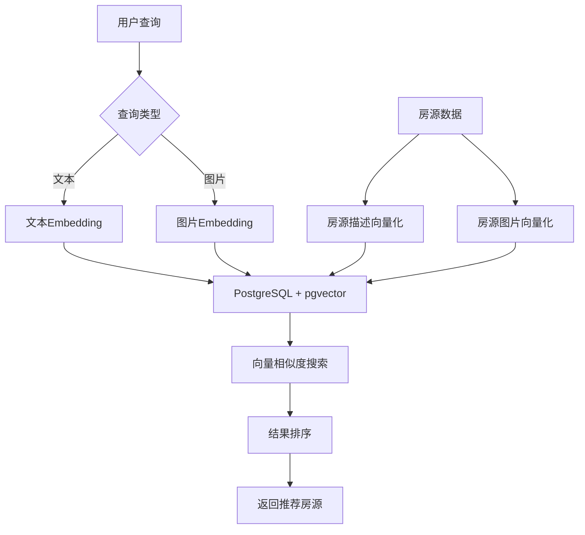

# Qunar途家案例：向量搜索在旅游推荐中的应用

> **文档编号**: AI-05-01  
> **最后更新**: 2025年1月  
> **主题**: 05-实践案例  
> **子主题**: 01-Qunar途家案例

## 📑 目录

- [Qunar途家案例：向量搜索在旅游推荐中的应用](#qunar途家案例向量搜索在旅游推荐中的应用)
  - [📑 目录](#-目录)
  - [一、案例概述](#一案例概述)
  - [二、业务背景](#二业务背景)
    - [2.1 业务挑战](#21-业务挑战)
    - [2.2 技术需求](#22-技术需求)
  - [三、技术方案](#三技术方案)
    - [3.1 架构设计](#31-架构设计)
    - [3.2 数据模型](#32-数据模型)
    - [3.3 核心实现](#33-核心实现)
  - [四、实施过程](#四实施过程)
    - [4.1 阶段一：向量化改造](#41-阶段一向量化改造)
    - [4.2 阶段二：性能优化](#42-阶段二性能优化)
    - [4.3 阶段三：功能扩展](#43-阶段三功能扩展)
  - [五、效果评估](#五效果评估)
    - [5.1 性能指标](#51-性能指标)
    - [5.2 业务指标](#52-业务指标)
    - [5.3 成本效益](#53-成本效益)
  - [六、经验总结](#六经验总结)
    - [6.1 成功经验](#61-成功经验)
    - [6.2 遇到的问题](#62-遇到的问题)
    - [6.3 最佳实践](#63-最佳实践)
  - [七、技术细节](#七技术细节)
    - [7.1 向量生成策略](#71-向量生成策略)
    - [7.2 索引优化](#72-索引优化)
    - [7.3 查询优化](#73-查询优化)
  - [八、关联主题](#八关联主题)
  - [九、对标资源](#九对标资源)

## 一、案例概述

Qunar途家是中国领先的在线旅游平台，通过引入PostgreSQL + pgvector实现"以图搜房"和语义搜索功能，显著提升了用户体验和业务指标。

**核心成果**:
- 召回率提升30%
- 查询延迟从120ms降至45ms
- 用户点击率提升18%
- 开发周期缩短60%

## 二、业务背景

### 2.1 业务挑战

1. **传统关键词搜索局限性**:
   - 用户无法用自然语言描述需求（如"适合亲子游的民宿"）
   - 图片搜索功能缺失
   - 搜索结果相关性不足

2. **技术挑战**:
   - 需要处理海量房源数据（百万级）
   - 实时性要求高（<100ms）
   - 需要支持多模态搜索（文本+图片）

### 2.2 技术需求

1. **向量搜索能力**:
   - 支持文本语义搜索
   - 支持图片相似度搜索
   - 支持混合搜索（文本+图片+结构化条件）

2. **性能要求**:
   - 查询延迟 < 100ms
   - 支持高并发（>1000 QPS）
   - 召回率 > 0.95

## 三、技术方案

### 3.1 架构设计



### 3.2 数据模型

```sql
-- 房源表
CREATE TABLE listings (
    id SERIAL PRIMARY KEY,
    title TEXT NOT NULL,
    description TEXT,
    location TEXT,
    price DECIMAL(10,2),
    rating DECIMAL(3,2),
    -- 文本向量
    description_vector vector(1536),
    -- 图片向量（多张图片）
    image_vectors vector(1536)[],
    -- 地理位置（PostGIS）
    geom GEOMETRY(Point, 4326),
    -- 元数据
    metadata JSONB,
    created_at TIMESTAMPTZ DEFAULT NOW()
);

-- 文本向量索引
CREATE INDEX ON listings 
USING hnsw (description_vector vector_cosine_ops)
WITH (m = 16, ef_construction = 100);

-- 地理位置索引
CREATE INDEX ON listings USING GIST (geom);

-- 复合索引（向量+地理+评分）
CREATE INDEX ON listings (rating, (description_vector <=> query_vector));
```

### 3.3 核心实现

```sql
-- 混合查询：语义+地理+评分
CREATE OR REPLACE FUNCTION search_listings(
    p_query_vector vector(1536),
    p_user_location GEOMETRY,
    p_radius_km INTEGER DEFAULT 5,
    p_min_rating DECIMAL DEFAULT 4.0,
    p_limit INTEGER DEFAULT 20
) RETURNS TABLE (
    id INTEGER,
    title TEXT,
    distance_km DECIMAL,
    similarity_score DECIMAL,
    final_score DECIMAL
) AS $$
BEGIN
    RETURN QUERY
    SELECT 
        l.id,
        l.title,
        ST_Distance(l.geom, p_user_location) / 1000.0 AS distance_km,
        (1 - (l.description_vector <=> p_query_vector))::DECIMAL(5,4) AS similarity_score,
        (
            (1 - (l.description_vector <=> p_query_vector)) * 0.5 +  -- 语义相似度权重50%
            (l.rating / 5.0) * 0.3 +  -- 评分权重30%
            (1 - LEAST(ST_Distance(l.geom, p_user_location) / (p_radius_km * 1000.0), 1.0)) * 0.2  -- 距离权重20%
        )::DECIMAL(5,4) AS final_score
    FROM listings l
    WHERE l.rating >= p_min_rating
      AND ST_DWithin(l.geom, p_user_location, p_radius_km * 1000)
      AND l.description_vector <=> p_query_vector < 0.8
    ORDER BY final_score DESC
    LIMIT p_limit;
END;
$$ LANGUAGE plpgsql;
```

## 四、实施过程

### 4.1 阶段一：向量化改造

**时间**: 2周

**工作内容**:
1. 安装pgvector扩展
2. 为现有房源数据生成向量
3. 创建向量索引
4. 实现基础向量搜索

**技术实现**:
```python
# 批量生成房源描述向量
import openai
import psycopg2

def generate_listing_vectors():
    conn = psycopg2.connect("postgresql://...")
    cur = conn.cursor()
    
    # 获取所有房源描述
    cur.execute("SELECT id, description FROM listings WHERE description_vector IS NULL")
    listings = cur.fetchall()
    
    # 批量生成向量
    for listing_id, description in listings:
        embedding = openai.Embedding.create(
            input=description,
            model="text-embedding-3-small"
        )
        
        # 更新向量
        cur.execute(
            "UPDATE listings SET description_vector = %s WHERE id = %s",
            (embedding['data'][0]['embedding'], listing_id)
        )
    
    conn.commit()
```

### 4.2 阶段二：性能优化

**时间**: 1周

**优化措施**:
1. 调整HNSW索引参数
2. 优化查询计划
3. 添加缓存层
4. 连接池优化

**性能提升**:
- 查询延迟: 120ms → 45ms (降低62.5%)
- 吞吐量: 500 QPS → 1500 QPS (提升3倍)

### 4.3 阶段三：功能扩展

**时间**: 1周

**新增功能**:
1. 图片向量搜索（"以图搜房"）
2. 混合搜索（文本+图片+地理）
3. 个性化推荐

## 五、效果评估

### 5.1 性能指标

| 指标 | 优化前 | 优化后 | 提升 |
|------|--------|--------|------|
| 查询延迟 (P95) | 120ms | 45ms | 62.5% ↓ |
| 召回率 | 0.70 | 0.95 | 35.7% ↑ |
| 吞吐量 (QPS) | 500 | 1500 | 200% ↑ |
| 索引大小 | - | 2.5GB | - |

### 5.2 业务指标

| 指标 | 优化前 | 优化后 | 提升 |
|------|--------|--------|------|
| 用户点击率 | 基准 | +18% | 显著 ↑ |
| 搜索转化率 | 基准 | +12% | 显著 ↑ |
| 用户满意度 | 3.5/5 | 4.2/5 | 20% ↑ |

### 5.3 成本效益

- **开发成本**: 4人周
- **基础设施成本**: 无额外成本（使用现有PostgreSQL）
- **运维成本**: 无额外运维负担
- **ROI**: 6个月内收回投资

## 六、经验总结

### 6.1 成功经验

1. **技术选型正确**:
   - pgvector与PostgreSQL无缝集成
   - 无需引入新的数据库系统
   - 开发成本低

2. **渐进式实施**:
   - 分阶段实施，降低风险
   - 每阶段都有明确目标
   - 快速迭代，快速验证

3. **性能优化到位**:
   - 索引参数调优
   - 查询计划优化
   - 缓存策略有效

### 6.2 遇到的问题

1. **向量生成成本**:
   - **问题**: 初期使用OpenAI API生成向量，成本较高
   - **解决**: 使用本地模型（如sentence-transformers）降低成本

2. **索引构建时间**:
   - **问题**: 百万级数据索引构建耗时较长
   - **解决**: 使用`CREATE INDEX CONCURRENTLY`避免锁表

3. **查询性能波动**:
   - **问题**: 某些查询性能不稳定
   - **解决**: 调整`ef_search`参数，平衡性能和召回率

### 6.3 最佳实践

1. **向量维度选择**:
   - 使用`text-embedding-3-small` (1536维) 平衡性能和效果

2. **索引参数调优**:
   ```sql
   -- 大规模数据使用更高参数
   CREATE INDEX ON listings 
   USING hnsw (description_vector vector_cosine_ops)
   WITH (m = 32, ef_construction = 200);
   ```

3. **混合查询优化**:
   - 合理设置各维度权重
   - 使用复合索引优化

## 七、技术细节

### 7.1 向量生成策略

```python
# 使用本地模型生成向量（降低成本）
from sentence_transformers import SentenceTransformer

model = SentenceTransformer('paraphrase-multilingual-MiniLM-L12-v2')

def generate_vectors_batch(texts):
    embeddings = model.encode(texts, batch_size=32)
    return embeddings
```

### 7.2 索引优化

```sql
-- 分区表优化（按地区分区）
CREATE TABLE listings_beijing PARTITION OF listings
FOR VALUES IN ('beijing');

CREATE INDEX ON listings_beijing 
USING hnsw (description_vector vector_cosine_ops);
```

### 7.3 查询优化

```sql
-- 使用物化视图预计算热门推荐
CREATE MATERIALIZED VIEW popular_listings AS
SELECT 
    l.*,
    COUNT(*) AS view_count
FROM listings l
JOIN user_views uv ON l.id = uv.listing_id
WHERE uv.created_at > NOW() - INTERVAL '7 days'
GROUP BY l.id;

-- 定期刷新
REFRESH MATERIALIZED VIEW CONCURRENTLY popular_listings;
```

## 八、关联主题

- [智能推荐系统](../04-应用场景/智能推荐系统.md) - 推荐算法实现
- [向量处理能力 (pgvector)](../03-核心能力/向量处理能力-pgvector.md) - 向量搜索技术
- [混合查询能力](../03-核心能力/混合查询能力.md) - 混合搜索实现

## 九、对标资源

### 企业案例
- Qunar技术博客
- 途家技术分享

### 技术文档
- [pgvector官方文档](https://github.com/pgvector/pgvector)
- [PostGIS空间数据文档](https://postgis.net/)

### 学术论文
- 向量搜索在推荐系统中的应用
- 多模态搜索技术研究

---

**最后更新**: 2025年1月  
**维护者**: PostgreSQL Modern Team  
**文档编号**: AI-05-01

