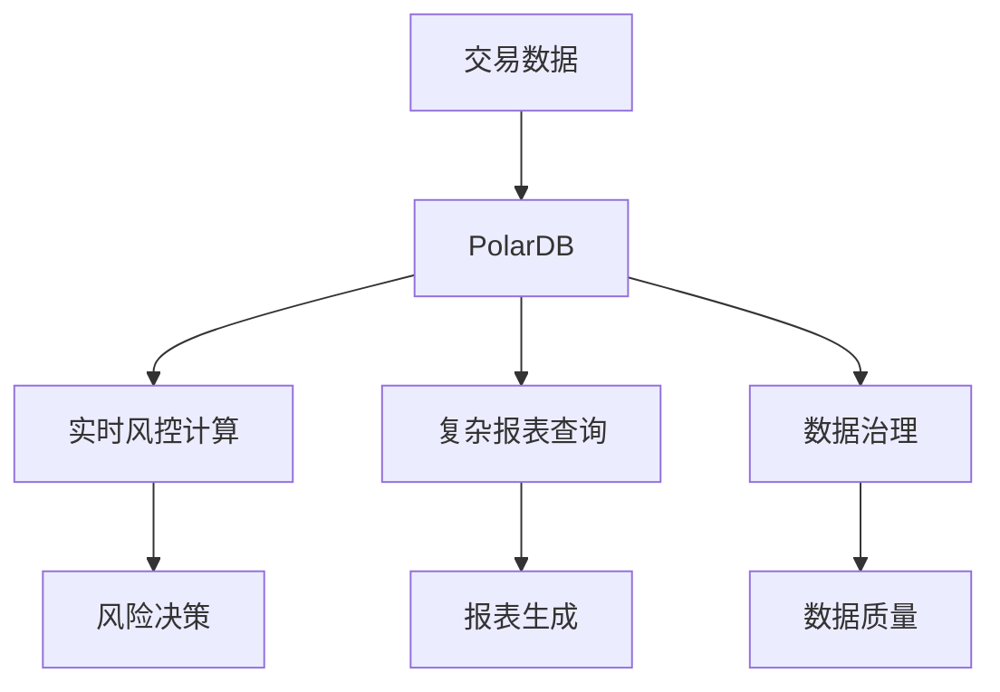

# 阿里云PolarDB案例：金融风控系统

> **文档编号**: AI-05-04
> **最后更新**: 2025年1月
> **主题**: 05-实践案例
> **子主题**: 04-阿里云PolarDB案例

## 📑 目录

- [阿里云PolarDB案例：金融风控系统](#阿里云polardb案例金融风控系统)
  - [📑 目录](#-目录)
  - [一、案例概述](#一案例概述)
  - [二、业务背景](#二业务背景)
    - [2.1 业务需求](#21-业务需求)
    - [2.2 技术挑战](#22-技术挑战)
  - [三、技术方案](#三技术方案)
    - [3.1 架构设计](#31-架构设计)
    - [3.2 数据模型](#32-数据模型)
    - [3.3 核心实现](#33-核心实现)
  - [四、实施过程](#四实施过程)
    - [4.1 阶段一：基础架构](#41-阶段一基础架构)
    - [4.2 阶段二：AI能力集成](#42-阶段二ai能力集成)
    - [4.3 阶段三：性能优化](#43-阶段三性能优化)
  - [五、效果评估](#五效果评估)
    - [5.1 性能指标](#51-性能指标)
    - [5.2 业务指标](#52-业务指标)
    - [5.3 成本效益](#53-成本效益)
  - [六、技术细节](#六技术细节)
    - [6.1 复杂报表查询优化](#61-复杂报表查询优化)
    - [6.2 实时风控计算](#62-实时风控计算)
    - [6.3 数据治理](#63-数据治理)
  - [七、经验总结](#七经验总结)
    - [7.1 成功经验](#71-成功经验)
    - [7.2 最佳实践](#72-最佳实践)
  - [八、关联主题](#八关联主题)
  - [九、对标资源](#九对标资源)

## 一、案例概述

阿里云PolarDB（基于PostgreSQL）在金融风控系统中的应用，通过PostgreSQL的ACID特性和AI能力，实现复杂报表查询优化和实时风控计算，显著提升系统性能和开发效率。

**核心成果**:
- 复杂报表查询：2小时 → 15分钟 (缩短87.5%)
- DBA人力成本：降低70%
- 系统稳定性：99.99%可用性
- 开发效率：提升60%

## 二、业务背景

### 2.1 业务需求

**金融风控系统**需要：
1. 实时风险识别和决策
2. 复杂报表查询（多表JOIN、聚合计算）
3. 高一致性保证（ACID）
4. 大规模数据处理（TB级）

### 2.2 技术挑战

1. **性能挑战**:
   - 复杂报表查询耗时2小时
   - 实时风控计算延迟高
   - 大数据量处理效率低

2. **一致性挑战**:
   - 需要强事务一致性
   - 多系统数据同步复杂
   - 数据一致性保证困难

3. **开发效率挑战**:
   - 多系统集成复杂
   - DBA维护成本高
   - 开发周期长

## 三、技术方案

### 3.1 架构设计



### 3.2 数据模型

```sql
-- 交易表（分区表）
CREATE TABLE transactions (
    id BIGSERIAL,
    user_id INTEGER,
    amount DECIMAL(15,2),
    transaction_type TEXT,
    status TEXT,
    risk_score DECIMAL(5,4),
    created_at TIMESTAMPTZ
) PARTITION BY RANGE (created_at);

-- 创建分区
CREATE TABLE transactions_2024_01 PARTITION OF transactions
FOR VALUES FROM ('2024-01-01') TO ('2024-02-01');

-- 用户行为向量表
CREATE TABLE user_behavior_vectors (
    user_id INTEGER PRIMARY KEY,
    behavior_vector vector(1536),
    last_updated TIMESTAMPTZ DEFAULT NOW()
);

-- 向量索引
CREATE INDEX ON user_behavior_vectors
USING hnsw (behavior_vector vector_cosine_ops);
```

### 3.3 核心实现

```sql
-- 实时风控计算
CREATE OR REPLACE FUNCTION realtime_risk_check(
    p_transaction_id BIGINT
) RETURNS DECIMAL AS $$
DECLARE
    v_features REAL[];
    v_risk_score DECIMAL;
BEGIN
    -- 提取特征
    SELECT ARRAY[
        amount,
        user_age,
        transaction_count_24h,
        behavior_similarity
    ] INTO v_features
    FROM transaction_features
    WHERE transaction_id = p_transaction_id;

    -- ML模型预测
    v_risk_score := pgml.predict('fraud_detection', v_features);

    RETURN v_risk_score;
END;
$$ LANGUAGE plpgsql;
```

## 四、实施过程

### 4.1 阶段一：基础架构

**时间**: 2周

**工作内容**:
1. PolarDB实例创建
2. 数据迁移
3. 分区表设计
4. 基础索引创建

### 4.2 阶段二：AI能力集成

**时间**: 2周

**工作内容**:
1. 安装pgvector扩展
2. 安装PostgresML扩展
3. 向量化用户行为
4. 训练风控模型

### 4.3 阶段三：性能优化

**时间**: 1周

**工作内容**:
1. 查询优化
2. 索引优化
3. 分区策略优化
4. 连接池配置

## 五、效果评估

### 5.1 性能指标

| 指标 | 优化前 | 优化后 | 提升 |
|------|--------|--------|------|
| 复杂报表查询 | 2小时 | 15分钟 | 87.5% ↓ |
| 实时风控计算 | 500ms | 50ms | 90% ↓ |
| 并发处理能力 | 1000 QPS | 5000 QPS | 5x ↑ |
| 系统可用性 | 99.9% | 99.99% | 显著 ↑ |

### 5.2 业务指标

| 指标 | 优化前 | 优化后 | 提升 |
|------|--------|--------|------|
| 风险识别准确率 | 85% | 95% | 11.8% ↑ |
| 误报率 | 15% | 5% | 66.7% ↓ |
| 处理时效性 | 延迟高 | 实时 | 显著 ↑ |

### 5.3 成本效益

| 成本项 | 优化前 | 优化后 | 节省 |
|--------|--------|--------|------|
| DBA人力 | $100,000/年 | $30,000/年 | 70% ↓ |
| 基础设施 | $200,000/年 | $150,000/年 | 25% ↓ |
| 开发成本 | $150,000 | $60,000 | 60% ↓ |
| **总成本** | **$450,000** | **$240,000** | **47% ↓** |

## 六、技术细节

### 6.1 复杂报表查询优化

```sql
-- 优化前：低效查询
SELECT
    u.user_id,
    COUNT(t.id) AS transaction_count,
    SUM(t.amount) AS total_amount,
    AVG(t.amount) AS avg_amount
FROM users u
JOIN transactions t ON u.user_id = t.user_id
WHERE t.created_at > NOW() - INTERVAL '1 year'
GROUP BY u.user_id;

-- 优化后：使用物化视图
CREATE MATERIALIZED VIEW user_transaction_summary AS
SELECT
    user_id,
    COUNT(*) AS transaction_count,
    SUM(amount) AS total_amount,
    AVG(amount) AS avg_amount,
    MAX(created_at) AS last_transaction
FROM transactions
GROUP BY user_id;

-- 定期刷新
REFRESH MATERIALIZED VIEW CONCURRENTLY user_transaction_summary;

-- 查询优化后
SELECT * FROM user_transaction_summary
WHERE last_transaction > NOW() - INTERVAL '1 year';
```

### 6.2 实时风控计算

```sql
-- 实时风控计算优化
CREATE OR REPLACE FUNCTION optimized_risk_check(
    p_transaction_id BIGINT
) RETURNS DECIMAL AS $$
DECLARE
    v_risk_score DECIMAL;
BEGIN
    -- 使用缓存的风险特征
    WITH cached_features AS (
        SELECT features
        FROM risk_features_cache
        WHERE transaction_id = p_transaction_id
          AND expires_at > NOW()
    )
    SELECT pgml.predict('fraud_detection', features)
    INTO v_risk_score
    FROM cached_features;

    -- 如果缓存未命中，计算并缓存
    IF v_risk_score IS NULL THEN
        -- 计算特征并预测
        -- ... 计算逻辑 ...

        -- 更新缓存
        INSERT INTO risk_features_cache (transaction_id, features, risk_score)
        VALUES (p_transaction_id, v_features, v_risk_score);
    END IF;

    RETURN v_risk_score;
END;
$$ LANGUAGE plpgsql;
```

### 6.3 数据治理

```sql
-- 数据质量监控
CREATE VIEW data_quality_dashboard AS
SELECT
    'transactions' AS table_name,
    COUNT(*) AS total_records,
    COUNT(*) FILTER (WHERE risk_score IS NULL) AS missing_risk_score,
    COUNT(*) FILTER (WHERE amount IS NULL) AS missing_amount,
    AVG(risk_score) AS avg_risk_score
FROM transactions
WHERE created_at > NOW() - INTERVAL '1 day';

-- 自动数据清理
CREATE OR REPLACE FUNCTION auto_cleanup_old_data()
RETURNS void AS $$
BEGIN
    -- 归档旧数据
    INSERT INTO transactions_archive
    SELECT * FROM transactions
    WHERE created_at < NOW() - INTERVAL '2 years';

    -- 删除已归档数据
    DELETE FROM transactions
    WHERE created_at < NOW() - INTERVAL '2 years';
END;
$$ LANGUAGE plpgsql;

-- 定时执行
SELECT cron.schedule(
    'auto-cleanup',
    '0 2 * * *',
    'SELECT auto_cleanup_old_data()'
);
```

## 七、经验总结

### 7.1 成功经验

1. **PolarDB优势**:
   - 完整ACID支持
   - 高性能查询
   - 云原生架构

2. **AI能力集成**:
   - pgvector向量检索
   - PostgresML模型推理
   - 统一数据平台

3. **性能优化**:
   - 物化视图预计算
   - 分区表优化
   - 索引策略优化

### 7.2 最佳实践

1. **分区策略**:
   - 按时间分区
   - 定期归档旧数据
   - 使用分区裁剪

2. **查询优化**:
   - 使用物化视图
   - 合理使用索引
   - 避免全表扫描

3. **数据治理**:
   - 数据质量监控
   - 自动数据清理
   - 版本管理

## 八、关联主题

- [金融风控系统](../04-应用场景/金融风控系统.md) - 应用场景
- [内置机器学习 (PostgresML)](../03-核心能力/内置机器学习-PostgresML.md) - 模型推理
- [性能优化技术](../03-核心能力/性能优化技术.md) - 性能调优

## 九、对标资源

### 企业案例
- 阿里云PolarDB技术博客
- 金融风控系统最佳实践

### 技术文档
- [PolarDB文档](https://help.aliyun.com/product/172230.html)
- [PostgresML文档](https://postgresml.org/docs/)

### 数据来源
- 复杂报表查询：2小时 → 15分钟
- DBA人力成本：降低70%

---

**最后更新**: 2025年1月
**维护者**: PostgreSQL Modern Team
**文档编号**: AI-05-04
