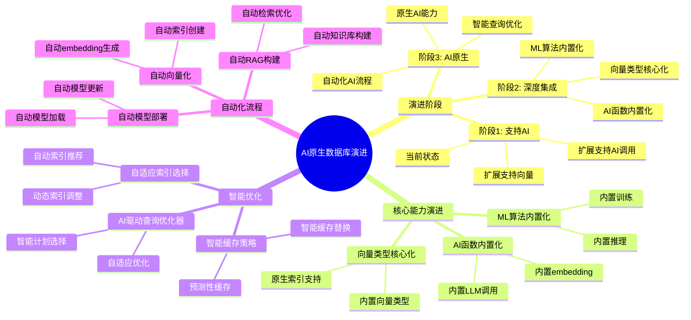

# AI原生数据库演进

> **文档编号**: AI-08-02
> **最后更新**: 2025年1月
> **主题**: 08-未来趋势
> **子主题**: 02-AI原生数据库演进

## 📑 目录

- [AI原生数据库演进](#ai原生数据库演进)
  - [📑 目录](#-目录)
  - [一、概述](#一概述)
    - [1.1 AI原生数据库演进思维导图](#11-ai原生数据库演进思维导图)
  - [二、演进路径](#二演进路径)
    - [2.1 阶段1: 支持AI (当前)](#21-阶段1-支持ai-当前)
    - [2.2 阶段2: 深度集成 (1-2年)](#22-阶段2-深度集成-1-2年)
    - [2.3 阶段3: AI原生 (3-5年)](#23-阶段3-ai原生-3-5年)
  - [三、核心能力演进](#三核心能力演进)
    - [3.1 向量类型核心化](#31-向量类型核心化)
    - [3.2 AI函数内置化](#32-ai函数内置化)
    - [3.3 ML算法内置化](#33-ml算法内置化)
  - [四、智能查询优化](#四智能查询优化)
    - [4.1 AI驱动的查询优化器](#41-ai驱动的查询优化器)
    - [4.2 自适应索引选择](#42-自适应索引选择)
    - [4.3 智能缓存策略](#43-智能缓存策略)
  - [五、自动化AI流程](#五自动化ai流程)
    - [5.1 自动向量化](#51-自动向量化)
    - [5.2 自动RAG构建](#52-自动rag构建)
    - [5.3 自动模型部署](#53-自动模型部署)
  - [六、技术实现路径](#六技术实现路径)
    - [短期 (1-3个月)](#短期-1-3个月)
    - [中期 (3-6个月)](#中期-3-6个月)
    - [长期 (6-12个月)](#长期-6-12个月)
    - [长期 (1-3年)](#长期-1-3年)
  - [七、关联主题](#七关联主题)
  - [八、对标资源](#八对标资源)
    - [技术报告](#技术报告)
    - [学术论文](#学术论文)

## 一、概述

PostgreSQL从"支持AI"到"AI原生"的演进路径分析，包括技术演进阶段、核心能力发展、智能优化和自动化流程等关键方向。

### 1.1 AI原生数据库演进思维导图



## 二、演进路径

### 2.1 阶段1: 支持AI (当前)

**特征**:

- ✅ 通过扩展支持向量存储 (pgvector)
- ✅ 通过扩展支持AI调用 (pgai)
- ✅ 通过扩展支持ML训练 (PostgresML)
- ⚠️ 需要手动配置和集成
- ⚠️ 功能相对独立

**技术栈**:

```text
PostgreSQL核心
├── pgvector扩展 (向量存储)
├── pgai扩展 (AI调用)
└── PostgresML扩展 (ML训练)
```

**示例**:

```sql
-- 当前需要手动安装扩展
CREATE EXTENSION vector;
CREATE EXTENSION pgai;
CREATE EXTENSION pgml;

-- 手动生成向量
UPDATE documents
SET embedding = ai.embedding('text-embedding-3-small', content);
```

### 2.2 阶段2: 深度集成 (1-2年)

**特征**:

- ✅ 向量类型成为核心类型
- ✅ AI函数成为内置函数
- ✅ ML算法成为内置算法
- ✅ 更好的性能优化
- ✅ 统一的API接口

**技术栈**:

```text
PostgreSQL核心
├── 内置vector类型
├── 内置AI函数 (embedding, chat_complete)
└── 内置ML算法库
```

**示例**:

```sql
-- 未来可能的语法（无需扩展）
-- 向量类型直接可用
CREATE TABLE documents (
    id SERIAL PRIMARY KEY,
    content TEXT,
    embedding vector(1536)  -- 内置类型
);

-- AI函数直接可用
INSERT INTO documents (content, embedding)
VALUES (
    'PostgreSQL AI',
    embedding('text-embedding-3-small', 'PostgreSQL AI')  -- 内置函数
);

-- ML算法直接可用
SELECT train_model(
    'sales_forecast',
    algorithm = 'xgboost',
    features = ARRAY['price', 'quantity'],
    target = 'revenue'
);
```

### 2.3 阶段3: AI原生 (3-5年)

**特征**:

- ✅ 智能查询优化器
- ✅ 自动向量化
- ✅ 自适应索引选择
- ✅ 自动化AI流程
- ✅ 端到端AI工作流

**技术栈**:

```text
PostgreSQL AI原生
├── 智能查询优化器
├── 自动向量化引擎
├── 自适应索引管理器
└── 自动化AI工作流引擎
```

**示例**:

```sql
-- 未来可能的AI原生语法
-- 自动检测文本字段并向量化
CREATE TABLE documents (
    id SERIAL PRIMARY KEY,
    content TEXT AUTO_VECTORIZE  -- 自动向量化
);

-- 智能查询优化器自动选择最优方案
EXPLAIN (AI_OPTIMIZE = true)
SELECT * FROM documents
WHERE content @@ 'postgresql'  -- 自动选择全文搜索
   OR embedding <=> query_vector < 0.8  -- 自动选择向量搜索
ORDER BY relevance DESC;

-- 自动RAG系统
CREATE RAG SYSTEM knowledge_base
FROM TABLE documents
WITH (
    auto_chunk = true,
    auto_embedding = true,
    auto_index = true
);

-- 自动查询
SELECT rag_query('What is PostgreSQL?', system = 'knowledge_base');
```

## 三、核心能力演进

### 3.1 向量类型核心化

**演进时间线**:

| 阶段 | 时间 | 状态 | 说明 |
|------|:----:|:----:|:----|
| **扩展阶段** | 当前 | ✅ | pgvector扩展 |
| **实验阶段** | 1年 | ⏳ | 核心实验性支持 |
| **稳定阶段** | 2年 | ⏳ | 核心稳定支持 |
| **优化阶段** | 3年 | ⏳ | 性能优化 |

**技术优势**:

- ✅ 无需安装扩展
- ✅ 更好的性能优化
- ✅ 统一的类型系统
- ✅ 更好的兼容性

### 3.2 AI函数内置化

**演进时间线**:

| 阶段 | 时间 | 状态 | 说明 |
|------|:----:|:----:|:----|
| **扩展阶段** | 当前 | ✅ | pgai扩展 |
| **内置阶段** | 1-2年 | ⏳ | 核心内置函数 |
| **优化阶段** | 2-3年 | ⏳ | 性能优化 |

**内置函数示例**:

```sql
-- 未来可能的内置函数
SELECT embedding(model, text);  -- 生成向量
SELECT chat_complete(model, messages);  -- 聊天完成
SELECT image_embedding(model, image);  -- 图像向量化
SELECT audio_transcribe(model, audio);  -- 音频转录
```

### 3.3 ML算法内置化

**演进时间线**:

| 阶段 | 时间 | 状态 | 说明 |
|------|:----:|:----:|:----|
| **扩展阶段** | 当前 | ✅ | PostgresML扩展 |
| **内置阶段** | 2-3年 | ⏳ | 核心内置算法 |
| **扩展阶段** | 3-5年 | ⏳ | 算法库扩展 |

**内置算法示例**:

```sql
-- 未来可能的内置ML语法
CREATE ML MODEL sales_forecast
USING algorithm('xgboost')
WITH (
    auto_tune = true,
    incremental_learning = true
);

-- 自动训练
SELECT train_model('sales_forecast');

-- 自动预测
SELECT predict('sales_forecast', features);
```

## 四、智能查询优化

### 4.1 AI驱动的查询优化器

**优化方向**:

1. **基于ML的查询计划选择**
   - 学习历史查询模式
   - 预测最优查询计划
   - 自动调整执行策略

2. **自适应参数调优**
   - 自动调整查询参数
   - 优化索引使用
   - 动态调整缓存策略

**示例**:

```sql
-- 未来可能的智能优化
EXPLAIN (AI_OPTIMIZE = true, LEARNING = true)
SELECT * FROM documents
WHERE embedding <=> query_vector < 0.8
ORDER BY similarity DESC
LIMIT 10;

-- AI优化器自动:
-- 1. 分析查询模式
-- 2. 选择最优索引 (HNSW vs IVFFlat)
-- 3. 调整查询参数 (ef_search)
-- 4. 优化执行计划
```

### 4.2 自适应索引选择

**优化方向**:

1. **自动索引类型选择**
   - 根据数据特征自动选择
   - 根据查询模式自动调整
   - 动态索引优化

2. **混合索引策略**
   - 自动组合多种索引
   - 优化索引使用
   - 减少索引维护成本

**示例**:

```sql
-- 未来可能的自适应索引
CREATE INDEX ON documents
USING auto_index (embedding, content, location)
WITH (
    auto_select = true,  -- 自动选择索引类型
    auto_optimize = true,  -- 自动优化
    learning_mode = true  -- 学习模式
);

-- 系统自动:
-- 1. 分析数据特征
-- 2. 选择最优索引类型
-- 3. 根据查询模式优化
```

### 4.3 智能缓存策略

**优化方向**:

1. **基于访问模式的缓存**
   - 学习访问模式
   - 预测热点数据
   - 自动缓存管理

2. **多级缓存优化**
   - 内存缓存
   - 磁盘缓存
   - 分布式缓存

## 五、自动化AI流程

### 5.1 自动向量化

**自动化程度**:

| 阶段 | 自动化程度 | 说明 |
|------|:----------:|:----|
| **当前** | 手动 | 需要手动调用API |
| **1年** | 半自动 | 触发器自动生成 |
| **2年** | 全自动 | 自动检测和生成 |

**示例**:

```sql
-- 未来可能的自动向量化
CREATE TABLE documents (
    id SERIAL PRIMARY KEY,
    content TEXT AUTO_VECTORIZE  -- 自动向量化
);

-- 插入时自动生成向量
INSERT INTO documents (content)
VALUES ('PostgreSQL AI');
-- 系统自动:
-- 1. 检测文本字段
-- 2. 选择合适模型
-- 3. 生成向量
-- 4. 存储向量
```

### 5.2 自动RAG构建

**自动化程度**:

| 阶段 | 自动化程度 | 说明 |
|------|:----------:|:----|
| **当前** | 手动 | 需要手动构建 |
| **1年** | 半自动 | 模板化构建 |
| **2年** | 全自动 | 一键创建 |

**示例**:

```sql
-- 未来可能的自动RAG
CREATE RAG SYSTEM knowledge_base
FROM TABLE documents
WITH (
    auto_chunk = true,      -- 自动分块
    auto_embedding = true,  -- 自动向量化
    auto_index = true,      -- 自动索引
    auto_optimize = true    -- 自动优化
);

-- 自动查询
SELECT rag_query('What is PostgreSQL?', system = 'knowledge_base');
```

### 5.3 自动模型部署

**自动化程度**:

| 阶段 | 自动化程度 | 说明 |
|------|:----------:|:----|
| **当前** | 手动 | 需要手动部署 |
| **1年** | 半自动 | 脚本化部署 |
| **2年** | 全自动 | 自动部署和监控 |

**示例**:

```sql
-- 未来可能的自动部署
CREATE ML MODEL sales_forecast
WITH (
    auto_deploy = true,     -- 自动部署
    auto_monitor = true,    -- 自动监控
    auto_rollback = true    -- 自动回滚
);

-- 系统自动:
-- 1. 训练模型
-- 2. 验证模型
-- 3. 部署模型
-- 4. 监控性能
-- 5. 自动回滚（如需要）
```

## 六、技术实现路径

### 短期 (1-3个月)

- ✅ 完善pgvector性能
- ✅ 扩展pgai功能
- ✅ 优化PostgresML算法

### 中期 (3-6个月)

- ⏳ 向量类型实验性支持
- ⏳ AI函数内置化原型
- ⏳ 智能优化器原型

### 长期 (6-12个月)

- ⏳ 向量类型稳定支持
- ⏳ AI函数内置化
- ⏳ 智能优化器正式版

### 长期 (1-3年)

- ⏳ AI原生数据库架构
- ⏳ 自动化AI流程
- ⏳ 端到端AI工作流

## 七、关联主题

- [技术发展趋势](./技术发展趋势.md) - 整体趋势分析
- [02-技术架构](../02-技术架构/) - 架构演进
- [03-核心能力](../03-核心能力/) - 能力发展

## 八、对标资源

### 技术报告

- [PostgreSQL Roadmap](https://www.postgresql.org/developer/roadmap/)
- [AI Database Research](https://arxiv.org/list/cs.DB/recent)
- [Database System Evolution](https://www.vldb.org/)

### 学术论文

- MorphingDB: A Self-Tuning Database System
- Learned Index Structures
- AI-Driven Query Optimization

---

**最后更新**: 2025年1月
**维护者**: PostgreSQL Modern Team
**文档编号**: AI-08-02
