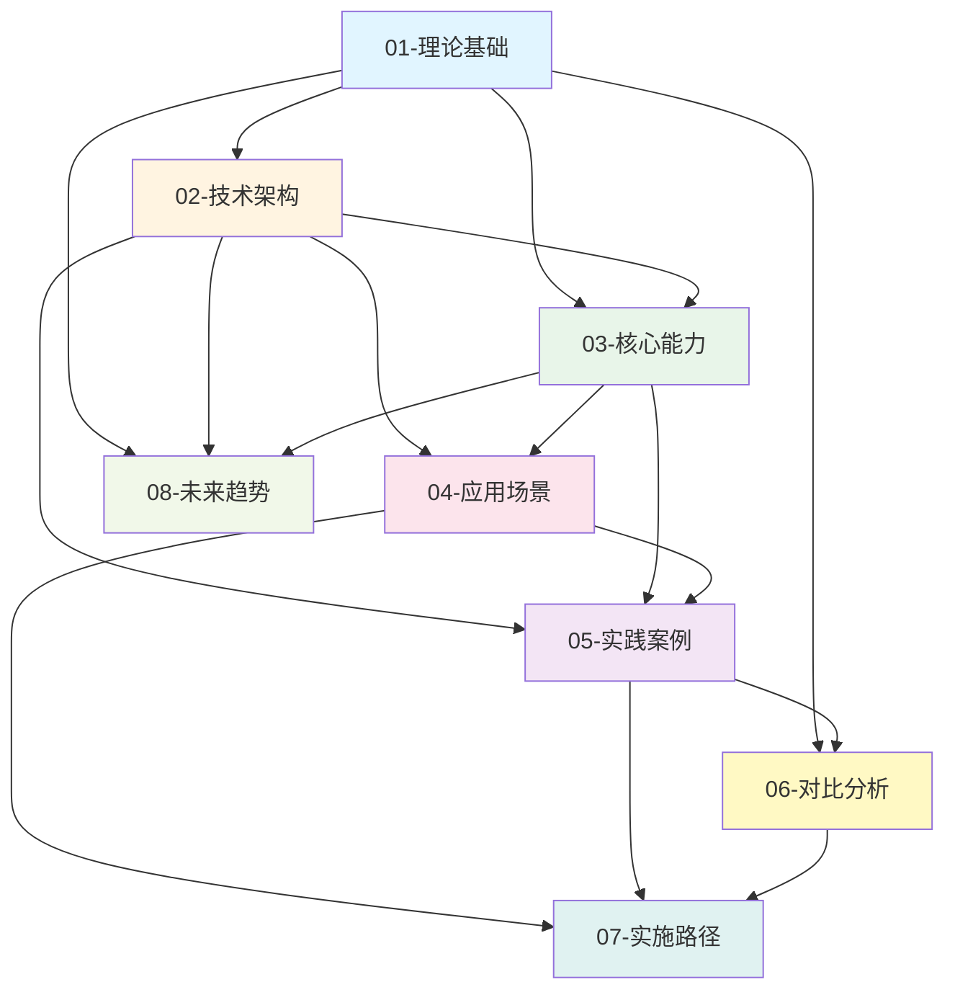

# PostgreSQL AI 主题导航与知识体系

> **最后更新**: 2025年1月
> **文档编号**: AI-00-00
> **项目状态**: 🚧 **建设中** - 主题梳理与重组进行中

## 📑 概述

本文档库系统梳理了PostgreSQL在AI时代的技术生态、理论基础、实践应用和未来趋势，构建了从理论到实践的完整知识体系。

## 🎯 核心主题结构

### 01-理论基础 (Theoretical Foundation)

**主题描述**: PostgreSQL与AI技术生态的理论模型、概念框架和形式化论证

**子主题**:

- 系统级理论模型
- 核心理论模型
- 概念对比矩阵
- 属性关系梳理
- 决策树逻辑路径
- 形式化证明体系

**关联主题**:

- → 02-技术架构 (理论基础指导架构设计)
- → 03-核心能力 (理论模型支撑能力实现)
- → 06-对比分析 (理论框架用于对比评估)

**对标资源**:

- MIT 6.830 Database Systems (数据库系统理论)
- Stanford CS145 Introduction to Databases (关系模型与查询优化)
- CMU 15-445 Database Systems (事务与并发控制理论)

---

### 02-技术架构 (Technical Architecture)

**主题描述**: PostgreSQL AI生态体系架构、扩展组件和技术栈集成

**子主题**:

- PostgreSQL生态体系架构
- 核心扩展组件详解
- 技术栈集成实践
- 基础架构设计
- 典型AI架构模式
- 全栈架构图

**关联主题**:

- ← 01-理论基础 (架构设计基于理论模型)
- → 03-核心能力 (架构支撑能力实现)
- → 04-应用场景 (架构服务于应用)
- → 05-实践案例 (架构在案例中验证)

**对标资源**:

- AWS Architecture Center (云原生架构模式)
- Google Cloud Architecture Framework (分布式系统架构)
- Microsoft Azure Architecture Patterns (微服务架构)

---

### 03-核心能力 (Core Capabilities)

**主题描述**: PostgreSQL在AI场景下的核心能力实现和技术细节

**子主题**:

- 向量处理能力 (pgvector)
- AI原生调用 (pgai)
- 内置机器学习 (PostgresML)
- 数据注入与治理
- 混合查询能力
- 性能优化技术

**关联主题**:

- ← 01-理论基础 (能力基于理论模型)
- ← 02-技术架构 (能力在架构中实现)
- → 04-应用场景 (能力支撑应用实现)
- → 05-实践案例 (能力在案例中应用)

**对标资源**:

- Vector Database Benchmark (向量数据库性能基准)
- ML Systems Design (机器学习系统设计)
- Database Internals (数据库内核技术)

---

### 04-应用场景 (Application Scenarios)

**主题描述**: PostgreSQL AI技术在具体业务场景中的应用模式和最佳实践

**子主题**:

- RAG (检索增强生成) 系统
- 智能推荐系统
- 智能客服系统
- 金融风控系统
- AI Agent数据支撑
- 多模态检索应用

**关联主题**:

- ← 02-技术架构 (场景基于架构设计)
- ← 03-核心能力 (场景使用核心能力)
- → 05-实践案例 (场景在案例中实现)
- → 07-实施路径 (场景指导实施)

**对标资源**:

- LangChain Documentation (RAG应用框架)
- LlamaIndex Guides (向量检索应用)
- Retrieval-Augmented Generation Papers (RAG学术研究)

---

### 05-实践案例 (Practical Cases)

**主题描述**: 企业级应用案例、开源项目案例和性能基准测试

**子主题**:

- 企业级应用案例
- 开源项目案例
- 性能基准测试
- 成本效益分析
- 技术债务对比
- 市场验证数据

**关联主题**:

- ← 02-技术架构 (案例验证架构)
- ← 03-核心能力 (案例展示能力)
- ← 04-应用场景 (案例实现场景)
- → 06-对比分析 (案例用于对比)
- → 07-实施路径 (案例指导实施)

**对标资源**:

- Qunar技术博客 (途家向量搜索案例)
- Neon技术博客 (AI Agent分支管理案例)
- Timescale案例库 (时序+向量混合案例)

---

### 06-对比分析 (Comparative Analysis)

**主题描述**: PostgreSQL AI方案与传统方案、替代方案的对比分析

**子主题**:

- 技术能力对比矩阵
- TCO总拥有成本分析
- 场景适用性决策矩阵
- 生态对比分析
- 性能基准对比
- 风险与约束条件

**关联主题**:

- ← 01-理论基础 (对比基于理论框架)
- ← 05-实践案例 (对比使用案例数据)
- → 07-实施路径 (对比指导选型)

**对标资源**:

- Gartner Database Market Analysis (数据库市场分析)
- DB-Engines Ranking (数据库流行度排名)
- Vector Database Comparison (向量数据库对比)

---

### 07-实施路径 (Implementation Path)

**主题描述**: 从传统PostgreSQL到AI增强的渐进式演进路径和最佳实践

**子主题**:

- 渐进式演进路线
- 性能调优黄金法则
- 部署方案设计
- 风险应对措施
- 升级路径保障
- ROI与成本模型

**关联主题**:

- ← 04-应用场景 (路径服务于场景)
- ← 05-实践案例 (路径基于案例经验)
- ← 06-对比分析 (路径考虑对比结果)

**对标资源**:

- PostgreSQL官方迁移指南
- Cloud Migration Best Practices (云迁移最佳实践)
- Database Performance Tuning Guides (数据库性能调优)

---

### 08-未来趋势 (Future Trends)

**主题描述**: PostgreSQL AI技术的发展趋势、演进方向和战略建议

**子主题**:

- 技术发展趋势
- AI原生数据库演进
- 扩展生态完善方向
- 云原生集成趋势
- 战略实施建议
- 未来展望

**关联主题**:

- ← 01-理论基础 (趋势基于理论发展)
- ← 02-技术架构 (趋势影响架构演进)
- ← 03-核心能力 (趋势推动能力增强)

**对标资源**:

- PostgreSQL Roadmap (PostgreSQL路线图)
- AI Database Research Papers (AI数据库研究论文)
- Industry Technology Reports (行业技术报告)

---

## 🔗 主题关联关系图

## 📊 项目进度

**当前状态**: 🚧 Phase 2进行中 (80%), Phase 3进行中 (60%)

- ✅ **Phase 1**: 主题重组与结构建立 (100%)
- 🚧 **Phase 2**: 内容对标与资源收集 (80%)
- 🚧 **Phase 3**: 内容深化与扩展 (60%)
- ⏳ **Phase 4**: 质量验证与优化 (0%)

**总体进度**: 70%

详细进度: [00-推进进度报告](./00-推进进度报告.md)

**文档格式**: ✅ 已统一 - 所有文档遵循[文档格式规范](./00-文档格式规范.md)

**最新进展**:

- ✅ 技术架构文档格式已统一
- ✅ 新增AI原生调用(pgai)详细文档
- ✅ 新增混合查询能力文档
- ✅ 新增智能推荐系统文档
- ✅ 新增Qunar途家实践案例
- ✅ 所有核心文档已添加目录和统一编号

## 📚 文档组织原则

### 1. 层次化组织

- **一级主题**: 8个核心主题
- **二级子主题**: 每个主题下3-6个子主题
- **三级文档**: 具体技术文档、案例文档、实践指南

### 2. 关联性标注

- 每个主题明确标注关联主题
- 使用箭头表示依赖关系 (→ 表示依赖, ← 表示被依赖)
- 建立主题间的交叉引用

### 3. 对标资源

- 每个主题标注对标资源
- 包括国际大学课程、成熟案例、理论文献
- 便于深入学习和验证

## 🎯 后续推进计划

### Phase 1: 主题重组 (当前阶段)

- [x] 梳理现有文档主题
- [x] 创建主题文件夹结构
- [x] 分析主题关联关系
- [ ] 重组现有文档到新结构
- [ ] 创建主题导航文档

### Phase 2: 内容对标 (1-2周)

- [ ] 收集国际大学课程资源
- [ ] 收集成熟案例和理论文献
- [ ] 批判性分析网络信息
- [ ] 补充对标资源链接

### Phase 3: 内容深化 (2-4周)

- [ ] 补充理论基础文档
- [ ] 完善技术架构文档
- [ ] 扩展实践案例文档
- [ ] 更新对比分析数据

### Phase 4: 质量验证 (1周)

- [ ] 文档完整性检查
- [ ] 链接有效性验证
- [ ] 内容一致性审核
- [ ] 最终质量评估

## 📊 文档统计

- **总主题数**: 8个核心主题
- **子主题数**: 40+个子主题
- **现有文档**: 3个核心文档
- **目标文档**: 50+个详细文档

## 🔍 快速导航

### 按学习路径

1. **初学者**: 01-理论基础 → 02-技术架构 → 04-应用场景
2. **实践者**: 02-技术架构 → 03-核心能力 → 05-实践案例 → 07-实施路径
3. **研究者**: 01-理论基础 → 06-对比分析 → 08-未来趋势

### 按角色需求

- **架构师**: 02-技术架构 → 06-对比分析 → 08-未来趋势
- **开发者**: 03-核心能力 → 04-应用场景 → 07-实施路径
- **DBA**: 03-核心能力 → 05-实践案例 → 07-实施路径
- **决策者**: 06-对比分析 → 05-实践案例 → 08-未来趋势

---

**最后更新**: 2025年1月
**维护者**: PostgreSQL Modern Team
**文档编号**: AI-00-00
