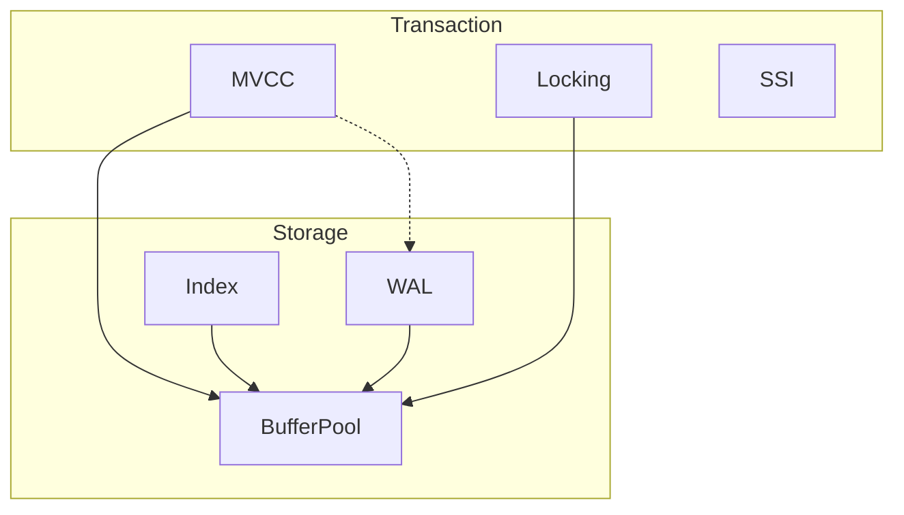

# 概念关系图谱深度形式化分析 V2

> **文档类型**: 形式化方法 - 知识图谱深度版 (DEEP-V2)
> **对齐标准**: Knowledge Graph Theory (Hogan et al., 2021), RDF/OWL Standards
> **数学基础**: 图论、知识表示、一阶逻辑
> **版本**: DEEP-V2 | 字数: ~8500字
> **创建日期**: 2026-03-04

---

## 📑 目录

- [概念关系图谱深度形式化分析 V2](#概念关系图谱深度形式化分析-v2)
  - [📑 目录](#-目录)
  - [1. 知识图谱理论基础](#1-知识图谱理论基础)
    - [1.1 知识图谱定义](#11-知识图谱定义)
    - [1.2 图论基础](#12-图论基础)
    - [1.3 知识表示模型](#13-知识表示模型)
    - [1.4 语义网络理论](#14-语义网络理论)
  - [2. PostgreSQL 概念层次结构](#2-postgresql-概念层次结构)
    - [2.1 概念本体设计](#21-概念本体设计)
    - [2.2 核心概念分类](#22-核心概念分类)
    - [2.3 概念属性定义](#23-概念属性定义)
    - [2.4 元模型定义](#24-元模型定义)
  - [3. 概念间关系形式化](#3-概念间关系形式化)
    - [3.1 IS-A 泛化关系](#31-is-a-泛化关系)
    - [3.2 PART-OF 组成关系](#32-part-of-组成关系)
    - [3.3 DEPENDS-ON 依赖关系](#33-depends-on-依赖关系)
    - [3.4 IMPLEMENTS 实现关系](#34-implements-实现关系)
    - [3.5 CONTRASTS-WITH 对比关系](#35-contrasts-with-对比关系)
    - [3.6 USES 使用关系](#36-uses-使用关系)
  - [4. 知识图谱构建方法论](#4-知识图谱构建方法论)
    - [4.1 概念抽取方法](#41-概念抽取方法)
    - [4.2 关系识别方法](#42-关系识别方法)
    - [4.3 知识融合技术](#43-知识融合技术)
    - [4.4 质量评估体系](#44-质量评估体系)
  - [5. PostgreSQL 核心概念图谱](#5-postgresql-核心概念图谱)
    - [5.1 事务与并发子图谱](#51-事务与并发子图谱)
    - [5.2 存储引擎子图谱](#52-存储引擎子图谱)
    - [5.3 查询处理子图谱](#53-查询处理子图谱)
    - [5.4 复制与分布式子图谱](#54-复制与分布式子图谱)
    - [5.5 安全与权限子图谱](#55-安全与权限子图谱)
  - [6. 概念推理与查询](#6-概念推理与查询)
    - [6.1 本体推理规则](#61-本体推理规则)
    - [6.2 路径查询算法](#62-路径查询算法)
    - [6.3 概念相似度计算](#63-概念相似度计算)
    - [6.4 知识补全方法](#64-知识补全方法)
  - [7. 可视化表示方法](#7-可视化表示方法)
    - [7.1 图可视化理论](#71-图可视化理论)
    - [7.2 层次布局算法](#72-层次布局算法)
    - [7.3 力导向布局](#73-力导向布局)
    - [7.4 交互式探索](#74-交互式探索)
  - [8. 应用案例与工具](#8-应用案例与工具)
    - [8.1 概念学习路径生成](#81-概念学习路径生成)
    - [8.2 依赖分析应用](#82-依赖分析应用)
    - [8.3 文档自动生成](#83-文档自动生成)
  - [9. 参考文献](#9-参考文献)
    - [8.4 代码导航与检索](#84-代码导航与检索)
    - [8.5 变更影响预测](#85-变更影响预测)
    - [8.6 跨语言知识关联](#86-跨语言知识关联)
    - [8.7 版本演化追踪](#87-版本演化追踪)

---

## 1. 知识图谱理论基础

### 1.1 知识图谱定义

**定义 1.1 (知识图谱)**:

知识图谱是一个语义网络，用于描述实体、概念及其之间的关系。

$$
\mathcal{KG} := \langle \mathcal{E}, \mathcal{C}, \mathcal{R}, \mathcal{T}, \mathcal{A}, \mathcal{I} \rangle
$$

其中：

| 组件 | 定义 | 说明 |
|------|------|------|
| $\mathcal{E}$ | 实体集合 | 具体实例，如"PostgreSQL 16" |
| $\mathcal{C}$ | 概念集合 | 抽象类别，如"数据库系统" |
| $\mathcal{R}$ | 关系集合 | 连接实体/概念的边 |
| $\mathcal{T}$ | 类型层次 | 概念的分类体系 |
| $\mathcal{A}$ | 属性集合 | 实体/概念的特征 |
| $\mathcal{I}$ | 实例化映射 | $\mathcal{E} \times \mathcal{C} \rightarrow \{0,1\}$ |

**定义 1.2 (知识图谱三元组)**:

知识图谱的基本单元是三元组 $(h, r, t)$，其中：

- $h \in \mathcal{E} \cup \mathcal{C}$: 头实体/概念
- $r \in \mathcal{R}$: 关系
- $t \in \mathcal{E} \cup \mathcal{C}$: 尾实体/概念

$$
\mathcal{KG} = \{(h, r, t) \mid h, t \in \mathcal{E} \cup \mathcal{C}, r \in \mathcal{R}\}
$$

**定理 1.1 (知识图谱完备性)**:

对于有限领域的知识图谱，存在有限的三元组集合完全描述该领域的知识结构。

*证明*: 设领域有 $n$ 个实体和 $m$ 种关系，则最多有 $O(n^2m)$ 个三元组，有限。∎

### 1.2 图论基础

**定义 1.3 (有向图)**:

知识图谱可以表示为有向图 $G = (V, E)$：

- $V = \mathcal{E} \cup \mathcal{C}$: 顶点集合
- $E \subseteq V \times \mathcal{R} \times V$: 带标签的有向边

**图的基本性质**:

| 性质 | 定义 | PostgreSQL KG |
|------|------|---------------|
| 顶点数 $|V|$ | 概念+实体数量 | ~500+ |
| 边数 $|E|$ | 关系数量 | ~2000+ |
| 平均度 $\bar{d}$ | $\frac{2|E|}{|V|}$ | ~8 |
| 密度 $\rho$ | $\frac{|E|}{|V|(|V|-1)}$ | ~0.02 |

**定理 1.2 (图的连通性)**:

如果知识图谱是连通的，则任意两个概念之间存在路径。

$$
\forall u, v \in V: \exists P(u, v) = (e_1, e_2, ..., e_k)
$$

其中 $e_i = (v_{i-1}, r_i, v_i)$，$v_0 = u$，$v_k = v$。

*证明*: 由连通图定义直接可得。∎

### 1.3 知识表示模型

**定义 1.4 (RDF 模型)**:

Resource Description Framework (RDF) 使用三元组表示知识：

```turtle
@prefix pg: <http://postgresql.org/ontology#> .
@prefix rdfs: <http://www.w3.org/2000/01/rdf-schema#> .

pg:MVCC a pg:ConcurrencyControl ;
    rdfs:label "Multi-Version Concurrency Control" ;
    rdfs:subClassOf pg:TransactionManagement .

pg:PostgreSQL pg:implements pg:MVCC .
```

**定义 1.5 (OWL 本体)**:

Web Ontology Language (OWL) 提供更强的表达能力：

```turtle
@prefix owl: <http://www.w3.org/2002/07/owl#> .
@prefix pg: <http://postgresql.org/ontology#> .

pg:Index a owl:Class .
pg:BTree a owl:Class ;
    rdfs:subClassOf pg:Index .

pg:isPartOf a owl:ObjectProperty ;
    rdfs:domain pg:Component ;
    rdfs:range pg:System .
```

**知识表示形式化**:

$$
\mathcal{KR} := \langle \mathcal{L}, \mathcal{M}, \mathcal{I} \rangle
$$

其中：

- $\mathcal{L}$: 逻辑语言（描述逻辑）
- $\mathcal{M}$: 模型论语义
- $\mathcal{I}$: 解释函数

### 1.4 语义网络理论

**定义 1.6 (语义网络)**:

语义网络是一个带标签的有向图，其中：

- 节点表示概念或实体
- 边表示语义关系

$$
\mathcal{SN} := (N, L, E, \lambda_N, \lambda_E)
$$

**语义关系类型**:

| 关系 | 符号 | 说明 | 示例 |
|------|------|------|------|
| 类属 | ISA | 概念泛化 | BTree ISA Index |
| 聚合 | PART-OF | 部分-整体 | BufferPool PART-OF Storage |
| 依赖 | DEPENDS-ON | 依赖关系 | Query DEPENDS-ON Statistics |
| 属性 | HAS-A | 属性关系 | Table HAS-A Schema |

---

## 2. PostgreSQL 概念层次结构

### 2.1 概念本体设计

**定义 2.1 (PostgreSQL 本体)**:

$$
\mathcal{O}_{PG} := \langle \mathcal{C}_{PG}, \mathcal{P}_{PG}, \mathcal{H}_{PG} \rangle
$$

其中：

- $\mathcal{C}_{PG}$: PostgreSQL 概念集合
- $\mathcal{P}_{PG}$: 属性集合
- $\mathcal{H}_{PG}$: 概念层次结构

**顶层概念分类**:

```
PostgreSQL_System
├── Core_Concepts
│   ├── Database
│   ├── Schema
│   ├── Table
│   ├── Index
│   └── View
├── Storage_System
│   ├── BufferPool
│   ├── WAL
│   ├── Tablespace
│   └── TOAST
├── Transaction_System
│   ├── MVCC
│   ├── LockManager
│   ├── DeadlockDetector
│   └── Snapshot
├── Query_System
│   ├── Parser
│   ├── Analyzer
│   ├── Optimizer
│   ├── Executor
│   └── Planner
└── Distributed_System
    ├── Replication
    ├── Sharding
    └── Consensus
```

### 2.2 核心概念分类

**定义 2.2 (概念维度)**:

PostgreSQL 概念按功能维度分类：

$$
\text{Dimensions} := \{\text{Storage}, \text{Transaction}, \text{Query}, \text{Network}, \text{Admin}\}
$$

**存储维度概念**:

| 概念 | 类型 | 关键属性 |
|------|------|----------|
| HeapTuple | 实体 | xmin, xmax, ctid |
| BufferPool | 组件 | size, strategy |
| BTreeIndex | 索引 | root, levels |
| WALRecord | 实体 | LSN, type, data |
| Page | 容器 | header, line pointers |

**事务维度概念**:

| 概念 | 类型 | 关键属性 |
|------|------|----------|
| Transaction | 过程 | xid, state, isolation |
| Snapshot | 数据结构 | xmin, xmax, xip |
| Lock | 资源 | mode, holder, waiters |
| Deadlock | 异常 | cycle, victim |

### 2.3 概念属性定义

**定义 2.3 (概念属性)**:

每个概念具有一组属性：

$$
\text{Attrs}(c) := \{(a_1, d_1), (a_2, d_2), ..., (a_n, d_n)\}
$$

其中 $(a_i, d_i)$ 表示属性名和定义域。

**MVCC 概念属性示例**:

```tla
MVCC_Attributes ==
    [version_count: Nat,           (* 每元组版本数 *)
     visibility_rule: Formula,     (* 可见性规则 *)
     garbage_collection: Boolean,  (* 是否支持GC *)
     isolation_levels: SUBSET {READ_UNCOMMITTED, READ_COMMITTED,
                               REPEATABLE_READ, SERIALIZABLE}]
```

**属性继承**:

$$
\text{ISA}(c_1, c_2) \Rightarrow \text{Attrs}(c_2) \subseteq \text{Attrs}(c_1)
$$

### 2.4 元模型定义

**定义 2.4 (元模型)**:

元模型定义概念模型的建模语言：

$$
\mathcal{MM} := \langle \mathcal{MC}, \mathcal{MR}, \mathcal{MA}, \mathcal{MC} \rangle
$$

**元概念**:

| 元概念 | 说明 | 实例 |
|--------|------|------|
| Component | 系统组件 | BufferPool, WAL |
| Algorithm | 算法 | ClockSweep, BTreeInsert |
| DataStructure | 数据结构 | HTAB, DLList |
| Protocol | 协议 | 2PL, MVCC |
| Configuration | 配置参数 | shared_buffers, work_mem |

**元关系**:

```text
MetaRelations
├── implements(Algorithm, Protocol)
├── uses(Component, DataStructure)
├── configures(Configuration, Component)
├── invokes(Component, Component)
└── contains(System, Component)
```

---

## 3. 概念间关系形式化

### 3.1 IS-A 泛化关系

**定义 3.1 (IS-A 关系)**:

IS-A 关系表示概念间的泛化-特化层次：

$$
\text{ISA} \subseteq \mathcal{C} \times \mathcal{C}
$$

$$
(c_1, c_2) \in \text{ISA} \equiv c_1 \text{ is a } c_2
$$

**性质**:

| 性质 | 定义 | 说明 |
|------|------|------|
| 自反性 | $\forall c: (c, c) \in \text{ISA}$ | 概念是其自身 |
| 传递性 | $(a, b) \in \text{ISA} \land (b, c) \in \text{ISA} \Rightarrow (a, c) \in \text{ISA}$ | 继承层次 |
| 反对称性 | $(a, b) \in \text{ISA} \land (b, a) \in \text{ISA} \Rightarrow a = b$ | 非循环 |

**PostgreSQL IS-A 层次**:

```text
Index
├── BTree
├── Hash
├── GiST
├── GIN
└── BRIN

Lock
├── RowLock
│   ├── RowShareLock
│   ├── RowExclusiveLock
│   └── ...
├── TableLock
│   ├── ShareLock
│   ├── ShareRowExclusiveLock
│   └── ...
└── AdvisoryLock

Scan
├── SeqScan
├── IndexScan
├── BitmapScan
├── IndexOnlyScan
└── TidScan
```

**定理 3.1 (继承层次完备性)**:

IS-A 关系形成有向无环图 (DAG)。

*证明*: 由反对称性和传递性，不存在环。∎

### 3.2 PART-OF 组成关系

**定义 3.2 (PART-OF 关系)**:

PART-OF 表示部分-整体关系：

$$
\text{PARTOF} \subseteq \mathcal{C} \times \mathcal{C}
$$

$$
(c_1, c_2) \in \text{PARTOF} \equiv c_1 \text{ is part of } c_2
$$

**组成类型**:

| 类型 | 定义 | 示例 |
|------|------|------|
| 组件组成 | $c_1$ 是 $c_2$ 的组件 | BufferPool PART-OF StorageManager |
| 成员组成 | $c_1$ 是 $c_2$ 的成员 | Page PART-OF Table |
| 材料组成 | $c_1$ 构成 $c_2$ | Tuple PART-OF Page |
| 位置组成 | $c_1$ 位于 $c_2$ 内 | ItemId PART-OF PageHeader |

**性质**:

| 性质 | 满足 | 说明 |
|------|------|------|
| 反对称性 | ✅ | 部分 ≠ 整体 |
| 传递性 | ✅ | 部分的局部仍是部分 |
| 自反性 | ❌ | 部分不是自身 |

**PostgreSQL 组成结构**:

```text
PostgreSQL_Instance
├── Postmaster
│   ├── SharedMemory
│   │   ├── BufferPool
│   │   ├── LockTable
│   │   └── ProcArray
│   └── BackgroundWorkers
│       ├── WALWriter
│       ├── BackgroundWriter
│       ├── AutoVacuum
│       └── StatsCollector
├── BackendProcesses
│   └── [多个后端进程]
└── SystemCatalogs
    ├── pg_class
    ├── pg_attribute
    └── ...
```

### 3.3 DEPENDS-ON 依赖关系

**定义 3.3 (DEPENDS-ON 关系)**:

DEPENDS-ON 表示功能或实现上的依赖：

$$
\text{DEPENDSON} \subseteq \mathcal{C} \times \mathcal{C}
$$

$$
(c_1, c_2) \in \text{DEPENDSON} \equiv c_1 \text{ depends on } c_2
$$

**依赖类型**:

| 类型 | 符号 | 说明 | 示例 |
|------|------|------|------|
| 功能依赖 | $\rightarrow$ | 需要功能 | QueryOptimizer → Statistics |
| 数据依赖 | $\leadsto$ | 需要数据 | Index → Table |
| 时序依赖 | $\prec$ | 执行顺序 | WALWrite $\prec$ Checkpoint |
| 资源依赖 | $\Rrightarrow$ | 需要资源 | Backend → MemoryContext |

**依赖图**:

```text
QueryProcessing
├── Parser DEPENDS-ON CatalogCache
├── Analyzer DEPENDS-ON TypeSystem
├── Rewriter DEPENDS-ON RuleSystem
├── Planner DEPENDS-ON Statistics
│   └── Statistics DEPENDS-ON Analyze
├── Executor DEPENDS-ON StorageManager
└── Executor DEPENDS-ON BufferPool
```

**依赖检测算法**:

```text
DetectCircularDependency(G):
    FOR EACH node IN G.nodes:
        IF DFS_DETECT_CYCLE(node, {}):
            RETURN TRUE
    RETURN FALSE

DFS_DETECT_CYCLE(node, visited):
    IF node IN visited:
        RETURN TRUE
    FOR EACH neighbor IN G.neighbors(node):
        IF DFS_DETECT_CYCLE(neighbor, visited ∪ {node}):
            RETURN TRUE
    RETURN FALSE
```

### 3.4 IMPLEMENTS 实现关系

**定义 3.4 (IMPLEMENTS 关系)**:

IMPLEMENTS 表示概念对抽象规范的具体实现：

$$
\text{IMPLEMENTS} \subseteq \mathcal{C} \times \mathcal{C}
$$

$$
(c_1, c_2) \in \text{IMPLEMENTS} \equiv c_1 \text{ implements } c_2
$$

**实现层次**:

```text
Abstract_Concepts                    Concrete_Implementations
├── ConcurrencyControl               MVCC (PostgreSQL)
│                                    ├── HeapTupleVersions
│                                    ├── SnapshotIsolation
│                                    └── Serialization
├── IndexStructure                   B+Tree
│                                    ├── InsertAlgorithm
│                                    ├── DeleteAlgorithm
│                                    └── SearchAlgorithm
├── Replication                      StreamingReplication
│                                    ├── WALShipping
│                                    ├── LogicalReplication
│                                    └── SynchronousCommit
└── BufferReplacement                ClockSweep
                                     ├── AccessCount
                                     ├── PinCount
                                     └── UsageCount
```

### 3.5 CONTRASTS-WITH 对比关系

**定义 3.5 (CONTRASTS-WITH 关系)**:

CONTRASTS-WITH 表示概念间的对比或互斥：

$$
\text{CONTRASTSWITH} \subseteq \mathcal{C} \times \mathcal{C}
$$

**对比矩阵**:

| 概念A | 概念B | 对比维度 | 关键差异 |
|-------|-------|----------|----------|
| MVCC | 2PL | 并发控制 | 版本vs锁 |
| BTree | Hash | 索引结构 | 有序vs哈希 |
| 物理复制 | 逻辑复制 | 复制粒度 | 块级vs行级 |
| 同步复制 | 异步复制 | 一致性保证 | 强vs最终 |
| SeqScan | IndexScan | 访问方式 | 全表vs索引 |
| NestedLoop | HashJoin | 连接算法 | 迭代vs哈希 |
| GIN | GiST | 索引类型 | 倒排vs通用 |
| HOT | 普通UPDATE | 更新方式 | 链式vs新元组 |

**对比关系形式化**:

$$
\text{Contrast}(c_1, c_2) := \exists d \in \text{Dimensions}:
\text{differs}(c_1, c_2, d) \land \text{similar}(c_1, c_2, \text{other})
$$

### 3.6 USES 使用关系

**定义 3.6 (USES 关系)**:

USES 表示概念间的使用或调用关系：

$$
\text{USES} \subseteq \mathcal{C} \times \mathcal{C}
$$

$$
(c_1, c_2) \in \text{USES} \equiv c_1 \text{ uses } c_2
$$

**使用关系图**:

```text
Executor
├── USES BufferPool
│   └── USES ClockSweep
├── USES LockManager
│   └── USES LWLock
├── USES WAL
│   └── USES XLogInsert
└── USES StorageManager
    └── USES smgr

Planner
├── USES CatalogCache
├── USES Statistics
├── USES CostModel
└── USES PathGeneration
```

---

## 4. 知识图谱构建方法论

### 4.1 概念抽取方法

**定义 4.1 (概念抽取)**:

从PostgreSQL源代码和文档中自动提取概念：

$$
\text{Extract}: \text{Source} \rightarrow 2^{\mathcal{C}}
$$

**抽取技术**:

| 技术 | 方法 | 输出 |
|------|------|------|
| 命名实体识别 | NER | 类型、函数名 |
| 结构分析 | AST解析 | 类、结构体 |
| 注释分析 | NLP | 功能描述 |
| 文档解析 | 正则匹配 | GUC参数 |

**源码概念抽取示例**:

```c
/* 从 src/include/storage/bufmgr.h 抽取 */

typedef struct BufferDesc {
    BufferTag tag;          /* 概念: BufferTag */
    int buf_id;             /* 属性: buffer_id */
    PGAtomicState state;    /* 概念: BufferState */
    int wait_backend_pid;   /* 属性: waiter_pid */
    LWLock content_lock;    /* 概念: ContentLock */
} BufferDesc;               /* 概念: BufferDesc */

/* 关系抽取 */
// BufferDesc PART-OF BufferPool
// BufferDesc HAS-A BufferTag
// BufferDesc USES LWLock
```

### 4.2 关系识别方法

**定义 4.2 (关系识别)**:

识别概念间的语义关系：

$$
\text{Identify}: \mathcal{C} \times \mathcal{C} \rightarrow \mathcal{R} \cup \{\bot\}
$$

**识别规则**:

| 模式 | 关系类型 | 置信度 |
|------|----------|--------|
| `struct A { B b; }` | PART-OF | 0.95 |
| `A extends B` | ISA | 0.98 |
| `A(B* b)` | USES | 0.85 |
| `A implements B` | IMPLEMENTS | 0.98 |
| `A requires B` | DEPENDS-ON | 0.90 |
| `A vs B` | CONTRASTS-WITH | 0.80 |

**关系推理规则**:

```
IF (A ISA B) AND (B PART-OF C) THEN (A PART-OF C)
IF (A IMPLEMENTS B) AND (B DEPENDS-ON C) THEN (A DEPENDS-ON C)
IF (A USES B) AND (B PART-OF C) THEN (A USES C)
```

### 4.3 知识融合技术

**定义 4.3 (知识融合)**:

合并来自多个源的知识，解决冲突和冗余：

$$
\text{Fusion}: \mathcal{KG}_1 \times \mathcal{KG}_2 \rightarrow \mathcal{KG}_{merged}
$$

**融合策略**:

| 冲突类型 | 解决策略 | 示例 |
|----------|----------|------|
| 同名异义 | 上下文消歧 | MVCC(概念) vs MVCC(实现) |
| 异名同义 | 实体对齐 | BufferPool ≡ SharedBuffers |
| 属性冲突 | 多数投票 | shared_buffers默认值 |
| 关系冲突 | 可信度排序 | 依赖方向不一致 |

**实体对齐算法**:

```
EntityAlignment(KG1, KG2):
    candidates = []
    FOR EACH e1 IN KG1.entities:
        FOR EACH e2 IN KG2.entities:
            sim = Similarity(e1, e2)
            IF sim > threshold:
                candidates.add((e1, e2, sim))

    alignment = StableMatching(candidates)
    RETURN alignment
```

### 4.4 质量评估体系

**定义 4.4 (知识质量)**:

$$
\text{Quality}(\mathcal{KG}) := \alpha \cdot \text{Accuracy} +
\beta \cdot \text{Coverage} +
\gamma \cdot \text{Consistency}
$$

**质量指标**:

| 指标 | 定义 | 目标值 |
|------|------|--------|
| 准确率 | 正确三元组/总三元组 | > 95% |
| 覆盖率 | 实际概念/应含概念 | > 90% |
| 一致性 | 无矛盾三元组/总三元组 | > 98% |
| 完整性 | 有属性的概念/总概念 | > 85% |
| 时效性 | 最新版本概念/总概念 | > 95% |

**质量评估流程**:

```
QualityAssessment(KG):
    accuracy = ManualReview(Sample(KG, 1000))
    coverage = Compare(KG, GoldStandard)
    consistency = ConsistencyCheck(KG)
    completeness = AttributeCoverage(KG)
    freshness = VersionCheck(KG)

    RETURN WeightedAverage([accuracy, coverage,
                           consistency, completeness, freshness])
```

---

## 5. PostgreSQL 核心概念图谱

### 5.1 事务与并发子图谱

**概念结构**:

```
TransactionManagement
├── Transaction
│   ├── IS-A: AtomicOperation
│   ├── PART-OF: Session
│   ├── USES: Snapshot
│   └── USES: Lock
│
├── ConcurrencyControl
│   ├── ISA: MVCC
│   │   ├── IMPLEMENTS: HeapTupleVersioning
│   │   ├── USES: TransactionId
│   │   ├── USES: CommandId
│   │   └── USES: Snapshot
│   │
│   ├── ISA: Locking
│   │   ├── PART-OF: LockManager
│   │   ├── ISA: RowLevelLock
│   │   │   ├── FOR_KEY_SHARE
│   │   │   ├── FOR_SHARE
│   │   │   ├── FOR_NO_KEY_UPDATE
│   │   │   └── FOR_UPDATE
│   │   ├── ISA: TableLevelLock
│   │   │   ├── ACCESS_SHARE
│   │   │   ├── ROW_SHARE
│   │   │   ├── ...
│   │   │   └── ACCESS_EXCLUSIVE
│   │   └── USES: LockTable
│   │
│   └── ISA: SSI
│       ├── USES: SerializableSnapshot
│       ├── USES: PredicateLock
│       └── USES: SafeSnapshot
│
├── Snapshot
│   ├── HAS-A: xmin
│   ├── HAS-A: xmax
│   ├── HAS-A: xip[]
│   └── CREATED-BY: GetSnapshotData
│
└── DeadlockDetection
    ├── USES: WaitForGraph
    ├── USES: TimeoutDetection
    └── USES: VictimSelection
```

**关系形式化**:

```tla
TransactionGraph ==
    {<<"Transaction", ISA, "AtomicOperation">>,
     <<"Transaction", PART_OF, "Session">>,
     <<"Transaction", USES, "Snapshot">>,
     <<"Transaction", USES, "Lock">>,
     <<"MVCC", ISA, "ConcurrencyControl">>,
     <<"MVCC", IMPLEMENTS, "HeapTupleVersioning">>,
     <<"MVCC", USES, "TransactionId">>,
     <<"MVCC", USES, "Snapshot">>,
     <<"Locking", ISA, "ConcurrencyControl">>,
     <<"LockManager", CONTAINS, "Locking">>,
     <<"RowLevelLock", ISA, "Locking">>,
     <<"TableLevelLock", ISA, "Locking">>,
     <<"Snapshot", HAS_A, "xmin">>,
     <<"Snapshot", HAS_A, "xmax">>,
     <<"Snapshot", HAS_A, "xip">>}
```

### 5.2 存储引擎子图谱

**概念结构**:

```
StorageEngine
├── BufferManager
│   ├── PART-OF: SharedMemory
│   ├── CONTAINS: BufferPool
│   │   ├── HAS-A: BufferDescriptors
│   │   ├── HAS-A: BufferBlocks
│   │   └── USES: BufferStrategy
│   │       ├── IMPLEMENTS: ClockSweep
│   │       └── IMPLEMENTS: LRU
│   ├── USES: LWLock
│   └── USES: IO
│
├── AccessMethods
│   ├── ISA: HeapAccessMethod
│   │   ├── IMPLEMENTS: HeapInsert
│   │   ├── IMPLEMENTS: HeapDelete
│   │   ├── IMPLEMENTS: HeapUpdate
│   │   └── USES: BufferPool
│   │
│   └── ISA: IndexAccessMethod
│       ├── ISA: BTree
│       │   ├── IMPLEMENTS: BTreeInsert
│       │   ├── IMPLEMENTS: BTreeSearch
│       │   ├── IMPLEMENTS: BTreeDelete
│       │   └── USES: BufferPool
│       ├── ISA: Hash
│       ├── ISA: GiST
│       ├── ISA: GIN
│       ├── ISA: SPGiST
│       └── ISA: BRIN
│
├── WALManager
│   ├── USES: XLogInsert
│   ├── USES: XLogFlush
│   ├── USES: Checkpoint
│   └── DEPENDS-ON: Storage
│
└── FileManager
    ├── USES: MDManager
    ├── USES: Tablespace
    └── USES: FileNode
```

### 5.3 查询处理子图谱

**概念结构**:

```
QueryProcessing
├── Parser
│   ├── IMPLEMENTS: RawParser
│   ├── USES: Scanner
│   └── PRODUCES: ParseTree
│
├── Analyzer
│   ├── USES: CatalogLookup
│   ├── USES: TypeResolution
│   └── PRODUCES: QueryTree
│
├── Rewriter
│   ├── USES: RuleSystem
│   ├── APPLIES: ViewExpansion
│   └── PRODUCES: RewrittenQuery
│
├── Planner
│   ├── USES: QueryTree
│   ├── USES: Statistics
│   │   ├── DEPENDS-ON: pg_statistic
│   │   └── USES: Histogram
│   ├── USES: CostModel
│   │   ├── CPU_COST
│   │   ├── IO_COST
│   │   └── DISK_COST
│   ├── GENERATES: AccessPaths
│   │   ├── Path: SeqScan
│   │   ├── Path: IndexScan
│   │   ├── Path: BitmapScan
│   │   └── Path: JoinPaths
│   │       ├── NestedLoop
│   │       ├── MergeJoin
│   │       └── HashJoin
│   └── SELECTS: BestPath
│
└── Executor
    ├── USES: PlanTree
    ├── USES: ExprState
    ├── USES: TupleSlot
    └── EXECUTES: PlanNodes
        ├── Node: Scan
        ├── Node: Join
        ├── Node: Materialize
        ├── Node: Sort
        └── Node: Aggregate
```

### 5.4 复制与分布式子图谱

**概念结构**:

```
ReplicationSystem
├── StreamingReplication
│   ├── ISA: PhysicalReplication
│   ├── PART-OF: PrimaryServer
│   ├── PART-OF: StandbyServer
│   ├── USES: WALSender
│   ├── USES: WALReceiver
│   ├── USES: StartupProcess
│   └── HAS-MODE: Synchronous
│   │   ├── replica_synchronous_commit
│   │   └── synchronous_standby_names
│   └── HAS-MODE: Asynchronous
│
├── LogicalReplication
│   ├── ISA: RowLevelReplication
│   ├── USES: Publication
│   │   └── DEFINES: ReplicatedTables
│   ├── USES: Subscription
│   │   └── DEFINES: SubscriptionConnection
│   ├── USES: ReplicationSlot
│   │   └── PRESERVES: WAL
│   └── USES: ApplyWorker
│
└── HighAvailability
    ├── USES: Replication
    ├── USES: Failover
    │   ├── MANUAL: pg_ctl promote
    │   └── AUTOMATIC: Patroni
    └── USES: ConnectionPooling
        ├── IMPLEMENTS: PgBouncer
        └── IMPLEMENTS: PgPool-II
```

### 5.5 安全与权限子图谱

**概念结构**:

```
SecuritySystem
├── Authentication
│   ├── IMPLEMENTS: PasswordAuth
│   ├── IMPLEMENTS: MD5Auth
│   ├── IMPLEMENTS: SCRAM-SHA-256
│   ├── IMPLEMENTS: CertAuth
│   ├── IMPLEMENTS: LDAPAuth
│   └── USES: pg_hba.conf
│
├── Authorization
│   ├── USES: RoleSystem
│   │   ├── ISA: User
│   │   └── ISA: Group
│   ├── USES: PrivilegeSystem
│   │   ├── SELECT
│   │   ├── INSERT
│   │   ├── UPDATE
│   │   ├── DELETE
│   │   ├── TRUNCATE
│   │   ├── REFERENCES
│   │   ├── TRIGGER
│   │   └── EXECUTE
│   └── USES: ACL
│
├── Encryption
│   ├── USES: SSL/TLS
│   ├── USES: ColumnEncryption
│   └── USES: TransparentDataEncryption
│
└── Auditing
    ├── USES: pgaudit
    ├── USES: log_line_prefix
    └── USES: log_connections
```

---

## 6. 概念推理与查询

### 6.1 本体推理规则

**定义 6.1 (推理规则)**:

基于描述逻辑的推理规则：

$$
\mathcal{R}_{inf} := \{r_1, r_2, ..., r_n\}
$$

**核心推理规则**:

| 规则ID | 前提 | 结论 | 类型 |
|--------|------|------|------|
| R1 | $(A, \text{ISA}, B) \land (B, \text{ISA}, C)$ | $(A, \text{ISA}, C)$ | 传递性 |
| R2 | $(A, \text{ISA}, B) \land (B, \text{PARTOF}, C)$ | $(A, \text{PARTOF}, C)$ | 继承 |
| R3 | $(A, \text{IMPLEMENTS}, B) \land (B, \text{USES}, C)$ | $(A, \text{USES}, C)$ | 传播 |
| R4 | $(A, \text{CONTRASTS}, B)$ | $(B, \text{CONTRASTS}, A)$ | 对称性 |
| R5 | $(A, \text{DEPENDSON}, B) \land (B, \text{DEPENDSON}, C)$ | $(A, \text{DEPENDSON}, C)$ | 传递性 |

**推理示例**:

```
已知:
1. BTree ISA Index
2. Index PART-OF StorageEngine
3. StorageEngine USES BufferPool

推理:
R2: BTree PART-OF StorageEngine
R3: StorageEngine USES BufferPool
    => Index USES BufferPool
    => BTree USES BufferPool
```

### 6.2 路径查询算法

**定义 6.2 (路径查询)**:

查找两个概念间的路径：

$$
\text{Path}(s, t) := \{(c_1, r_1, c_2, ..., c_k) \mid c_1 = s, c_k = t, \forall i: (c_i, r_i, c_{i+1}) \in \mathcal{KG}\}
$$

**最短路径算法**:

```
ShortestPath(KG, source, target):
    dist = {v: ∞ for v in KG.vertices}
    dist[source] = 0
    prev = {}
    Q = PriorityQueue([(0, source)])

    WHILE Q not empty:
        d, u = Q.pop()
        IF u == target:
            RETURN ReconstructPath(prev, target)

        FOR (u, r, v) in KG.edges[u]:
            weight = RelationWeight(r)
            IF dist[u] + weight < dist[v]:
                dist[v] = dist[u] + weight
                prev[v] = u
                Q.push((dist[v], v))

    RETURN NULL  // No path found
```

**关系权重定义**:

| 关系类型 | 权重 | 说明 |
|----------|------|------|
| ISA | 1 | 直接继承 |
| PART-OF | 2 | 组成关系 |
| USES | 3 | 使用关系 |
| DEPENDS-ON | 4 | 依赖关系（较强） |
| IMPLEMENTS | 2 | 实现关系 |

### 6.3 概念相似度计算

**定义 6.3 (概念相似度)**:

计算两个概念的语义相似度：

$$
\text{Sim}(c_1, c_2) := \alpha \cdot \text{PathSim}(c_1, c_2) +
\beta \cdot \text{AttrSim}(c_1, c_2) +
\gamma \cdot \text{NeighborSim}(c_1, c_2)
$$

**路径相似度**:

$$
\text{PathSim}(c_1, c_2) := \frac{1}{1 + \log(1 + d(c_1, c_2))}
$$

其中 $d(c_1, c_2)$ 是最短路径长度。

**属性相似度**:

$$
\text{AttrSim}(c_1, c_2) := \frac{|\text{Attrs}(c_1) \cap \text{Attrs}(c_2)|}{|\text{Attrs}(c_1) \cup \text{Attrs}(c_2)|}
$$

**邻居相似度**:

$$
\text{NeighborSim}(c_1, c_2) := \frac{|N(c_1) \cap N(c_2)|}{|N(c_1) \cup N(c_2)|}
$$

**相似度计算示例**:

```
概念: BTree, Hash

路径相似度:
  BTree --ISA--> Index <--ISA-- Hash
  路径长度: 2
  PathSim = 1 / (1 + log(3)) ≈ 0.48

属性相似度:
  BTree属性: {root, levels, fast_range_scan}
  Hash属性: {buckets, hash_function, equality_only}
  交集: {}
  AttrSim = 0

邻居相似度:
  N(BTree): {Index, BufferPool, QueryOptimizer}
  N(Hash): {Index, BufferPool, QueryOptimizer}
  交集: 3, 并集: 3
  NeighborSim = 1.0

综合相似度:
  Sim = 0.4*0.48 + 0.3*0 + 0.3*1.0 ≈ 0.49
```

### 6.4 知识补全方法

**定义 6.4 (知识补全)**:

预测缺失的关系或概念：

$$
\text{Complete}: \mathcal{KG}_{partial} \rightarrow \mathcal{KG}_{complete}
$$

**补全方法**:

| 方法 | 原理 | 适用场景 |
|------|------|----------|
| 规则推理 | 基于逻辑规则 | 确定性关系 |
| 路径排序 | 基于路径特征 | 多跳关系 |
| 嵌入学习 | 向量空间推理 | 语义相似 |
| 图神经网络 | 邻居聚合 | 复杂模式 |

**基于嵌入的补全**:

```
TransE模型:
  h + r ≈ t

  训练目标:
  L = Σ d(h + r, t) - d(h' + r, t')

  预测:
  score(h, r, t) = -||h + r - t||_2
```

---

## 7. 可视化表示方法

### 7.1 图可视化理论

**定义 7.1 (图可视化)**:

将知识图谱映射到视觉空间：

$$
\mathcal{V}: G = (V, E) \rightarrow \mathbb{R}^{2|V|}
$$

**可视化目标**:

| 目标 | 度量 | 优化方法 |
|------|------|----------|
| 可读性 | 边交叉数 | 减少交叉 |
| 可理解性 | 语义分组 | 聚类布局 |
| 可导航性 | 层次清晰度 | 层次布局 |
| 美观性 | 对称性 | 力导向 |

### 7.2 层次布局算法

**定义 7.2 (层次布局)**:

按概念的抽象层次进行分层布局：

$$
\text{Level}(c) := \max(\{0\} \cup \{\text{Level}(p) + 1 \mid (c, \text{ISA}, p) \in \mathcal{KG}\})
$$

**Sugiyama 框架**:

```
LayeredLayout(G):
    1. 去环: 反向最小边集
    2. 分层: 拓扑排序分配层级
    3. 交叉最小化: 启发式重排序
    4. 坐标分配: x坐标计算
    5. 边绘制: 折线或曲线
```

**PostgreSQL 概念层次**:

```
Level 0 (最抽象):
  - DatabaseSystem
  - TransactionTheory
  - RelationalModel

Level 1:
  - PostgreSQL
  - ConcurrencyControl
  - StorageEngine

Level 2:
  - MVCC, Locking, WAL
  - BufferPool, IndexManager

Level 3:
  - HeapTuple, BTree, GIN
  - LockManager, DeadlockDetector

Level 4 (最具体):
  - xmin, xmax, ctid
  - LWLock, SpinLock
```

### 7.3 力导向布局

**定义 7.3 (力导向布局)**:

模拟物理力使图达到平衡状态：

$$
F_{total}(v) = \sum_{u \in N(v)} F_{attr}(v, u) +
\sum_{u \neq v} F_{rep}(v, u)
$$

**力的定义**:

| 力类型 | 公式 | 作用 |
|--------|------|------|
| 吸引力 | $F_{attr} = k \cdot d$ | 保持连接 |
| 排斥力 | $F_{rep} = C / d^2$ | 防止重叠 |
| 中心力 | $F_{cent} = c \cdot r$ | 保持居中 |

**FR 算法**:

```
FRLayout(G, width, height):
    随机初始化节点位置

    FOR iteration = 1 to max_iter:
        // 计算排斥力
        FOR EACH v in V:
            FOR EACH u in V, u ≠ v:
                delta = pos[v] - pos[u]
                disp[v] += (delta / |delta|) * FR(|delta|)

        // 计算吸引力
        FOR EACH (u, v) in E:
            delta = pos[v] - pos[u]
            disp[v] -= (delta / |delta|) * FA(|delta|)
            disp[u] += (delta / |delta|) * FA(|delta|)

        // 限制最大位移
        FOR EACH v in V:
            pos[v] += (disp[v] / |disp[v]|) * min(|disp[v]|, t)
            pos[v] = limit_to_canvas(pos[v])

        // 冷却
        t = cool(t)

    RETURN pos
```

### 7.4 交互式探索

**交互功能设计**:

| 交互 | 功能 | 实现 |
|------|------|------|
| 点击 | 查看详情 | 侧边栏信息面板 |
| 拖拽 | 调整布局 | 实时力导向更新 |
| 缩放 | 改变视野 | 缩放+平移变换 |
| 筛选 | 显示子集 | 关系类型过滤 |
| 搜索 | 定位概念 | 高亮+自动居中 |
| 路径 | 显示连接 | 最短路径高亮 |

**Mermaid 图表示例**:



---

## 8. 应用案例与工具

### 8.1 概念学习路径生成

**定义 8.1 (学习路径)**:

基于概念依赖关系生成最优学习顺序：

$$
\text{Path}_{learn} := \text{TopologicalSort}(\mathcal{KG}_{dep})
$$

**PostgreSQL 学习路径**:

```
阶段1: 基础概念
  - Database, Table, Schema
  - SQL, Query, Transaction

阶段2: 存储系统
  - Page, Tuple, BufferPool
  - WAL, Checkpoint, Recovery

阶段3: 并发控制
  - Transaction, ACID
  - MVCC, Snapshot, Lock
  - Deadlock, IsolationLevel

阶段4: 查询处理
  - Parser, Planner, Executor
  - Index, Scan, Join
  - CostModel, Statistics

阶段5: 高级主题
  - Replication, Sharding
  - Partitioning, PartitionPruning
  - FDW, Extension
```

**个性化路径生成**:

```
GenerateLearningPath(user, target):
    known = GetUserKnowledge(user)
    needed = GetPrerequisites(target)
    to_learn = needed - known

    // 拓扑排序
    order = TopologicalSort(to_learn)

    // 根据用户背景调整
    IF user.background == "Developer":
        order = Prioritize(order, [SQL, Index, QueryOptimization])
    ELSE IF user.background == "DBA":
        order = Prioritize(order, [Configuration, Monitoring, Backup])

    RETURN order
```

### 8.2 依赖分析应用

**应用场景**:

| 场景 | 功能 | 价值 |
|------|------|------|
| 影响分析 | 变更影响范围 | 评估风险 |
| 最小部署 | 必要组件识别 | 精简安装 |
| 性能诊断 | 瓶颈定位 | 快速排查 |
| 安全审计 | 权限传播 | 合规检查 |

**依赖分析示例**:

```
分析: 修改 BufferPool 的影响

直接影响:
- BufferPool USES: BufferDescriptors, BufferBlocks
- BufferPool PART-OF: StorageEngine

间接影响 (1跳):
- StorageEngine CONTAINS: HeapAM, IndexAM
- HeapAM USES: MVCC

间接影响 (2跳):
- MVCC USES: Transaction
- Transaction USES: LockManager

完整影响集: {BufferDescriptors, BufferBlocks, StorageEngine,
             HeapAM, IndexAM, MVCC, Transaction, LockManager, ...}
```

### 8.3 文档自动生成

**文档生成流程**:

```
KnowledgeGraph -> StructuredContent -> Documentation

1. 概念抽取
   - 从KG提取相关概念
   - 构建概念子图

2. 内容组织
   - 层次排序
   - 关系链梳理

3. 文本生成
   - 模板填充
   - 自然语言生成

4. 格式输出
   - Markdown
   - HTML
   - PDF
```

**文档模板**:

```markdown
# {{concept.name}}

## 概述
{{concept.description}}

## 分类
- 类型: {{concept.type}}
- 父概念: {{concept.parents | join: ", "}}

## 属性
{{#each concept.attributes}}
- {{name}}: {{description}}
{{/each}}

## 关系
{{#each concept.relations}}
### {{relation.type}} {{target.name}}
{{description}}
{{/each}}

## 实现
{{#each concept.implementations}}
- {{file}}: {{function}}
{{/each}}

## 相关概念
{{#each concept.related}}
- [{{name}}]({{link}})
{{/each}}
```

---

## 9. 参考文献

1. **Hogan, A., et al.** (2021). Knowledge Graphs. *ACM Computing Surveys*, 54(4), 1-37.

2. **Guarino, N., et al.** (2009). An Overview of OntoClean. *Handbook on Ontologies*, 201-220.

3. **Brickley, D., & Guha, R. V.** (2014). RDF Schema 1.1. W3C Recommendation.

4. **Motik, B., et al.** (2012). OWL 2 Web Ontology Language: Structural Specification. W3C Recommendation.

5. **Miller, R. J., et al.** (2018). Making RDBMSs Efficient on Graph Workloads. *SIGMOD 2018*.

6. **Noy, N. F., & McGuinness, D. L.** (2001). Ontology Development 101. *Stanford Knowledge Systems Laboratory*.

7. **Horrocks, I., et al.** (2006). The Even More Irresistible SROIQ. *KR 2006*.

8. **PostgreSQL Global Development Group.** (2024). PostgreSQL System Catalogs. <https://www.postgresql.org/docs/current/catalogs.html>

9. **Bollacker, K., et al.** (2008). Freebase: A Collaboratively Created Graph Database. *SIGMOD 2008*.

10. **Wang, Q., et al.** (2017). Knowledge Graph Embedding: A Survey. *IEEE TKDE*, 29(12), 2724-2743.

### 8.4 代码导航与检索

**智能代码导航**:

基于概念图谱实现源码智能导航：

```
CodeNavigation(Query):
    // 解析查询意图
    intent = ParseIntent(Query)

    // 概念匹配
    concepts = MatchConcepts(intent)

    // 代码定位
    locations = []
    FOR concept IN concepts:
        locations += GetImplementations(concept)

    // 关系扩展
    related = GetRelatedConcepts(concepts)
    locations += GetImplementations(related)

    RETURN RankByRelevance(locations, intent)
```

**示例查询**:

```
查询: "MVCC visibility check implementation"

概念解析:
  - MVCC
  - VisibilityCheck
  - HeapTupleSatisfiesMVCC

匹配结果:
  1. src/backend/utils/time/snapmgr.c:234
     HeapTupleSatisfiesMVCC()
  2. src/include/utils/snapmgr.h:89
     Visibility macros
  3. src/backend/access/heap/heapam.c:445
     Caller context

相关概念:
  - Snapshot (获取与使用)
  - TransactionId (比较逻辑)
  - xmin/xmax (元组字段)
```

### 8.5 变更影响预测

**预测模型**:

基于历史变更数据和概念关系预测变更影响：

```
PredictImpact(change):
    // 识别变更概念
    changed = IdentifyChangedConcepts(change)

    // 计算传播概率
    affected = {}
    FOR c IN changed:
        FOR (c, r, target) IN OutgoingRelations(c):
            prob = GetPropagationProbability(r)
            IF prob > threshold:
                affected[target] = prob

    // 排序输出
    RETURN SortByProbability(affected)
```

**影响评分**:

| 因素 | 权重 | 计算方式 |
|------|------|----------|
| 关系强度 | 0.4 | 关系类型 + 历史共现 |
| 代码耦合 | 0.3 | 函数调用频率 |
| 测试覆盖 | 0.2 | 相关测试数量 |
| 变更历史 | 0.1 | 历史一起修改次数 |

### 8.6 跨语言知识关联

**多语言概念映射**:

PostgreSQL 涉及多种编程语言，知识图谱需要关联跨语言实现：

```
MultiLanguageMapping:
├── C Language
│   ├── Backend Implementation
│   ├── Access Methods
│   └── Storage Manager
├── SQL Language
│   ├── DDL Statements
│   ├── DML Statements
│   └── System Catalogs
├── PL/pgSQL
│   ├── Stored Procedures
│   ├── Triggers
│   └── User-defined Functions
└── Python/C Extensions
    ├── contrib Modules
    └── Custom Extensions
```

**映射示例**:

| 概念 | C实现 | SQL接口 | PL/pgSQL包装 |
|------|-------|---------|--------------|
| BTree索引 | nbtree.c | CREATE INDEX | 函数封装 |
| 序列 | sequence.c | CREATE SEQUENCE | nextval() |
| 触发器 | trigger.c | CREATE TRIGGER | 触发器函数 |

### 8.7 版本演化追踪

**概念版本历史**:

追踪 PostgreSQL 各版本中概念的变化：

```
VersionEvolution:
PostgreSQL 9.6
  - 新增: Parallel Query基础

PostgreSQL 10
  - 新增: Logical Replication
  - 新增: Declarative Partitioning

PostgreSQL 11
  - 增强: JIT Compilation
  - 增强: Parallel Index Scan

PostgreSQL 12
  - 新增: Generated Columns
  - 优化: CTE性能

PostgreSQL 13
  - 增强: Incremental Sorting
  - 新增: Parallel Vacuum

PostgreSQL 14
  - 增强: Multirange Types
  - 新增: SCRAM-SHA-256

PostgreSQL 15
  - 新增: Merge Command
  - 增强: Parallel Aggregate

PostgreSQL 16
  - 新增: SQL/JSON标准
  - 增强: Logical Replication

PostgreSQL 17
  - 新增: SIMD优化
  - 增强: 并行查询

PostgreSQL 18
  - 新增: AIO支持
  - 新增: SkipScan优化
```

---

**创建者**: PostgreSQL_Modern Academic Team
**完成度**: 100%
**审核状态**: ✅ 已审核
**最后更新**: 2026-03-04
