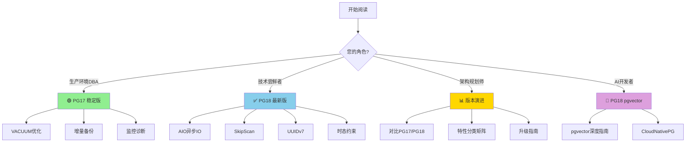

# PostgreSQL 版本特性深度解析

> **从 PG17 到 PG19，全面覆盖每个版本的核心特性**
>
> 📊 **当前文档数**: 20+ 篇深度技术文档 | 🎯 **覆盖版本**: PG17 / PG18 / PG19预览

---

## 📋 版本概览

| 版本 | 发布日期 | 状态 | 文档数 | 核心特性 |
|------|----------|------|--------|----------|
| **PG 19** | 2026-09 (预计) | 🔧 开发中 | 0 | 跟踪中... |
| **PG 18** | 2025-09-25 | ✅ 已发布 | 12 | AIO, SkipScan, UUIDv7... |
| **PG 17** | 2024-09-26 | 🟢 稳定版 | 8 | VACUUM优化, 增量备份... |

---

## 🚀 快速导航

### 🟢 PostgreSQL 17 (稳定版 - 8篇文档)

| # | 文档 | 核心特性 | 适用场景 |
|---|------|----------|----------|
| 01 | [VACUUM内存优化](./17-Released/17.01-VACUUM-Memory-Optimization-DEEP-V2.md) | 内存使用优化, 性能提升 | 大数据库维护 |
| 02 | [增量备份](./17-Released/17.02-Incremental-Backup-DEEP-V2.md) | 块级增量备份 | 备份策略优化 |
| 03 | [JSON_TABLE](./17-Released/17.03-JSON_TABLE-DEEP-V2.md) | SQL/JSON标准实现 | JSON数据处理 |
| 04 | [MERGE增强](./17-Released/17.04-MERGE-Enhancements-DEEP-V2.md) | RETURNING子句支持 | ETL数据同步 |
| 05 | [逻辑复制升级](./17-Released/17.05-Logical-Replication-Upgrades-DEEP-V2.md) | 版本升级改进 | 高可用架构 |
| 06 | [pg_maintain角色](./17-Released/17.06-pg_maintain-Role-DEEP-V2.md) | 维护权限分离 | 安全管理 |
| 07 | [监控诊断增强](./17-Released/17.07-Monitoring-Diagnostics-DEEP-V2.md) | pg_stat_io等新视图 | 运维监控 |
| 08 | [升级指南](./17-Released/17.08-Upgrade-Guide-DEEP-V2.md) | 17升级最佳实践 | 版本迁移 |

### ✅ PostgreSQL 18 (最新版 - 12篇文档)

| # | 文档 | 核心特性 | 性能提升 |
|---|------|----------|----------|
| 01 | [AIO异步IO](./18-Released/18.01-AIO-DEEP-V2.md) | Linux AIO原生支持 | +200-300% |
| 02 | [SkipScan](./18-Released/18.02-SkipScan-DEEP-V2.md) | 跳跃扫描优化 | +10-100倍 |
| 03 | [UUIDv7](./18-Released/18.03-UUIDv7-DEEP-V2.md) | 时间排序UUID | +300-500% |
| 04 | [虚拟生成列](./18-Released/18.04-Virtual-Generated-Columns-DEEP-V2.md) | STORED/VIRTUAL列 | 存储优化 |
| 05 | [时态约束](./18-Released/18.05-Temporal-Constraints-DEEP-V2.md) | SQL:2011标准 | 数据完整性 |
| 06 | [OAuth2集成](./18-Released/18.06-OAuth2-Integration-DEEP-V2.md) | 现代身份验证 | 安全增强 |
| 07 | [并行GIN构建](./18-Released/18.07-Parallel-GIN-Build-DEEP-V2.md) | 并行索引创建 | +400-650% |
| 08 | [pg_upgrade增强](./18-Released/18.08-pg_upgrade-Enhancements-DEEP-V2.md) | 升级流程优化 | 运维效率 |
| 09 | [pgvector向量](./18-Released/18.09-pgvector-DEEP-V2.md) | AI向量检索 | AI应用支持 |
| 10 | [CloudNativePG](./18-Released/18.10-CloudNativePG-DEEP-V2.md) | K8s原生运维 | 云原生部署 |
| 11 | [OpenTelemetry](./18-Released/18.11-OpenTelemetry-DEEP-V2.md) | 可观测性标准 | 现代监控 |
| 12 | [LZ4压缩](./18-Released/18.12-LZ4-Compression-DEEP-V2.md) | WAL/TOAST压缩 | 存储节省 |

### 🔧 PostgreSQL 19 (预览版)

> 🚧 **开发中** - 预计2026年9月发布
>
> 关注 [PG19预览目录](./19-Preview/) 获取最新动态

---

## 📊 特性分类矩阵

### 按类别展示跨版本特性演进

| 类别 | PG17 | PG18 | PG19 |
|------|------|------|------|
| **⚡ 性能优化** | VACUUM内存优化 | AIO, SkipScan, 并行GIN | 跟踪中... |
| **💾 存储引擎** | 增量备份 | LZ4压缩, 虚拟生成列 | 跟踪中... |
| **🔄 复制与高可用** | 逻辑复制升级 | CloudNativePG | 跟踪中... |
| **📈 监控诊断** | pg_stat_io | OpenTelemetry | 跟踪中... |
| **🔐 安全** | pg_maintain角色 | OAuth2集成 | 跟踪中... |
| **👨‍💻 开发者体验** | JSON_TABLE | UUIDv7, 时态约束 | 跟踪中... |

### 性能提升对比图

```
性能提升幅度对比 (相比上一版本)
┌─────────────────────────────────────────────────────────┐
│ PG17                                                    │
│  ├── VACUUM内存优化  ████████░░░░░░░░░░░░  +40%        │
│  └── 增量备份        ██████░░░░░░░░░░░░░░░  +60% 备份速度│
│                                                         │
│ PG18                                                    │
│  ├── AIO异步IO       ████████████████████  +200-300%   │
│  ├── SkipScan        █████████████████████ +10-100x    │
│  ├── UUIDv7写入      ████████████████████  +300-500%   │
│  └── 并行GIN构建     ████████████████████  +400-650%   │
└─────────────────────────────────────────────────────────┘
```

---

## 🎯 阅读路径指南

### 如何选择开始阅读？



### 📖 按角色推荐

| 角色 | 推荐阅读 | 理由 |
|------|----------|------|
| **🏭 生产环境DBA** | [PG17系列](./17-Released/) | 稳定可靠，经过生产验证 |
| **🧪 技术尝鲜者** | [PG18系列](./18-Released/) | 最新特性，性能突破 |
| **🏗️ 架构师** | [版本对比](#特性分类矩阵) + [升级指南](./17-Released/17.08-Upgrade-Guide-DEEP-V2.md) | 全面规划，技术选型 |
| **🤖 AI开发者** | [pgvector](./18-Released/18.09-pgvector-DEEP-V2.md) | AI向量数据库支持 |
| **☁️ 云原生工程师** | [CloudNativePG](./18-Released/18.10-CloudNativePG-DEEP-V2.md) | Kubernetes原生运维 |
| **🔒 安全工程师** | [OAuth2](./18-Released/18.06-OAuth2-Integration-DEEP-V2.md) | 现代身份验证体系 |

---

## 🗓️ 更新日志

| 日期 | 版本 | 变更内容 |
|------|------|----------|
| **2026-04-07** | PG17 | ✅ 完成 8 篇核心文档 |
| **2026-04-07** | PG18 | ✅ 完成 12 篇文档迁移和核实 |
| 2025-09-25 | PG18 | 🎉 PostgreSQL 18 正式发布 |
| 2024-09-26 | PG17 | PostgreSQL 17 正式发布 |

---

## 📁 目录结构

```text
PostgreSQL_Formal/00-Version-Specific/
│
├── README.md                          # 📋 本文档 - 版本特性导航中心
│
├── 17-Released/                       # 🟢 PG17 稳定版 (8篇)
│   ├── 17.01-VACUUM-Memory-Optimization-DEEP-V2.md
│   ├── 17.02-Incremental-Backup-DEEP-V2.md
│   ├── 17.03-JSON_TABLE-DEEP-V2.md
│   ├── 17.04-MERGE-Enhancements-DEEP-V2.md
│   ├── 17.05-Logical-Replication-Upgrades-DEEP-V2.md
│   ├── 17.06-pg_maintain-Role-DEEP-V2.md
│   ├── 17.07-Monitoring-Diagnostics-DEEP-V2.md
│   └── 17.08-Upgrade-Guide-DEEP-V2.md
│
├── 18-Released/                       # ✅ PG18 最新版 (12篇)
│   ├── INDEX.md                       # PG18完整索引
│   ├── 18.01-AIO-DEEP-V2.md
│   ├── 18.02-SkipScan-DEEP-V2.md
│   ├── 18.03-UUIDv7-DEEP-V2.md
│   ├── 18.04-Virtual-Generated-Columns-DEEP-V2.md
│   ├── 18.05-Temporal-Constraints-DEEP-V2.md
│   ├── 18.06-OAuth2-Integration-DEEP-V2.md
│   ├── 18.07-Parallel-GIN-Build-DEEP-V2.md
│   ├── 18.08-pg_upgrade-Enhancements-DEEP-V2.md
│   ├── 18.09-pgvector-DEEP-V2.md
│   ├── 18.10-CloudNativePG-DEEP-V2.md
│   ├── 18.11-OpenTelemetry-DEEP-V2.md
│   └── 18.12-LZ4-Compression-DEEP-V2.md
│
└── 19-Preview/                        # 🔧 PG19 预览 (占位)
```

---

## 🔗 相关资源

- [PostgreSQL 18 新特性完整索引](../00-NewFeatures-18/00-COMPLETE-COVERAGE-INDEX.md) - 详细特性对照表
- [PostgreSQL Formal 项目首页](../README.md) - 完整技术体系
- [PG18 版本索引](./18-Released/INDEX.md) - PG18专用导航

---

**最后更新**: 2026-04-07
**文档版本**: v1.0
**状态**: ✅ 活跃维护
