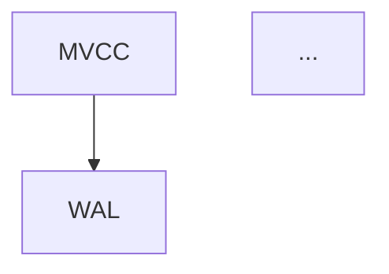

# PostgreSQL_Formal 知识图谱

PostgreSQL_Formal 文档知识图谱 - 建立文档间的关联关系，便于导航和学习路径规划。

## 📋 概述

知识图谱是 PostgreSQL_Formal 项目的核心导航组件，通过结构化的方式组织 194 篇技术文档，建立概念关联、定义学习路径、支持主题分类。

### 主要功能

| 功能 | 说明 |
|------|------|
| 🧠 概念节点 | 定义 30+ 核心概念，包含关联文档和相关概念 |
| 🎯 学习路径 | 提供 4 条系统化的学习路线 (DBA/开发者/架构师/形式化方法) |
| 📂 主题分类 | 按 9 大主题组织文档 (性能/安全/存储/并发等) |
| 📦 版本矩阵 | 追踪 PostgreSQL 17/18 新特性 |
| 🕸️ 关系图谱 | 可视化文档间的依赖和关联关系 |

## 📁 文件结构

```
PostgreSQL_Formal/
├── KNOWLEDGE_GRAPH.yml          # 知识图谱数据文件 (核心)
├── KNOWLEDGE_GRAPH_README.md    # 本文档
├── tools/
│   └── generate-graph.py        # 可视化生成脚本
└── visualization/               # 生成的可视化文件
    ├── knowledge-graph.mmd      # Mermaid 图
    ├── knowledge-graph.html     # HTML 可视化页面
    └── KNOWLEDGE-NAV.md         # Markdown 导航
```

## 🚀 快速开始

### 1. 查看知识图谱

直接在浏览器中打开可视化页面：

```bash
# 生成可视化文件
cd PostgreSQL_Formal/tools
python generate-graph.py

# 打开 HTML 页面
open ../visualization/knowledge-graph.html  # macOS
start ../visualization/knowledge-graph.html # Windows
xdg-open ../visualization/knowledge-graph.html # Linux
```

### 2. 使用命令行工具

```bash
# 生成所有可视化
python tools/generate-graph.py

# 仅生成 Mermaid 图
python tools/generate-graph.py --format mermaid

# 仅生成 HTML 页面
python tools/generate-graph.py --format html

# 指定输出目录
python tools/generate-graph.py --output-dir ./my-output
```

### 3. 查看导航文档

生成的 Markdown 导航文档提供了完整的文档索引：

```markdown
visualization/KNOWLEDGE-NAV.md
```

## 📊 知识图谱结构

### 概念节点 (Concepts)

每个概念节点包含：

```yaml
- id: "mvcc"                    # 唯一标识
  name: "MVCC (多版本并发控制)"  # 显示名称
  category: "concurrency"       # 所属分类
  description: "..."            # 概念描述
  documents:                    # 关联文档列表
    - "04-Concurrency/01-MVCC-DEEP-V2.md"
  related:                      # 相关概念
    - "transaction"
    - "isolation"
  difficulty: "advanced"        # 难度级别
```

### 学习路径 (Learning Paths)

```yaml
dba_path:
  name: "DBA 学习路径"
  description: "..."
  target_audience: "DBA、运维工程师"
  estimated_hours: 80
  steps:
    - name: "理论基础"
      documents: [...]
```

### 主题分类 (Categories)

```yaml
performance:
  name: "性能优化"
  description: "..."
  documents: [...]
```

### 版本矩阵 (Version Matrix)

```yaml
v18:
  version: "18"
  status: "development"
  features:
    - id: "aio"
      name: "异步 I/O"
      document: "..."
      category: "performance"
```

## 🛠️ 如何贡献

### 添加新概念

1. 在 `KNOWLEDGE_GRAPH.yml` 的 `concepts` 部分添加：

```yaml
- id: "my_concept"
  name: "我的新概念"
  category: "storage"  # 选择合适分类
  description: "概念描述..."
  documents:
    - "path/to/document.md"
  related: ["existing_concept1", "existing_concept2"]
  difficulty: "intermediate"  # beginner/intermediate/advanced/expert
```

1. 运行可视化脚本更新输出：

```bash
python tools/generate-graph.py
```

### 添加新学习路径

```yaml
new_path:
  name: "新学习路径"
  description: "路径描述"
  target_audience: "目标受众"
  estimated_hours: 40
  steps:
    - name: "第一步"
      documents:
        - "doc1.md"
        - "doc2.md"
```

### 更新主题分类

向现有分类添加文档：

```yaml
categories:
  performance:
    documents:
      - "existing/doc.md"
      - "new/your-doc.md"  # 添加新文档
```

### 添加文档关系

```yaml
relationships:
  - from: "new/document.md"
    to: "existing/document.md"
    type: "prerequisite"  # prerequisite/extends/related/contrasts
    description: "关系说明"
```

## 📈 难度级别定义

| 级别 | 标识 | 说明 | 适合人群 |
|------|------|------|----------|
| Beginner | 🟢 | 入门级，基础知识 | 初学者 |
| Intermediate | 🟡 | 中级，需要一定经验 | 有使用经验的开发者 |
| Advanced | 🔴 | 高级，深入内部实现 | DBA、高级开发者 |
| Expert | ⚫ | 专家级，形式化分析 | 内核开发者、研究人员 |

## 🎨 可视化说明

### Mermaid 图元素

```mermaid
graph TB
    A[概念A] --> B[概念B]           % 相关关系
    C -.->|prereq| D                % 前置依赖
    E ==>|extends| F                % 扩展关系
    G -.->|contrasts| H             % 对比关系
```

### HTML 可视化特性

- 📊 统计仪表盘：显示概念数、文档数、路径数
- 🧭 标签导航：概念/路径/分类/图谱切换
- 🔍 交互式图表：可缩放的关系图谱
- 📱 响应式设计：适配移动端

## 🔗 与其他系统集成

### GitHub Pages

将 `visualization/knowledge-graph.html` 部署到 GitHub Pages：

```yaml
# .github/workflows/pages.yml
name: Deploy Knowledge Graph
on:
  push:
    branches: [ main ]
jobs:
  deploy:
    runs-on: ubuntu-latest
    steps:
      - uses: actions/checkout@v3
      - name: Setup Python
        uses: actions/setup-python@v4
        with:
          python-version: '3.x'
      - name: Install dependencies
        run: pip install pyyaml
      - name: Generate visualization
        run: python PostgreSQL_Formal/tools/generate-graph.py
      - name: Deploy to GitHub Pages
        uses: peaceiris/actions-gh-pages@v3
        with:
          github_token: ${{ secrets.GITHUB_TOKEN }}
          publish_dir: ./PostgreSQL_Formal/visualization
```

### 嵌入其他文档

在 Markdown 中嵌入 Mermaid 图：

```markdown


```

### API 访问

Python 脚本可以作为库使用：

```python
from tools.generate_graph import KnowledgeGraphVisualizer

viz = KnowledgeGraphVisualizer('KNOWLEDGE_GRAPH.yml')

# 获取相关概念
concept = viz.get_concept('mvcc')
related = viz.get_related_concepts('mvcc')

# 获取学习路径
path = viz.get_learning_path('dba_path')

# 生成自定义图表
mermaid = viz.generate_mermaid_concept_graph()
```

## 📚 相关资源

- [项目主 README](./README.md)
- [学习路径文档](../LEARNING-PATH.md) - 如果存在
- [形式化方法文档](./06-FormalMethods/)

## 📝 更新日志

### v1.0.0 (2026-04-07)

- ✅ 初始版本发布
- ✅ 30+ 核心概念节点
- ✅ 4 条学习路径
- ✅ 9 大主题分类
- ✅ PostgreSQL 17/18 版本矩阵
- ✅ Mermaid/HTML/Markdown 三种可视化输出

## 🤝 贡献指南

1. **Fork 项目** 并创建特性分支
2. **修改 KNOWLEDGE_GRAPH.yml** 添加你的贡献
3. **运行测试** `python tools/generate-graph.py`
4. **提交 Pull Request** 描述你的变更

### 贡献规范

- 概念 ID 使用小写下划线命名
- 文档路径使用相对路径（从 PostgreSQL_Formal 目录开始）
- 描述简洁清晰，不超过 100 字
- 难度评估要客观

## 📄 许可证

与 PostgreSQL_Formal 项目保持一致。

---

**维护者**: PostgreSQL_Formal 项目团队
**最后更新**: 2026-04-07
