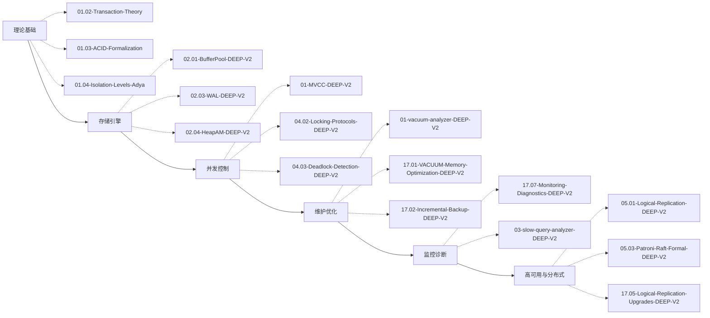
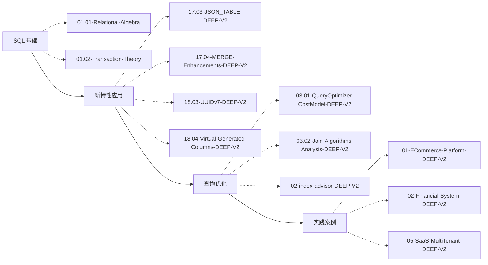
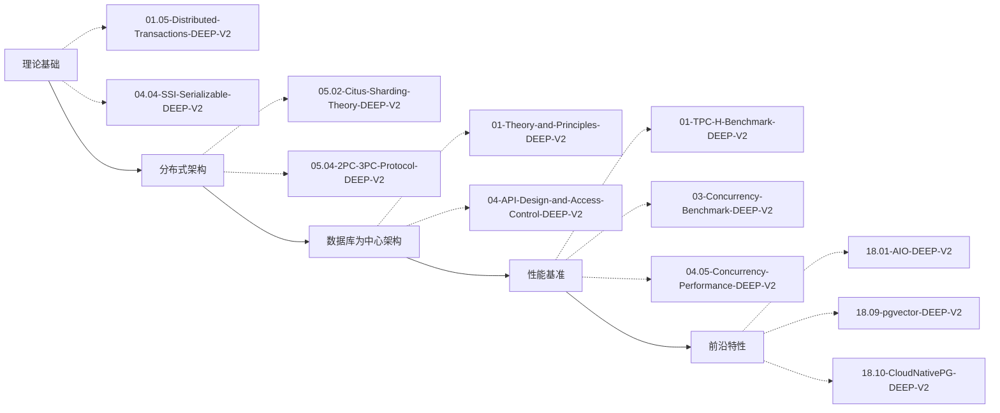
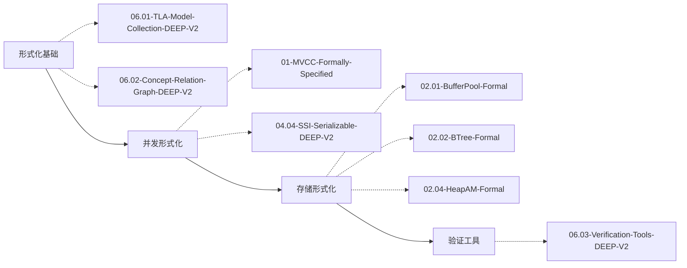

# PostgreSQL_Formal 知识图谱导航

> 📊 自动生成于 2026-04-07 10:39:21

## 📑 目录

- [核心概念](#-核心概念)
- [学习路径](#-学习路径)
- [主题分类](#-主题分类)
- [版本特性](#-版本特性)
- [关系图谱](#️-关系图谱)

---

## 🧠 核心概念

### Architecture

- 🔴 **数据库为中心架构 (DCA)** - 以数据库为核心的应用架构模式
  - [01-Theory-and-Principles-DEEP-V2.md](../11-Database-Centric-Architecture/01-Theory-and-Principles-DEEP-V2.md)
  - [02-Stored-Procedure-Patterns-DEEP-V2.md](../11-Database-Centric-Architecture/02-Stored-Procedure-Patterns-DEEP-V2.md)

### Concurrency

- 🔴 **MVCC (多版本并发控制)** - PostgreSQL 的核心并发控制机制，通过保存数据多个版本来实现读写不阻塞
  - [01-MVCC-DEEP-V2.md](../04-Concurrency/01-MVCC-DEEP-V2.md)
  - [01-MVCC-DEEP-V2.md](../04-Concurrency/01-MVCC-DEEP-V2.md)
- 🟢 **事务 (Transaction)** - 数据库事务的原子性操作单元
  - [01.02-Transaction-Theory-DEEP-V2.md](../01-Theory/01.02-Transaction-Theory-DEEP-V2.md)
  - [01.02-Transaction-Theory-DEEP-V2.md](../01-Theory/01.02-Transaction-Theory-DEEP-V2.md)
- 🔴 **隔离级别 (Isolation Levels)** - SQL 标准定义的事务隔离级别及其实现
  - [01.04-Isolation-Levels-Adya-DEEP-V2.md](../01-Theory/01.04-Isolation-Levels-Adya-DEEP-V2.md)
  - [01.04-Isolation-Levels-Adya-DEEP-V2.md](../01-Theory/01.04-Isolation-Levels-Adya-DEEP-V2.md)
- 🟡 **锁机制 (Locking)** - 表级锁、行级锁、死锁检测等并发控制机制
  - [04.02-Locking-Protocols-DEEP-V2.md](../04-Concurrency/04.02-Locking-Protocols-DEEP-V2.md)
  - [04.02-Locking-Protocols-DEEP-V2.md](../04-Concurrency/04.02-Locking-Protocols-DEEP-V2.md)
- 🟡 **死锁检测 (Deadlock Detection)** - 自动检测和解决事务间的循环等待
  - [04.03-Deadlock-Detection-DEEP-V2.md](../04-Concurrency/04.03-Deadlock-Detection-DEEP-V2.md)
  - [04.03-Deadlock-Detection-DEEP-V2.md](../04-Concurrency/04.03-Deadlock-Detection-DEEP-V2.md)
- 🔴 **SSI (可串行化快照隔离)** - PostgreSQL 实现的可串行化隔离级别
  - [04.04-SSI-Serializable-DEEP-V2.md](../04-Concurrency/04.04-SSI-Serializable-DEEP-V2.md)
  - [04.04-SSI-Serializable-DEEP-V2.md](../04-Concurrency/04.04-SSI-Serializable-DEEP-V2.md)

### Distributed

- 🔴 **逻辑复制 (Logical Replication)** - 基于发布-订阅模式的数据复制
  - [05.01-Logical-Replication-DEEP-V2.md](../05-Distributed/05.01-Logical-Replication-DEEP-V2.md)
  - [05.01-Logical-Replication-DEEP-V2.md](../05-Distributed/05.01-Logical-Replication-DEEP-V2.md)
- 🔴 **Citus 分片** - PostgreSQL 的分布式扩展方案
  - [05.02-Citus-Sharding-Theory-DEEP-V2.md](../05-Distributed/05.02-Citus-Sharding-Theory-DEEP-V2.md)
  - [05.02-Citus-Sharding-Theory-DEEP-V2.md](../05-Distributed/05.02-Citus-Sharding-Theory-DEEP-V2.md)
- 🔴 **Patroni 高可用** - 基于 Raft 的 PostgreSQL 高可用方案
  - [05.03-Patroni-Raft-Formal-DEEP-V2.md](../05-Distributed/05.03-Patroni-Raft-Formal-DEEP-V2.md)
  - [05.03-Patroni-Raft-Formal-DEEP-V2.md](../05-Distributed/05.03-Patroni-Raft-Formal-DEEP-V2.md)
- 🔴 **两阶段提交 (2PC/3PC)** - 分布式事务提交协议
  - [05.04-2PC-3PC-Protocol-DEEP-V2.md](../05-Distributed/05.04-2PC-3PC-Protocol-DEEP-V2.md)
  - [05.04-2PC-3PC-Protocol-DEEP-V2.md](../05-Distributed/05.04-2PC-3PC-Protocol-DEEP-V2.md)

### Features

- 🟢 **UUIDv7** - 时间排序 UUID 支持
  - [18.03-UUIDv7-DEEP-V2.md](../00-NewFeatures-18/18.03-UUIDv7-DEEP-V2.md)
  - [18.03-UUIDv7-Math.md](../00-NewFeatures-18/18.03-UUIDv7-Math.md)
- 🟡 **虚拟生成列 (Virtual Generated Columns)** - 动态计算的列值
  - [18.04-Virtual-Generated-Columns-DEEP-V2.md](../00-NewFeatures-18/18.04-Virtual-Generated-Columns-DEEP-V2.md)
  - [18.04-Virtual-Generated-Columns.md](../00-NewFeatures-18/18.04-Virtual-Generated-Columns.md)
- 🟡 **JSON_TABLE** - 将 JSON 数据转换为关系表
  - [17.03-JSON_TABLE-DEEP-V2.md](../00-Version-Specific/17-Released/17.03-JSON_TABLE-DEEP-V2.md)
- 🟡 **MERGE 语句** - SQL 标准 MERGE (INSERT/UPDATE/DELETE)
  - [17.04-MERGE-Enhancements-DEEP-V2.md](../00-Version-Specific/17-Released/17.04-MERGE-Enhancements-DEEP-V2.md)
- 🔴 **pgvector 向量扩展** - 向量相似度搜索扩展
  - [18.09-pgvector-DEEP-V2.md](../00-NewFeatures-18/18.09-pgvector-DEEP-V2.md)
  - [18.09-pgvector-Formal.md](../00-NewFeatures-18/18.09-pgvector-Formal.md)

### Formal Methods

- ⚫ **TLA+ 形式化验证** - 使用 TLA+ 对 PostgreSQL 进行形式化建模
  - [06.01-TLA-Model-Collection-DEEP-V2.md(../06-FormalMethods/06.01-TLA-Model-Collection-DEEP-V2.md)
  - [06.01-TLA-Model-Collection-DEEP-V2.md(../06-FormalMethods/06.01-TLA-Model-Collection-DEEP-V2.md)
- 🟡 **概念关系图** - 系统化的概念关联分析
  - [06.02-Concept-Relation-Graph-DEEP-V2.md(../06-FormalMethods/06.02-Concept-Relation-Graph-DEEP-V2.md)
  - [06.02-Concept-Relation-Graph-DEEP-V2.md(../06-FormalMethods/06.02-Concept-Relation-Graph-DEEP-V2.md)

### Maintenance

- 🟡 **VACUUM 清理** - 回收死元组空间，防止表膨胀
  - [01-vacuum-analyzer-DEEP-V2.md](../09-Tools/01-vacuum-analyzer-DEEP-V2.md)
  - [01-vacuum-analyzer-DEEP-V2.md](../09-Tools/01-vacuum-analyzer-DEEP-V2.md)

### Performance

- 🔴 **异步 I/O (AIO)** - PostgreSQL 18 引入的异步 I/O 特性
  - [18.01-AIO-DEEP-V2.md](../00-NewFeatures-18/18.01-AIO-DEEP-V2.md)
  - [18.01-AIO-Formal.md](../00-NewFeatures-18/18.01-AIO-Formal.md)
- 🟡 **Skip Scan** - 跳过索引前缀的优化扫描
  - [18.02-SkipScan-DEEP-V2.md](../00-NewFeatures-18/18.02-SkipScan-DEEP-V2.md)
  - [18.02-SkipScan-Analysis.md](../00-NewFeatures-18/18.02-SkipScan-Analysis.md)

### Query

- 🔴 **查询优化器 (Query Optimizer)** - 基于代价模型的 SQL 查询计划生成
  - [03.01-QueryOptimizer-CostModel-DEEP-V2.md](../03-Query/03.01-QueryOptimizer-CostModel-DEEP-V2.md)
  - [03.01-QueryOptimizer-CostModel-DEEP-V2.md](../03-Query/03.01-QueryOptimizer-CostModel-DEEP-V2.md)
- 🔴 **代价模型 (Cost Model)** - 评估查询计划执行代价的数学模型
  - [03.01-QueryOptimizer-CostModel-DEEP-V2.md](../03-Query/03.01-QueryOptimizer-CostModel-DEEP-V2.md)
- 🟡 **连接算法 (Join Algorithms)** - Nested Loop、Hash Join、Merge Join 等连接实现
  - [03.02-Join-Algorithms-Analysis-DEEP-V2.md](../03-Query/03.02-Join-Algorithms-Analysis-DEEP-V2.md)
  - [03.02-Join-Algorithms-Analysis-DEEP-V2.md](../03-Query/03.02-Join-Algorithms-Analysis-DEEP-V2.md)
- 🟡 **统计信息 (Statistics)** - 用于查询优化的数据分布统计
  - [03.03-Statistics-Derivation-DEEP-V2.md](../03-Query/03.03-Statistics-Derivation-DEEP-V2.md)
  - [03.03-Statistics-Derivation-DEEP-V2.md](../03-Query/03.03-Statistics-Derivation-DEEP-V2.md)
- 🔴 **JIT 编译 (Just-In-Time)** - 运行时表达式编译加速
  - [03.04-JIT-Compilation-DEEP-V2.md](../03-Query/03.04-JIT-Compilation-DEEP-V2.md)
  - [03.04-JIT-Compilation-DEEP-V2.md](../03-Query/03.04-JIT-Compilation-DEEP-V2.md)

### Security

- 🔴 **OAuth2 集成** - 外部身份认证集成
  - [18.06-OAuth2-Integration-DEEP-V2.md](../00-NewFeatures-18/18.06-OAuth2-Integration-DEEP-V2.md)
  - [18.06-OAuth2-Integration.md](../00-NewFeatures-18/18.06-OAuth2-Integration.md)
- 🟢 **pg_maintain 角色** - PostgreSQL 17 维护操作专用角色
  - [17.06-pg_maintain-Role-DEEP-V2.md](../00-Version-Specific/17-Released/17.06-pg_maintain-Role-DEEP-V2.md)

### Storage

- 🔴 **WAL (预写式日志)** - 保证数据持久性和崩溃恢复的核心机制
  - [02.03-WAL-DEEP-V2.md](../02-Storage/02.03-WAL-DEEP-V2.md)
  - [02.03-WAL-DEEP-V2.md](../02-Storage/02.03-WAL-DEEP-V2.md)
- 🟡 **Buffer Pool (缓冲池)** - 内存中的数据页缓存管理机制
  - [02.01-BufferPool-DEEP-V2.md](../02-Storage/02.01-BufferPool-DEEP-V2.md)
  - [02.01-BufferPool-DEEP-V2.md](../02-Storage/02.01-BufferPool-DEEP-V2.md)
- 🟡 **B-Tree 索引** - PostgreSQL 默认的索引类型，基于 B-Tree 数据结构
  - [02.02-BTree-DEEP-V2.md](../02-Storage/02.02-BTree-DEEP-V2.md)
  - [02.02-BTree-DEEP-V2.md](../02-Storage/02.02-BTree-DEEP-V2.md)
- 🔴 **Heap Access Method** - 堆表存储访问方法，管理表数据的物理存储
  - [02.04-HeapAM-DEEP-V2.md](../02-Storage/02.04-HeapAM-DEEP-V2.md)
  - [02.04-HeapAM-DEEP-V2.md](../02-Storage/02.04-HeapAM-DEEP-V2.md)

### Theory

- 🟢 **ACID 属性** - 原子性、一致性、隔离性、持久性
  - [01.03-ACID-Formalization-DEEP-V2.md](../01-Theory/01.03-ACID-Formalization-DEEP-V2.md)
  - [01.03-ACID-Formalization-DEEP-V2.md](../01-Theory/01.03-ACID-Formalization-DEEP-V2.md)

### Tools

- 🟡 **索引顾问 (Index Advisor)** - 智能索引推荐工具
  - [02-index-advisor-DEEP-V2.md](../09-Tools/02-index-advisor-DEEP-V2.md)
  - [02-index-advisor-DEEP-V2.md](../09-Tools/02-index-advisor-DEEP-V2.md)
- 🟡 **慢查询分析** - 慢查询诊断和优化工具
  - [03-slow-query-analyzer-DEEP-V2.md](../09-Tools/03-slow-query-analyzer-DEEP-V2.md)
  - [03-slow-query-analyzer-DEEP-V2.md](../09-Tools/03-slow-query-analyzer-DEEP-V2.md)

---

## 🎯 学习路径

### DBA 学习路径

**目标受众:** DBA、运维工程师
**预计学时:** 80 小时

从基础到高级的 PostgreSQL 数据库管理员学习路线

1. **理论基础**
   - [01.02-Transaction-Theory-DEEP-V2.md](../01-Theory/01.02-Transaction-Theory-DEEP-V2.md)
   - [01.03-ACID-Formalization-DEEP-V2.md](../01-Theory/01.03-ACID-Formalization-DEEP-V2.md)
   - [01.04-Isolation-Levels-Adya-DEEP-V2.md](../01-Theory/01.04-Isolation-Levels-Adya-DEEP-V2.md)
2. **存储引擎**
   - [02.01-BufferPool-DEEP-V2.md](../02-Storage/02.01-BufferPool-DEEP-V2.md)
   - [02.03-WAL-DEEP-V2.md](../02-Storage/02.03-WAL-DEEP-V2.md)
   - [02.04-HeapAM-DEEP-V2.md](../02-Storage/02.04-HeapAM-DEEP-V2.md)
3. **并发控制**
   - [01-MVCC-DEEP-V2.md](../04-Concurrency/01-MVCC-DEEP-V2.md)
   - [04.02-Locking-Protocols-DEEP-V2.md](../04-Concurrency/04.02-Locking-Protocols-DEEP-V2.md)
   - [04.03-Deadlock-Detection-DEEP-V2.md](../04-Concurrency/04.03-Deadlock-Detection-DEEP-V2.md)
4. **维护优化**
   - [01-vacuum-analyzer-DEEP-V2.md](../09-Tools/01-vacuum-analyzer-DEEP-V2.md)
   - [17.01-VACUUM-Memory-Optimization-DEEP-V2.md](../00-Version-Specific/17-Released/17.01-VACUUM-Memory-Optimization-DEEP-V2.md)
   - [17.02-Incremental-Backup-DEEP-V2.md](../00-Version-Specific/17-Released/17.02-Incremental-Backup-DEEP-V2.md)
5. **监控诊断**
   - [17.07-Monitoring-Diagnostics-DEEP-V2.md](../00-Version-Specific/17-Released/17.07-Monitoring-Diagnostics-DEEP-V2.md)
   - [03-slow-query-analyzer-DEEP-V2.md](../09-Tools/03-slow-query-analyzer-DEEP-V2.md)
6. **高可用与分布式**
   - [05.01-Logical-Replication-DEEP-V2.md](../05-Distributed/05.01-Logical-Replication-DEEP-V2.md)
   - [05.03-Patroni-Raft-Formal-DEEP-V2.md](../05-Distributed/05.03-Patroni-Raft-Formal-DEEP-V2.md)
   - [17.05-Logical-Replication-Upgrades-DEEP-V2.md](../00-Version-Specific/17-Released/17.05-Logical-Replication-Upgrades-DEEP-V2.md)

### 开发者学习路径

**目标受众:** 应用开发者、后端工程师
**预计学时:** 60 小时

面向应用开发者的 PostgreSQL 使用指南

1. **SQL 基础**
   - [01.01-Relational-Algebra-DEEP-V2.md](../01-Theory/01.01-Relational-Algebra-DEEP-V2.md)
   - [01.02-Transaction-Theory-DEEP-V2.md](../01-Theory/01.02-Transaction-Theory-DEEP-V2.md)
2. **新特性应用**
   - [17.03-JSON_TABLE-DEEP-V2.md](../00-Version-Specific/17-Released/17.03-JSON_TABLE-DEEP-V2.md)
   - [17.04-MERGE-Enhancements-DEEP-V2.md](../00-Version-Specific/17-Released/17.04-MERGE-Enhancements-DEEP-V2.md)
   - [18.03-UUIDv7-DEEP-V2.md](../00-Version-Specific/18-Released/18.03-UUIDv7-DEEP-V2.md)
   - [18.04-Virtual-Generated-Columns-DEEP-V2.md](../00-Version-Specific/18-Released/18.04-Virtual-Generated-Columns-DEEP-V2.md)
3. **查询优化**
   - [03.01-QueryOptimizer-CostModel-DEEP-V2.md](../03-Query/03.01-QueryOptimizer-CostModel-DEEP-V2.md)
   - [03.02-Join-Algorithms-Analysis-DEEP-V2.md](../03-Query/03.02-Join-Algorithms-Analysis-DEEP-V2.md)
   - [02-index-advisor-DEEP-V2.md](../09-Tools/02-index-advisor-DEEP-V2.md)
4. **实践案例**
   - [01-ECommerce-Platform-DEEP-V2.md](../07-PracticalCases/01-ECommerce-Platform-DEEP-V2.md)
   - [02-Financial-System-DEEP-V2.md](../07-PracticalCases/02-Financial-System-DEEP-V2.md)
   - [05-SaaS-MultiTenant-DEEP-V2.md](../07-PracticalCases/05-SaaS-MultiTenant-DEEP-V2.md)

### 架构师学习路径

**目标受众:** 系统架构师、技术负责人
**预计学时:** 100 小时

系统架构设计和高阶优化

1. **理论基础**
   - [01.05-Distributed-Transactions-DEEP-V2.md](../01-Theory/01.05-Distributed-Transactions-DEEP-V2.md)
   - [04.04-SSI-Serializable-DEEP-V2.md](../04-Concurrency/04.04-SSI-Serializable-DEEP-V2.md)
2. **分布式架构**
   - [05.02-Citus-Sharding-Theory-DEEP-V2.md](../05-Distributed/05.02-Citus-Sharding-Theory-DEEP-V2.md)
   - [05.04-2PC-3PC-Protocol-DEEP-V2.md](../05-Distributed/05.04-2PC-3PC-Protocol-DEEP-V2.md)
3. **数据库为中心架构**
   - [01-Theory-and-Principles-DEEP-V2.md](../11-Database-Centric-Architecture/01-Theory-and-Principles-DEEP-V2.md)
   - [04-API-Design-and-Access-Control-DEEP-V2.md](../11-Database-Centric-Architecture/04-API-Design-and-Access-Control-DEEP-V2.md)
4. **性能基准**
   - [01-TPC-H-Benchmark-DEEP-V2.md](../08-Performance/01-TPC-H-Benchmark-DEEP-V2.md)
   - [03-Concurrency-Benchmark-DEEP-V2.md](../08-Performance/03-Concurrency-Benchmark-DEEP-V2.md)
   - [04.05-Concurrency-Performance-DEEP-V2.md](../04-Concurrency/04.05-Concurrency-Performance-DEEP-V2.md)
5. **前沿特性**
   - [18.01-AIO-DEEP-V2.md](../00-Version-Specific/18-Released/18.01-AIO-DEEP-V2.md)
   - [18.09-pgvector-DEEP-V2.md](../00-Version-Specific/18-Released/18.09-pgvector-DEEP-V2.md)
   - [18.10-CloudNativePG-DEEP-V2.md](../00-Version-Specific/18-Released/18.10-CloudNativePG-DEEP-V2.md)

### 形式化方法专家路径

**目标受众:** 数据库内核开发者、研究人员
**预计学时:** 120 小时

深入 PostgreSQL 内核的形式化分析

1. **形式化基础**
   - [06.01-TLA-Model-Collection-DEEP-V2.md(../06-FormalMethods/06.01-TLA-Model-Collection-DEEP-V2.md)
   - [06.02-Concept-Relation-Graph-DEEP-V2.md(../06-FormalMethods/06.02-Concept-Relation-Graph-DEEP-V2.md)
2. **并发形式化**
   - [01-MVCC-DEEP-V2.md](../04-Concurrency/01-MVCC-DEEP-V2.md)
   - [04.04-SSI-Serializable-DEEP-V2.md](../04-Concurrency/04.04-SSI-Serializable-DEEP-V2.md)
3. **存储形式化**
   - [02.01-BufferPool-DEEP-V2.md](../02-Storage/02.01-BufferPool-DEEP-V2.md)
   - [02.02-BTree-DEEP-V2.md](../02-Storage/02.02-BTree-DEEP-V2.md)
   - [02.04-HeapAM-DEEP-V2.md](../02-Storage/02.04-HeapAM-DEEP-V2.md)
4. **验证工具**
   - [06.03-Verification-Tools-DEEP-V2.md(../06-FormalMethods/06.03-Verification-Tools-DEEP-V2.md)

---

## 📂 主题分类

### 性能优化

性能调优、基准测试和优化技术

*包含 13 篇文档*

### 安全

认证、授权和安全最佳实践

*包含 4 篇文档*

### 存储引擎

底层存储机制和物理数据结构

*包含 6 篇文档*

### 并发控制

事务、锁、MVCC 和并发管理

*包含 6 篇文档*

### 分布式系统

复制、分片和高可用架构

*包含 6 篇文档*

### AI/ML 集成

向量搜索和 AI 相关特性

*包含 3 篇文档*

### 云原生

Kubernetes 集成和云部署

*包含 3 篇文档*

### 工具与诊断

维护工具、诊断和监控

*包含 5 篇文档*

### 形式化方法

形式化验证和数学分析

*包含 3 篇文档*

---

## 📦 版本特性

### ✅ PostgreSQL 17

**发布时间:** 2024-09

| 特性 | 分类 | 文档 |
|------|------|------|
| VACUUM 内存优化 | performance | [17.01-VACUUM-Memory-Optimization-DEEP-V2.md](../00-Version-Specific/17-Released/17.01-VACUUM-Memory-Optimization-DEEP-V2.md) |
| 增量备份 | maintenance | [17.02-Incremental-Backup-DEEP-V2.md](../00-Version-Specific/17-Released/17.02-Incremental-Backup-DEEP-V2.md) |
| JSON_TABLE | sql_features | [17.03-JSON_TABLE-DEEP-V2.md](../00-Version-Specific/17-Released/17.03-JSON_TABLE-DEEP-V2.md) |
| MERGE 增强 | sql_features | [17.04-MERGE-Enhancements-DEEP-V2.md](../00-Version-Specific/17-Released/17.04-MERGE-Enhancements-DEEP-V2.md) |
| 逻辑复制升级 | distributed | [17.05-Logical-Replication-Upgrades-DEEP-V2.md](../00-Version-Specific/17-Released/17.05-Logical-Replication-Upgrades-DEEP-V2.md) |
| pg_maintain 角色 | security | [17.06-pg_maintain-Role-DEEP-V2.md](../00-Version-Specific/17-Released/17.06-pg_maintain-Role-DEEP-V2.md) |
| 监控诊断 | tools | [17.07-Monitoring-Diagnostics-DEEP-V2.md](../00-Version-Specific/17-Released/17.07-Monitoring-Diagnostics-DEEP-V2.md) |
| 升级指南 | maintenance | [17.08-Upgrade-Guide-DEEP-V2.md](../00-Version-Specific/17-Released/17.08-Upgrade-Guide-DEEP-V2.md) |

### 🚧 PostgreSQL 18

**预计发布:** 2025-09

| 特性 | 分类 | 文档 |
|------|------|------|
| 异步 I/O | performance | [18.01-AIO-DEEP-V2.md](../00-Version-Specific/18-Released/18.01-AIO-DEEP-V2.md) |
| Skip Scan | performance | [18.02-SkipScan-DEEP-V2.md](../00-Version-Specific/18-Released/18.02-SkipScan-DEEP-V2.md) |
| UUIDv7 | data_types | [18.03-UUIDv7-DEEP-V2.md](../00-Version-Specific/18-Released/18.03-UUIDv7-DEEP-V2.md) |
| 虚拟生成列 | ddl | [18.04-Virtual-Generated-Columns-DEEP-V2.md](../00-Version-Specific/18-Released/18.04-Virtual-Generated-Columns-DEEP-V2.md) |
| 时态约束 | sql_features | [18.05-Temporal-Constraints-DEEP-V2.md](../00-Version-Specific/18-Released/18.05-Temporal-Constraints-DEEP-V2.md) |
| OAuth2 集成 | security | [18.06-OAuth2-Integration-DEEP-V2.md](../00-Version-Specific/18-Released/18.06-OAuth2-Integration-DEEP-V2.md) |
| 并行 GIN 构建 | performance | [18.07-Parallel-GIN-Build-DEEP-V2.md](../00-Version-Specific/18-Released/18.07-Parallel-GIN-Build-DEEP-V2.md) |
| pg_upgrade 增强 | maintenance | [18.08-pg_upgrade-Enhancements-DEEP-V2.md](../00-Version-Specific/18-Released/18.08-pg_upgrade-Enhancements-DEEP-V2.md) |
| pgvector 向量扩展 | ai | [18.09-pgvector-DEEP-V2.md](../00-Version-Specific/18-Released/18.09-pgvector-DEEP-V2.md) |
| CloudNativePG | cloud_native | [18.10-CloudNativePG-DEEP-V2.md](../00-Version-Specific/18-Released/18.10-CloudNativePG-DEEP-V2.md) |
| OpenTelemetry | observability | [18.11-OpenTelemetry-DEEP-V2.md](../00-Version-Specific/18-Released/18.11-OpenTelemetry-DEEP-V2.md) |
| LZ4 压缩 | storage | [18.12-LZ4-Compression-DEEP-V2.md](../00-Version-Specific/18-Released/18.12-LZ4-Compression-DEEP-V2.md) |

---

## 🕸️ 关系图谱

### 概念关系图

```mermaid
graph TB
    mvcc["MVCC (多版本并发控制)"]
    wal["WAL (预写式日志)"]
    buffer_pool["Buffer Pool (缓冲池)"]
    btree["B-Tree 索引"]
    heap_am["Heap Access Method"]
    transaction["事务 (Transaction)"]
    isolation["隔离级别 (Isolation Levels)"]
    acid["ACID 属性"]
    locking["锁机制 (Locking)"]
    deadlock["死锁检测 (Deadlock Detection)"]
    ssi["SSI (可串行化快照隔离)"]
    query_optimizer["查询优化器 (Query Optimizer)"]
    cost_model["代价模型 (Cost Model)"]
    join_algorithms["连接算法 (Join Algorithms)"]
    statistics["统计信息 (Statistics)"]
    jit["JIT 编译 (Just-In-Time)"]
    logical_replication["逻辑复制 (Logical Replication)"]
    citus["Citus 分片"]
    patroni["Patroni 高可用"]
    2pc["两阶段提交 (2PC/3PC)"]
    vacuum["VACUUM 清理"]
    index_advisor["索引顾问 (Index Advisor)"]
    query_analysis["慢查询分析"]
    aio["异步 I/O (AIO)"]
    skip_scan["Skip Scan"]
    uuidv7["UUIDv7"]
    generated_columns["虚拟生成列 (Virtual Generated Columns)"]
    json_table["JSON_TABLE"]
    merge["MERGE 语句"]
    pgvector["pgvector 向量扩展"]
    oauth2["OAuth2 集成"]
    pg_maintain["pg_maintain 角色"]
    tla["TLA+ 形式化验证"]
    concept_graph["概念关系图"]
    dca["数据库为中心架构 (DCA)"]

    mvcc --> transaction
    mvcc --> isolation
    mvcc --> wal
    mvcc --> vacuum
    mvcc --> snapshot
    wal --> transaction
    wal --> mvcc
    wal --> replication
    wal --> recovery
    buffer_pool --> storage
    buffer_pool --> wal
    buffer_pool --> performance
    btree --> index
    btree --> query_optimization
    btree --> storage
    heap_am --> storage
    heap_am --> mvcc
    heap_am --> toast
    transaction --> acid
    transaction --> isolation
    transaction --> mvcc
    transaction --> wal
    transaction --> locking
    isolation --> transaction
    isolation --> mvcc
    isolation --> ssi
    isolation --> phenomena
    acid --> transaction
    acid --> consistency
    acid --> durability
    locking --> deadlock
    locking --> concurrency
    locking --> transaction
    deadlock --> locking
    deadlock --> concurrency
    ssi --> isolation
    ssi --> mvcc
    ssi --> serialization
    query_optimizer --> cost_model
    query_optimizer --> statistics
    query_optimizer --> join
    cost_model --> query_optimizer
    cost_model --> statistics
    join_algorithms --> query_optimizer
    join_algorithms --> performance
    statistics --> query_optimizer
    statistics --> cost_model
    jit --> performance
    jit --> query_execution
    logical_replication --> replication
    logical_replication --> streaming
    logical_replication --> conflict_resolution
    citus --> sharding
    citus --> distributed_transactions
    patroni --> ha
    patroni --> raft
    patroni --> failover
    2pc --> distributed_transactions
    2pc --> consensus
    vacuum --> mvcc
    vacuum --> storage
    vacuum --> performance
    vacuum --> autovacuum
    index_advisor --> index
    index_advisor --> performance
    index_advisor --> query_optimization
    query_analysis --> performance
    query_analysis --> query_optimizer
    aio --> performance
    aio --> storage
    aio --> io_optimization
    skip_scan --> index
    skip_scan --> query_optimization
    uuidv7 --> data_types
    uuidv7 --> index
    uuidv7 --> performance
    generated_columns --> ddl
    generated_columns --> computed_columns
    json_table --> json
    json_table --> sql_features
    merge --> dml
    merge --> sql_features
    pgvector --> ai
    pgvector --> vector_search
    pgvector --> index
    oauth2 --> authentication
    oauth2 --> security
    pg_maintain --> rbac
    pg_maintain --> security
    pg_maintain --> maintenance
    tla --> formal_verification
    tla --> model_checking
    concept_graph --> knowledge_representation
    dca --> stored_procedures
    dca --> api_design
    transaction -.->|prereq| mvcc
    mvcc -.->|prereq| ssi
    statistics -.->|prereq| query_optimizer
    wal ==>|extends| logical_replication
    transaction ==>|extends| 2pc
    mvcc --> vacuum
    btree --> index_advisor
    query_optimizer --> query_analysis
    locking -.->|contrasts| ssi

    classDef beginner fill:#90EE90,stroke:#228B22
    classDef intermediate fill:#FFD700,stroke:#FFA500
    classDef advanced fill:#FF6B6B,stroke:#DC143C
    classDef expert fill:#DDA0DD,stroke:#8B008B
```

### 学习路径图

**dba_path**

**developer_path**

**architect_path**

**formal_methods_path**

---

## 📖 图例

### 难度标识

| 标识 | 难度级别 | 说明 |
|------|----------|------|
| 🟢 | Beginner | 入门级，适合初学者 |
| 🟡 | Intermediate | 中级，需要一定基础 |
| 🔴 | Advanced | 高级，深入内部实现 |
| ⚫ | Expert | 专家级，形式化分析 |

### 关系类型

| 符号 | 含义 |
|------|------|
| `-->` | 相关概念 |
| `-.->` | 前置依赖 |
| `==>` | 扩展/实现 |
| `-.->\|contrasts\|` | 对比/替代 |
