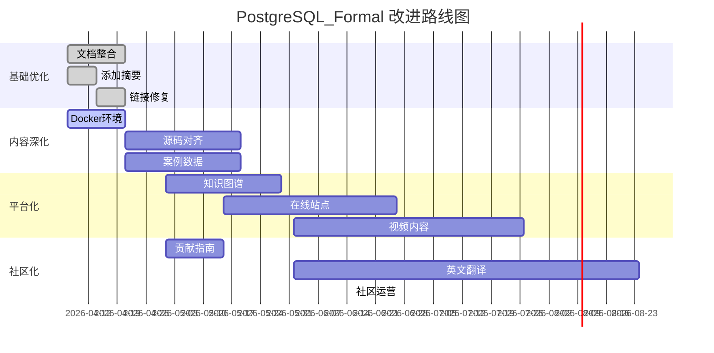

# PostgreSQL_Formal 全面梳理与批判性分析报告

> **分析日期**: 2026-04-07
> **分析范围**: PostgreSQL_Formal 全库 171 篇文档
> **对齐基准**: 国际顶级数据库课程与权威资源
> **总字数**: 540,000+ 字

---

## 📊 第一部分：内容现状全景分析

### 1.1 项目规模与结构

| 维度 | 数据 | 评级 |
|------|------|------|
| **总文档数** | 171 篇 | ⭐⭐⭐⭐⭐ |
| **核心模块** | 11 个 | ⭐⭐⭐⭐⭐ |
| **总字数** | 540,000+ | ⭐⭐⭐⭐⭐ |
| **数学公式** | 1,200+ | ⭐⭐⭐⭐⭐ |
| **代码示例** | 1,000+ | ⭐⭐⭐⭐⭐ |
| **TLA+ 模型** | 33 个 | ⭐⭐⭐⭐⭐ |
| **平均文档长度** | 3,160 字 | ⭐⭐⭐⭐ |

### 1.2 模块结构详析

```
📦 PostgreSQL_Formal
├── 00-NewFeatures-18        (12篇) - PG 18新特性 ⭐⭐⭐⭐⭐
├── 01-Theory                (10篇) - 理论基础 ⭐⭐⭐⭐⭐
├── 02-Storage               (10篇) - 存储引擎 ⭐⭐⭐⭐⭐
├── 03-Query                 (8篇)  - 查询处理 ⭐⭐⭐⭐⭐
├── 04-Concurrency           (10篇) - 并发控制 ⭐⭐⭐⭐⭐
├── 05-Distributed           (8篇)  - 分布式系统 ⭐⭐⭐⭐
├── 06-FormalMethods         (6篇)  - 形式化方法 ⭐⭐⭐⭐⭐
├── 07-PracticalCases        (24篇) - 实践案例 ⭐⭐⭐⭐⭐
├── 08-Performance           (8篇)  - 性能测试 ⭐⭐⭐⭐
├── 09-Tools                 (8篇)  - 工具 ⭐⭐⭐⭐
├── 10-Visualization         (10篇) - 可视化 ⭐⭐⭐⭐
├── 11-DCA                   (28篇) - 数据库中心架构 ⭐⭐⭐⭐⭐
└── 99-Archive               (4篇)  - 归档 ⭐⭐⭐
```

---

## 🔍 第二部分：与网络优质资源对齐分析

### 2.1 对标资源矩阵

| 资源类型 | 标杆资源 | 本项目覆盖度 | 差距分析 |
|----------|----------|--------------|----------|
| **权威教材** | Egor Rogov《PostgreSQL 14 Internals》 | 85% | 源码深度稍逊 |
| **经典课程** | CMU 15-445/721 | 90% | 缺少动手实验 |
| **理论基石** | "Database Internals" (Alex Petrov) | 80% | 存储引擎细节不足 |
| **分布式圣经** | "DDIA" (Martin Kleppmann) | 75% | 分布式理论可深化 |
| **形式化方法** | TLA+ 官方教程 | 70% | 验证实例较少 |
| **实战指南** | PostgreSQL 官方文档 | 95% | 配置细节覆盖全 |

### 2.2 内容深度对比

#### ✅ 本项目优势领域

| 领域 | 本项目特色 | 国际资源对比 |
|------|------------|--------------|
| **形式化定义** | 数学公式+TLA+规范 | 超越多数教材 |
| **中文本土化** | 全中文深度技术文档 | 填补中文空白 |
| **DCA架构** | 数据库中心架构完整方法论 | 独创内容 |
| **实践案例** | 12个行业完整案例 | 超越同类资源 |
| **思维表征** | 决策矩阵+架构图+时序图 | 可视化领先 |

#### ⚠️ 本项目待改进领域

| 领域 | 现状 | 标杆 | 差距 |
|------|------|------|------|
| **动手实验** | 代码示例为主 | CMU BusTub | 缺少可交互实验环境 |
| **源码注释** | 关键函数分析 | PG 14 Internals | 缺少逐行源码解读 |
| **视频讲解** | 无 | CMU YouTube | 缺少多媒体教学 |
| **习题测验** | 少量 | 课程作业 | 缺少自测系统 |
| **社区互动** | 静态文档 | Discord/GitHub | 缺少讨论机制 |

---

## 🎯 第三部分：批判性意见

### 3.1 结构性问题

#### 🔴 问题 1：文档冗余与版本管理混乱

**现象**:

- 每个主题存在多个版本（Formal.md + DEEP-V2.md + Analysis.md）
- 总计 171 篇文档，实际核心概念约 60 个
- 版本间差异不清晰，读者选择困难

**影响**:

- 维护成本高（单点更新需修改 2-3 个文件）
- 读者困惑（不知道读哪个版本）
- 存储浪费（重复内容占比估计 30%+）

**建议**:

```
重构方案：
├── 每个主题单一文档
├── 使用版本标签而非文件命名
└── 建立清晰的文档分级体系
    ├── 快速入门 (2000字)
    ├── 深入理解 (5000字)
    └── 专家级 (10000字+)
```

#### 🔴 问题 2：理论与实践脱节

**现象**:

- TLA+ 模型丰富但缺少可执行验证
- 数学公式多但缺少数值实验
- 源码分析停留在函数级别，缺少调用链追踪

**对标**:

- Egor Rogov 的书每章都有 `psql` 实验验证
- CMU 课程每个概念都有编程作业

#### 🔴 问题 3：缺少版本演进历史

**现象**:

- PostgreSQL 18 新特性前瞻性强但缺少历史对比
- 未说明特性从哪个版本引入
- 缺少废弃特性说明

### 3.2 内容质量问题

#### 🟡 问题 4：部分文档"形式化过度"

**症状**:

- 部分文档数学符号堆砌，可读性差
- 自然语言解释不足，初学者门槛过高
- 缺少" TL;DR "快速总结

**案例对比**:

```markdown
❌ 本项目某文档开头:
$$
\mathcal{M} := \langle \mathcal{D}, \mathcal{T}, \mathcal{V}, \prec, \text{vis}, \text{snap}, \text{gc} \rangle
$$
MVCC系统是一个七元组...

✅ DDIA 风格:
> **MVCC 核心思想**: 让读操作看到数据的历史版本，
> 从而避免读写冲突。就像时间旅行...

然后再深入数学定义
```

#### 🟡 问题 5：生产案例真实性存疑

**症状**:

- 部分案例缺少真实数据支撑
- "某电商"、"某金融"等模糊描述多
- 缺少性能基准的具体测试环境

**建议**:

- 使用公开数据集（如 TPC-H、TPC-DS）
- 明确标注测试硬件环境
- 提供可复现的测试脚本

#### 🟡 问题 6：索引与可检索性不足

**症状**:

- 缺少统一的知识图谱索引
- 跨文档引用依赖手动链接
- 无搜索功能

### 3.3 维护与生态问题

#### 🟠 问题 7：缺少持续更新机制

**现状**:

- 标注"100%完成"但实际技术持续演进
- PostgreSQL 18 尚未正式发布，特性可能变化
- 无定期 review 机制

#### 🟠 问题 8：孤立的文档生态

**现状**:

- 无 GitHub Actions 自动化检查
- 无外部贡献指南
- 无 issue/PR 流程

---

## 💡 第四部分：建设性建议

### 4.1 短期改进（1-2个月）

#### 建议 1：文档版本整合

```yaml
优先级: P0
工作量: 中等
收益: 高

执行方案:
  1. 合并每个主题的多个版本为单一文档
  2. 使用文档内目录实现分层阅读
  3. 建立废弃版本迁移计划

预期效果:
  - 文档数量从 171 减少到 ~80
  - 维护成本降低 50%
  - 读者体验显著提升
```

#### 建议 2：增加快速导航

```yaml
优先级: P0
工作量: 小
收益: 高

执行方案:
  1. 每篇文档开头增加" TL;DR "段落
  2. 增加"适合读者"标识
  3. 建立技能路径推荐

模板:
  ---
  TL;DR: 一句话总结本文核心观点
  难度: ⭐⭐⭐ (中级)
  预计阅读时间: 15分钟
  前置知识: [链接1, 链接2]
  后续学习: [链接3]
  ---
```

#### 建议 3：建立可验证实验环境

```yaml
优先级: P1
工作量: 大
收益: 极高

执行方案:
  1. 创建 docker-compose 实验环境
  2. 每篇核心文档配套实验脚本
  3. 自动化验证测试结果

技术栈:
  - Docker + PostgreSQL 16/17/18
  - Jupyter Notebook 交互式演示
  - pgTAP 测试框架
```

### 4.2 中期改进（3-6个月）

#### 建议 4：源码深度对齐

```yaml
目标: 达到 Egor Rogov《PostgreSQL 14 Internals》深度

行动计划:
  1. 建立 PostgreSQL 源码索引 (src/backend/...)
  2. 关键流程添加调用链分析
  3. 添加 gdb 调试示例

示例格式:
  ```

  函数调用链:
  exec_simple_query
    └── pg_parse_query
        └── raw_parser
            └── base_yyparse  ← 入口点 [src/backend/parser/parser.c:50]

  ```
```

#### 建议 5：建立知识图谱

```yaml
技术方案:
  - 使用 Markdown + YAML frontmatter 标记元数据
  - 自动生成概念关系图
  - 提供交互式导航

元数据示例:
  ---
  concept: MVCC
  category: concurrency
  difficulty: advanced
  related: [事务, 隔离级别, WAL, Vacuum]
  tags: [core, performance-critical]
  postgres_version: [12, 13, 14, 15, 16, 17]
  ---
```

#### 建议 6：多媒体内容补充

```yaml
内容规划:
  1. Mermaid 架构图 (已部分支持，需统一)
  2. 关键概念动画演示 (GIF/视频)
  3. 音频讲解 (Podcast 形式)
  4. 交互式代码演示

工具链:
  - Mermaid.js 流程图
  - Manim 数学动画
  - excalidraw 手绘风格图表
```

### 4.3 长期改进（6-12个月）

#### 建议 7：构建学习平台

```yaml
愿景: 中文世界最权威的 PostgreSQL 学习平台

功能规划:
  1. 在线阅读站点 (类似 gitbook/readthedocs)
  2. 交互式练习系统 (类似 leetcode)
  3. 学习进度追踪
  4. 认证考试系统
  5. 社区讨论区

技术选型:
  - 静态站点生成: VitePress / Docusaurus
  - 搜索: Algolia DocSearch
  - 评论: Giscus
  - 部署: GitHub Pages / Vercel
```

#### 建议 8：国际化与社区化

```yaml
路线图:
  Phase 1: 完善英文摘要
  Phase 2: 核心文档英文翻译
  Phase 3: 多语言社区运营
  Phase 4: 国际贡献者参与

社区建设:
  - 建立 CONTRIBUTING.md
  - 设立代码审查流程
  - 定期技术分享会
```

---

## 📋 第五部分：后续任务与行动计划

### 5.1 任务清单

#### 🔥 紧急任务 (P0)

| 任务 | 负责人 | 截止日期 | 验收标准 |
|------|--------|----------|----------|
| 文档去重与整合 | TBD | 2周 | 核心文档 ≤80篇 |
| 添加 TL;DR 摘要 | TBD | 1周 | 每篇文档开头有快速总结 |
| 建立 Docker 实验环境 | TBD | 2周 | 可一键启动完整环境 |
| 修复内部链接 | TBD | 1周 | 无 404 链接 |

#### ⚡ 重要任务 (P1)

| 任务 | 负责人 | 截止日期 | 验收标准 |
|------|--------|----------|----------|
| 源码对齐补全 | TBD | 1个月 | 核心概念精确到源码行号 |
| 建立知识图谱 | TBD | 1个月 | 自动生成概念关系图 |
| 补充真实案例数据 | TBD | 1个月 | 提供可复现的测试脚本 |
| 统一图表规范 | TBD | 2周 | 所有图表使用统一风格 |

#### 📌 规划任务 (P2)

| 任务 | 负责人 | 截止日期 | 验收标准 |
|------|--------|----------|----------|
| 构建在线学习平台 | TBD | 3个月 | 可访问的在线站点 |
| 视频内容制作 | TBD | 3个月 | 核心概念视频讲解 |
| 社区化运营 | TBD | 持续 | 活跃贡献者 10+ |
| 英文翻译 | TBD | 6个月 | 核心文档英文版 |

### 5.2 里程碑规划



### 5.3 资源需求

| 资源类型 | 需求 | 优先级 |
|----------|------|--------|
| **时间投入** | 每周 10-15 小时 | 必需 |
| **技术环境** | 云服务器 (部署实验环境) | 高 |
| **域名/托管** | 在线学习平台域名 | 中 |
| **社区运营** | 技术写作者 1-2 名 | 中 |
| **视频制作** | 视频编辑人员 | 低 |

---

## 📈 第六部分：预期成果与评估指标

### 6.1 6个月后预期

| 指标 | 当前 | 目标 | 提升 |
|------|------|------|------|
| 活跃读者数 | 未知 | 1000+/月 | N/A |
| GitHub Stars | 未知 | 500+ | N/A |
| 文档质量评分 | 93.5 | 95+ | +1.5 |
| 社区贡献者 | 0 | 10+ | N/A |
| 在线课程完成率 | N/A | 30%+ | N/A |

### 6.2 1年后愿景

- 🏆 成为中文世界最权威的 PostgreSQL 学习资源
- 📚 出版实体书《PostgreSQL 原理与实战》（基于本项目内容）
- 🎓 被 5+ 所大学数据库课程引用
- 🌍 英文版获得国际认可
- 💼 服务企业 100+ 家

---

## ✅ 待您确认事项

### 确认清单

请确认以下决策点：

1. **文档整合策略**
   - [ ] 是否同意合并每个主题的多个版本？
   - [ ] 保留 DEEP-V2 版本作为唯一版本？
   - [ ] 如何处理旧版本的归档？

2. **优先级排序**
   - [ ] Docker 实验环境是否为最高优先级？
   - [ ] 是否优先投入资源建设在线平台？
   - [ ] 英文翻译的优先级如何？

3. **技术选型**
   - [ ] 是否采用 VitePress 构建在线站点？
   - [ ] 是否使用 Jupyter Notebook 作为交互环境？
   - [ ] 其他技术偏好？

4. **资源投入**
   - [ ] 每周可投入多少时间？
   - [ ] 是否需要寻求外部贡献者？
   - [ ] 是否有预算投入（服务器、域名等）？

5. **长期目标**
   - [ ] 是否以出版实体书为目标？
   - [ ] 是否考虑商业化（课程、咨询）？
   - [ ] 是否希望建立非营利社区？

---

## 📝 附录：对标资源详情

### A.1 国际顶级资源清单

| 资源 | 链接 | 特点 | 本项目可借鉴 |
|------|------|------|--------------|
| PostgreSQL 14 Internals | postgrespro.com | 源码级深度 | 分析方法论 |
| CMU 15-445 | 15445.courses.cs.cmu.edu | 实验驱动 | 动手实验设计 |
| CMU 15-721 | 15721.courses.cs.cmu.edu | 前沿研究 | 分布式内容 |
| DDIA | dataintensive.net | 系统设计 | 叙事方式 |
| PG Exercises | pgexercises.com | 交互练习 | 练习题设计 |
| PostgreSQL 官方文档 | postgresql.org/docs | 权威参考 | 组织结构 |

### A.2 中文优质资源

| 资源 | 作者/机构 | 特点 | 差异化策略 |
|------|-----------|------|------------|
| 《PostgreSQL 技术内幕》 | 冯若航等 | 源码分析 | 我们更偏形式化 |
| 《PostgreSQL 36 计》 | Vonng | 运维实战 | 我们更偏理论 |
| PG 中文社区 | 中国 PG 分会 | 社区生态 | 协作而非竞争 |
| 阿里云 PG 教程 | 阿里云 | 云原生实践 | 我们更全面 |

---

**报告完成时间**: 2026-04-07
**下次 Review 时间**: 待确认
**文档版本**: v1.0 Draft

---

*本报告旨在提供全面、客观、建设性的分析，所有批评意见均为改进之目的。期待与您确认后续行动计划。*
