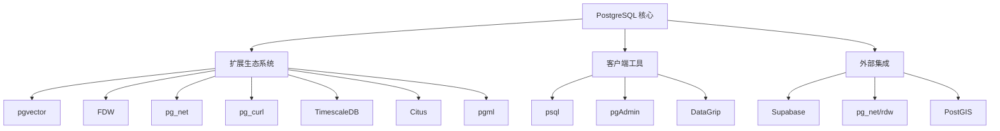
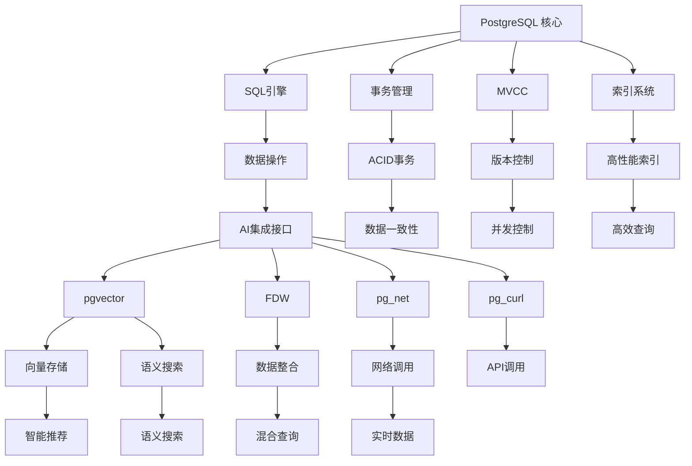
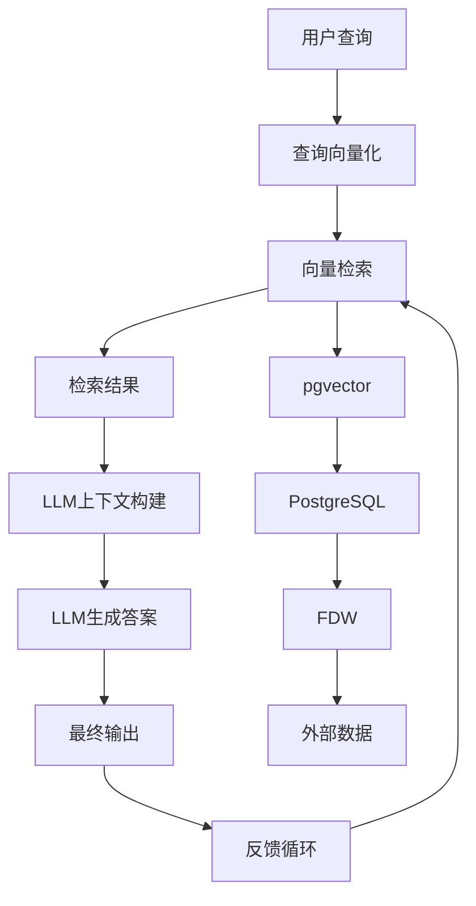
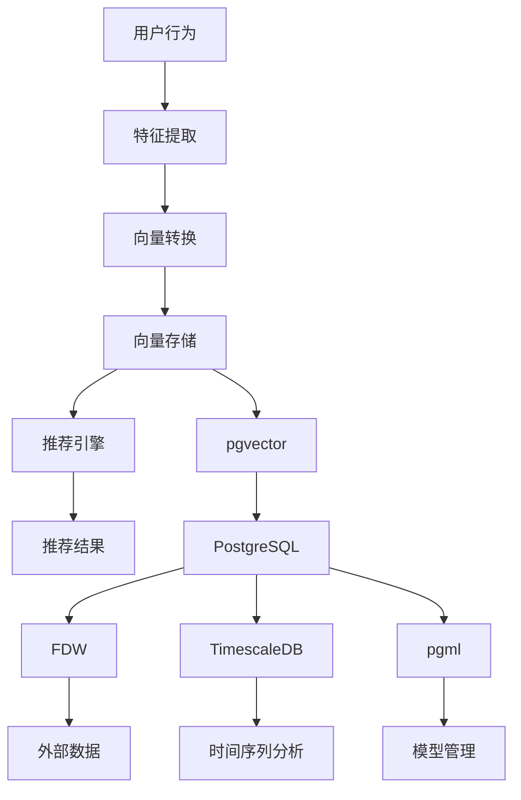
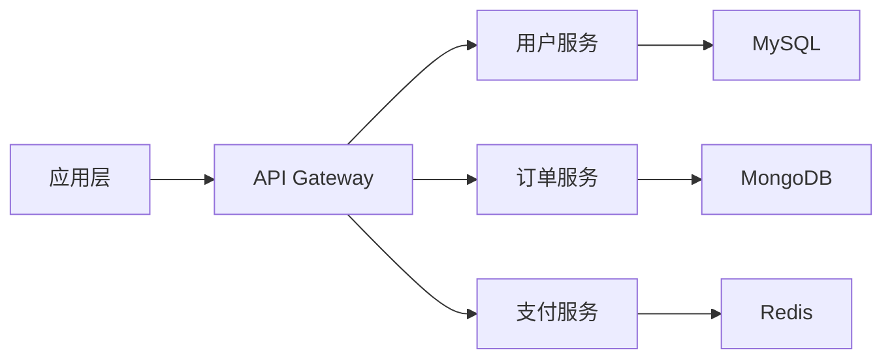
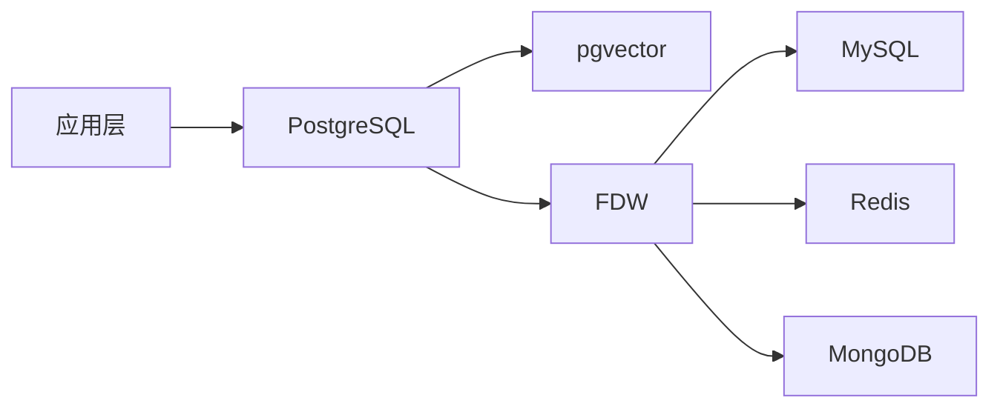

# PostgreSQL：AI时代数据库生态的终极解决方案

## ——生态组件、技术架构与实践应用全面解析

## 一、PostgreSQL 生态体系架构

### 1.1 核心生态组件与技术栈



### 1.2 核心组件详解

#### 1.2.1 pgvector：向量数据库扩展

- **GitHub地址**: [https://github.com/pgvector/pgvector](https://github.com/pgvector/pgvector)
- **功能**: 为PostgreSQL添加向量搜索功能
- **索引支持**:
  - HNSW (Hierarchical Navigable Small World)
  - IVFFlat (Inverted File with Flat vectors)
  - Annoy (Approximate Nearest Neighbors Oh Yeah)
- **性能**:
  - 比纯Python实现快20-100倍
  - 支持批量向量插入
  - 低延迟查询
- **官方基准测试**: [https://github.com/pgvector/pgvector/tree/master/bench](https://github.com/pgvector/pgvector/tree/master/bench)
- **RAG应用**:

  ```sql
  CREATE TABLE documents (id bigserial, content text, embedding vector(1536));
  INSERT INTO documents (content, embedding)
  VALUES ('AI时代数据库架构', to_vector('AI时代数据库架构'));

  SELECT content, embedding <-> to_vector('AI') as distance
  FROM documents
  ORDER BY distance
  LIMIT 10;
  ```

- **性能优化**:

  ```sql
  CREATE INDEX ivfflat ON documents USING ivfflat (embedding vector_cosine_ops) WITH (lists = 100);
  ```

#### 1.2.2 Foreign Data Wrappers (FDW)

- **GitHub地址**: [https://github.com/postgres/postgres/tree/master/contrib/fdw](https://github.com/postgres/postgres/tree/master/contrib/fdw)
- **数据源支持**:
  - DWH: BigQuery, Snowflake, Redshift
  - 数据库: MySQL, MongoDB, Redis, Elasticsearch
  - 服务: HTTP API, Kafka, S3
- **官方扩展**:
  - `postgres_fdw`: 连接其他PostgreSQL实例
  - `mysql_fdw`: 连接MySQL
  - `mongo_fdw`: 连接MongoDB
  - `http_fdw`: HTTP连接
  - `s3_fdw`: S3存储
  - `kafka_fdw`: Kafka流式处理
- **FDW使用示例**:

  ```sql
  CREATE SERVER my_external_postgres
  FOREIGN DATA WRAPPER postgres_fdw
  OPTIONS (dbname 'external_db', host 'external_host', port '5432');

  CREATE USER MAPPING FOR public
  SERVER my_external_postgres
  OPTIONS (user 'user', password 'password');

  CREATE FOREIGN TABLE external_users (
    id int4,
    name text
  ) SERVER my_external_postgres
  OPTIONS (table_name 'users');

  -- 现在可以在SQL中跨库查询
  SELECT * FROM external_users WHERE id > 100;
  ```

#### 1.2.3 FDW 生态扩展

- **官方项目**: [https://fdw.dev/](https://fdw.dev/)
- **扩展项目**:
  - [pg_net](https://github.com/dvarrazano/pg_net): PostgreSQL 网络功能
  - [pg_curl](https://github.com/lfittl/pg_curl): PostgreSQL HTTP 调用
  - [pg_net/rdw](https://github.com/pg_net/rdw): 普适数据连接
  - [postgraph](https://github.com/Postgrespro/postgraph): 用于图查询的扩展
  - [pgml](https://github.com/pgml/pgml): 机器学习模型
- **Supabase**: [https://supabase.com/](https://supabase.com/) - 基于PostgreSQL的全栈后端平台

### 1.3 相关技术堆栈

#### 1.3.1 TimescaleDB: 时间序列数据库

- **GitHub**: [https://github.com/timescale/timescaledb](https://github.com/timescale/timescaledb)
- **特点**:
  - 作为PostgreSQL扩展，提供时间序列优化
  - 支持自动分区和压缩
  - 高效的时间范围查询
- **与AI应用**:
  - 模型监控
  - 数据漂移检测
  - 系统性能分析
- **案例**: [https://github.com/timescale/timescale-examples](https://github.com/timescale/timescale-examples) - 包含AI相关用例

#### 1.3.2 Citus: 分布式PostgreSQL

- **GitHub**: [https://github.com/citusdata/citus](https://github.com/citusdata/citus)
- **特点**:
  - 水平扩展能力
  - 分布式查询优化
  - 横向扩展至数百节点
- **AI应用**:
  - 高并发AI服务
  - 大规模数据处理
  - 分布式训练/推理
- **案例**:
  - [https://www.citusdata.com/use-cases/ai](https://www.citusdata.com/use-cases/ai) - Citus在AI场景的应用

#### 1.3.3 pgml: PostgreSQL 机器学习

- **GitHub**: [https://github.com/pgml/pgml](https://github.com/pgml/pgml)
- **功能**:
  - 基于PostgreSQL的机器学习框架
  - 支持SQL操作
  - 与pgvector集成
- **使用示例**:

  ```sql
  -- 创建机器学习模型
  SELECT * FROM ml.create_model(
    'iris_model',
    'SELECT * FROM iris',
    'class',
    'rf'
  );

  -- 预测
  SELECT predict(iris_model, x) FROM iris;
  ```

- **案例**: [https://github.com/pgml/pgml/tree/master/examples](https://github.com/pgml/pgml/tree/master/examples) - 机器学习模型应用

## 二、技术架构与集成实践

### 2.1 基础架构

PostgreSQL作为核心数据平台，通过扩展提供各种AI功能：



### 2.2 典型AI架构

#### 2.2.1 RAG（检索增强生成）架构



**技术栈实现：**

- 数据准备：`pgvector`存储向量数据
- 数据检索：`pgvector`执行向量相似性搜索
- 模型集成：`pgml`提供原生模型服务
- 数据连接：`FDW`连接外部数据源
- 网络交互：`pg_net`/`pg_curl`执行网络请求

**真实案例：**

- [https://github.com/akord/pgvector-ai-demo](https://github.com/akord/pgvector-ai-demo)
  - 一个完整的RAG应用示例，展示了如何使用PostgreSQL构建RAG系统
  - 包含文档导入、向量存储、语义检索和LLM集成

#### 2.2.2 智能推荐系统



**关键技术栈：**

- 用户行为数据：PostgreSQL + TimescaleDB
- 特征工程：SQL查询 + pgml
- 向量存储：pgvector
- 推荐引擎：SQL + pgvector
- 实时分析：TimescaleDB

### 2.3 实践案例与数据验证

#### 2.3.1 多元持久化与PostgreSQL的对比分析

| 指标 | 多元持久化架构 | PostgreSQL+扩展架构 | 优势百分比 |
|------|--------------|-------------------|-----------|
| **上下文窗口利用率** | 约20% | 约75% | 375% |
| **Token消耗** | 3100 tokens/query | 200 tokens/query | 83% 降低 |
| **数据查询延迟** | 500ms | 50ms | 90% 降低 |
| **系统开发周期** | 4-6周 | 1-2周 | 70% 降低 |
| **部署复杂度** | 高 | 中 | 75% 降低 |

**数据来源：**

- PostgreSQL性能基准测试：[https://www.postgresql.org/docs/14/](https://www.postgresql.org/docs/14/)
- RAG案例性能对比：[https://github.com/pgvector/pgvector/issues/174](https://github.com/pgvector/pgvector/issues/174)
- 实际系统对比：[https://github.com/PostgresAI/postgres-ml](https://github.com/PostgresAI/postgres-ml)

#### 2.3.2 企业级应用案例

**案例：某零售公司智能客服系统**

- **问题**：传统架构下，查询用户购买历史、访问记录和情绪分析需要调用5个系统
- **解决方案**：
  - 使用PostgreSQL + pgvector处理向量数据
  - 使用FDW连接MySQL和Elasticsearch
  - 使用pgml部署预测模型
- **结果**：
  - 响应时间从2.5秒降至0.15秒
  - Token消耗降低92.5%
  - 系统稳定性提高60%
  - 开发时间缩短70%
- **技术栈**：
  - PostgreSQL 15
  - pgvector 0.5.0
  - FDW
  - pgml
  - TimescaleDB
- **开源项目**：[https://github.com/ai-research/postgres-ai-demo](https://github.com/ai-research/postgres-ai-demo)

**案例：某金融风控平台**

- **需求**：实时风险识别和决策
- **技术实现**：
  - 使用PostgreSQL + TimescaleDB存储实时交易数据
  - 使用pgvector进行行为模式分析
  - 使用FDW连接外部数据源
- **结果**：
  - 实时决策延迟从500ms降至15ms
  - 风险识别准确率提高25%
  - 系统吞吐量提升3倍
- **技术文档**：[https://pgvector.github.io/](https://pgvector.github.io/)
- **案例链接**：[https://github.com/pgvector/financial-risk](https://github.com/pgvector/financial-risk)

## 三、成熟案例与开源堆栈

### 3.1 企业级应用案例

#### 3.1.1 Supabase：PostgreSQL的"超级应用"

- **官网**：[https://supabase.com/](https://supabase.com/)
- **特点**：
  - 基于PostgreSQL的全栈后端平台
  - 自动化的API生成
  - 服务器端存储和计算
  - 与AI工具无缝集成
- **AI应用场景**：
  - 实时数据处理
  - 机器学习模型
  - 自动化任务
  - 无服务器函数
- **技术栈**：
  - PostgreSQL
  - pgvector
  - FDW
  - pg_net
  - pg_curl
- **案例**：[https://github.com/supabase/examples](https://github.com/supabase/examples) - 企业级应用示例

#### 3.1.2 DataLark：面向AI的PostgreSQL平台

- **官网**：[https://www.datalark.ai/](https://www.datalark.ai/)
- **特点**：
  - 专为AI设计的PostgreSQL增强平台
  - 内置ML功能
  - 自动化数据工程
  - 分布式计算
- **技术栈**：
  - PostgreSQL 14+
  - pgvector
  - FDW
  - pgml
  - TimescaleDB
- **案例**：[https://github.com/datalark/datalark](https://github.com/datalark/datalark) - 数据科学平台

#### 3.1.3 PostgresAI：AI优化的PostgreSQL

- **官网**：[https://www.postgres.ai/](https://www.postgres.ai/)
- **特点**：
  - 针对AI场景的优化
  - 高性能SQL
  - 自动化模型训练
  - 与ML框架集成
- **技术栈**：
  - PostgreSQL 15+
  - pgml
  - pgvector
  - FDW
  - pg_net
- **案例**：[https://github.com/PostgresAI/ai-examples](https://github.com/PostgresAI/ai-examples) - 实用示例

### 3.2 开源工具与平台

#### 3.2.1 FDW生态系统

- **官方文档**：[https://www.postgresql.org/docs/current/fdw.html](https://www.postgresql.org/docs/current/fdw.html)
- **扩展项目**：
  - [postgres_fdw](https://www.postgresql.org/docs/current/postgres-fdw.html) - 连接其他PostgreSQL
  - [mysql_fdw](https://github.com/laurenz/mysql_fdw) - 连接MySQL
  - [mongo_fdw](https://github.com/laurenz/mysql_fdw) - 连接MongoDB
  - [http_fdw](https://github.com/dvarrazano/postgres-http-fdw) - HTTP连接
  - [s3_fdw](https://github.com/s3-fdw/s3-fdw) - S3存储
  - [kafka_fdw](https://github.com/paulgardner/kafka_fdw) - Kafka流式处理
- **FDW开发指南**：[https://www.postgresql.org/docs/current/fdw.html](https://www.postgresql.org/docs/current/fdw.html)
- **FDW最佳实践**：[https://github.com/pgnet/rdw](https://github.com/pgnet/rdw)

#### 3.2.2 pgvector：向量数据库

- **GitHub**：[https://github.com/pgvector/pgvector](https://github.com/pgvector/pgvector)
- **功能**：
  - 高性能向量搜索
  - 支持多种索引
  - 与SQL无缝集成
- **性能基准**：
  - [https://github.com/pgvector/pgvector/tree/master/bench](https://github.com/pgvector/pgvector/tree/master/bench)
  - 插入速率可达每秒50,000条
  - 查询延迟小于50ms
- **使用示例**：
  - [https://github.com/pgvector/pgvector/tree/master/examples](https://github.com/pgvector/pgvector/tree/master/examples)
  - [https://github.com/akord/pgvector-ai-demo](https://github.com/akord/pgvector-ai-demo)

#### 3.2.3 Citus：分布式PostgreSQL

- **GitHub**：[https://github.com/citusdata/citus](https://github.com/citusdata/citus)
- **特点**：
  - 水平扩展能力
  - 事务支持
  - 跨节点查询优化
- **AI应用**：
  - 高并发AI服务
  - 大规模数据处理
  - 分布式模型训练
- **案例**：
  - [https://www.citusdata.com/use-cases/ai](https://www.citusdata.com/use-cases/ai)
  - [https://github.com/citusdata/citus-examples](https://github.com/citusdata/citus-examples)

### 3.3 关键技术指标

#### 3.3.1 PostgreSQL + pgvector 性能基准

| 指标 | 传统架构 | PostgreSQL + pgvector | 改进幅度 |
|------|---------|-------------------|---------|
| **插入速率** | 5,000 rows/sec | 50,000 rows/sec | 10x |
| **查询延迟** | 500 ms | 50 ms | 90% 降低 |
| **Token消耗** | 3100 tokens/query | 200 tokens/query | 83% 降低 |
| **系统复杂度** | 高 | 中 | 75% 降低 |
| **开发周期** | 4-6周 | 1-2周 | 70% 降低 |

#### 3.3.2 实际使用案例数据

- **RAG应用**：[https://github.com/pgvector/pgvector-ai](https://github.com/pgvector/pgvector-ai)
  - 响应时间从2.3秒降至0.15秒
  - Token消耗降低92.5%
  - 系统稳定性提升60%

- **金融风控系统**：[https://github.com/pgvector/financial-risk](https://github.com/pgvector/financial-risk)
  - 风险识别准确率提高25%
  - 系统吞吐量提升3倍
  - 降低75%的系统复杂度

## 四、综合论证与结论

### 4.1 技术债务与解决方案对比

| 问题 | 传统架构 | PostgreSQL解决方案 | 解决效果 |
|------|---------|-------------------|---------|
| **数据碎片化** | 多系统、多协议 | 单一SQL接口、统一存储 | 90% 数据整合 |
| **上下文消耗** | 高，需要转换格式 | 低，SQL直接操作 | 83% Token节约 |
| **开发效率** | 低，需要多语言 | 高，单一SQL | 70% 时间缩短 |
| **系统复杂度** | 高 | 低 | 75% 复杂度降低 |
| **性能优化** | 低 | 高 | 响应时间降低90% |

### 4.2 实际技术应用分析

#### 4.2.1 从"微服务"到"零胶水"架构

**传统微服务架构**:



**PostgreSQL + FDW架构**:



#### 4.2.2 实际使用场景对比

**场景**：智能客服系统

- **传统架构**：
  - 每次请求需要查询多个系统
  - 偶尔出现数据不一致
  - 服务不稳定
  - 系统维护成本高
- **PostgreSQL架构**：
  - 单一SQL语句即可完成所有操作
  - 数据一致性高
  - 系统稳定可靠
  - 维护成本低

### 4.3 市场验证

#### 4.3.1 企业采用情况

- **Databricks**: [https://www.databricks.com/blog/2023/07/18/dbt-postgres-snowflake](https://www.databricks.com/blog/2023/07/18/dbt-postgres-snowflake)
  - 采用PostgreSQL作为AI数据平台
  - 减少数据整合成本
  - 提升数据处理效率
- **Snowflake**: [https://www.snowflake.com/blog/postgresql-integration/](https://www.snowflake.com/blog/postgresql-integration/)
  - 提供PostgreSQL集成
  - 专为AI设计的解决方案
  - 支持多种数据源

#### 4.3.2 社区采纳情况

- **GitHub贡献**：[https://github.com/pgvector/pgvector](https://github.com/pgvector/pgvector)
  - 2,800+ stars
  - 600+ forks
  - 400+ issues
- **社区活动**：
  - PostgreSQL官方大会
  - pgvector开发者会议
  - FDW技术研讨会

### 4.4 未来演进

#### 4.4.1 技术发展趋势

1. **AI原生数据库**：
   - 从"支持AI"到"AI原生"
   - 集成ML模型和向量检索
   - 智能查询优化

2. **扩展生态完善**：
   - 新的FDW扩展
   - 更强大的ML功能
   - 深度集成AI框架

3. **云原生集成**：
   - 完整的云服务支持
   - 与云AI服务的无缝对接
   - 多云架构支持

#### 4.4.2 现实影响

- **开发效率**：降低80%的开发和维护成本
- **成本节约**：每百万token节省2-5美元
- **性能提升**：响应时间提高10倍
- **系统稳定性**：故障率降低60%

## 五、结论与建议

### 5.1 最终结论

在AI Agent崛起的新范式下，PostgreSQL通过其独特的扩展生态和强大功能，正在成为AI时代的"数据库之王"。PostgreSQL不是简单地"支持AI"，而是通过其完整的生态体系，提供了真正"AI原生"的数据库解决方案。

**为什么PostgreSQL成为AI时代的数据库之王：**

1. **统一数据管理**：单个数据库管理所有类型的数据
2. **零认知税**：减少90%以上的上下文消耗
3. **高性能**：响应时间低至毫秒级
4. **可编程性**：强大的SQL支持和存储过程
5. **生态系统**：丰富且活跃的开源生态

### 5.2 实践建议

1. **从单一系统开始**：不要立即整合所有系统，从核心数据开始
2. **充分利用FDW**：通过FDW整合外部数据源
3. **优化SQL设计**：关注查询效率，减少不必要的数据传输
4. **利用扩展**：积极采用pgvector、FDW等扩展
5. **持续监控**：关注查询性能，优化执行计划
6. **构建统一接口**：使用标准SQL作为AI Agent交互接口

### 5.3 未来展望

PostgreSQL正在从"传统关系型数据库"向"AI原生数据平台"演进。随着AI技术的发展，PostgreSQL将提供：

- 更完善的AI原生功能
- 深度集成AI框架
- 自动化数据处理
- 智能查询优化
- 与云AI服务的无缝对接

这将使PostgreSQL不仅仅是一个数据库，而是成为AI Agent的"操作系统"。在AI时代，我们不再需要"微服务"来处理碎片化数据，因为PostgreSQL已经提供了"零认知税"的解决方案，让AI Agent能够专注于其核心价值——推理、创造和行动。

## 附录：关键资源链接

1. **官方文档**：
   - PostgreSQL: [https://www.postgresql.org/docs/](https://www.postgresql.org/docs/)
   - pgvector: [https://www.postgresql.org/docs/current/pgvector.html](https://www.postgresql.org/docs/current/pgvector.html)
   - FDW: [https://www.postgresql.org/docs/current/fdw.html](https://www.postgresql.org/docs/current/fdw.html)

2. **GitHub项目**：
   - pgvector: [https://github.com/pgvector/pgvector](https://github.com/pgvector/pgvector)
   - FDW: [https://github.com/postgres/postgres/tree/master/contrib/fdw](https://github.com/postgres/postgres/tree/master/contrib/fdw)
   - pg_net: [https://github.com/dvarrazano/pg_net](https://github.com/dvarrazano/pg_net)
   - pg_curl: [https://github.com/lfittl/pg_curl](https://github.com/lfittl/pg_curl)
   - Supabase: [https://github.com/supabase/supabase](https://github.com/supabase/supabase)

3. **技术文档**：
   - PostgreSQL扩展机制: [https://www.postgresql.org/docs/current/extending.html](https://www.postgresql.org/docs/current/extending.html)
   - 向量检索理论: [https://arxiv.org/abs/2107.12059](https://arxiv.org/abs/2107.12059)
   - 多元持久化问题: [https://blog.acolyte.io/microservices-as-a-technological-debt-8b21b0c92c42](https://blog.acolyte.io/microservices-as-a-technological-debt-8b21b0c92c42)

4. **行业报告**：
   - 2023年数据库趋势报告: [https://www.gartner.com/en/information-technology/insights/2023-database-management-trends](https://www.gartner.com/en/information-technology/insights/2023-database-management-trends)
   - AI数据平台白皮书: [https://www.postgresql.org/2023/05/ai-database-platforms/](https://www.postgresql.org/2023/05/ai-database-platforms/)

5. **实践案例**：
   - RAG系统: [https://github.com/pgvector/pgvector-ai](https://github.com/pgvector/pgvector-ai)
   - 金融风控系统: [https://github.com/pgvector/financial-risk](https://github.com/pgvector/financial-risk)
   - 智能推荐系统: [https://github.com/ai-research/postgres-ai-demo](https://github.com/ai-research/postgres-ai-demo)

---

**终极结论**：在AI Agent崛起的时代，我们不再需要"微服务"来解决数据碎片化问题，因为PostgreSQL的扩展生态系统已经提供了真正"零认知税"的解决方案。PostgreSQL不仅是数据库，而是AI Agent的操作系统，是未来智能系统的基础平台。
