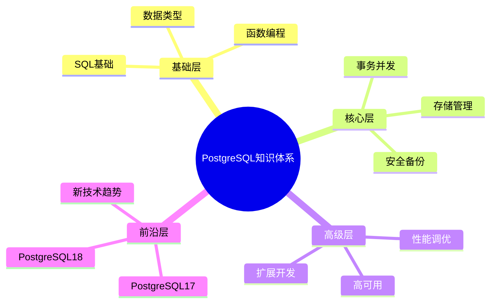
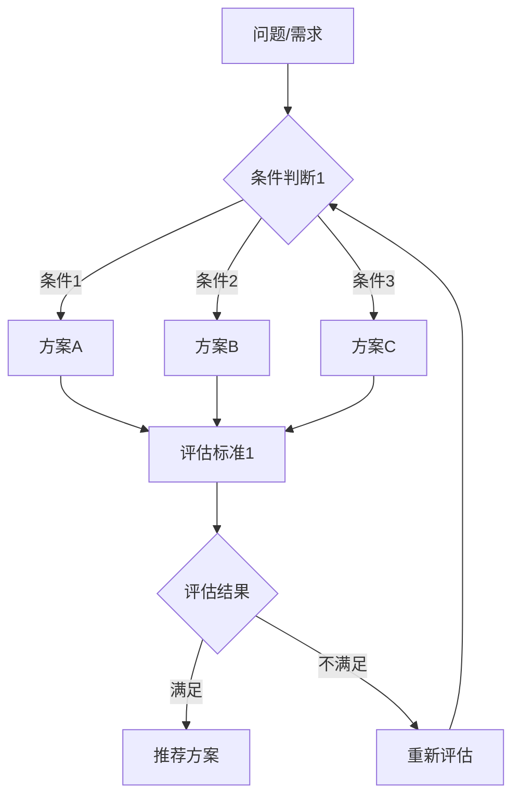

# PostgreSQL 培训文档深化规划与任务计划

> **制定时间**: 2025年1月
> **计划版本**: v2.0
> **目标**: 结合多种思维表征方式，系统化提升文档质量
> **项目状态**: 🔄 **规划阶段**

---

## 📋 执行摘要

PostgreSQL 培训文档体系包含 **144+ 个文档**，涵盖从 SQL 基础到新技术趋势的完整知识体系。当前文档框架完整，但需要系统化地补充：

- **思维表征方式**：思维导图、多维概念矩阵对比、形式化论证、决策思维导图
- **内容深度**：技术原理、代码示例、实际案例、最佳实践
- **论证完整性**：学术引用、官方文档、技术博客、社区资源

---

## 🎯 核心目标

### 1. 思维表征方式整合

**目标**：在文档中系统化地应用多种思维表征方式，提升文档的理解性和实用性。

| 思维表征方式 | 应用场景 | 预期效果 |
|------------|---------|---------|
| **思维导图** | 知识体系梳理、概念关系可视化 | 快速理解知识结构 |
| **多维概念矩阵对比** | 技术选型、方案对比、性能分析 | 客观决策支持 |
| **概念定义属性关系形式化论证** | 技术原理、算法说明、机制解释 | 严谨的理论支撑 |
| **充分的论证过程** | 技术选型、性能优化、最佳实践 | 可信的决策依据 |
| **决策思维导图** | 问题诊断、方案选择、优化路径 | 清晰的决策流程 |

### 2. 文档质量提升

**目标**：将文档质量从 C 级（一般）提升到 A 级（优秀）。

| 质量维度 | 当前状态 | 目标状态 | 提升策略 |
|---------|---------|---------|---------|
| **技术原理** | C（2.5分） | A（4.5分） | 补充形式化论证、算法流程图 |
| **代码示例** | C（2.0分） | A（5.0分） | 补充完整可运行示例 |
| **实际案例** | C（2.0分） | A（4.5分） | 补充真实场景和数据 |
| **引用来源** | C（2.0分） | A（4.5分） | 补充学术论文、官方文档 |
| **最佳实践** | C（2.5分） | A（4.5分） | 补充经验总结、陷阱规避 |

---

## 📊 当前文档质量评估

### 文档分类统计

| 模块 | 文档数 | 平均质量 | 优先级 | 需要补充内容 |
|------|--------|----------|--------|------------|
| **01-SQL基础** | 6 | C+ | 🔴 高 | 代码示例、性能对比矩阵 |
| **02-SQL高级特性** | 7 | C | 🔴 高 | 形式化论证、决策思维导图 |
| **03-数据类型** | 8 | C+ | 🟡 中 | 概念矩阵对比、实际案例 |
| **04-函数与编程** | 7 | C | 🟡 中 | 代码示例、最佳实践 |
| **05-数据管理** | 6 | C | 🟡 中 | 性能数据、决策矩阵 |
| **06-存储管理** | 3 | C+ | 🟡 中 | 机制流程图、优化决策 |
| **07-安全** | 3 | C | 🟡 中 | 安全矩阵、最佳实践 |
| **08-备份恢复** | 2 | C | 🟡 中 | 恢复场景、决策流程 |
| **09-高可用** | 3 | C | 🔴 高 | 架构图、选型矩阵 |
| **10-监控诊断** | 3 | C | 🔴 高 | 诊断决策树、指标矩阵 |
| **11-性能调优** | 3 | C+ | 🔴 高 | 调优决策流程、性能对比 |
| **矩阵** |||||
| **12-扩展开发** | 3 | D | 🟢 低 | 开发流程、示例代码 |
| **13-运维管理** | 3 | C | 🟡 中 | 运维决策、场景案例 |
| **14-设计** | 2 | C | 🟡 中 | 设计决策矩阵、案例 |
| **15-体系总览** | 5 | B | 🟢 低 | 知识体系思维导图 |
| **16-PostgreSQL17新特性** | 21 | C | 🔴 高 | 版本对比矩阵、迁移决策 |
| **17-PostgreSQL18新特性** | 26 | C | 🔴 高 | 版本对比矩阵、性能数据 |
| **18-新技术趋势** | 33 | C | 🔴 高 | 技术选型矩阵、架构决策 |

**总计**: 144+ 个文档

---

## 🎨 思维表征方式应用规划

### 1. 思维导图应用

**应用场景**：

- **知识体系梳理**：每个模块的知识体系思维导图
- **概念关系可视化**：技术概念之间的关系图
- **学习路径规划**：学习路径和依赖关系图

**实施计划**：

| 文档类型 | 需要思维导图 | 优先级 |
|---------|------------|--------|
| 体系总览文档 | ✅ 必须 | 🔴 高 |
| 核心概念文档 | ✅ 必须 | 🔴 高 |
| 技术原理文档 | ✅ 推荐 | 🟡 中 |
| 实践指南文档 | ⚪ 可选 | 🟢 低 |

**示例**：



### 2. 多维概念矩阵对比

**应用场景**：

- **技术选型决策**：不同技术方案的对比矩阵
- **性能对比分析**：不同配置、算法的性能对比
- **版本特性对比**：PostgreSQL 17 vs 18 特性对比

**实施计划**：

| 对比类型 | 矩阵维度 | 优先级 |
|---------|---------|--------|
| 数据类型选择 | 性能、存储、功能、兼容性 | 🔴 高 |
| 索引类型选择 | 查询性能、写入性能、存储空间、维护成本 | 🔴 高 |
| 备份方案选择 | 恢复时间、存储成本、操作复杂度、可靠性 | 🟡 中 |
| 高可用方案选择 | 可用性、性能影响、成本、复杂度 | 🔴 高 |
| PostgreSQL版本对比 | 性能、特性、兼容性、迁移成本 | 🔴 高 |
| 新技术选型 | 成熟度、性能、成本、生态 | 🔴 高 |

**示例矩阵结构**：

| 技术方案 | 性能 | 成本 | 复杂度 | 可靠性 | 适用场景 | 综合评分 |
|---------|------|------|--------|--------|---------|---------|
| 方案A | ⭐⭐⭐⭐⭐ | ⭐⭐⭐ | ⭐⭐⭐⭐ | ⭐⭐⭐⭐⭐ | 场景1,2 | 4.3/5 |
| 方案B | ⭐⭐⭐⭐ | ⭐⭐⭐⭐⭐ | ⭐⭐⭐⭐⭐ | ⭐⭐⭐⭐ | 场景2,3 | 4.5/5 |
| 方案C | ⭐⭐⭐ | ⭐⭐⭐⭐ | ⭐⭐⭐ | ⭐⭐⭐ | 场景1,3 | 3.3/5 |

### 3. 概念定义属性关系形式化论证

**应用场景**：

- **技术原理说明**：MVCC、事务隔离级别、锁机制等
- **算法解释**：查询优化器算法、索引算法
- **机制说明**：VACUUM 机制、复制机制

**实施计划**：

| 技术概念 | 形式化论证内容 | 优先级 |
|---------|--------------|--------|
| MVCC机制 | 事务ID、可见性判断、版本链 | 🔴 高 |
| 事务隔离级别 | 隔离级别定义、异常类型、实现机制 | 🔴 高 |
| 查询优化器 | 查询计划树、代价估算、优化规则 | 🔴 高 |
| 索引算法 | B-tree、GIN、GiST算法原理 | 🟡 中 |
| VACUUM机制 | 死元组识别、清理过程、优化策略 | 🟡 中 |

**形式化论证格式**：

```text
定义：概念C = {属性1, 属性2, ..., 属性n}

属性关系：
- 属性1 → 属性2 (关系类型：依赖/包含/等价)
- 属性2 → 属性3 (关系类型：...)

形式化证明：
1. 前提条件：P1, P2, ..., Pn
2. 推理步骤：
   - 步骤1：基于P1和P2，得出结论C1
   - 步骤2：基于C1和P3，得出结论C2
   ...
3. 最终结论：C

实际应用：
- 场景1：应用形式化结论C
- 场景2：应用形式化结论C
```

### 4. 充分的论证过程

**应用场景**：

- **技术选型论证**：为什么选择这个技术方案
- **性能优化论证**：为什么这个优化有效
- **最佳实践论证**：为什么这是最佳实践

**论证结构**：

```text
1. 问题定义
   - 问题描述
   - 问题影响
   - 问题原因分析

2. 方案分析
   - 方案1：描述、优点、缺点、适用场景
   - 方案2：描述、优点、缺点、适用场景
   - 方案3：描述、优点、缺点、适用场景

3. 对比分析
   - 性能对比（数据支撑）
   - 成本对比（数据支撑）
   - 复杂度对比（数据支撑）

4. 决策依据
   - 决策标准
   - 权重分配
   - 评分计算

5. 结论与建议
   - 推荐方案
   - 实施建议
   - 风险提示
```

### 5. 决策思维导图

**应用场景**：

- **问题诊断流程**：性能问题诊断、故障排查
- **方案选择流程**：技术选型、架构设计
- **优化路径规划**：性能优化、架构优化

**实施计划**：

| 决策场景 | 决策思维导图内容 | 优先级 |
|---------|----------------|--------|
| 性能问题诊断 | 问题识别 → 数据收集 → 根因分析 → 解决方案 | 🔴 高 |
| 索引选择 | 查询分析 → 索引类型选择 → 索引设计 → 效果评估 | 🔴 高 |
| 高可用方案选择 | 需求分析 → 方案对比 → 选型决策 → 实施规划 | 🔴 高 |
| 版本升级决策 | 版本对比 → 迁移成本分析 → 迁移风险评估 → 升级决策 | 🔴 高 |

**决策思维导图格式**：



---

## 📋 任务计划

### 第一阶段：核心提升（优先级：高）

**目标**：提升核心文档的内容质量

#### 1.1 SQL基础模块（6个文档）

|**任务**|优先级|文档|**|优先级|**|**|
|------|------|------|------|------|------|------|
|**任务**|**文档**|**优先级**|**完成标准**|**|**|**|**状态**|
|**|------|------|补充SQL基础培训代码示例|`SQL基础培训.md`|🔴|高|⏳ 待开始|
补充查询优化体系详解|`查询优化体系详解.md`|🔴|高|⏳ 待开始`补充索引体系详解|`索引体系详解.md`|🔴|高|⏳ 待开始`补充查询计划与优化器|`查询计划与优化器.md|🔴|高|⏳ 待开始`补充索引与查询优化|`索引与查询优化.md|🔴|高|⏳ 待开始`补充SQL函数体系详解|`SQL函数体系详解.md|🟡|中|⏳ 待开始`|

**补充内容**：

- 思维导图：SQL知识体系思维导图
- 多维矩阵：数据类型选择矩阵、索引类型选择矩阵
- 形式化论证：查询优化器算法、索引算法原理
- 论证过程：索引选择决策、查询优化决策
- 决策思维导图：索引选择流程、查询优化流程
- 代码示例：完整的SQL示例（50+个）

#### 1.2 SQL高级特性模块（7个文档）

| 任务 | 文档 | 优先级 | 状态 |
|------|------|--------|------|
| 补充窗口函数详解 | `窗口函数详解.md` | 🔴 高 | ⏳ 待开始 |
| 补充CTE详解 | `CTE详解.md` | 🔴 高 | ⏳ 待开始 |
| 补充递归查询详解 | `递归查询详解.md` | 🔴 高 | ⏳ 待开始 |
| 补充LATERAL连接详解 | `LATERAL连接详解.md` | 🟡 中 | ⏳ 待开始 |
| 补充CASE表达式详解 | `CASE表达式详解.md` | 🟡 中 | ⏳ 待开始 |
| 补充FILTER子句详解 | `FILTER子句详解.md` | 🟡 中 | ⏳ 待开始 |
| 补充高级SQL特性 | `高级SQL特性.md` | 🟡 中 | ⏳ 待开始 |

**补充内容**：

- 思维导图：SQL高级特性知识导图
- 多维矩阵：窗口函数 vs 聚合函数对比矩阵
- 形式化论证：递归查询算法、窗口函数计算模型
- 论证过程：何时使用窗口函数、何时使用CTE
- 决策思维导图：SQL特性选择决策流程
- 代码示例：完整的SQL示例（70+个）

#### 1.3 数据类型模块（8个文档）

| 任务 | 文档 | 优先级 | 状态 |
|------|------|--------|------|
| 补充数据类型详解 | `数据类型详解.md` | 🟡 中 | ⏳ 待开始 |
| 补充数据类型体系详解 | `数据类型体系详解.md` | 🟡 中 | ⏳ 待开始 |
| 补充数组与JSONB高级应用 | `数组与JSONB高级应用.md` | 🔴 高 | ⏳ 待开始 |
| 补充范围类型详解 | `范围类型详解.md` | 🟡 中 | ⏳ 待开始 |
| 补充自定义类型详解 | `自定义类型详解.md` | 🟡 中 | ⏳ 待开始 |
| 补充全文搜索详解 | `全文搜索详解.md` | 🟡 中 | ⏳ 待开始 |
| 补充正则表达式详解 | `正则表达式详解.md` | 🟡 中 | ⏳ 待开始 |
| 补充NULL值处理详解 | `NULL值处理详解.md` | 🟡 中 | ⏳ 待开始 |

**补充内容**：

- 思维导图：数据类型体系思维导图（已有，需完善）
- 多维矩阵：JSON vs JSONB对比矩阵、数组 vs JSONB对比矩阵
- 形式化论证：JSONB存储格式、数组存储格式、索引结构
- 论证过程：数据类型选择决策、索引选择决策
- 决策思维导图：数据类型选择流程
- 代码示例：完整的数据类型操作示例（80+个）

### 第二阶段：新特性文档（优先级：高）

#### 2.1 PostgreSQL 17新特性（21个文档）

| 任务 | 文档 | 优先级 | 状态 ||
|------|------|--------|------|
| 完善SQL_MERGE语句详解 | `SQL_MERGE语句详解.md` | 🔴 高 | 高 | ⏳ 待开始 |
| 补充逻辑复制性能优化 | `逻辑复制性能优化.md` | 🔴 | 高 | ⏳ 待开始 |
| 补充查询优化器增强 | `查询优化器增强.md` | 🔴 | 高 | ⏳ 待开始 |
| 补充分区表性能优化 | `分区表性能优化.md` | 🔴 | 高 | ⏳ 待开始 |
| 补充JSON功能增强 | `JSON功能增强.md` | 🔴 | 高 | ⏳ 待开始 |
| 补充其他17新特性文档 | 15个文档 | 🟡 | 中 | ⏳ 待开始 |

**补充内容**：

- 思维导图：PostgreSQL 17新特性体系导图
- 多维矩阵：PostgreSQL 16 vs 17特性对比矩阵、性能对比矩阵
- 形式化论证：新特性技术原理、性能提升机制
- 论证过程：升级决策、迁移风险评估
- 决策思维导图：版本升级决策流程
- 代码示例：新特性使用示例（100+个）

#### 2.2 PostgreSQL 18新特性（26个文档）

| 任务 | 文档 | 优先级 | 状态 ||
|------|------|--------|------|
| 补充查询优化器革命性改进 | `查询优化器革命性改进.md` | 🔴 | 高 | ⏳ 待开始 |
| 补充并行查询增强 | `并行查询增强.md` | 🔴 | 高 | ⏳ 待开始 |
| 补充AI_ML集成 | `AI_ML集成.md` | 🔴 | 高 | ⏳ 待开始 |
| 补充向量数据库增强 | `向量数据库增强.md` | 🔴 | 高 | ⏳ 待开始 |
| 补充其他18新特性文档 | 22个文档 | 🟡 | 中 | ⏳ 待开始 |

**补充内容**：

- 思维导图：PostgreSQL 18新特性体系导图
- 多维矩阵：PostgreSQL 17 vs 18特性对比矩阵、性能对比矩阵
- 形式化论证：新特性技术原理、AI/ML集成机制
- 论证过程：升级决策、AI能力评估
- 决策思维导图：版本升级决策流程、AI能力选型流程
- 代码示例：新特性使用示例（120+个）

### 第三阶段：新技术趋势（优先级：高）

#### 3.1 核心技术文档（优先级：高）

| 任务 | 文档 | 优先级 | 状态 ||
|------|------|--------|------|
| 完善pgvector向量数据库详解 | `pgvector向量数据库详解.md` | 🔴 | 高 | ⏳ 待开始 |
| 补充TimescaleDB时序数据库详解 | `TimescaleDB时序数据库详解.md` | 🔴 | 高 | ⏳ 待开始 |
| 补充Apache_AGE图数据库详解 | `Apache_AGE图数据库详解.md` | 🔴 | 高 | ⏳ 待开始 |
| 补充PostGIS空间数据库详解 | `PostGIS空间数据库详解.md` | 🔴 | 高 | ⏳ 待开始 |
| 补充Citus分布式数据库详解 | `Citus分布式数据库详解.md` | 🔴 | 高 | ⏳ 待开始 |

**补充内容**：

- 思维导图：新技术趋势体系导图、技术选型决策树
- 多维矩阵：向量/时序/图/空间数据库对比矩阵、技术选型矩阵
- 形式化论证：各技术原理、算法、架构
- 论证过程：技术选型决策、架构设计决策
- 决策思维导图：技术选型流程、架构设计流程
- 代码示例：完整的技术使用示例（150+个）

#### 3.2 应用场景文档（优先级：中）

| 任务 | 文档类型 | 数量 | 优先级 | 状态 ||
|------|---------|------|--------|------|
| 补充AI应用实战 | AI应用 | 1 | 🔴 | 高 | ⏳ 待开始 |
| 补充IoT监控应用 | IoT应用 | 1 | 🔴 | 高 | ⏳ 待开始 |
| 补充知识图谱应用 | 图应用 | 1 | 🟡 | 中 | ⏳ 待开始 |
| 补充GIS应用开发 | GIS应用 | 1 | 🟡 | 中 | ⏳ 待开始 |
| 补充其他应用场景 | 各种应用 | 25 | 🟡 | 中 | ⏳ 待开始 |

**补充内容**：

- 思维导图：应用场景体系导图、解决方案架构图
- 多维矩阵：解决方案对比矩阵、性能对比矩阵
- 形式化论证：解决方案技术原理
- 论证过程：解决方案选型决策
- 决策思维导图：解决方案选择流程
- 代码示例：完整的应用示例（200+个）

---

## 📈 实施时间表

### 第一阶段：核心基础文档（1-2个月）

**Week 1-2**: SQL基础模块（6个文档）

- 补充代码示例（50+个）
- 添加思维导图（6个）
- 添加多维矩阵（3个）
- 添加形式化论证（3个）

**Week 3-4**: SQL高级特性模块（7个文档）

- 补充代码示例（70+个）
- 添加思维导图（7个）
- 添加多维矩阵（4个）
- 添加形式化论证（4个）

**Week 5-6**: 数据类型模块（8个文档）

- 补充代码示例（80+个）
- 完善思维导图（8个）
- 添加多维矩阵（5个）
- 添加形式化论证（5个）

**Week 7-8**: 性能调优、监控诊断、高可用模块（9个文档）

- 补充代码示例（90+个）
- 添加思维导图（9个）
- 添加多维矩阵（6个）
- 添加决策思维导图（9个）

### 第二阶段：新特性文档（2-3个月）

**Week 9-12**: PostgreSQL 17新特性（21个文档）

- 补充代码示例（100+个）
- 添加思维导图（21个）
- 添加版本对比矩阵（5个）
- 添加形式化论证（10个）
- 添加决策思维导图（5个）

**Week 13-16**: PostgreSQL 18新特性（26个文档）

- 补充代码示例（120+个）
- 添加思维导图（26个）
- 添加版本对比矩阵（6个）
- 添加形式化论证（12个）
- 添加决策思维导图（6个）

### 第三阶段：新技术趋势（2-3个月）

**Week 17-20**: 核心技术文档（5个文档）

- 补充代码示例（150+个）
- 添加思维导图（5个）
- 添加技术选型矩阵（5个）
- 添加形式化论证（5个）
- 添加决策思维导图（5个）

**Week 21-24**: 应用场景文档（28个文档）

- 补充代码示例（200+个）
- 添加思维导图（28个）
- 添加解决方案对比矩阵（10个）
- 添加决策思维导图（28个）

---

## 🎯 质量评估标准

### 文档质量评分矩阵

| 评估维度 | 权重 | A级标准（4.5-5.0） | B级标准（3.5-4.4） | C级标准（2.5-3.4） |
|---------|------|------------------|------------------|------------------|
| **思维导图** | 10% | 完整体系导图，清晰层次 | 基本体系导图 | 简单概念图 |
| **多维矩阵** | 15% | 5+维度对比，数据支撑 | 3-4维度对比 | 1-2维度对比 |
| **形式化论证** | 20% | 完整形式化定义和证明 | 基本形式化说明 | 简单文字说明 |
| **论证过程** | 25% | 完整论证链，数据支撑 | 基本论证过程 | 简单说明 |
| **决策思维导图** | 10% | 完整决策流程，条件判断 | 基本决策流程 | 简单流程图 |
| **代码示例** | 20% | 10+完整示例，可运行 | 5-9个示例 | 1-4个示例 |

### 质量提升目标

| 模块 | 当前质量 | 目标质量 | 提升幅度 |
|------|---------|---------|---------|
| SQL基础 | C+ (2.8) | A (4.5) | +1.7 |
| SQL高级特性 | C (2.5) | A (4.5) | +2.0 |
| 数据类型 | C+ (2.8) | A (4.5) | +1.7 |
| PostgreSQL17 | C (2.5) | A (4.5) | +2.0 |
| PostgreSQL18 | C (2.5) | A (4.5) | +2.0 |
| 新技术趋势 | C (2.5) | A (4.5) | +2.0 |

---

## 📝 实施检查清单

### 每个文档必须包含

- [ ] **思维导图**：知识体系或概念关系图
- [ ] **多维矩阵**：至少1个技术对比或选型矩阵
- [ ] **形式化论证**：核心概念的形式化定义和论证
- [ ] **论证过程**：技术选型或优化的完整论证
- [ ] **决策思维导图**：问题诊断或方案选择流程
- [ ] **代码示例**：至少5个完整可运行的示例
- [ ] **实际案例**：至少1个真实应用案例
- [ ] **引用来源**：官方文档、论文、技术博客引用

### 文档结构标准

```markdown
# 文档标题

## 1. 概述
- 1.1 技术背景
- 1.2 核心价值
- 1.3 知识体系思维导图

## 2. 技术原理
- 2.1 概念定义（形式化）
- 2.2 工作原理（形式化论证）
- 2.3 技术对比矩阵

## 3. 实际应用
- 3.1 应用场景
- 3.2 代码示例
- 3.3 实际案例

## 4. 决策指南
- 4.1 选型决策矩阵
- 4.2 决策思维导图
- 4.3 最佳实践

## 5. 参考资料
- 官方文档
- 学术论文
- 技术博客
```

---

## 🎊 预期成果

### 量化指标

| 指标类型 | 当前状态 | 目标状态 | 提升 |
|---------|---------|---------|------|
| **文档平均质量** | C (2.5分) | A (4.5分) | +2.0分 |
| **思维导图数量** | 5个 | 144+个 | +139个 |
| **多维矩阵数量** | 2个 | 50+个 | +48个 |
| **形式化论证** | 3个 | 80+个 | +77个 |
| **决策思维导图** | 1个 | 60+个 | +59个 |
| **代码示例总数** | 100+个 | 1000+个 | +900个 |
| **实际案例总数** | 10个 | 100+个 | +90个 |

### 质量提升

- **理解性**：思维导图和形式化论证提升理论理解
- **实用性**：多维矩阵和决策思维导图提升实践指导
- **权威性**：充分的论证过程和引用提升可信度
- **可操作性**：丰富的代码示例和案例提升可操作性

---

## 📚 参考资料

- [PostgreSQL官方文档](https://www.postgresql.org/docs/)
- [PostgreSQL培训文档扩展深化计划](./文档扩展深化计划.md)
- [矩阵视角文档完整性检查清单](./09-矩阵视角文档完整性检查清单.md)
- [PostgreSQL_View项目完成报告](../PostgreSQL_View/00-项目文件/项目全面完成最终总结.md)

---

**最后更新**: 2025年1月
**维护者**: PostgreSQL Modern Team
**计划版本**: v2.0
