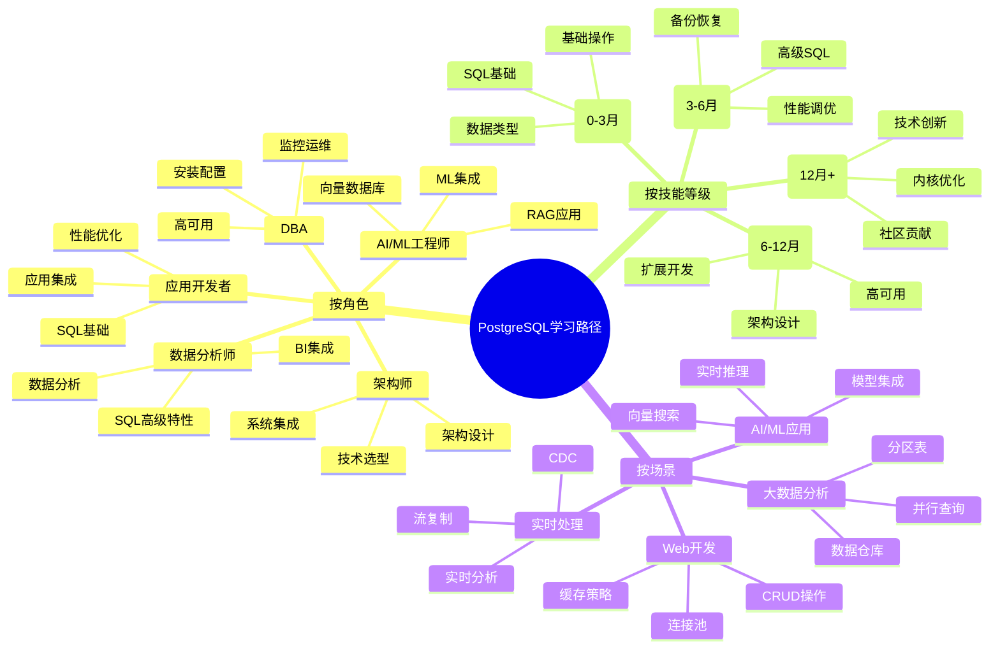

# PostgreSQL 学习路径完整指南

> **更新时间**: 2025 年 1 月
> **适用版本**: PostgreSQL 17+/18+
> **文档编号**: 00-01-01

---

## 📑 目录

- [PostgreSQL 学习路径完整指南](#postgresql-学习路径完整指南)
  - [📑 目录](#-目录)
  - [1. 概述](#1-概述)
    - [1.1 文档目的](#11-文档目的)
    - [1.2 学习路径思维导图](#12-学习路径思维导图)
    - [1.3 学习路径决策矩阵](#13-学习路径决策矩阵)
  - [2. 角色导向学习路径](#2-角色导向学习路径)
    - [2.1 应用开发者路径](#21-应用开发者路径)
      - [学习阶段](#学习阶段)
      - [实战项目建议](#实战项目建议)
    - [2.2 数据库管理员（DBA）路径](#22-数据库管理员dba路径)
      - [学习阶段1](#学习阶段1)
      - [实战项目建议8](#实战项目建议8)
    - [2.3 架构师路径](#23-架构师路径)
      - [学习阶段2](#学习阶段2)
      - [实战项目建议1](#实战项目建议1)
    - [2.4 数据分析师路径](#24-数据分析师路径)
      - [学习阶段3](#学习阶段3)
      - [实战项目建议3](#实战项目建议3)
    - [2.5 AI/ML 工程师路径](#25-aiml-工程师路径)
      - [学习阶段4](#学习阶段4)
      - [实战项目建议4](#实战项目建议4)
  - [3. 技能等级学习路径](#3-技能等级学习路径)
    - [3.1 初学者路径（0-3 个月）](#31-初学者路径0-3-个月)
      - [学习计划](#学习计划)
      - [评估标准](#评估标准)
    - [3.2 中级用户路径（3-6 个月）](#32-中级用户路径3-6-个月)
      - [学习计划5](#学习计划5)
      - [评估标准5](#评估标准5)
    - [3.3 高级用户路径（6-12 个月）](#33-高级用户路径6-12-个月)
      - [学习计划6](#学习计划6)
      - [评估标准6](#评估标准6)
    - [3.4 专家路径（12+ 个月）](#34-专家路径12-个月)
      - [学习计划7](#学习计划7)
      - [评估标准7](#评估标准7)
  - [4. 场景导向学习路径](#4-场景导向学习路径)
    - [4.1 Web 应用开发](#41-web-应用开发)
    - [4.2 大数据分析](#42-大数据分析)
    - [4.3 AI/ML 应用](#43-aiml-应用)
    - [4.4 实时数据处理](#44-实时数据处理)
    - [4.5 企业级应用](#45-企业级应用)
  - [5. 版本升级学习路径](#5-版本升级学习路径)
    - [5.1 PostgreSQL 16 → 17 升级](#51-postgresql-16--17-升级)
    - [5.2 PostgreSQL 17 → 18 升级](#52-postgresql-17--18-升级)
  - [6. 学习资源索引](#6-学习资源索引)
    - [6.1 基础培训文档](#61-基础培训文档)
    - [6.2 新特性文档](#62-新特性文档)
    - [6.3 最佳实践文档](#63-最佳实践文档)
    - [6.4 实战案例文档](#64-实战案例文档)
  - [7. 学习评估和认证](#7-学习评估和认证)
    - [7.1 技能评估清单](#71-技能评估清单)
      - [初级技能评估](#初级技能评估)
      - [中级技能评估](#中级技能评估)
      - [高级技能评估](#高级技能评估)
    - [7.2 实战项目建议](#72-实战项目建议)
      - [初级项目](#初级项目)
      - [中级项目](#中级项目)
      - [高级项目](#高级项目)
  - [8. 学习建议](#8-学习建议)
    - [8.1 学习方法](#81-学习方法)
      - [1. 理论与实践结合](#1-理论与实践结合)
      - [2. 循序渐进](#2-循序渐进)
      - [3. 主动学习](#3-主动学习)
      - [4. 社区参与](#4-社区参与)
    - [8.2 常见误区](#82-常见误区)
      - [误区 1：只学语法不练习](#误区-1只学语法不练习)
      - [误区 2：追求完美](#误区-2追求完美)
      - [误区 3：忽视基础](#误区-3忽视基础)
      - [误区 4：孤立学习](#误区-4孤立学习)
      - [误区 5：不做项目](#误区-5不做项目)
  - [📚 参考资料](#-参考资料)
    - [官方文档](#官方文档)
    - [社区资源](#社区资源)
    - [在线课程](#在线课程)
    - [书籍推荐](#书籍推荐)
    - [实践平台](#实践平台)
  - [附录：快速导航](#附录快速导航)
    - [按角色快速导航](#按角色快速导航)
    - [按技能等级快速导航](#按技能等级快速导航)
    - [按场景快速导航](#按场景快速导航)

---

## 1. 概述

### 1.1 文档目的

本文档提供了全面的 PostgreSQL 学习路径指南，帮助不同背景和目标的学习者找到最适合自己的学习路径。

**核心价值**：

- 📊 **角色导向**：根据职业角色定制学习路径
- 🎯 **技能分级**：从初学者到专家的清晰路径
- 🔍 **场景驱动**：基于实际应用场景的学习指导
- 📈 **版本升级**：新版本特性的系统化学习
- ✅ **评估体系**：完整的技能评估和认证指导

### 1.2 学习路径思维导图

### 1.3 学习路径决策矩阵

| 学习目标 | 推荐路径 | 学习周期 | 核心模块 | 难度等级 |
|---------|---------|---------|---------|---------|
| **Web应用开发** | 应用开发者路径 | 3-4 个月 | SQL基础、事务、索引 | ⭐⭐ |
| **数据库运维** | DBA路径 | 6-8 个月 | 安装配置、监控、高可用 | ⭐⭐⭐⭐ |
| **架构设计** | 架构师路径 | 8-12 个月 | 全栈知识 | ⭐⭐⭐⭐⭐ |
| **数据分析** | 数据分析师路径 | 4-6 个月 | SQL高级、窗口函数、聚合 | ⭐⭐⭐ |
| **AI/ML应用** | AI/ML工程师路径 | 4-5 个月 | 向量数据库、ML集成 | ⭐⭐⭐⭐ |
| **版本升级** | 升级路径 | 1-2 个月 | 新特性、迁移指南 | ⭐⭐⭐ |

---

## 2. 角色导向学习路径

### 2.1 应用开发者路径

**目标**：掌握使用 PostgreSQL 开发应用所需的核心技能

#### 学习阶段

**阶段 1：SQL 基础（2-3 周）**:

- [x] 📖 [SQL基础培训](../01-SQL基础/SQL基础培训.md)
  - 数据定义语言（DDL）
  - 数据操作语言（DML）
  - 数据查询语言（DQL）
  - 基础查询和连接

**阶段 2：数据类型和函数（2-3 周）**:

- [x] 📖 [数据类型详解](../03-数据类型/数据类型详解.md)
  - 基本数据类型
  - JSONB 数据类型
  - 数组类型
  - 自定义类型
- [x] 📖 [函数与存储过程](../04-函数与编程/函数与存储过程.md)
  - 内置函数
  - 用户定义函数
  - 存储过程

**阶段 3：事务和并发（2 周）**:

- [x] 📖 [事务管理详解](../15-体系总览/事务管理详解.md)
  - ACID 特性
  - 事务隔离级别
  - 死锁处理
- [x] 📖 [并发控制详解](../15-体系总览/并发控制详解.md)
  - MVCC 机制
  - 锁机制

**阶段 4：性能优化（2-3 周）**:

- [x] 📖 [索引与查询优化](../01-SQL基础/索引与查询优化.md)
  - 索引类型
  - 查询优化
  - 执行计划分析
- [x] 📖 [查询计划与优化器](../01-SQL基础/查询计划与优化器.md)
  - EXPLAIN 详解
  - 性能调优

**阶段 5：应用集成（1-2 周）**:

- [x] 📖 连接池管理
- [x] 📖 ORM 集成
- [x] 📖 缓存策略

**总计学习时间**：3-4 个月（兼职学习）

#### 实战项目建议

1. **博客系统**：实现用户、文章、评论的完整CRUD
2. **电商应用**：实现订单、库存、支付的事务处理
3. **社交网络**：实现好友关系、动态推送的复杂查询

### 2.2 数据库管理员（DBA）路径

**目标**：掌握 PostgreSQL 数据库的安装、配置、维护和优化

#### 学习阶段1

**阶段 1：基础知识（2-3 周）**:

- [x] 📖 [SQL基础培训](../01-SQL基础/SQL基础培训.md)
- [x] 📖 [数据类型详解](../03-数据类型/数据类型详解.md)

**阶段 2：安装和配置（2 周）**:

- [x] 📖 PostgreSQL 安装
- [x] 📖 初始配置
- [x] 📖 安全配置

**阶段 3：存储管理（2-3 周）**:

- [x] 📖 [表空间与存储管理](../06-存储管理/表空间与存储管理.md)
- [x] 📖 [VACUUM与维护](../06-存储管理/VACUUM与维护.md)
- [x] 📖 [分区表管理](../05-数据管理/分区表管理.md)

**阶段 4：备份和恢复（2 周）**:

- [x] 📖 [备份与恢复](../08-备份恢复/备份与恢复.md)
- [x] 📖 PITR 恢复
- [x] 📖 备份策略

**阶段 5：监控和诊断（3-4 周）**:

- [x] 📖 [监控与诊断](../10-监控诊断/监控与诊断.md)
- [x] 📖 [统计信息管理](../13-运维管理/统计信息管理.md)
- [x] 📖 [日志管理与分析](../10-监控诊断/日志管理与分析.md)

**阶段 6：性能调优（3-4 周）**:

- [x] 📖 [性能调优深入](../11-性能调优/性能调优深入.md)
- [x] 📖 [查询计划与优化器](../01-SQL基础/查询计划与优化器.md)

**阶段 7：高可用（4-5 周）**:

- [x] 📖 [高可用体系详解](../09-高可用/高可用体系详解.md)
- [x] 📖 [逻辑复制详解](../09-高可用/逻辑复制详解.md)
- [x] 📖 Patroni 高可用

**总计学习时间**：6-8 个月（兼职学习）

#### 实战项目建议8

1. **生产环境部署**：从零搭建生产级PostgreSQL集群
2. **备份恢复演练**：实施完整的备份和恢复流程
3. **性能调优项目**：优化真实生产环境的慢查询

### 2.3 架构师路径

**目标**：掌握 PostgreSQL 架构设计和技术选型能力

#### 学习阶段2

**阶段 1：全面基础（4-6 周）**:

- [x] 📖 完成应用开发者路径的所有内容
- [x] 📖 [数据库设计最佳实践](../14-设计/数据库设计最佳实践.md)

**阶段 2：架构设计（4-5 周）**:

- [x] 📖 [架构设计最佳实践](../18-新技术趋势/架构设计最佳实践.md)
- [x] 📖 [高可用架构设计](../19-最新趋势与最佳实践/04-高可用架构/现代高可用架构设计.md)
- [x] 📖 读写分离
- [x] 📖 分库分表

**阶段 3：新技术趋势（6-8 周）**:

- [x] 📖 [pgvector向量数据库详解](../18-新技术趋势/pgvector向量数据库详解.md)
- [x] 📖 [TimescaleDB时序数据库详解](../18-新技术趋势/TimescaleDB时序数据库详解.md)
- [x] 📖 [Citus分布式数据库详解](../18-新技术趋势/Citus分布式数据库详解.md)

**阶段 4：云原生和容器化（3-4 周）**:

- [x] 📖 [Kubernetes部署最佳实践](../19-最新趋势与最佳实践/02-云原生架构/Kubernetes部署最佳实践.md)
- [x] 📖 [容器化架构设计](../19-最新趋势与最佳实践/02-云原生架构/容器化架构设计.md)
- [x] 📖 [Serverless PostgreSQL深度解析](../19-最新趋势与最佳实践/02-云原生架构/Serverless_PostgreSQL深度解析.md)

**阶段 5：技术选型（2-3 周）**:

- [x] 📖 [技术选型决策矩阵](../19-最新趋势与最佳实践/00-总览/技术选型决策矩阵.md)
- [x] 📖 性能对比分析
- [x] 📖 成本评估

**总计学习时间**：8-12 个月（兼职学习）

#### 实战项目建议1

1. **微服务架构设计**：设计支持10万+QPS的微服务数据库架构
2. **多租户系统**：实现安全的多租户数据隔离方案
3. **混合云部署**：设计跨云的高可用架构

### 2.4 数据分析师路径

**目标**：掌握使用 PostgreSQL 进行数据分析的核心技能

#### 学习阶段3

**阶段 1：SQL 基础（2 周）**:

- [x] 📖 [SQL基础培训](../01-SQL基础/SQL基础培训.md)

**阶段 2：SQL 高级特性（4-5 周）**:

- [x] 📖 [窗口函数详解](../02-SQL高级特性/窗口函数详解.md)
- [x] 📖 [CTE详解](../02-SQL高级特性/CTE详解.md)
- [x] 📖 [递归查询详解](../02-SQL高级特性/递归查询详解.md)
- [x] 📖 [聚合函数详解](../04-函数与编程/聚合函数详解.md)

**阶段 3：数据类型和函数（2-3 周）**:

- [x] 📖 [数组与JSONB高级应用](../03-数据类型/数组与JSONB高级应用.md)
- [x] 📖 [全文搜索详解](../03-数据类型/全文搜索详解.md)
- [x] 📖 [日期时间函数详解](../04-函数与编程/日期时间函数详解.md)

**阶段 4：数据仓库（3-4 周）**:

- [x] 📖 [分区表管理](../05-数据管理/分区表管理.md)
- [x] 📖 [物化视图](../05-数据管理/视图与物化视图.md)
- [x] 📖 列式存储

**阶段 5：性能优化（2 周）**:

- [x] 📖 [查询计划与优化器](../01-SQL基础/查询计划与优化器.md)
- [x] 📖 [索引与查询优化](../01-SQL基础/索引与查询优化.md)

**总计学习时间**：4-6 个月（兼职学习）

#### 实战项目建议3

1. **销售数据分析**：实现复杂的销售报表和趋势分析
2. **用户行为分析**：构建用户漏斗和留存分析
3. **实时大屏**：实现实时数据大屏展示

### 2.5 AI/ML 工程师路径

**目标**：掌握使用 PostgreSQL 开发 AI/ML 应用的核心技能

#### 学习阶段4

**阶段 1：SQL 基础（2 周）**:

- [x] 📖 [SQL基础培训](../01-SQL基础/SQL基础培训.md)

**阶段 2：向量数据库（4-5 周）**:

- [x] 📖 [pgvector向量数据库详解](../18-新技术趋势/pgvector向量数据库详解.md)
- [x] 📖 [pgvector生产级应用](../19-最新趋势与最佳实践/01-AI-ML集成/pgvector生产级应用.md)
- [x] 📖 [向量搜索优化最佳实践](../19-最新趋势与最佳实践/01-AI-ML集成/向量搜索优化最佳实践.md)

**阶段 3：AI/ML 集成（3-4 周）**:

- [x] 📖 [PostgreSQL 18 AI/ML集成](../17-PostgreSQL18新特性/AI_ML集成.md)
- [x] 📖 [机器学习集成](../17-PostgreSQL18新特性/机器学习集成.md)
- [x] 📖 [向量数据库增强](../17-PostgreSQL18新特性/向量数据库增强.md)

**阶段 4：AI 应用实战（4-5 周）**:

- [x] 📖 [AI应用案例深度分析](../19-最新趋势与最佳实践/01-AI-ML集成/AI应用案例深度分析.md)
- [x] 📖 [AI应用实战](../18-新技术趋势/AI应用实战.md)
- [x] 📖 RAG 应用开发

**阶段 5：性能优化（2-3 周）**:

- [x] 📖 向量索引优化
- [x] 📖 批量操作优化
- [x] 📖 GPU 加速

**总计学习时间**：4-5 个月（兼职学习）

#### 实战项目建议4

1. **语义搜索引擎**：构建基于向量的语义搜索系统
2. **智能推荐系统**：实现个性化推荐引擎
3. **RAG 应用**：构建检索增强生成（RAG）应用

---

## 3. 技能等级学习路径

### 3.1 初学者路径（0-3 个月）

**目标**：掌握 PostgreSQL 基础知识和基本操作

#### 学习计划

**第 1 周：环境搭建**:

- [ ] 安装 PostgreSQL
- [ ] 安装管理工具（pgAdmin、DBeaver）
- [ ] 熟悉命令行工具（psql）

**第 2-3 周：SQL 基础**:

- [ ] 📖 [SQL基础培训](../01-SQL基础/SQL基础培训.md)
  - 数据定义（CREATE、DROP、ALTER）
  - 数据操作（INSERT、UPDATE、DELETE）
  - 数据查询（SELECT、WHERE、ORDER BY）

**第 4-5 周：数据类型**:

- [ ] 📖 [数据类型详解](../03-数据类型/数据类型详解.md)
  - 数值类型
  - 字符串类型
  - 日期时间类型
  - JSONB 类型

**第 6-7 周：基础查询**:

- [ ] 连接查询（INNER JOIN、LEFT JOIN）
- [ ] 聚合查询（GROUP BY、HAVING）
- [ ] 子查询

**第 8-10 周：事务和约束**:

- [ ] 📖 [事务管理详解](../15-体系总览/事务管理详解.md)
- [ ] 📖 [约束管理](../05-数据管理/约束管理.md)

**第 11-12 周：实战项目**:

- [ ] 完成一个简单的博客系统
- [ ] 实现基本的 CRUD 操作

#### 评估标准

- ✅ 能独立编写基本的 SQL 查询
- ✅ 理解事务和 ACID 特性
- ✅ 能设计简单的数据库表结构
- ✅ 完成至少 1 个实战项目

### 3.2 中级用户路径（3-6 个月）

**目标**：掌握 SQL 高级特性和性能优化

#### 学习计划5

**第 13-16 周：SQL 高级特性**:

- [ ] 📖 [窗口函数详解](../02-SQL高级特性/窗口函数详解.md)
- [ ] 📖 [CTE详解](../02-SQL高级特性/CTE详解.md)
- [ ] 📖 [递归查询详解](../02-SQL高级特性/递归查询详解.md)

**第 17-20 周：性能优化**:

- [ ] 📖 [索引与查询优化](../01-SQL基础/索引与查询优化.md)
- [ ] 📖 [查询计划与优化器](../01-SQL基础/查询计划与优化器.md)
- [ ] EXPLAIN 分析

**第 21-22 周：函数和编程**:

- [ ] 📖 [PL-pgSQL编程详解](../04-函数与编程/PL-pgSQL编程详解.md)
- [ ] 📖 [触发器高级应用](../04-函数与编程/触发器高级应用.md)

**第 23-24 周：实战项目**:

- [ ] 完成一个电商系统
- [ ] 实现复杂的查询和优化

#### 评估标准5

- ✅ 能编写复杂的 SQL 查询（窗口函数、CTE）
- ✅ 能使用 EXPLAIN 分析查询性能
- ✅ 能创建和优化索引
- ✅ 能编写 PL/pgSQL 函数
- ✅ 完成至少 2 个中等复杂度项目

### 3.3 高级用户路径（6-12 个月）

**目标**：掌握数据库管理和架构设计能力

#### 学习计划6

**第 25-28 周：高可用和复制**:

- [ ] 📖 [高可用体系详解](../09-高可用/高可用体系详解.md)
- [ ] 📖 [逻辑复制详解](../09-高可用/逻辑复制详解.md)
- [ ] Patroni 高可用

**第 29-32 周：备份恢复和运维**:

- [ ] 📖 [备份与恢复](../08-备份恢复/备份与恢复.md)
- [ ] 📖 [监控与诊断](../10-监控诊断/监控与诊断.md)
- [ ] 📖 [性能调优深入](../11-性能调优/性能调优深入.md)

**第 33-36 周：架构设计**:

- [ ] 📖 [数据库设计最佳实践](../14-设计/数据库设计最佳实践.md)
- [ ] 📖 [架构设计最佳实践](../18-新技术趋势/架构设计最佳实践.md)
- [ ] 分库分表设计

**第 37-40 周：新技术趋势**:

- [ ] 📖 [pgvector向量数据库详解](../18-新技术趋势/pgvector向量数据库详解.md)
- [ ] 📖 [TimescaleDB时序数据库详解](../18-新技术趋势/TimescaleDB时序数据库详解.md)
- [ ] 📖 [Citus分布式数据库详解](../18-新技术趋势/Citus分布式数据库详解.md)

**第 41-48 周：实战项目**:

- [ ] 完成一个企业级应用
- [ ] 实现高可用架构
- [ ] 实现分布式系统

#### 评估标准6

- ✅ 能设计高可用架构
- ✅ 能进行性能调优
- ✅ 能实施备份恢复策略
- ✅ 能选择和集成扩展
- ✅ 完成至少 1 个企业级项目

### 3.4 专家路径（12+ 个月）

**目标**：成为 PostgreSQL 领域专家

#### 学习计划7

**持续学习**:

- [ ] PostgreSQL 内核源码阅读
- [ ] 扩展开发
- [ ] 性能调优专家
- [ ] 社区贡献

**专业领域深入**:

- [ ] 选择一个专业方向深入（如：向量数据库、时序数据库、分布式数据库）
- [ ] 阅读相关技术论文
- [ ] 参与开源项目
- [ ] 撰写技术博客

#### 评估标准7

- ✅ 能阅读和理解 PostgreSQL 源码
- ✅ 能开发自定义扩展
- ✅ 能解决复杂的生产问题
- ✅ 能在社区分享经验
- ✅ 能指导团队成员

---

## 4. 场景导向学习路径

### 4.1 Web 应用开发

**学习重点**：CRUD 操作、事务管理、连接池、缓存

**核心文档**：

1. 📖 [SQL基础培训](../01-SQL基础/SQL基础培训.md)
2. 📖 [事务管理详解](../15-体系总览/事务管理详解.md)
3. 📖 [索引与查询优化](../01-SQL基础/索引与查询优化.md)
4. 📖 [连接池管理](../13-运维管理/连接池管理.md)

**学习时间**：3-4 个月

### 4.2 大数据分析

**学习重点**：SQL 高级特性、分区表、并行查询、数据仓库

**核心文档**：

1. 📖 [窗口函数详解](../02-SQL高级特性/窗口函数详解.md)
2. 📖 [CTE详解](../02-SQL高级特性/CTE详解.md)
3. 📖 [分区表管理](../05-数据管理/分区表管理.md)
4. 📖 [并行查询增强](../17-PostgreSQL18新特性/并行查询增强.md)

**学习时间**：4-6 个月

### 4.3 AI/ML 应用

**学习重点**：向量数据库、ML 集成、向量搜索、RAG 应用

**核心文档**：

1. 📖 [pgvector向量数据库详解](../18-新技术趋势/pgvector向量数据库详解.md)
2. 📖 [pgvector生产级应用](../19-最新趋势与最佳实践/01-AI-ML集成/pgvector生产级应用.md)
3. 📖 [AI/ML集成](../17-PostgreSQL18新特性/AI_ML集成.md)
4. 📖 [AI应用案例深度分析](../19-最新趋势与最佳实践/01-AI-ML集成/AI应用案例深度分析.md)

**学习时间**：4-5 个月

### 4.4 实时数据处理

**学习重点**：流复制、逻辑复制、CDC、实时分析

**核心文档**：

1. 📖 [逻辑复制详解](../09-高可用/逻辑复制详解.md)
2. 📖 [CDC变更数据捕获](../18-新技术趋势/CDC变更数据捕获.md)
3. 📖 [流式数据处理](../18-新技术趋势/流式数据处理.md)
4. 📖 [实时分析系统](../18-新技术趋势/实时分析系统.md)

**学习时间**：4-5 个月

### 4.5 企业级应用

**学习重点**：高可用、安全、审计、合规

**核心文档**：

1. 📖 [高可用体系详解](../09-高可用/高可用体系详解.md)
2. 📖 [安全体系详解](../07-安全/安全体系详解.md)
3. 📖 [备份恢复体系详解](../08-备份恢复/备份恢复体系详解.md)
4. 📖 [现代高可用架构设计](../19-最新趋势与最佳实践/04-高可用架构/现代高可用架构设计.md)

**学习时间**：6-8 个月

---

## 5. 版本升级学习路径

### 5.1 PostgreSQL 16 → 17 升级

**学习重点**：新特性学习、兼容性评估、迁移计划

**核心文档**：

1. 📖 [PostgreSQL 17新特性总览](../16-PostgreSQL17新特性/README.md)
2. 📖 [SQL_MERGE语句详解](../16-PostgreSQL17新特性/SQL_MERGE语句详解.md)
3. 📖 [逻辑复制性能优化](../16-PostgreSQL17新特性/逻辑复制性能优化.md)
4. 📖 [查询优化器增强](../16-PostgreSQL17新特性/查询优化器增强.md)
5. 📖 [迁移指南_16到17](../16-PostgreSQL17新特性/迁移指南_16到17.md)

**学习时间**：2-3 周

**升级步骤**：

1. **第 1 周**：学习新特性
   - 阅读新特性文档
   - 了解兼容性变化
   - 评估对现有系统的影响

2. **第 2 周**：制定迁移计划
   - 测试环境验证
   - 性能基准测试
   - 回滚方案准备

3. **第 3 周**：执行升级
   - 生产环境升级
   - 性能监控
   - 问题排查

### 5.2 PostgreSQL 17 → 18 升级

**学习重点**：革命性改进、AI/ML 集成、云原生特性

**核心文档**：

1. 📖 [PostgreSQL 18新特性总览](../17-PostgreSQL18新特性/README.md)
2. 📖 [查询优化器革命性改进](../17-PostgreSQL18新特性/查询优化器革命性改进.md)
3. 📖 [异步I/O机制](../17-PostgreSQL18新特性/异步I-O机制.md)
4. 📖 [AI/ML集成](../17-PostgreSQL18新特性/AI_ML集成.md)
5. 📖 [迁移指南_17到18](../17-PostgreSQL18新特性/迁移指南_17到18.md)

**学习时间**：3-4 周

**升级步骤**：

1. **第 1-2 周**：学习新特性
   - 查询优化器改进
   - 异步 I/O 机制
   - AI/ML 集成特性
   - 云原生特性

2. **第 3 周**：制定迁移计划
   - 兼容性测试
   - 性能对比测试
   - 新特性集成计划

3. **第 4 周**：执行升级
   - 分阶段升级
   - 性能验证
   - 新特性启用

---

## 6. 学习资源索引

### 6.1 基础培训文档

| 模块 | 文档 | 难度 | 学习时间 |
|------|------|------|---------|
| SQL基础 | [SQL基础培训](../01-SQL基础/SQL基础培训.md) | ⭐⭐ | 2-3周 |
| 事务管理 | [事务管理详解](../15-体系总览/事务管理详解.md) | ⭐⭐⭐ | 1-2周 |
| 索引优化 | [索引与查询优化](../01-SQL基础/索引与查询优化.md) | ⭐⭐⭐ | 2-3周 |
| 数据类型 | [数据类型详解](../03-数据类型/数据类型详解.md) | ⭐⭐ | 1-2周 |
| 函数编程 | [PL-pgSQL编程详解](../04-函数与编程/PL-pgSQL编程详解.md) | ⭐⭐⭐ | 2-3周 |

### 6.2 新特性文档

| 版本 | 文档 | 重要性 | 学习时间 |
|------|------|--------|---------|
| PG 17 | [PostgreSQL 17新特性](../16-PostgreSQL17新特性/README.md) | ⭐⭐⭐⭐ | 2-3周 |
| PG 18 | [PostgreSQL 18新特性](../17-PostgreSQL18新特性/README.md) | ⭐⭐⭐⭐⭐ | 3-4周 |

### 6.3 最佳实践文档

| 主题 | 文档 | 重要性 | 学习时间 |
|------|------|--------|---------|
| 架构设计 | [架构设计最佳实践](../18-新技术趋势/架构设计最佳实践.md) | ⭐⭐⭐⭐⭐ | 2-3周 |
| 性能优化 | [性能优化最佳实践](../18-新技术趋势/性能优化最佳实践.md) | ⭐⭐⭐⭐⭐ | 2-3周 |
| 高可用 | [现代高可用架构设计](../19-最新趋势与最佳实践/04-高可用架构/现代高可用架构设计.md) | ⭐⭐⭐⭐ | 2-3周 |

### 6.4 实战案例文档

| 场景 | 文档 | 难度 | 学习时间 |
|------|------|------|---------|
| 向量搜索 | [pgvector生产级应用](../19-最新趋势与最佳实践/01-AI-ML集成/pgvector生产级应用.md) | ⭐⭐⭐⭐ | 2-3周 |
| 时序数据 | [TimescaleDB时序数据库详解](../18-新技术趋势/TimescaleDB时序数据库详解.md) | ⭐⭐⭐⭐ | 2-3周 |
| 分布式 | [Citus分布式数据库详解](../18-新技术趋势/Citus分布式数据库详解.md) | ⭐⭐⭐⭐⭐ | 3-4周 |

---

## 7. 学习评估和认证

### 7.1 技能评估清单

#### 初级技能评估

- [ ] 能编写基本的 SELECT 查询
- [ ] 理解 WHERE、ORDER BY、LIMIT 的用法
- [ ] 能执行基本的 INSERT、UPDATE、DELETE 操作
- [ ] 理解主键、外键约束
- [ ] 能创建简单的表结构
- [ ] 理解事务的基本概念
- [ ] 能使用 JOIN 连接多个表

**评估标准**：完成至少 **50个** 基础 SQL 练习

#### 中级技能评估

- [ ] 能使用窗口函数进行数据分析
- [ ] 能编写 CTE 和递归查询
- [ ] 能使用 EXPLAIN 分析查询性能
- [ ] 能创建和优化索引
- [ ] 能编写 PL/pgSQL 函数
- [ ] 理解 MVCC 和并发控制
- [ ] 能处理 JSON/JSONB 数据

**评估标准**：完成至少 **30个** 中级 SQL 练习 + **1个** 中型项目

#### 高级技能评估

- [ ] 能设计数据库架构
- [ ] 能进行性能调优
- [ ] 能配置高可用架构
- [ ] 能实施备份恢复策略
- [ ] 能选择和集成扩展
- [ ] 能解决生产环境问题
- [ ] 能指导团队成员

**评估标准**：完成至少 **1个** 企业级项目 + **贡献开源**

### 7.2 实战项目建议

#### 初级项目

1. **博客系统**
   - 用户管理（注册、登录）
   - 文章管理（CRUD）
   - 评论系统
   - 标签分类
   - **学习重点**：基础 CRUD、事务、约束

2. **待办事项应用**
   - 任务管理
   - 优先级设置
   - 分类标签
   - 状态追踪
   - **学习重点**：数据类型、索引、查询

#### 中级项目

1. **电商系统**
   - 商品管理
   - 订单处理
   - 库存管理
   - 支付流程
   - **学习重点**：事务、并发控制、性能优化

2. **社交网络**
   - 用户关系
   - 动态发布
   - 消息通知
   - 好友推荐
   - **学习重点**：复杂查询、图查询、性能优化

#### 高级项目

1. **分布式电商平台**
   - 分库分表
   - 读写分离
   - 高可用架构
   - 缓存策略
   - **学习重点**：架构设计、高可用、性能调优

2. **实时数据分析平台**
   - 流式数据处理
   - 实时聚合
   - 数据可视化
   - 告警系统
   - **学习重点**：时序数据、流处理、性能优化

3. **AI 应用平台**
   - 向量搜索
   - 模型集成
   - RAG 应用
   - 实时推理
   - **学习重点**：向量数据库、AI/ML 集成

---

## 8. 学习建议

### 8.1 学习方法

#### 1. 理论与实践结合

- **70% 实践**：通过编写代码和项目来学习
- **30% 理论**：阅读文档和书籍
- **推荐方式**：
  - 先阅读文档了解概念
  - 然后编写代码实践
  - 最后通过项目巩固

#### 2. 循序渐进

- **不要跳跃**：按照学习路径顺序学习
- **打好基础**：先掌握基础再学高级特性
- **及时复习**：定期回顾已学内容

#### 3. 主动学习

- **提出问题**：思考为什么这样设计
- **尝试解决**：遇到问题先自己尝试解决
- **记录笔记**：整理学习笔记和心得

#### 4. 社区参与

- **提问交流**：在社区提问和回答问题
- **分享经验**：写博客分享学习心得
- **参与贡献**：为开源项目贡献代码

### 8.2 常见误区

#### 误区 1：只学语法不练习

❌ **错误做法**：只看文档不写代码
✅ **正确做法**：每学一个知识点就编写示例代码

#### 误区 2：追求完美

❌ **错误做法**：一定要完全掌握才进入下一阶段
✅ **正确做法**：先学习70-80%，在实践中不断完善

#### 误区 3：忽视基础

❌ **错误做法**：跳过基础直接学高级特性
✅ **正确做法**：打好基础，循序渐进

#### 误区 4：孤立学习

❌ **错误做法**：闭门造车，不与他人交流
✅ **正确做法**：积极参与社区，与他人交流学习

#### 误区 5：不做项目

❌ **错误做法**：只做练习题不做完整项目
✅ **正确做法**：通过完整项目来巩固知识

---

## 📚 参考资料

### 官方文档

- [PostgreSQL 官方文档](https://www.postgresql.org/docs/)
- [PostgreSQL 教程](https://www.postgresql.org/docs/current/tutorial.html)
- [PostgreSQL Wiki](https://wiki.postgresql.org/)

### 社区资源

- [PostgreSQL 中文社区](http://www.postgres.cn/)
- [Stack Overflow PostgreSQL](https://stackoverflow.com/questions/tagged/postgresql)
- [Reddit r/PostgreSQL](https://www.reddit.com/r/PostgreSQL/)

### 在线课程

- [PostgreSQL 官方培训](https://www.postgresql.org/support/professional_support/)
- [Coursera PostgreSQL 课程](https://www.coursera.org/search?query=postgresql)
- [Udemy PostgreSQL 课程](https://www.udemy.com/topic/postgresql/)

### 书籍推荐

- 《PostgreSQL 修炼之道》
- 《PostgreSQL 数据库内核分析》
- 《High Performance PostgreSQL》
- 《Mastering PostgreSQL》

### 实践平台

- [PostgreSQL Exercises](https://pgexercises.com/)
- [LeetCode Database](https://leetcode.com/problemset/database/)
- [HackerRank SQL](https://www.hackerrank.com/domains/sql)

---

**最后更新**: 2025 年 1 月
**维护者**: PostgreSQL Modern Team
**文档编号**: 00-01-01

---

## 附录：快速导航

### 按角色快速导航

- 🔧 [应用开发者](#21-应用开发者路径)
- 👨‍💼 [数据库管理员（DBA）](#22-数据库管理员dba路径)
- 🏗️ [架构师](#23-架构师路径)
- 📊 [数据分析师](#24-数据分析师路径)
- 🤖 [AI/ML 工程师](#25-aiml-工程师路径)

### 按技能等级快速导航

- 🌱 [初学者（0-3月）](#31-初学者路径0-3-个月)
- 🌿 [中级用户（3-6月）](#32-中级用户路径3-6-个月)
- 🌳 [高级用户（6-12月）](#33-高级用户路径6-12-个月)
- 🚀 [专家（12月+）](#34-专家路径12-个月)

### 按场景快速导航

- 🌐 [Web 应用开发](#41-web-应用开发)
- 📈 [大数据分析](#42-大数据分析)
- 🤖 [AI/ML 应用](#43-aiml-应用)
- ⚡ [实时数据处理](#44-实时数据处理)
- 🏢 [企业级应用](#45-企业级应用)
