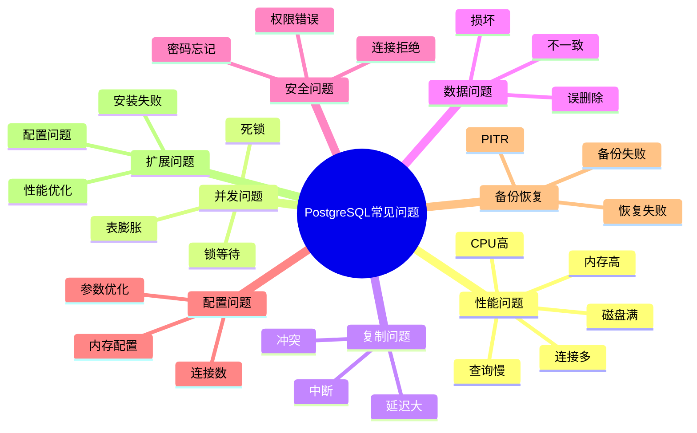

# PostgreSQL 常见问题快速查询手册

> **更新时间**: 2025 年 1 月
> **适用版本**: PostgreSQL 17+/18+
> **文档编号**: 00-01-04

---

## 📑 目录

- [PostgreSQL 常见问题快速查询手册](#postgresql-常见问题快速查询手册)
  - [📑 目录](#-目录)
  - [1. 概述](#1-概述)
    - [1.1 使用说明](#11-使用说明)
    - [1.2 问题分类思维导图](#12-问题分类思维导图)
  - [2. 性能问题](#2-性能问题)
    - [2.1 查询性能慢](#21-查询性能慢)
      - [2.1.1 问题症状](#211-问题症状)
      - [2.1.2 诊断步骤](#212-诊断步骤)
      - [2.1.3 解决方案](#213-解决方案)
      - [2.1.4 预防措施](#214-预防措施)
      - [2.1.5 参考文档](#215-参考文档)
    - [2.2 连接数过多](#22-连接数过多)
      - [2.2.1 问题症状](#221-问题症状)
      - [2.2.2 诊断步骤](#222-诊断步骤)
      - [2.2.3 解决方案](#223-解决方案)
      - [2.2.4 预防措施](#224-预防措施)
      - [2.2.5 参考文档](#225-参考文档)
    - [2.3 磁盘空间不足](#23-磁盘空间不足)
      - [2.3.1 问题症状](#231-问题症状)
      - [2.3.2 诊断步骤](#232-诊断步骤)
      - [2.3.3 解决方案](#233-解决方案)
      - [2.3.4 预防措施](#234-预防措施)
      - [2.3.5 参考文档](#235-参考文档)
    - [2.4 CPU使用率过高](#24-cpu使用率过高)
      - [2.4.1 问题症状](#241-问题症状)
      - [2.4.2 诊断步骤](#242-诊断步骤)
      - [2.4.3 解决方案](#243-解决方案)
      - [2.4.4 预防措施](#244-预防措施)
      - [2.4.5 参考文档](#245-参考文档)
    - [2.5 内存使用过高](#25-内存使用过高)
      - [2.5.1 问题症状](#251-问题症状)
      - [2.5.2 诊断步骤](#252-诊断步骤)
      - [2.5.3 解决方案](#253-解决方案)
      - [2.5.4 预防措施](#254-预防措施)
      - [2.5.5 参考文档](#255-参考文档)
  - [3. 并发问题](#3-并发问题)
    - [3.1 死锁频繁发生](#31-死锁频繁发生)
      - [3.1.1 问题症状](#311-问题症状)
      - [3.1.2 诊断步骤](#312-诊断步骤)
      - [3.1.3 解决方案](#313-解决方案)
      - [3.1.4 预防措施](#314-预防措施)
      - [3.1.5 参考文档](#315-参考文档)
    - [3.2 锁等待时间长](#32-锁等待时间长)
      - [3.2.1 问题症状](#321-问题症状)
      - [3.2.2 诊断步骤](#322-诊断步骤)
      - [3.2.3 解决方案](#323-解决方案)
      - [3.2.4 预防措施](#324-预防措施)
    - [3.3 表膨胀严重](#33-表膨胀严重)
      - [3.3.1 问题症状](#331-问题症状)
      - [3.3.2 诊断步骤](#332-诊断步骤)
      - [3.3.3 解决方案](#333-解决方案)
      - [3.3.4 预防措施](#334-预防措施)
      - [3.3.5 参考文档](#335-参考文档)
  - [4. 复制问题](#4-复制问题)
    - [4.1 复制延迟过大](#41-复制延迟过大)
      - [4.1.1 问题症状](#411-问题症状)
      - [4.1.2 诊断步骤](#412-诊断步骤)
      - [4.1.3 解决方案](#413-解决方案)
      - [4.1.4 预防措施](#414-预防措施)
      - [4.1.5 参考文档](#415-参考文档)
    - [4.2 复制中断](#42-复制中断)
      - [4.2.1 问题症状](#421-问题症状)
      - [4.2.2 诊断步骤](#422-诊断步骤)
      - [4.2.3 解决方案](#423-解决方案)
      - [4.2.4 参考文档](#424-参考文档)
    - [4.3 逻辑复制冲突](#43-逻辑复制冲突)
      - [4.3.1 问题症状](#431-问题症状)
      - [4.3.2 诊断步骤](#432-诊断步骤)
      - [4.3.3 解决方案](#433-解决方案)
      - [4.3.4 参考文档](#434-参考文档)
  - [5. 数据问题](#5-数据问题)
    - [5.1 数据损坏](#51-数据损坏)
      - [5.1.1 问题症状](#511-问题症状)
      - [5.1.2 诊断步骤](#512-诊断步骤)
      - [5.1.3 解决方案](#513-解决方案)
      - [5.1.4 预防措施](#514-预防措施)
      - [5.1.5 参考文档](#515-参考文档)
    - [5.2 数据不一致](#52-数据不一致)
      - [5.2.1 问题症状](#521-问题症状)
      - [5.2.2 诊断步骤](#522-诊断步骤)
      - [5.2.3 解决方案](#523-解决方案)
      - [5.2.4 参考文档](#524-参考文档)
    - [5.3 误删除数据恢复](#53-误删除数据恢复)
      - [5.3.1 问题症状](#531-问题症状)
      - [5.3.2 诊断步骤](#532-诊断步骤)
      - [5.3.3 解决方案](#533-解决方案)
      - [5.3.4 预防措施](#534-预防措施)
      - [5.3.5 参考文档](#535-参考文档)
  - [6. 安全问题](#6-安全问题)
    - [6.1 连接被拒绝](#61-连接被拒绝)
      - [6.1.1 问题症状](#611-问题症状)
      - [6.1.2 诊断步骤](#612-诊断步骤)
      - [6.1.3 解决方案](#613-解决方案)
      - [6.1.4 参考文档](#614-参考文档)
    - [6.2 权限错误](#62-权限错误)
      - [6.2.1 问题症状](#621-问题症状)
      - [6.2.2 解决方案](#622-解决方案)
      - [6.2.3 参考文档](#623-参考文档)
    - [6.3 密码忘记](#63-密码忘记)
      - [6.3.1 问题症状](#631-问题症状)
      - [6.3.2 解决方案](#632-解决方案)
  - [7. 配置问题](#7-配置问题)
    - [7.1 如何优化配置参数](#71-如何优化配置参数)
      - [7.1.1 按内存大小推荐配置](#711-按内存大小推荐配置)
      - [7.1.2 参考文档](#712-参考文档)
    - [7.2 最大连接数配置](#72-最大连接数配置)
      - [7.2.1 解决方案](#721-解决方案)
    - [7.3 内存配置优化](#73-内存配置优化)
      - [7.3.1 解决方案](#731-解决方案)
  - [8. 备份恢复问题](#8-备份恢复问题)
    - [8.1 备份失败](#81-备份失败)
      - [8.1.1 问题症状](#811-问题症状)
      - [8.1.2 诊断步骤](#812-诊断步骤)
      - [8.1.3 解决方案](#813-解决方案)
    - [8.2 恢复失败](#82-恢复失败)
      - [8.2.1 问题症状](#821-问题症状)
      - [8.2.2 解决方案](#822-解决方案)
    - [8.3 PITR恢复](#83-pitr恢复)
      - [8.3.1 完整 PITR 恢复流程](#831-完整-pitr-恢复流程)
      - [8.3.2 参考文档](#832-参考文档)
  - [9. 扩展问题](#9-扩展问题)
    - [9.1 扩展安装失败](#91-扩展安装失败)
      - [9.1.1 问题症状](#911-问题症状)
      - [9.1.2 解决方案](#912-解决方案)
    - [9.2 pgvector性能优化](#92-pgvector性能优化)
      - [9.2.1 常见问题](#921-常见问题)
      - [9.2.2 参考文档](#922-参考文档)
    - [9.3 TimescaleDB配置](#93-timescaledb配置)
      - [9.3.1 常见问题](#931-常见问题)
      - [9.3.2 参考文档](#932-参考文档)
  - [10. 快速诊断工具](#10-快速诊断工具)
    - [10.1 一键健康检查](#101-一键健康检查)
    - [10.2 性能诊断脚本](#102-性能诊断脚本)
    - [10.3 问题排查清单](#103-问题排查清单)
      - [性能问题排查清单](#性能问题排查清单)
  - [📚 参考资料](#-参考资料)
    - [官方文档](#官方文档)
    - [工具文档](#工具文档)
    - [社区资源](#社区资源)
    - [相关文档](#相关文档)
  - [附录：快速命令参考](#附录快速命令参考)
    - [常用诊断命令](#常用诊断命令)
    - [常用管理命令](#常用管理命令)
  - [💡 使用提示](#-使用提示)
    - [如何使用本手册](#如何使用本手册)
    - [问题反馈](#问题反馈)

---

## 1. 概述

### 1.1 使用说明

本手册提供 PostgreSQL 常见问题的快速诊断和解决方案，每个问题包含：

- 🔍 **问题症状**：如何识别问题
- 📊 **诊断步骤**：SQL查询和命令
- 💡 **解决方案**：具体的修复方法
- ✅ **预防措施**：避免问题再次发生
- 📖 **参考文档**：相关详细文档

### 1.2 问题分类思维导图



---

## 2. 性能问题

### 2.1 查询性能慢

#### 2.1.1 问题症状

- 查询响应时间 > 1秒
- 应用超时
- 用户投诉响应慢

#### 2.1.2 诊断步骤

**步骤 1：找到慢查询**:

```sql
-- 查看当前正在执行的慢查询
SELECT
    pid,
    now() - query_start AS duration,
    state,
    query
FROM pg_stat_activity
WHERE state = 'active'
  AND now() - query_start > interval '5 seconds'
ORDER BY duration DESC;

-- 查看历史慢查询（需要pg_stat_statements扩展）
SELECT
    query,
    calls,
    total_exec_time,
    mean_exec_time,
    max_exec_time
FROM pg_stat_statements
WHERE mean_exec_time > 1000  -- 大于1秒
ORDER BY mean_exec_time DESC
LIMIT 20;
```

**步骤 2：分析查询计划**:

```sql
-- 使用 EXPLAIN ANALYZE 分析查询
EXPLAIN (ANALYZE, BUFFERS, VERBOSE)
<your_slow_query>;

-- 关键指标：
-- 1. Seq Scan（全表扫描）- 考虑添加索引
-- 2. Nested Loop（嵌套循环）- 可能需要优化连接
-- 3. Sort（排序）- work_mem 可能不足
-- 4. Buffers（缓冲区）- shared_buffers 可能不足
```

**步骤 3：检查索引使用**:

```sql
-- 查看表的索引使用情况
SELECT
    schemaname,
    tablename,
    indexname,
    idx_scan,
    idx_tup_read,
    idx_tup_fetch
FROM pg_stat_user_indexes
WHERE idx_scan = 0  -- 从未使用的索引
ORDER BY schemaname, tablename;

-- 查看缺失索引的建议
SELECT
    schemaname,
    tablename,
    seq_scan,
    seq_tup_read,
    idx_scan,
    seq_tup_read / seq_scan AS avg_seq_read
FROM pg_stat_user_tables
WHERE seq_scan > 0
ORDER BY seq_tup_read DESC
LIMIT 20;
```

#### 2.1.3 解决方案

**方案 1：添加索引**:

```sql
-- 为经常查询的列添加索引
CREATE INDEX CONCURRENTLY idx_users_email ON users(email);

-- 为组合查询添加复合索引
CREATE INDEX CONCURRENTLY idx_orders_user_date
ON orders(user_id, created_at);

-- 为 JSONB 列添加 GIN 索引
CREATE INDEX CONCURRENTLY idx_data_properties
ON items USING gin(properties);
```

**方案 2：优化查询**:

```sql
-- 使用 CTE 优化复杂查询
WITH filtered_orders AS (
    SELECT * FROM orders
    WHERE created_at >= NOW() - INTERVAL '7 days'
)
SELECT * FROM filtered_orders
WHERE status = 'pending';

-- 使用 EXISTS 代替 IN
SELECT * FROM users
WHERE EXISTS (
    SELECT 1 FROM orders
    WHERE orders.user_id = users.id
);
```

**方案 3：更新统计信息**:

```sql
-- 更新单个表的统计信息
ANALYZE users;

-- 更新所有表的统计信息
VACUUM ANALYZE;
```

#### 2.1.4 预防措施

- ✅ 定期执行 ANALYZE
- ✅ 监控慢查询日志
- ✅ 定期审查索引使用情况
- ✅ 避免 SELECT *

#### 2.1.5 参考文档

- 📖 [查询计划与优化器](../01-SQL基础/查询计划与优化器.md)
- 📖 [索引与查询优化](../01-SQL基础/索引与查询优化.md)

### 2.2 连接数过多

#### 2.2.1 问题症状

- 错误：`FATAL: too many connections`
- 应用无法连接数据库
- 数据库响应变慢

#### 2.2.2 诊断步骤

```sql
-- 查看当前连接数
SELECT count(*) FROM pg_stat_activity;

-- 查看最大连接数
SHOW max_connections;

-- 查看每个数据库的连接数
SELECT
    datname,
    count(*) as connections
FROM pg_stat_activity
GROUP BY datname
ORDER BY connections DESC;

-- 查看每个用户的连接数
SELECT
    usename,
    count(*) as connections
FROM pg_stat_activity
GROUP BY usename
ORDER BY connections DESC;

-- 查看空闲连接
SELECT
    pid,
    usename,
    datname,
    state,
    state_change,
    now() - state_change AS idle_duration
FROM pg_stat_activity
WHERE state = 'idle'
ORDER BY idle_duration DESC;
```

#### 2.2.3 解决方案

**方案 1：终止空闲连接**:

```sql
-- 终止空闲超过30分钟的连接
SELECT pg_terminate_backend(pid)
FROM pg_stat_activity
WHERE state = 'idle'
  AND now() - state_change > interval '30 minutes'
  AND pid != pg_backend_pid();
```

**方案 2：增加最大连接数**:

```sql
-- 修改最大连接数（需要重启）
ALTER SYSTEM SET max_connections = 200;

-- 重启数据库
-- systemctl restart postgresql
```

**方案 3：配置连接池（推荐）**:

```bash
# 安装 PgBouncer
apt-get install pgbouncer

# 配置 PgBouncer
cat > /etc/pgbouncer/pgbouncer.ini <<EOF
[databases]
mydb = host=localhost port=5432 dbname=mydb

[pgbouncer]
listen_addr = *
listen_port = 6432
auth_type = md5
auth_file = /etc/pgbouncer/userlist.txt
pool_mode = transaction
max_client_conn = 1000
default_pool_size = 25
reserve_pool_size = 5
EOF

# 启动 PgBouncer
systemctl start pgbouncer
```

#### 2.2.4 预防措施

- ✅ 使用连接池（PgBouncer）
- ✅ 设置应用超时
- ✅ 监控连接数
- ✅ 及时关闭空闲连接

#### 2.2.5 参考文档

- 📖 [连接池管理](../13-运维管理/连接池管理.md)

### 2.3 磁盘空间不足

#### 2.3.1 问题症状

- 错误：`No space left on device`
- 写入操作失败
- WAL 归档失败

#### 2.3.2 诊断步骤

```sql
-- 查看数据库大小
SELECT
    datname,
    pg_size_pretty(pg_database_size(datname)) AS size
FROM pg_database
ORDER BY pg_database_size(datname) DESC;

-- 查看表大小（包含索引和TOAST）
SELECT
    schemaname,
    tablename,
    pg_size_pretty(pg_total_relation_size(schemaname||'.'||tablename)) AS total_size,
    pg_size_pretty(pg_relation_size(schemaname||'.'||tablename)) AS table_size,
    pg_size_pretty(pg_total_relation_size(schemaname||'.'||tablename) -
                   pg_relation_size(schemaname||'.'||tablename)) AS index_size
FROM pg_tables
WHERE schemaname NOT IN ('pg_catalog', 'information_schema')
ORDER BY pg_total_relation_size(schemaname||'.'||tablename) DESC
LIMIT 20;

-- 查看表膨胀情况
SELECT
    schemaname,
    tablename,
    pg_size_pretty(pg_relation_size(schemaname||'.'||tablename)) AS table_size,
    n_dead_tup,
    n_live_tup,
    round(100.0 * n_dead_tup / NULLIF(n_live_tup + n_dead_tup, 0), 2) AS dead_ratio
FROM pg_stat_user_tables
WHERE n_dead_tup > 1000
ORDER BY n_dead_tup DESC
LIMIT 20;
```

#### 2.3.3 解决方案

**方案 1：清理死元组**:

```sql
-- VACUUM 清理死元组
VACUUM VERBOSE table_name;

-- VACUUM FULL 完全清理（需要排他锁）
VACUUM FULL VERBOSE table_name;
```

**方案 2：删除不需要的数据**:

```sql
-- 删除历史数据
DELETE FROM logs WHERE created_at < NOW() - INTERVAL '90 days';

-- 清理临时表
DROP TABLE IF EXISTS temp_table;
```

**方案 3：清理 WAL 文件**:

```bash
# 检查 WAL 文件数量
ls -lh /var/lib/postgresql/17/main/pg_wal/

# 调整 WAL 保留策略
psql -c "ALTER SYSTEM SET min_wal_size = '1GB';"
psql -c "ALTER SYSTEM SET max_wal_size = '2GB';"
psql -c "SELECT pg_reload_conf();"
```

**方案 4：增加磁盘空间**:

```bash
# 添加新磁盘并创建表空间
mkdir /new_disk/pgdata
chown postgres:postgres /new_disk/pgdata

psql -U postgres <<EOF
CREATE TABLESPACE new_space LOCATION '/new_disk/pgdata';
ALTER TABLE large_table SET TABLESPACE new_space;
EOF
```

#### 2.3.4 预防措施

- ✅ 配置自动 VACUUM
- ✅ 定期清理历史数据
- ✅ 监控磁盘使用率
- ✅ 设置磁盘告警（>80%）

#### 2.3.5 参考文档

- 📖 [VACUUM与维护](../06-存储管理/VACUUM与维护.md)
- 📖 [表空间与存储管理](../06-存储管理/表空间与存储管理.md)

### 2.4 CPU使用率过高

#### 2.4.1 问题症状

- CPU 使用率持续 > 80%
- 系统响应变慢
- 查询排队等待

#### 2.4.2 诊断步骤

```sql
-- 查看消耗 CPU 最多的查询
SELECT
    pid,
    usename,
    datname,
    state,
    query,
    now() - query_start AS duration
FROM pg_stat_activity
WHERE state = 'active'
  AND pid != pg_backend_pid()
ORDER BY duration DESC;

-- 查看历史 CPU 消耗（pg_stat_statements）
SELECT
    query,
    calls,
    total_exec_time,
    mean_exec_time,
    stddev_exec_time
FROM pg_stat_statements
ORDER BY total_exec_time DESC
LIMIT 20;
```

#### 2.4.3 解决方案

**方案 1：优化慢查询**:

```sql
-- 终止长时间运行的查询
SELECT pg_terminate_backend(pid)
FROM pg_stat_activity
WHERE state = 'active'
  AND now() - query_start > interval '5 minutes'
  AND pid != pg_backend_pid();

-- 添加索引优化查询
CREATE INDEX CONCURRENTLY idx_name ON table_name(column_name);
```

**方案 2：限制并行查询**:

```sql
-- 降低并行工作进程数
ALTER SYSTEM SET max_parallel_workers_per_gather = 2;
SELECT pg_reload_conf();
```

**方案 3：使用资源限制**:

```sql
-- 为特定用户设置查询超时
ALTER ROLE app_user SET statement_timeout = '30s';

-- 设置工作内存限制
ALTER ROLE app_user SET work_mem = '64MB';
```

#### 2.4.4 预防措施

- ✅ 优化慢查询
- ✅ 使用连接池
- ✅ 限制并发查询
- ✅ 监控 CPU 使用率

#### 2.4.5 参考文档

- 📖 [性能调优深入](../11-性能调优/性能调优深入.md)
- 📖 [查询计划与优化器](../01-SQL基础/查询计划与优化器.md)

### 2.5 内存使用过高

#### 2.5.1 问题症状

- 内存使用率 > 90%
- OOM Killer 触发
- 系统开始使用 swap

#### 2.5.2 诊断步骤

```sql
-- 查看内存配置
SHOW shared_buffers;
SHOW work_mem;
SHOW maintenance_work_mem;

-- 查看当前内存使用
SELECT
    name,
    setting,
    unit,
    pg_size_pretty(setting::bigint *
        CASE unit
            WHEN 'kB' THEN 1024
            WHEN 'MB' THEN 1024*1024
            WHEN 'GB' THEN 1024*1024*1024
            ELSE 1
        END) AS size
FROM pg_settings
WHERE name IN ('shared_buffers', 'work_mem', 'maintenance_work_mem', 'effective_cache_size');
```

#### 2.5.3 解决方案

**方案 1：优化内存配置**:

```sql
-- 调整 shared_buffers（通常为物理内存的25%）
ALTER SYSTEM SET shared_buffers = '4GB';

-- 调整 work_mem（根据并发数调整）
ALTER SYSTEM SET work_mem = '64MB';

-- 调整 maintenance_work_mem
ALTER SYSTEM SET maintenance_work_mem = '1GB';

-- 重启数据库生效
-- systemctl restart postgresql
```

**方案 2：限制连接数**:

```sql
-- 降低最大连接数
ALTER SYSTEM SET max_connections = 100;

-- 使用连接池
-- 配置 PgBouncer
```

#### 2.5.4 预防措施

- ✅ 合理配置内存参数
- ✅ 使用连接池
- ✅ 监控内存使用
- ✅ 避免内存泄漏

#### 2.5.5 参考文档

- 📖 [性能调优深入](../11-性能调优/性能调优深入.md)

---

## 3. 并发问题

### 3.1 死锁频繁发生

#### 3.1.1 问题症状

- 错误：`deadlock detected`
- 事务失败需要重试
- 应用性能下降

#### 3.1.2 诊断步骤

```sql
-- 查看当前的锁等待
SELECT
    blocked_locks.pid AS blocked_pid,
    blocked_activity.usename AS blocked_user,
    blocking_locks.pid AS blocking_pid,
    blocking_activity.usename AS blocking_user,
    blocked_activity.query AS blocked_statement,
    blocking_activity.query AS blocking_statement
FROM pg_catalog.pg_locks blocked_locks
JOIN pg_catalog.pg_stat_activity blocked_activity ON blocked_activity.pid = blocked_locks.pid
JOIN pg_catalog.pg_locks blocking_locks
    ON blocking_locks.locktype = blocked_locks.locktype
    AND blocking_locks.database IS NOT DISTINCT FROM blocked_locks.database
    AND blocking_locks.relation IS NOT DISTINCT FROM blocked_locks.relation
    AND blocking_locks.page IS NOT DISTINCT FROM blocked_locks.page
    AND blocking_locks.tuple IS NOT DISTINCT FROM blocked_locks.tuple
    AND blocking_locks.virtualxid IS NOT DISTINCT FROM blocked_locks.virtualxid
    AND blocking_locks.transactionid IS NOT DISTINCT FROM blocked_locks.transactionid
    AND blocking_locks.classid IS NOT DISTINCT FROM blocked_locks.classid
    AND blocking_locks.objid IS NOT DISTINCT FROM blocked_locks.objid
    AND blocking_locks.objsubid IS NOT DISTINCT FROM blocked_locks.objsubid
    AND blocking_locks.pid != blocked_locks.pid
JOIN pg_catalog.pg_stat_activity blocking_activity ON blocking_activity.pid = blocking_locks.pid
WHERE NOT blocked_locks.granted;

-- 查看死锁统计（PostgreSQL 17+）
SELECT * FROM pg_stat_database WHERE datname = 'mydb';
-- 查看 deadlocks 字段
```

#### 3.1.3 解决方案

**方案 1：统一访问顺序**:

```sql
-- 错误示例：不同的访问顺序导致死锁
-- 事务 1
BEGIN;
UPDATE accounts SET balance = balance - 100 WHERE id = 1;
UPDATE accounts SET balance = balance + 100 WHERE id = 2;
COMMIT;

-- 事务 2
BEGIN;
UPDATE accounts SET balance = balance - 50 WHERE id = 2;  -- 死锁！
UPDATE accounts SET balance = balance + 50 WHERE id = 1;
COMMIT;

-- 正确示例：统一按 id 顺序访问
-- 所有事务都按 id 从小到大的顺序访问
BEGIN;
UPDATE accounts SET balance = balance - 100 WHERE id = 1;
UPDATE accounts SET balance = balance + 100 WHERE id = 2;
COMMIT;
```

**方案 2：减少事务持有锁的时间**:

```sql
-- 将大事务拆分为小事务
-- 错误：长时间持有锁
BEGIN;
UPDATE large_table SET status = 'processed' WHERE condition;  -- 100万行
-- ... 其他操作
COMMIT;

-- 正确：批量处理
DO $$
DECLARE
    batch_size INT := 1000;
BEGIN
    LOOP
        UPDATE large_table
        SET status = 'processed'
        WHERE id IN (
            SELECT id FROM large_table
            WHERE condition AND status != 'processed'
            LIMIT batch_size
        );

        EXIT WHEN NOT FOUND;
        COMMIT;
    END LOOP;
END $$;
```

**方案 3：使用 FOR UPDATE SKIP LOCKED**:

```sql
-- 跳过已锁定的行，避免等待
SELECT * FROM tasks
WHERE status = 'pending'
ORDER BY priority DESC
LIMIT 10
FOR UPDATE SKIP LOCKED;
```

#### 3.1.4 预防措施

- ✅ 统一资源访问顺序
- ✅ 减少事务持有锁时间
- ✅ 使用合适的隔离级别
- ✅ 监控死锁发生频率

#### 3.1.5 参考文档

- 📖 [锁机制详解](../15-体系总览/锁机制详解.md)
- 📖 [并发控制详解](../15-体系总览/并发控制详解.md)

### 3.2 锁等待时间长

#### 3.2.1 问题症状

- 查询长时间无响应
- 事务等待
- 应用超时

#### 3.2.2 诊断步骤

```sql
-- 查看锁等待情况（更简单的查询）
SELECT
    l.pid,
    l.mode,
    l.granted,
    a.usename,
    a.query,
    a.state
FROM pg_locks l
JOIN pg_stat_activity a ON l.pid = a.pid
WHERE NOT l.granted
ORDER BY a.query_start;
```

#### 3.2.3 解决方案

**方案 1：终止阻塞的会话**:

```sql
-- 查找并终止阻塞者
SELECT pg_terminate_backend(<blocking_pid>);
```

**方案 2：设置锁超时**:

```sql
-- 设置锁等待超时
SET lock_timeout = '10s';

-- 设置语句超时
SET statement_timeout = '60s';
```

#### 3.2.4 预防措施

- ✅ 避免长事务
- ✅ 使用 NOWAIT 或 SKIP LOCKED
- ✅ 设置合理的超时时间

### 3.3 表膨胀严重

#### 3.3.1 问题症状

- 表大小远超预期
- 查询性能下降
- 磁盘空间浪费

#### 3.3.2 诊断步骤

```sql
-- 查看表膨胀率
SELECT
    schemaname,
    tablename,
    pg_size_pretty(pg_relation_size(schemaname||'.'||tablename)) AS size,
    n_dead_tup,
    n_live_tup,
    round(100.0 * n_dead_tup / NULLIF(n_live_tup + n_dead_tup, 0), 2) AS bloat_ratio
FROM pg_stat_user_tables
WHERE n_live_tup > 0
ORDER BY n_dead_tup DESC
LIMIT 20;
```

#### 3.3.3 解决方案

**方案 1：VACUUM**:

```sql
-- 常规 VACUUM
VACUUM VERBOSE table_name;

-- VACUUM FULL（完全清理，需要排他锁）
VACUUM FULL VERBOSE table_name;
```

**方案 2：使用 pg_repack（在线重建）**:

```bash
# 安装 pg_repack
apt-get install postgresql-17-repack

# 在线重建表
pg_repack -h localhost -U postgres -d mydb -t table_name
```

#### 3.3.4 预防措施

- ✅ 配置自动 VACUUM
- ✅ 监控表膨胀率
- ✅ 定期执行 VACUUM

#### 3.3.5 参考文档

- 📖 [VACUUM与维护](../06-存储管理/VACUUM与维护.md)

---

## 4. 复制问题

### 4.1 复制延迟过大

#### 4.1.1 问题症状

- 从库数据滞后
- 读写分离数据不一致
- 应用读取旧数据

#### 4.1.2 诊断步骤

```sql
-- 在主库查看复制状态
SELECT
    client_addr,
    state,
    sync_state,
    pg_wal_lsn_diff(pg_current_wal_lsn(), sent_lsn) AS send_lag,
    pg_wal_lsn_diff(sent_lsn, write_lsn) AS write_lag,
    pg_wal_lsn_diff(write_lsn, flush_lsn) AS flush_lag,
    pg_wal_lsn_diff(flush_lsn, replay_lsn) AS replay_lag
FROM pg_stat_replication;

-- 在从库查看应用延迟
SELECT
    pg_wal_lsn_diff(pg_last_wal_receive_lsn(), pg_last_wal_replay_lsn()) AS replication_lag_bytes,
    extract(epoch from (now() - pg_last_xact_replay_timestamp())) AS replication_lag_seconds;
```

#### 4.1.3 解决方案

**方案 1：优化网络**:

```bash
# 检查网络延迟
ping <standby_host>

# 检查网络带宽
iperf3 -s  # 在从库
iperf3 -c <standby_host>  # 在主库
```

**方案 2：优化从库硬件**:

```sql
-- 增加从库的应用进程
ALTER SYSTEM SET max_parallel_workers = 8;
ALTER SYSTEM SET max_wal_senders = 10;
```

**方案 3：启用并行应用（PG 17+）**:

```sql
-- 在从库启用逻辑复制并行应用
ALTER SUBSCRIPTION my_subscription SET (streaming = parallel);
```

#### 4.1.4 预防措施

- ✅ 监控复制延迟
- ✅ 使用高速网络
- ✅ 优化从库配置
- ✅ 使用并行应用

#### 4.1.5 参考文档

- 📖 [高可用体系详解](../09-高可用/高可用体系详解.md)
- 📖 [逻辑复制详解](../09-高可用/逻辑复制详解.md)

### 4.2 复制中断

#### 4.2.1 问题症状

- 从库停止复制
- 复制槽堆积 WAL
- 主库磁盘空间告警

#### 4.2.2 诊断步骤

```sql
-- 查看复制槽状态
SELECT
    slot_name,
    slot_type,
    database,
    active,
    restart_lsn,
    confirmed_flush_lsn,
    pg_wal_lsn_diff(pg_current_wal_lsn(), restart_lsn) AS lag_bytes
FROM pg_replication_slots;
```

#### 4.2.3 解决方案

**方案 1：重启从库复制**:

```bash
# 在从库重启 PostgreSQL
systemctl restart postgresql
```

**方案 2：删除无用的复制槽**:

```sql
-- 删除不活跃的复制槽
SELECT pg_drop_replication_slot('slot_name');
```

#### 4.2.4 参考文档

- 📖 [高可用体系详解](../09-高可用/高可用体系详解.md)
- 📖 [逻辑复制详解](../09-高可用/逻辑复制详解.md)

### 4.3 逻辑复制冲突

#### 4.3.1 问题症状

- 错误：`duplicate key value violates unique constraint`
- 逻辑复制停止
- 数据不同步

#### 4.3.2 诊断步骤

```sql
-- 查看逻辑复制错误
SELECT * FROM pg_stat_subscription;

-- 查看复制冲突日志
-- 检查 PostgreSQL 日志文件
```

#### 4.3.3 解决方案

**方案 1：手动解决冲突**:

```sql
-- 禁用订阅
ALTER SUBSCRIPTION my_subscription DISABLE;

-- 手动修复冲突数据
-- 删除重复记录或更新数据

-- 重新启用订阅
ALTER SUBSCRIPTION my_subscription ENABLE;
```

**方案 2：配置冲突解决策略**:

```sql
-- 设置冲突解决策略（PostgreSQL 17+）
ALTER SUBSCRIPTION my_subscription SET (conflict_resolution = 'last_update_wins');
```

#### 4.3.4 参考文档

- 📖 [逻辑复制详解](../09-高可用/逻辑复制详解.md)

---

## 5. 数据问题

### 5.1 数据损坏

#### 5.1.1 问题症状

- 错误：`invalid page header`
- 查询返回错误结果
- 数据库崩溃

#### 5.1.2 诊断步骤

```sql
-- 检查数据库完整性
-- 使用 pg_checksums（PostgreSQL 12+）
-- 或使用 amcheck 扩展
CREATE EXTENSION amcheck;

-- 检查表和索引
SELECT bt_index_check('index_name');
```

#### 5.1.3 解决方案

**方案 1：从备份恢复**:

```bash
# 停止数据库
systemctl stop postgresql

# 恢复备份
pg_restore -d mydb /backup/mydb.dump

# 启动数据库
systemctl start postgresql
```

**方案 2：修复数据（高风险）**:

```sql
-- 仅在确认可以接受数据丢失时使用
-- 设置 zero_damaged_pages（危险！）
SET zero_damaged_pages = on;

-- 重建索引
REINDEX TABLE table_name;
```

#### 5.1.4 预防措施

- ✅ 定期备份
- ✅ 使用数据校验和
- ✅ 使用可靠的硬件
- ✅ 监控硬件错误

#### 5.1.5 参考文档

- 📖 [备份与恢复](../08-备份恢复/备份与恢复.md)
- 📖 [数据库完整性检查](../13-运维管理/统计信息管理.md)

### 5.2 数据不一致

#### 5.2.1 问题症状

- 主从数据不一致
- 统计数据错误
- 约束违反

#### 5.2.2 诊断步骤

```sql
-- 比较主从数据（需要手动比较）
-- 在主库
SELECT count(*), sum(id), md5(string_agg(id::text, '')) FROM table_name;

-- 在从库执行相同查询，比较结果
```

#### 5.2.3 解决方案

**方案 1：重新同步**:

```bash
# 从主库重新创建从库
pg_basebackup -h primary_host -D /var/lib/postgresql/17/standby -U replication -P
```

#### 5.2.4 参考文档

- 📖 [高可用体系详解](../09-高可用/高可用体系详解.md)
- 📖 [逻辑复制详解](../09-高可用/逻辑复制详解.md)

### 5.3 误删除数据恢复

#### 5.3.1 问题症状

- 数据被误删除
- 需要恢复到删除前

#### 5.3.2 诊断步骤

```sql
-- 检查最近的备份
-- 查看备份时间和可恢复的时间点
```

#### 5.3.3 解决方案

**方案 1：PITR 恢复**:

```bash
# 1. 停止数据库
systemctl stop postgresql

# 2. 恢复基础备份
# 3. 配置恢复目标
cat > /var/lib/postgresql/17/main/recovery.conf <<EOF
restore_command = 'cp /archive/%f %p'
recovery_target_time = '2025-01-15 14:30:00'
recovery_target_action = 'promote'
EOF

# 4. 启动数据库
systemctl start postgresql
```

**方案 2：从从库获取数据**:

```sql
-- 如果从库有数据，从从库复制
COPY (SELECT * FROM table_name WHERE condition) TO '/tmp/data.csv' CSV;
-- 在主库导入
COPY table_name FROM '/tmp/data.csv' CSV;
```

#### 5.3.4 预防措施

- ✅ 使用事务保护重要操作
- ✅ 定期备份
- ✅ 启用 WAL 归档
- ✅ 限制 DELETE 权限

#### 5.3.5 参考文档

- 📖 [备份与恢复](../08-备份恢复/备份与恢复.md)
- 📖 [PITR恢复详解](../08-备份恢复/备份恢复体系详解.md)

---

## 6. 安全问题

### 6.1 连接被拒绝

#### 6.1.1 问题症状

- 错误：`connection refused`
- 无法连接数据库

#### 6.1.2 诊断步骤

```bash
# 1. 检查 PostgreSQL 是否运行
systemctl status postgresql

# 2. 检查监听地址
psql -U postgres -c "SHOW listen_addresses;"

# 3. 检查端口
psql -U postgres -c "SHOW port;"

# 4. 检查防火墙
netstat -tlnp | grep 5432
```

#### 6.1.3 解决方案

**方案 1：配置监听地址**:

```sql
-- 允许所有地址连接
ALTER SYSTEM SET listen_addresses = '*';
SELECT pg_reload_conf();
```

**方案 2：配置 pg_hba.conf**:

```bash
# 编辑 pg_hba.conf
echo "host    all    all    0.0.0.0/0    scram-sha-256" >> /etc/postgresql/17/main/pg_hba.conf

# 重新加载配置
psql -U postgres -c "SELECT pg_reload_conf();"
```

#### 6.1.4 参考文档

- 📖 [安全体系详解](../07-安全/安全体系详解.md)
- 📖 [权限管理](../07-安全/权限管理.md)

### 6.2 权限错误

#### 6.2.1 问题症状

- 错误：`permission denied`
- 无法访问表或执行操作

#### 6.2.2 解决方案

```sql
-- 授予表权限
GRANT SELECT, INSERT, UPDATE, DELETE ON table_name TO username;

-- 授予 schema 所有表的权限
GRANT ALL PRIVILEGES ON ALL TABLES IN SCHEMA public TO username;

-- 授予未来创建的表的权限
ALTER DEFAULT PRIVILEGES IN SCHEMA public
GRANT ALL PRIVILEGES ON TABLES TO username;
```

#### 6.2.3 参考文档

- 📖 [权限管理](../07-安全/权限管理.md)
- 📖 [安全体系详解](../07-安全/安全体系详解.md)

### 6.3 密码忘记

#### 6.3.1 问题症状

- 无法登录 PostgreSQL
- 密码错误

#### 6.3.2 解决方案

```bash
# 方法 1：使用 peer 认证（本地）
sudo -u postgres psql

# 方法 2：临时修改 pg_hba.conf
# 将认证方法改为 trust（危险！仅临时使用）
# host    all    all    127.0.0.1/32    trust

# 重新加载配置
psql -U postgres -c "SELECT pg_reload_conf();"

# 修改密码
psql -U postgres -c "ALTER USER postgres PASSWORD 'new_password';"

# 恢复 pg_hba.conf 的认证方法
```

---

## 7. 配置问题

### 7.1 如何优化配置参数

#### 7.1.1 按内存大小推荐配置

**4GB 内存服务器**:

```sql
ALTER SYSTEM SET shared_buffers = '1GB';
ALTER SYSTEM SET effective_cache_size = '3GB';
ALTER SYSTEM SET maintenance_work_mem = '256MB';
ALTER SYSTEM SET work_mem = '16MB';
ALTER SYSTEM SET max_connections = 100;
```

**16GB 内存服务器**:

```sql
ALTER SYSTEM SET shared_buffers = '4GB';
ALTER SYSTEM SET effective_cache_size = '12GB';
ALTER SYSTEM SET maintenance_work_mem = '1GB';
ALTER SYSTEM SET work_mem = '64MB';
ALTER SYSTEM SET max_connections = 200;
```

**64GB+ 内存服务器**:

```sql
ALTER SYSTEM SET shared_buffers = '16GB';
ALTER SYSTEM SET effective_cache_size = '48GB';
ALTER SYSTEM SET maintenance_work_mem = '2GB';
ALTER SYSTEM SET work_mem = '128MB';
ALTER SYSTEM SET max_connections = 300;
```

#### 7.1.2 参考文档

- 📖 [性能调优深入](../11-性能调优/性能调优深入.md)
- 📖 [PostgreSQL性能调优检查清单](./PostgreSQL性能调优检查清单.md)

### 7.2 最大连接数配置

#### 7.2.1 解决方案

```sql
-- 方法 1：增加最大连接数（不推荐）
ALTER SYSTEM SET max_connections = 500;  -- 需要重启

-- 方法 2：使用连接池（推荐）
-- 配置 PgBouncer，应用连接 PgBouncer
-- PgBouncer 使用少量连接连接数据库
```

### 7.3 内存配置优化

#### 7.3.1 解决方案

```sql
-- 优化内存配置的黄金法则
-- shared_buffers = 物理内存的 25%
-- effective_cache_size = 物理内存的 75%
-- work_mem = (物理内存 - shared_buffers) / max_connections / 2
-- maintenance_work_mem = 物理内存的 5-10%

-- 示例：32GB 内存服务器
ALTER SYSTEM SET shared_buffers = '8GB';
ALTER SYSTEM SET effective_cache_size = '24GB';
ALTER SYSTEM SET work_mem = '64MB';
ALTER SYSTEM SET maintenance_work_mem = '2GB';
```

---

## 8. 备份恢复问题

### 8.1 备份失败

#### 8.1.1 问题症状

- pg_dump 执行失败
- 备份文件损坏
- 备份空间不足

#### 8.1.2 诊断步骤

```bash
# 检查磁盘空间
df -h /backup

# 检查备份日志
tail -f /var/log/postgresql/pg_backup.log

# 测试备份
pg_dump -U postgres -d mydb -f /tmp/test.dump
```

#### 8.1.3 解决方案

```bash
# 使用压缩格式减少空间
pg_dump -U postgres -Fc -d mydb -f /backup/mydb.dump

# 使用目录格式支持并行
pg_dump -U postgres -Fd -j 4 -d mydb -f /backup/mydb_dir

# 定期清理旧备份
find /backup -name "*.dump" -mtime +7 -delete
```

### 8.2 恢复失败

#### 8.2.1 问题症状

- pg_restore 报错
- 数据恢复不完整
- 恢复时间过长

#### 8.2.2 解决方案

```bash
# 使用并行恢复
pg_restore -U postgres -d mydb -j 4 /backup/mydb.dump

# 跳过错误继续恢复
pg_restore -U postgres -d mydb --single-transaction=false /backup/mydb.dump

# 仅恢复 schema
pg_restore -U postgres -d mydb --schema-only /backup/mydb.dump

# 仅恢复数据
pg_restore -U postgres -d mydb --data-only /backup/mydb.dump
```

### 8.3 PITR恢复

#### 8.3.1 完整 PITR 恢复流程

```bash
#!/bin/bash
# PITR 恢复脚本

echo "开始 PITR 恢复..."

# 1. 停止 PostgreSQL
systemctl stop postgresql

# 2. 清空数据目录
rm -rf /var/lib/postgresql/17/main/*

# 3. 恢复基础备份
tar -xzf /backup/base_backup.tar.gz -C /var/lib/postgresql/17/main/

# 4. 创建恢复配置
cat > /var/lib/postgresql/17/main/recovery.signal <<EOF
# Recovery signal file
EOF

cat >> /var/lib/postgresql/17/main/postgresql.conf <<EOF
restore_command = 'cp /archive/%f %p'
recovery_target_time = '2025-01-15 14:30:00'
recovery_target_action = 'promote'
EOF

# 5. 启动 PostgreSQL
systemctl start postgresql

# 6. 验证恢复
psql -U postgres -c "SELECT pg_is_in_recovery();"

echo "PITR 恢复完成！"
```

#### 8.3.2 参考文档

- 📖 [备份与恢复](../08-备份恢复/备份与恢复.md)
- 📖 [备份恢复体系详解](../08-备份恢复/备份恢复体系详解.md)

---

## 9. 扩展问题

### 9.1 扩展安装失败

#### 9.1.1 问题症状

- 错误：`extension "xxx" is not available`
- CREATE EXTENSION 失败

#### 9.1.2 解决方案

```bash
# 1. 检查扩展是否已安装
apt-cache search postgresql-17-*

# 2. 安装扩展包
apt-get install postgresql-17-pgvector
apt-get install postgresql-17-postgis

# 3. 在数据库中创建扩展
psql -U postgres -d mydb -c "CREATE EXTENSION pgvector;"
```

### 9.2 pgvector性能优化

#### 9.2.1 常见问题

**Q: 向量搜索太慢？**

A: 优化方案：

```sql
-- 1. 创建 HNSW 索引（推荐）
CREATE INDEX ON items USING hnsw (embedding vector_cosine_ops);

-- 2. 调整索引参数
CREATE INDEX ON items USING hnsw (embedding vector_cosine_ops)
WITH (m = 16, ef_construction = 64);

-- 3. 增加维护内存
SET maintenance_work_mem = '2GB';

-- 4. 使用并行构建
SET max_parallel_maintenance_workers = 4;
```

**Q: 索引构建太慢？**

A: 优化方案：

```sql
-- 1. 批量插入数据后再创建索引
-- 先插入所有数据
COPY items FROM '/data/items.csv';

-- 然后创建索引
CREATE INDEX ON items USING hnsw (embedding vector_cosine_ops);

-- 2. 增加维护内存
SET maintenance_work_mem = '4GB';
```

#### 9.2.2 参考文档

- 📖 [pgvector向量数据库详解](../18-新技术趋势/pgvector向量数据库详解.md)
- 📖 [pgvector生产级应用](../19-最新趋势与最佳实践/01-AI-ML集成/pgvector生产级应用.md)

### 9.3 TimescaleDB配置

#### 9.3.1 常见问题

**Q: 如何创建超表？**

A: 步骤：

```sql
-- 1. 安装扩展
CREATE EXTENSION timescaledb;

-- 2. 创建普通表
CREATE TABLE metrics (
    time TIMESTAMPTZ NOT NULL,
    device_id INT,
    temperature DOUBLE PRECISION,
    humidity DOUBLE PRECISION
);

-- 3. 转换为超表
SELECT create_hypertable('metrics', 'time');

-- 4. 验证
SELECT * FROM timescaledb_information.hypertables;
```

**Q: 如何配置数据保留策略？**

A: 配置方法：

```sql
-- 添加数据保留策略（保留90天）
SELECT add_retention_policy('metrics', INTERVAL '90 days');

-- 查看保留策略
SELECT * FROM timescaledb_information.jobs;
```

#### 9.3.2 参考文档

- 📖 [TimescaleDB时序数据库详解](../18-新技术趋势/TimescaleDB时序数据库详解.md)
- 📖 [时序数据管理最佳实践](../19-最新趋势与最佳实践/05-数据管理/时序数据管理最佳实践.md)

---

## 10. 快速诊断工具

### 10.1 一键健康检查

```sql
-- PostgreSQL 健康检查脚本
-- 复制此查询执行，一次性检查所有关键指标

-- 1. 版本信息
SELECT 'Version' AS metric, version() AS value
UNION ALL

-- 2. 运行时间
SELECT 'Uptime',
    (now() - pg_postmaster_start_time())::text
UNION ALL

-- 3. 数据库大小
SELECT 'Database Size',
    pg_size_pretty(pg_database_size(current_database()))
UNION ALL

-- 4. 连接数
SELECT 'Active Connections',
    count(*)::text
FROM pg_stat_activity
UNION ALL

-- 5. 最大连接数
SELECT 'Max Connections',
    setting
FROM pg_settings
WHERE name = 'max_connections'
UNION ALL

-- 6. 缓冲区命中率
SELECT 'Buffer Hit Ratio',
    round(100.0 * sum(blks_hit) / NULLIF(sum(blks_hit + blks_read), 0), 2)::text || '%'
FROM pg_stat_database
UNION ALL

-- 7. 死锁数量
SELECT 'Deadlocks (since last reset)',
    sum(deadlocks)::text
FROM pg_stat_database
UNION ALL

-- 8. 表膨胀率
SELECT 'Tables with >20% bloat',
    count(*)::text
FROM pg_stat_user_tables
WHERE n_dead_tup > 1000
  AND round(100.0 * n_dead_tup / NULLIF(n_live_tup + n_dead_tup, 0), 2) > 20
UNION ALL

-- 9. 复制延迟（如果是主库）
SELECT 'Max Replication Lag (bytes)',
    COALESCE(
        pg_size_pretty(max(pg_wal_lsn_diff(pg_current_wal_lsn(), replay_lsn))),
        'N/A'
    )
FROM pg_stat_replication;
```

### 10.2 性能诊断脚本

```bash
#!/bin/bash
# PostgreSQL 性能诊断脚本

echo "=== PostgreSQL 性能诊断报告 ==="
echo "生成时间: $(date)"
echo ""

# 1. 系统资源
echo "=== 1. 系统资源 ==="
echo "CPU 使用率:"
top -bn1 | grep "Cpu(s)" | awk '{print $2}'
echo ""
echo "内存使用:"
free -h
echo ""
echo "磁盘使用:"
df -h
echo ""

# 2. PostgreSQL 状态
echo "=== 2. PostgreSQL 状态 ==="
psql -U postgres -c "SELECT version();"
psql -U postgres -c "SELECT pg_postmaster_start_time() AS start_time, now() - pg_postmaster_start_time() AS uptime;"
echo ""

# 3. 连接状态
echo "=== 3. 连接状态 ==="
psql -U postgres -c "SELECT count(*) AS total_connections FROM pg_stat_activity;"
psql -U postgres -c "SELECT state, count(*) FROM pg_stat_activity GROUP BY state;"
echo ""

# 4. 慢查询
echo "=== 4. Top 10 慢查询 ==="
psql -U postgres -d mydb -c "
SELECT
    substring(query, 1, 80) AS query,
    calls,
    round(total_exec_time::numeric, 2) AS total_time_ms,
    round(mean_exec_time::numeric, 2) AS avg_time_ms
FROM pg_stat_statements
ORDER BY total_exec_time DESC
LIMIT 10;"
echo ""

# 5. 表大小
echo "=== 5. Top 10 最大表 ==="
psql -U postgres -d mydb -c "
SELECT
    schemaname,
    tablename,
    pg_size_pretty(pg_total_relation_size(schemaname||'.'||tablename)) AS size
FROM pg_tables
WHERE schemaname NOT IN ('pg_catalog', 'information_schema')
ORDER BY pg_total_relation_size(schemaname||'.'||tablename) DESC
LIMIT 10;"
echo ""

# 6. 索引使用
echo "=== 6. 未使用的索引 ==="
psql -U postgres -d mydb -c "
SELECT
    schemaname,
    tablename,
    indexname,
    pg_size_pretty(pg_relation_size(indexrelid)) AS size
FROM pg_stat_user_indexes
WHERE idx_scan = 0
ORDER BY pg_relation_size(indexrelid) DESC
LIMIT 10;"
echo ""

echo "=== 诊断完成 ==="
```

### 10.3 问题排查清单

#### 性能问题排查清单

```markdown
## 性能问题排查清单

### 步骤 1：确认问题
- [ ] 确认性能下降的具体表现
- [ ] 记录问题发生的时间
- [ ] 检查是否有配置变更
- [ ] 检查是否有应用变更

### 步骤 2：收集信息
- [ ] 执行健康检查脚本
- [ ] 查看 PostgreSQL 日志
- [ ] 查看系统资源使用情况
- [ ] 导出慢查询日志

### 步骤 3：定位问题
- [ ] 是查询问题还是系统问题？
- [ ] 是特定查询还是整体性能？
- [ ] 是持续问题还是间歇性问题？

### 步骤 4：解决问题
- [ ] 根据诊断结果选择解决方案
- [ ] 在测试环境验证方案
- [ ] 在生产环境实施方案
- [ ] 监控效果

### 步骤 5：预防措施
- [ ] 添加监控告警
- [ ] 更新运维文档
- [ ] 团队分享经验
```

---

## 📚 参考资料

### 官方文档

- [PostgreSQL 官方文档 - 监控](https://www.postgresql.org/docs/current/monitoring.html)
- [PostgreSQL 官方文档 - 性能优化](https://www.postgresql.org/docs/current/performance-tips.html)
- [PostgreSQL Wiki - 性能优化](https://wiki.postgresql.org/wiki/Performance_Optimization)

### 工具文档

- [pg_stat_statements](https://www.postgresql.org/docs/current/pgstatstatements.html)
- [PgBouncer](https://www.pgbouncer.org/)
- [pg_repack](https://reorg.github.io/pg_repack/)

### 社区资源

- [PostgreSQL 中文社区](http://www.postgres.cn/)
- [Stack Overflow - PostgreSQL](https://stackoverflow.com/questions/tagged/postgresql)
- [DBA Stack Exchange](https://dba.stackexchange.com/questions/tagged/postgresql)

### 相关文档

- 📖 [监控与诊断](../10-监控诊断/监控与诊断.md)
- 📖 [性能调优深入](../11-性能调优/性能调优深入.md)
- 📖 [查询计划与优化器](../01-SQL基础/查询计划与优化器.md)
- 📖 [锁机制详解](../15-体系总览/锁机制详解.md)
- 📖 [高可用体系详解](../09-高可用/高可用体系详解.md)

---

## 附录：快速命令参考

### 常用诊断命令

```sql
-- 查看活跃连接
SELECT * FROM pg_stat_activity WHERE state = 'active';

-- 查看锁等待
SELECT * FROM pg_locks WHERE NOT granted;

-- 查看表大小
SELECT pg_size_pretty(pg_total_relation_size('table_name'));

-- 查看数据库大小
SELECT pg_size_pretty(pg_database_size('database_name'));

-- 查看慢查询
SELECT * FROM pg_stat_statements ORDER BY mean_exec_time DESC LIMIT 10;

-- 查看复制状态
SELECT * FROM pg_stat_replication;

-- 查看表膨胀
SELECT * FROM pg_stat_user_tables WHERE n_dead_tup > 10000;

-- 终止会话
SELECT pg_terminate_backend(pid);

-- 取消查询
SELECT pg_cancel_backend(pid);
```

### 常用管理命令

```bash
# 启动/停止/重启
systemctl start postgresql
systemctl stop postgresql
systemctl restart postgresql
systemctl reload postgresql

# 查看状态
systemctl status postgresql

# 查看日志
tail -f /var/log/postgresql/postgresql-17-main.log

# 备份
pg_dump -U postgres -Fc mydb > mydb.dump

# 恢复
pg_restore -U postgres -d mydb mydb.dump

# 连接数据库
psql -U postgres -d mydb

# VACUUM
vacuumdb -U postgres -d mydb -z

# REINDEX
reindexdb -U postgres -d mydb
```

---

**最后更新**: 2025 年 1 月
**维护者**: PostgreSQL Modern Team
**文档编号**: 00-01-04

---

## 💡 使用提示

### 如何使用本手册

1. **遇到问题时**：
   - 在目录中找到对应的问题分类
   - 按照诊断步骤执行
   - 根据结果选择解决方案

2. **日常维护时**：
   - 定期执行健康检查脚本
   - 关注监控告警
   - 预防性维护

3. **团队协作时**：
   - 分享本手册给团队成员
   - 记录团队遇到的新问题
   - 持续更新和完善

### 问题反馈

如果遇到本手册未覆盖的问题，欢迎：

- 在社区提问
- 贡献新的问题和解决方案
- 完善现有内容
