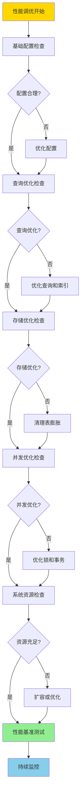

# PostgreSQL 性能调优检查清单

> **更新时间**: 2025 年 1 月
> **适用版本**: PostgreSQL 17+/18+
> **文档编号**: 00-01-05

---

## 📑 目录

- [PostgreSQL 性能调优检查清单](#postgresql-性能调优检查清单)
  - [📑 目录](#-目录)
  - [1. 概述](#1-概述)
    - [1.1 使用说明](#11-使用说明)
    - [1.2 调优流程思维导图](#12-调优流程思维导图)
    - [1.3 调优优先级矩阵](#13-调优优先级矩阵)
  - [2. 基础配置检查](#2-基础配置检查)
    - [2.1 内存配置（权重：30%）](#21-内存配置权重30)
      - [2.1.1 检查项](#211-检查项)
      - [2.1.2 检查脚本](#212-检查脚本)
      - [2.1.3 推荐配置](#213-推荐配置)
      - [2.1.4 优化命令](#214-优化命令)
      - [2.1.5 验证指标](#215-验证指标)
    - [2.2 连接配置（权重：15%）](#22-连接配置权重15)
      - [2.2.1 检查项](#221-检查项)
      - [2.2.2 检查脚本](#222-检查脚本)
      - [2.2.3 推荐配置](#223-推荐配置)
      - [2.2.4 验证指标](#224-验证指标)
    - [2.3 WAL 配置（权重：20%）](#23-wal-配置权重20)
      - [2.3.1 检查项](#231-检查项)
      - [2.3.2 检查脚本](#232-检查脚本)
      - [2.3.3 推荐配置](#233-推荐配置)
      - [2.3.4 验证指标](#234-验证指标)
    - [2.4 查询优化器配置（权重：15%）](#24-查询优化器配置权重15)
      - [2.4.1 检查项](#241-检查项)
      - [2.4.2 推荐配置](#242-推荐配置)
    - [2.5 并行查询配置（权重：10%）](#25-并行查询配置权重10)
      - [2.5.1 检查项](#251-检查项)
      - [2.5.2 推荐配置](#252-推荐配置)
    - [2.6 自动 VACUUM 配置（权重：10%）](#26-自动-vacuum-配置权重10)
      - [2.6.1 检查项](#261-检查项)
      - [2.6.2 推荐配置](#262-推荐配置)
      - [2.6.3 验证指标](#263-验证指标)
  - [3. 查询优化检查](#3-查询优化检查)
    - [3.1 慢查询识别](#31-慢查询识别)
      - [3.1.1 检查脚本](#311-检查脚本)
      - [3.1.2 优化清单](#312-优化清单)
    - [3.2 索引优化](#32-索引优化)
      - [3.2.1 检查脚本](#321-检查脚本)
      - [3.2.2 优化清单](#322-优化清单)
      - [3.2.3 索引创建建议](#323-索引创建建议)
    - [3.3 查询重写](#33-查询重写)
      - [3.3.1 常见优化模式](#331-常见优化模式)
    - [3.4 统计信息检查](#34-统计信息检查)
      - [3.4.1 检查脚本](#341-检查脚本)
      - [3.4.2 优化命令](#342-优化命令)
  - [4. 存储优化检查](#4-存储优化检查)
    - [4.1 表膨胀检查](#41-表膨胀检查)
      - [4.1.1 检查脚本](#411-检查脚本)
      - [4.1.2 优化清单](#412-优化清单)
    - [4.2 索引膨胀检查](#42-索引膨胀检查)
      - [4.2.1 检查脚本](#421-检查脚本)
      - [4.2.2 优化命令](#422-优化命令)
    - [4.3 TOAST 优化](#43-toast-优化)
      - [4.3.1 检查脚本](#431-检查脚本)
      - [4.3.2 优化建议](#432-优化建议)
  - [5. 并发优化检查](#5-并发优化检查)
    - [5.1 锁竞争检查](#51-锁竞争检查)
      - [5.1.1 检查脚本](#511-检查脚本)
    - [5.2 死锁检查](#52-死锁检查)
      - [5.2.1 检查脚本](#521-检查脚本)
    - [5.3 长事务检查](#53-长事务检查)
      - [5.3.1 检查脚本](#531-检查脚本)
      - [5.3.2 优化建议](#532-优化建议)
  - [6. 系统资源检查](#6-系统资源检查)
    - [6.1 CPU 使用检查](#61-cpu-使用检查)
      - [6.1.1 检查脚本](#611-检查脚本)
      - [6.1.2 优化建议](#612-优化建议)
    - [6.2 内存使用检查](#62-内存使用检查)
      - [6.2.1 检查脚本](#621-检查脚本)
    - [6.3 磁盘 I/O 检查](#63-磁盘-io-检查)
      - [6.3.1 检查脚本](#631-检查脚本)
      - [6.3.2 优化建议](#632-优化建议)
    - [6.4 网络检查](#64-网络检查)
      - [6.4.1 检查脚本](#641-检查脚本)
  - [7. 监控指标检查](#7-监控指标检查)
    - [7.1 关键性能指标（KPI）](#71-关键性能指标kpi)
      - [7.1.1 核心指标](#711-核心指标)
      - [7.1.2 检查脚本](#712-检查脚本)
    - [7.2 健康度评分](#72-健康度评分)
      - [7.2.1 评分模型](#721-评分模型)
  - [8. 性能基准测试](#8-性能基准测试)
    - [8.1 pgbench 基准测试](#81-pgbench-基准测试)
      - [8.1.1 测试脚本](#811-测试脚本)
    - [8.2 自定义基准测试](#82-自定义基准测试)
      - [8.2.1 测试真实业务查询](#821-测试真实业务查询)
  - [9. 调优后验证](#9-调优后验证)
    - [9.1 性能对比](#91-性能对比)
      - [9.1.1 对比清单](#911-对比清单)
      - [9.1.2 对比脚本](#912-对比脚本)
    - [9.2 稳定性观察](#92-稳定性观察)
      - [9.2.1 观察期建议](#921-观察期建议)
  - [10. 持续优化](#10-持续优化)
    - [10.1 定期检查计划](#101-定期检查计划)
    - [10.2 性能趋势分析](#102-性能趋势分析)
      - [10.2.1 监控指标趋势](#1021-监控指标趋势)
  - [📚 参考资料](#-参考资料)
    - [官方文档](#官方文档)
    - [工具文档](#工具文档)
    - [相关培训文档](#相关培训文档)

---

## 1. 概述

### 1.1 使用说明

本检查清单提供系统化的 PostgreSQL 性能调优方法，按照优先级和权重进行检查。

**使用方法**：

1. **按序检查**：从高权重项目开始
2. **记录结果**：每项检查记录当前状态和改进建议
3. **制定计划**：根据检查结果制定优化计划
4. **执行验证**：实施优化后进行效果验证
5. **持续监控**：定期重复检查，持续优化

### 1.2 调优流程思维导图



### 1.3 调优优先级矩阵

| 检查项 | 影响程度 | 实施难度 | 风险 | 优先级 | 权重 |
|--------|---------|---------|------|--------|------|
| **内存配置** | ⭐⭐⭐⭐⭐ | ⭐⭐ | ⭐⭐ | P0 | 30% |
| **WAL配置** | ⭐⭐⭐⭐ | ⭐⭐ | ⭐⭐ | P0 | 20% |
| **索引优化** | ⭐⭐⭐⭐⭐ | ⭐⭐⭐ | ⭐ | P0 | 20% |
| **连接配置** | ⭐⭐⭐⭐ | ⭐⭐ | ⭐⭐ | P1 | 15% |
| **查询优化器** | ⭐⭐⭐⭐ | ⭐⭐ | ⭐ | P1 | 15% |
| **并行查询** | ⭐⭐⭐ | ⭐⭐ | ⭐⭐ | P2 | 10% |
| **自动VACUUM** | ⭐⭐⭐⭐ | ⭐⭐ | ⭐ | P1 | 10% |

---

## 2. 基础配置检查

### 2.1 内存配置（权重：30%）

#### 2.1.1 检查项

- [ ] **shared_buffers**（共享缓冲区）
- [ ] **effective_cache_size**（有效缓存大小）
- [ ] **work_mem**（工作内存）
- [ ] **maintenance_work_mem**（维护工作内存）

#### 2.1.2 检查脚本

```sql
-- 查看当前内存配置
SELECT
    name,
    setting,
    unit,
    CASE
        WHEN unit = 'kB' THEN pg_size_pretty(setting::bigint * 1024)
        WHEN unit = 'MB' THEN pg_size_pretty(setting::bigint * 1024 * 1024)
        WHEN unit = 'GB' THEN pg_size_pretty(setting::bigint * 1024 * 1024 * 1024)
        ELSE setting || ' ' || unit
    END AS readable_value,
    source
FROM pg_settings
WHERE name IN ('shared_buffers', 'effective_cache_size', 'work_mem', 'maintenance_work_mem')
ORDER BY name;
```

#### 2.1.3 推荐配置

| 物理内存 | shared_buffers | effective_cache_size | work_mem | maintenance_work_mem |
|---------|---------------|---------------------|----------|---------------------|
| 4GB | 1GB | 3GB | 16MB | 256MB |
| 8GB | 2GB | 6GB | 32MB | 512MB |
| 16GB | 4GB | 12GB | 64MB | 1GB |
| 32GB | 8GB | 24GB | 128MB | 2GB |
| 64GB | 16GB | 48GB | 256MB | 4GB |
| 128GB+ | 32GB | 96GB | 512MB | 8GB |

#### 2.1.4 优化命令

```sql
-- 示例：16GB 内存服务器
ALTER SYSTEM SET shared_buffers = '4GB';
ALTER SYSTEM SET effective_cache_size = '12GB';
ALTER SYSTEM SET work_mem = '64MB';
ALTER SYSTEM SET maintenance_work_mem = '1GB';

-- 需要重启数据库
-- systemctl restart postgresql
```

#### 2.1.5 验证指标

```sql
-- 检查缓冲区命中率（应该 > 99%）
SELECT
    sum(blks_hit) * 100.0 / NULLIF(sum(blks_hit + blks_read), 0) AS cache_hit_ratio
FROM pg_stat_database;
```

**评分标准**：

- ✅ 命中率 > 99%：优秀
- ⚠️ 命中率 95-99%：良好，可以优化
- ❌ 命中率 < 95%：需要增加 shared_buffers

### 2.2 连接配置（权重：15%）

#### 2.2.1 检查项

- [ ] **max_connections**（最大连接数）
- [ ] **连接池配置**（PgBouncer）
- [ ] **空闲连接清理**

#### 2.2.2 检查脚本

```sql
-- 检查连接使用情况
SELECT
    'Max Connections' AS metric,
    setting AS value
FROM pg_settings
WHERE name = 'max_connections'
UNION ALL
SELECT
    'Current Connections',
    count(*)::text
FROM pg_stat_activity
UNION ALL
SELECT
    'Active Connections',
    count(*)::text
FROM pg_stat_activity
WHERE state = 'active'
UNION ALL
SELECT
    'Idle Connections',
    count(*)::text
FROM pg_stat_activity
WHERE state = 'idle';
```

#### 2.2.3 推荐配置

```sql
-- 不使用连接池
ALTER SYSTEM SET max_connections = 200;

-- 使用连接池（推荐）
ALTER SYSTEM SET max_connections = 50;  -- 减少连接数
-- 配置 PgBouncer 处理应用连接
```

**PgBouncer 推荐配置**：

```ini
[pgbouncer]
pool_mode = transaction
max_client_conn = 1000
default_pool_size = 25
reserve_pool_size = 5
```

#### 2.2.4 验证指标

**评分标准**：

- ✅ 连接使用率 < 80%：优秀
- ⚠️ 连接使用率 80-90%：需要关注
- ❌ 连接使用率 > 90%：需要扩容或使用连接池

### 2.3 WAL 配置（权重：20%）

#### 2.3.1 检查项

- [ ] **wal_buffers**（WAL 缓冲区）
- [ ] **checkpoint_completion_target**（检查点完成目标）
- [ ] **min_wal_size / max_wal_size**（WAL 大小）
- [ ] **synchronous_commit**（同步提交）

#### 2.3.2 检查脚本

```sql
-- 查看 WAL 配置
SELECT
    name,
    setting,
    unit,
    source
FROM pg_settings
WHERE name IN (
    'wal_buffers',
    'checkpoint_completion_target',
    'min_wal_size',
    'max_wal_size',
    'synchronous_commit',
    'wal_compression'
)
ORDER BY name;

-- 查看检查点统计
SELECT * FROM pg_stat_bgwriter;
```

#### 2.3.3 推荐配置

```sql
-- 优化 WAL 配置
ALTER SYSTEM SET wal_buffers = '16MB';
ALTER SYSTEM SET checkpoint_completion_target = 0.9;
ALTER SYSTEM SET min_wal_size = '2GB';
ALTER SYSTEM SET max_wal_size = '8GB';
ALTER SYSTEM SET wal_compression = on;  -- PostgreSQL 9.5+

-- OLTP 系统（高写入）
ALTER SYSTEM SET synchronous_commit = off;  -- 提升性能，略微降低可靠性

-- OLAP 系统（主要读取）
ALTER SYSTEM SET synchronous_commit = on;  -- 保证可靠性

SELECT pg_reload_conf();
```

#### 2.3.4 验证指标

```sql
-- 检查检查点频率（理想：每10-30分钟）
SELECT
    checkpoints_timed,
    checkpoints_req,
    checkpoint_write_time,
    checkpoint_sync_time
FROM pg_stat_bgwriter;
```

**评分标准**：

- ✅ checkpoints_req < 10% checkpoints_timed：优秀
- ⚠️ checkpoints_req 10-30% checkpoints_timed：可以优化
- ❌ checkpoints_req > 30% checkpoints_timed：需要增加 max_wal_size

### 2.4 查询优化器配置（权重：15%）

#### 2.4.1 检查项

- [ ] **random_page_cost**（随机页面成本）
- [ ] **effective_io_concurrency**（有效 I/O 并发）
- [ ] **default_statistics_target**（默认统计目标）

#### 2.4.2 推荐配置

```sql
-- SSD 存储
ALTER SYSTEM SET random_page_cost = 1.1;
ALTER SYSTEM SET effective_io_concurrency = 200;

-- 机械硬盘
ALTER SYSTEM SET random_page_cost = 4.0;
ALTER SYSTEM SET effective_io_concurrency = 2;

-- 统计信息精度（越大越精确，但 ANALYZE 越慢）
ALTER SYSTEM SET default_statistics_target = 100;

SELECT pg_reload_conf();
```

### 2.5 并行查询配置（权重：10%）

#### 2.5.1 检查项

- [ ] **max_parallel_workers_per_gather**
- [ ] **max_parallel_workers**
- [ ] **max_worker_processes**

#### 2.5.2 推荐配置

```sql
-- 根据 CPU 核心数配置
-- 假设 8 核 CPU
ALTER SYSTEM SET max_worker_processes = 8;
ALTER SYSTEM SET max_parallel_workers = 8;
ALTER SYSTEM SET max_parallel_workers_per_gather = 4;

-- 为小表禁用并行查询
ALTER SYSTEM SET min_parallel_table_scan_size = '8MB';
ALTER SYSTEM SET min_parallel_index_scan_size = '512kB';

SELECT pg_reload_conf();
```

### 2.6 自动 VACUUM 配置（权重：10%）

#### 2.6.1 检查项

- [ ] **autovacuum**（是否启用）
- [ ] **autovacuum_max_workers**（最大工作进程）
- [ ] **autovacuum_naptime**（唤醒间隔）
- [ ] **表级 autovacuum 配置**

#### 2.6.2 推荐配置

```sql
-- 全局配置
ALTER SYSTEM SET autovacuum = on;
ALTER SYSTEM SET autovacuum_max_workers = 3;
ALTER SYSTEM SET autovacuum_naptime = '1min';

-- 针对高频更新表的优化
ALTER TABLE high_update_table SET (
    autovacuum_vacuum_scale_factor = 0.05,
    autovacuum_analyze_scale_factor = 0.02
);

SELECT pg_reload_conf();
```

#### 2.6.3 验证指标

```sql
-- 检查是否有表长时间未 VACUUM
SELECT
    schemaname,
    tablename,
    last_vacuum,
    last_autovacuum,
    n_dead_tup,
    n_live_tup
FROM pg_stat_user_tables
WHERE last_autovacuum IS NULL OR last_autovacuum < NOW() - INTERVAL '1 day'
ORDER BY n_dead_tup DESC
LIMIT 20;
```

---

## 3. 查询优化检查

### 3.1 慢查询识别

#### 3.1.1 检查脚本

```sql
-- 安装 pg_stat_statements
CREATE EXTENSION IF NOT EXISTS pg_stat_statements;

-- 查看 Top 20 慢查询
SELECT
    substring(query, 1, 100) AS short_query,
    calls,
    round(total_exec_time::numeric, 2) AS total_time_ms,
    round(mean_exec_time::numeric, 2) AS avg_time_ms,
    round(max_exec_time::numeric, 2) AS max_time_ms,
    round((100 * total_exec_time / sum(total_exec_time) OVER ())::numeric, 2) AS percentage
FROM pg_stat_statements
WHERE calls > 10
ORDER BY mean_exec_time DESC
LIMIT 20;
```

#### 3.1.2 优化清单

- [ ] 识别出平均执行时间 > 100ms 的查询
- [ ] 使用 EXPLAIN ANALYZE 分析每个慢查询
- [ ] 记录优化前后的性能对比

### 3.2 索引优化

#### 3.2.1 检查脚本

```sql
-- 1. 查找缺失索引（全表扫描较多）
SELECT
    schemaname,
    tablename,
    seq_scan,
    seq_tup_read,
    idx_scan,
    seq_tup_read / NULLIF(seq_scan, 0) AS avg_seq_tup_read,
    pg_size_pretty(pg_relation_size(schemaname||'.'||tablename)) AS table_size
FROM pg_stat_user_tables
WHERE seq_scan > 100
  AND seq_tup_read / NULLIF(seq_scan, 0) > 10000
ORDER BY seq_tup_read DESC
LIMIT 20;

-- 2. 查找未使用的索引
SELECT
    schemaname,
    tablename,
    indexname,
    idx_scan,
    pg_size_pretty(pg_relation_size(indexrelid)) AS index_size
FROM pg_stat_user_indexes
WHERE idx_scan = 0
  AND indexrelname NOT LIKE 'pg_toast%'
ORDER BY pg_relation_size(indexrelid) DESC
LIMIT 20;

-- 3. 查找重复索引
SELECT
    a.indrelid::regclass AS table_name,
    a.indexrelid::regclass AS index_1,
    b.indexrelid::regclass AS index_2,
    a.indkey AS columns_1,
    b.indkey AS columns_2
FROM pg_index a
JOIN pg_index b ON a.indrelid = b.indrelid
WHERE a.indexrelid > b.indexrelid
  AND a.indkey::text = b.indkey::text;
```

#### 3.2.2 优化清单

- [ ] 为高频查询的列添加索引
- [ ] 删除未使用的索引
- [ ] 删除重复索引
- [ ] 使用部分索引减小索引大小
- [ ] 为 JSONB 列使用 GIN 索引

#### 3.2.3 索引创建建议

```sql
-- 单列索引
CREATE INDEX CONCURRENTLY idx_users_email ON users(email);

-- 复合索引（按查询频率排序）
CREATE INDEX CONCURRENTLY idx_orders_user_date
ON orders(user_id, created_at);

-- 部分索引（只索引满足条件的行）
CREATE INDEX CONCURRENTLY idx_orders_pending
ON orders(created_at)
WHERE status = 'pending';

-- JSONB GIN 索引
CREATE INDEX CONCURRENTLY idx_items_properties
ON items USING gin(properties);

-- 表达式索引
CREATE INDEX CONCURRENTLY idx_users_lower_email
ON users(lower(email));
```

### 3.3 查询重写

#### 3.3.1 常见优化模式

**模式 1：使用 EXISTS 代替 IN**:

```sql
-- 慢查询（IN 子查询）
SELECT * FROM users
WHERE id IN (SELECT user_id FROM orders WHERE status = 'active');

-- 优化后（EXISTS）
SELECT * FROM users u
WHERE EXISTS (
    SELECT 1 FROM orders o
    WHERE o.user_id = u.id AND o.status = 'active'
);
```

**模式 2：使用 CTE 优化复杂查询**:

```sql
-- 慢查询（重复子查询）
SELECT
    (SELECT count(*) FROM orders WHERE user_id = u.id) AS order_count,
    (SELECT sum(amount) FROM orders WHERE user_id = u.id) AS total_amount
FROM users u;

-- 优化后（CTE）
WITH user_stats AS (
    SELECT
        user_id,
        count(*) AS order_count,
        sum(amount) AS total_amount
    FROM orders
    GROUP BY user_id
)
SELECT
    u.*,
    COALESCE(s.order_count, 0),
    COALESCE(s.total_amount, 0)
FROM users u
LEFT JOIN user_stats s ON u.id = s.user_id;
```

**模式 3：避免 SELECT ***

```sql
-- 慢查询（SELECT *）
SELECT * FROM large_table WHERE condition;

-- 优化后（只选择需要的列）
SELECT id, name, email FROM large_table WHERE condition;
```

### 3.4 统计信息检查

#### 3.4.1 检查脚本

```sql
-- 检查统计信息更新时间
SELECT
    schemaname,
    tablename,
    last_vacuum,
    last_autovacuum,
    last_analyze,
    last_autoanalyze,
    n_mod_since_analyze
FROM pg_stat_user_tables
WHERE last_analyze < NOW() - INTERVAL '7 days'
   OR last_analyze IS NULL
ORDER BY n_mod_since_analyze DESC
LIMIT 20;
```

#### 3.4.2 优化命令

```sql
-- 更新所有表的统计信息
VACUUM ANALYZE;

-- 对大表使用分阶段分析
vacuumdb --all --analyze-in-stages

-- 增加统计精度（针对特定列）
ALTER TABLE table_name ALTER COLUMN column_name SET STATISTICS 1000;
ANALYZE table_name;
```

---

## 4. 存储优化检查

### 4.1 表膨胀检查

#### 4.1.1 检查脚本

```sql
-- 检查表膨胀率
SELECT
    schemaname,
    tablename,
    pg_size_pretty(pg_relation_size(schemaname||'.'||tablename)) AS table_size,
    n_dead_tup,
    n_live_tup,
    round(100.0 * n_dead_tup / NULLIF(n_live_tup + n_dead_tup, 0), 2) AS bloat_percentage,
    last_autovacuum
FROM pg_stat_user_tables
WHERE n_live_tup > 0
ORDER BY n_dead_tup DESC
LIMIT 20;
```

#### 4.1.2 优化清单

- [ ] 膨胀率 > 20% 的表执行 VACUUM
- [ ] 膨胀率 > 50% 的表考虑 VACUUM FULL 或 pg_repack
- [ ] 优化自动 VACUUM 配置

### 4.2 索引膨胀检查

#### 4.2.1 检查脚本

```sql
-- 检查索引大小
SELECT
    schemaname,
    tablename,
    indexname,
    pg_size_pretty(pg_relation_size(indexrelid)) AS index_size,
    idx_scan,
    idx_tup_read,
    idx_tup_fetch
FROM pg_stat_user_indexes
ORDER BY pg_relation_size(indexrelid) DESC
LIMIT 20;
```

#### 4.2.2 优化命令

```sql
-- 重建膨胀的索引（在线）
REINDEX INDEX CONCURRENTLY index_name;

-- 重建表的所有索引
REINDEX TABLE CONCURRENTLY table_name;
```

### 4.3 TOAST 优化

#### 4.3.1 检查脚本

```sql
-- 检查 TOAST 表大小
SELECT
    n.nspname AS schema,
    c.relname AS table_name,
    t.relname AS toast_table,
    pg_size_pretty(pg_relation_size(t.oid)) AS toast_size
FROM pg_class c
JOIN pg_class t ON c.reltoastrelid = t.oid
JOIN pg_namespace n ON c.relnamespace = n.oid
WHERE c.relkind = 'r'
  AND n.nspname NOT IN ('pg_catalog', 'information_schema')
ORDER BY pg_relation_size(t.oid) DESC
LIMIT 20;
```

#### 4.3.2 优化建议

```sql
-- 对大对象列修改存储策略
ALTER TABLE table_name ALTER COLUMN large_column SET STORAGE EXTERNAL;

-- 或使用压缩存储
ALTER TABLE table_name ALTER COLUMN large_column SET STORAGE EXTENDED;
```

---

## 5. 并发优化检查

### 5.1 锁竞争检查

#### 5.1.1 检查脚本

```sql
-- 查看锁等待情况
SELECT
    locktype,
    database,
    relation::regclass,
    mode,
    count(*) AS lock_count
FROM pg_locks
WHERE NOT granted
GROUP BY locktype, database, relation, mode
ORDER BY lock_count DESC;

-- 查看阻塞会话
SELECT
    blocking.pid AS blocking_pid,
    blocking.usename AS blocking_user,
    blocking.query AS blocking_query,
    blocked.pid AS blocked_pid,
    blocked.usename AS blocked_user,
    blocked.query AS blocked_query
FROM pg_stat_activity AS blocking
JOIN pg_locks AS blocking_locks ON blocking.pid = blocking_locks.pid
JOIN pg_locks AS blocked_locks ON blocking_locks.locktype = blocked_locks.locktype
    AND blocking_locks.database IS NOT DISTINCT FROM blocked_locks.database
    AND blocking_locks.relation IS NOT DISTINCT FROM blocked_locks.relation
JOIN pg_stat_activity AS blocked ON blocked.pid = blocked_locks.pid
WHERE NOT blocked_locks.granted
  AND blocking_locks.granted;
```

### 5.2 死锁检查

#### 5.2.1 检查脚本

```sql
-- 查看死锁统计
SELECT
    datname,
    deadlocks,
    conflicts
FROM pg_stat_database
WHERE datname = current_database();
```

### 5.3 长事务检查

#### 5.3.1 检查脚本

```sql
-- 查找长时间运行的事务
SELECT
    pid,
    usename,
    datname,
    state,
    now() - xact_start AS xact_duration,
    now() - query_start AS query_duration,
    query
FROM pg_stat_activity
WHERE state != 'idle'
  AND xact_start < NOW() - INTERVAL '5 minutes'
ORDER BY xact_start;
```

#### 5.3.2 优化建议

- [ ] 设置语句超时：`SET statement_timeout = '60s';`
- [ ] 拆分大事务为小事务
- [ ] 避免在事务中执行长时间操作

---

## 6. 系统资源检查

### 6.1 CPU 使用检查

#### 6.1.1 检查脚本

```bash
# CPU 使用率
top -bn1 | grep "Cpu(s)"

# PostgreSQL 进程 CPU 使用
ps aux | grep postgres | awk '{sum+=$3} END {print "Total CPU:", sum"%"}'
```

#### 6.1.2 优化建议

- [ ] CPU > 80%：优化慢查询或扩容
- [ ] 大量 wa (I/O wait)：优化磁盘 I/O

### 6.2 内存使用检查

#### 6.2.1 检查脚本

```bash
# 内存使用情况
free -h

# PostgreSQL 内存使用
ps aux | grep postgres | awk '{sum+=$6} END {print "Total Memory:", sum/1024/1024"GB"}'
```

### 6.3 磁盘 I/O 检查

#### 6.3.1 检查脚本

```bash
# I/O 统计
iostat -x 1 10

# 磁盘使用情况
df -h

# PostgreSQL 数据目录 I/O
iotop -P -o -a -d 10 | grep postgres
```

#### 6.3.2 优化建议

- [ ] I/O wait > 20%：考虑升级存储（SSD）
- [ ] 磁盘使用 > 80%：清理数据或扩容

### 6.4 网络检查

#### 6.4.1 检查脚本

```bash
# 网络流量
iftop -i eth0

# 网络延迟（主从复制）
ping standby_host

# 网络带宽测试
iperf3 -s  # 在从库
iperf3 -c standby_host -t 60  # 在主库
```

---

## 7. 监控指标检查

### 7.1 关键性能指标（KPI）

#### 7.1.1 核心指标

| 指标 | 目标值 | 告警阈值 | 检查频率 |
|------|--------|---------|---------|
| **缓冲区命中率** | > 99% | < 95% | 每分钟 |
| **平均查询时间** | < 100ms | > 500ms | 每分钟 |
| **连接使用率** | < 80% | > 90% | 每分钟 |
| **CPU 使用率** | < 70% | > 85% | 每分钟 |
| **内存使用率** | < 80% | > 90% | 每分钟 |
| **磁盘使用率** | < 80% | > 90% | 每小时 |
| **复制延迟** | < 5秒 | > 30秒 | 每分钟 |
| **死锁数** | 0 | > 10/小时 | 每小时 |
| **表膨胀率** | < 10% | > 30% | 每天 |

#### 7.1.2 检查脚本

```sql
-- 一次性检查所有 KPI
SELECT
    'Buffer Hit Ratio' AS metric,
    round(100.0 * sum(blks_hit) / NULLIF(sum(blks_hit + blks_read), 0), 2)::text || '%' AS value,
    CASE
        WHEN 100.0 * sum(blks_hit) / NULLIF(sum(blks_hit + blks_read), 0) > 99 THEN '✅ 优秀'
        WHEN 100.0 * sum(blks_hit) / NULLIF(sum(blks_hit + blks_read), 0) > 95 THEN '⚠️ 良好'
        ELSE '❌ 需要优化'
    END AS status
FROM pg_stat_database

UNION ALL

SELECT
    'Connection Usage',
    round(100.0 * count(*) / (SELECT setting::int FROM pg_settings WHERE name = 'max_connections'), 2)::text || '%',
    CASE
        WHEN 100.0 * count(*) / (SELECT setting::int FROM pg_settings WHERE name = 'max_connections') < 80 THEN '✅ 优秀'
        WHEN 100.0 * count(*) / (SELECT setting::int FROM pg_settings WHERE name = 'max_connections') < 90 THEN '⚠️ 注意'
        ELSE '❌ 需要扩容'
    END
FROM pg_stat_activity

UNION ALL

SELECT
    'Tables with Bloat > 20%',
    count(*)::text,
    CASE
        WHEN count(*) = 0 THEN '✅ 优秀'
        WHEN count(*) < 5 THEN '⚠️ 注意'
        ELSE '❌ 需要VACUUM'
    END
FROM pg_stat_user_tables
WHERE n_live_tup > 0
  AND round(100.0 * n_dead_tup / NULLIF(n_live_tup + n_dead_tup, 0), 2) > 20;
```

### 7.2 健康度评分

#### 7.2.1 评分模型

```sql
-- PostgreSQL 健康度评分（满分100分）
WITH metrics AS (
    SELECT
        -- 缓冲区命中率（30分）
        LEAST(30, 30 * sum(blks_hit) / NULLIF(sum(blks_hit + blks_read), 0) / 0.99) AS buffer_score,

        -- 连接使用率（20分）
        20 - LEAST(20, 20 * (SELECT count(*) FROM pg_stat_activity) /
            (SELECT setting::int FROM pg_settings WHERE name = 'max_connections') / 0.8) AS conn_score,

        -- 表膨胀率（20分）
        20 - LEAST(20, (SELECT count(*) FROM pg_stat_user_tables
            WHERE n_live_tup > 0
            AND round(100.0 * n_dead_tup / NULLIF(n_live_tup + n_dead_tup, 0), 2) > 20)) AS bloat_score,

        -- 死锁数量（15分）
        15 - LEAST(15, (SELECT COALESCE(sum(deadlocks), 0) FROM pg_stat_database) / 10) AS deadlock_score,

        -- 复制延迟（15分）
        COALESCE(15 - LEAST(15, (SELECT max(pg_wal_lsn_diff(sent_lsn, replay_lsn))
            FROM pg_stat_replication) / 1024 / 1024 / 10), 15) AS replication_score
    FROM pg_stat_database
)
SELECT
    round(buffer_score + conn_score + bloat_score + deadlock_score + replication_score, 2) AS health_score,
    CASE
        WHEN buffer_score + conn_score + bloat_score + deadlock_score + replication_score >= 90 THEN '✅ 优秀'
        WHEN buffer_score + conn_score + bloat_score + deadlock_score + replication_score >= 80 THEN '⚠️ 良好'
        WHEN buffer_score + conn_score + bloat_score + deadlock_score + replication_score >= 70 THEN '⚠️ 一般'
        ELSE '❌ 需要优化'
    END AS health_status
FROM metrics;
```

---

## 8. 性能基准测试

### 8.1 pgbench 基准测试

#### 8.1.1 测试脚本

```bash
#!/bin/bash
# pgbench 基准测试脚本

# 1. 初始化测试数据
pgbench -i -s 100 test_db

# 2. 只读测试
pgbench -c 10 -j 2 -T 60 -S test_db

# 3. 读写混合测试
pgbench -c 10 -j 2 -T 60 test_db

# 4. 自定义测试
cat > test.sql <<EOF
\set aid random(1, 100000 * :scale)
SELECT abalance FROM pgbench_accounts WHERE aid = :aid;
EOF

pgbench -c 10 -j 2 -T 60 -f test.sql test_db
```

### 8.2 自定义基准测试

#### 8.2.1 测试真实业务查询

```bash
#!/bin/bash
# 真实业务查询性能测试

# 测试查询 1
time psql -U postgres -d mydb -c "SELECT * FROM orders WHERE created_at > NOW() - INTERVAL '7 days';"

# 测试查询 2
time psql -U postgres -d mydb -c "SELECT user_id, count(*), sum(amount) FROM orders GROUP BY user_id LIMIT 100;"

# 记录结果
# 优化后重新测试
# 对比性能提升
```

---

## 9. 调优后验证

### 9.1 性能对比

#### 9.1.1 对比清单

- [ ] QPS（每秒查询数）变化
- [ ] 平均响应时间变化
- [ ] P95/P99 响应时间变化
- [ ] 缓冲区命中率变化
- [ ] CPU/内存/磁盘使用率变化

#### 9.1.2 对比脚本

```sql
-- 优化前记录基线
CREATE TABLE performance_baseline AS
SELECT
    now() AS measurement_time,
    'before_optimization' AS phase,
    (SELECT sum(blks_hit) * 100.0 / NULLIF(sum(blks_hit + blks_read), 0) FROM pg_stat_database) AS buffer_hit_ratio,
    (SELECT count(*) FROM pg_stat_activity) AS connection_count,
    (SELECT sum(calls) FROM pg_stat_statements) AS total_queries,
    (SELECT sum(total_exec_time) FROM pg_stat_statements) AS total_exec_time;

-- 优化后记录结果
INSERT INTO performance_baseline
SELECT
    now(),
    'after_optimization',
    (SELECT sum(blks_hit) * 100.0 / NULLIF(sum(blks_hit + blks_read), 0) FROM pg_stat_database),
    (SELECT count(*) FROM pg_stat_activity),
    (SELECT sum(calls) FROM pg_stat_statements),
    (SELECT sum(total_exec_time) FROM pg_stat_statements);

-- 对比结果
SELECT
    phase,
    round(buffer_hit_ratio, 2) AS buffer_hit_ratio,
    connection_count,
    total_queries,
    round(total_exec_time::numeric, 2) AS total_exec_time_ms
FROM performance_baseline
ORDER BY measurement_time;
```

### 9.2 稳定性观察

#### 9.2.1 观察期建议

- **第 1 天**：密切监控，随时准备回滚
- **第 2-3 天**：继续监控关键指标
- **第 4-7 天**：观察整体稳定性
- **第 2 周**：确认优化效果

---

## 10. 持续优化

### 10.1 定期检查计划

| 检查项 | 频率 | 负责人 |
|--------|------|--------|
| **健康检查** | 每天 | DBA |
| **慢查询分析** | 每周 | DBA |
| **容量规划** | 每月 | 架构师 |
| **全面性能审查** | 每季度 | 团队 |

### 10.2 性能趋势分析

#### 10.2.1 监控指标趋势

```sql
-- 创建性能趋势表
CREATE TABLE performance_trends (
    measurement_time TIMESTAMPTZ DEFAULT now(),
    buffer_hit_ratio NUMERIC,
    avg_query_time NUMERIC,
    connection_count INT,
    table_bloat_count INT,
    database_size_bytes BIGINT
);

-- 每天记录一次
INSERT INTO performance_trends
SELECT
    now(),
    (SELECT sum(blks_hit) * 100.0 / NULLIF(sum(blks_hit + blks_read), 0) FROM pg_stat_database),
    (SELECT avg(mean_exec_time) FROM pg_stat_statements WHERE calls > 10),
    (SELECT count(*) FROM pg_stat_activity),
    (SELECT count(*) FROM pg_stat_user_tables WHERE n_live_tup > 0 AND round(100.0 * n_dead_tup / NULLIF(n_live_tup + n_dead_tup, 0), 2) > 20),
    pg_database_size(current_database());

-- 查看趋势
SELECT
    date_trunc('day', measurement_time) AS day,
    round(avg(buffer_hit_ratio), 2) AS avg_buffer_hit_ratio,
    round(avg(avg_query_time), 2) AS avg_query_time_ms,
    round(avg(connection_count), 0) AS avg_connections,
    pg_size_pretty(round(avg(database_size_bytes))::bigint) AS avg_db_size
FROM performance_trends
WHERE measurement_time > NOW() - INTERVAL '30 days'
GROUP BY date_trunc('day', measurement_time)
ORDER BY day DESC;
```

---

## 📚 参考资料

### 官方文档

- [PostgreSQL 性能优化](https://www.postgresql.org/docs/current/performance-tips.html)
- [PostgreSQL 配置参数](https://www.postgresql.org/docs/current/runtime-config.html)
- [PostgreSQL 监控](https://www.postgresql.org/docs/current/monitoring.html)

### 工具文档

- [pg_stat_statements](https://www.postgresql.org/docs/current/pgstatstatements.html)
- [pgbench](https://www.postgresql.org/docs/current/pgbench.html)
- [EXPLAIN](https://www.postgresql.org/docs/current/sql-explain.html)

### 相关培训文档

- 📖 [性能调优深入](../11-性能调优/性能调优深入.md)
- 📖 [查询计划与优化器](../01-SQL基础/查询计划与优化器.md)
- 📖 [索引与查询优化](../01-SQL基础/索引与查询优化.md)
- 📖 [监控与诊断](../10-监控诊断/监控与诊断.md)
- 📖 [2024性能优化最佳实践](../19-最新趋势与最佳实践/03-性能优化/2024性能优化最佳实践.md)

---

**最后更新**: 2025 年 1 月
**维护者**: PostgreSQL Modern Team
**文档编号**: 00-01-05
