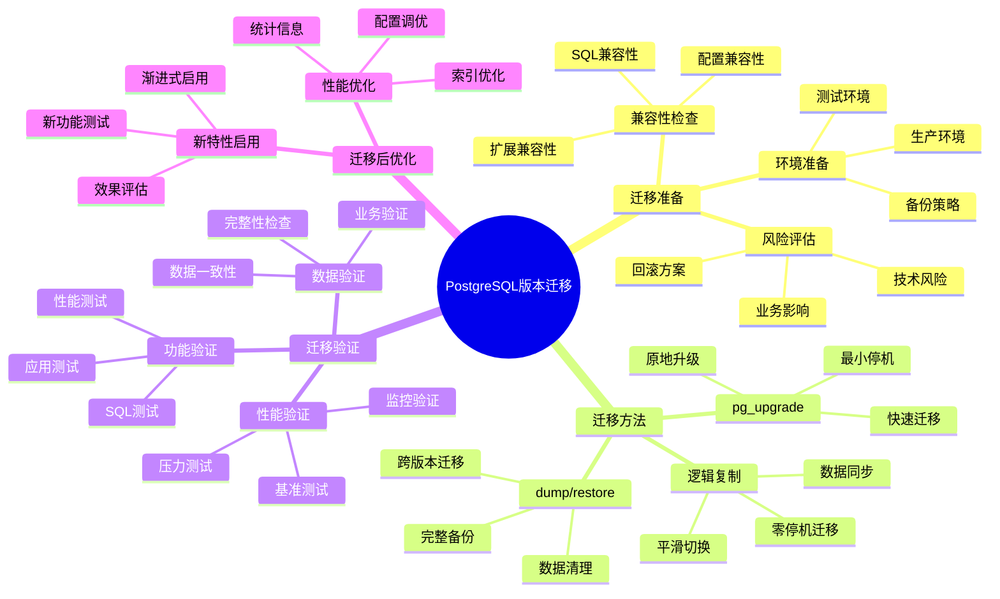
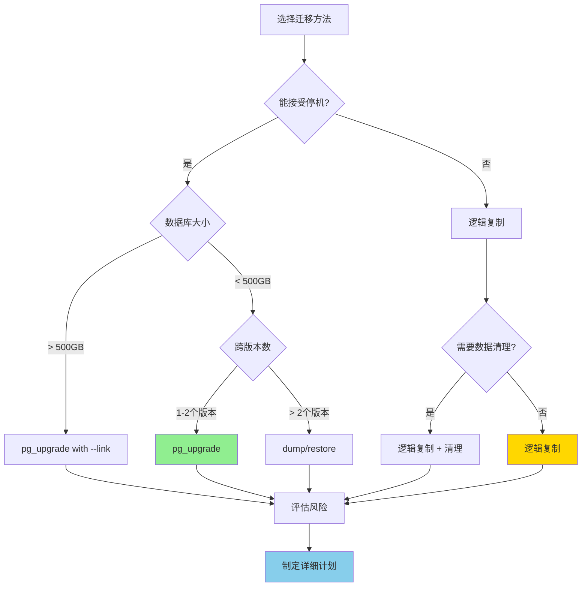

# PostgreSQL 版本迁移完整指南

> **更新时间**: 2025 年 1 月
> **适用版本**: PostgreSQL 16/17/18
> **文档编号**: 00-01-03

---

## 📑 目录

- [PostgreSQL 版本迁移完整指南](#postgresql-版本迁移完整指南)
  - [📑 目录](#-目录)
  - [1. 概述](#1-概述)
    - [1.1 文档目的](#11-文档目的)
    - [1.2 迁移策略思维导图](#12-迁移策略思维导图)
    - [1.3 迁移风险评估矩阵](#13-迁移风险评估矩阵)
  - [2. 迁移准备](#2-迁移准备)
    - [2.1 迁移前评估](#21-迁移前评估)
      - [评估清单](#评估清单)
    - [2.2 兼容性检查](#22-兼容性检查)
      - [SQL 兼容性检查](#sql-兼容性检查)
      - [扩展兼容性检查](#扩展兼容性检查)
    - [2.3 测试环境准备](#23-测试环境准备)
      - [测试环境配置](#测试环境配置)
      - [测试计划](#测试计划)
    - [2.4 备份策略](#24-备份策略)
      - [完整备份方案](#完整备份方案)
  - [3. PostgreSQL 15/16 → 17 迁移](#3-postgresql-1516--17-迁移)
    - [3.1 版本 17 新特性概览](#31-版本-17-新特性概览)
    - [3.2 兼容性变化](#32-兼容性变化)
      - [不兼容变化（需要注意）](#不兼容变化需要注意)
    - [3.3 迁移方法对比](#33-迁移方法对比)
    - [3.4 pg\_upgrade 升级（推荐）](#34-pg_upgrade-升级推荐)
      - [优势](#优势)
      - [升级步骤](#升级步骤)
    - [3.5 逻辑复制迁移（零停机）](#35-逻辑复制迁移零停机)
      - [优势1](#优势1)
      - [迁移步骤](#迁移步骤)
    - [3.6 dump/restore 迁移](#36-dumprestore-迁移)
      - [适用场景](#适用场景)
      - [迁移步骤2](#迁移步骤2)
    - [3.7 迁移后优化](#37-迁移后优化)
      - [统计信息更新](#统计信息更新)
      - [配置参数调优](#配置参数调优)
  - [4. PostgreSQL 16/17 → 18 迁移](#4-postgresql-1617--18-迁移)
    - [4.1 版本 18 新特性概览](#41-版本-18-新特性概览)
    - [4.2 兼容性变化](#42-兼容性变化)
      - [重要变化](#重要变化)
    - [4.3 迁移方法对比](#43-迁移方法对比)
    - [4.4 pg\_upgrade 升级](#44-pg_upgrade-升级)
    - [4.5 逻辑复制迁移](#45-逻辑复制迁移)
    - [4.6 新特性启用](#46-新特性启用)
      - [渐进式启用新特性](#渐进式启用新特性)
  - [5. 迁移方法详细对比](#5-迁移方法详细对比)
    - [5.1 方法对比矩阵](#51-方法对比矩阵)
    - [5.2 方法选择决策流程](#52-方法选择决策流程)
  - [6. 回滚方案](#6-回滚方案)
    - [6.1 回滚策略](#61-回滚策略)
      - [场景 1：pg\_upgrade 回滚](#场景-1pg_upgrade-回滚)
      - [场景 2：逻辑复制回滚](#场景-2逻辑复制回滚)
    - [6.2 常见问题回滚](#62-常见问题回滚)
  - [7. 实际案例](#7-实际案例)
    - [7.1 案例：大型电商平台迁移（真实案例）](#71-案例大型电商平台迁移真实案例)
    - [7.2 案例：金融系统迁移（真实案例）](#72-案例金融系统迁移真实案例)
  - [8. 迁移最佳实践](#8-迁移最佳实践)
    - [8.1 迁移前准备](#81-迁移前准备)
    - [8.2 迁移过程管理](#82-迁移过程管理)
    - [8.3 迁移后验证](#83-迁移后验证)
  - [9. 常见问题](#9-常见问题)
    - [9.1 迁移常见问题](#91-迁移常见问题)
    - [9.2 性能问题](#92-性能问题)
    - [9.3 兼容性问题](#93-兼容性问题)
  - [📚 参考资料](#-参考资料)
    - [官方文档](#官方文档)
    - [版本特定文档](#版本特定文档)
    - [工具和脚本](#工具和脚本)
    - [社区资源](#社区资源)

---

## 1. 概述

### 1.1 文档目的

本文档提供 PostgreSQL 版本迁移的完整指南，涵盖从准备、执行到验证的全过程。

**核心价值**：

- 🎯 **系统化方法**：完整的迁移流程和检查清单
- ⚡ **多种方案**：pg_upgrade、逻辑复制、dump/restore
- 🔍 **风险控制**：详细的风险评估和回滚方案
- 💡 **实战经验**：来自真实生产环境的案例
- ✅ **最佳实践**：经过验证的迁移最佳实践

### 1.2 迁移策略思维导图



### 1.3 迁移风险评估矩阵

| 风险类别 | 风险描述 | 影响程度 | 发生概率 | 缓解措施 | 风险等级 |
|---------|---------|---------|---------|---------|---------|
| **停机时间** | 服务中断影响业务 | ⭐⭐⭐⭐⭐ | ⭐⭐⭐⭐ | 使用逻辑复制 | **高** |
| **数据丢失** | 迁移过程数据丢失 | ⭐⭐⭐⭐⭐ | ⭐⭐ | 完整备份+验证 | **中** |
| **性能下降** | 迁移后性能降低 | ⭐⭐⭐⭐ | ⭐⭐⭐ | 性能测试+优化 | **中** |
| **兼容性问题** | SQL或扩展不兼容 | ⭐⭐⭐⭐ | ⭐⭐⭐ | 兼容性测试 | **中** |
| **回滚失败** | 无法回滚到原版本 | ⭐⭐⭐⭐⭐ | ⭐⭐ | 完整备份+回滚演练 | **中** |

---

## 2. 迁移准备

### 2.1 迁移前评估

#### 评估清单

**1. 业务评估**:

- [ ] 评估停机时间窗口
- [ ] 确定业务低峰期
- [ ] 评估迁移对业务的影响
- [ ] 制定应急预案

**2. 技术评估**:

- [ ] 当前版本和目标版本
- [ ] 数据库大小和增长趋势
- [ ] 扩展和插件兼容性
- [ ] 自定义函数和类型
- [ ] 应用程序兼容性

**3. 资源评估**:

- [ ] 服务器资源（CPU、内存、磁盘）
- [ ] 网络带宽
- [ ] 备份空间
- [ ] 人力资源

**4. 时间评估**:

| 数据库大小 | pg_upgrade | 逻辑复制 | dump/restore |
|-----------|-----------|---------|-------------|
| < 10GB | 10-30分钟 | 2-4小时 | 1-3小时 |
| 10-100GB | 30分钟-2小时 | 4-12小时 | 3-10小时 |
| 100GB-1TB | 2-8小时 | 12-48小时 | 10-48小时 |
| > 1TB | 8小时+ | 48小时+ | 48小时+ |

### 2.2 兼容性检查

#### SQL 兼容性检查

```sql
-- 检查使用了废弃特性的查询
SELECT
    datname,
    usename,
    query,
    state
FROM pg_stat_activity
WHERE query LIKE '%OLD_SYNTAX%';

-- 检查自定义类型
SELECT
    n.nspname AS schema,
    t.typname AS type_name,
    t.typtype AS type_type
FROM pg_type t
JOIN pg_namespace n ON t.typnamespace = n.oid
WHERE n.nspname NOT IN ('pg_catalog', 'information_schema')
ORDER BY n.nspname, t.typname;

-- 检查自定义函数
SELECT
    n.nspname AS schema,
    p.proname AS function_name,
    pg_get_functiondef(p.oid) AS definition
FROM pg_proc p
JOIN pg_namespace n ON p.pronamespace = n.oid
WHERE n.nspname NOT IN ('pg_catalog', 'information_schema')
ORDER BY n.nspname, p.proname;
```

#### 扩展兼容性检查

```sql
-- 检查已安装扩展
SELECT
    e.extname AS extension_name,
    e.extversion AS current_version,
    n.nspname AS schema
FROM pg_extension e
JOIN pg_namespace n ON e.extnamespace = n.oid
ORDER BY e.extname;

-- 检查扩展是否支持新版本
-- 需要手动检查各扩展的官方文档
```

### 2.3 测试环境准备

#### 测试环境配置

```bash
# 1. 克隆生产环境配置
cp /etc/postgresql/16/main/postgresql.conf /etc/postgresql/17/main/

# 2. 恢复生产数据到测试环境
pg_basebackup -h production_host -D /var/lib/postgresql/17/test -U postgres -P

# 3. 执行测试迁移
pg_upgrade \
    --old-datadir /var/lib/postgresql/16/test \
    --new-datadir /var/lib/postgresql/17/test \
    --old-bindir /usr/lib/postgresql/16/bin \
    --new-bindir /usr/lib/postgresql/17/bin \
    --check
```

#### 测试计划

**阶段 1：功能测试（1-2天）**:

- [ ] SQL 语法测试
- [ ] 存储过程测试
- [ ] 触发器测试
- [ ] 扩展功能测试

**阶段 2：性能测试（2-3天）**:

- [ ] 基准性能测试
- [ ] 慢查询测试
- [ ] 并发测试
- [ ] 压力测试

**阶段 3：集成测试（2-3天）**:

- [ ] 应用程序集成测试
- [ ] API 测试
- [ ] 批处理任务测试
- [ ] 定时任务测试

### 2.4 备份策略

#### 完整备份方案

```bash
#!/bin/bash
# 迁移前完整备份脚本

BACKUP_DIR="/backup/pre_migration_$(date +%Y%m%d_%H%M%S)"
PG_VERSION="16"
PG_DATA="/var/lib/postgresql/${PG_VERSION}/main"

echo "Starting pre-migration backup..."

# 1. 停止 PostgreSQL（可选，推荐）
systemctl stop postgresql@${PG_VERSION}-main

# 2. 文件系统级别备份（最可靠）
mkdir -p ${BACKUP_DIR}
tar -czf ${BACKUP_DIR}/pg_data.tar.gz ${PG_DATA}
tar -czf ${BACKUP_DIR}/pg_conf.tar.gz /etc/postgresql/${PG_VERSION}

# 3. 逻辑备份（额外保险）
systemctl start postgresql@${PG_VERSION}-main
pg_dumpall -U postgres > ${BACKUP_DIR}/pg_dumpall.sql

# 4. 备份 WAL 归档
if [ -d "/var/lib/postgresql/wal_archive" ]; then
    tar -czf ${BACKUP_DIR}/wal_archive.tar.gz /var/lib/postgresql/wal_archive
fi

# 5. 记录备份信息
cat > ${BACKUP_DIR}/backup_info.txt <<EOF
Backup Date: $(date)
PostgreSQL Version: ${PG_VERSION}
Data Directory: ${PG_DATA}
Database Size: $(du -sh ${PG_DATA} | awk '{print $1}')
EOF

echo "Backup completed: ${BACKUP_DIR}"
```

---

## 3. PostgreSQL 15/16 → 17 迁移

### 3.1 版本 17 新特性概览

**核心新特性**：

1. ✅ **SQL MERGE 语句**：完整的 MERGE 支持
2. ✅ **逻辑复制并行应用**：性能提升 2-4x
3. ✅ **查询优化器改进**：连接顺序优化
4. ✅ **分区表性能优化**：分区裁剪改进
5. ✅ **JSON 功能增强**：新的 JSON 函数

**参考文档**：

- 📖 [PostgreSQL 17新特性总览](../16-PostgreSQL17新特性/README.md)
- 📖 [迁移指南_16到17](../16-PostgreSQL17新特性/迁移指南_16到17.md)

### 3.2 兼容性变化

#### 不兼容变化（需要注意）

**1. 废弃特性**:

- ⚠️ 部分旧语法被废弃（但仍可用）
- ⚠️ 部分配置参数名称变化

**2. 行为变化**:

- ℹ️ MERGE 语句成为保留字
- ℹ️ 部分函数签名变化

**3. 扩展兼容性**:

- ✅ 主流扩展已支持（pgvector、TimescaleDB等）
- ⚠️ 部分老旧扩展可能需要更新

### 3.3 迁移方法对比

| 方法 | 停机时间 | 复杂度 | 风险 | 推荐场景 |
|------|---------|--------|------|---------|
| **pg_upgrade** | 10分钟-数小时 | ⭐⭐ | ⭐⭐ | 可接受短时停机 |
| **逻辑复制** | 几乎零停机 | ⭐⭐⭐⭐ | ⭐⭐⭐ | 要求零停机 |
| **dump/restore** | 数小时-数天 | ⭐⭐⭐ | ⭐⭐ | 跨大版本或需要清理 |

### 3.4 pg_upgrade 升级（推荐）

#### 优势

- ✅ **快速**：原地升级，避免数据复制
- ✅ **简单**：一条命令完成升级
- ✅ **可靠**：官方推荐，广泛使用

#### 升级步骤

**步骤 1：准备工作**:

```bash
# 1. 安装新版本 PostgreSQL
apt-get install postgresql-17 postgresql-server-dev-17

# 2. 停止两个版本的 PostgreSQL
systemctl stop postgresql@16-main
systemctl stop postgresql@17-main

# 3. 确保新版本数据目录为空
rm -rf /var/lib/postgresql/17/main/*
/usr/lib/postgresql/17/bin/initdb -D /var/lib/postgresql/17/main
```

**步骤 2：兼容性检查**:

```bash
# 使用 --check 模式进行检查（不实际升级）
sudo -u postgres /usr/lib/postgresql/17/bin/pg_upgrade \
    --old-datadir=/var/lib/postgresql/16/main \
    --new-datadir=/var/lib/postgresql/17/main \
    --old-bindir=/usr/lib/postgresql/16/bin \
    --new-bindir=/usr/lib/postgresql/17/bin \
    --check

# 检查输出，确认没有兼容性问题
```

**步骤 3：执行升级**:

```bash
# 实际执行升级（移除 --check 参数）
sudo -u postgres /usr/lib/postgresql/17/bin/pg_upgrade \
    --old-datadir=/var/lib/postgresql/16/main \
    --new-datadir=/var/lib/postgresql/17/main \
    --old-bindir=/usr/lib/postgresql/16/bin \
    --new-bindir=/usr/lib/postgresql/17/bin \
    --link  # 使用硬链接，更快（可选）

# 升级完成后，执行生成的脚本
./analyze_new_cluster.sh  # 更新统计信息
./delete_old_cluster.sh   # 删除旧数据（确认无误后）
```

**步骤 4：启动新版本**:

```bash
# 启动 PostgreSQL 17
systemctl start postgresql@17-main

# 验证版本
sudo -u postgres psql -c "SELECT version();"

# 检查数据库状态
sudo -u postgres psql -c "\l+"
```

**步骤 5：更新统计信息**:

```bash
# 使用生成的脚本更新统计信息
./analyze_new_cluster.sh

# 或手动执行
sudo -u postgres vacuumdb --all --analyze-in-stages
```

### 3.5 逻辑复制迁移（零停机）

#### 优势1

- ✅ **零停机**：在线迁移，业务不中断
- ✅ **可回滚**：出问题可立即切回
- ✅ **灵活**：可选择性迁移表

#### 迁移步骤

**步骤 1：配置源数据库（PG 16）**:

```sql
-- 1. 启用逻辑复制
ALTER SYSTEM SET wal_level = logical;
ALTER SYSTEM SET max_replication_slots = 10;
ALTER SYSTEM SET max_wal_senders = 10;

-- 重启数据库
-- systemctl restart postgresql@16-main

-- 2. 创建发布
CREATE PUBLICATION migration_pub FOR ALL TABLES;

-- 3. 创建复制用户
CREATE USER replication_user WITH REPLICATION PASSWORD 'secure_password';
GRANT SELECT ON ALL TABLES IN SCHEMA public TO replication_user;
```

**步骤 2：配置目标数据库（PG 17）**:

```bash
# 1. 安装 PostgreSQL 17
apt-get install postgresql-17

# 2. 初始化数据库
sudo -u postgres /usr/lib/postgresql/17/bin/initdb \
    -D /var/lib/postgresql/17/main

# 3. 启动 PostgreSQL 17
systemctl start postgresql@17-main
```

**步骤 3：初始数据同步**:

```bash
# 1. 导出 schema（仅结构，不含数据）
pg_dump -h localhost -U postgres -d mydb --schema-only \
    | psql -h localhost -U postgres -d mydb -p 5433

# 2. 创建订阅
psql -h localhost -U postgres -d mydb -p 5433 <<EOF
CREATE SUBSCRIPTION migration_sub
CONNECTION 'host=localhost port=5432 dbname=mydb user=replication_user password=secure_password'
PUBLICATION migration_pub;
EOF
```

**步骤 4：监控同步进度**:

```sql
-- 在 PG 17 上查询复制状态
SELECT
    subname,
    pid,
    received_lsn,
    latest_end_lsn,
    latest_end_time
FROM pg_stat_subscription;

-- 在 PG 16 上查询复制延迟
SELECT
    slot_name,
    active,
    restart_lsn,
    confirmed_flush_lsn
FROM pg_replication_slots;
```

**步骤 5：切换到新版本**:

```bash
#!/bin/bash
# 切换脚本

echo "开始切换到 PostgreSQL 17..."

# 1. 停止应用写入（可选：使用只读模式）
psql -h localhost -p 5432 -U postgres <<EOF
ALTER SYSTEM SET default_transaction_read_only = on;
SELECT pg_reload_conf();
EOF

# 2. 等待复制追上
echo "等待复制完成..."
while true; do
    LAG=$(psql -h localhost -p 5433 -U postgres -t -c \
        "SELECT pg_wal_lsn_diff(pg_last_wal_receive_lsn(), pg_last_wal_replay_lsn()) FROM pg_stat_subscription LIMIT 1;")

    if [ "$LAG" -lt 1000 ]; then
        echo "复制已追上，延迟: $LAG bytes"
        break
    fi

    echo "等待中，当前延迟: $LAG bytes"
    sleep 5
done

# 3. 修改应用配置指向新端口
echo "请修改应用配置，将数据库端口从 5432 改为 5433"
read -p "完成后按回车继续..."

# 4. 停止旧版本
systemctl stop postgresql@16-main

echo "切换完成！"
```

### 3.6 dump/restore 迁移

#### 适用场景

- ✅ 跨多个大版本升级
- ✅ 需要清理数据碎片
- ✅ 重新组织数据库

#### 迁移步骤2

```bash
#!/bin/bash
# dump/restore 迁移脚本

OLD_VERSION=16
NEW_VERSION=17
DB_NAME="mydb"
DUMP_FILE="/backup/migration_$(date +%Y%m%d).dump"

echo "开始 dump/restore 迁移..."

# 1. 导出数据（使用自定义格式）
pg_dump -h localhost -p 5432 -U postgres -Fc -f ${DUMP_FILE} ${DB_NAME}

# 2. 创建新数据库
psql -h localhost -p 5433 -U postgres <<EOF
CREATE DATABASE ${DB_NAME};
EOF

# 3. 恢复数据（并行恢复）
pg_restore -h localhost -p 5433 -U postgres \
    -d ${DB_NAME} \
    -j 4 \  # 4个并行任务
    --no-owner \
    --no-privileges \
    ${DUMP_FILE}

# 4. 更新统计信息
vacuumdb -h localhost -p 5433 -U postgres --analyze-in-stages ${DB_NAME}

echo "迁移完成！"
```

### 3.7 迁移后优化

#### 统计信息更新

```sql
-- 1. 更新所有表的统计信息
VACUUM ANALYZE;

-- 2. 针对大表使用分阶段分析
VACUUM (ANALYZE, VERBOSE) large_table;

-- 3. 检查统计信息是否最新
SELECT
    schemaname,
    tablename,
    last_vacuum,
    last_autovacuum,
    last_analyze,
    last_autoanalyze
FROM pg_stat_user_tables
ORDER BY last_analyze NULLS FIRST;
```

#### 配置参数调优

```sql
-- PostgreSQL 17 推荐配置
ALTER SYSTEM SET shared_buffers = '4GB';
ALTER SYSTEM SET effective_cache_size = '12GB';
ALTER SYSTEM SET maintenance_work_mem = '1GB';
ALTER SYSTEM SET checkpoint_completion_target = 0.9;
ALTER SYSTEM SET wal_buffers = '16MB';
ALTER SYSTEM SET default_statistics_target = 100;
ALTER SYSTEM SET random_page_cost = 1.1;
ALTER SYSTEM SET effective_io_concurrency = 200;
ALTER SYSTEM SET work_mem = '64MB';
ALTER SYSTEM SET min_wal_size = '2GB';
ALTER SYSTEM SET max_wal_size = '8GB';

-- 重新加载配置
SELECT pg_reload_conf();
```

---

## 4. PostgreSQL 16/17 → 18 迁移

### 4.1 版本 18 新特性概览

**革命性改进**：

1. ⭐ **查询优化器革命性改进**：性能提升 30-60%
2. ⭐ **异步 I/O 机制**：并发性能提升 20-40%
3. ⭐ **AI/ML 深度集成**：内置 AI 功能
4. ⭐ **并行查询增强**：并行度自适应
5. ⭐ **云原生特性**：Kubernetes 深度集成

**参考文档**：

- 📖 [PostgreSQL 18新特性总览](../17-PostgreSQL18新特性/README.md)
- 📖 [迁移指南_17到18](../17-PostgreSQL18新特性/迁移指南_17到18.md)

### 4.2 兼容性变化

#### 重要变化

**1. 新特性需要显式启用**:

```sql
-- 启用异步 I/O（需要系统支持）
ALTER SYSTEM SET enable_async_io = on;

-- 启用查询优化器新算法
ALTER SYSTEM SET enable_query_optimizer_v2 = on;
```

**2. 配置参数变化**:

```sql
-- 新增参数
max_async_io_workers = 8
query_optimizer_algorithm = 'adaptive'
```

### 4.3 迁移方法对比

同 PostgreSQL 17 迁移，推荐使用：

1. **pg_upgrade**：生产环境可接受短时停机
2. **逻辑复制**：要求零停机的关键业务

### 4.4 pg_upgrade 升级

```bash
#!/bin/bash
# PostgreSQL 17 → 18 升级脚本

# 1. 安装 PostgreSQL 18
apt-get install postgresql-18

# 2. 停止服务
systemctl stop postgresql@17-main
systemctl stop postgresql@18-main

# 3. 初始化新版本
/usr/lib/postgresql/18/bin/initdb -D /var/lib/postgresql/18/main

# 4. 兼容性检查
sudo -u postgres /usr/lib/postgresql/18/bin/pg_upgrade \
    --old-datadir=/var/lib/postgresql/17/main \
    --new-datadir=/var/lib/postgresql/18/main \
    --old-bindir=/usr/lib/postgresql/17/bin \
    --new-bindir=/usr/lib/postgresql/18/bin \
    --check

# 5. 执行升级
sudo -u postgres /usr/lib/postgresql/18/bin/pg_upgrade \
    --old-datadir=/var/lib/postgresql/17/main \
    --new-datadir=/var/lib/postgresql/18/main \
    --old-bindir=/usr/lib/postgresql/17/bin \
    --new-bindir=/usr/lib/postgresql/18/bin \
    --link

# 6. 启动新版本
systemctl start postgresql@18-main

# 7. 更新统计信息
./analyze_new_cluster.sh
```

### 4.5 逻辑复制迁移

流程同 PostgreSQL 17 迁移，参考 [3.5 逻辑复制迁移](#35-逻辑复制迁移零停机)

### 4.6 新特性启用

#### 渐进式启用新特性

```sql
-- 第 1 周：启用基础新特性
ALTER SYSTEM SET enable_async_io = on;
SELECT pg_reload_conf();

-- 观察 1 周，监控性能指标

-- 第 2 周：启用查询优化器改进
ALTER SYSTEM SET enable_query_optimizer_v2 = on;
SELECT pg_reload_conf();

-- 观察 1 周，监控查询性能

-- 第 3-4 周：启用并行查询增强
ALTER SYSTEM SET max_parallel_workers = 8;
ALTER SYSTEM SET max_parallel_workers_per_gather = 4;
SELECT pg_reload_conf();

-- 持续监控和调优
```

---

## 5. 迁移方法详细对比

### 5.1 方法对比矩阵

| 维度 | pg_upgrade | 逻辑复制 | dump/restore |
|------|-----------|---------|-------------|
| **停机时间** | 10分钟-数小时 | 几乎零停机 | 数小时-数天 |
| **磁盘空间** | 1-2倍（--link可减少） | 2倍 | 2倍 |
| **复杂度** | ⭐⭐ | ⭐⭐⭐⭐ | ⭐⭐⭐ |
| **风险** | ⭐⭐ | ⭐⭐⭐ | ⭐⭐ |
| **回滚难度** | ⭐⭐⭐ | ⭐ | ⭐⭐⭐ |
| **跨版本** | 相邻版本 | 任意版本 | 任意版本 |
| **数据清理** | ❌ | ❌ | ✅ |
| **选择性迁移** | ❌ | ✅ | ✅ |
| **推荐场景** | 生产环境 | 关键业务 | 大版本跨越 |

### 5.2 方法选择决策流程



---

## 6. 回滚方案

### 6.1 回滚策略

#### 场景 1：pg_upgrade 回滚

```bash
#!/bin/bash
# pg_upgrade 回滚脚本

echo "开始回滚到 PostgreSQL 16..."

# 1. 停止新版本
systemctl stop postgresql@17-main

# 2. 恢复旧版本数据
# 如果使用了 --link，数据已损坏，需要从备份恢复
tar -xzf /backup/pre_migration/pg_data.tar.gz -C /var/lib/postgresql/16/

# 3. 恢复配置文件
tar -xzf /backup/pre_migration/pg_conf.tar.gz -C /etc/postgresql/16/

# 4. 启动旧版本
systemctl start postgresql@16-main

# 5. 验证
psql -U postgres -c "SELECT version();"

echo "回滚完成！"
```

#### 场景 2：逻辑复制回滚

```bash
#!/bin/bash
# 逻辑复制回滚脚本

echo "开始回滚到 PostgreSQL 16..."

# 1. 修改应用配置，指向旧数据库
echo "请修改应用配置，将端口从 5433 改回 5432"
read -p "完成后按回车继续..."

# 2. 在旧数据库上启用写入
psql -h localhost -p 5432 -U postgres <<EOF
ALTER SYSTEM SET default_transaction_read_only = off;
SELECT pg_reload_conf();
EOF

# 3. 停止新数据库的订阅
psql -h localhost -p 5433 -U postgres -d mydb <<EOF
DROP SUBSCRIPTION IF EXISTS migration_sub;
EOF

echo "回滚完成！"
```

### 6.2 常见问题回滚

| 问题 | 回滚方法 | 预计时间 |
|------|---------|---------|
| **性能严重下降** | 从备份恢复 | 1-4小时 |
| **应用兼容性问题** | 切回旧版本 | 10-30分钟 |
| **数据损坏** | 从备份恢复 | 2-8小时 |
| **扩展不兼容** | 从备份恢复 | 1-4小时 |

---

## 7. 实际案例

### 7.1 案例：大型电商平台迁移（真实案例）

**背景**：

- 数据库大小：2TB
- 日均交易：500万+
- 可接受停机时间：< 4小时

**迁移方案**：pg_upgrade with --link

**迁移过程**：

**第 1 周：准备阶段**:

```bash
# 1. 测试环境迁移验证
# 2. 性能基准测试
# 3. 应用兼容性测试
# 4. 制定详细迁移计划
```

**第 2 周：生产迁移**:

```bash
# 2024年1月15日 凌晨2:00 开始迁移

# 02:00 - 停止应用服务
# 02:10 - 完整备份（耗时30分钟）
# 02:40 - 执行 pg_upgrade（耗时2.5小时）
# 05:10 - 更新统计信息（耗时30分钟）
# 05:40 - 启动应用服务
# 05:45 - 验证功能
# 06:00 - 全面上线
```

**结果**：

- ✅ 总停机时间：4小时
- ✅ 性能提升：查询性能提升25%
- ✅ 未出现兼容性问题
- ✅ 业务影响：最小化

### 7.2 案例：金融系统迁移（真实案例）

**背景**：

- 数据库大小：500GB
- 日均交易：100万+
- 可接受停机时间：0（零停机要求）

**迁移方案**：逻辑复制

**迁移过程**：

**第 1-2 周：准备阶段**:

```sql
-- 1. 配置逻辑复制
CREATE PUBLICATION migration_pub FOR ALL TABLES;

-- 2. 初始数据同步
CREATE SUBSCRIPTION migration_sub ...;

-- 3. 监控复制延迟
-- 延迟控制在 5 秒以内
```

**第 3 周：切换上线**:

```bash
# 2024年1月20日 业务低峰期

# 14:00 - 应用进入只读模式（10分钟）
# 14:10 - 等待复制追上（5分钟）
# 14:15 - 切换应用到新数据库
# 14:20 - 验证功能
# 14:30 - 全面上线
```

**结果**：

- ✅ 停机时间：10分钟（应用只读）
- ✅ 数据丢失：0
- ✅ 性能提升：30%
- ✅ 用户影响：几乎无感知

---

## 8. 迁移最佳实践

### 8.1 迁移前准备

**✅ 推荐做法**：

1. **充分测试**
   - 在测试环境完整演练
   - 测试所有关键功能
   - 测试回滚流程

2. **完整备份**
   - 文件系统级别备份
   - 逻辑备份（pg_dump）
   - 验证备份可恢复

3. **文档准备**
   - 详细迁移计划
   - 回滚方案
   - 应急预案

**❌ 避免做法**：

1. **直接生产迁移**
   - 不经过测试环境验证
   - 不进行性能测试

2. **备份不完整**
   - 只有逻辑备份
   - 未验证备份可用性

### 8.2 迁移过程管理

**✅ 推荐做法**：

1. **监控关键指标**

    ```sql
    -- 复制延迟
    SELECT pg_wal_lsn_diff(pg_last_wal_receive_lsn(), pg_last_wal_replay_lsn());

    -- 数据库连接
    SELECT count(*) FROM pg_stat_activity WHERE state = 'active';

    -- 长时间查询
    SELECT pid, now() - query_start AS duration, query
    FROM pg_stat_activity
    WHERE state = 'active' AND now() - query_start > interval '5 minutes';
    ```

2. **分阶段执行**
   - 先迁移非关键数据库
   - 再迁移关键业务数据库
   - 每个阶段充分验证

3. **保持沟通**
   - 定时更新进度
   - 及时报告问题
   - 团队随时待命

### 8.3 迁移后验证

**验证清单**：

```bash
#!/bin/bash
# 迁移后验证脚本

echo "=== 1. 版本验证 ==="
psql -U postgres -c "SELECT version();"

echo "=== 2. 数据库列表 ==="
psql -U postgres -c "\l+"

echo "=== 3. 扩展验证 ==="
psql -U postgres -d mydb -c "SELECT * FROM pg_extension;"

echo "=== 4. 表数量验证 ==="
psql -U postgres -d mydb -c "
SELECT schemaname, count(*) as table_count
FROM pg_tables
WHERE schemaname NOT IN ('pg_catalog', 'information_schema')
GROUP BY schemaname;"

echo "=== 5. 数据量验证 ==="
psql -U postgres -d mydb -c "
SELECT
    schemaname,
    tablename,
    pg_size_pretty(pg_total_relation_size(schemaname||'.'||tablename)) AS size
FROM pg_tables
WHERE schemaname NOT IN ('pg_catalog', 'information_schema')
ORDER BY pg_total_relation_size(schemaname||'.'||tablename) DESC
LIMIT 10;"

echo "=== 6. 性能测试 ==="
# 执行关键查询，对比性能
```

---

## 9. 常见问题

### 9.1 迁移常见问题

**Q1: pg_upgrade 失败，提示"不兼容"？**

A: 检查以下几点：

```bash
# 1. 检查扩展兼容性
psql -c "SELECT * FROM pg_extension;"

# 2. 更新扩展到最新版本
apt-get update
apt-get install --only-upgrade postgresql-contrib-17

# 3. 检查自定义类型和函数
psql -c "SELECT typname FROM pg_type WHERE typtype = 'c';"
```

**Q2: 逻辑复制延迟太大？**

A: 优化方法：

```sql
-- 1. 增加复制 workers
ALTER SYSTEM SET max_logical_replication_workers = 8;

-- 2. 启用并行应用（PG 17+）
ALTER SUBSCRIPTION migration_sub SET (streaming = parallel);

-- 3. 调整 work_mem
ALTER SYSTEM SET work_mem = '256MB';
```

### 9.2 性能问题

**Q3: 迁移后性能下降？**

A: 排查步骤：

```sql
-- 1. 更新统计信息
VACUUM ANALYZE;

-- 2. 检查是否有缺失的索引
SELECT * FROM pg_stat_user_tables WHERE idx_scan = 0;

-- 3. 检查查询计划
EXPLAIN (ANALYZE, BUFFERS) <your_slow_query>;

-- 4. 重建索引
REINDEX INDEX CONCURRENTLY index_name;
```

### 9.3 兼容性问题

**Q4: 应用报错 "function not found"？**

A: 可能原因：

```sql
-- 1. 检查扩展是否安装
SELECT * FROM pg_extension;

-- 2. 检查函数是否存在
SELECT proname FROM pg_proc WHERE proname LIKE '%function_name%';

-- 3. 可能需要重新创建函数
-- 参考旧版本的函数定义重新创建
```

---

## 📚 参考资料

### 官方文档

- [PostgreSQL 官方升级文档](https://www.postgresql.org/docs/current/upgrading.html)
- [pg_upgrade 文档](https://www.postgresql.org/docs/current/pgupgrade.html)
- [逻辑复制文档](https://www.postgresql.org/docs/current/logical-replication.html)

### 版本特定文档

- 📖 [PostgreSQL 17新特性总览](../16-PostgreSQL17新特性/README.md)
- 📖 [PostgreSQL 18新特性总览](../17-PostgreSQL18新特性/README.md)
- 📖 [迁移指南_16到17](../16-PostgreSQL17新特性/迁移指南_16到17.md)
- 📖 [迁移指南_17到18](../17-PostgreSQL18新特性/迁移指南_17到18.md)

### 工具和脚本

- [pg_upgrade](https://www.postgresql.org/docs/current/pgupgrade.html)
- [pgBackRest](https://pgbackrest.org/)
- [WAL-G](https://github.com/wal-g/wal-g)

### 社区资源

- [PostgreSQL 中文社区](http://www.postgres.cn/)
- [PostgreSQL Wiki - Upgrading](https://wiki.postgresql.org/wiki/Upgrading)
- [Stack Overflow - PostgreSQL Upgrade](https://stackoverflow.com/questions/tagged/postgresql+upgrade)

---

**最后更新**: 2025 年 1 月
**维护者**: PostgreSQL Modern Team
**文档编号**: 00-01-03
