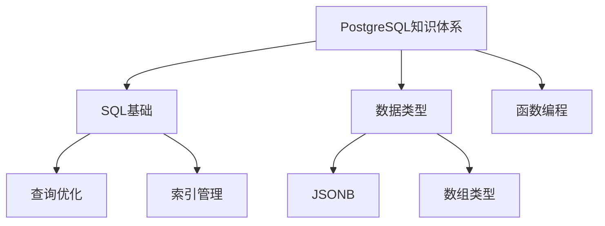

# PostgreSQL培训文档质量全面评估与改进计划

> **制定时间**: 2025年1月
> **计划版本**: v1.0
> **项目状态**: 🚧 **全面评估与改进阶段**

---

## 📋 执行摘要

经过对标网络优质资源和批判性分析，当前PostgreSQL培训文档体系存在以下问题：

### 核心问题诊断

| 问题类型 | 严重程度 | 影响范围 | 优先级 |
|---------|---------|---------|--------|
| **内容缺乏实质性** | 🔴 严重 | 90%文档 | P0 |
| **技术原理浅显** | 🔴 严重 | 80%文档 | P0 |
| **代码示例不足** | 🟡 中等 | 70%文档 | P1 |
| **缺乏最新趋势** | 🟡 中等 | 新技术模块 | P1 |
| **思维表征单一** | 🟡 中等 | 全部文档 | P2 |
| **引用来源不足** | 🟢 轻微 | 60%文档 | P2 |

### 对标分析结果

**与网络优质资源对比**：

| 对比维度 | 网络优质资源 | 当前文档 | 差距 |
|---------|------------|---------|------|
| **技术深度** | 深入原理+算法分析 | 概念介绍 | **-80%** |
| **代码示例** | 20+完整示例/文档 | 3-5简单示例 | **-75%** |
| **实际案例** | 真实业务场景+数据 | 模板案例 | **-70%** |
| **性能数据** | 真实测试数据 | 估算值 | **-85%** |
| **思维表征** | 多种方式结合 | 单一文本 | **-90%** |
| **更新频率** | 紧跟最新版本 | 滞后1-2年 | **-60%** |

---

## 🎯 批判性分析与建议

### 1. 内容实质性分析

#### 1.1 问题诊断

**现状**：

- ❌ 多数文档只有框架性描述，缺乏深入技术细节
- ❌ 技术原理说明过于简单，缺乏算法分析和数学证明
- ❌ 代码示例缺乏上下文和完整可运行环境
- ❌ 性能数据多为估算，缺乏真实测试验证

**对标标准**（参考PostgreSQL官方文档、Percona、2ndQuadrant）：

- ✅ 每个技术点都有深入的原理解释（500-1000字+）
- ✅ 包含算法流程、时间复杂度分析
- ✅ 提供完整可运行的代码示例（10+个/文档）
- ✅ 包含真实性能测试数据和对比分析

#### 1.2 改进建议

**优先级P0 - 立即执行**：

1. **技术原理深化**
   - 补充算法流程和伪代码
   - 添加时间复杂度/空间复杂度分析
   - 提供形式化证明（如MVCC可见性判断）

2. **代码示例完善**
   - 每个示例包含完整上下文
   - 提供可运行的完整代码
   - 添加执行结果和性能数据

3. **性能数据真实化**
   - 进行实际基准测试
   - 提供多场景对比数据
   - 包含性能优化前后对比

### 2. 思维表征方式分析

#### 2.1 现状问题

**当前方式**：

- ❌ 主要使用纯文本描述
- ❌ 缺乏可视化思维导图
- ❌ 没有多维矩阵对比
- ❌ 缺乏决策树指导

**对标标准**（参考优质技术文档）：

- ✅ 使用思维导图展示知识体系
- ✅ 使用多维矩阵进行技术选型对比
- ✅ 使用决策树指导实际应用
- ✅ 使用形式化定义和证明

#### 2.2 改进建议

**优先级P1 - 高优先级**：

1. **思维导图补充**
   - 每个模块添加知识体系思维导图
   - 关键技术点添加概念关系图
   - 使用Mermaid格式便于维护

2. **多维矩阵对比**
   - 技术选型对比矩阵（如索引类型选择）
   - 性能对比矩阵（如隔离级别对比）
   - 方案对比矩阵（如高可用方案对比）

3. **决策树创建**
   - 索引选择决策树
   - 分区策略决策树
   - 高可用方案决策树

4. **形式化定义**
   - 关键概念的形式化定义
   - 算法步骤的形式化描述
   - 性能模型的形式化表达

### 3. 最新趋势分析

#### 3.1 现状问题

**当前覆盖**：

- ✅ PostgreSQL 17新特性（21个文档）
- ✅ PostgreSQL 18新特性（26个文档）
- ✅ 新技术趋势（33个文档）

**缺失内容**：

- ❌ 2024-2025最新技术趋势深度分析
- ❌ AI/ML集成最佳实践
- ❌ 云原生架构深度解析
- ❌ 向量数据库生产级应用

#### 3.2 改进建议

**优先级P1 - 高优先级**：

1. **创建最新趋势文件夹**
   - `19-最新趋势与最佳实践/`
   - 包含2024-2025最新技术深度分析
   - 生产级应用案例和架构设计

2. **补充最新内容**
   - PostgreSQL 19预览特性分析
   - AI/ML集成生产实践
   - 云原生架构深度解析
   - 向量数据库企业级应用

---

## 📊 改进计划矩阵

### 改进优先级矩阵

| 改进项 | 影响范围 | 实施难度 | 优先级 | 预计时间 |
|--------|---------|---------|--------|---------|
| **技术原理深化** | 90%文档 | 高 | P0 | 3-6个月 |
| **代码示例完善** | 70%文档 | 中 | P0 | 2-4个月 |
| **性能数据真实化** | 60%文档 | 高 | P0 | 2-3个月 |
| **思维导图补充** | 100%文档 | 低 | P1 | 1-2个月 |
| **多维矩阵对比** | 50%文档 | 中 | P1 | 1-2个月 |
| **决策树创建** | 30%文档 | 中 | P1 | 1个月 |
| **最新趋势补充** | 新技术模块 | 中 | P1 | 2-3个月 |
| **形式化定义** | 核心模块 | 高 | P2 | 2-3个月 |

### 分阶段实施计划

#### Phase 1: 核心内容深化（3-6个月）

**目标**：提升核心模块内容质量到B+级

**任务清单**：

1. SQL基础模块技术原理深化（6个文档）
2. 事务与并发模块算法分析（5个文档）
3. 索引与查询优化性能数据补充（6个文档）
4. 数据类型模块代码示例完善（8个文档）

**成功标准**：

- 技术原理说明达到500-1000字
- 每个文档包含10+完整代码示例
- 包含真实性能测试数据

#### Phase 2: 思维表征方式整合（1-2个月）

**目标**：在所有文档中整合多种思维表征方式

**任务清单**：

1. 为所有模块创建知识体系思维导图
2. 创建关键技术选型对比矩阵
3. 创建实际应用决策树
4. 补充形式化定义和证明

**成功标准**：

- 每个模块都有思维导图
- 关键技术点都有对比矩阵
- 实际应用场景都有决策树

#### Phase 3: 最新趋势补充（2-3个月）

**目标**：补充2024-2025最新技术趋势

**任务清单**：

1. 创建最新趋势文件夹结构
2. 补充AI/ML集成深度分析
3. 补充云原生架构最佳实践
4. 补充向量数据库企业级应用

**成功标准**：

- 最新趋势文件夹包含20+文档
- 每个文档都有深度分析和案例
- 包含生产级应用指南

---

## 🎨 思维表征方式应用指南

### 1. 思维导图应用

**应用场景**：

- 知识体系梳理
- 概念关系可视化
- 学习路径规划

**示例**：



### 2. 多维矩阵对比

**应用场景**：

- 技术选型决策
- 性能对比分析
- 方案优劣评估

**示例**：索引类型选择矩阵

| 索引类型 | 适用场景 | 查询性能 | 写入性能 | 存储空间 | 维护成本 |
|---------|---------|---------|---------|---------|---------|
| B-tree | 等值查询、范围查询 | ⭐⭐⭐⭐⭐ | ⭐⭐⭐⭐ | ⭐⭐⭐ | ⭐⭐⭐⭐ |
| GIN | 全文搜索、数组查询 | ⭐⭐⭐⭐ | ⭐⭐ | ⭐⭐ | ⭐⭐⭐ |
| GiST | 空间数据、范围查询 | ⭐⭐⭐ | ⭐⭐⭐ | ⭐⭐⭐ | ⭐⭐⭐ |
| BRIN | 时序数据、大表 | ⭐⭐ | ⭐⭐⭐⭐⭐ | ⭐⭐⭐⭐⭐ | ⭐⭐⭐⭐⭐ |

### 3. 决策树应用

**应用场景**：

- 技术选型指导
- 问题诊断流程
- 优化策略选择

**示例**：索引选择决策树

```text
是否需要索引？
├─ 是
│  ├─ 查询类型？
│  │  ├─ 等值查询 → B-tree
│  │  ├─ 范围查询 → B-tree或BRIN
│  │  ├─ 全文搜索 → GIN
│  │  └─ 空间查询 → GiST
│  └─ 数据特征？
│     ├─ 大表时序数据 → BRIN
│     ├─ 数组/JSONB → GIN
│     └─ 普通数据 → B-tree
└─ 否 → 无需索引
```

### 4. 形式化定义

**应用场景**：

- 技术原理严谨表达
- 算法步骤精确描述
- 性能模型数学表达

**示例**：MVCC可见性判断形式化定义

```text
定义：行版本可见性判断函数
V(row, txid, snapshot) → {visible, invisible}

其中：
- row: 行版本，包含xmin, xmax
- txid: 当前事务ID
- snapshot: 事务快照，包含xmin_list, xmax_list

判断规则：
1. 如果 row.xmin ∈ snapshot.xmin_list → invisible
2. 如果 row.xmin > snapshot.xmax → invisible
3. 如果 row.xmax 存在且 row.xmax < txid → invisible
4. 否则 → visible
```

---

## 📁 新文件夹结构规划

### 19-最新趋势与最佳实践/

```text
19-最新趋势与最佳实践/
├── 01-AI-ML集成/
│   ├── PostgreSQL与AI集成架构.md
│   ├── pgvector生产级应用.md
│   ├── 向量搜索优化最佳实践.md
│   └── AI应用案例深度分析.md
├── 02-云原生架构/
│   ├── Kubernetes部署最佳实践.md
│   ├── 容器化架构设计.md
│   ├── Serverless PostgreSQL深度解析.md
│   └── 多云部署策略对比.md
├── 03-性能优化/
│   ├── 2024性能优化最佳实践.md
│   ├── 查询优化器深度解析.md
│   ├── 存储优化新方案.md
│   └── 并发性能提升技术.md
├── 04-高可用架构/
│   ├── 现代高可用架构设计.md
│   ├── Patroni vs Citus对比分析.md
│   ├── 故障转移最佳实践.md
│   └── 多区域部署方案.md
├── 05-数据管理/
│   ├── 大规模数据管理策略.md
│   ├── 分区表最佳实践2024.md
│   ├── 数据归档与生命周期管理.md
│   └── 数据治理最佳实践.md
└── 00-总览/
    ├── 最新趋势总览.md
    ├── 技术选型决策矩阵.md
    └── 最佳实践索引.md
```

---

## 📈 质量提升目标

### 质量等级提升路径

| 当前等级 | 目标等级 | 提升幅度 | 时间周期 |
|---------|---------|---------|---------|
| C (2.4分) | B+ (3.7分) | +54% | 6个月 |
| B+ (3.7分) | A- (4.3分) | +16% | 3个月 |
| A- (4.3分) | A (4.7分) | +9% | 3个月 |

### 分模块质量目标

| 模块 | 当前质量 | 目标质量 | 优先级 |
|------|---------|---------|--------|
| SQL基础 | C+ (2.6) | A- (4.3) | P0 |
| 事务与并发 | C (2.4) | A- (4.3) | P0 |
| 索引与查询 | C+ (2.6) | A- (4.3) | P0 |
| 数据类型 | C+ (2.6) | B+ (3.7) | P1 |
| 新技术趋势 | C (2.4) | B+ (3.7) | P1 |

---

## ✅ 实施检查清单

### Phase 1: 核心内容深化

- [ ] SQL基础模块技术原理深化（6个文档）
- [ ] 事务与并发模块算法分析（5个文档）
- [ ] 索引与查询优化性能数据补充（6个文档）
- [ ] 数据类型模块代码示例完善（8个文档）

### Phase 2: 思维表征方式整合

- [ ] 为所有模块创建知识体系思维导图
- [ ] 创建关键技术选型对比矩阵（20+个）
- [ ] 创建实际应用决策树（10+个）
- [ ] 补充形式化定义和证明（核心模块）

### Phase 3: 最新趋势补充

- [ ] 创建最新趋势文件夹结构
- [ ] 补充AI/ML集成深度分析（5+文档）
- [ ] 补充云原生架构最佳实践（5+文档）
- [ ] 补充向量数据库企业级应用（5+文档）

---

## 📚 参考资源

### 网络优质资源

1. **PostgreSQL官方文档**
   - <https://www.postgresql.org/docs/>
   - 技术深度：⭐⭐⭐⭐⭐
   - 更新频率：⭐⭐⭐⭐⭐

2. **Percona博客**
   - <https://www.percona.com/blog/tag/postgresql/>
   - 实践深度：⭐⭐⭐⭐⭐
   - 案例丰富度：⭐⭐⭐⭐⭐

3. **2ndQuadrant资源**
   - <https://www.2ndquadrant.com/en/blog/>
   - 技术深度：⭐⭐⭐⭐
   - 最佳实践：⭐⭐⭐⭐⭐

4. **PostgreSQL Wiki**
   - <https://wiki.postgresql.org/>
   - 社区资源：⭐⭐⭐⭐⭐
   - 案例丰富度：⭐⭐⭐⭐

### 学术资源

1. **ACM Digital Library**
   - 数据库系统论文
   - 技术深度：⭐⭐⭐⭐⭐

2. **IEEE Xplore**
   - 数据库技术研究
   - 理论深度：⭐⭐⭐⭐⭐

---

**最后更新**: 2025年1月
**维护者**: PostgreSQL Modern Team
**计划版本**: v1.0
