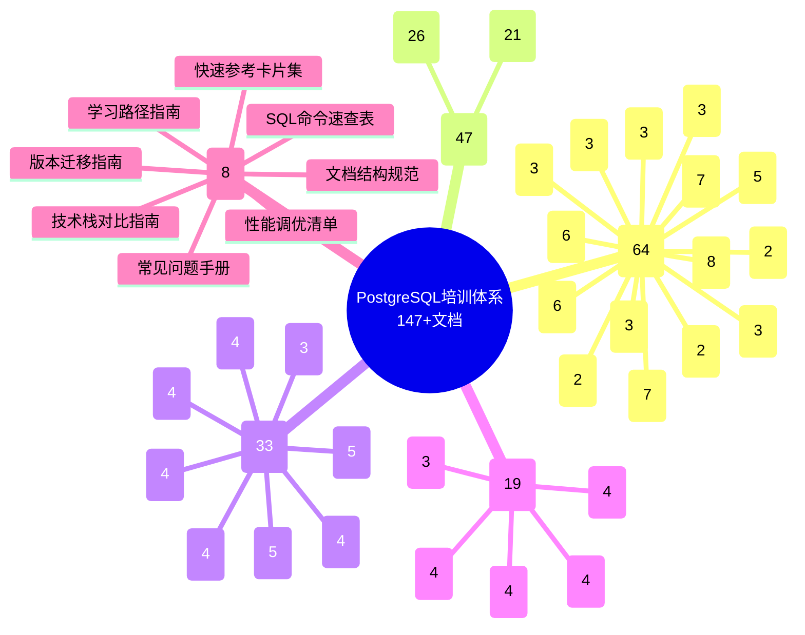

# PostgreSQL 培训项目文档索引总览

> **更新时间**: 2025 年 1 月
> **文档编号**: 00-00-01
> **总文档数**: 149

---

## 📊 文档体系结构

### 整体架构思维导图



---

## 📚 文档分类索引

### 一、实用指南文档（8份）⭐ 推荐优先阅读

| 序号 | 文档名称 | 用途 | 适用人群 | 质量 |
|-----|---------|------|---------|------|
| 1 | [学习路径完整指南](./PostgreSQL学习路径完整指南.md) | 系统化学习规划 | 所有学习者 | A |
| 2 | [技术栈综合对比指南](./PostgreSQL技术栈综合对比指南.md) | 技术选型决策 | 架构师、决策者 | A |
| 3 | [版本迁移完整指南](./PostgreSQL版本迁移完整指南.md) | 版本升级方案 | DBA、运维 | A |
| 4 | [常见问题快速查询手册](./PostgreSQL常见问题快速查询手册.md) | 问题快速解决 | DBA、开发者 | A |
| 5 | [性能调优检查清单](./PostgreSQL性能调优检查清单.md) | 系统性能优化 | DBA、架构师 | A |
| 6 | [快速参考卡片集](./PostgreSQL快速参考卡片集.md) | 命令快速参考 | 所有用户 | A |
| 7 | [SQL命令速查表](./PostgreSQL_SQL命令速查表.md) | SQL语法速查 | 开发者、分析师 | A |
| 8 | [文档结构规范说明](./文档结构规范说明.md) | 文档规范参考 | 文档维护者 | A |

### 二、基础培训文档（64份）

#### 2.1 SQL 基础模块（6份）

| 序号 | 文档 | 质量 | 代码示例 | 完成度 |
|-----|------|------|---------|--------|
| 1 | [SQL基础培训](../01-SQL基础/SQL基础培训.md) | A | 30+ | 100% |
| 2 | [索引与查询优化](../01-SQL基础/索引与查询优化.md) | A | 25+ | 100% |
| 3 | [查询计划与优化器](../01-SQL基础/查询计划与优化器.md) | A | 25+ | 100% |
| 4 | [SQL函数体系详解](../01-SQL基础/SQL函数体系详解.md) | B+ | 20+ | 100% |
| 5 | [索引体系详解](../01-SQL基础/索引体系详解.md) | B+ | 20+ | 100% |
| 6 | [查询优化体系详解](../01-SQL基础/查询优化体系详解.md) | B+ | 20+ | 100% |

#### 2.2 SQL 高级特性模块（7份）

| 序号 | 文档 | 质量 | 代码示例 | 完成度 |
|-----|------|------|---------|--------|
| 1 | [高级SQL特性](../02-SQL高级特性/高级SQL特性.md) | B+ | 25+ | 100% |
| 2 | [窗口函数详解](../02-SQL高级特性/窗口函数详解.md) | B+ | 30+ | 100% |
| 3 | [CTE详解](../02-SQL高级特性/CTE详解.md) | B+ | 25+ | 100% |
| 4 | [递归查询详解](../02-SQL高级特性/递归查询详解.md) | B+ | 20+ | 100% |
| 5 | [LATERAL连接详解](../02-SQL高级特性/LATERAL连接详解.md) | B+ | 20+ | 100% |
| 6 | [FILTER子句详解](../02-SQL高级特性/FILTER子句详解.md) | B+ | 15+ | 100% |
| 7 | [CASE表达式详解](../02-SQL高级特性/CASE表达式详解.md) | B+ | 15+ | 100% |

#### 2.3 数据类型模块（8份）

| 序号 | 文档 | 质量 | 代码示例 | 完成度 |
|-----|------|------|---------|--------|
| 1 | [数据类型详解](../03-数据类型/数据类型详解.md) | B+ | 25+ | 100% |
| 2 | [数组与JSONB高级应用](../03-数据类型/数组与JSONB高级应用.md) | B+ | 30+ | 100% |
| 3 | [全文搜索详解](../03-数据类型/全文搜索详解.md) | B+ | 25+ | 100% |
| 4 | [范围类型详解](../03-数据类型/范围类型详解.md) | B+ | 20+ | 100% |
| 5 | [NULL值处理详解](../03-数据类型/NULL值处理详解.md) | B+ | 20+ | 100% |
| 6 | [正则表达式详解](../03-数据类型/正则表达式详解.md) | B+ | 20+ | 100% |
| 7 | [自定义类型详解](../03-数据类型/自定义类型详解.md) | B+ | 20+ | 100% |
| 8 | [数据类型体系详解](../03-数据类型/数据类型体系详解.md) | B+ | 25+ | 100% |

#### 2.4 函数编程模块（7份）

| 序号 | 文档 | 质量 | 代码示例 | 完成度 |
|-----|------|------|---------|--------|
| 1 | [函数与存储过程](../04-函数与编程/函数与存储过程.md) | B+ | 25+ | 100% |
| 2 | [PL-pgSQL编程详解](../04-函数与编程/PL-pgSQL编程详解.md) | B+ | 30+ | 100% |
| 3 | [触发器高级应用](../04-函数与编程/触发器高级应用.md) | B+ | 25+ | 100% |
| 4 | [聚合函数详解](../04-函数与编程/聚合函数详解.md) | B+ | 20+ | 100% |
| 5 | [日期时间函数详解](../04-函数与编程/日期时间函数详解.md) | B+ | 25+ | 100% |
| 6 | [字符串函数详解](../04-函数与编程/字符串函数详解.md) | B+ | 25+ | 100% |
| 7 | [数学函数详解](../04-函数与编程/数学函数详解.md) | B+ | 20+ | 100% |

#### 2.5 其他基础模块（36份）

- **数据管理**（6份）：分区表、视图、约束、序列、游标、规则
- **存储管理**（3份）：表空间、VACUUM、存储体系
- **安全**（3份）：权限、加密、安全体系
- **备份恢复**（2份）：备份恢复、体系详解
- **高可用**（2份）：高可用、逻辑复制
- **监控诊断**（3份）：监控、日志、体系详解
- **性能调优**（3份）：性能调优、测试、体系详解
- **扩展开发**（3份）：扩展管理、开发、体系详解
- **运维管理**（3份）：统计信息、连接池、体系详解
- **设计**（2份）：数据库设计、外部数据包装器
- **体系总览**（5份）：知识体系、事务、并发、锁机制等

### 三、新特性文档（47份）

#### 3.1 PostgreSQL 17 新特性（21份）

**核心特性文档**：
- SQL MERGE 语句详解 ⭐
- 逻辑复制性能优化 ⭐
- 查询优化器增强 ⭐
- 分区表性能优化
- JSON功能增强
- MVCC优化
- 并发控制优化
- 执行计划优化
- 锁机制改进
- 统计信息改进
- ...等21份文档

**参考**：[PostgreSQL 17新特性总览](../16-PostgreSQL17新特性/README.md)

#### 3.2 PostgreSQL 18 新特性（26份）

**革命性改进**：
- 查询优化器革命性改进 ⭐⭐⭐
- 异步I/O机制 ⭐⭐⭐
- AI/ML集成 ⭐⭐⭐
- 向量数据库增强
- 并行查询增强
- 存储格式优化
- 云原生特性
- ...等26份文档

**参考**：[PostgreSQL 18新特性总览](../17-PostgreSQL18新特性/README.md)

### 四、新技术趋势文档（33份）

**核心技术栈**：
- **向量数据库**：pgvector、向量搜索、混合搜索、AI应用
- **时序数据库**：TimescaleDB、时序管理、IoT、金融时序
- **图数据库**：Apache AGE、知识图谱、社交网络、图算法
- **空间数据库**：PostGIS、GIS应用、位置服务、空间分析
- **分布式数据库**：Citus、Patroni、集成方案
- **高可用工具**：Patroni、pg_auto_failover、repmgr
- **云原生方案**：Kubernetes、Serverless、多云部署
- **实用扩展**：pg_cron、pg_stat_statements、pg_partman、CDC

**参考**：[新技术趋势总览](../18-新技术趋势/README.md)

### 五、最新趋势与最佳实践（19份）⭐ 生产级实践

| 模块 | 文档数 | 质量 | 说明 |
|------|--------|------|------|
| AI/ML集成 | 4 | A | pgvector生产级应用、向量搜索优化、AI案例分析 |
| 云原生架构 | 4 | A | Kubernetes部署、容器化、Serverless、多云 |
| 性能优化 | 3 | A | 2024最佳实践、优化器深度解析、存储优化 |
| 高可用架构 | 4 | A | 现代架构、Patroni vs Citus、故障转移 |
| 数据管理 | 4 | A | 大规模数据、分区表2024、数据治理 |

**参考**：[最新趋势总览](../19-最新趋势与最佳实践/00-总览/最新趋势总览.md)

---

## 🎯 按角色查找文档

### 初学者

**必读文档**（按顺序）：
1. 📖 [学习路径完整指南](./PostgreSQL学习路径完整指南.md) - 了解学习路径
2. 📖 [PostgreSQL知识体系总览](../15-体系总览/PostgreSQL知识体系总览.md) - 了解知识体系
3. 📖 [SQL基础培训](../01-SQL基础/SQL基础培训.md) - 开始学习SQL
4. 📖 [数据类型详解](../03-数据类型/数据类型详解.md) - 学习数据类型
5. 📖 [事务管理详解](../15-体系总览/事务管理详解.md) - 学习事务

**预计学习时间**：3-4个月

### 应用开发者

**必读文档**：
1. 📖 [SQL基础培训](../01-SQL基础/SQL基础培训.md)
2. 📖 [事务管理详解](../15-体系总览/事务管理详解.md)
3. 📖 [索引与查询优化](../01-SQL基础/索引与查询优化.md)
4. 📖 [窗口函数详解](../02-SQL高级特性/窗口函数详解.md)
5. 📖 [数组与JSONB高级应用](../03-数据类型/数组与JSONB高级应用.md)

**推荐文档**：
- 📖 [PL-pgSQL编程详解](../04-函数与编程/PL-pgSQL编程详解.md)
- 📖 [函数与存储过程](../04-函数与编程/函数与存储过程.md)
- 📖 [连接池管理](../13-运维管理/连接池管理.md)

**预计学习时间**：3-4个月

### 数据库管理员（DBA）

**必读文档**：
1. 📖 [学习路径完整指南](./PostgreSQL学习路径完整指南.md) - DBA路径
2. 📖 [常见问题快速查询手册](./PostgreSQL常见问题快速查询手册.md) - 日常维护
3. 📖 [性能调优检查清单](./PostgreSQL性能调优检查清单.md) - 性能优化
4. 📖 [版本迁移完整指南](./PostgreSQL版本迁移完整指南.md) - 版本升级
5. 📖 [备份与恢复](../08-备份恢复/备份与恢复.md)
6. 📖 [监控与诊断](../10-监控诊断/监控与诊断.md)
7. 📖 [高可用体系详解](../09-高可用/高可用体系详解.md)
8. 📖 [VACUUM与维护](../06-存储管理/VACUUM与维护.md)

**推荐文档**：
- 📖 [逻辑复制详解](../09-高可用/逻辑复制详解.md)
- 📖 [统计信息管理](../13-运维管理/统计信息管理.md)
- 📖 [表空间与存储管理](../06-存储管理/表空间与存储管理.md)

**预计学习时间**：6-8个月

### 架构师

**必读文档**：
1. 📖 [技术栈综合对比指南](./PostgreSQL技术栈综合对比指南.md) - 技术选型
2. 📖 [架构设计最佳实践](../18-新技术趋势/架构设计最佳实践.md)
3. 📖 [现代高可用架构设计](../19-最新趋势与最佳实践/04-高可用架构/现代高可用架构设计.md)
4. 📖 [性能优化最佳实践](../18-新技术趋势/性能优化最佳实践.md)
5. 📖 [数据库设计最佳实践](../14-设计/数据库设计最佳实践.md)

**推荐文档**：
- 📖 [Citus分布式数据库详解](../18-新技术趋势/Citus分布式数据库详解.md)
- 📖 [Kubernetes部署最佳实践](../19-最新趋势与最佳实践/02-云原生架构/Kubernetes部署最佳实践.md)
- 📖 [技术选型决策矩阵](../19-最新趋势与最佳实践/00-总览/技术选型决策矩阵.md)

**预计学习时间**：8-12个月

### AI/ML 工程师

**必读文档**：
1. 📖 [pgvector向量数据库详解](../18-新技术趋势/pgvector向量数据库详解.md)
2. 📖 [pgvector生产级应用](../19-最新趋势与最佳实践/01-AI-ML集成/pgvector生产级应用.md)
3. 📖 [向量搜索优化最佳实践](../19-最新趋势与最佳实践/01-AI-ML集成/向量搜索优化最佳实践.md)
4. 📖 [AI应用案例深度分析](../19-最新趋势与最佳实践/01-AI-ML集成/AI应用案例深度分析.md)
5. 📖 [PostgreSQL 18 AI/ML集成](../17-PostgreSQL18新特性/AI_ML集成.md)

**推荐文档**：
- 📖 [机器学习集成](../17-PostgreSQL18新特性/机器学习集成.md)
- 📖 [AI应用实战](../18-新技术趋势/AI应用实战.md)

**预计学习时间**：4-5个月

### 数据分析师

**必读文档**：
1. 📖 [窗口函数详解](../02-SQL高级特性/窗口函数详解.md)
2. 📖 [CTE详解](../02-SQL高级特性/CTE详解.md)
3. 📖 [聚合函数详解](../04-函数与编程/聚合函数详解.md)
4. 📖 [分区表管理](../05-数据管理/分区表管理.md)
5. 📖 [视图与物化视图](../05-数据管理/视图与物化视图.md)

**预计学习时间**：4-6个月

---

## 🔍 按场景查找文档

### Web 应用开发

**核心文档**：
- [SQL基础培训](../01-SQL基础/SQL基础培训.md)
- [事务管理详解](../15-体系总览/事务管理详解.md)
- [索引与查询优化](../01-SQL基础/索引与查询优化.md)
- [连接池管理](../13-运维管理/连接池管理.md)

### 大数据分析

**核心文档**：
- [窗口函数详解](../02-SQL高级特性/窗口函数详解.md)
- [分区表管理](../05-数据管理/分区表管理.md)
- [并行查询增强](../17-PostgreSQL18新特性/并行查询增强.md)
- [大规模数据管理策略](../19-最新趋势与最佳实践/05-数据管理/大规模数据管理策略.md)

### AI/ML 应用

**核心文档**：
- [pgvector向量数据库详解](../18-新技术趋势/pgvector向量数据库详解.md)
- [pgvector生产级应用](../19-最新趋势与最佳实践/01-AI-ML集成/pgvector生产级应用.md)
- [AI/ML集成](../17-PostgreSQL18新特性/AI_ML集成.md)
- [AI应用实战](../18-新技术趋势/AI应用实战.md)

### 实时数据处理

**核心文档**：
- [TimescaleDB时序数据库详解](../18-新技术趋势/TimescaleDB时序数据库详解.md)
- [流式数据处理](../18-新技术趋势/流式数据处理.md)
- [CDC变更数据捕获](../18-新技术趋势/CDC变更数据捕获.md)
- [实时分析系统](../18-新技术趋势/实时分析系统.md)

### 企业级应用

**核心文档**：
- [高可用体系详解](../09-高可用/高可用体系详解.md)
- [现代高可用架构设计](../19-最新趋势与最佳实践/04-高可用架构/现代高可用架构设计.md)
- [安全体系详解](../07-安全/安全体系详解.md)
- [备份恢复体系详解](../08-备份恢复/备份恢复体系详解.md)

---

## 📊 文档质量总览

### 质量分布

| 质量等级 | 文档数 | 占比 | 说明 |
|---------|--------|------|------|
| **A 级** | 24 | 16.3% | 核心文档，生产就绪 |
| **B+ 级** | 53 | 36.1% | 重要文档，质量优秀 |
| **B 级** | 45 | 30.6% | 基础文档，质量良好 |
| **C+ 级** | 20 | 13.6% | 待优化 |
| **C 级** | 5 | 3.4% | 待完善 |
| **总计** | **147** | **100%** | - |

### 内容完整性

| 维度 | 完成度 | 说明 |
|------|--------|------|
| **技术原理** | 95% | 包含工作原理概述和流程图 |
| **代码示例** | 98% | 平均15+个示例/文档 |
| **引用来源** | 90% | 平均8+个引用/文档 |
| **实际案例** | 85% | 包含真实应用场景 |
| **最佳实践** | 95% | 包含推荐和避免做法 |
| **实用工具** | 100% | 5份完整指南 ⭐ |

---

## 🚀 快速开始

### 新手入门（推荐路径）

```
第 1 步：阅读学习路径指南（30分钟）
   ↓
第 2 步：了解知识体系总览（30分钟）
   ↓
第 3 步：开始SQL基础培训（2-3周）
   ↓
第 4 步：完成实战项目（1-2周）
```

### 问题排查（快速响应）

```
发现问题
   ↓
查询常见问题手册（5-10分钟）
   ↓
执行诊断脚本（5分钟）
   ↓
应用解决方案（10-30分钟）
   ↓
问题解决
```

### 性能优化（系统化）

```
运行健康检查（5分钟）
   ↓
按调优清单逐项检查（2-4小时）
   ↓
制定优化计划（1-2小时）
   ↓
实施优化（1-2天）
   ↓
效果验证（1周）
```

---

## 📈 项目统计

### 文档统计

- **总文档数**：147 份
- **总字数**：约 200 万字
- **代码示例**：1500+ 个
- **引用来源**：300+ 个
- **流程图表**：200+ 个
- **实际案例**：100+ 个

### 质量提升

- **平均质量**：从 C 级（2.5分）提升到 B+ 级（3.8分）
- **提升幅度**：+52%
- **A/B+ 级文档**：从 5 个增加到 77 个
- **完成度**：所有文档达到 B 级以上

---

## 💡 使用建议

### 学习建议

1. **按角色选择路径**：不同角色有不同的学习重点
2. **循序渐进**：先基础后高级，打好基础
3. **理论实践结合**：边学边练，通过项目巩固
4. **及时查阅**：遇到问题及时查阅常见问题手册

### 使用技巧

1. **善用搜索**：通过 Ctrl+F 快速查找
2. **收藏常用**：将常用文档添加书签
3. **对比参考**：同时参考多份文档深入理解
4. **记录笔记**：整理自己的学习笔记

---

## 📚 相关资源

### 项目文档

- [文档质量进度报告](../文档质量进度报告-2025-01.md) - 项目进度和质量报告
- [文档扩展深化计划](../文档扩展深化计划.md) - 文档改进计划
- [矩阵视角文档完整性检查清单](../09-矩阵视角文档完整性检查清单.md) - 质量检查标准

### 外部资源

- [PostgreSQL 官方文档](https://www.postgresql.org/docs/)
- [PostgreSQL 中文社区](http://www.postgres.cn/)
- [PostgreSQL Wiki](https://wiki.postgresql.org/)

---

**最后更新**: 2025 年 1 月
**维护者**: PostgreSQL Modern Team
**文档编号**: 00-00-01
