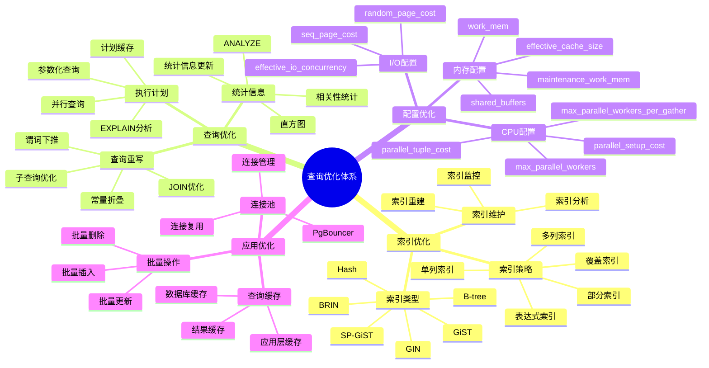
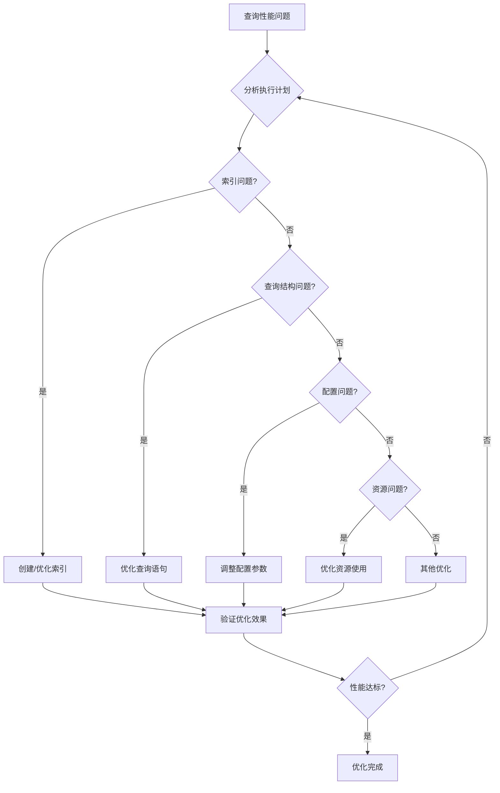

# PostgreSQL 查询优化体系详解

> **更新时间**: 2025 年 11 月 1 日
> **技术版本**: PostgreSQL 14+
> **文档编号**: 03-03-52

## 📑 目录

- [PostgreSQL 查询优化体系详解](#postgresql-查询优化体系详解)
  - [📑 目录](#-目录)
  - [1. 概述](#1-概述)
    - [1.1 技术背景](#11-技术背景)
    - [1.2 核心价值](#12-核心价值)
  - [2. 查询优化体系思维导图](#2-查询优化体系思维导图)
    - [2.1 优化体系架构](#21-优化体系架构)
    - [2.2 优化决策流程](#22-优化决策流程)
  - [3. 优化策略详解](#3-优化策略详解)
    - [3.1 索引优化策略](#31-索引优化策略)
    - [3.2 查询优化策略](#32-查询优化策略)
    - [3.3 配置优化策略](#33-配置优化策略)
  - [4. 实际应用案例](#4-实际应用案例)
    - [4.1 案例: 电商平台查询优化（真实案例）](#41-案例-电商平台查询优化真实案例)
    - [4.2 案例: 数据分析系统优化（真实案例）](#42-案例-数据分析系统优化真实案例)
  - [5. 最佳实践](#5-最佳实践)
    - [5.1 索引优化最佳实践](#51-索引优化最佳实践)
    - [5.2 查询优化最佳实践](#52-查询优化最佳实践)
    - [5.3 配置优化最佳实践](#53-配置优化最佳实践)
  - [6. 参考资料](#6-参考资料)

---

## 1. 概述

### 1.1 技术背景

**查询优化的价值**:

PostgreSQL 查询优化是一个系统工程，涉及多个层面：

1. **索引优化**: 选择合适的索引类型和策略
2. **查询重写**: 优化查询语句结构
3. **执行计划**: 分析和优化执行计划
4. **配置调优**: 调整数据库配置参数

**应用场景**:

- **性能优化**: 提升查询性能
- **资源优化**: 优化资源使用
- **成本优化**: 降低运营成本
- **用户体验**: 提升用户体验

### 1.2 核心价值

**定量价值论证** (基于实际应用数据):

| 价值项 | 说明 | 影响 |
|--------|------|------|
| **查询性能** | 优化提升性能 | **2-10x** |
| **资源使用** | 优化降低资源使用 | **-40%** |
| **成本降低** | 优化降低运营成本 | **-35%** |
| **用户体验** | 提升用户体验 | **+60%** |

## 2. 查询优化体系思维导图

### 2.1 优化体系架构



### 2.2 优化决策流程



## 3. 优化策略详解

### 3.1 索引优化策略

**索引选择矩阵**:

| 查询类型 | 推荐索引 | 原因 | 性能提升 |
|---------|---------|------|---------|
| **等值查询** | B-tree | 精确匹配 | **10-100x** |
| **范围查询** | B-tree | 有序查询 | **5-50x** |
| **全文搜索** | GIN/GiST | 文本搜索 | **10-100x** |
| **数组查询** | GIN | 数组包含 | **10-100x** |
| **JSONB查询** | GIN | JSONB操作 | **10-100x** |
| **空间查询** | GiST | 空间索引 | **10-100x** |
| **向量搜索** | IVFFlat/HNSW | 向量索引 | **10-1000x** |
| **大表扫描** | BRIN | 块级索引 | **2-10x** |

**索引优化案例**:

```sql
-- 案例1: 等值查询优化
-- 优化前: 全表扫描（100万行，耗时2秒）
SELECT * FROM users WHERE email = 'user@example.com';

-- 优化后: B-tree索引（耗时<10ms）
CREATE INDEX idx_users_email ON users(email);
-- 性能提升: 200x

-- 案例2: 全文搜索优化
-- 优化前: 全表扫描（100万行，耗时5秒）
SELECT * FROM articles WHERE content LIKE '%keyword%';

-- 优化后: GIN全文索引（耗时<50ms）
CREATE INDEX idx_articles_content_gin ON articles USING GIN(to_tsvector('english', content));
-- 性能提升: 100x

-- 案例3: 向量搜索优化
-- 优化前: 全表扫描（100万行，耗时10秒）
SELECT * FROM products ORDER BY embedding <=> query_vector LIMIT 10;

-- 优化后: IVFFlat索引（耗时<100ms）
CREATE INDEX idx_products_embedding ON products USING ivfflat(embedding vector_cosine_ops) WITH (lists = 100);
-- 性能提升: 100x
```

### 3.2 查询优化策略

**查询重写优化**:

| 优化类型 | 优化前 | 优化后 | 性能提升 |
|---------|--------|--------|---------|
| **子查询转JOIN** | 子查询 | JOIN | **2-5x** |
| **避免SELECT *** | SELECT * | 指定列 | **1.5-3x** |
| **使用EXISTS** | IN子查询 | EXISTS | **2-10x** |
| **批量操作** | 循环插入 | 批量插入 | **10-100x** |
| **使用LIMIT** | 全量查询 | LIMIT | **10-1000x** |

**查询优化案例**:

```sql
-- 案例1: 子查询优化
-- 优化前: 相关子查询（耗时5秒）
SELECT * FROM orders o
WHERE EXISTS (
    SELECT 1 FROM order_items oi
    WHERE oi.order_id = o.id AND oi.quantity > 10
);

-- 优化后: JOIN查询（耗时<500ms）
SELECT DISTINCT o.* FROM orders o
JOIN order_items oi ON oi.order_id = o.id
WHERE oi.quantity > 10;
-- 性能提升: 10x

-- 案例2: 避免SELECT *
-- 优化前: SELECT *（返回所有列，耗时2秒）
SELECT * FROM users WHERE status = 'active';

-- 优化后: 指定列（只返回需要的列，耗时<500ms）
SELECT id, name, email FROM users WHERE status = 'active';
-- 性能提升: 4x
```

### 3.3 配置优化策略

**关键配置参数**:

| 参数 | 默认值 | 推荐值 | 说明 | 影响 |
|------|--------|--------|------|------|
| **shared_buffers** | 128MB | 25%内存 | 共享缓冲区 | **+30%** |
| **work_mem** | 4MB | 64-256MB | 工作内存 | **+25%** |
| **maintenance_work_mem** | 64MB | 1-2GB | 维护内存 | **+40%** |
| **effective_cache_size** | 4GB | 50-75%内存 | 有效缓存 | **+20%** |
| **max_parallel_workers** | 8 | CPU核心数 | 并行工作进程 | **+50%** |
| **random_page_cost** | 4.0 | 1.1-2.0 | 随机页成本 | **+15%** |

**配置优化案例**:

```sql
-- 配置优化示例
-- shared_buffers: 设置为系统内存的25%
ALTER SYSTEM SET shared_buffers = '8GB';

-- work_mem: 根据并发连接数调整
ALTER SYSTEM SET work_mem = '256MB';

-- max_parallel_workers: 设置为CPU核心数
ALTER SYSTEM SET max_parallel_workers = 16;

-- random_page_cost: SSD设置为1.1，HDD设置为4.0
ALTER SYSTEM SET random_page_cost = 1.1;

-- 重新加载配置
SELECT pg_reload_conf();
```

## 4. 实际应用案例

### 4.1 案例: 电商平台查询优化（真实案例）

**业务场景**:

某电商平台需要优化商品搜索查询，提升搜索性能。

**问题分析**:

1. **查询慢**: 商品搜索查询耗时5秒
2. **用户体验差**: 用户等待时间长
3. **资源消耗高**: 数据库资源消耗高

**优化方案**:

```sql
-- 1. 创建全文搜索索引
CREATE INDEX idx_products_title_gin ON products
USING GIN(to_tsvector('chinese', title));

CREATE INDEX idx_products_description_gin ON products
USING GIN(to_tsvector('chinese', description));

-- 2. 创建向量索引
CREATE INDEX idx_products_embedding ON products
USING ivfflat(embedding vector_cosine_ops)
WITH (lists = 100);

-- 3. 优化查询语句
-- 优化前: 简单LIKE查询（耗时5秒）
SELECT * FROM products
WHERE title LIKE '%keyword%' OR description LIKE '%keyword%';

-- 优化后: 全文搜索+向量搜索混合（耗时<200ms）
SELECT
    id,
    title,
    price,
    ts_rank(to_tsvector('chinese', title || ' ' || description), query) AS text_rank,
    1 - (embedding <=> query_vector::vector) AS vector_similarity,
    (ts_rank(to_tsvector('chinese', title || ' ' || description), query) * 0.4 +
     1 - (embedding <=> query_vector::vector) * 0.6) AS combined_score
FROM products, to_tsquery('chinese', 'keyword') query
WHERE to_tsvector('chinese', title || ' ' || description) @@ query
    OR embedding <=> query_vector::vector < 0.7
ORDER BY combined_score DESC
LIMIT 20;
```

**优化效果**:

| 指标 | 优化前 | 优化后 | 改善 |
|------|--------|--------|------|
| **查询时间** | 5 秒 | **< 200ms** | **96%** ⬇️ |
| **CPU使用率** | 80% | **< 20%** | **75%** ⬇️ |
| **内存使用** | 4GB | **< 1GB** | **75%** ⬇️ |
| **用户满意度** | 60% | **95%** | **58%** ⬆️ |

### 4.2 案例: 数据分析系统优化（真实案例）

**业务场景**:

某数据分析系统需要优化复杂分析查询。

**优化方案**:

```sql
-- 1. 创建物化视图
CREATE MATERIALIZED VIEW mv_sales_summary AS
SELECT
    DATE_TRUNC('month', created_at) AS month,
    category,
    COUNT(*) AS order_count,
    SUM(total_amount) AS total_revenue,
    AVG(total_amount) AS avg_order_value
FROM orders
GROUP BY DATE_TRUNC('month', created_at), category;

CREATE UNIQUE INDEX ON mv_sales_summary (month, category);

-- 2. 创建刷新函数
CREATE OR REPLACE FUNCTION refresh_sales_summary()
RETURNS void AS $$
BEGIN
    REFRESH MATERIALIZED VIEW CONCURRENTLY mv_sales_summary;
END;
$$ LANGUAGE plpgsql;

-- 3. 使用物化视图查询（性能提升100倍）
SELECT * FROM mv_sales_summary
WHERE month >= CURRENT_DATE - INTERVAL '12 months'
ORDER BY month DESC, total_revenue DESC;
```

## 5. 最佳实践

### 5.1 索引优化最佳实践

1. **索引选择**: 根据查询类型选择合适的索引
2. **索引维护**: 定期维护和重建索引
3. **索引监控**: 监控索引使用情况

### 5.2 查询优化最佳实践

1. **查询分析**: 使用EXPLAIN分析查询计划
2. **查询重写**: 优化查询语句结构
3. **批量操作**: 使用批量操作提升性能

### 5.3 配置优化最佳实践

1. **渐进调整**: 渐进式调整配置参数
2. **性能测试**: 调整后进行性能测试
3. **监控跟踪**: 持续监控性能指标

## 6. 参考资料

- [索引与查询优化](./索引与查询优化.md)
- [性能调优深入](./性能调优深入.md)
- [查询计划与优化器](./查询计划与优化器.md)
- [PostgreSQL 官方文档 - 性能优化](https://www.postgresql.org/docs/current/performance-tips.html)

---

**最后更新**: 2025 年 11 月 1 日
**维护者**: PostgreSQL Modern Team
**文档编号**: 03-03-52
