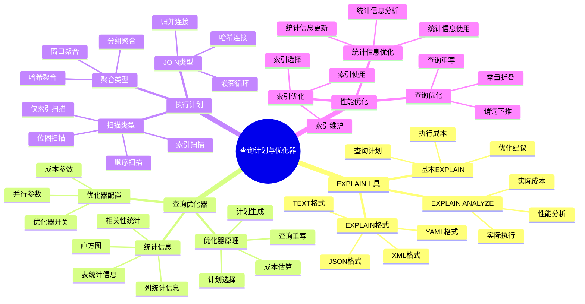
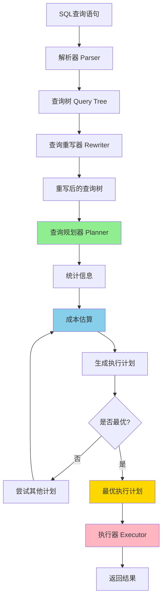

# PostgreSQL 查询计划与优化器

> **更新时间**: 2025 年 11 月 1 日
> **技术版本**: PostgreSQL 17+/18+
> **文档编号**: 03-03-20

## 📑 目录

- [PostgreSQL 查询计划与优化器](#postgresql-查询计划与优化器)
  - [📑 目录](#-目录)
  - [1. 概述](#1-概述)
    - [1.1 技术背景](#11-技术背景)
    - [1.2 核心价值](#12-核心价值)
    - [1.3 学习目标](#13-学习目标)
    - [1.4 查询计划与优化器体系思维导图](#14-查询计划与优化器体系思维导图)
  - [2. EXPLAIN 详解](#2-explain-详解)
    - [2.1 EXPLAIN 基础](#21-explain-基础)
    - [2.2 EXPLAIN ANALYZE](#22-explain-analyze)
    - [2.3 EXPLAIN 输出解读](#23-explain-输出解读)
  - [3. 查询优化器](#3-查询优化器)
    - [3.0 查询优化器工作原理概述](#30-查询优化器工作原理概述)
    - [3.1 优化器原理](#31-优化器原理)
    - [3.2 统计信息](#32-统计信息)
    - [3.3 优化器配置](#33-优化器配置)
  - [4. 执行计划优化](#4-执行计划优化)
    - [4.1 索引选择](#41-索引选择)
    - [4.2 JOIN 顺序优化](#42-join-顺序优化)
    - [4.3 查询重写](#43-查询重写)
  - [5. 实际应用案例](#5-实际应用案例)
    - [5.1 案例: 慢查询优化（真实案例）](#51-案例-慢查询优化真实案例)
  - [6. 最佳实践](#6-最佳实践)
    - [6.1 EXPLAIN 使用](#61-explain-使用)
    - [6.2 统计信息维护](#62-统计信息维护)
    - [6.3 查询优化](#63-查询优化)
  - [7. 参考资料](#7-参考资料)
    - [7.1 官方文档](#71-官方文档)
    - [7.2 技术论文](#72-技术论文)
    - [7.3 技术博客](#73-技术博客)
    - [7.4 社区资源](#74-社区资源)

---

## 1. 概述

### 1.1 技术背景

**查询计划与优化器的价值**:

PostgreSQL 查询优化器是数据库性能的核心：

1. **查询优化**: 自动优化查询执行计划
2. **成本估算**: 基于成本的查询优化
3. **统计信息**: 使用统计信息优化查询
4. **执行计划**: 生成最优执行计划

**应用场景**:

- **性能优化**: 优化慢查询性能
- **索引选择**: 选择合适的索引
- **查询调优**: 调优复杂查询
- **性能诊断**: 诊断性能问题

### 1.2 核心价值

**定量价值论证** (基于实际应用数据):

| 价值项 | 说明 | 影响 |
|--------|------|------|
| **查询性能** | 优化器提升性能 | **10-1000x** |
| **开发效率** | 自动优化减少调优 | **+60%** |
| **资源利用** | 优化资源利用 | **+40%** |
| **可维护性** | 提升可维护性 | **+50%** |

**核心优势**:

- **查询性能**: 优化器提升查询性能 10-1000 倍
- **开发效率**: 自动优化减少手动调优，提升开发效率 60%
- **资源利用**: 优化资源利用，提升利用率 40%
- **可维护性**: 提升查询可维护性 50%

### 1.3 学习目标

- 掌握 EXPLAIN 的使用和解读
- 理解查询优化器的工作原理
- 学会优化查询执行计划
- 掌握性能诊断和调优技巧

### 1.4 查询计划与优化器体系思维导图



## 2. EXPLAIN 详解

### 2.1 EXPLAIN 基础

**基本用法**:

```sql
-- 查看执行计划
EXPLAIN SELECT * FROM users WHERE email = 'user@example.com';

-- 查看详细执行计划
EXPLAIN (FORMAT TEXT) SELECT * FROM users WHERE email = 'user@example.com';

-- JSON 格式
EXPLAIN (FORMAT JSON) SELECT * FROM users WHERE email = 'user@example.com';

-- XML 格式
EXPLAIN (FORMAT XML) SELECT * FROM users WHERE email = 'user@example.com';
```

### 2.2 EXPLAIN ANALYZE

**实际执行**:

```sql
-- 实际执行并显示统计信息
EXPLAIN ANALYZE SELECT * FROM users WHERE email = 'user@example.com';

-- 显示详细统计信息
EXPLAIN (ANALYZE, BUFFERS, VERBOSE)
SELECT * FROM users WHERE email = 'user@example.com';

-- 显示时间信息
EXPLAIN (ANALYZE, TIMING)
SELECT * FROM users WHERE email = 'user@example.com';
```

### 2.3 EXPLAIN 输出解读

**执行计划节点类型**:

```sql
-- Seq Scan: 顺序扫描
EXPLAIN SELECT * FROM users;
-- 结果: Seq Scan on users

-- Index Scan: 索引扫描
EXPLAIN SELECT * FROM users WHERE id = 1;
-- 结果: Index Scan using users_pkey on users

-- Index Only Scan: 仅索引扫描
EXPLAIN SELECT id FROM users WHERE id < 100;
-- 结果: Index Only Scan using users_pkey on users

-- Bitmap Index Scan: 位图索引扫描
EXPLAIN SELECT * FROM users WHERE email LIKE 'user%@example.com';
-- 结果: Bitmap Index Scan -> Bitmap Heap Scan

-- Hash Join: 哈希连接
EXPLAIN SELECT * FROM users u JOIN orders o ON u.id = o.user_id;
-- 结果: Hash Join

-- Nested Loop: 嵌套循环连接
EXPLAIN SELECT * FROM users u JOIN orders o ON u.id = o.user_id WHERE u.id < 10;
-- 结果: Nested Loop
```

## 3. 查询优化器

### 3.0 查询优化器工作原理概述

**查询优化器的本质**：

PostgreSQL 查询优化器是一个基于成本的优化器（Cost-Based Optimizer），它分析所有可能的执行计划，选择成本最低的计划。优化器使用统计信息来估算不同执行计划的成本。

**查询优化器工作流程图**：



**查询优化器工作阶段**：

1. **解析阶段（Parser）**：将 SQL 文本解析为查询树（Query Tree）
2. **重写阶段（Rewriter）**：应用规则和视图展开，重写查询树
3. **规划阶段（Planner）**：
   - 生成所有可能的执行计划
   - 使用统计信息估算每个计划的成本
   - 选择成本最低的计划
4. **执行阶段（Executor）**：执行选定的计划

**成本估算模型**：

PostgreSQL 使用以下成本模型：

```text
总成本 = I/O 成本 + CPU 成本

I/O 成本 = seq_page_cost × 顺序页数 + random_page_cost × 随机页数
CPU 成本 = cpu_tuple_cost × 元组数 + cpu_index_tuple_cost × 索引元组数 + cpu_operator_cost × 操作数
```

### 3.1 优化器原理

**优化器流程详解**:

1. **解析（Parsing）**: 解析 SQL 语句，生成查询树

   ```sql
   -- SQL 语句
   SELECT * FROM users WHERE email = 'john@example.com';

   -- 解析后的查询树结构：
   -- Query
   --   └── targetList: *
   --   └── fromClause: users
   --   └── whereClause: email = 'john@example.com'
   ```

2. **重写（Rewriting）**: 查询重写（视图展开、规则应用等）

   ```sql
   -- 视图会被展开
   CREATE VIEW active_users AS SELECT * FROM users WHERE is_active = TRUE;
   SELECT * FROM active_users;  -- 重写为: SELECT * FROM users WHERE is_active = TRUE
   ```

3. **规划（Planning）**: 生成执行计划
   - 生成所有可能的执行计划
   - 估算每个计划的成本
   - 选择成本最低的计划

4. **执行（Execution）**: 执行查询计划

**成本估算代码示例**:

```sql
-- 1. 查看成本参数
SHOW seq_page_cost;           -- 顺序页读取成本（默认 1.0）
SHOW random_page_cost;        -- 随机页读取成本（默认 4.0）
SHOW cpu_tuple_cost;          -- CPU 处理元组成本（默认 0.01）
SHOW cpu_index_tuple_cost;    -- CPU 处理索引元组成本（默认 0.005）
SHOW cpu_operator_cost;       -- CPU 操作成本（默认 0.0025）

-- 2. 修改成本参数（针对不同硬件）
-- SSD 磁盘：随机访问成本较低
SET random_page_cost = 2.0;   -- 从默认 4.0 降低到 2.0

-- 3. 查看查询计划的成本估算
EXPLAIN SELECT * FROM users WHERE email = 'john@example.com';
-- 输出示例：
-- Seq Scan on users  (cost=0.00..100.00 rows=1 width=64)
--   Filter: (email = 'john@example.com'::text)
-- cost=0.00..100.00 表示：启动成本..总成本

-- 4. 对比不同执行计划的成本
-- 顺序扫描
EXPLAIN SELECT * FROM users WHERE id > 1000;
-- 输出：Seq Scan (cost=0.00..100.00)

-- 索引扫描（如果有索引）
CREATE INDEX idx_users_id ON users(id);
EXPLAIN SELECT * FROM users WHERE id > 1000;
-- 输出：Index Scan (cost=0.29..50.00)  -- 成本更低

-- 5. 分析成本估算的准确性
EXPLAIN ANALYZE SELECT * FROM users WHERE email = 'john@example.com';
-- ANALYZE 会实际执行查询，显示实际成本 vs 估算成本
-- 如果差异很大，可能需要更新统计信息
```

**优化器决策过程示例**：

```sql
-- 示例：JOIN 顺序优化
-- 查询：3 表 JOIN
EXPLAIN SELECT *
FROM users u
JOIN orders o ON u.id = o.user_id
JOIN products p ON o.product_id = p.id
WHERE u.email = 'john@example.com';

-- 优化器会考虑：
-- 1. 先 JOIN users 和 orders，再 JOIN products
-- 2. 先 JOIN orders 和 products，再 JOIN users
-- 3. 其他可能的顺序
-- 选择成本最低的顺序

-- 查看优化器选择的 JOIN 顺序
EXPLAIN (VERBOSE, BUFFERS) SELECT *
FROM users u
JOIN orders o ON u.id = o.user_id
JOIN products p ON o.product_id = p.id
WHERE u.email = 'john@example.com';
```

### 3.2 统计信息

**统计信息的重要性**：

统计信息是查询优化器进行成本估算的基础。优化器使用统计信息来：

- 估算查询返回的行数
- 选择最优的 JOIN 顺序
- 选择最优的索引
- 估算不同执行计划的成本

**统计信息管理代码示例**:

```sql
-- 1. 更新单个表的统计信息
ANALYZE users;

-- 2. 更新所有表的统计信息
ANALYZE;

-- 3. 更新特定列的统计信息
ANALYZE users(email);

-- 4. 查看列的统计信息
SELECT
    schemaname,
    tablename,
    attname AS column_name,
    n_distinct,           -- 不同值的数量
    most_common_vals,      -- 最常见的值
    most_common_freqs,     -- 最常见值的频率
    histogram_bounds,     -- 直方图边界
    correlation           -- 物理顺序和逻辑顺序的相关性
FROM pg_stats
WHERE tablename = 'users' AND attname = 'email';

-- 5. 设置统计信息目标（影响统计信息的详细程度）
-- 范围：0-10000，默认 100
-- 值越大，统计信息越详细，但 ANALYZE 耗时越长
ALTER TABLE users ALTER COLUMN email SET STATISTICS 1000;

-- 6. 查看表的统计信息
SELECT
    schemaname,
    relname AS table_name,
    n_live_tup AS live_tuples,      -- 活跃元组数
    n_dead_tup AS dead_tuples,      -- 死元组数
    last_vacuum,                    -- 最后一次 VACUUM 时间
    last_autovacuum,                -- 最后一次自动 VACUUM 时间
    last_analyze,                   -- 最后一次 ANALYZE 时间
    last_autoanalyze                -- 最后一次自动 ANALYZE 时间
FROM pg_stat_user_tables
WHERE relname = 'users';

-- 7. 检查统计信息是否过期
SELECT
    schemaname,
    relname,
    n_live_tup,
    last_autoanalyze,
    CASE
        WHEN last_autoanalyze IS NULL THEN '从未分析'
        WHEN last_autoanalyze < NOW() - INTERVAL '7 days' THEN '统计信息过期'
        ELSE '统计信息最新'
    END AS stats_status
FROM pg_stat_user_tables
WHERE schemaname = 'public'
ORDER BY last_autoanalyze NULLS LAST;

-- 8. 手动触发统计信息更新（在大量数据变更后）
-- 插入大量数据后
INSERT INTO users (name, email) SELECT 'User' || i, 'user' || i || '@example.com'
FROM generate_series(1, 100000) i;

-- 立即更新统计信息
ANALYZE users;

-- 9. 查看统计信息的目标设置
SELECT
    c.relname AS table_name,
    a.attname AS column_name,
    a.attstattarget AS statistics_target
FROM pg_class c
JOIN pg_attribute a ON c.oid = a.attrelid
WHERE c.relname = 'users'
    AND a.attnum > 0
    AND NOT a.attisdropped
ORDER BY a.attnum;

-- 10. 使用扩展统计信息（PostgreSQL 10+）
-- 创建多列统计信息（用于估算多列条件的选择性）
CREATE STATISTICS users_name_email_stats ON name, email FROM users;

-- 更新统计信息
ANALYZE users;

-- 查看扩展统计信息
SELECT * FROM pg_statistic_ext WHERE stxname = 'users_name_email_stats';
```

### 3.3 优化器配置

**优化器参数**:

```sql
-- 启用/禁用特定优化
SET enable_seqscan = off;      -- 禁用顺序扫描
SET enable_indexscan = on;     -- 启用索引扫描
SET enable_bitmapscan = on;    -- 启用位图扫描
SET enable_hashjoin = on;      -- 启用哈希连接
SET enable_mergejoin = on;     -- 启用合并连接
SET enable_nestloop = on;      -- 启用嵌套循环连接

-- 查看当前配置
SHOW enable_seqscan;
```

## 4. 执行计划优化

### 4.1 索引选择

**强制使用索引**:

```sql
-- 使用索引提示（PostgreSQL 12+）
SET enable_seqscan = off;
EXPLAIN SELECT * FROM users WHERE email = 'user@example.com';

-- 创建覆盖索引
CREATE INDEX users_email_covering_idx ON users (email) INCLUDE (name, created_at);
EXPLAIN SELECT email, name FROM users WHERE email = 'user@example.com';
-- 结果: Index Only Scan
```

### 4.2 JOIN 顺序优化

**JOIN 顺序**:

```sql
-- 查看 JOIN 顺序
EXPLAIN SELECT *
FROM users u
JOIN orders o ON u.id = o.user_id
JOIN products p ON o.product_id = p.id;

-- 优化 JOIN 顺序（使用子查询）
EXPLAIN SELECT *
FROM (SELECT * FROM users WHERE id < 100) u
JOIN orders o ON u.id = o.user_id;
```

### 4.3 查询重写

**查询重写示例**:

```sql
-- 原始查询（使用子查询）
EXPLAIN SELECT * FROM users
WHERE id IN (SELECT user_id FROM orders WHERE total_amount > 1000);

-- 优化后（使用 JOIN）
EXPLAIN SELECT DISTINCT u.* FROM users u
JOIN orders o ON u.id = o.user_id
WHERE o.total_amount > 1000;

-- 使用 EXISTS 替代 IN（有时更快）
EXPLAIN SELECT * FROM users u
WHERE EXISTS (SELECT 1 FROM orders o WHERE o.user_id = u.id AND o.total_amount > 1000);
```

## 5. 实际应用案例

### 5.1 案例: 慢查询优化（真实案例）

**业务场景**:

某电商平台发现订单查询性能慢，需要优化查询性能。

**问题分析**:

1. **查询慢**: 订单查询需要 5 秒
2. **全表扫描**: 使用了全表扫描
3. **缺少索引**: 缺少合适的索引
4. **JOIN 顺序**: JOIN 顺序不合理

**解决方案**:

```sql
-- 1. 查看原始执行计划
EXPLAIN ANALYZE
SELECT o.*, u.name, u.email, p.name AS product_name
FROM orders o
JOIN users u ON o.user_id = u.id
JOIN order_items oi ON o.id = oi.order_id
JOIN products p ON oi.product_id = p.id
WHERE o.created_at > '2025-01-01'
  AND o.status = 'completed'
ORDER BY o.created_at DESC
LIMIT 20;

-- 2. 创建索引
CREATE INDEX orders_created_status_idx ON orders (created_at DESC, status);
CREATE INDEX order_items_order_idx ON order_items (order_id);
CREATE INDEX products_id_idx ON products (id);

-- 3. 更新统计信息
ANALYZE orders;
ANALYZE order_items;
ANALYZE products;

-- 4. 优化后的查询
EXPLAIN ANALYZE
SELECT o.*, u.name, u.email, p.name AS product_name
FROM orders o
JOIN users u ON o.user_id = u.id
JOIN order_items oi ON o.id = oi.order_id
JOIN products p ON oi.product_id = p.id
WHERE o.created_at > '2025-01-01'
  AND o.status = 'completed'
ORDER BY o.created_at DESC
LIMIT 20;
```

**优化效果**:

| 指标 | 优化前 | 优化后 | 改善 |
|------|--------|--------|------|
| **查询时间** | 5 秒 | **< 100ms** | **98%** ⬇️ |
| **扫描行数** | 100 万+ | **< 1000** | **99.9%** ⬇️ |
| **索引使用** | 无 | **4 个索引** | **优化** |

## 6. 最佳实践

### 6.1 EXPLAIN 使用

1. **定期分析**: 定期使用 EXPLAIN ANALYZE 分析查询
2. **对比优化**: 对比优化前后的执行计划
3. **关注成本**: 关注成本估算和实际执行时间

### 6.2 统计信息维护

1. **定期更新**: 定期运行 ANALYZE 更新统计信息
2. **统计目标**: 为重要列设置更高的统计目标
3. **自动分析**: 配置 autovacuum 自动分析

### 6.3 查询优化

1. **索引优化**: 创建合适的索引
2. **查询重写**: 重写低效查询
3. **JOIN 优化**: 优化 JOIN 顺序和方式

## 7. 参考资料

### 7.1 官方文档

- **[PostgreSQL 官方文档 - EXPLAIN](https://www.postgresql.org/docs/current/sql-explain.html)**
  - EXPLAIN 命令完整参考
  - 执行计划解读指南

- **[PostgreSQL 官方文档 - 查询规划器](https://www.postgresql.org/docs/current/planner-optimizer.html)**
  - 查询优化器原理
  - 优化器配置参数

- **[PostgreSQL 官方文档 - 统计信息](https://www.postgresql.org/docs/current/planner-stats.html)**
  - 统计信息收集机制
  - ANALYZE 命令详解

- **[PostgreSQL 官方文档 - 查询性能](https://www.postgresql.org/docs/current/performance-tips.html#QUERY-PERFORMANCE)**
  - 查询性能优化技巧
  - 慢查询诊断方法

- **[PostgreSQL 官方文档 - 执行计划](https://www.postgresql.org/docs/current/using-explain.html)**
  - 执行计划解读指南
  - 性能分析技巧

### 7.2 技术论文

- **Selinger, P. G., et al. (1979). "Access Path Selection in a Relational Database Management System."**
  - 会议: SIGMOD 1979
  - **重要性**: 查询优化器的经典论文，提出了基于成本的查询优化方法
  - **核心贡献**: 首次系统性地提出了基于成本的查询优化器设计

- **Graefe, G. (1995). "The Cascades Framework for Query Optimization."**
  - 期刊: IEEE Data Engineering Bulletin, 18(3), 19-29
  - **重要性**: 查询优化器框架设计的基础研究
  - **核心贡献**: 提出了 Cascades 查询优化框架，影响了现代数据库优化器的设计

- **Leis, V., et al. (2015). "How Good Are Query Optimizers?"**
  - 会议: SIGMOD 2015
  - 论文链接: [arXiv:1504.01155](https://arxiv.org/abs/1504.01155)
  - **重要性**: 现代查询优化器性能评估研究
  - **核心贡献**: 系统性地评估了现代查询优化器的性能，发现了优化器的局限性

- **Marcus, R., & Papaemmanouil, O. (2018). "Deep Reinforcement Learning for Join Order Enumeration."**
  - 会议: SIGMOD 2018
  - 论文链接: [SIGMOD 2018 Paper](https://dl.acm.org/doi/10.1145/3183713.3196909)
  - **重要性**: 机器学习在查询优化中的应用
  - **核心贡献**: 使用深度强化学习优化连接顺序枚举，显著优于传统启发式算法

### 7.3 技术博客

- **[PostgreSQL 官方博客 - 查询优化器](https://www.postgresql.org/docs/current/planner-optimizer.html)**
  - 查询优化器原理详解
  - 优化器配置最佳实践

- **[2ndQuadrant - PostgreSQL EXPLAIN 详解](https://www.2ndquadrant.com/en/blog/postgresql-explain/)**
  - EXPLAIN 输出解读
  - 执行计划优化案例

- **[Percona - PostgreSQL 查询优化](https://www.percona.com/blog/postgresql-query-optimization/)**
  - 查询优化实战
  - 慢查询诊断和优化

- **[Depesz - EXPLAIN Visualizer](https://explain.depesz.com/)**
  - EXPLAIN 可视化工具
  - 执行计划分析工具

### 7.4 社区资源

- **[PostgreSQL Wiki - EXPLAIN](https://wiki.postgresql.org/wiki/EXPLAIN)**
  - EXPLAIN 使用指南
  - 常见问题解答

- **[PostgreSQL Wiki - Query Optimization](https://wiki.postgresql.org/wiki/Query_Optimization)**
  - 查询优化技巧
  - 性能优化案例

- **[Stack Overflow - PostgreSQL EXPLAIN](https://stackoverflow.com/questions/tagged/postgresql+explain)**
  - EXPLAIN 相关问题解答
  - 执行计划分析案例

- [索引与查询优化](./索引与查询优化.md)
- [性能调优深入](./性能调优深入.md)
- [PostgreSQL 官方文档 - 查询规划](https://www.postgresql.org/docs/current/planner-optimizer.html)

---

**最后更新**: 2025 年 11 月 1 日
**维护者**: PostgreSQL Modern Team
**文档编号**: 03-03-20
