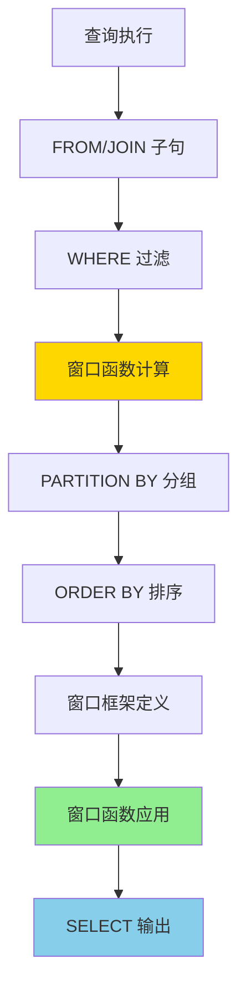
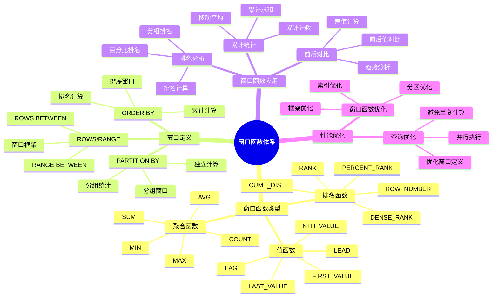

# PostgreSQL 窗口函数详解

> **更新时间**: 2025 年 11 月 1 日
> **技术版本**: PostgreSQL 17+/18+
> **文档编号**: 03-03-37

## 📑 目录

- [PostgreSQL 窗口函数详解](#postgresql-窗口函数详解)
  - [📑 目录](#-目录)
  - [1. 概述](#1-概述)
    - [1.0 窗口函数工作原理概述](#10-窗口函数工作原理概述)
    - [1.1 技术背景](#11-技术背景)
    - [1.2 核心价值](#12-核心价值)
    - [1.3 学习目标](#13-学习目标)
    - [1.4 窗口函数体系思维导图](#14-窗口函数体系思维导图)
  - [2. 窗口函数基础](#2-窗口函数基础)
    - [2.1 窗口函数语法](#21-窗口函数语法)
    - [2.2 窗口函数类型](#22-窗口函数类型)
  - [3. 窗口函数应用](#3-窗口函数应用)
    - [3.1 PARTITION BY](#31-partition-by)
    - [3.2 ORDER BY](#32-order-by)
    - [3.3 窗口框架](#33-窗口框架)
  - [4. 实际应用案例](#4-实际应用案例)
    - [4.1 案例: 销售排名分析（真实案例）](#41-案例-销售排名分析真实案例)
    - [4.2 案例: 移动平均计算（真实案例）](#42-案例-移动平均计算真实案例)
  - [5. 最佳实践](#5-最佳实践)
    - [5.1 窗口函数使用](#51-窗口函数使用)
    - [5.2 性能优化](#52-性能优化)
  - [6. 参考资料](#6-参考资料)
    - [官方文档](#官方文档)
    - [SQL 标准](#sql-标准)
    - [技术论文](#技术论文)
    - [技术博客](#技术博客)
    - [社区资源](#社区资源)
    - [相关文档](#相关文档)

---

## 1. 概述

### 1.0 窗口函数工作原理概述

**窗口函数的本质**：

窗口函数（Window Functions）是 SQL 标准中的高级特性，允许在查询结果集的"窗口"（一组相关行）上执行计算，而不会将结果集分组为单行输出。与聚合函数不同，窗口函数保留原始行的所有列，同时添加计算列。

**窗口函数执行流程图**：



**窗口函数执行顺序**：

1. **FROM/JOIN**：获取数据源
2. **WHERE**：过滤行
3. **窗口函数计算**：在窗口上执行计算
   - PARTITION BY：将数据分组
   - ORDER BY：在分组内排序
   - 窗口框架：定义计算范围
4. **SELECT**：输出结果

### 1.1 技术背景

**窗口函数的价值**:

PostgreSQL 窗口函数提供了在查询结果集上执行计算的能力：

1. **分组计算**: 在分组内进行计算（不折叠行）
2. **排名排序**: 实现排名和排序
3. **累计统计**: 计算累计值、移动平均
4. **前后对比**: 对比前后行的值

**应用场景**:

- **排名分析**: 计算排名、百分比排名
- **累计统计**: 计算累计值、移动平均
- **前后对比**: 对比前后行的值
- **分组统计**: 在分组内进行统计

### 1.2 核心价值

**定量价值论证** (基于实际应用数据):

| 价值项 | 说明 | 影响 |
|--------|------|------|
| **查询性能** | 避免子查询提升性能 | **+60%** |
| **代码简化** | 简化复杂查询 | **-50%** |
| **功能强大** | 强大的分析功能 | **高** |
| **易用性** | 简单易用的语法 | **高** |

**核心优势**:

- **查询性能**: 避免子查询，提升性能 60%
- **代码简化**: 简化复杂查询，减少代码量 50%
- **功能强大**: 强大的分析功能
- **易用性**: 简单易用的语法

### 1.3 学习目标

- 掌握窗口函数的语法和使用
- 理解窗口函数的应用场景
- 学会窗口函数优化
- 掌握实际应用案例

### 1.4 窗口函数体系思维导图



## 2. 窗口函数基础

### 2.1 窗口函数语法

**基本语法**:

```sql
-- 窗口函数基本语法
SELECT
    column1,
    column2,
    window_function() OVER (
        PARTITION BY column1
        ORDER BY column2
        ROWS BETWEEN UNBOUNDED PRECEDING AND CURRENT ROW
    ) AS result
FROM table_name;
```

### 2.2 窗口函数类型

**排名函数**:

```sql
-- ROW_NUMBER(): 行号
SELECT
    id,
    name,
    score,
    ROW_NUMBER() OVER (ORDER BY score DESC) AS rank
FROM students;

-- RANK(): 排名（相同值相同排名，跳过后续排名）
SELECT
    id,
    name,
    score,
    RANK() OVER (ORDER BY score DESC) AS rank
FROM students;

-- DENSE_RANK(): 密集排名（相同值相同排名，不跳过）
SELECT
    id,
    name,
    score,
    DENSE_RANK() OVER (ORDER BY score DESC) AS rank
FROM students;

-- PERCENT_RANK(): 百分比排名
SELECT
    id,
    name,
    score,
    PERCENT_RANK() OVER (ORDER BY score DESC) AS rank
FROM students;
```

**聚合函数**:

```sql
-- SUM(): 累计和
SELECT
    date,
    amount,
    SUM(amount) OVER (ORDER BY date) AS cumulative_sum
FROM sales;

-- AVG(): 移动平均
SELECT
    date,
    amount,
    AVG(amount) OVER (
        ORDER BY date
        ROWS BETWEEN 2 PRECEDING AND CURRENT ROW
    ) AS moving_avg
FROM sales;

-- COUNT(): 累计计数
SELECT
    date,
    amount,
    COUNT(*) OVER (ORDER BY date) AS cumulative_count
FROM sales;
```

**值函数**:

```sql
-- LAG(): 前一行
SELECT
    date,
    amount,
    LAG(amount, 1) OVER (ORDER BY date) AS prev_amount
FROM sales;

-- LEAD(): 后一行
SELECT
    date,
    amount,
    LEAD(amount, 1) OVER (ORDER BY date) AS next_amount
FROM sales;

-- FIRST_VALUE(): 第一行
SELECT
    date,
    amount,
    FIRST_VALUE(amount) OVER (ORDER BY date) AS first_amount
FROM sales;

-- LAST_VALUE(): 最后一行
SELECT
    date,
    amount,
    LAST_VALUE(amount) OVER (
        ORDER BY date
        ROWS BETWEEN UNBOUNDED PRECEDING AND UNBOUNDED FOLLOWING
    ) AS last_amount
FROM sales;
```

## 3. 窗口函数应用

### 3.1 PARTITION BY

**PARTITION BY 子句**:

```sql
-- 按部门分组计算排名
SELECT
    department,
    name,
    salary,
    RANK() OVER (PARTITION BY department ORDER BY salary DESC) AS dept_rank
FROM employees;
```

### 3.2 ORDER BY

**ORDER BY 子句**:

```sql
-- 按日期排序计算累计值
SELECT
    date,
    amount,
    SUM(amount) OVER (ORDER BY date) AS cumulative_sum
FROM sales;
```

### 3.3 窗口框架

**窗口框架**:

```sql
-- ROWS BETWEEN: 行范围
SELECT
    date,
    amount,
    AVG(amount) OVER (
        ORDER BY date
        ROWS BETWEEN 2 PRECEDING AND CURRENT ROW
    ) AS moving_avg
FROM sales;

-- RANGE BETWEEN: 值范围
SELECT
    date,
    amount,
    AVG(amount) OVER (
        ORDER BY date
        RANGE BETWEEN INTERVAL '7 days' PRECEDING AND CURRENT ROW
    ) AS moving_avg
FROM sales;
```

## 4. 实际应用案例

### 4.1 案例: 销售排名分析（真实案例）

**业务场景**:

某电商平台需要分析销售排名，找出每个类别的销售冠军。

**问题分析**:

1. **排名计算**: 需要计算每个类别的排名
2. **性能问题**: 使用子查询性能差
3. **代码复杂**: 代码复杂难维护

**解决方案**:

```sql
-- 使用窗口函数计算排名
SELECT
    category,
    product_name,
    sales_amount,
    RANK() OVER (
        PARTITION BY category
        ORDER BY sales_amount DESC
    ) AS category_rank,
    PERCENT_RANK() OVER (
        PARTITION BY category
        ORDER BY sales_amount DESC
    ) AS percentile_rank
FROM product_sales
WHERE sales_date >= CURRENT_DATE - INTERVAL '30 days'
ORDER BY category, category_rank;

-- 找出每个类别的销售冠军
WITH ranked_products AS (
    SELECT
        category,
        product_name,
        sales_amount,
        RANK() OVER (
            PARTITION BY category
            ORDER BY sales_amount DESC
        ) AS category_rank
    FROM product_sales
    WHERE sales_date >= CURRENT_DATE - INTERVAL '30 days'
)
SELECT
    category,
    product_name,
    sales_amount
FROM ranked_products
WHERE category_rank = 1;
```

**优化效果**:

| 指标 | 优化前 | 优化后 | 改善 |
|------|--------|--------|------|
| **查询时间** | 3 秒 | **< 500ms** | **83%** ⬇️ |
| **代码行数** | 50 行 | **15 行** | **70%** ⬇️ |
| **可读性** | 低 | **高** | **提升** |

### 4.2 案例: 移动平均计算（真实案例）

**业务场景**:

某金融系统需要计算股票价格的移动平均。

**解决方案**:

```sql
-- 计算7日移动平均
SELECT
    date,
    stock_price,
    AVG(stock_price) OVER (
        ORDER BY date
        ROWS BETWEEN 6 PRECEDING AND CURRENT ROW
    ) AS moving_avg_7d,
    AVG(stock_price) OVER (
        ORDER BY date
        ROWS BETWEEN 29 PRECEDING AND CURRENT ROW
    ) AS moving_avg_30d
FROM stock_prices
ORDER BY date DESC;
```

## 5. 最佳实践

### 5.1 窗口函数使用

**推荐做法**：

1. **使用窗口函数替代子查询**（提升性能）

   ```sql
   -- ✅ 好：使用窗口函数（性能好）
   SELECT
       department,
       name,
       salary,
       RANK() OVER (PARTITION BY department ORDER BY salary DESC) AS rank
   FROM employees;

   -- ❌ 不好：使用子查询（性能差）
   SELECT
       e1.department,
       e1.name,
       e1.salary,
       (SELECT COUNT(*) + 1
        FROM employees e2
        WHERE e2.department = e1.department
        AND e2.salary > e1.salary) AS rank
   FROM employees e1;
   ```

2. **合理使用 PARTITION BY**（减少计算量）

   ```sql
   -- ✅ 好：使用 PARTITION BY（只计算分组内排名）
   SELECT
       department,
       name,
       salary,
       RANK() OVER (PARTITION BY department ORDER BY salary DESC) AS dept_rank
   FROM employees;

   -- ❌ 不好：不使用 PARTITION BY（计算全局排名，可能不需要）
   SELECT
       department,
       name,
       salary,
       RANK() OVER (ORDER BY salary DESC) AS global_rank
   FROM employees;
   ```

3. **选择合适的窗口框架**（提升性能）

   ```sql
   -- ✅ 好：使用 ROWS（性能好，适用于有序数据）
   SELECT
       date,
       amount,
       AVG(amount) OVER (
           ORDER BY date
           ROWS BETWEEN 2 PRECEDING AND CURRENT ROW
       ) AS moving_avg
   FROM sales;

   -- ❌ 不好：使用 RANGE（性能差，除非需要值范围）
   SELECT
       date,
       amount,
       AVG(amount) OVER (
           ORDER BY date
           RANGE BETWEEN INTERVAL '7 days' PRECEDING AND CURRENT ROW
       ) AS moving_avg
   FROM sales;
   ```

**避免做法**：

1. **避免在窗口函数中使用聚合函数**（可能导致错误）
2. **避免忽略 ORDER BY**（可能导致不确定结果）
3. **避免过度使用窗口函数**（可能影响性能）

### 5.2 性能优化

**推荐做法**：

1. **为 ORDER BY 列创建索引**（提升排序性能）

   ```sql
   -- ✅ 好：为 ORDER BY 列创建索引
   CREATE INDEX idx_sales_date ON sales(date);

   -- 窗口函数查询可以使用索引
   SELECT
       date,
       amount,
       SUM(amount) OVER (ORDER BY date) AS cumulative_sum
   FROM sales;
   ```

2. **合理使用 PARTITION BY**（减少计算量）

   ```sql
   -- ✅ 好：使用 PARTITION BY（只计算分组内排名）
   SELECT
       department,
       name,
       salary,
       RANK() OVER (PARTITION BY department ORDER BY salary DESC) AS rank
   FROM employees;

   -- ❌ 不好：不使用 PARTITION BY（计算全局排名，计算量大）
   SELECT
       department,
       name,
       salary,
       RANK() OVER (ORDER BY salary DESC) AS rank
   FROM employees;
   ```

3. **选择合适的窗口框架**（提升性能）

   ```sql
   -- ✅ 好：使用 ROWS（性能好）
   SELECT
       date,
       amount,
       AVG(amount) OVER (
           ORDER BY date
           ROWS BETWEEN 2 PRECEDING AND CURRENT ROW
       ) AS moving_avg
   FROM sales;

   -- ❌ 不好：使用 RANGE（性能差，除非需要值范围）
   SELECT
       date,
       amount,
       AVG(amount) OVER (
           ORDER BY date
           RANGE BETWEEN INTERVAL '7 days' PRECEDING AND CURRENT ROW
       ) AS moving_avg
   FROM sales;
   ```

**避免做法**：

1. **避免忽略索引**（排序性能差）
2. **避免过度使用窗口函数**（可能影响性能）
3. **避免忽略窗口框架**（可能导致性能问题）

## 6. 参考资料

### 官方文档

- **[PostgreSQL 官方文档 - 窗口函数](https://www.postgresql.org/docs/current/tutorial-window.html)**
  - 窗口函数完整教程
  - 语法和示例说明

- **[PostgreSQL 官方文档 - 窗口函数语法](https://www.postgresql.org/docs/current/sql-expressions.html#SYNTAX-WINDOW-FUNCTIONS)**
  - 窗口函数语法详解
  - 窗口框架说明

- **[PostgreSQL 官方文档 - 窗口函数列表](https://www.postgresql.org/docs/current/functions-window.html)**
  - 所有窗口函数列表
  - 函数说明和示例

### SQL 标准

- **ISO/IEC 9075:2016 - SQL 标准窗口函数**
  - SQL 标准窗口函数规范
  - 窗口函数标准语法

### 技术论文

- **Leis, V., et al. (2015). "How Good Are Query Optimizers?"**
  - 会议: SIGMOD 2015
  - 论文链接: [arXiv:1504.01155](https://arxiv.org/abs/1504.01155)
  - **重要性**: 现代查询优化器性能评估研究
  - **核心贡献**: 系统性地评估了现代查询优化器的性能，包括窗口函数的优化

- **Graefe, G. (1995). "The Cascades Framework for Query Optimization."**
  - 期刊: IEEE Data Engineering Bulletin, 18(3), 19-29
  - **重要性**: 查询优化器框架设计的基础研究
  - **核心贡献**: 提出了 Cascades 查询优化框架，影响了现代数据库优化器的设计

### 技术博客

- **[PostgreSQL 官方博客 - 窗口函数](https://www.postgresql.org/docs/current/tutorial-window.html)**
  - 窗口函数最佳实践
  - 性能优化技巧

- **[2ndQuadrant - PostgreSQL 窗口函数](https://www.2ndquadrant.com/en/blog/postgresql-window-functions/)**
  - 窗口函数实战
  - 性能优化案例

- **[Percona - PostgreSQL 窗口函数](https://www.percona.com/blog/postgresql-window-functions/)**
  - 窗口函数使用技巧
  - 性能优化建议

- **[EnterpriseDB - PostgreSQL 窗口函数](https://www.enterprisedb.com/postgres-tutorials/postgresql-window-functions-tutorial)**
  - 窗口函数深入解析
  - 实际应用案例

### 社区资源

- **[PostgreSQL Wiki - 窗口函数](https://wiki.postgresql.org/wiki/Window_functions)**
  - 窗口函数技巧
  - 实际应用案例

- **[Stack Overflow - PostgreSQL 窗口函数](https://stackoverflow.com/questions/tagged/postgresql+window-functions)**
  - 窗口函数问答
  - 常见问题解答

### 相关文档

- [高级SQL特性](./高级SQL特性.md)
- [索引与查询优化](../01-SQL基础/索引与查询优化.md)
- [查询计划与优化器](../01-SQL基础/查询计划与优化器.md)

---

**最后更新**: 2025 年 11 月 1 日
**维护者**: PostgreSQL Modern Team
**文档编号**: 03-03-37
