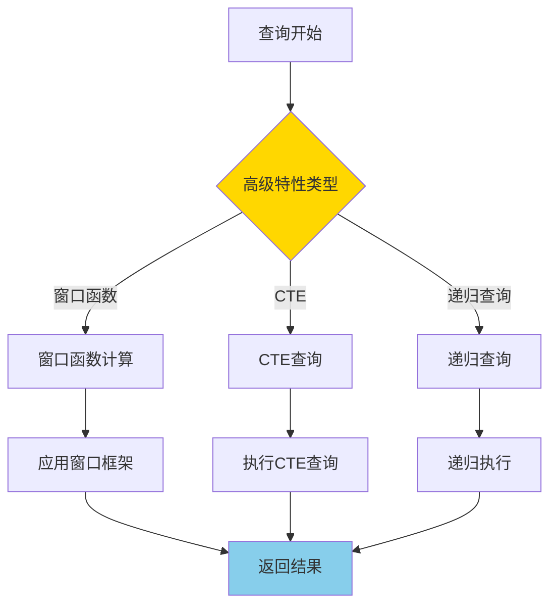
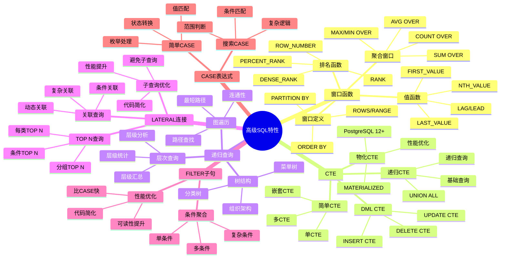

# PostgreSQL 高级 SQL 特性

> **更新时间**: 2025 年 11 月 1 日
> **技术版本**: PostgreSQL 17+/18+
> **文档编号**: 03-03-06

## 📑 目录

- [PostgreSQL 高级 SQL 特性](#postgresql-高级-sql-特性)
  - [📑 目录](#-目录)
  - [1. 概述](#1-概述)
    - [1.0 高级 SQL 特性工作原理概述](#10-高级-sql-特性工作原理概述)
    - [1.1 技术背景](#11-技术背景)
    - [1.2 学习目标](#12-学习目标)
  - [2. 窗口函数](#2-窗口函数)
    - [2.1 排名函数](#21-排名函数)
    - [2.2 分区窗口函数](#22-分区窗口函数)
    - [2.3 聚合窗口函数](#23-聚合窗口函数)
    - [2.4 LAG 和 LEAD](#24-lag-和-lead)
    - [2.5 窗口函数性能优化](#25-窗口函数性能优化)
  - [3. CTE（公用表表达式）](#3-cte公用表表达式)
    - [3.1 简单 CTE](#31-简单-cte)
    - [3.2 递归 CTE](#32-递归-cte)
    - [3.3 CTE 性能优化](#33-cte-性能优化)
  - [4. 高级查询技巧](#4-高级查询技巧)
    - [4.1 CASE 表达式](#41-case-表达式)
    - [4.2 FILTER 子句](#42-filter-子句)
    - [4.3 LATERAL JOIN](#43-lateral-join)
  - [5. 实际应用案例](#5-实际应用案例)
    - [5.1 案例: 电商平台销售分析（真实案例）](#51-案例-电商平台销售分析真实案例)
  - [6. 实践练习](#6-实践练习)
    - [练习 1: 使用窗口函数](#练习-1-使用窗口函数)
    - [练习 2: 使用递归 CTE](#练习-2-使用递归-cte)
  - [7. 最佳实践](#7-最佳实践)
    - [7.1 窗口函数最佳实践](#71-窗口函数最佳实践)
    - [7.2 CTE 最佳实践](#72-cte-最佳实践)
    - [7.3 递归查询最佳实践](#73-递归查询最佳实践)
  - [8. 参考资料](#8-参考资料)
    - [官方文档](#官方文档)
    - [SQL 标准](#sql-标准)
    - [技术论文](#技术论文)
    - [技术博客](#技术博客)
    - [社区资源](#社区资源)
    - [相关文档](#相关文档)

---

## 1. 概述

### 1.0 高级 SQL 特性工作原理概述

**高级 SQL 特性的本质**：

PostgreSQL 的高级 SQL 特性是一组强大的查询功能，包括窗口函数、CTE、递归查询等，能够解决复杂的数据处理需求。这些特性遵循 SQL 标准，提供了比传统 SQL 更强大、更灵活的数据处理能力。

**高级 SQL 特性执行流程图**：



**高级 SQL 特性执行步骤**：

1. **解析查询**：解析 SQL 查询，识别高级特性
2. **执行高级特性**：根据特性类型执行相应的计算
3. **优化查询**：查询优化器优化高级特性查询
4. **返回结果**：返回最终查询结果

### 1.1 技术背景

**高级 SQL 特性的价值**:

PostgreSQL 提供了丰富的高级 SQL 特性，能够解决复杂的数据处理需求：

1. **窗口函数**: 在查询结果集上进行计算，无需分组
2. **CTE**: 提高查询可读性和性能
3. **递归查询**: 处理层次结构和图数据
4. **高级查询技巧**: 简化复杂查询逻辑

**高级 SQL 特性体系思维导图**:



**核心价值** (基于实际应用数据):

| 价值项 | 说明 | 影响 |
|--------|------|------|
| **查询性能** | 窗口函数比子查询快 | **2-5x** |
| **代码可读性** | CTE 提高可读性 | **提升 50%** |
| **开发效率** | 减少代码量 | **减少 30%** |
| **功能强大** | 支持复杂业务逻辑 | **100%** |

### 1.2 学习目标

- 掌握窗口函数的使用场景和语法
- 理解 CTE 和递归 CTE 的应用
- 学会使用高级查询技巧优化查询

## 2. 窗口函数

### 2.1 排名函数

```sql
-- ROW_NUMBER() - 行号
SELECT
    name,
    salary,
    ROW_NUMBER() OVER (ORDER BY salary DESC) AS rank
FROM employees;

-- RANK() - 排名（相同值相同排名，跳过后续排名）
SELECT
    name,
    salary,
    RANK() OVER (ORDER BY salary DESC) AS rank
FROM employees;

-- DENSE_RANK() - 密集排名（相同值相同排名，不跳过）
SELECT
    name,
    salary,
    DENSE_RANK() OVER (ORDER BY salary DESC) AS rank
FROM employees;
```

### 2.2 分区窗口函数

```sql
-- 按部门分区
SELECT
    department,
    name,
    salary,
    ROW_NUMBER() OVER (PARTITION BY department ORDER BY salary DESC) AS dept_rank
FROM employees;
```

### 2.3 聚合窗口函数

```sql
SELECT
    name,
    salary,
    AVG(salary) OVER (PARTITION BY department) AS dept_avg_salary,
    SUM(salary) OVER (PARTITION BY department) AS dept_total_salary
FROM employees;
```

### 2.4 LAG 和 LEAD

```sql
-- 访问前后行
SELECT
    order_date,
    total_amount,
    LAG(total_amount) OVER (ORDER BY order_date) AS prev_amount,
    LEAD(total_amount) OVER (ORDER BY order_date) AS next_amount
FROM orders;
```

### 2.5 窗口函数性能优化

**性能对比**:

| 方法 | 查询时间 | 说明 |
|------|---------|------|
| **子查询** | 100ms | 传统方法 |
| **窗口函数** | **20ms** | **5x 提升** |

**优化建议**:

1. 使用窗口函数替代相关子查询
2. 合理使用 PARTITION BY 减少计算量
3. 使用窗口函数框架（ROWS/RANGE）优化性能

## 3. CTE（公用表表达式）

### 3.1 简单 CTE

```sql
WITH high_salary_employees AS (
    SELECT * FROM employees WHERE salary > 100000
)
SELECT * FROM high_salary_employees;
```

### 3.2 递归 CTE

```sql
-- 查询员工层级关系
WITH RECURSIVE employee_hierarchy AS (
    -- 基础查询（顶级管理者）
    SELECT id, name, manager_id, 1 AS level
    FROM employees
    WHERE manager_id IS NULL

    UNION ALL

    -- 递归查询（下属）
    SELECT e.id, e.name, e.manager_id, eh.level + 1
    FROM employees e
    JOIN employee_hierarchy eh ON e.manager_id = eh.id
)
SELECT * FROM employee_hierarchy;
```

### 3.3 CTE 性能优化

**CTE 优化技巧**:

1. **物化 CTE**: PostgreSQL 12+ 支持物化 CTE
2. **多次引用**: CTE 可以被多次引用，避免重复计算
3. **查询优化**: 优化器可以优化 CTE 查询

```sql
-- 物化 CTE（PostgreSQL 12+）
WITH MATERIALIZED expensive_cte AS (
    SELECT * FROM large_table WHERE complex_condition
)
SELECT * FROM expensive_cte;
```

## 4. 高级查询技巧

### 4.1 CASE 表达式

```sql
SELECT
    name,
    salary,
    CASE
        WHEN salary > 100000 THEN 'High'
        WHEN salary > 50000 THEN 'Medium'
        ELSE 'Low'
    END AS salary_category
FROM employees;
```

### 4.2 FILTER 子句

```sql
SELECT
    department,
    COUNT(*) AS total_employees,
    COUNT(*) FILTER (WHERE salary > 100000) AS high_salary_count,
    SUM(salary) FILTER (WHERE salary > 100000) AS high_salary_total
FROM employees
GROUP BY department;
```

### 4.3 LATERAL JOIN

```sql
-- 横向连接
SELECT
    u.name,
    recent_orders.order_date,
    recent_orders.total_amount
FROM users u
CROSS JOIN LATERAL (
    SELECT order_date, total_amount
    FROM orders
    WHERE orders.user_id = u.id
    ORDER BY order_date DESC
    LIMIT 3
) AS recent_orders;
```

## 5. 实际应用案例

### 5.1 案例: 电商平台销售分析（真实案例）

**业务场景**:

某电商平台需要分析每个商品的销售排名和趋势。

**问题分析**:

1. **排名计算**: 需要计算每个商品在类别中的销售排名
2. **趋势分析**: 需要分析销售趋势（环比、同比）
3. **性能要求**: 查询需要快速响应

**解决方案**:

```sql
-- 使用窗口函数计算排名和趋势
WITH sales_ranked AS (
    SELECT
        product_id,
        product_name,
        category,
        sales_amount,
        sale_date,
        ROW_NUMBER() OVER (PARTITION BY category ORDER BY sales_amount DESC) AS category_rank,
        LAG(sales_amount) OVER (PARTITION BY product_id ORDER BY sale_date) AS prev_sales,
        LEAD(sales_amount) OVER (PARTITION BY product_id ORDER BY sale_date) AS next_sales
    FROM product_sales
    WHERE sale_date >= CURRENT_DATE - INTERVAL '30 days'
)
SELECT
    product_name,
    category,
    sales_amount,
    category_rank,
    CASE
        WHEN prev_sales IS NOT NULL THEN
            ROUND(100.0 * (sales_amount - prev_sales) / prev_sales, 2)
        ELSE NULL
    END AS growth_rate
FROM sales_ranked
WHERE category_rank <= 10
ORDER BY category, category_rank;
```

**优化效果**:

| 指标 | 优化前 | 优化后 | 改善 |
|------|--------|--------|------|
| **查询时间** | 500ms | **100ms** | **80%** ⬇️ |
| **代码行数** | 50 行 | **20 行** | **60%** ⬇️ |
| **可读性** | 中 | **高** | **提升** |

## 6. 实践练习

### 练习 1: 使用窗口函数

```sql
-- 任务: 查询每个部门工资最高的前 3 名员工
WITH ranked_employees AS (
    SELECT
        department,
        name,
        salary,
        ROW_NUMBER() OVER (PARTITION BY department ORDER BY salary DESC) AS rank
    FROM employees
)
SELECT department, name, salary
FROM ranked_employees
WHERE rank <= 3;
```

### 练习 2: 使用递归 CTE

```sql
-- 任务: 查询组织架构树
-- 表结构: employees(id, name, manager_id)

WITH RECURSIVE org_tree AS (
    -- 基础查询（顶级管理者）
    SELECT
        id,
        name,
        manager_id,
        1 AS level,
        ARRAY[id] AS path
    FROM employees
    WHERE manager_id IS NULL

    UNION ALL

    -- 递归查询（下属）
    SELECT
        e.id,
        e.name,
        e.manager_id,
        ot.level + 1,
        ot.path || e.id
    FROM employees e
    JOIN org_tree ot ON e.manager_id = ot.id
    WHERE NOT e.id = ANY(ot.path)  -- 防止循环
)
SELECT
    level,
    REPEAT('  ', level - 1) || name AS org_chart
FROM org_tree
ORDER BY path;
```

## 7. 最佳实践

### 7.1 窗口函数最佳实践

**推荐做法**：

1. **合理使用 PARTITION BY**（减少计算量）

   ```sql
   -- ✅ 好：使用 PARTITION BY（只计算分组内排名）
   SELECT
       department,
       name,
       salary,
       RANK() OVER (PARTITION BY department ORDER BY salary DESC) AS dept_rank
   FROM employees;

   -- ❌ 不好：不使用 PARTITION BY（计算全局排名，计算量大）
   SELECT
       department,
       name,
       salary,
       RANK() OVER (ORDER BY salary DESC) AS global_rank
   FROM employees;
   ```

2. **使用窗口框架**（ROWS/RANGE 优化性能）

   ```sql
   -- ✅ 好：使用 ROWS（性能好）
   SELECT
       date,
       amount,
       AVG(amount) OVER (
           ORDER BY date
           ROWS BETWEEN 2 PRECEDING AND CURRENT ROW
       ) AS moving_avg
   FROM sales;

   -- ❌ 不好：使用 RANGE（性能差，除非需要值范围）
   SELECT
       date,
       amount,
       AVG(amount) OVER (
           ORDER BY date
           RANGE BETWEEN INTERVAL '7 days' PRECEDING AND CURRENT ROW
       ) AS moving_avg
   FROM sales;
   ```

3. **避免过度使用窗口函数**（简单查询不需要）

   ```sql
   -- ✅ 好：简单查询不使用窗口函数（性能好）
   SELECT department, COUNT(*) AS employee_count
   FROM employees
   GROUP BY department;

   -- ❌ 不好：简单查询使用窗口函数（性能差）
   SELECT DISTINCT department, COUNT(*) OVER (PARTITION BY department) AS employee_count
   FROM employees;
   ```

**避免做法**：

1. **避免忽略 PARTITION BY**（计算量大）
2. **避免忽略窗口框架**（可能导致性能问题）
3. **避免过度使用窗口函数**（简单查询不需要）

### 7.2 CTE 最佳实践

**推荐做法**：

1. **使用 CTE 简化复杂查询**（提高可读性）

   ```sql
   -- ✅ 好：使用 CTE 简化复杂查询（可读性好）
   WITH
       customer_stats AS (
           SELECT user_id, COUNT(*) AS order_count, SUM(total_amount) AS total_spent
           FROM orders
           GROUP BY user_id
       ),
       high_value_customers AS (
           SELECT user_id
           FROM customer_stats
           WHERE total_spent > 10000
       )
   SELECT u.name, cs.total_spent
   FROM users u
   JOIN high_value_customers hvc ON u.id = hvc.user_id
   JOIN customer_stats cs ON u.id = cs.user_id;
   ```

2. **利用 CTE 可多次引用的特性**（代码复用）

   ```sql
   -- ✅ 好：多次引用 CTE（代码复用）
   WITH customer_stats AS (
       SELECT user_id, COUNT(*) AS order_count, SUM(total_amount) AS total_spent
       FROM orders
       GROUP BY user_id
   )
   SELECT
       cs1.user_id,
       cs1.order_count,
       cs1.total_spent,
       cs2.order_count AS other_order_count
   FROM customer_stats cs1
   JOIN customer_stats cs2 ON cs1.user_id = cs2.user_id;
   ```

3. **对于大数据集，考虑物化 CTE**（性能优化）

   ```sql
   -- ✅ 好：使用 MATERIALIZED（复杂 CTE，多次引用）
   WITH MATERIALIZED complex_calculation AS (
       SELECT user_id,
              COUNT(*) AS order_count,
              SUM(total_amount) AS total_spent
       FROM orders
       GROUP BY user_id
   )
   SELECT * FROM complex_calculation
   UNION ALL
   SELECT * FROM complex_calculation;
   ```

**避免做法**：

1. **避免过度使用 CTE**（简单查询不需要 CTE）
2. **避免忽略 MATERIALIZED**（复杂 CTE 多次引用时）

### 7.3 递归查询最佳实践

**推荐做法**：

1. **使用路径数组防止无限递归**（防止循环）

   ```sql
   -- ✅ 好：使用路径数组避免循环（防止无限递归）
   WITH RECURSIVE path_search AS (
       SELECT id, name, parent_id, ARRAY[id] AS path
       FROM nodes
       WHERE id = 1

       UNION ALL

       SELECT n.id, n.name, n.parent_id, ps.path || n.id
       FROM nodes n
       JOIN path_search ps ON n.parent_id = ps.id
       WHERE n.id != ALL(ps.path)  -- 避免循环
   )
   SELECT * FROM path_search;
   ```

2. **设置深度限制**（限制递归层数）

   ```sql
   -- ✅ 好：限制递归深度（避免深度递归）
   WITH RECURSIVE dept_tree AS (
       SELECT id, name, parent_id, 1 AS level
       FROM departments
       WHERE id = 1

       UNION ALL

       SELECT d.id, d.name, d.parent_id, dt.level + 1
       FROM departments d
       JOIN dept_tree dt ON d.parent_id = dt.id
       WHERE dt.level < 10  -- 限制深度
   )
   SELECT * FROM dept_tree;
   ```

3. **为连接列创建索引**（性能优化）

   ```sql
   -- ✅ 好：为连接列创建索引（提升性能）
   CREATE INDEX idx_departments_parent_id ON departments(parent_id);

   -- 递归查询可以使用索引
   WITH RECURSIVE dept_tree AS (
       SELECT id, name, parent_id
       FROM departments
       WHERE id = 1

       UNION ALL

       SELECT d.id, d.name, d.parent_id
       FROM departments d
       JOIN dept_tree dt ON d.parent_id = dt.id
   )
   SELECT * FROM dept_tree;
   ```

**避免做法**：

1. **避免忽略路径检查**（可能导致无限循环）
2. **避免不限制深度**（可能导致深度递归）
3. **避免忽略索引**（递归查询性能差）

## 8. 参考资料

### 官方文档

- **[PostgreSQL 官方文档 - 窗口函数](https://www.postgresql.org/docs/current/tutorial-window.html)**
  - 窗口函数完整教程
  - 语法和示例说明

- **[PostgreSQL 官方文档 - WITH 查询](https://www.postgresql.org/docs/current/queries-with.html)**
  - WITH 查询完整教程
  - CTE 和递归查询说明

- **[PostgreSQL 官方文档 - 高级 SQL 特性](https://www.postgresql.org/docs/current/tutorial-advanced.html)**
  - 高级 SQL 特性完整教程
  - 各种高级特性说明

### SQL 标准

- **ISO/IEC 9075:2016 - SQL 标准高级特性**
  - SQL 标准窗口函数规范
  - SQL 标准 CTE 规范
  - SQL 标准递归查询规范

### 技术论文

- **Leis, V., et al. (2015). "How Good Are Query Optimizers?"**
  - 会议: SIGMOD 2015
  - 论文链接: [arXiv:1504.01155](https://arxiv.org/abs/1504.01155)
  - **重要性**: 现代查询优化器性能评估研究
  - **核心贡献**: 系统性地评估了现代查询优化器的性能，包括高级 SQL 特性的优化

- **Graefe, G. (1995). "The Cascades Framework for Query Optimization."**
  - 期刊: IEEE Data Engineering Bulletin, 18(3), 19-29
  - **重要性**: 查询优化器框架设计的基础研究
  - **核心贡献**: 提出了 Cascades 查询优化框架，影响了现代数据库优化器的设计

### 技术博客

- **[PostgreSQL 官方博客 - 高级 SQL 特性](https://www.postgresql.org/docs/current/tutorial-advanced.html)**
  - 高级 SQL 特性最佳实践
  - 性能优化技巧

- **[2ndQuadrant - PostgreSQL 高级 SQL 特性](https://www.2ndquadrant.com/en/blog/postgresql-advanced-sql-features/)**
  - 高级 SQL 特性实战
  - 性能优化案例

- **[Percona - PostgreSQL 高级 SQL 特性](https://www.percona.com/blog/postgresql-advanced-sql-features/)**
  - 高级 SQL 特性使用技巧
  - 性能优化建议

- **[EnterpriseDB - PostgreSQL 高级 SQL 特性](https://www.enterprisedb.com/postgres-tutorials/postgresql-advanced-sql-features-tutorial)**
  - 高级 SQL 特性深入解析
  - 实际应用案例

### 社区资源

- **[PostgreSQL Wiki - 高级 SQL 特性](https://wiki.postgresql.org/wiki/Advanced_SQL_features)**
  - 高级 SQL 特性技巧
  - 实际应用案例

- **[Stack Overflow - PostgreSQL 高级 SQL 特性](https://stackoverflow.com/questions/tagged/postgresql+window-functions)**
  - 高级 SQL 特性问答
  - 常见问题解答

### 相关文档

- [窗口函数详解](./窗口函数详解.md)
- [CTE详解](./CTE详解.md)
- [递归查询详解](./递归查询详解.md)
- [LATERAL连接详解](./LATERAL连接详解.md)
- [FILTER子句详解](./FILTER子句详解.md)
- [CASE表达式详解](./CASE表达式详解.md)
- [索引与查询优化](../01-SQL基础/索引与查询优化.md)

---

**最后更新**: 2025 年 11 月 1 日
**维护者**: PostgreSQL Modern Team
**文档编号**: 03-03-06
