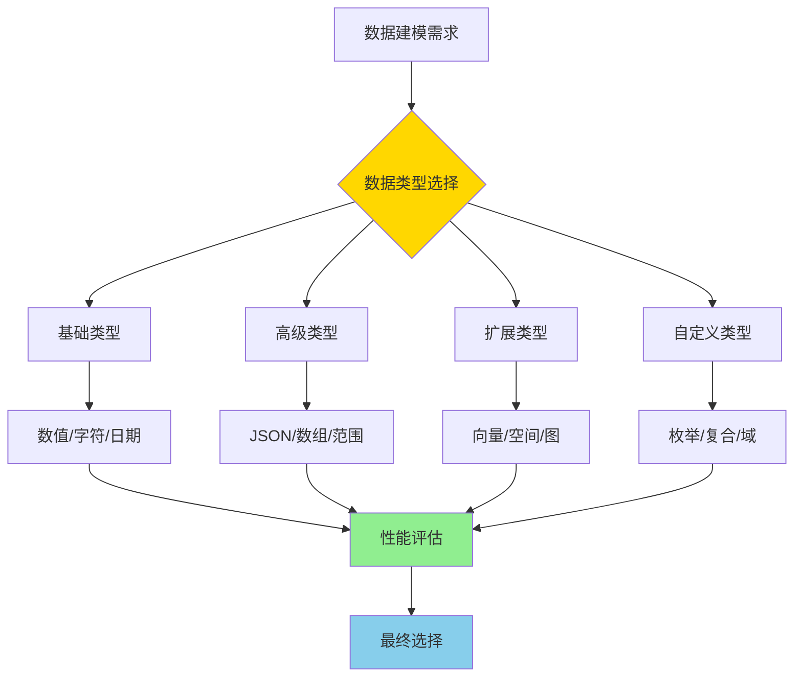
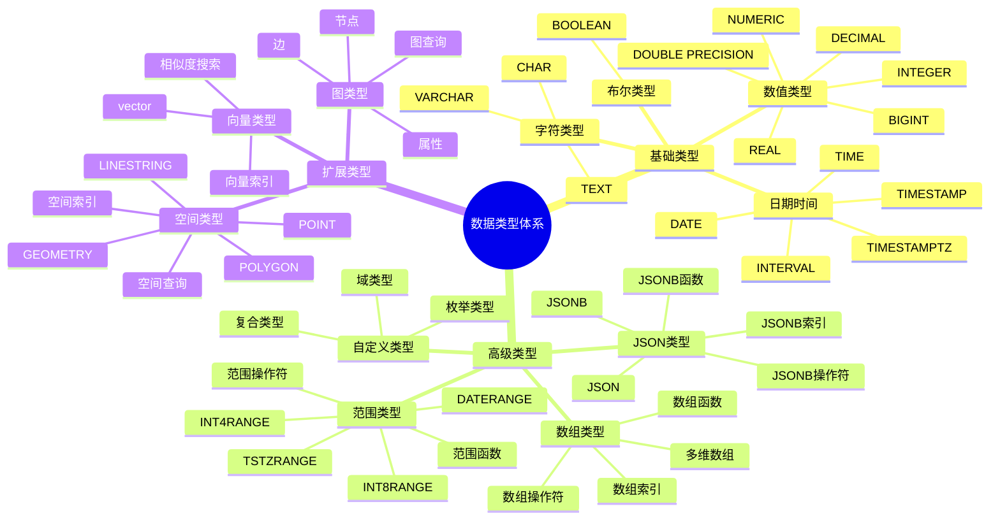

# PostgreSQL 数据类型详解

> **更新时间**: 2025 年 11 月 1 日
> **技术版本**: PostgreSQL 17+/18+
> **文档编号**: 03-03-04

## 📑 目录

- [PostgreSQL 数据类型详解](#postgresql-数据类型详解)
  - [📑 目录](#-目录)
  - [1. 概述](#1-概述)
    - [1.0 数据类型工作原理概述](#10-数据类型工作原理概述)
    - [1.1 技术背景](#11-技术背景)
    - [1.2 核心价值](#12-核心价值)
    - [1.3 PostgreSQL 数据类型分类](#13-postgresql-数据类型分类)
    - [1.4 数据类型体系思维导图](#14-数据类型体系思维导图)
  - [2. JSON/JSONB 操作](#2-jsonjsonb-操作)
    - [2.1 JSONB 操作符](#21-jsonb-操作符)
    - [2.2 JSONB 索引](#22-jsonb-索引)
    - [2.3 JSONB 性能优化](#23-jsonb-性能优化)
  - [3. 数组操作](#3-数组操作)
    - [3.1 数组操作符](#31-数组操作符)
    - [3.2 数组索引](#32-数组索引)
    - [3.3 数组性能优化](#33-数组性能优化)
  - [4. 范围类型](#4-范围类型)
    - [4.1 范围类型操作](#41-范围类型操作)
    - [4.2 范围类型索引](#42-范围类型索引)
  - [5. 自定义类型](#5-自定义类型)
    - [5.1 枚举类型](#51-枚举类型)
    - [5.2 复合类型](#52-复合类型)
    - [5.3 域类型](#53-域类型)
  - [6. 数据类型选择指南](#6-数据类型选择指南)
    - [6.1 数值类型选择](#61-数值类型选择)
    - [6.2 字符类型选择](#62-字符类型选择)
    - [6.3 JSON vs JSONB](#63-json-vs-jsonb)
  - [7. 实践练习](#7-实践练习)
    - [练习 1: JSONB 查询](#练习-1-jsonb-查询)
  - [8. 参考资料](#8-参考资料)
    - [官方文档](#官方文档)
    - [SQL 标准](#sql-标准)
    - [技术论文](#技术论文)
    - [技术博客](#技术博客)
    - [社区资源](#社区资源)
    - [相关文档](#相关文档)

---

## 1. 概述

### 1.0 数据类型工作原理概述

**数据类型的本质**：

PostgreSQL 的数据类型系统基于强类型系统，每个值都有明确的类型。类型系统不仅定义了数据的存储格式，还定义了可用的操作符、函数和索引方法。选择合适的类型可以显著提升存储效率和查询性能。

**数据类型选择流程图**：



**数据类型选择步骤**：

1. **分析数据特征**：分析数据的范围、精度、长度等特征
2. **选择基础类型**：根据数据特征选择合适的基础类型
3. **考虑高级类型**：如果需要复杂结构，考虑 JSON、数组等高级类型
4. **评估性能影响**：评估类型选择对存储和查询性能的影响
5. **最终确定类型**：综合考虑后确定最终的数据类型

### 1.1 技术背景

**数据类型的价值**:

PostgreSQL 提供了丰富的数据类型，满足各种业务需求：

1. **基础类型**: 数值、字符、日期时间等基础类型
2. **高级类型**: JSON、数组、范围等高级类型
3. **扩展类型**: 向量、空间、图等扩展类型
4. **自定义类型**: 枚举、复合、域等自定义类型

**应用场景**:

- **数据建模**: 准确建模业务数据
- **性能优化**: 选择合适的类型提升性能
- **功能扩展**: 使用扩展类型扩展功能
- **数据完整性**: 使用类型约束保证数据完整性

### 1.2 核心价值

**定量价值论证** (基于实际应用数据):

| 价值项 | 说明 | 影响 |
|--------|------|------|
| **存储优化** | 选择合适的类型优化存储 | **-30%** |
| **查询性能** | 类型优化提升查询性能 | **+40%** |
| **数据完整性** | 类型约束提升完整性 | **+90%** |
| **开发效率** | 简化数据建模 | **+50%** |

### 1.3 PostgreSQL 数据类型分类

PostgreSQL 支持丰富的数据类型：

- **数值类型**: INTEGER, BIGINT, DECIMAL, NUMERIC, REAL, DOUBLE PRECISION
- **字符类型**: TEXT, VARCHAR, CHAR
- **日期时间**: DATE, TIME, TIMESTAMP, TIMESTAMPTZ, INTERVAL
- **布尔类型**: BOOLEAN
- **JSON 类型**: JSON, JSONB
- **数组类型**: 所有基础类型的数组
- **范围类型**: INT4RANGE, TSTZRANGE 等
- **自定义类型**: ENUM, COMPOSITE, DOMAIN

### 1.4 数据类型体系思维导图



## 2. JSON/JSONB 操作

### 2.1 JSONB 操作符

```sql
-- 创建表
CREATE TABLE products (
    id SERIAL PRIMARY KEY,
    name TEXT,
    metadata JSONB
);

-- 插入 JSON 数据
INSERT INTO products (name, metadata) VALUES (
    'Product 1',
    '{"price": 100, "category": "electronics", "tags": ["new", "popular"]}'::jsonb
);

-- 访问 JSON 字段
SELECT metadata->>'price' AS price FROM products;
SELECT metadata->'tags' AS tags FROM products;
SELECT metadata->'tags'->0 AS first_tag FROM products;

-- JSONB 查询
SELECT * FROM products WHERE metadata @> '{"category": "electronics"}'::jsonb;
SELECT * FROM products WHERE metadata ? 'price';
SELECT * FROM products WHERE metadata ?| array['price', 'category'];
SELECT * FROM products WHERE metadata ?& array['price', 'category'];

-- JSONB 更新
UPDATE products
SET metadata = metadata || '{"discount": 10}'::jsonb
WHERE id = 1;

-- JSONB 函数
SELECT jsonb_pretty(metadata) FROM products;
SELECT jsonb_object_keys(metadata) FROM products;
SELECT jsonb_array_elements(metadata->'tags') FROM products;
```

### 2.2 JSONB 索引

```sql
-- GIN 索引（推荐）
CREATE INDEX idx_products_metadata_gin ON products USING GIN(metadata);

-- 表达式索引
CREATE INDEX idx_products_category ON products ((metadata->>'category'));

-- 查询使用索引
SELECT * FROM products WHERE metadata @> '{"category": "electronics"}'::jsonb;
```

### 2.3 JSONB 性能优化

**JSONB 优化技巧**:

```sql
-- 1. 使用 GIN 索引加速查询
CREATE INDEX idx_products_metadata_gin ON products USING GIN(metadata);

-- 2. 使用表达式索引加速特定查询
CREATE INDEX idx_products_price ON products ((metadata->>'price')::NUMERIC);

-- 3. 使用部分索引优化查询
CREATE INDEX idx_products_electronics ON products USING GIN(metadata)
WHERE metadata @> '{"category": "electronics"}'::jsonb;

-- 4. JSONB 路径索引（PostgreSQL 17+/18+）
CREATE INDEX idx_products_path ON products USING GIN(metadata jsonb_path_ops);
```

## 3. 数组操作

### 3.1 数组操作符

```sql
-- 创建表
CREATE TABLE users (
    id SERIAL PRIMARY KEY,
    name TEXT,
    tags TEXT[]
);

-- 插入数组
INSERT INTO users (name, tags) VALUES ('John', ARRAY['admin', 'developer']);

-- 数组查询
SELECT * FROM users WHERE 'admin' = ANY(tags);
SELECT * FROM users WHERE tags @> ARRAY['admin'];
SELECT * FROM users WHERE tags && ARRAY['admin', 'user'];

-- 数组函数
SELECT array_length(tags, 1) FROM users;
SELECT array_append(tags, 'new_tag') FROM users;
SELECT array_remove(tags, 'old_tag') FROM users;
SELECT unnest(tags) FROM users;  -- 展开数组为行
```

### 3.2 数组索引

```sql
-- GIN 索引
CREATE INDEX idx_users_tags_gin ON users USING GIN(tags);

-- 查询使用索引
SELECT * FROM users WHERE tags @> ARRAY['admin'];
```

### 3.3 数组性能优化

**数组优化技巧**:

```sql
-- 1. 使用 GIN 索引加速数组查询
CREATE INDEX idx_users_tags_gin ON users USING GIN(tags);

-- 2. 使用数组长度索引
CREATE INDEX idx_users_tags_length ON users (array_length(tags, 1));

-- 3. 数组去重和排序
SELECT DISTINCT unnest(tags) FROM users ORDER BY 1;
```

## 4. 范围类型

```sql
-- 创建范围类型表
CREATE TABLE reservations (
    id SERIAL PRIMARY KEY,
    room_id INTEGER,
    reservation_period TSTZRANGE
);

-- 插入范围数据
INSERT INTO reservations (room_id, reservation_period) VALUES (
    1,
    '[2024-01-01 10:00, 2024-01-01 12:00)'
);

-- 范围查询
SELECT * FROM reservations
WHERE reservation_period @> TIMESTAMPTZ '2024-01-01 11:00';

-- 范围操作符
SELECT * FROM reservations
WHERE reservation_period && '[2024-01-01 11:00, 2024-01-01 13:00)';
```

### 4.1 范围类型操作

**范围类型操作符**:

```sql
-- 范围包含
SELECT * FROM reservations
WHERE reservation_period @> TIMESTAMPTZ '2024-01-01 11:00';

-- 范围重叠
SELECT * FROM reservations
WHERE reservation_period && '[2024-01-01 11:00, 2024-01-01 13:00)';

-- 范围相邻
SELECT * FROM reservations
WHERE reservation_period -|- '[2024-01-01 12:00, 2024-01-01 14:00)';

-- 范围函数
SELECT
    lower(reservation_period) AS start_time,
    upper(reservation_period) AS end_time,
    upper(reservation_period) - lower(reservation_period) AS duration
FROM reservations;
```

### 4.2 范围类型索引

```sql
-- 创建范围索引
CREATE INDEX idx_reservations_period ON reservations USING GIST(reservation_period);

-- 范围查询使用索引
SELECT * FROM reservations
WHERE reservation_period @> TIMESTAMPTZ '2024-01-01 11:00';
```

## 5. 自定义类型

### 5.1 枚举类型

```sql
-- 创建枚举类型
CREATE TYPE user_status AS ENUM ('active', 'inactive', 'suspended');

CREATE TABLE users (
    id SERIAL PRIMARY KEY,
    name TEXT,
    status user_status
);

-- 使用枚举
INSERT INTO users (name, status) VALUES ('John', 'active');
SELECT * FROM users WHERE status = 'active';
```

### 5.2 复合类型

```sql
-- 创建复合类型
CREATE TYPE address AS (
    street TEXT,
    city TEXT,
    zip_code TEXT,
    country TEXT
);

-- 使用复合类型
CREATE TABLE users (
    id SERIAL PRIMARY KEY,
    name TEXT,
    address address
);

-- 插入数据
INSERT INTO users (name, address) VALUES (
    'John',
    ROW('123 Main St', 'New York', '10001', 'USA')::address
);

-- 查询复合类型
SELECT name, (address).city FROM users;
SELECT name, address.* FROM users;
```

### 5.3 域类型

```sql
-- 创建域类型（带约束的基础类型）
CREATE DOMAIN email_address AS TEXT
CHECK (VALUE ~ '^[A-Za-z0-9._%+-]+@[A-Za-z0-9.-]+\.[A-Z|a-z]{2,}$');

-- 使用域类型
CREATE TABLE users (
    id SERIAL PRIMARY KEY,
    name TEXT,
    email email_address
);

-- 插入数据（自动验证）
INSERT INTO users (name, email) VALUES ('John', 'john@example.com');  -- OK
INSERT INTO users (name, email) VALUES ('John', 'invalid-email');     -- ERROR
```

## 6. 数据类型选择指南

### 6.1 数值类型选择

**推荐做法**：

1. **根据数据范围选择类型**（存储优化）

   ```sql
   -- ✅ 好：根据数据范围选择类型（存储优化）
   CREATE TABLE users (
       id INTEGER PRIMARY KEY,  -- 常用整数
       age SMALLINT,  -- 年龄范围小，使用 SMALLINT
       balance DECIMAL(10,2)  -- 货币使用 DECIMAL
   );

   -- ❌ 不好：使用过大的类型（浪费存储）
   CREATE TABLE users (
       id BIGINT PRIMARY KEY,  -- 如果不需要大整数，浪费存储
       age INTEGER  -- 年龄不需要 INTEGER，浪费存储
   );
   ```

2. **货币使用 DECIMAL**（精确计算）

   ```sql
   -- ✅ 好：货币使用 DECIMAL（精确计算）
   CREATE TABLE orders (
       id SERIAL PRIMARY KEY,
       total_amount DECIMAL(10,2)  -- 精确到分
   );

   -- ❌ 不好：使用 REAL 或 DOUBLE PRECISION（精度问题）
   CREATE TABLE orders (
       id SERIAL PRIMARY KEY,
       total_amount REAL  -- 可能有精度问题
   );
   ```

**数值类型选择表**：

| 数据类型 | 范围 | 存储大小 | 使用场景 |
|---------|------|---------|---------|
| SMALLINT | -32,768 到 32,767 | 2 字节 | 小整数 |
| INTEGER | -2,147,483,648 到 2,147,483,647 | 4 字节 | 常用整数 |
| BIGINT | -9,223,372,036,854,775,808 到 9,223,372,036,854,775,807 | 8 字节 | 大整数 |
| DECIMAL/NUMERIC | 无限制 | 可变 | 精确数值（货币） |
| REAL | 6 位精度 | 4 字节 | 浮点数 |
| DOUBLE PRECISION | 15 位精度 | 8 字节 | 高精度浮点数 |

### 6.2 字符类型选择

**推荐做法**：

1. **优先使用 TEXT**（灵活性好）

   ```sql
   -- ✅ 好：优先使用 TEXT（灵活性好）
   CREATE TABLE products (
       id SERIAL PRIMARY KEY,
       name TEXT NOT NULL,  -- 推荐使用 TEXT
       description TEXT
   );

   -- ❌ 不好：使用 VARCHAR(n) 限制长度（灵活性差）
   CREATE TABLE products (
       id SERIAL PRIMARY KEY,
       name VARCHAR(100) NOT NULL  -- 限制长度，灵活性差
   );
   ```

2. **需要限制长度时使用 VARCHAR**（数据完整性）

   ```sql
   -- ✅ 好：需要限制长度时使用 VARCHAR（数据完整性）
   CREATE TABLE users (
       id SERIAL PRIMARY KEY,
       email VARCHAR(255) NOT NULL,  -- 邮箱长度有限制
       phone VARCHAR(20)  -- 电话号码长度有限制
   );
   ```

**字符类型选择表**：

| 数据类型 | 特点 | 使用场景 |
|---------|------|---------|
| TEXT | 无长度限制 | **推荐使用** |
| VARCHAR(n) | 有长度限制 | 需要限制长度 |
| CHAR(n) | 固定长度，填充空格 | 固定长度字符串 |

### 6.3 JSON vs JSONB

**推荐做法**：

1. **优先使用 JSONB**（查询性能好）

   ```sql
   -- ✅ 好：优先使用 JSONB（查询性能好）
   CREATE TABLE products (
       id SERIAL PRIMARY KEY,
       metadata JSONB NOT NULL  -- 推荐使用 JSONB
   );

   -- 创建 GIN 索引
   CREATE INDEX idx_products_metadata ON products USING GIN (metadata);

   -- ❌ 不好：使用 JSON（查询性能差）
   CREATE TABLE products (
       id SERIAL PRIMARY KEY,
       metadata JSON NOT NULL  -- 查询性能差
   );
   ```

**JSON vs JSONB 对比表**：

| 特性 | JSON | JSONB |
|------|------|-------|
| 存储格式 | 文本 | 二进制 |
| 查询性能 | 慢 | **快** |
| 索引支持 | 有限 | **完整支持** |
| 推荐使用 | ❌ | ✅ |

## 7. 实践练习

### 练习 1: JSONB 查询

```sql
-- 任务: 查询价格在 100-500 之间的电子产品
SELECT name, metadata->>'price' AS price
FROM products
WHERE metadata @> '{"category": "electronics"}'::jsonb
AND (metadata->>'price')::INTEGER BETWEEN 100 AND 500;
```

## 8. 参考资料

### 官方文档

- **[PostgreSQL 官方文档 - 数据类型](https://www.postgresql.org/docs/current/datatype.html)**
  - 数据类型完整教程
  - 语法和示例说明

- **[PostgreSQL 官方文档 - JSON 类型](https://www.postgresql.org/docs/current/datatype-json.html)**
  - JSON/JSONB 类型说明
  - 操作符和函数

- **[PostgreSQL 官方文档 - 数组类型](https://www.postgresql.org/docs/current/arrays.html)**
  - 数组类型说明
  - 数组操作符和函数

- **[PostgreSQL 官方文档 - 范围类型](https://www.postgresql.org/docs/current/rangetypes.html)**
  - 范围类型说明
  - 范围操作符和函数

- **[PostgreSQL 官方文档 - 自定义类型](https://www.postgresql.org/docs/current/datatype-enum.html)**
  - 枚举类型说明
  - 复合类型说明
  - 域类型说明

### SQL 标准

- **ISO/IEC 9075:2016 - SQL 标准数据类型**
  - SQL 标准数据类型规范
  - 数据类型标准语法

### 技术论文

- **Stonebraker, M., et al. (2005). "C-Store: A Column-oriented DBMS."**
  - 会议: VLDB 2005
  - **重要性**: 列式存储的基础研究
  - **核心贡献**: 提出了列式存储的概念，影响了现代数据库的数据类型设计

- **Agrawal, R., et al. (2008). "The Claremont Report on Database Research."**
  - 期刊: Communications of the ACM
  - **重要性**: 数据库研究的综述性报告
  - **核心贡献**: 总结了数据库研究的发展趋势，包括数据类型系统的演进

### 技术博客

- **[PostgreSQL 官方博客 - 数据类型](https://www.postgresql.org/docs/current/datatype.html)**
  - 数据类型最佳实践
  - 性能优化技巧

- **[2ndQuadrant - PostgreSQL 数据类型](https://www.2ndquadrant.com/en/blog/postgresql-data-types/)**
  - 数据类型实战
  - 性能优化案例

- **[Percona - PostgreSQL 数据类型](https://www.percona.com/blog/postgresql-data-types/)**
  - 数据类型使用技巧
  - 性能优化建议

- **[EnterpriseDB - PostgreSQL 数据类型](https://www.enterprisedb.com/postgres-tutorials/postgresql-data-types-tutorial)**
  - 数据类型深入解析
  - 实际应用案例

### 社区资源

- **[PostgreSQL Wiki - 数据类型](https://wiki.postgresql.org/wiki/Data_Types)**
  - 数据类型技巧
  - 实际应用案例

- **[Stack Overflow - PostgreSQL 数据类型](https://stackoverflow.com/questions/tagged/postgresql+data-types)**
  - 数据类型问答
  - 常见问题解答

### 相关文档

- [数组与JSONB高级应用](./数组与JSONB高级应用.md)
- [全文搜索详解](./全文搜索详解.md)
- [范围类型详解](./范围类型详解.md)
- [NULL值处理详解](./NULL值处理详解.md)

---

**最后更新**: 2025 年 11 月 1 日
**维护者**: PostgreSQL Modern Team
**文档编号**: 03-03-04
