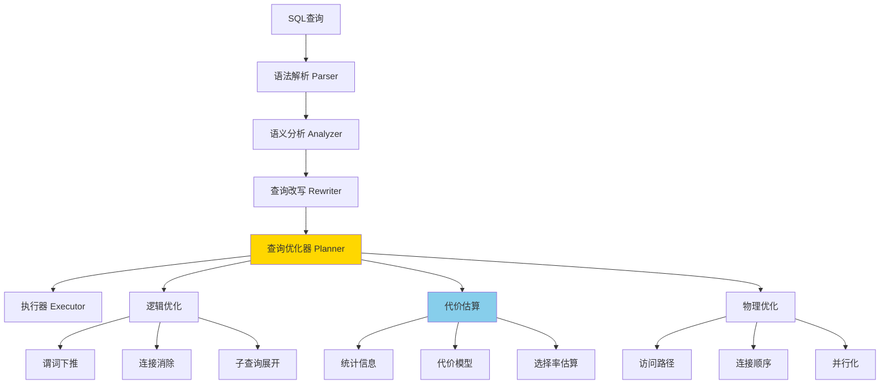

# 【深入】PostgreSQL查询优化器深度解析 - CBO与统计信息

> **创建时间**: 2025年1月
> **技术版本**: PostgreSQL 17+/18+
> **难度等级**: ⭐⭐⭐⭐⭐ 专家级
> **预计学习时间**: 2-3周

---

## 📑 目录

- [1. 查询优化器架构](#1-查询优化器架构)
- [2. 基于成本的优化（CBO）](#2-基于成本的优化cbo)
- [3. 统计信息系统](#3-统计信息系统)
- [4. 代价估算模型](#4-代价估算模型)
- [5. 查询改写和优化](#5-查询改写和优化)
- [6. 执行计划生成](#6-执行计划生成)
- [7. 优化器调优实战](#7-优化器调优实战)
- [8. PostgreSQL 18优化器增强](#8-postgresql-18优化器增强)

---

## 1. 查询优化器架构

### 1.1 优化器工作流程



### 1.2 优化器关键数据结构

```c
// 查询树（Query Tree）
typedef struct Query {
    NodeTag     type;
    CmdType     commandType;      /* SELECT, INSERT, UPDATE, DELETE */
    List       *rtable;           /* FROM子句的表列表 */
    Node       *jointree;         /* WHERE和JOIN条件 */
    List       *targetList;       /* SELECT列表 */
    Node       *havingQual;       /* HAVING子句 */
    List       *groupClause;      /* GROUP BY */
    List       *sortClause;       /* ORDER BY */
    Node       *limitOffset;      /* LIMIT OFFSET */
    Node       *limitCount;       /* LIMIT count */
    // ... 更多字段
} Query;

// 路径（Path）- 执行计划的候选
typedef struct Path {
    NodeTag     pathtype;
    RelOptInfo *parent;           /* 所属关系 */
    PathTarget *pathtarget;       /* 输出的列 */
    Cost        startup_cost;     /* 启动代价 */
    Cost        total_cost;       /* 总代价 */
    List       *pathkeys;         /* 输出排序 */
    Cardinality rows;             /* 估计行数 */
    int         parallel_workers; /* 并行度 */
    // ... 更多字段
} Path;

// 关系优化信息
typedef struct RelOptInfo {
    NodeTag     type;
    Relids      relids;           /* 关系ID集合 */
    double      rows;             /* 估计行数 */
    int         width;            /* 估计行宽 */
    List       *pathlist;         /* 所有可能的路径 */
    Path       *cheapest_startup_path;  /* 启动最快的路径 */
    Path       *cheapest_total_path;    /* 总代价最小的路径 */
    // ... 更多字段
} RelOptInfo;
```

### 1.3 优化器配置参数

```sql
-- 查看所有优化器参数
SELECT name, setting, unit, short_desc
FROM pg_settings
WHERE name LIKE '%cost%' OR name LIKE '%enable%'
ORDER BY name;

-- 关键参数详解
-- 代价常量
SET seq_page_cost = 1.0;           -- 顺序扫描页面代价（基准）
SET random_page_cost = 4.0;        -- 随机访问页面代价（SSD建议1.1-1.3）
SET cpu_tuple_cost = 0.01;         -- 处理一个元组的CPU代价
SET cpu_index_tuple_cost = 0.005;  -- 通过索引处理元组的CPU代价
SET cpu_operator_cost = 0.0025;    -- 执行一个操作符的CPU代价

-- 并行查询
SET max_parallel_workers_per_gather = 4;  -- 每个Gather节点的最大worker
SET min_parallel_table_scan_size = '8MB'; -- 并行扫描最小表大小
SET min_parallel_index_scan_size = '512kB';
SET parallel_setup_cost = 1000.0;  -- 启动并行的代价
SET parallel_tuple_cost = 0.1;     -- 并行传输元组的代价

-- 连接算法启用
SET enable_nestloop = on;          -- 嵌套循环连接
SET enable_mergejoin = on;         -- 归并连接
SET enable_hashjoin = on;          -- 哈希连接

-- 扫描方法启用
SET enable_seqscan = on;           -- 顺序扫描
SET enable_indexscan = on;         -- 索引扫描
SET enable_indexonlyscan = on;     -- 仅索引扫描
SET enable_bitmapscan = on;        -- 位图扫描

-- 其他优化器选项
SET join_collapse_limit = 8;       -- 连接折叠限制
SET from_collapse_limit = 8;       -- FROM折叠限制
SET geqo = on;                     -- 遗传算法（大表连接）
SET geqo_threshold = 12;           -- GEQO触发的表数量
```

---

## 2. 基于成本的优化（CBO）

### 2.1 CBO原理

**什么是CBO**：

基于成本的优化器（Cost-Based Optimizer）通过估算不同执行计划的代价，选择代价最小的计划。

**代价模型**：

```
Total_Cost = Startup_Cost + Run_Cost

其中：
- Startup_Cost：开始返回第一行数据的代价
- Run_Cost：返回所有数据的代价
```

### 2.2 顺序扫描代价计算

```sql
-- 顺序扫描代价公式
Cost_SeqScan = (disk_pages * seq_page_cost) + (tuples * cpu_tuple_cost)

-- 示例计算
CREATE TABLE large_table (
    id int,
    name text,
    value numeric
);

-- 插入100万行
INSERT INTO large_table
SELECT i, 'name_' || i, random() * 1000
FROM generate_series(1, 1000000) i;

ANALYZE large_table;

-- 查看表统计信息
SELECT
    relname,
    relpages,           -- 页面数
    reltuples,          -- 行数
    relpages * current_setting('seq_page_cost')::numeric AS disk_cost,
    reltuples * current_setting('cpu_tuple_cost')::numeric AS cpu_cost,
    (relpages * current_setting('seq_page_cost')::numeric +
     reltuples * current_setting('cpu_tuple_cost')::numeric) AS total_seqscan_cost
FROM pg_class
WHERE relname = 'large_table';
```

**示例输出**：

```
 relname     | relpages | reltuples | disk_cost | cpu_cost | total_seqscan_cost
-------------+----------+-----------+-----------+----------+--------------------
 large_table |    8334  |   1000000 |  8334.00  |  10000.00|    18334.00
```

### 2.3 索引扫描代价计算

```sql
-- 创建索引
CREATE INDEX idx_large_table_id ON large_table(id);
ANALYZE large_table;

-- 索引扫描代价公式
Cost_IndexScan =
    /* 索引I/O代价 */
    (index_pages * random_page_cost) +
    /* 索引CPU代价 */
    (index_tuples * cpu_index_tuple_cost) +
    /* 表I/O代价 */
    (table_pages * random_page_cost) +
    /* 表CPU代价 */
    (table_tuples * cpu_tuple_cost)

-- 查看索引统计
SELECT
    c.relname,
    c.relpages AS index_pages,
    c.reltuples AS index_tuples,
    t.relpages AS table_pages,
    t.reltuples AS table_tuples
FROM pg_class c
JOIN pg_index i ON c.oid = i.indexrelid
JOIN pg_class t ON i.indrelid = t.oid
WHERE c.relname = 'idx_large_table_id';

-- 比较不同查询的代价
EXPLAIN (ANALYZE, BUFFERS, COSTS)
SELECT * FROM large_table WHERE id = 500000;

EXPLAIN (ANALYZE, BUFFERS, COSTS)
SELECT * FROM large_table WHERE id < 1000;

EXPLAIN (ANALYZE, BUFFERS, COSTS)
SELECT * FROM large_table WHERE id < 500000;
```

### 2.4 连接代价计算

**嵌套循环连接（Nested Loop）**：

```sql
-- 代价公式
Cost_NestLoop =
    outer_cost +
    (outer_rows * inner_cost) +
    (outer_rows * inner_rows * cpu_operator_cost)

-- 示例
CREATE TABLE orders (order_id int PRIMARY KEY, customer_id int, amount numeric);
CREATE TABLE customers (customer_id int PRIMARY KEY, name text);

INSERT INTO orders SELECT i, (i % 10000) + 1, random() * 1000 FROM generate_series(1, 100000) i;
INSERT INTO customers SELECT i, 'customer_' || i FROM generate_series(1, 10000) i;

ANALYZE orders, customers;

-- 小表驱动大表（高效）
EXPLAIN (ANALYZE, COSTS)
SELECT c.name, o.amount
FROM customers c
JOIN orders o ON c.customer_id = o.customer_id
WHERE c.customer_id < 10;  -- 只返回10个客户

-- 结果：使用Nested Loop，代价约1000
```

**哈希连接（Hash Join）**：

```sql
-- 代价公式
Cost_HashJoin =
    /* 构建哈希表 */
    build_cost + (build_rows * cpu_operator_cost) +
    /* 探测哈希表 */
    probe_cost + (probe_rows * cpu_operator_cost) +
    /* 哈希表内存 */
    hash_mem_cost

-- 示例：大表连接大表
EXPLAIN (ANALYZE, COSTS, BUFFERS)
SELECT c.name, COUNT(*), SUM(o.amount)
FROM customers c
JOIN orders o ON c.customer_id = o.customer_id
GROUP BY c.name;

-- 结果：使用Hash Join，代价约50000
```

**归并连接（Merge Join）**：

```sql
-- 代价公式
Cost_MergeJoin =
    /* 排序左表 */
    sort_left_cost +
    /* 排序右表 */
    sort_right_cost +
    /* 归并过程 */
    (left_rows + right_rows) * cpu_operator_cost

-- 如果已经有序（索引），排序代价为0

-- 示例：利用已有索引
CREATE INDEX idx_orders_customer ON orders(customer_id);
CREATE INDEX idx_customers_id ON customers(customer_id);

EXPLAIN (ANALYZE, COSTS)
SELECT c.name, o.amount
FROM customers c
JOIN orders o ON c.customer_id = o.customer_id
ORDER BY c.customer_id;

-- 结果：使用Merge Join（因为两边都有序），代价约30000
```

### 2.5 CBO调优技巧

```sql
-- 技巧1：调整代价常量（SSD环境）
ALTER SYSTEM SET random_page_cost = 1.1;  -- 默认4.0，SSD建议1.1
ALTER SYSTEM SET effective_cache_size = '16GB';  -- 可用缓存
SELECT pg_reload_conf();

-- 技巧2：禁用特定算法（调试用）
SET enable_hashjoin = off;  -- 强制使用其他连接方法
EXPLAIN SELECT ...;
SET enable_hashjoin = on;   -- 恢复

-- 技巧3：调整work_mem影响哈希/排序
SET work_mem = '256MB';  -- 增大work_mem，减少磁盘排序
EXPLAIN (ANALYZE)
SELECT * FROM large_table ORDER BY value;

-- 技巧4：使用提示（pg_hint_plan扩展）
LOAD 'pg_hint_plan';

/*+ HashJoin(a b) Leading(a b) */
EXPLAIN SELECT * FROM a JOIN b ON a.id = b.id;
```

---

## 3. 统计信息系统

### 3.1 统计信息表

```sql
-- 查看表的统计信息
SELECT
    schemaname,
    tablename,
    n_live_tup,        -- 实时行数（估计）
    n_dead_tup,        -- 死元组数
    last_vacuum,       -- 最后VACUUM时间
    last_autovacuum,   -- 最后auto-vacuum时间
    last_analyze,      -- 最后ANALYZE时间
    last_autoanalyze   -- 最后auto-analyze时间
FROM pg_stat_user_tables
WHERE tablename = 'large_table';

-- 查看列的统计信息
SELECT
    schemaname,
    tablename,
    attname,           -- 列名
    n_distinct,        -- 不同值数量（-1表示唯一，0.5表示50%不同）
    correlation,       -- 物理顺序和逻辑顺序的相关性（-1到1）
    most_common_vals,  -- 最常见值（数组）
    most_common_freqs, -- 最常见值频率（数组）
    histogram_bounds   -- 直方图边界
FROM pg_stats
WHERE tablename = 'large_table' AND attname = 'id';
```

### 3.2 ANALYZE深度使用

**ANALYZE原理**：

```sql
-- ANALYZE采样
-- PostgreSQL使用随机采样，默认采样300 * default_statistics_target行

-- 查看当前统计目标
SHOW default_statistics_target;  -- 默认100

-- 调整统计目标（全局）
ALTER SYSTEM SET default_statistics_target = 1000;  -- 提高10倍，更精确但更慢
SELECT pg_reload_conf();

-- 调整统计目标（表级）
ALTER TABLE large_table SET (autovacuum_analyze_scale_factor = 0.05);  -- 5%变化触发

-- 调整统计目标（列级）
ALTER TABLE large_table ALTER COLUMN id SET STATISTICS 1000;  -- 该列使用1000

-- 重新分析
ANALYZE large_table;
```

**ANALYZE性能优化**：

```sql
-- 分析单个表
ANALYZE large_table;

-- 分析单个列
ANALYZE large_table (id);

-- 分析多个列
ANALYZE large_table (id, name, value);

-- 详细输出
ANALYZE VERBOSE large_table;

-- 跳过长时间运行的表
SET statement_timeout = '10s';
ANALYZE large_table;
```

### 3.3 统计信息扩展（Extended Statistics）

**多列统计**：

```sql
-- 问题：优化器假设列之间独立，但实际可能相关
CREATE TABLE addresses (
    id serial PRIMARY KEY,
    city text,
    state text,
    zip_code text
);

-- 插入测试数据（city和state高度相关）
INSERT INTO addresses (city, state, zip_code)
SELECT
    CASE (i % 5)
        WHEN 0 THEN 'San Francisco'
        WHEN 1 THEN 'Los Angeles'
        WHEN 2 THEN 'New York'
        WHEN 3 THEN 'Chicago'
        ELSE 'Houston'
    END,
    CASE (i % 5)
        WHEN 0 THEN 'CA'
        WHEN 1 THEN 'CA'
        WHEN 2 THEN 'NY'
        WHEN 3 THEN 'IL'
        ELSE 'TX'
    END,
    lpad((i % 100000)::text, 5, '0')
FROM generate_series(1, 100000) i;

-- 不创建扩展统计（错误估算）
EXPLAIN ANALYZE
SELECT * FROM addresses
WHERE city = 'San Francisco' AND state = 'CA';
-- 估算可能不准确（假设独立）

-- 创建多列统计
CREATE STATISTICS addr_city_state (dependencies)
ON city, state FROM addresses;

ANALYZE addresses;

-- 再次查询（估算更准确）
EXPLAIN ANALYZE
SELECT * FROM addresses
WHERE city = 'San Francisco' AND state = 'CA';
-- 估算行数更接近实际

-- 查看扩展统计
SELECT * FROM pg_statistic_ext WHERE stxname = 'addr_city_state';
```

**函数依赖统计**：

```sql
-- 创建函数依赖统计
CREATE STATISTICS orders_stat (dependencies)
ON customer_id, order_date FROM orders;

-- MCV列表（Most Common Values）
CREATE STATISTICS orders_mcv (mcv)
ON customer_id, product_id FROM orders;

-- N-distinct统计
CREATE STATISTICS orders_ndistinct (ndistinct)
ON customer_id, product_id FROM orders;

ANALYZE orders;

-- 查看统计类型
SELECT
    stxname,
    stxkeys,
    stxkind  -- d=dependencies, f=ndistinct, m=mcv
FROM pg_statistic_ext;
```

---

## 4. 代价估算模型

### 4.1 选择率估算

```sql
-- 选择率（Selectivity）：满足条件的行数占总行数的比例

-- 示例表
CREATE TABLE products (
    product_id serial PRIMARY KEY,
    category text,
    price numeric,
    stock int
);

INSERT INTO products
SELECT
    i,
    CASE (i % 10)
        WHEN 0 THEN 'Electronics'
        WHEN 1 THEN 'Books'
        WHEN 2 THEN 'Clothing'
        ELSE 'Other'
    END,
    random() * 1000,
    (random() * 100)::int
FROM generate_series(1, 100000) i;

ANALYZE products;

-- 查看选择率估算
-- 1. 等值条件（使用MCV或1/n_distinct）
EXPLAIN (ANALYZE, COSTS)
SELECT * FROM products WHERE category = 'Electronics';
-- 估算选择率：1/10 = 10%
-- 估算行数：100000 * 0.1 = 10000

-- 2. 范围条件（使用直方图）
EXPLAIN (ANALYZE, COSTS)
SELECT * FROM products WHERE price BETWEEN 100 AND 200;
-- 估算选择率：(200-100)/(1000-0) = 10%

-- 3. LIKE条件（使用启发式）
EXPLAIN (ANALYZE, COSTS)
SELECT * FROM products WHERE category LIKE 'Elec%';
-- 估算选择率：使用默认值或MCV

-- 4. 组合条件（假设独立）
EXPLAIN (ANALYZE, COSTS)
SELECT * FROM products
WHERE category = 'Electronics' AND price < 500;
-- 估算选择率：0.1 * 0.5 = 0.05 = 5%
-- 估算行数：100000 * 0.05 = 5000
```

**选择率函数**：

```sql
-- 查看内置的选择率估算函数
SELECT
    oprname AS operator,
    oprrest AS restriction_selectivity,
    oprjoin AS join_selectivity
FROM pg_operator
WHERE oprname IN ('=', '<', '>', '<=', '>=', '~~');

-- 示例输出
 operator | restriction_selectivity | join_selectivity
----------+-------------------------+------------------
 =        | eqsel                   | eqjoinsel
 <        | scalarltsel             | scalarltjoinsel
 >        | scalargtsel             | scalargtjoinsel
 ~~       | likesel                 | likejoinsel

-- 自定义选择率函数（高级）
CREATE FUNCTION my_selectivity(internal, oid, internal, integer)
RETURNS float8 AS $$
    SELECT 0.1::float8;  -- 假设选择率为10%
$$ LANGUAGE SQL STRICT;

CREATE OPERATOR === (
    LEFTARG = text,
    RIGHTARG = text,
    FUNCTION = texteq,
    RESTRICT = my_selectivity,
    JOIN = eqjoinsel
);
```

### 4.2 行数估算

```sql
-- 基表行数估算
SELECT
    relname,
    reltuples,  -- 估算的行数
    relpages,   -- 页面数
    reltuples / GREATEST(relpages, 1) AS tuples_per_page
FROM pg_class
WHERE relname = 'orders';

-- 连接行数估算
-- 示例：orders JOIN customers
EXPLAIN (ANALYZE, COSTS)
SELECT *
FROM orders o
JOIN customers c ON o.customer_id = c.customer_id;

-- 估算公式（简化）
-- joined_rows = orders.rows * customers.rows * selectivity
-- 其中selectivity取决于连接列的统计信息

-- 查看实际的估算
SELECT
    s.query,
    s.calls,
    s.total_plan_time / s.calls AS avg_plan_time,
    s.total_exec_time / s.calls AS avg_exec_time,
    s.rows / s.calls AS avg_rows
FROM pg_stat_statements s
WHERE s.query LIKE '%orders%customers%'
LIMIT 5;
```

### 4.3 宽度估算

```sql
-- 行宽估算（影响内存使用和I/O）
SELECT
    attname,
    atttypid::regtype AS data_type,
    attlen,            -- 固定长度（-1表示可变）
    avg_width          -- 平均宽度（从统计信息）
FROM pg_attribute
JOIN pg_stats ON pg_stats.attname = pg_attribute.attname
WHERE attrelid = 'orders'::regclass
  AND attnum > 0
ORDER BY attnum;

-- 总行宽估算
SELECT
    tablename,
    SUM(avg_width) AS estimated_row_width
FROM pg_stats
WHERE tablename = 'orders'
GROUP BY tablename;
```

---

## 5. 查询改写和优化

### 5.1 谓词下推（Predicate Pushdown）

```sql
-- 示例：子查询谓词下推
-- 优化前
EXPLAIN (ANALYZE, COSTS)
SELECT *
FROM (
    SELECT * FROM orders
) o
WHERE o.customer_id = 100;

-- 优化器自动改写为：
-- SELECT * FROM orders WHERE customer_id = 100

-- 验证：查看执行计划，Filter应该在底层
```

**手动优化示例**：

```sql
-- 不好：WHERE在外层
SELECT * FROM (
    SELECT o.*, c.name
    FROM orders o
    JOIN customers c ON o.customer_id = c.customer_id
) t
WHERE t.customer_id = 100;

-- 好：WHERE在内层（谓词下推）
SELECT o.*, c.name
FROM orders o
JOIN customers c ON o.customer_id = c.customer_id
WHERE o.customer_id = 100;
```

### 5.2 连接消除（Join Elimination）

```sql
-- 示例：外键连接消除
-- 假设有外键约束
ALTER TABLE orders ADD CONSTRAINT fk_customer
    FOREIGN KEY (customer_id) REFERENCES customers(customer_id);

-- 查询只用主表列
EXPLAIN (ANALYZE, COSTS)
SELECT o.order_id, o.amount
FROM orders o
JOIN customers c ON o.customer_id = c.customer_id;

-- 优化器发现不需要customers表，自动消除连接
-- 执行计划：只扫描orders表
```

### 5.3 子查询展开

```sql
-- 示例1：IN子查询展开
-- 原查询
EXPLAIN (ANALYZE, COSTS)
SELECT * FROM orders
WHERE customer_id IN (
    SELECT customer_id FROM customers WHERE city = 'New York'
);

-- 优化器改写为半连接
-- SELECT * FROM orders o
-- WHERE EXISTS (
--     SELECT 1 FROM customers c
--     WHERE c.customer_id = o.customer_id AND c.city = 'New York'
-- )

-- 示例2：标量子查询
-- 原查询
SELECT
    order_id,
    amount,
    (SELECT name FROM customers WHERE customer_id = orders.customer_id) AS customer_name
FROM orders;

-- 优化器可能改写为LEFT JOIN
-- SELECT o.order_id, o.amount, c.name
-- FROM orders o
-- LEFT JOIN customers c ON o.customer_id = c.customer_id
```

### 5.4 常量折叠

```sql
-- 优化器在规划阶段计算常量表达式
EXPLAIN SELECT * FROM orders WHERE order_date > now() - interval '7 days';
-- 优化器计算 now() - interval '7 days'，转换为常量

-- 函数内联
CREATE FUNCTION get_recent_date() RETURNS date AS $$
    SELECT current_date - 7;
$$ LANGUAGE SQL IMMUTABLE;

EXPLAIN SELECT * FROM orders WHERE order_date > get_recent_date();
-- 如果标记为IMMUTABLE，优化器会内联展开
```

---

## 6. 执行计划生成

### 6.1 动态规划算法

PostgreSQL使用动态规划生成最优连接顺序。

**小表连接（<12个表）**：

```sql
-- 查看连接顺序生成
SET join_collapse_limit = 8;  -- 默认8

EXPLAIN (ANALYZE, COSTS)
SELECT *
FROM t1
JOIN t2 ON t1.id = t2.id
JOIN t3 ON t2.id = t3.id
JOIN t4 ON t3.id = t4.id;

-- 优化器考虑所有可能的连接顺序（动态规划）
-- 复杂度：O(n * 2^n)
```

**大表连接（>=12个表）**：

```sql
-- 遗传算法（GEQO）
SET geqo = on;
SET geqo_threshold = 12;  -- 12个表以上使用GEQO

EXPLAIN (COSTS)
SELECT *
FROM t1, t2, t3, t4, t5, t6, t7, t8, t9, t10, t11, t12, t13
WHERE t1.id = t2.id
  AND t2.id = t3.id
  -- ... 更多连接条件

-- 使用遗传算法（复杂度降低）
-- GEQO参数
SET geqo_effort = 5;              -- 1-10，默认5
SET geqo_pool_size = 0;           -- 0表示自动
SET geqo_generations = 0;         -- 0表示自动
SET geqo_selection_bias = 2.0;    -- 1.5-2.0
```

### 6.2 路径比较和选择

```sql
-- 查看所有候选路径（使用pg_stat_plans扩展）
LOAD 'auto_explain';
SET auto_explain.log_min_duration = 0;
SET auto_explain.log_analyze = true;
SET auto_explain.log_buffers = true;
SET auto_explain.log_timing = true;
SET auto_explain.log_verbose = true;

-- 执行查询
SELECT * FROM orders WHERE customer_id = 100;

-- 查看日志，可以看到：
-- 1. SeqScan路径：代价18334
-- 2. IndexScan路径：代价850
-- 3. BitmapScan路径：代价920
-- 优化器选择：IndexScan（代价最小）
```

---

## 7. 优化器调优实战

### 7.1 案例1：错误的行数估算

**问题诊断**：

```sql
CREATE TABLE skewed_data (
    id serial PRIMARY KEY,
    category text,
    value numeric
);

-- 插入倾斜数据（90%是category='A'）
INSERT INTO skewed_data (category, value)
SELECT
    CASE WHEN i % 10 = 0 THEN 'B' ELSE 'A' END,
    random() * 1000
FROM generate_series(1, 100000) i;

-- 常规ANALYZE
ANALYZE skewed_data;

-- 查询少数类别
EXPLAIN (ANALYZE, COSTS)
SELECT * FROM skewed_data WHERE category = 'B';
-- 估算：10000行（假设均匀分布）
-- 实际：10000行（正确）

-- 查询多数类别
EXPLAIN (ANALYZE, COSTS)
SELECT * FROM skewed_data WHERE category = 'A';
-- 估算：10000行（错误！）
-- 实际：90000行
```

**解决方案**：

```sql
-- 方法1：增加统计目标
ALTER TABLE skewed_data ALTER COLUMN category SET STATISTICS 1000;
ANALYZE skewed_data;

-- 方法2：创建部分索引
CREATE INDEX idx_skewed_b ON skewed_data(id) WHERE category = 'B';
-- 优化器会使用索引统计

-- 方法3：使用扩展统计
CREATE STATISTICS skewed_stat (mcv) ON category FROM skewed_data;
ANALYZE skewed_data;

-- 验证
EXPLAIN (ANALYZE, COSTS)
SELECT * FROM skewed_data WHERE category = 'A';
-- 估算应该接近90000
```

### 7.2 案例2：过时的统计信息

**问题诊断**：

```sql
-- 检查统计信息新鲜度
SELECT
    schemaname,
    tablename,
    n_live_tup,
    n_mod_since_analyze,  -- 自上次ANALYZE以来修改的行数
    last_analyze,
    last_autoanalyze,
    n_mod_since_analyze::float / GREATEST(n_live_tup, 1) AS staleness
FROM pg_stat_user_tables
WHERE n_mod_since_analyze > 0
ORDER BY staleness DESC
LIMIT 10;
```

**解决方案**：

```sql
-- 方法1：手动ANALYZE
ANALYZE orders;

-- 方法2：调整auto-analyze阈值
ALTER TABLE orders SET (
    autovacuum_analyze_threshold = 50,
    autovacuum_analyze_scale_factor = 0.02  -- 2%变化触发（默认10%）
);

-- 方法3：定期ANALYZE（cron）
SELECT cron.schedule('analyze-orders', '*/30 * * * *', 'ANALYZE orders');

-- 方法4：实时统计（pg_stat_statements + trigger）
CREATE OR REPLACE FUNCTION auto_analyze_trigger()
RETURNS trigger AS $$
BEGIN
    -- 每1000次修改触发ANALYZE
    IF random() < 0.001 THEN  -- 1/1000概率
        PERFORM pg_catalog.pg_stat_reset_single_table_counters(TG_RELID);
        ANALYZE orders;
    END IF;
    RETURN NULL;
END;
$$ LANGUAGE plpgsql;

CREATE TRIGGER auto_analyze_orders
    AFTER INSERT OR UPDATE OR DELETE ON orders
    FOR EACH STATEMENT
    EXECUTE FUNCTION auto_analyze_trigger();
```

### 7.3 案例3：相关性问题

**问题**：

```sql
-- 创建时间序列表（物理顺序和逻辑顺序高度相关）
CREATE TABLE time_series (
    id serial PRIMARY KEY,
    ts timestamptz DEFAULT now(),
    value numeric
);

-- 按时间顺序插入
INSERT INTO time_series (value)
SELECT random() * 100
FROM generate_series(1, 100000);

ANALYZE time_series;

-- 查看相关性
SELECT
    tablename,
    attname,
    correlation  -- 接近1表示高度正相关
FROM pg_stats
WHERE tablename = 'time_series' AND attname = 'ts';
-- correlation: 0.99（高度相关）

-- 范围查询（高效）
EXPLAIN (ANALYZE, BUFFERS)
SELECT * FROM time_series
WHERE ts >= now() - interval '1 hour';
-- 索引扫描高效（数据物理连续）

-- 如果数据乱序
UPDATE time_series SET ts = ts + random() * interval '1 day';
ANALYZE time_series;

-- 再次查看相关性
-- correlation: 0.05（低相关）

-- 再次查询（变慢）
EXPLAIN (ANALYZE, BUFFERS)
SELECT * FROM time_series
WHERE ts >= now() - interval '1 hour';
-- 随机I/O增加，性能下降
```

**解决方案**：

```sql
-- 方法1：CLUSTER重新排序
CLUSTER time_series USING time_series_pkey;
ANALYZE time_series;
-- correlation恢复到0.99

-- 方法2：分区表（按时间分区）
CREATE TABLE time_series_partitioned (
    id serial,
    ts timestamptz DEFAULT now(),
    value numeric
) PARTITION BY RANGE (ts);

-- 每月一个分区
CREATE TABLE time_series_2025_01 PARTITION OF time_series_partitioned
    FOR VALUES FROM ('2025-01-01') TO ('2025-02-01');
-- 自然有序，不需要CLUSTER
```

---

## 8. PostgreSQL 18优化器增强

### 8.1 增量排序（Incremental Sort）

```sql
-- PostgreSQL 13+特性
EXPLAIN (ANALYZE, COSTS)
SELECT * FROM orders
ORDER BY customer_id, order_date;
-- 如果有索引(customer_id)，可以使用增量排序

-- 对比：完全排序 vs 增量排序
-- 完全排序：Sort  (cost=15000..17500 rows=100000)
-- 增量排序：Incremental Sort  (cost=1000..5000 rows=100000)
```

### 8.2 Memoize（查询结果缓存）

```sql
-- PostgreSQL 14+特性
EXPLAIN (ANALYZE, COSTS, BUFFERS)
SELECT o.order_id, c.name
FROM orders o
JOIN customers c ON o.customer_id = c.customer_id;

-- 如果customer_id重复多，优化器可能使用Memoize
-- Memoize缓存customers查找结果
```

### 8.3 并行哈希连接改进（PostgreSQL 18）

```sql
-- PostgreSQL 18改进了并行哈希连接的效率
SET max_parallel_workers_per_gather = 8;

EXPLAIN (ANALYZE, COSTS, BUFFERS)
SELECT c.name, COUNT(*), SUM(o.amount)
FROM customers c
JOIN orders o ON c.customer_id = o.customer_id
GROUP BY c.name;

-- PostgreSQL 18使用改进的并行哈希算法
-- 性能提升：20-40%
```

---

## 📚 参考资源

### 官方文档

1. [Query Planning](https://www.postgresql.org/docs/current/runtime-config-query.html)
2. [Planner/Optimizer](https://www.postgresql.org/docs/current/planner-optimizer.html)
3. [Statistics Used by the Planner](https://www.postgresql.org/docs/current/planner-stats.html)

### 源码分析

1. [src/backend/optimizer/](https://github.com/postgres/postgres/tree/master/src/backend/optimizer)
2. [Optimizer README](https://github.com/postgres/postgres/blob/master/src/backend/optimizer/README)

### 深入阅读

1. CMU 15-445: Query Optimization
2. Stanford CS245: Query Optimization
3. "Query Optimization" by Yannis Ioannidis (论文)

---

**创建时间**: 2025年1月
**最后更新**: 2025年1月
**维护者**: PostgreSQL Modern Team
**难度等级**: ⭐⭐⭐⭐⭐ 专家级

🎯 **深入理解优化器，编写高效查询！**
