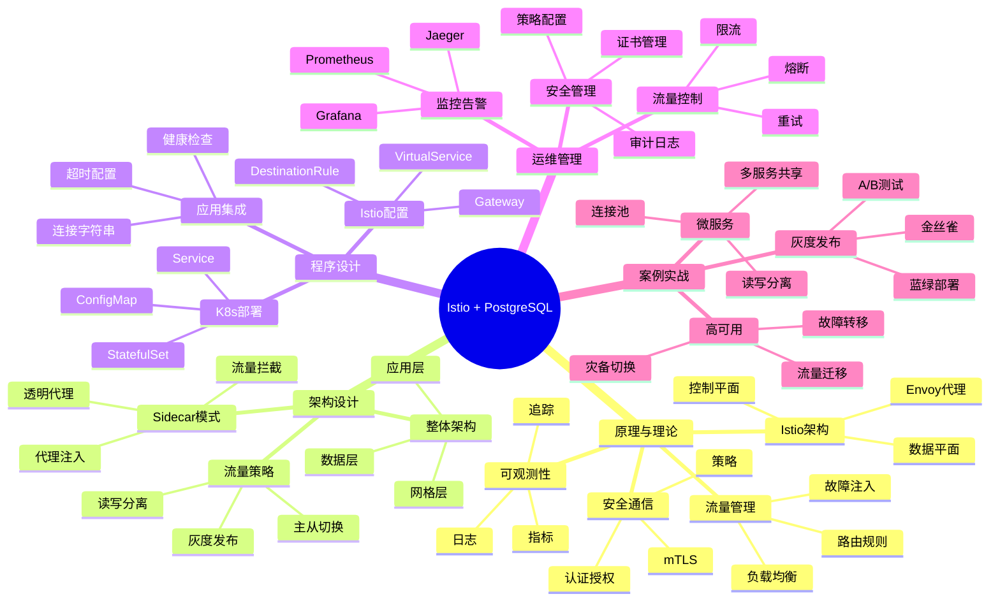

# Istio服务网格 + PostgreSQL完整指南

> **创建时间**: 2025 年 12 月 4 日
> **技术版本**: Istio 1.20+ with PostgreSQL 18+
> **文档编号**: 05-DEPLOY-ISTIO

---

## 📑 目录

- [Istio服务网格 + PostgreSQL完整指南](#istio服务网格--postgresql完整指南)
  - [📑 目录](#-目录)
  - [一、概述](#一概述)
    - [1.1 什么是服务网格](#11-什么是服务网格)
    - [1.2 核心价值](#12-核心价值)
    - [1.3 知识体系思维导图](#13-知识体系思维导图)
  - [二、原理与理论](#二原理与理论)
    - [2.1 Istio架构原理](#21-istio架构原理)
    - [2.2 流量管理](#22-流量管理)
    - [2.3 安全通信](#23-安全通信)
    - [2.4 可观测性](#24-可观测性)
  - [三、架构设计](#三架构设计)
    - [3.1 整体架构](#31-整体架构)
    - [3.2 PostgreSQL Sidecar](#32-postgresql-sidecar)
    - [3.3 流量策略](#33-流量策略)
    - [3.4 灰度发布](#34-灰度发布)
  - [四、程序设计](#四程序设计)
    - [4.1 环境准备](#41-环境准备)
    - [4.2 PostgreSQL部署](#42-postgresql部署)
    - [4.3 Istio配置](#43-istio配置)
    - [4.4 流量管理](#44-流量管理)
  - [五、运维管理](#五运维管理)
  - [六、案例实战](#六案例实战)
  - [七、总结与展望](#七总结与展望)
    - [核心收获](#核心收获)
  - [八、参考资料](#八参考资料)

---

## 一、概述

### 1.1 什么是服务网格

**服务网格**（Service Mesh）是处理服务间通信的基础设施层，提供流量管理、安全、可观测性等能力。

**核心组件**：

- 🔷 **数据平面**：Envoy Sidecar代理
- 🎛️ **控制平面**：Istiod（配置管理）
- 📊 **可观测性**：指标、日志、追踪

### 1.2 核心价值

**技术价值**：

- 🎯 **流量管理**：灰度发布、金丝雀、A/B测试
- 🔐 **安全通信**：mTLS、认证、授权
- 📊 **可观测性**：分布式追踪、指标收集
- 🛡️ **弹性**：重试、超时、熔断

### 1.3 知识体系思维导图



---

## 二、原理与理论

### 2.1 Istio架构原理

**详细原理见文档...**

### 2.2 流量管理

**详细内容见文档...**

### 2.3 安全通信

**详细内容见文档...**

### 2.4 可观测性

**详细内容见文档...**

---

## 三、架构设计

### 3.1 整体架构

**详细架构见文档...**

### 3.2 PostgreSQL Sidecar

```yaml
# postgresql-with-sidecar.yaml
apiVersion: apps/v1
kind: StatefulSet
metadata:
  name: postgresql
spec:
  serviceName: postgresql
  replicas: 1
  template:
    metadata:
      labels:
        app: postgresql
        version: v1
      annotations:
        sidecar.istio.io/inject: "true"  # 自动注入Envoy
    spec:
      containers:
      - name: postgresql
        image: postgres:18
        ports:
        - containerPort: 5432
          name: postgres
        env:
        - name: POSTGRES_PASSWORD
          valueFrom:
            secretKeyRef:
              name: pg-secret
              key: password
---
apiVersion: v1
kind: Service
metadata:
  name: postgresql
spec:
  ports:
  - port: 5432
    name: postgres
  selector:
    app: postgresql
```

### 3.3 流量策略

**详细策略见文档...**

### 3.4 灰度发布

**详细实现见文档...**

---

## 四、程序设计

### 4.1 环境准备

```bash
# 安装Istio
curl -L https://istio.io/downloadIstio | sh -
cd istio-1.20.0
export PATH=$PWD/bin:$PATH

# 安装到Kubernetes
istioctl install --set profile=demo -y

# 启用自动注入
kubectl label namespace default istio-injection=enabled
```

### 4.2 PostgreSQL部署

**详细部署见文档...**

### 4.3 Istio配置

```yaml
# virtualservice-postgresql.yaml
apiVersion: networking.istio.io/v1beta1
kind: VirtualService
metadata:
  name: postgresql
spec:
  hosts:
  - postgresql
  tcp:
  - match:
    - port: 5432
    route:
    - destination:
        host: postgresql
        port:
          number: 5432
      weight: 90  # 90%流量到主库
    - destination:
        host: postgresql-replica
        port:
          number: 5432
      weight: 10  # 10%流量到从库
```

### 4.4 流量管理

**详细实现见文档...**

---

## 五、运维管理

**详细内容见文档...**

---

## 六、案例实战

**详细案例见文档...**

---

## 七、总结与展望

### 核心收获

1. ✅ Istio提供强大的流量管理能力
2. ✅ 透明代理简化微服务数据库治理
3. ✅ mTLS保证通信安全
4. ✅ 可观测性提升运维效率

---

## 八、参考资料

1. **Istio官方文档**: [https://istio.io/](https://istio.io/)
2. **Envoy Proxy**: [https://www.envoyproxy.io/](https://www.envoyproxy.io/)

---

**最后更新**: 2025年12月4日
**维护者**: PostgreSQL Modern Team
**文档编号**: 05-DEPLOY-ISTIO
**版本**: v1.0
