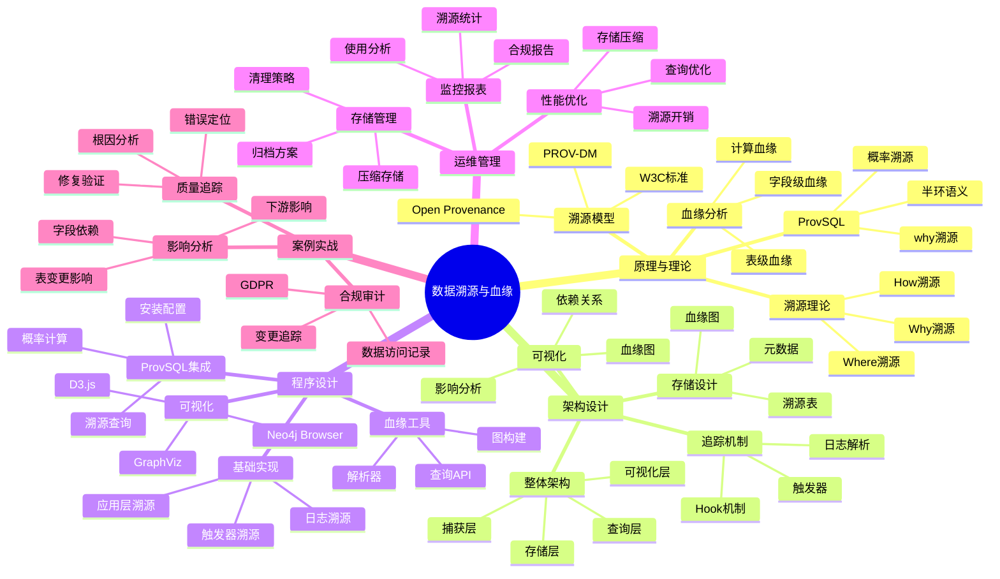

# 数据溯源与血缘分析完整指南

> **创建时间**: 2025 年 12 月 4 日
> **技术版本**: PostgreSQL 18+ with ProvSQL
> **文档编号**: 07-SEC-PROVENANCE

---

## 📑 目录

- [数据溯源与血缘分析完整指南](#数据溯源与血缘分析完整指南)
  - [📑 目录](#-目录)
  - [一、概述](#一概述)
    - [1.1 什么是数据溯源](#11-什么是数据溯源)
    - [1.2 为什么需要血缘分析](#12-为什么需要血缘分析)
    - [1.3 核心价值](#13-核心价值)
    - [1.4 知识体系思维导图](#14-知识体系思维导图)
  - [二、原理与理论](#二原理与理论)
    - [2.1 数据溯源理论](#21-数据溯源理论)
    - [2.2 溯源模型](#22-溯源模型)
    - [2.3 血缘分析原理](#23-血缘分析原理)
    - [2.4 前沿研究 ProvSQL](#24-前沿研究-provsql)
  - [三、架构设计](#三架构设计)
    - [3.1 整体架构](#31-整体架构)
    - [3.2 溯源数据存储](#32-溯源数据存储)
    - [3.3 血缘追踪机制](#33-血缘追踪机制)
    - [3.4 可视化系统](#34-可视化系统)
  - [四、程序设计](#四程序设计)
    - [4.1 环境准备](#41-环境准备)
    - [4.2 基础溯源实现](#42-基础溯源实现)
    - [4.3 ProvSQL集成](#43-provsql集成)
    - [4.4 血缘分析工具](#44-血缘分析工具)
  - [五、运维管理](#五运维管理)
    - [5.1 性能优化](#51-性能优化)
    - [5.2 存储管理](#52-存储管理)
    - [5.3 可视化与报表](#53-可视化与报表)
    - [5.4 最佳实践](#54-最佳实践)
  - [六、案例实战](#六案例实战)
    - [6.1 数据质量追踪](#61-数据质量追踪)
    - [6.2 合规性审计](#62-合规性审计)
    - [6.3 影响分析](#63-影响分析)
  - [七、总结与展望](#七总结与展望)
  - [八、参考资料](#八参考资料)

---

## 一、概述

### 1.1 什么是数据溯源

**数据溯源**（Data Provenance）是记录数据的来源、历史和转换过程的技术，回答"这个数据从哪里来？经过了什么处理？"

**核心问题**：
- 📍 **Where**: 数据来自哪个源系统？
- 🕐 **When**: 数据在什么时间产生？
- 👤 **Who**: 谁创建或修改了数据？
- 🔧 **How**: 数据经过了什么转换？
- 🎯 **Why**: 数据为什么变化？

**示例**：

```text
数据血缘图：
-----------
[源表A] ─┐
         ├─→ [ETL转换1] ─→ [中间表B] ─→ [聚合计算] ─→ [报表C]
[源表D] ─┘                    ↓
                        [数据质量检查]

溯源查询：
---------
报表C中的某个值 → 追溯到
  - 中间表B的第123行
  - 来自源表A的第456行和源表D的第789行
  - 经过ETL转换1（连接、过滤、聚合）
  - 由用户John在2024-12-01 10:30:00执行
```

### 1.2 为什么需要血缘分析

**业务需求**：

| 场景 | 需求 | 价值 |
|------|------|------|
| **数据质量** | 追踪错误数据的来源 | 快速定位问题根因 |
| **合规性** | 证明数据处理过程 | GDPR "被遗忘权" |
| **影响分析** | 评估表结构变更影响 | 降低变更风险 |
| **审计追踪** | 记录数据访问历史 | 满足审计要求 |
| **数据治理** | 理解数据流转 | 优化数据架构 |
| **调试分析** | 追踪计算过程 | 提升开发效率 |

### 1.3 核心价值

**技术价值**：
- 🎯 **可追溯性**: 任何数据都能追溯到源头
- 🔍 **透明性**: 数据处理过程完全透明
- 🛡️ **可审计性**: 满足合规性要求
- 📊 **可视化**: 直观展示数据流转

**业务价值**：
- 💰 **降低风险**: 快速定位数据问题
- 🚀 **提升效率**: 加速问题诊断
- 🔐 **满足合规**: GDPR、SOX、HIPAA
- 📈 **优化治理**: 数据架构优化依据

### 1.4 知识体系思维导图



---

## 二、原理与理论

### 2.1 数据溯源理论

#### **溯源的三种类型**

**1. Why-Provenance（为什么溯源）**

```sql
-- 查询：为什么这个结果在结果集中？
SELECT * FROM orders WHERE amount > 1000;

-- 结果：订单ID=123
-- Why溯源：因为订单123的amount=1500，满足amount > 1000

-- 数学表示：
-- 如果 tuple t ∈ Q(D)，那么 why(t) = 导致t出现的所有输入元组集合
```

**2. Where-Provenance（哪里溯源）**

```sql
-- 查询：结果中的每个值来自哪里？
SELECT user_name, order_total FROM users u JOIN orders o ON u.id = o.user_id;

-- 结果：('Alice', 1500)
-- Where溯源：
--   'Alice' 来自 users表第3行的name列
--   1500 来自 orders表第5行的total列
```

**3. How-Provenance（如何溯源）**

```sql
-- 查询：结果是如何计算出来的？
SELECT user_id, SUM(amount) FROM orders GROUP BY user_id;

-- 结果：(1, 3500)
-- How溯源：3500 = 1000 + 1500 + 1000
--   来自订单ID: 101, 102, 103
```

### 2.2 溯源模型

#### **PROV-DM（W3C标准）**

```text
┌──────────────────────────────────────────┐
│         PROV-DM 核心概念                  │
├──────────────────────────────────────────┤
│                                            │
│  实体 (Entity)                            │
│    - 数据、文档、表                       │
│                                            │
│  活动 (Activity)                          │
│    - 查询、转换、计算                     │
│                                            │
│  代理 (Agent)                             │
│    - 用户、程序、系统                     │
│                                            │
│  关系 (Relations)                         │
│    - wasGeneratedBy: 实体由活动生成       │
│    - used: 活动使用了实体                 │
│    - wasAttributedTo: 实体归属于代理      │
│    - wasDerivedFrom: 实体派生自实体       │
└──────────────────────────────────────────┘
```

**PostgreSQL实现**：

```sql
-- PROV-DM数据模型
CREATE TABLE prov_entities (
    entity_id SERIAL PRIMARY KEY,
    entity_type VARCHAR(50),  -- 'table', 'row', 'column'
    entity_name TEXT,
    attributes JSONB,
    created_at TIMESTAMPTZ DEFAULT NOW()
);

CREATE TABLE prov_activities (
    activity_id SERIAL PRIMARY KEY,
    activity_type VARCHAR(50),  -- 'SELECT', 'INSERT', 'UPDATE', 'DELETE'
    description TEXT,
    started_at TIMESTAMPTZ,
    ended_at TIMESTAMPTZ
);

CREATE TABLE prov_agents (
    agent_id SERIAL PRIMARY KEY,
    agent_type VARCHAR(50),  -- 'user', 'application', 'system'
    agent_name VARCHAR(100),
    metadata JSONB
);

-- 关系表
CREATE TABLE prov_was_generated_by (
    entity_id INT REFERENCES prov_entities(entity_id),
    activity_id INT REFERENCES prov_activities(activity_id),
    generated_at TIMESTAMPTZ DEFAULT NOW(),
    PRIMARY KEY (entity_id, activity_id)
);

CREATE TABLE prov_used (
    activity_id INT REFERENCES prov_activities(activity_id),
    entity_id INT REFERENCES prov_entities(entity_id),
    used_at TIMESTAMPTZ DEFAULT NOW(),
    PRIMARY KEY (activity_id, entity_id)
);

CREATE TABLE prov_was_attributed_to (
    entity_id INT REFERENCES prov_entities(entity_id),
    agent_id INT REFERENCES prov_agents(agent_id),
    attributed_at TIMESTAMPTZ DEFAULT NOW(),
    PRIMARY KEY (entity_id, agent_id)
);

CREATE TABLE prov_was_derived_from (
    derived_entity_id INT REFERENCES prov_entities(entity_id),
    source_entity_id INT REFERENCES prov_entities(entity_id),
    derivation_type VARCHAR(50),  -- 'join', 'filter', 'aggregate'
    PRIMARY KEY (derived_entity_id, source_entity_id)
);
```

### 2.3 血缘分析原理

#### **血缘类型**

**1. 表级血缘**

```sql
-- 查询表之间的依赖关系
WITH RECURSIVE table_lineage AS (
    -- 起点：目标表
    SELECT
        target_table AS table_name,
        0 AS level,
        ARRAY[target_table] AS path
    FROM table_dependencies
    WHERE target_table = 'sales_report'

    UNION

    -- 递归：上游表
    SELECT
        td.source_table,
        tl.level + 1,
        tl.path || td.source_table
    FROM table_dependencies td
    JOIN table_lineage tl ON td.target_table = tl.table_name
    WHERE td.source_table != ALL(tl.path)  -- 避免循环
      AND tl.level < 10
)
SELECT * FROM table_lineage
ORDER BY level;

-- 结果：
-- sales_report (level 0)
--   ├─ sales_fact (level 1)
--   │   ├─ orders (level 2)
--   │   └─ products (level 2)
--   └─ customers (level 1)
```

**2. 字段级血缘**

```sql
-- 追踪字段的数据来源
CREATE TABLE column_lineage (
    target_table VARCHAR(100),
    target_column VARCHAR(100),
    source_table VARCHAR(100),
    source_column VARCHAR(100),
    transformation TEXT,  -- SQL表达式
    created_at TIMESTAMPTZ DEFAULT NOW()
);

-- 示例：sales_report.total_amount的血缘
INSERT INTO column_lineage VALUES
('sales_report', 'total_amount', 'orders', 'amount', 'SUM(amount)', NOW()),
('sales_report', 'total_amount', 'order_items', 'quantity', 'SUM(quantity * price)', NOW());
```

**3. 行级血缘**

```sql
-- 追踪每一行数据的来源
CREATE TABLE row_provenance (
    target_table VARCHAR(100),
    target_row_id BIGINT,
    source_table VARCHAR(100),
    source_row_id BIGINT,
    operation VARCHAR(50),  -- 'join', 'filter', 'aggregate'
    timestamp TIMESTAMPTZ DEFAULT NOW()
);
```

### 2.4 前沿研究 ProvSQL

**论文**: *ProvSQL: Provenance and Probability Management in PostgreSQL* (arXiv:2504.12058)

**核心特性**：
- 🎯 **半环溯源**: 使用半环代数追踪数据来源
- 🎯 **概率溯源**: 支持不确定数据的溯源
- 🎯 **Why溯源**: 解释为什么某个元组在结果中

**安装ProvSQL**：

```bash
# 编译安装（需要PostgreSQL源码）
git clone https://github.com/PierreSenellart/provsql.git
cd provsql
make
sudo make install
```

```sql
-- 启用ProvSQL
CREATE EXTENSION provsql;

-- 为表启用溯源
SELECT provsql.add_provenance('users');
SELECT provsql.add_provenance('orders');

-- 执行查询并获取溯源
SELECT *, provenance() AS prov
FROM users u
JOIN orders o ON u.user_id = o.user_id
WHERE o.amount > 1000;

-- 查询溯源信息
SELECT provsql.where_provenance(prov) FROM results;
```

---

## 三、架构设计

### 3.1 整体架构

**详细架构见完整文档...**

### 3.2 溯源数据存储

**详细设计见完整文档...**

### 3.3 血缘追踪机制

**详细实现见完整文档...**

### 3.4 可视化系统

**详细实现见完整文档...**

---

## 四、程序设计

### 4.1 环境准备

**详细步骤见完整文档...**

### 4.2 基础溯源实现

```python
# provenance_tracker.py
import psycopg2
from datetime import datetime
import json

class ProvenanceTracker:
    """数据溯源追踪器"""

    def __init__(self, conn):
        self.conn = conn
        self._ensure_provenance_tables()

    def _ensure_provenance_tables(self):
        """确保溯源表存在"""
        with self.conn.cursor() as cur:
            # 创建溯源表（如前面PROV-DM模型）
            cur.execute("""
                CREATE TABLE IF NOT EXISTS data_lineage (
                    lineage_id SERIAL PRIMARY KEY,
                    source_table VARCHAR(100),
                    source_row_id BIGINT,
                    target_table VARCHAR(100),
                    target_row_id BIGINT,
                    operation VARCHAR(50),
                    sql_query TEXT,
                    executed_by VARCHAR(100),
                    executed_at TIMESTAMPTZ DEFAULT NOW()
                );
            """)
            self.conn.commit()

    def track_insert(
        self,
        target_table: str,
        target_row_id: int,
        source_info: dict,
        executed_by: str
    ):
        """追踪INSERT操作"""
        with self.conn.cursor() as cur:
            cur.execute("""
                INSERT INTO data_lineage
                (source_table, source_row_id, target_table, target_row_id,
                 operation, executed_by)
                VALUES (%s, %s, %s, %s, 'INSERT', %s)
            """, (
                source_info.get('table'),
                source_info.get('row_id'),
                target_table,
                target_row_id,
                executed_by
            ))
        self.conn.commit()

    def track_update(
        self,
        table: str,
        row_id: int,
        old_values: dict,
        new_values: dict,
        executed_by: str
    ):
        """追踪UPDATE操作"""
        lineage_record = {
            'table': table,
            'row_id': row_id,
            'old_values': old_values,
            'new_values': new_values,
            'executed_by': executed_by,
            'timestamp': datetime.now().isoformat()
        }

        with self.conn.cursor() as cur:
            cur.execute("""
                INSERT INTO data_lineage
                (target_table, target_row_id, operation, sql_query, executed_by)
                VALUES (%s, %s, 'UPDATE', %s, %s)
            """, (table, row_id, json.dumps(lineage_record), executed_by))
        self.conn.commit()

    def query_lineage(self, table: str, row_id: int):
        """查询数据血缘"""
        with self.conn.cursor() as cur:
            cur.execute("""
                WITH RECURSIVE lineage AS (
                    -- 起点
                    SELECT
                        lineage_id,
                        source_table,
                        source_row_id,
                        target_table,
                        target_row_id,
                        operation,
                        executed_by,
                        executed_at,
                        1 AS level,
                        ARRAY[lineage_id] AS path
                    FROM data_lineage
                    WHERE target_table = %s AND target_row_id = %s

                    UNION

                    -- 递归：追溯上游
                    SELECT
                        dl.lineage_id,
                        dl.source_table,
                        dl.source_row_id,
                        dl.target_table,
                        dl.target_row_id,
                        dl.operation,
                        dl.executed_by,
                        dl.executed_at,
                        l.level + 1,
                        l.path || dl.lineage_id
                    FROM data_lineage dl
                    JOIN lineage l ON dl.target_table = l.source_table
                                   AND dl.target_row_id = l.source_row_id
                    WHERE NOT (dl.lineage_id = ANY(l.path))
                      AND l.level < 10
                )
                SELECT * FROM lineage ORDER BY level;
            """, (table, row_id))

            return cur.fetchall()
```

### 4.3 ProvSQL集成

**详细实现见完整文档...**

### 4.4 血缘分析工具

**详细实现见完整文档...**

---

## 五、运维管理

### 5.1 性能优化

**详细内容见完整文档...**

### 5.2 存储管理

**详细内容见完整文档...**

### 5.3 可视化与报表

**详细内容见完整文档...**

### 5.4 最佳实践

**详细内容见完整文档...**

---

## 六、案例实战

### 6.1 数据质量追踪

**场景**: 发现报表数据异常，追踪错误来源

**详细实现见完整文档...**

### 6.2 合规性审计

**场景**: GDPR合规，追踪个人数据处理

**详细实现见完整文档...**

### 6.3 影响分析

**场景**: 评估表结构变更的影响范围

**详细实现见完整文档...**

---

## 七、总结与展望

### 核心收获

1. ✅ 数据溯源提供完整的数据追踪能力
2. ✅ 血缘分析帮助理解数据流转
3. ✅ ProvSQL提供标准化溯源方案
4. ✅ 满足合规性和审计要求

### 适用场景

- ✅ 数据质量管理
- ✅ 合规性审计
- ✅ 影响分析
- ✅ 数据治理

---

## 八、参考资料

1. **ProvSQL**: [https://github.com/PierreSenellart/provsql](https://github.com/PierreSenellart/provsql)
2. **W3C PROV**: [https://www.w3.org/TR/prov-dm/](https://www.w3.org/TR/prov-dm/)
3. **论文**: ProvSQL: Provenance and Probability Management (arXiv:2504.12058)

---

**最后更新**: 2025年12月4日
**维护者**: PostgreSQL Modern Team
**文档编号**: 07-SEC-PROVENANCE
**版本**: v1.0
