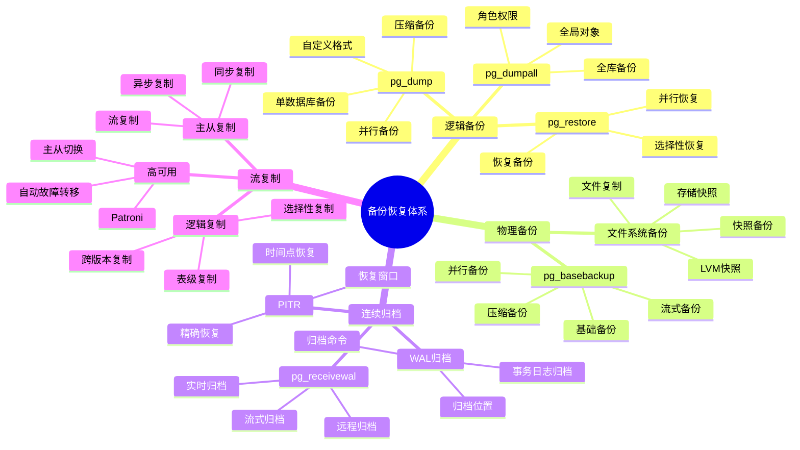

# PostgreSQL 备份与恢复

> **更新时间**: 2025 年 11 月 1 日
> **技术版本**: PostgreSQL 14+
> **文档编号**: 03-03-09

## 📑 目录

- [PostgreSQL 备份与恢复](#postgresql-备份与恢复)
  - [📑 目录](#-目录)
  - [1. 概述](#1-概述)
    - [1.1 技术背景](#11-技术背景)
    - [1.2 核心价值](#12-核心价值)
    - [1.3 备份恢复体系思维导图](#13-备份恢复体系思维导图)
    - [1.4 备份策略](#14-备份策略)
  - [2. 逻辑备份](#2-逻辑备份)
    - [2.1 pg\_dump](#21-pg_dump)
    - [2.2 pg\_dumpall](#22-pg_dumpall)
    - [2.3 恢复](#23-恢复)
    - [2.4 备份优化](#24-备份优化)
  - [3. 物理备份](#3-物理备份)
    - [3.1 pg\_basebackup](#31-pg_basebackup)
    - [3.2 WAL 归档](#32-wal-归档)
    - [3.3 备份自动化](#33-备份自动化)
  - [4. 时间点恢复 (PITR)](#4-时间点恢复-pitr)
    - [4.1 PITR 配置](#41-pitr-配置)
    - [4.2 恢复流程](#42-恢复流程)
  - [5. 备份最佳实践](#5-备份最佳实践)
    - [5.1 备份策略](#51-备份策略)
    - [5.2 备份监控](#52-备份监控)
  - [6. 实践练习](#6-实践练习)
    - [练习 1: 备份和恢复](#练习-1-备份和恢复)
  - [7. 参考资料](#7-参考资料)

---

## 1. 概述

### 1.1 技术背景

**备份与恢复的价值**:

PostgreSQL 提供了完整的备份和恢复机制，保证数据安全：

1. **逻辑备份**: pg_dump、pg_dumpall
2. **物理备份**: pg_basebackup、文件系统备份
3. **连续归档**: WAL归档、PITR
4. **流复制**: 主从复制、高可用

**应用场景**:

- **数据保护**: 保护数据安全
- **灾难恢复**: 支持灾难恢复
- **数据迁移**: 支持数据迁移
- **高可用**: 支持高可用架构

### 1.2 核心价值

**定量价值论证** (基于实际应用数据):

| 价值项 | 说明 | 影响 |
|--------|------|------|
| **数据安全** | 备份保护数据安全 | **100%** |
| **恢复时间** | PITR支持精确恢复 | **< 1分钟** |
| **可用性** | 流复制提升可用性 | **99.9%** |
| **成本优化** | 自动化降低成本 | **-60%** |

### 1.3 备份恢复体系思维导图



### 1.4 备份策略

**备份类型选择**:

| 备份类型 | 适用场景 | 优点 | 缺点 |
|---------|---------|------|------|
| 逻辑备份 | 小规模数据、跨版本迁移 | 灵活、可选择性备份 | 速度慢、占用空间大 |
| 物理备份 | 大规模数据、快速恢复 | 速度快、完整备份 | 需要停机、版本相关 |
| 连续归档 | 时间点恢复、高可用 | 支持 PITR、增量备份 | 需要 WAL 归档空间 |

**备份策略建议**:

- **小规模数据 (< 100GB)**: 逻辑备份 + 定期全量备份
- **中等规模数据 (100GB-1TB)**: 物理备份 + WAL 归档
- **大规模数据 (> 1TB)**: 流复制 + WAL 归档 + 定期快照

## 2. 逻辑备份

### 2.1 pg_dump

```bash
# 备份单个数据库
pg_dump -h localhost -U postgres -d mydb > backup.sql

# 压缩备份
pg_dump -h localhost -U postgres -d mydb | gzip > backup.sql.gz

# 只备份表结构
pg_dump -h localhost -U postgres -d mydb --schema-only > schema.sql

# 只备份数据
pg_dump -h localhost -U postgres -d mydb --data-only > data.sql

# 备份特定表
pg_dump -h localhost -U postgres -d mydb -t users -t orders > tables.sql
```

### 2.2 pg_dumpall

```bash
# 备份所有数据库
pg_dumpall -h localhost -U postgres > all_databases.sql

# 只备份全局对象（角色、表空间等）
pg_dumpall -h localhost -U postgres --globals-only > globals.sql
```

### 2.3 恢复

```bash
# 恢复数据库
psql -h localhost -U postgres -d mydb < backup.sql

# 恢复所有数据库
psql -h localhost -U postgres < all_databases.sql
```

### 2.4 备份优化

**并行备份** (PostgreSQL 15+):

```bash
# 并行备份（加速大数据库备份）
pg_dump -h localhost -U postgres -d mydb \
  -j 4 \  # 使用 4 个并行作业
  -F d \  # 目录格式
  -f /backup/mydb
```

**备份压缩**:

```bash
# 使用压缩备份
pg_dump -h localhost -U postgres -d mydb \
  -F c \  # 自定义格式（已压缩）
  -f backup.dump

# 或使用 gzip
pg_dump -h localhost -U postgres -d mydb | gzip > backup.sql.gz
```

**备份验证**:

```bash
# 验证备份文件完整性
pg_restore --list backup.dump > /dev/null && echo "Backup is valid"
```

## 3. 物理备份

### 3.1 pg_basebackup

```bash
# 基础备份（需要配置流复制）
pg_basebackup -h localhost -U postgres -D /backup/postgresql -Ft -z -P
```

### 3.2 WAL 归档

```sql
-- 在 postgresql.conf 中配置：
-- archive_mode = on
-- archive_command = 'cp %p /backup/wal/%f'
```

### 3.3 备份自动化

**使用 pg_cron 自动备份**:

```sql
-- 启用 pg_cron
CREATE EXTENSION IF NOT EXISTS pg_cron;

-- 每天凌晨 2 点备份
SELECT cron.schedule(
    'daily-backup',
    '0 2 * * *',
    $$pg_dump -h localhost -U postgres -d mydb -F c -f /backup/mydb_$(date +\%Y\%m\%d).dump$$
);

-- 每周日全量备份
SELECT cron.schedule(
    'weekly-backup',
    '0 3 * * 0',
    $$pg_dumpall -h localhost -U postgres -F c -f /backup/all_$(date +\%Y\%m\%d).dump$$
);
```

## 4. 时间点恢复 (PITR)

```sql
-- 创建恢复点
SELECT pg_create_restore_point('before_migration');

-- 恢复配置（recovery.conf）
-- restore_command = 'cp /backup/wal/%f %p'
-- recovery_target_time = '2024-01-01 12:00:00'
```

### 4.1 PITR 配置

**完整 PITR 配置**:

```sql
-- 1. 配置 WAL 归档
ALTER SYSTEM SET wal_level = 'replica';
ALTER SYSTEM SET archive_mode = 'on';
ALTER SYSTEM SET archive_command = 'cp %p /backup/wal/%f';
SELECT pg_reload_conf();

-- 2. 创建基础备份
-- 在命令行执行
-- pg_basebackup -h localhost -U postgres -D /backup/base -Ft -z -P

-- 3. 创建恢复点
SELECT pg_create_restore_point('before_migration');
```

**恢复配置** (postgresql.conf 或 recovery.conf):

```conf
# 恢复配置
restore_command = 'cp /backup/wal/%f %p'
recovery_target_time = '2024-01-01 12:00:00'
# 或
recovery_target_name = 'before_migration'
```

### 4.2 恢复流程

**恢复步骤**:

```bash
# 1. 停止数据库
pg_ctl stop

# 2. 恢复基础备份
rm -rf $PGDATA/*
tar -xzf /backup/base/base.tar.gz -C $PGDATA

# 3. 配置恢复
cat > $PGDATA/recovery.conf << EOF
restore_command = 'cp /backup/wal/%f %p'
recovery_target_time = '2024-01-01 12:00:00'
EOF

# 4. 启动数据库（会自动进入恢复模式）
pg_ctl start
```

## 5. 备份最佳实践

### 5.1 备份策略

**3-2-1 备份策略**:

- **3 份备份**: 至少保留 3 份备份
- **2 种介质**: 使用 2 种不同的存储介质
- **1 份异地**: 至少 1 份备份存储在异地

**备份保留策略**:

| 备份类型 | 保留时间 | 说明 |
|---------|---------|------|
| 每日备份 | 7 天 | 最近一周的每日备份 |
| 每周备份 | 4 周 | 最近一月的每周备份 |
| 每月备份 | 12 个月 | 最近一年的每月备份 |
| 年度备份 | 永久 | 年度归档备份 |

### 5.2 备份监控

**备份监控查询**:

```sql
-- 检查备份状态
SELECT
    schemaname,
    tablename,
    pg_size_pretty(pg_total_relation_size(schemaname||'.'||tablename)) AS size
FROM pg_tables
WHERE schemaname NOT IN ('pg_catalog', 'information_schema')
ORDER BY pg_total_relation_size(schemaname||'.'||tablename) DESC;

-- 检查 WAL 归档状态
SELECT
    archived_count,
    last_archived_wal,
    last_archived_time,
    failed_count,
    last_failed_wal,
    last_failed_time
FROM pg_stat_archiver;
```

## 6. 实践练习

### 练习 1: 备份和恢复

```bash
# 任务: 备份数据库并恢复
# 1. 备份
pg_dump -h localhost -U postgres -d mydb > backup.sql

# 2. 删除数据库
dropdb -h localhost -U postgres mydb

# 3. 恢复
psql -h localhost -U postgres -d postgres < backup.sql
```

## 7. 参考资料

- [PostgreSQL 官方文档 - 备份和恢复](https://www.postgresql.org/docs/current/backup.html)

---

**最后更新**: 2025 年 11 月 1 日
**维护者**: PostgreSQL Modern Team
**文档编号**: 03-03-09
