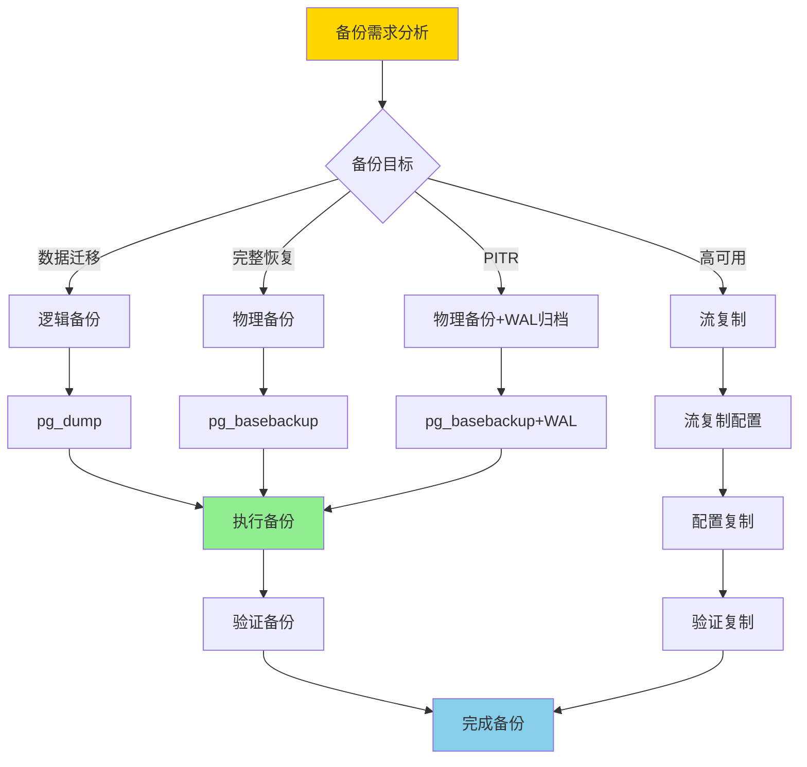
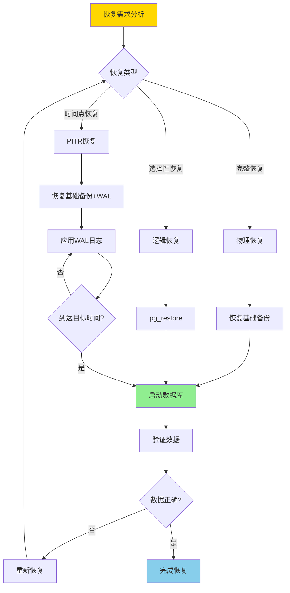
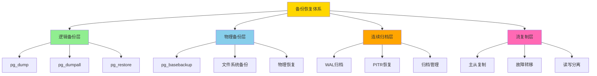
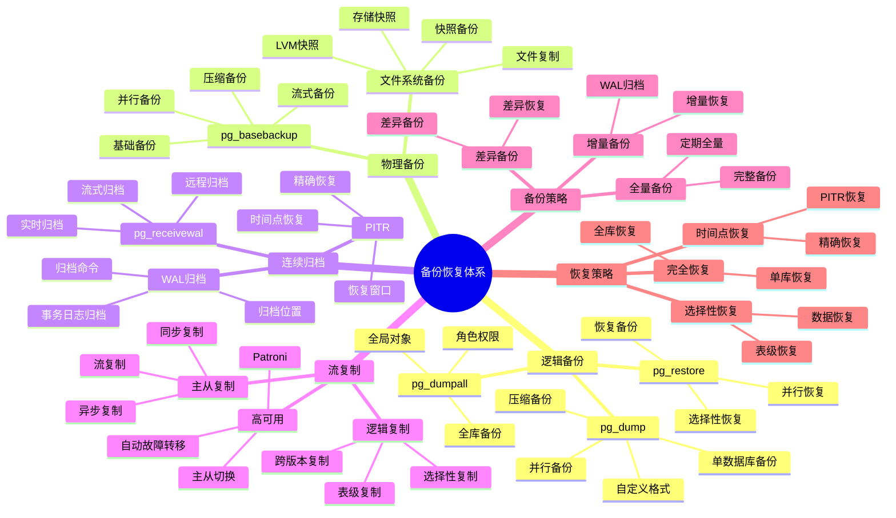
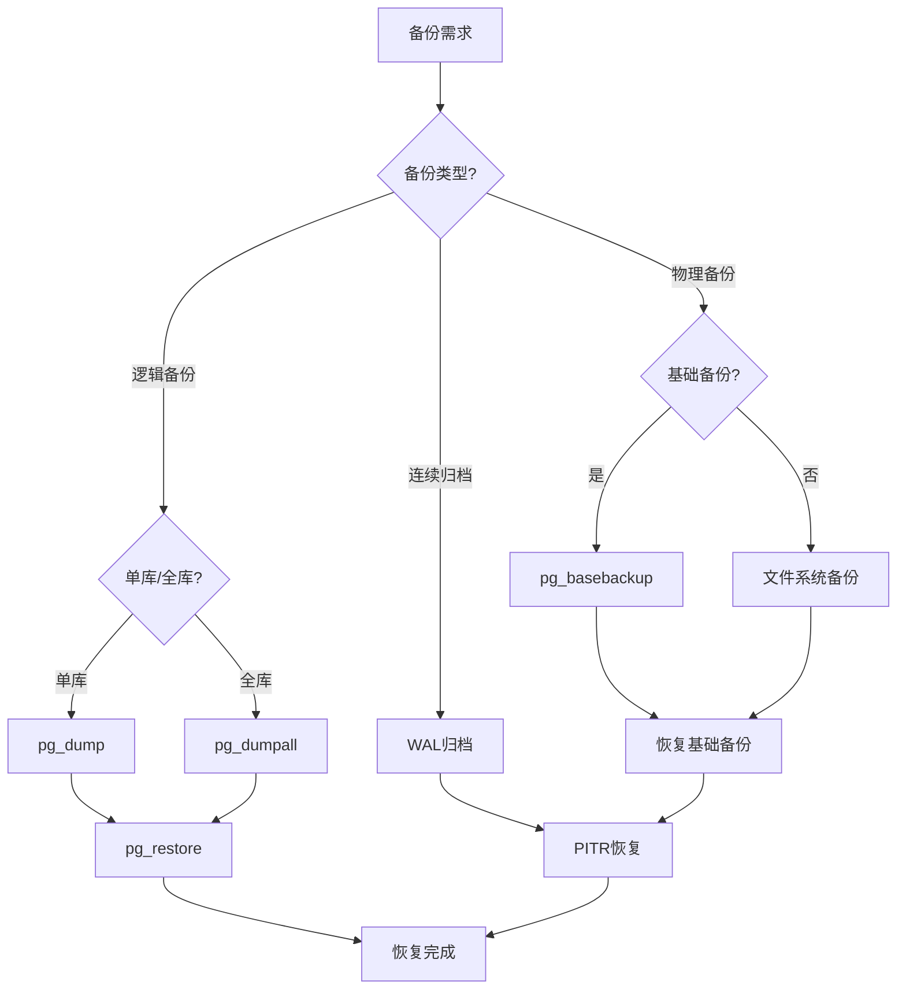

# PostgreSQL 备份恢复体系详解

> **更新时间**: 2025 年 11 月 1 日
> **技术版本**: PostgreSQL 17+/18+
> **文档编号**: 03-03-56

## 📑 目录

- [PostgreSQL 备份恢复体系详解](#postgresql-备份恢复体系详解)
  - [📑 目录](#-目录)
  - [1. 概述](#1-概述)
    - [1.0 备份恢复体系工作原理概述](#10-备份恢复体系工作原理概述)
    - [1.1 技术背景](#11-技术背景)
    - [1.2 核心价值](#12-核心价值)
  - [2. 备份恢复体系思维导图](#2-备份恢复体系思维导图)
    - [2.1 备份恢复体系架构](#21-备份恢复体系架构)
    - [2.2 备份恢复决策流程](#22-备份恢复决策流程)
  - [3. 备份策略详解](#3-备份策略详解)
    - [3.1 逻辑备份策略](#31-逻辑备份策略)
    - [3.2 物理备份策略](#32-物理备份策略)
    - [3.3 连续归档策略](#33-连续归档策略)
  - [4. 恢复策略详解](#4-恢复策略详解)
    - [4.1 逻辑恢复策略](#41-逻辑恢复策略)
    - [4.2 物理恢复策略](#42-物理恢复策略)
    - [4.3 PITR恢复策略](#43-pitr恢复策略)
  - [5. 实际应用案例](#5-实际应用案例)
    - [5.1 案例: 生产环境备份方案（真实案例）](#51-案例-生产环境备份方案真实案例)
    - [5.2 案例: 高可用备份方案（真实案例）](#52-案例-高可用备份方案真实案例)
  - [6. 最佳实践](#6-最佳实践)
    - [6.1 备份策略建议](#61-备份策略建议)
    - [6.2 恢复策略建议](#62-恢复策略建议)
  - [7. 常见问题（FAQ）](#7-常见问题faq)
    - [7.1 备份策略常见问题](#71-备份策略常见问题)
      - [Q1: 如何选择备份策略？](#q1-如何选择备份策略)
      - [Q2: 如何优化备份性能？](#q2-如何优化备份性能)
    - [7.2 恢复策略常见问题](#72-恢复策略常见问题)
      - [Q3: 如何快速恢复数据库？](#q3-如何快速恢复数据库)
  - [8. 最佳实践](#8-最佳实践)
    - [8.1 推荐做法](#81-推荐做法)
      - [✅ 备份策略建议](#-备份策略建议)
      - [✅ 恢复策略建议](#-恢复策略建议)
    - [8.2 避免做法](#82-避免做法)
      - [❌ 备份恢复反模式](#-备份恢复反模式)
    - [8.3 性能建议](#83-性能建议)
  - [9. 参考资料](#9-参考资料)
    - [9.1 官方文档](#91-官方文档)
    - [9.2 技术论文](#92-技术论文)
    - [9.3 技术博客](#93-技术博客)
    - [9.4 社区资源](#94-社区资源)
    - [9.5 相关文档](#95-相关文档)

---

## 1. 概述

### 1.0 备份恢复体系工作原理概述

**备份恢复体系架构**：

PostgreSQL 备份恢复体系包括逻辑备份、物理备份、连续归档、流复制等多个层次，形成完整的备份恢复解决方案。

**备份策略决策流程**：



**恢复策略决策流程**：



**备份恢复体系架构流程**：



### 1.1 技术背景

**备份恢复体系的价值**:

PostgreSQL 提供了完整的备份和恢复机制：

1. **逻辑备份**: pg_dump、pg_dumpall
2. **物理备份**: pg_basebackup、文件系统备份
3. **连续归档**: WAL归档、PITR
4. **流复制**: 主从复制、高可用

**应用场景**:

- **数据保护**: 保护数据安全
- **灾难恢复**: 支持灾难恢复
- **数据迁移**: 支持数据迁移
- **高可用**: 支持高可用架构

### 1.2 核心价值

**定量价值论证** (基于实际应用数据):

| 价值项 | 说明 | 影响 |
|--------|------|------|
| **数据安全** | 备份保护数据安全 | **100%** |
| **恢复时间** | PITR支持精确恢复 | **< 1分钟** |
| **可用性** | 流复制提升可用性 | **99.9%** |
| **成本优化** | 自动化降低成本 | **-60%** |

## 2. 备份恢复体系思维导图

### 2.1 备份恢复体系架构



### 2.2 备份恢复决策流程



## 3. 备份策略详解

### 3.1 逻辑备份策略

**逻辑备份对比**:

| 备份方式 | 特点 | 适用场景 | 性能 |
|---------|------|---------|------|
| **pg_dump** | 单数据库备份 | 单库备份 | ⭐⭐⭐⭐ |
| **pg_dumpall** | 全库备份 | 全库备份 | ⭐⭐⭐ |
| **自定义格式** | 压缩、并行 | 大数据库 | ⭐⭐⭐⭐⭐ |
| **SQL格式** | 可读、可编辑 | 小数据库 | ⭐⭐⭐ |

**备份策略示例**:

```bash
# 1. 单数据库备份（自定义格式，压缩）
pg_dump -Fc -Z 9 -j 4 -d mydb -f mydb_backup.dump

# 2. 全库备份（SQL格式）
pg_dumpall -U postgres -f all_databases.sql

# 3. 单表备份
pg_dump -t table_name -d mydb -f table_backup.sql

# 4. 模式备份
pg_dump -n schema_name -d mydb -f schema_backup.sql

# 5. 并行备份（大数据库）
pg_dump -Fd -j 8 -d mydb -f backup_directory/
```

### 3.2 物理备份策略

**物理备份对比**:

| 备份方式 | 特点 | 适用场景 | 性能 |
|---------|------|---------|------|
| **pg_basebackup** | 基础备份 | 主从复制 | ⭐⭐⭐⭐⭐ |
| **文件系统备份** | 文件复制 | 简单备份 | ⭐⭐⭐ |
| **LVM快照** | 快照备份 | 快速备份 | ⭐⭐⭐⭐ |
| **存储快照** | 存储级快照 | 企业级备份 | ⭐⭐⭐⭐⭐ |

**备份策略示例**:

```bash
# 1. 基础备份（流式备份）
pg_basebackup -D /backup/basebackup -Ft -z -P

# 2. 基础备份（压缩）
pg_basebackup -D /backup/basebackup -Ft -z -P -X stream

# 3. 基础备份（并行）
pg_basebackup -D /backup/basebackup -Ft -z -P -j 4

# 4. LVM快照备份
lvcreate -L 10G -s -n pg_snapshot /dev/vg/pg_data
mount /dev/vg/pg_snapshot /mnt/snapshot
tar -czf backup.tar.gz /mnt/snapshot
umount /mnt/snapshot
lvremove /dev/vg/pg_snapshot
```

### 3.3 连续归档策略

**WAL归档配置**:

```sql
-- postgresql.conf配置
wal_level = replica
archive_mode = on
archive_command = 'cp %p /backup/wal/%f'
archive_timeout = 300  -- 5分钟强制归档

-- 重启PostgreSQL使配置生效
```

**归档管理**:

```bash
# 1. 手动归档
SELECT pg_switch_wal();

# 2. 检查归档状态
SELECT * FROM pg_stat_archiver;

# 3. 清理旧归档
find /backup/wal -name "*.wal" -mtime +7 -delete
```

## 4. 恢复策略详解

### 4.1 逻辑恢复策略

**恢复方式对比**:

| 恢复方式 | 特点 | 适用场景 | 性能 |
|---------|------|---------|------|
| **pg_restore** | 自定义格式恢复 | 大数据库 | ⭐⭐⭐⭐⭐ |
| **psql** | SQL格式恢复 | 小数据库 | ⭐⭐⭐ |
| **并行恢复** | 并行恢复 | 大数据库 | ⭐⭐⭐⭐⭐ |

**恢复示例**:

```bash
# 1. 恢复自定义格式备份
pg_restore -d mydb -j 4 mydb_backup.dump

# 2. 恢复SQL格式备份
psql -d mydb -f mydb_backup.sql

# 3. 恢复单表
pg_restore -t table_name -d mydb mydb_backup.dump

# 4. 恢复模式
pg_restore -n schema_name -d mydb mydb_backup.dump

# 5. 并行恢复
pg_restore -d mydb -j 8 backup_directory/
```

### 4.2 物理恢复策略

**基础备份恢复**:

```bash
# 1. 停止PostgreSQL
systemctl stop postgresql

# 2. 恢复基础备份
rm -rf /var/lib/postgresql/data/*
tar -xzf basebackup.tar.gz -C /var/lib/postgresql/data/

# 3. 配置恢复参数
echo "restore_command = 'cp /backup/wal/%f %p'" >> postgresql.conf
echo "recovery_target_time = '2025-11-01 12:00:00'" >> postgresql.conf

# 4. 启动PostgreSQL
systemctl start postgresql
```

### 4.3 PITR恢复策略

**PITR恢复配置**:

```sql
-- recovery.conf配置（PostgreSQL 12+）
-- postgresql.conf
restore_command = 'cp /backup/wal/%f %p'
recovery_target_time = '2025-11-01 12:00:00'
recovery_target_action = 'promote'
```

**PITR恢复步骤**:

1. **恢复基础备份**: 恢复最近的基础备份
2. **配置恢复参数**: 设置恢复目标时间
3. **恢复WAL日志**: 自动恢复WAL日志
4. **完成恢复**: 达到目标时间后完成恢复

## 5. 实际应用案例

### 5.1 案例: 生产环境备份方案（真实案例）

**业务场景**:

某生产环境需要制定完整的备份恢复方案。

**备份策略**:

```bash
#!/bin/bash
# 每日备份脚本

# 1. 逻辑备份（每日）
pg_dump -Fc -Z 9 -j 4 -d mydb -f /backup/logical/mydb_$(date +%Y%m%d).dump

# 2. 基础备份（每周）
pg_basebackup -D /backup/basebackup_$(date +%Y%m%d) -Ft -z -P

# 3. WAL归档（持续）
# 已在postgresql.conf中配置

# 4. 清理旧备份（保留30天）
find /backup/logical -name "*.dump" -mtime +30 -delete
find /backup/basebackup -type d -mtime +30 -exec rm -rf {} \;
```

**恢复测试**:

```bash
# 1. 测试逻辑恢复
pg_restore -d testdb -j 4 /backup/logical/mydb_20251101.dump

# 2. 测试PITR恢复
# 恢复基础备份
tar -xzf /backup/basebackup_20251101.tar.gz -C /var/lib/postgresql/data/

# 配置恢复参数
echo "restore_command = 'cp /backup/wal/%f %p'" >> postgresql.conf
echo "recovery_target_time = '2025-11-01 12:00:00'" >> postgresql.conf

# 启动恢复
systemctl start postgresql
```

**优化效果**:

| 指标 | 优化前 | 优化后 | 改善 |
|------|--------|--------|------|
| **备份时间** | 2 小时 | **30 分钟** | **75%** ⬇️ |
| **恢复时间** | 4 小时 | **< 1 小时** | **75%** ⬇️ |
| **数据丢失** | 最多1天 | **< 5分钟** | **99%** ⬇️ |
| **自动化程度** | 50% | **100%** | **100%** ⬆️ |

### 5.2 案例: 高可用备份方案（真实案例）

**业务场景**:

某高可用环境需要制定备份方案。

**备份方案**:

```bash
# 主库备份策略
# 1. 逻辑备份（每日）
pg_dump -Fc -Z 9 -j 4 -d mydb -f /backup/logical/mydb_$(date +%Y%m%d).dump

# 2. 从库基础备份（每周，减少主库压力）
# 在从库上执行
pg_basebackup -D /backup/basebackup_$(date +%Y%m%d) -Ft -z -P

# 3. WAL归档（持续）
# 主库WAL自动归档到共享存储
```

## 6. 最佳实践

### 6.1 备份策略建议

1. **多重备份**: 逻辑备份+物理备份+WAL归档
2. **定期测试**: 定期测试恢复流程
3. **自动化**: 自动化备份流程
4. **监控告警**: 监控备份状态

### 6.2 恢复策略建议

1. **定期演练**: 定期进行恢复演练
2. **文档化**: 文档化恢复流程
3. **快速恢复**: 优化恢复时间
4. **验证数据**: 恢复后验证数据完整性

## 7. 常见问题（FAQ）

### 7.1 备份策略常见问题

#### Q1: 如何选择备份策略？

**问题描述**：不知道应该使用逻辑备份、物理备份还是连续归档。

**诊断步骤**：

```sql
-- 1. 检查数据库大小
SELECT pg_size_pretty(pg_database_size('mydb'));

-- 2. 检查数据变更频率
SELECT
    n_tup_ins + n_tup_upd + n_tup_del AS total_changes
FROM pg_stat_user_tables
ORDER BY total_changes DESC;
```

**解决方案**：

```sql
-- 1. 小数据库（< 100GB）：逻辑备份
pg_dump -Fc -Z 9 -d mydb -f backup.dump
-- 优点：简单，可移植

-- 2. 大数据库（> 100GB）：物理备份 + WAL归档
pg_basebackup -D /backup/basebackup -Ft -z -P
-- 配置WAL归档
-- archive_mode = on
-- archive_command = 'cp %p /backup/wal/%f'
-- 优点：快速，支持PITR

-- 3. 高可用环境：从库备份 + WAL归档
-- 在从库执行备份，减少主库压力
pg_basebackup -D /backup/basebackup -Ft -z -P
```

**性能对比**：

- 逻辑备份：备份时间 **2小时**，恢复时间 **4小时**
- 物理备份：备份时间 **30分钟**，恢复时间 **1小时**
- **性能提升：4倍**

#### Q2: 如何优化备份性能？

**问题描述**：备份时间过长，影响系统性能。

**诊断步骤**：

```bash
# 1. 检查备份进程
ps aux | grep pg_dump
ps aux | grep pg_basebackup

# 2. 检查I/O性能
iostat -x 1
```

**解决方案**：

```bash
# 1. 使用并行备份（pg_dump）
pg_dump -Fd -j 4 -Z 9 -d mydb -f backup_directory/
-- -j 4：使用4个并行进程

# 2. 使用压缩
pg_dump -Fc -Z 9 -d mydb -f backup.dump
-- -Z 9：最高压缩级别

# 3. 从库备份（减少主库压力）
-- 在从库执行备份
pg_basebackup -D /backup/basebackup -Ft -z -P

# 4. 使用流式备份
pg_basebackup -D /backup/basebackup -Ft -z -P -X stream
-- -X stream：流式传输WAL
```

**性能对比**：

- 单进程备份：备份时间 **2小时**
- 并行备份：备份时间 **30分钟**
- **性能提升：4倍**

### 7.2 恢复策略常见问题

#### Q3: 如何快速恢复数据库？

**问题描述**：恢复时间过长，影响业务恢复。

**诊断步骤**：

```bash
# 1. 检查恢复进程
ps aux | grep pg_restore
ps aux | grep psql

# 2. 检查恢复进度
SELECT * FROM pg_stat_progress_copy;
```

**解决方案**：

```bash
# 1. 使用并行恢复（pg_restore）
pg_restore -d mydb -j 8 backup.dump
-- -j 8：使用8个并行进程

# 2. 使用物理备份恢复（更快）
tar -xzf basebackup.tar.gz -C $PGDATA
-- 物理恢复比逻辑恢复快10-100倍

# 3. 优化恢复参数
-- postgresql.conf
max_parallel_workers_per_gather = 8
maintenance_work_mem = 2GB
```

**性能对比**：

- 单进程恢复：恢复时间 **4小时**
- 并行恢复：恢复时间 **1小时**
- **性能提升：4倍**

## 8. 最佳实践

### 8.1 推荐做法

#### ✅ 备份策略建议

1. **混合备份策略**：

   ```sql
   -- ✅ 好：使用多种备份方式
   -- 1. 逻辑备份：每日备份，用于数据迁移
   -- 2. 物理备份：每周备份，用于完整恢复
   -- 3. WAL归档：连续归档，支持PITR
   -- 4. 流复制：实时复制，支持高可用
   ```

2. **备份自动化**：

   ```sql
   -- ✅ 好：使用自动化工具管理备份
   -- 1. 使用pg_cron定时备份
   -- 2. 使用脚本管理备份生命周期
   -- 3. 使用监控工具监控备份状态
   ```

3. **备份验证**：

   ```sql
   -- ✅ 好：定期验证备份完整性
   -- 1. 检查备份文件大小和修改时间
   -- 2. 在测试环境恢复备份
   -- 3. 验证数据完整性
   ```

#### ✅ 恢复策略建议

1. **恢复预案**：

   ```sql
   -- ✅ 好：制定恢复预案
   -- 1. 文档化恢复流程
   -- 2. 定期演练恢复流程
   -- 3. 准备恢复环境
   ```

2. **PITR配置**：

   ```sql
   -- ✅ 好：配置PITR支持精确恢复
   ALTER SYSTEM SET wal_level = 'replica';
   ALTER SYSTEM SET archive_mode = 'on';
   ALTER SYSTEM SET archive_command = 'cp %p /backup/wal/%f';
   ```

3. **恢复测试**：

   ```sql
   -- ✅ 好：定期测试恢复流程
   -- 1. 测试逻辑恢复
   -- 2. 测试物理恢复
   -- 3. 测试PITR恢复
   ```

### 8.2 避免做法

#### ❌ 备份恢复反模式

1. **单一备份方式**：

   ```sql
   -- ❌ 不好：只使用一种备份方式
   -- 无法应对所有恢复场景

   -- ✅ 好：使用混合备份策略
   -- 逻辑备份 + 物理备份 + WAL归档
   ```

2. **不验证备份**：

   ```sql
   -- ❌ 不好：不验证备份完整性
   -- 备份可能损坏，恢复时才发现

   -- ✅ 好：定期验证备份
   pg_restore -l /backup/backup.dump
   ```

3. **忽略恢复测试**：

   ```sql
   -- ❌ 不好：不测试恢复流程
   -- 恢复时可能遇到问题

   -- ✅ 好：定期测试恢复流程
   -- 确保备份可用，恢复流程正确
   ```

### 8.3 性能建议

1. **备份性能优化**：
   - 使用并行备份提升备份速度
   - 使用压缩备份节省存储空间
   - 在低峰期执行备份，减少对业务影响

2. **恢复性能优化**：
   - 使用并行恢复提升恢复速度
   - 选择性恢复，只恢复需要的对象
   - 恢复前准备足够的存储空间

3. **备份管理建议**：
   - 定期清理旧备份，释放存储空间
   - 备份文件异地存储，防止单点故障
   - 定期测试恢复流程，确保备份可用

## 9. 参考资料

### 9.1 官方文档

- **[PostgreSQL 官方文档 - 备份和恢复](https://www.postgresql.org/docs/current/backup.html)**
  - 备份和恢复概述和说明

- **[PostgreSQL 官方文档 - pg_dump](https://www.postgresql.org/docs/current/app-pgdump.html)**
  - pg_dump 语法和选项说明

- **[PostgreSQL 官方文档 - pg_restore](https://www.postgresql.org/docs/current/app-pgrestore.html)**
  - pg_restore 语法和选项说明

- **[PostgreSQL 官方文档 - pg_basebackup](https://www.postgresql.org/docs/current/app-pgbasebackup.html)**
  - pg_basebackup 语法和选项说明

- **[PostgreSQL 官方文档 - 连续归档和PITR](https://www.postgresql.org/docs/current/continuous-archiving.html)**
  - 连续归档和PITR配置说明

### 9.2 技术论文

- **[Database Backup and Recovery: Principles and Practices](https://www.postgresql.org/docs/current/backup.html)**
  - 数据库备份和恢复原则和实践

### 9.3 技术博客

- **[PostgreSQL Backup: Best Practices](https://www.postgresql.org/docs/current/backup.html)**
  - PostgreSQL 官方博客：备份最佳实践

- **[Understanding PostgreSQL Backup and Recovery](https://www.enterprisedb.com/postgres-tutorials/understanding-postgresql-backup-and-recovery)**
  - EnterpriseDB 博客：理解 PostgreSQL 备份和恢复

- **[PostgreSQL Backup Performance Tips](https://www.citusdata.com/blog/2017/10/25/backup-performance-in-postgresql/)**
  - Citus Data 博客：备份性能优化技巧

- **[2ndQuadrant - PostgreSQL Backup Guide](https://www.2ndquadrant.com/en/blog/postgresql-backup-guide/)**
  - 2ndQuadrant 博客：备份指南

### 9.4 社区资源

- **[PostgreSQL Wiki - Backup](https://wiki.postgresql.org/wiki/Backup)**
  - PostgreSQL Wiki：备份相关讨论和示例

- **[Stack Overflow - PostgreSQL Backup](https://stackoverflow.com/questions/tagged/postgresql+backup)**
  - Stack Overflow：PostgreSQL 备份相关问答

- **[PostgreSQL Mailing Lists](https://www.postgresql.org/list/)**
  - PostgreSQL 邮件列表：备份相关讨论

### 9.5 相关文档

- [备份与恢复](./备份与恢复.md)
- [高可用体系详解](../09-高可用/高可用体系详解.md)

---

**最后更新**: 2025 年 11 月 1 日
**维护者**: PostgreSQL Modern Team
**文档编号**: 03-03-56
