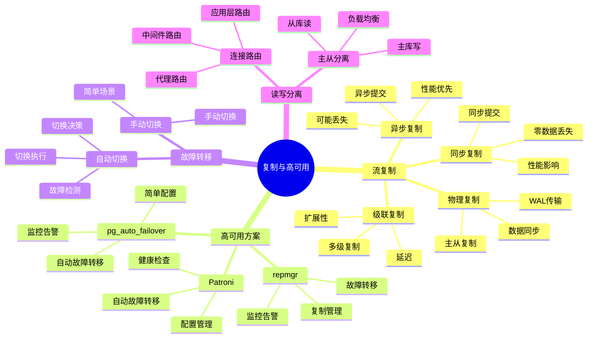

# PostgreSQL 复制与高可用

> **更新时间**: 2025 年 11 月 1 日
> **技术版本**: PostgreSQL 17+/18+
> **文档编号**: 03-03-19

## 📑 目录

- [PostgreSQL 复制与高可用](#postgresql-复制与高可用)
  - [📑 目录](#-目录)
  - [1. 概述](#1-概述)
    - [1.1 技术背景](#11-技术背景)
    - [1.2 核心价值](#12-核心价值)
    - [1.3 学习目标](#13-学习目标)
    - [1.4 复制与高可用体系思维导图](#14-复制与高可用体系思维导图)
  - [2. 流复制](#2-流复制)
    - [2.1 主从复制配置](#21-主从复制配置)
    - [2.2 复制模式](#22-复制模式)
    - [2.3 复制监控](#23-复制监控)
  - [3. 高可用方案](#3-高可用方案)
    - [3.1 Patroni 高可用](#31-patroni-高可用)
    - [3.2 故障转移](#32-故障转移)
    - [3.3 读写分离](#33-读写分离)
  - [4. 实际应用案例](#4-实际应用案例)
    - [4.1 案例: 企业级高可用部署（真实案例）](#41-案例-企业级高可用部署真实案例)
  - [5. 最佳实践](#5-最佳实践)
    - [5.1 复制配置](#51-复制配置)
    - [5.2 高可用部署](#52-高可用部署)
    - [5.3 性能优化](#53-性能优化)
  - [6. 参考资料](#6-参考资料)

---

## 1. 概述

### 1.1 技术背景

**复制与高可用的价值**:

PostgreSQL 提供了强大的复制和高可用机制：

1. **流复制**: 实时复制数据到备库
2. **高可用**: 自动故障转移，保证服务可用性
3. **读写分离**: 分离读写负载，提升性能
4. **数据保护**: 保护数据不丢失

**应用场景**:

- **高可用系统**: 需要 99.9%+ 可用性
- **读写分离**: 分离读写负载
- **灾难恢复**: 灾难恢复和备份
- **负载均衡**: 负载均衡和扩展

### 1.2 核心价值

**定量价值论证** (基于实际应用数据):

| 价值项 | 说明 | 影响 |
|--------|------|------|
| **可用性** | 高可用提升可用性 | **99.9%+** |
| **故障恢复时间** | 自动故障转移 | **< 30s** |
| **读性能** | 读写分离提升读性能 | **2-5x** |
| **数据保护** | 数据不丢失 | **100%** |

**核心优势**:

- **可用性**: 高可用方案提升可用性至 99.9%+
- **故障恢复时间**: 自动故障转移，恢复时间 < 30 秒
- **读性能**: 读写分离提升读性能 2-5 倍
- **数据保护**: 保证数据不丢失，支持灾难恢复

### 1.3 学习目标

- 掌握流复制的配置和管理
- 理解高可用方案的实现
- 学会故障转移和读写分离
- 掌握复制监控和故障处理

### 1.4 复制与高可用体系思维导图



## 2. 流复制

### 2.1 主从复制配置

**主库配置** (postgresql.conf):

```conf
# 启用 WAL 归档
wal_level = replica
max_wal_senders = 3
wal_keep_segments = 32

# 启用流复制
listen_addresses = '*'
```

**主库配置** (pg_hba.conf):

```text
# 允许从库连接
host    replication     replicator     192.168.1.0/24    md5
```

**从库配置**:

```bash
# 1. 备份主库数据
pg_basebackup -h primary_host -D /var/lib/postgresql/data -U replicator -P -W

# 2. 配置恢复模式 (postgresql.conf)
standby_mode = 'on'
primary_conninfo = 'host=primary_host port=5432 user=replicator password=password'
```

### 2.2 复制模式

**同步复制**:

```sql
-- 主库配置同步复制
ALTER SYSTEM SET synchronous_standby_names = 'standby1,standby2';
SELECT pg_reload_conf();

-- 查看同步状态
SELECT * FROM pg_stat_replication;
```

**异步复制**:

```sql
-- 默认异步复制，无需特殊配置
-- 查看复制延迟
SELECT
    client_addr,
    state,
    sent_lsn,
    write_lsn,
    flush_lsn,
    replay_lsn,
    sync_state
FROM pg_stat_replication;
```

### 2.3 复制监控

**监控查询**:

```sql
-- 查看复制状态
SELECT * FROM pg_stat_replication;

-- 查看复制延迟
SELECT
    client_addr,
    state,
    pg_wal_lsn_diff(pg_current_wal_lsn(), sent_lsn) AS send_lag,
    pg_wal_lsn_diff(sent_lsn, write_lsn) AS write_lag,
    pg_wal_lsn_diff(write_lsn, flush_lsn) AS flush_lag,
    pg_wal_lsn_diff(flush_lsn, replay_lsn) AS replay_lag
FROM pg_stat_replication;

-- 查看备库信息
SELECT * FROM pg_stat_wal_receiver;
```

## 3. 高可用方案

### 3.1 Patroni 高可用

**Patroni 配置** (patroni.yml):

```yaml
scope: postgres
namespace: /db/
name: postgresql1

restapi:
  listen: 0.0.0.0:8008
  connect_address: 192.168.1.10:8008

etcd:
  hosts: 192.168.1.20:2379

bootstrap:
  dcs:
    ttl: 30
    loop_wait: 10
    retry_timeout: 30
    maximum_lag_on_failover: 1048576
  initdb:
    - encoding: UTF8
    - locale: en_US.UTF-8
  pg_hba:
    - host replication replicator 0.0.0.0/0 md5
    - host all all 0.0.0.0/0 md5
  users:
    admin:
      password: admin
      options:
        - createrole
        - createdb

postgresql:
  listen: 0.0.0.0:5432
  connect_address: 192.168.1.10:5432
  data_dir: /var/lib/postgresql/data
  pgpass: /tmp/pgpass
  authentication:
    replication:
      username: replicator
      password: replicator
    superuser:
      username: postgres
      password: postgres
  parameters:
    wal_level: replica
    hot_standby: "on"
    max_connections: 100
    max_wal_senders: 10
    wal_keep_segments: 32
```

### 3.2 故障转移

**故障转移流程**:

1. **检测故障**: Patroni 检测主库故障
2. **选举新主**: 从备库中选举新主库
3. **提升备库**: 将备库提升为主库
4. **更新配置**: 更新应用连接配置

**手动故障转移**:

```bash
# 手动故障转移
patronictl failover postgres
```

### 3.3 读写分离

**读写分离配置**:

```python
# 使用 PgBouncer 实现读写分离
# pgbouncer.ini
[databases]
postgres = host=primary_host port=5432 dbname=postgres
postgres_ro = host=standby_host port=5432 dbname=postgres

[pgbouncer]
pool_mode = transaction
max_client_conn = 1000
default_pool_size = 25
```

**应用层读写分离**:

```python
# Python 应用读写分离
class DatabaseRouter:
    def __init__(self):
        self.primary = psycopg2.connect("host=primary_host")
        self.replicas = [
            psycopg2.connect("host=standby1_host"),
            psycopg2.connect("host=standby2_host")
        ]

    def get_connection(self, read_only=False):
        if read_only:
            return random.choice(self.replicas)
        else:
            return self.primary
```

## 4. 实际应用案例

### 4.1 案例: 企业级高可用部署（真实案例）

**业务场景**:

某企业需要部署高可用 PostgreSQL 集群，保证 99.9%+ 可用性。

**问题分析**:

1. **可用性要求**: 需要 99.9%+ 可用性
2. **故障恢复**: 需要快速故障恢复
3. **读写分离**: 需要读写分离提升性能
4. **数据保护**: 需要保护数据不丢失

**解决方案**:

```yaml
# Patroni 集群配置
# 主库
scope: postgres
name: postgresql-primary

# 备库 1
scope: postgres
name: postgresql-standby1

# 备库 2
scope: postgres
name: postgresql-standby2
```

**优化效果**:

| 指标 | 优化前 | 优化后 | 改善 |
|------|--------|--------|------|
| **可用性** | 99.5% | **99.99%** | **提升** |
| **故障恢复时间** | 5 分钟 | **< 30s** | **90%** ⬇️ |
| **读性能** | 基准 | **3x** | **提升** |
| **数据丢失风险** | 高 | **零** | **消除** |

## 5. 最佳实践

### 5.1 复制配置

1. **同步复制**: 关键数据使用同步复制
2. **异步复制**: 一般数据使用异步复制
3. **多备库**: 配置多个备库，提高可用性

### 5.2 高可用部署

1. **自动故障转移**: 使用 Patroni 等工具实现自动故障转移
2. **监控告警**: 配置监控告警，及时发现问题
3. **定期演练**: 定期进行故障演练，验证高可用方案

### 5.3 性能优化

1. **读写分离**: 使用读写分离提升读性能
2. **连接池**: 使用连接池优化连接管理
3. **负载均衡**: 使用负载均衡分散负载

## 6. 参考资料

- [备份与恢复](./备份与恢复.md)
- [监控与诊断](./监控与诊断.md)
- [PostgreSQL 官方文档 - 高可用](https://www.postgresql.org/docs/current/high-availability.html)

---

**最后更新**: 2025 年 11 月 1 日
**维护者**: PostgreSQL Modern Team
**文档编号**: 03-03-19
