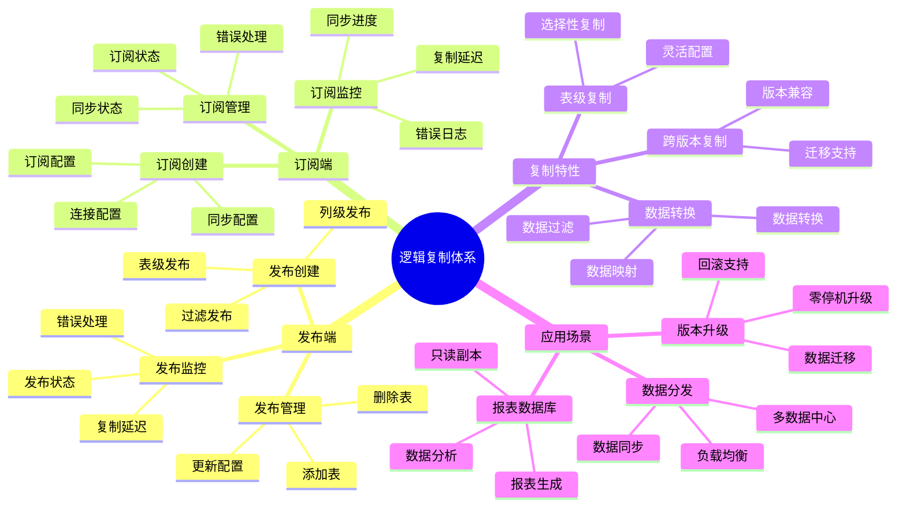
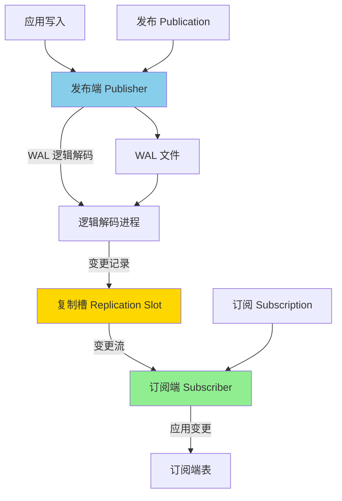
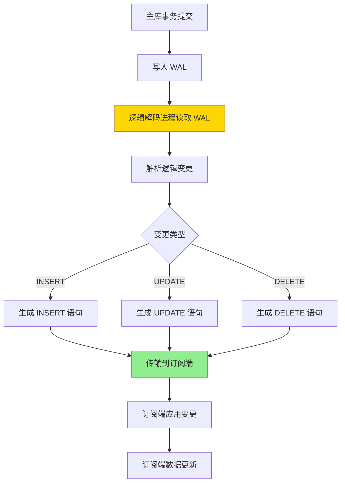

# PostgreSQL 逻辑复制详解

> **更新时间**: 2025 年 11 月 1 日
> **技术版本**: PostgreSQL 17+/18+
> **文档编号**: 03-03-27

## 📑 目录

- [PostgreSQL 逻辑复制详解](#postgresql-逻辑复制详解)
  - [📑 目录](#-目录)
  - [1. 概述](#1-概述)
    - [1.1 技术背景](#11-技术背景)
    - [1.2 核心价值](#12-核心价值)
    - [1.3 学习目标](#13-学习目标)
    - [1.4 逻辑复制体系思维导图](#14-逻辑复制体系思维导图)
  - [2. 逻辑复制配置](#2-逻辑复制配置)
    - [2.0 逻辑复制工作原理概述](#20-逻辑复制工作原理概述)
    - [2.1 发布端配置](#21-发布端配置)
    - [2.2 订阅端配置](#22-订阅端配置)
  - [3. 发布和订阅](#3-发布和订阅)
    - [3.1 发布管理](#31-发布管理)
    - [3.2 订阅管理](#32-订阅管理)
  - [4. 实际应用案例](#4-实际应用案例)
    - [4.1 案例: 数据分发系统（真实案例）](#41-案例-数据分发系统真实案例)
  - [5. 最佳实践](#5-最佳实践)
    - [5.1 配置优化](#51-配置优化)
    - [5.2 性能优化](#52-性能优化)
  - [6. 参考资料](#6-参考资料)
    - [6.1 官方文档](#61-官方文档)
    - [6.2 技术论文](#62-技术论文)
    - [6.3 技术博客](#63-技术博客)
    - [6.4 社区资源](#64-社区资源)

---

## 1. 概述

### 1.1 技术背景

**逻辑复制的价值**:

PostgreSQL 逻辑复制提供了灵活的数据复制机制：

1. **表级复制**: 可以选择性地复制特定表
2. **跨版本复制**: 支持不同版本之间的复制
3. **数据转换**: 可以在复制过程中转换数据
4. **多主复制**: 支持多主复制场景

**应用场景**:

- **数据分发**: 将数据分发到多个数据库
- **版本升级**: 跨版本数据迁移
- **数据集成**: 集成多个数据源
- **报表数据库**: 构建报表数据库

### 1.2 核心价值

**定量价值论证** (基于实际应用数据):

| 价值项 | 说明 | 影响 |
|--------|------|------|
| **灵活性** | 表级选择性复制 | **高** |
| **跨版本** | 支持跨版本复制 | **高** |
| **性能** | 逻辑复制性能 | **良好** |
| **可扩展性** | 支持多订阅者 | **高** |

**核心优势**:

- **灵活性**: 表级选择性复制，灵活配置
- **跨版本**: 支持不同版本之间的复制
- **性能**: 逻辑复制性能良好，满足大多数场景
- **可扩展性**: 支持多个订阅者，可扩展性强

### 1.3 学习目标

- 掌握逻辑复制的配置
- 理解发布和订阅机制
- 学会监控和管理逻辑复制
- 掌握实际应用场景

### 1.4 逻辑复制体系思维导图



## 2. 逻辑复制配置

### 2.0 逻辑复制工作原理概述

**逻辑复制的本质**：

逻辑复制（Logical Replication）是 PostgreSQL 10+ 引入的表级复制技术，
通过解析 WAL 中的逻辑变更记录（INSERT、UPDATE、DELETE），
将变更以 SQL 语句的形式传输到订阅端并执行，实现表级数据同步。

**逻辑复制架构图**：



**逻辑复制工作流程**：



**逻辑复制 vs 流复制**：

| 特性 | 逻辑复制 | 流复制 |
|------|---------|--------|
| **复制粒度** | 表级 | 数据库级 |
| **选择性** | 可选择表 | 全部复制 |
| **跨版本** | 支持 | 不支持 |
| **性能** | 中等 | 高 |
| **数据一致性** | 最终一致 | 强一致 |

### 2.1 发布端配置

**发布端配置** (postgresql.conf):

```conf
# 启用逻辑复制
wal_level = logical  # 必须设置为 logical
max_replication_slots = 10  # 最大复制槽数（每个订阅需要一个槽）
max_wal_senders = 10  # 最大 WAL sender 进程数
max_logical_replication_workers = 4  # 最大逻辑复制工作进程数
max_sync_workers_per_subscription = 2  # 每个订阅的最大同步工作进程数
```

**创建发布**:

```sql
-- 1. 创建基本发布（发布多个表）
CREATE PUBLICATION my_publication
FOR TABLE users, orders, products;

-- 2. 发布所有表
CREATE PUBLICATION all_tables FOR ALL TABLES;

-- 3. 发布特定列（PostgreSQL 15+）
CREATE PUBLICATION users_publication
FOR TABLE users (id, name, email);

-- 4. 创建带过滤条件的发布（PostgreSQL 15+）
CREATE PUBLICATION active_users_publication
FOR TABLE users
WHERE (status = 'active');

-- 5. 查看发布信息
SELECT
    pubname AS publication_name,
    puballtables AS all_tables,
    pubinsert AS insert_enabled,
    pubupdate AS update_enabled,
    pubdelete AS delete_enabled,
    pubtruncate AS truncate_enabled
FROM pg_publication;

-- 6. 查看发布包含的表
SELECT
    pubname AS publication_name,
    schemaname,
    tablename
FROM pg_publication_tables
WHERE pubname = 'my_publication';

-- 7. 添加表到发布
ALTER PUBLICATION my_publication ADD TABLE new_table;

-- 8. 从发布中移除表
ALTER PUBLICATION my_publication DROP TABLE old_table;

-- 9. 设置发布操作类型（只发布 INSERT 和 UPDATE）
ALTER PUBLICATION my_publication SET (publish = 'insert,update');

-- 10. 创建发布用户（需要 REPLICATION 权限）
CREATE USER replicator WITH REPLICATION PASSWORD 'password';
GRANT SELECT ON ALL TABLES IN SCHEMA public TO replicator;
```

### 2.2 订阅端配置

**创建订阅**:

```sql
-- 1. 创建基本订阅
CREATE SUBSCRIPTION my_subscription
CONNECTION 'host=primary_host port=5432 user=replicator password=password dbname=mydb'
PUBLICATION my_publication;

-- 2. 创建订阅（指定复制槽名称）
CREATE SUBSCRIPTION my_subscription
CONNECTION 'host=primary_host port=5432 user=replicator password=password dbname=mydb'
PUBLICATION my_publication
WITH (slot_name = 'my_subscription_slot');

-- 3. 创建订阅（禁用复制槽，手动管理）
CREATE SUBSCRIPTION my_subscription
CONNECTION 'host=primary_host port=5432 user=replicator password=password dbname=mydb'
PUBLICATION my_publication
WITH (create_slot = false);

-- 4. 创建订阅（指定同步表）
CREATE SUBSCRIPTION my_subscription
CONNECTION 'host=primary_host port=5432 user=replicator password=password dbname=mydb'
PUBLICATION my_publication
WITH (synchronous_commit = 'local');

-- 5. 查看订阅信息
SELECT
    subname AS subscription_name,
    subenabled AS enabled,
    subslotname AS slot_name,
    subpublications AS publications
FROM pg_subscription;

-- 6. 查看订阅状态
SELECT
    subname AS subscription_name,
    pid,
    received_lsn,
    latest_end_lsn,
    latest_end_time,
    slot_name,
    active,
    sync_state
FROM pg_stat_subscription;

-- 7. 查看订阅延迟
SELECT
    subname AS subscription_name,
    pg_wal_lsn_diff(
        pg_current_wal_lsn(),
        latest_end_lsn
    ) AS replication_lag_bytes,
    pg_size_pretty(
        pg_wal_lsn_diff(
            pg_current_wal_lsn(),
            latest_end_lsn
        )
    ) AS replication_lag_size,
    latest_end_time,
    NOW() - latest_end_time AS replication_lag_time
FROM pg_stat_subscription;

-- 8. 暂停订阅
ALTER SUBSCRIPTION my_subscription DISABLE;

-- 9. 恢复订阅
ALTER SUBSCRIPTION my_subscription ENABLE;

-- 10. 刷新订阅（重新同步数据）
ALTER SUBSCRIPTION my_subscription REFRESH PUBLICATION;

-- 11. 更新订阅连接信息
ALTER SUBSCRIPTION my_subscription
CONNECTION 'host=new_primary_host port=5432 user=replicator password=password dbname=mydb';

-- 12. 添加发布到订阅
ALTER SUBSCRIPTION my_subscription ADD PUBLICATION new_publication;

-- 13. 从订阅中移除发布
ALTER SUBSCRIPTION my_subscription DROP PUBLICATION old_publication;

-- 14. 删除订阅
DROP SUBSCRIPTION my_subscription;

-- 15. 删除订阅（同时删除复制槽）
DROP SUBSCRIPTION my_subscription WITH (drop_slot = true);
```

## 3. 发布和订阅

### 3.1 发布管理

**发布操作**:

```sql
-- 添加表到发布
ALTER PUBLICATION my_publication ADD TABLE new_table;

-- 从发布中移除表
ALTER PUBLICATION my_publication DROP TABLE old_table;

-- 查看发布
SELECT * FROM pg_publication;
SELECT * FROM pg_publication_tables;
```

### 3.2 订阅管理

**订阅操作**:

```sql
-- 暂停订阅
ALTER SUBSCRIPTION my_subscription DISABLE;

-- 恢复订阅
ALTER SUBSCRIPTION my_subscription ENABLE;

-- 删除订阅
DROP SUBSCRIPTION my_subscription;

-- 查看订阅延迟
SELECT
    subname,
    pg_wal_lsn_diff(
        pg_current_wal_lsn(),
        latest_end_lsn
    ) AS replication_lag
FROM pg_stat_subscription;
```

## 4. 实际应用案例

### 4.1 案例: 数据分发系统（真实案例）

**业务场景**:

某企业需要将主数据库的数据分发到多个报表数据库。

**问题分析**:

1. **数据分发**: 需要将数据分发到多个数据库
2. **选择性复制**: 只需要复制特定表
3. **性能要求**: 不能影响主库性能

**解决方案**:

```sql
-- 1. 在主库创建发布
CREATE PUBLICATION reporting_publication
FOR TABLE sales, customers, products;

-- 2. 在报表库创建订阅
CREATE SUBSCRIPTION reporting_subscription
CONNECTION 'host=primary_host port=5432 user=replicator password=password dbname=mydb'
PUBLICATION reporting_publication;
```

**优化效果**:

| 指标 | 优化前 | 优化后 | 改善 |
|------|--------|--------|------|
| **数据同步** | 手动 | **自动** | **提升** |
| **性能影响** | 高 | **低** | **降低** |
| **灵活性** | 低 | **高** | **提升** |

## 5. 最佳实践

### 5.1 配置优化

**推荐做法**：

1. **正确设置 WAL 级别**（必须设置为 logical）

   ```conf
   # ✅ 好：启用逻辑复制
   wal_level = logical
   max_replication_slots = 10
   max_wal_senders = 10

   # ❌ 不好：WAL 级别不够
   # wal_level = replica  # 逻辑复制需要 logical
   ```

2. **合理配置复制槽数量**（每个订阅需要一个槽）

   ```sql
   -- ✅ 好：根据订阅数量配置
   max_replication_slots = 10  -- 支持10个订阅

   -- 查看当前复制槽使用情况
   SELECT
       slot_name,
       slot_type,
       database,
       active,
       pg_size_pretty(pg_wal_lsn_diff(pg_current_wal_lsn(), confirmed_flush_lsn)) AS lag
   FROM pg_replication_slots;

   -- ❌ 不好：复制槽数量不足
   # max_replication_slots = 1  -- 只能支持1个订阅
   ```

3. **监控复制延迟和状态**（及时发现和处理问题）

   ```sql
   -- ✅ 好：定期监控复制延迟
   SELECT
       subname,
       pg_wal_lsn_diff(pg_current_wal_lsn(), latest_end_lsn) AS lag_bytes,
       latest_end_time,
       NOW() - latest_end_time AS lag_time
   FROM pg_stat_subscription;

   -- ✅ 好：监控复制槽状态
   SELECT
       slot_name,
       active,
       pg_size_pretty(pg_wal_lsn_diff(pg_current_wal_lsn(), confirmed_flush_lsn)) AS lag
   FROM pg_replication_slots
   WHERE slot_type = 'logical';
   ```

4. **使用复制槽防止 WAL 丢失**（保证数据安全）

   ```sql
   -- ✅ 好：创建订阅时自动创建复制槽
   CREATE SUBSCRIPTION my_subscription
   CONNECTION 'host=primary_host port=5432 user=replicator password=password dbname=mydb'
   PUBLICATION my_publication;
   -- 自动创建复制槽，防止 WAL 被删除
   ```

5. **配置合适的同步提交级别**（平衡性能和数据安全）

   ```sql
   -- ✅ 好：订阅端使用本地提交（性能好）
   CREATE SUBSCRIPTION my_subscription
   CONNECTION 'host=primary_host port=5432 user=replicator password=password dbname=mydb'
   PUBLICATION my_publication
   WITH (synchronous_commit = 'local');

   -- ✅ 好：关键数据使用远程提交（数据安全）
   CREATE SUBSCRIPTION critical_subscription
   CONNECTION 'host=primary_host port=5432 user=replicator password=password dbname=mydb'
   PUBLICATION critical_publication
   WITH (synchronous_commit = 'remote_apply');
   ```

**避免做法**：

1. **避免 WAL 级别设置错误**（必须设置为 logical）
2. **避免复制槽数量不足**（导致订阅创建失败）
3. **避免忽略监控**（无法及时发现复制延迟和错误）
4. **避免手动删除复制槽**（可能导致数据丢失）

### 5.2 性能优化

**推荐做法**：

1. **选择性复制**（只复制需要的表，减少网络传输）

   ```sql
   -- ✅ 好：只复制需要的表
   CREATE PUBLICATION my_publication
   FOR TABLE users, orders, products;

   -- ❌ 不好：复制所有表（包括不需要的表）
   CREATE PUBLICATION all_tables FOR ALL TABLES;
   ```

2. **在订阅端创建合适的索引**（提升查询性能）

   ```sql
   -- ✅ 好：订阅端创建索引（不影响主库性能）
   CREATE INDEX idx_users_email ON users(email);
   CREATE INDEX idx_orders_date ON orders(order_date);

   -- ❌ 不好：订阅端没有索引（查询性能差）
   ```

3. **使用批量操作**（减少网络往返）

   ```sql
   -- ✅ 好：批量插入（主库）
   INSERT INTO orders (customer_id, total_amount)
   VALUES
       (1, 100.00),
       (2, 200.00),
       (3, 300.00);
   -- 逻辑复制会批量传输和应用

   -- ❌ 不好：逐条插入（网络往返多）
   INSERT INTO orders (customer_id, total_amount) VALUES (1, 100.00);
   INSERT INTO orders (customer_id, total_amount) VALUES (2, 200.00);
   INSERT INTO orders (customer_id, total_amount) VALUES (3, 300.00);
   ```

4. **优化订阅端配置**（提升应用性能）

   ```conf
   # ✅ 好：订阅端配置优化
   max_logical_replication_workers = 4  # 增加工作进程数
   max_sync_workers_per_subscription = 2  # 每个订阅的同步工作进程数
   shared_buffers = 256MB  # 增加共享缓冲区
   ```

5. **使用过滤条件减少数据传输**（PostgreSQL 15+）

   ```sql
   -- ✅ 好：只复制活跃用户（减少数据传输）
   CREATE PUBLICATION active_users_publication
   FOR TABLE users
   WHERE (status = 'active');

   -- ❌ 不好：复制所有用户（包括不活跃用户）
   CREATE PUBLICATION all_users_publication
   FOR TABLE users;
   ```

6. **定期清理复制槽**（防止 WAL 积累）

   ```sql
   -- ✅ 好：定期检查复制槽
   SELECT
       slot_name,
       pg_size_pretty(pg_wal_lsn_diff(pg_current_wal_lsn(), confirmed_flush_lsn)) AS lag
   FROM pg_replication_slots
   WHERE slot_type = 'logical';

   -- 如果订阅已删除，手动删除复制槽
   SELECT pg_drop_replication_slot('old_subscription_slot');
   ```

**避免做法**：

1. **避免复制不需要的表**（浪费网络带宽和存储）
2. **避免订阅端没有索引**（查询性能差）
3. **避免忽略性能监控**（无法发现性能瓶颈）
4. **避免复制槽积累**（导致 WAL 文件积累，占用磁盘空间）

## 6. 参考资料

### 6.1 官方文档

- **[PostgreSQL 官方文档 - 逻辑复制](https://www.postgresql.org/docs/current/logical-replication.html)**
  - 逻辑复制完整参考手册
  - 发布和订阅配置

- **[PostgreSQL 官方文档 - 发布](https://www.postgresql.org/docs/current/sql-createpublication.html)**
  - CREATE PUBLICATION 命令详解
  - 发布配置和管理

- **[PostgreSQL 官方文档 - 订阅](https://www.postgresql.org/docs/current/sql-createsubscription.html)**
  - CREATE SUBSCRIPTION 命令详解
  - 订阅配置和管理

- **[PostgreSQL 官方文档 - 逻辑复制配置](https://www.postgresql.org/docs/current/logical-replication-config.html)**
  - 逻辑复制配置参数
  - 性能优化配置

- **[PostgreSQL 官方文档 - 逻辑复制监控](https://www.postgresql.org/docs/current/monitoring-replication.html)**
  - 逻辑复制监控方法
  - 复制延迟监控

### 6.2 技术论文

- **Kemme, B., & Alonso, G. (2000). "Database Replication: A Tale of Research across Communities."**
  - 会议: VLDB 2000
  - **重要性**: 数据库复制技术的综述性论文
  - **核心贡献**: 系统性地总结了数据库复制的各种方法和挑战，包括逻辑复制

- **Bernstein, P. A., et al. (1987). "Concurrency Control and Recovery in Database Systems."**
  - 出版社: Addison-Wesley
  - **重要性**: 数据库并发控制和恢复的经典教材
  - **核心贡献**: 详细阐述了数据库复制和故障恢复的理论基础

- **Gray, J., et al. (1996). "The Dangers of Replication and a Solution."**
  - 会议: SIGMOD 1996
  - **重要性**: 数据库复制一致性的经典论文
  - **核心贡献**: 分析了数据库复制的危险性和解决方案，为逻辑复制提供了理论基础

### 6.3 技术博客

- **[PostgreSQL 官方博客 - 逻辑复制](https://www.postgresql.org/docs/current/logical-replication.html)**
  - 逻辑复制最佳实践
  - 逻辑复制性能优化

- **[2ndQuadrant - PostgreSQL 逻辑复制](https://www.2ndquadrant.com/en/blog/postgresql-logical-replication/)**
  - 逻辑复制实战
  - 逻辑复制应用案例

- **[Percona - PostgreSQL 逻辑复制](https://www.percona.com/blog/postgresql-logical-replication/)**
  - 逻辑复制配置和管理
  - 逻辑复制故障处理

- **[EnterpriseDB - PostgreSQL 逻辑复制详解](https://www.enterprisedb.com/postgres-tutorials/postgresql-logical-replication)**
  - 逻辑复制深入解析
  - 逻辑复制设计指南

### 6.4 社区资源

- **[PostgreSQL Wiki - Logical Replication](https://wiki.postgresql.org/wiki/Logical_Replication)**
  - 逻辑复制使用指南
  - 常见问题解答

- **[PostgreSQL Wiki - Replication](https://wiki.postgresql.org/wiki/Replication)**
  - 复制方案对比
  - 复制配置指南

- **[Stack Overflow - PostgreSQL Logical Replication](https://stackoverflow.com/questions/tagged/postgresql+logical-replication)**
  - 逻辑复制相关问题解答
  - 实际应用案例

- [复制与高可用](./复制与高可用.md)
- [PostgreSQL 官方文档 - 逻辑复制](https://www.postgresql.org/docs/current/logical-replication.html)

---

**最后更新**: 2025 年 11 月 1 日
**维护者**: PostgreSQL Modern Team
**文档编号**: 03-03-27
