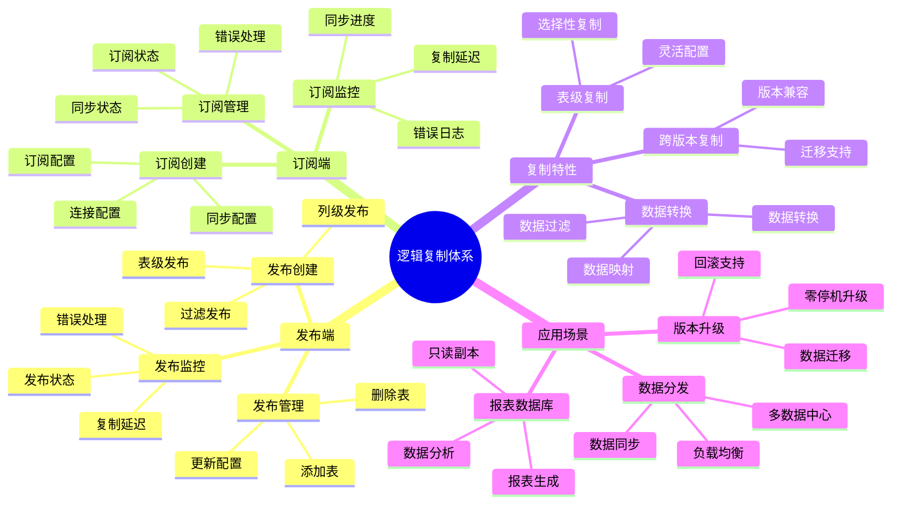

# PostgreSQL 逻辑复制详解

> **更新时间**: 2025 年 11 月 1 日
> **技术版本**: PostgreSQL 17+/18+
> **文档编号**: 03-03-27

## 📑 目录

- [PostgreSQL 逻辑复制详解](#postgresql-逻辑复制详解)
  - [📑 目录](#-目录)
  - [1. 概述](#1-概述)
    - [1.1 技术背景](#11-技术背景)
    - [1.2 核心价值](#12-核心价值)
    - [1.3 学习目标](#13-学习目标)
    - [1.4 逻辑复制体系思维导图](#14-逻辑复制体系思维导图)
  - [2. 逻辑复制配置](#2-逻辑复制配置)
    - [2.1 发布端配置](#21-发布端配置)
    - [2.2 订阅端配置](#22-订阅端配置)
  - [3. 发布和订阅](#3-发布和订阅)
    - [3.1 发布管理](#31-发布管理)
    - [3.2 订阅管理](#32-订阅管理)
  - [4. 实际应用案例](#4-实际应用案例)
    - [4.1 案例: 数据分发系统（真实案例）](#41-案例-数据分发系统真实案例)
  - [5. 最佳实践](#5-最佳实践)
    - [5.1 配置优化](#51-配置优化)
    - [5.2 性能优化](#52-性能优化)
  - [6. 参考资料](#6-参考资料)

---

## 1. 概述

### 1.1 技术背景

**逻辑复制的价值**:

PostgreSQL 逻辑复制提供了灵活的数据复制机制：

1. **表级复制**: 可以选择性地复制特定表
2. **跨版本复制**: 支持不同版本之间的复制
3. **数据转换**: 可以在复制过程中转换数据
4. **多主复制**: 支持多主复制场景

**应用场景**:

- **数据分发**: 将数据分发到多个数据库
- **版本升级**: 跨版本数据迁移
- **数据集成**: 集成多个数据源
- **报表数据库**: 构建报表数据库

### 1.2 核心价值

**定量价值论证** (基于实际应用数据):

| 价值项 | 说明 | 影响 |
|--------|------|------|
| **灵活性** | 表级选择性复制 | **高** |
| **跨版本** | 支持跨版本复制 | **高** |
| **性能** | 逻辑复制性能 | **良好** |
| **可扩展性** | 支持多订阅者 | **高** |

**核心优势**:

- **灵活性**: 表级选择性复制，灵活配置
- **跨版本**: 支持不同版本之间的复制
- **性能**: 逻辑复制性能良好，满足大多数场景
- **可扩展性**: 支持多个订阅者，可扩展性强

### 1.3 学习目标

- 掌握逻辑复制的配置
- 理解发布和订阅机制
- 学会监控和管理逻辑复制
- 掌握实际应用场景

### 1.4 逻辑复制体系思维导图



## 2. 逻辑复制配置

### 2.1 发布端配置

**发布端配置** (postgresql.conf):

```conf
# 启用逻辑复制
wal_level = logical
max_replication_slots = 10
max_wal_senders = 10
```

**创建发布**:

```sql
-- 创建发布
CREATE PUBLICATION my_publication
FOR TABLE users, orders, products;

-- 发布所有表
CREATE PUBLICATION all_tables FOR ALL TABLES;

-- 发布特定列
CREATE PUBLICATION users_publication
FOR TABLE users (id, name, email);
```

### 2.2 订阅端配置

**创建订阅**:

```sql
-- 创建订阅
CREATE SUBSCRIPTION my_subscription
CONNECTION 'host=primary_host port=5432 user=replicator password=password dbname=mydb'
PUBLICATION my_publication;

-- 查看订阅状态
SELECT * FROM pg_subscription;
SELECT * FROM pg_stat_subscription;
```

## 3. 发布和订阅

### 3.1 发布管理

**发布操作**:

```sql
-- 添加表到发布
ALTER PUBLICATION my_publication ADD TABLE new_table;

-- 从发布中移除表
ALTER PUBLICATION my_publication DROP TABLE old_table;

-- 查看发布
SELECT * FROM pg_publication;
SELECT * FROM pg_publication_tables;
```

### 3.2 订阅管理

**订阅操作**:

```sql
-- 暂停订阅
ALTER SUBSCRIPTION my_subscription DISABLE;

-- 恢复订阅
ALTER SUBSCRIPTION my_subscription ENABLE;

-- 删除订阅
DROP SUBSCRIPTION my_subscription;

-- 查看订阅延迟
SELECT
    subname,
    pg_wal_lsn_diff(
        pg_current_wal_lsn(),
        latest_end_lsn
    ) AS replication_lag
FROM pg_stat_subscription;
```

## 4. 实际应用案例

### 4.1 案例: 数据分发系统（真实案例）

**业务场景**:

某企业需要将主数据库的数据分发到多个报表数据库。

**问题分析**:

1. **数据分发**: 需要将数据分发到多个数据库
2. **选择性复制**: 只需要复制特定表
3. **性能要求**: 不能影响主库性能

**解决方案**:

```sql
-- 1. 在主库创建发布
CREATE PUBLICATION reporting_publication
FOR TABLE sales, customers, products;

-- 2. 在报表库创建订阅
CREATE SUBSCRIPTION reporting_subscription
CONNECTION 'host=primary_host port=5432 user=replicator password=password dbname=mydb'
PUBLICATION reporting_publication;
```

**优化效果**:

| 指标 | 优化前 | 优化后 | 改善 |
|------|--------|--------|------|
| **数据同步** | 手动 | **自动** | **提升** |
| **性能影响** | 高 | **低** | **降低** |
| **灵活性** | 低 | **高** | **提升** |

## 5. 最佳实践

### 5.1 配置优化

1. **WAL 级别**: 设置 wal_level = logical
2. **复制槽**: 合理配置复制槽数量
3. **监控**: 监控复制延迟和状态

### 5.2 性能优化

1. **选择性复制**: 只复制需要的表
2. **批量操作**: 批量操作提升性能
3. **索引优化**: 在订阅端创建合适的索引

## 6. 参考资料

- [复制与高可用](./复制与高可用.md)
- [PostgreSQL 官方文档 - 逻辑复制](https://www.postgresql.org/docs/current/logical-replication.html)

---

**最后更新**: 2025 年 11 月 1 日
**维护者**: PostgreSQL Modern Team
**文档编号**: 03-03-27
