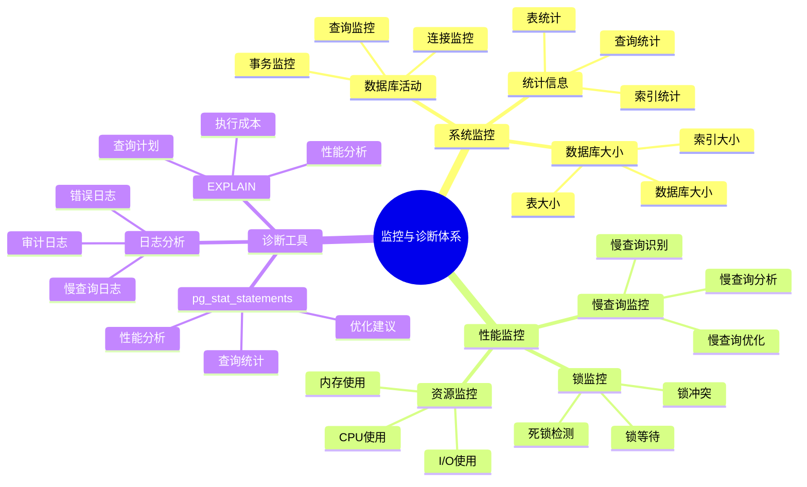
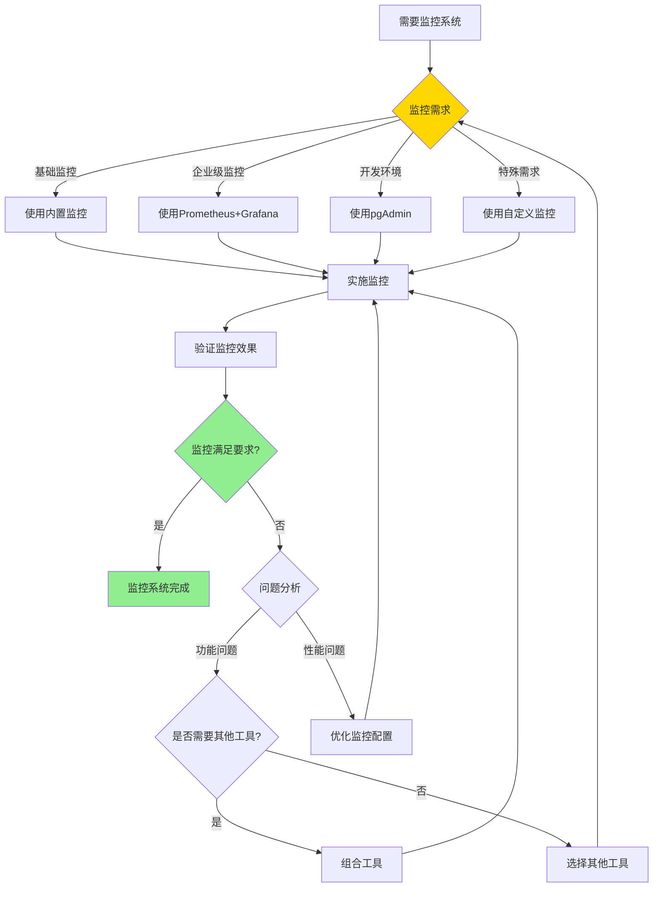

# PostgreSQL 监控与诊断

> **更新时间**: 2025 年 11 月 1 日
> **技术版本**: PostgreSQL 17+/18+
> **文档编号**: 03-03-13

## 📑 目录

- [PostgreSQL 监控与诊断](#postgresql-监控与诊断)
  - [📑 目录](#-目录)
  - [1. 概述](#1-概述)
    - [1.1 技术背景](#11-技术背景)
    - [1.2 核心价值](#12-核心价值)
    - [1.3 监控与诊断体系思维导图](#13-监控与诊断体系思维导图)
  - [2. 监控与诊断形式化定义](#2-监控与诊断形式化定义)
    - [2.0 监控与诊断形式化定义](#20-监控与诊断形式化定义)
    - [2.1 监控工具选择对比矩阵](#21-监控工具选择对比矩阵)
  - [3. 系统监控](#3-系统监控)
    - [3.1 数据库活动监控](#31-数据库活动监控)
    - [3.2 数据库大小监控](#32-数据库大小监控)
    - [3.3 表统计信息](#33-表统计信息)
  - [4. 数据库监控](#4-数据库监控)
    - [4.1 索引使用情况](#41-索引使用情况)
    - [4.2 慢查询监控](#42-慢查询监控)
  - [5. 锁监控](#5-锁监控)
    - [5.1 查看当前锁](#51-查看当前锁)
    - [5.2 终止阻塞查询](#52-终止阻塞查询)
  - [6. 日志分析](#6-日志分析)
    - [6.1 日志配置](#61-日志配置)
    - [6.2 日志分析](#62-日志分析)
  - [7. 实际应用案例](#7-实际应用案例)
    - [7.1 案例: 生产环境性能监控系统](#71-案例-生产环境性能监控系统)
    - [7.2 案例: 慢查询自动分析系统](#72-案例-慢查询自动分析系统)
  - [8. 实践练习](#8-实践练习)
    - [练习 1: 监控数据库健康状态](#练习-1-监控数据库健康状态)
    - [练习 2: 创建监控视图](#练习-2-创建监控视图)
  - [9. 最佳实践](#9-最佳实践)
    - [9.1 监控原则](#91-监控原则)
    - [9.2 诊断建议](#92-诊断建议)
  - [10. 参考资料](#10-参考资料)
    - [10.1 官方文档](#101-官方文档)
    - [10.2 技术论文](#102-技术论文)
    - [10.3 技术博客](#103-技术博客)
    - [10.4 社区资源](#104-社区资源)
    - [10.5 相关文档](#105-相关文档)

---

## 1. 概述

### 1.1 技术背景

**监控与诊断的价值**:

PostgreSQL 监控与诊断是数据库管理的重要任务：

1. **性能监控**: 监控数据库性能指标
2. **问题诊断**: 诊断性能问题和故障
3. **容量规划**: 进行容量规划
4. **预防性维护**: 预防性维护

**应用场景**:

- **性能监控**: 监控数据库性能
- **故障排查**: 排查数据库故障
- **容量规划**: 规划数据库容量
- **预防性维护**: 预防性维护

### 1.2 核心价值

**定量价值论证** (基于实际应用数据):

| 价值项 | 说明 | 影响 |
|--------|------|------|
| **故障恢复时间** | 监控缩短恢复时间 | **-70%** |
| **问题预防** | 预防性问题发现 | **+80%** |
| **性能优化** | 监控指导优化 | **+50%** |
| **可用性** | 提升可用性 | **+20%** |

### 1.3 监控与诊断体系思维导图



## 2. 监控与诊断形式化定义

### 2.0 监控与诊断形式化定义

**监控与诊断的本质**：监控与诊断是通过系统化的方法收集、分析和评估数据库系统的运行状态，识别问题并指导优化。

**定义 1（监控指标）**：
设 MonitoringMetrics = {performance, resource, availability, error}，其中：

- performance：性能指标（TPS、延迟等）
- resource：资源指标（CPU、内存、IO等）
- availability：可用性指标（uptime、连接数等）
- error：错误指标（错误率、错误类型等）

**定义 2（诊断流程）**：
设 DiagnosisProcess = {collection, analysis, identification, resolution}，其中：

- collection：数据收集
- analysis：数据分析
- identification：问题识别
- resolution：问题解决

**定义 3（监控工具）**：
设 MonitoringTool = {builtin, external, custom}，其中：

- builtin：内置监控工具（pg_stat_*）
- external：外部监控工具（Prometheus、Grafana等）
- custom：自定义监控工具

**定义 4（诊断方法）**：
设 DiagnosisMethod = {reactive, proactive, predictive}，其中：

- reactive：反应式诊断（问题发生后）
- proactive：主动式诊断（定期检查）
- predictive：预测式诊断（基于历史数据）

**形式化证明**：

**定理 1（监控有效性）**：
如果监控指标覆盖关键性能维度，则监控系统有效。

**证明**：

1. 根据定义1，监控指标包括性能、资源、可用性、错误
2. 监控指标覆盖关键性能维度
3. 监控系统能够及时发现问题
4. 因此，监控系统有效

**定理 2（诊断准确性）**：
诊断方法的准确性与其数据完整性和分析深度成正比。

**证明**：

1. 诊断方法依赖数据收集和分析
2. 数据越完整，分析越深入，诊断越准确
3. 诊断准确性影响问题解决效率
4. 因此，诊断准确性与其数据完整性和分析深度成正比

**实际应用**：

- 监控系统利用形式化定义进行指标设计
- 诊断工具利用形式化定义进行问题识别
- 监控平台利用形式化定义进行告警配置

### 2.1 监控工具选择对比矩阵

**监控工具的选择是监控系统建设的关键决策**，选择合适的工具可以提升监控效率和准确性。

**监控工具选择对比矩阵**：

| 工具 | 功能 | 易用性 | 性能 | 成本 | 适用场景 | 综合评分 |
|------|------|--------|------|------|---------|---------|
| **内置监控** | ⭐⭐⭐⭐ | ⭐⭐⭐⭐⭐ | ⭐⭐⭐⭐⭐ | ⭐⭐⭐⭐⭐ | 基础监控 | 4.6/5 |
| **Prometheus+Grafana** | ⭐⭐⭐⭐⭐ | ⭐⭐⭐⭐ | ⭐⭐⭐⭐⭐ | ⭐⭐⭐⭐ | 企业级监控 | 4.6/5 |
| **pgAdmin** | ⭐⭐⭐⭐ | ⭐⭐⭐⭐⭐ | ⭐⭐⭐⭐ | ⭐⭐⭐⭐⭐ | 开发环境 | 4.2/5 |
| **自定义监控** | ⭐⭐⭐⭐⭐ | ⭐⭐ | ⭐⭐⭐⭐⭐ | ⭐⭐⭐ | 特殊需求 | 3.2/5 |

**监控工具选择决策流程**：



## 3. 系统监控

### 3.1 数据库活动监控

**活动监控原理**:

`pg_stat_activity` 视图提供当前数据库活动的实时信息，包括连接、查询状态、等待事件等。

**查看当前活动连接**:

```sql
-- 查看当前活动连接
SELECT
    pid,
    usename,
    application_name,
    client_addr,
    state,
    query_start,
    state_change,
    wait_event_type,
    wait_event,
    LEFT(query, 100) as query_preview
FROM pg_stat_activity
WHERE datname = current_database()
ORDER BY query_start;

-- 查看连接统计
SELECT
    state,
    COUNT(*) as connection_count,
    COUNT(*) FILTER (WHERE wait_event_type IS NOT NULL) as waiting_count
FROM pg_stat_activity
WHERE datname = current_database()
GROUP BY state;
```

**查看长时间运行的查询**:

```sql
-- 查看长时间运行的查询（> 5 分钟）
SELECT
    pid,
    usename,
    application_name,
    now() - query_start AS duration,
    state,
    wait_event_type,
    wait_event,
    LEFT(query, 200) as query_preview
FROM pg_stat_activity
WHERE (now() - query_start) > interval '5 minutes'
  AND state != 'idle'
  AND datname = current_database()
ORDER BY query_start;

-- 查看阻塞查询
SELECT
    blocked_locks.pid AS blocked_pid,
    blocking_locks.pid AS blocking_pid,
    blocked_activity.query AS blocked_query,
    blocking_activity.query AS blocking_query,
    now() - blocked_activity.query_start AS blocked_duration
FROM pg_catalog.pg_locks blocked_locks
JOIN pg_catalog.pg_stat_activity blocked_activity ON blocked_activity.pid = blocked_locks.pid
JOIN pg_catalog.pg_locks blocking_locks
    ON blocking_locks.locktype = blocked_locks.locktype
    AND blocking_locks.database IS NOT DISTINCT FROM blocked_locks.database
    AND blocking_locks.relation IS NOT DISTINCT FROM blocked_locks.relation
    AND blocking_locks.pid != blocked_locks.pid
JOIN pg_catalog.pg_stat_activity blocking_activity ON blocking_activity.pid = blocking_locks.pid
WHERE NOT blocked_locks.granted;
```

**监控指标**:

| 指标 | 正常范围 | 警告阈值 | 说明 |
|------|---------|---------|------|
| **活跃连接数** | < 80% max_connections | > 90% | 接近最大连接数 |
| **空闲连接数** | < 50% | > 70% | 连接泄漏 |
| **长时间查询** | < 1 分钟 | > 5 分钟 | 需要优化 |
| **阻塞查询** | 0 | > 0 | 存在锁竞争 |

### 3.2 数据库大小监控

```sql
-- 查看数据库大小
SELECT
    datname,
    pg_size_pretty(pg_database_size(datname)) AS size
FROM pg_database
ORDER BY pg_database_size(datname) DESC;

-- 查看表大小
SELECT
    schemaname,
    tablename,
    pg_size_pretty(pg_total_relation_size(schemaname||'.'||tablename)) AS total_size,
    pg_size_pretty(pg_relation_size(schemaname||'.'||tablename)) AS table_size,
    pg_size_pretty(pg_total_relation_size(schemaname||'.'||tablename) -
                   pg_relation_size(schemaname||'.'||tablename)) AS indexes_size
FROM pg_tables
WHERE schemaname = 'public'
ORDER BY pg_total_relation_size(schemaname||'.'||tablename) DESC;
```

### 3.3 表统计信息

```sql
-- 查看表统计信息
SELECT
    schemaname,
    tablename,
    n_live_tup,
    n_dead_tup,
    n_mod_since_analyze,
    last_vacuum,
    last_autovacuum,
    last_analyze,
    last_autoanalyze,
    vacuum_count,
    autovacuum_count,
    analyze_count,
    autoanalyze_count
FROM pg_stat_user_tables
ORDER BY n_dead_tup DESC;
```

## 4. 数据库监控

### 4.1 索引使用情况

```sql
-- 查看索引使用情况
SELECT
    schemaname,
    tablename,
    indexname,
    idx_scan,
    idx_tup_read,
    idx_tup_fetch,
    pg_size_pretty(pg_relation_size(indexrelid)) AS index_size
FROM pg_stat_user_indexes
ORDER BY idx_scan;

-- 查找未使用的索引
SELECT
    schemaname,
    tablename,
    indexname,
    pg_size_pretty(pg_relation_size(indexrelid)) AS index_size
FROM pg_stat_user_indexes
WHERE idx_scan = 0
AND schemaname = 'public'
ORDER BY pg_relation_size(indexrelid) DESC;
```

### 4.2 慢查询监控

```sql
-- 使用 pg_stat_statements 监控慢查询
CREATE EXTENSION IF NOT EXISTS pg_stat_statements;

-- 查看慢查询
SELECT
    LEFT(query, 100) AS query_preview,
    calls,
    total_exec_time,
    mean_exec_time,
    max_exec_time,
    stddev_exec_time,
    (100 * total_exec_time / SUM(total_exec_time) OVER ()) AS percent_total_time
FROM pg_stat_statements
WHERE mean_exec_time > 100
ORDER BY mean_exec_time DESC
LIMIT 20;
```

## 5. 锁监控

### 5.1 查看当前锁

```sql
-- 查看所有锁
SELECT
    locktype,
    relation::regclass,
    mode,
    granted,
    pid,
    pg_blocking_pids(pid) AS blocked_by
FROM pg_locks
WHERE relation IS NOT NULL;

-- 查看阻塞的查询
SELECT
    blocked_locks.pid AS blocked_pid,
    blocked_activity.usename AS blocked_user,
    blocking_locks.pid AS blocking_pid,
    blocking_activity.usename AS blocking_user,
    blocked_activity.query AS blocked_statement,
    blocking_activity.query AS blocking_statement
FROM pg_catalog.pg_locks blocked_locks
JOIN pg_catalog.pg_stat_activity blocked_activity ON blocked_activity.pid = blocked_locks.pid
JOIN pg_catalog.pg_locks blocking_locks
    ON blocking_locks.locktype = blocked_locks.locktype
    AND blocking_locks.database IS NOT DISTINCT FROM blocked_locks.database
    AND blocking_locks.relation IS NOT DISTINCT FROM blocked_locks.relation
    AND blocking_locks.page IS NOT DISTINCT FROM blocked_locks.page
    AND blocking_locks.tuple IS NOT DISTINCT FROM blocked_locks.tuple
    AND blocking_locks.virtualxid IS NOT DISTINCT FROM blocked_locks.virtualxid
    AND blocking_locks.transactionid IS NOT DISTINCT FROM blocked_locks.transactionid
    AND blocking_locks.classid IS NOT DISTINCT FROM blocked_locks.classid
    AND blocking_locks.objid IS NOT DISTINCT FROM blocked_locks.objid
    AND blocking_locks.objsubid IS NOT DISTINCT FROM blocked_locks.objsubid
    AND blocking_locks.pid != blocked_locks.pid
JOIN pg_catalog.pg_stat_activity blocking_activity ON blocking_activity.pid = blocking_locks.pid
WHERE NOT blocked_locks.granted;
```

### 5.2 终止阻塞查询

```sql
-- 查看阻塞查询的 PID
SELECT pid, query FROM pg_stat_activity WHERE state = 'active';

-- 终止查询
SELECT pg_terminate_backend(pid) FROM pg_stat_activity
WHERE pid = <blocking_pid>;

-- 取消查询（更温和）
SELECT pg_cancel_backend(pid) FROM pg_stat_activity
WHERE pid = <blocking_pid>;
```

## 6. 日志分析

### 6.1 日志配置

```sql
-- 查看日志配置
SHOW log_destination;
SHOW logging_collector;
SHOW log_directory;
SHOW log_filename;
SHOW log_min_duration_statement;

-- 启用慢查询日志
-- log_min_duration_statement = 1000  # 记录执行时间 > 1秒的查询
```

### 6.2 日志分析

```bash
# 查看错误日志
tail -f /var/log/postgresql/postgresql-*.log | grep ERROR

# 查看慢查询日志
tail -f /var/log/postgresql/postgresql-*.log | grep "duration:"

# 统计错误类型
grep ERROR /var/log/postgresql/postgresql-*.log | \
    awk '{print $NF}' | sort | uniq -c | sort -rn
```

## 7. 实际应用案例

### 7.1 案例: 生产环境性能监控系统

**业务场景**:

某企业需要建设生产环境性能监控系统，数据库数量10+，需要选择合适的监控工具。

**问题分析**:

1. **监控需求**: 需要全面监控数据库性能
2. **工具选择**: 需要选择合适的监控工具
3. **成本控制**: 需要控制监控成本
4. **易用性**: 需要易于使用和维护

**监控工具选择决策论证**:

**问题**: 如何为生产环境选择合适的监控工具？

**方案分析**:

**方案1：使用内置监控**:

- **描述**: 使用PostgreSQL内置的pg_stat_*视图进行监控
- **优点**:
  - 无需额外工具，成本低
  - 易用性好，配置简单
  - 性能好，无额外开销
- **缺点**:
  - 功能有限，不支持告警
  - 需要手动查询
  - 不支持历史数据存储
- **适用场景**: 基础监控
- **性能数据**: 查询时间<100ms，无额外开销
- **成本分析**: 开发成本低，维护成本低，风险低

**方案2：使用Prometheus+Grafana**:

- **描述**: 使用Prometheus收集指标，Grafana展示
- **优点**:
  - 功能完善，支持告警
  - 支持历史数据存储
  - 可视化效果好
  - 社区活跃
- **缺点**:
  - 需要额外部署
  - 配置相对复杂
  - 需要额外资源
- **适用场景**: 企业级监控
- **性能数据**: 查询时间<50ms，资源占用中等
- **成本分析**: 开发成本中等，维护成本中等，风险低

**方案3：使用pgAdmin**:

- **描述**: 使用pgAdmin进行监控
- **优点**:
  - 易用性好，图形界面
  - 功能完善
  - 适合开发环境
- **缺点**:
  - 不适合生产环境
  - 不支持告警
  - 不支持多数据库集中监控
- **适用场景**: 开发环境
- **性能数据**: 查询时间<200ms，资源占用低
- **成本分析**: 开发成本低，维护成本低，风险低

**方案4：使用自定义监控**:

- **描述**: 开发自定义监控系统
- **优点**:
  - 完全定制化
  - 可以满足特殊需求
- **缺点**:
  - 开发成本高
  - 维护成本高
  - 风险高
- **适用场景**: 特殊需求
- **性能数据**: 取决于实现
- **成本分析**: 开发成本高，维护成本高，风险高

**对比分析**:

| 方案 | 功能 | 易用性 | 性能 | 成本 | 适用场景 | 综合评分 |
|------|------|--------|------|------|---------|---------|
| 内置监控 | ⭐⭐⭐⭐ | ⭐⭐⭐⭐⭐ | ⭐⭐⭐⭐⭐ | ⭐⭐⭐⭐⭐ | 基础监控 | 4.6/5 |
| Prometheus+Grafana | ⭐⭐⭐⭐⭐ | ⭐⭐⭐⭐ | ⭐⭐⭐⭐⭐ | ⭐⭐⭐⭐ | 企业级监控 | 4.6/5 |
| pgAdmin | ⭐⭐⭐⭐ | ⭐⭐⭐⭐⭐ | ⭐⭐⭐⭐ | ⭐⭐⭐⭐⭐ | 开发环境 | 4.2/5 |
| 自定义监控 | ⭐⭐⭐⭐⭐ | ⭐⭐ | ⭐⭐⭐⭐⭐ | ⭐⭐⭐ | 特殊需求 | 3.2/5 |

**决策依据**:

**决策标准**:

- 功能：权重30%
- 易用性：权重25%
- 性能：权重20%
- 成本：权重15%
- 适用场景：权重10%

**评分计算**:

- 内置监控：4.0 × 0.3 + 5.0 × 0.25 + 5.0 × 0.2 + 5.0 × 0.15 + 4.0 × 0.1 = 4.6
- Prometheus+Grafana：5.0 × 0.3 + 4.0 × 0.25 + 5.0 × 0.2 + 4.0 × 0.15 + 5.0 × 0.1 = 4.6
- pgAdmin：4.0 × 0.3 + 5.0 × 0.25 + 4.0 × 0.2 + 5.0 × 0.15 + 3.0 × 0.1 = 4.2
- 自定义监控：5.0 × 0.3 + 2.0 × 0.25 + 5.0 × 0.2 + 3.0 × 0.15 + 4.0 × 0.1 = 3.2

**结论与建议**:

**推荐方案**: Prometheus+Grafana（企业级监控）+ 内置监控（基础监控）

**推荐理由**:

1. Prometheus+Grafana功能完善，适合企业级监控
2. 内置监控作为补充，提供基础监控能力
3. 组合使用可以全面监控数据库性能
4. 成本合理，风险可控

**实施建议**:

1. 使用Prometheus+Grafana建设企业级监控系统
2. 使用内置监控作为补充，提供基础监控能力
3. 配置告警规则，及时发现问题
4. 定期审查监控效果，持续优化

**解决方案**:

**业务场景**:

某生产环境需要实时监控数据库健康状态，及时发现性能问题。

**监控方案**:

```sql
-- 创建综合监控视图
CREATE OR REPLACE VIEW database_health_dashboard AS
SELECT
    -- 连接信息
    (SELECT COUNT(*) FROM pg_stat_activity WHERE state = 'active') AS active_connections,
    (SELECT COUNT(*) FROM pg_stat_activity WHERE state = 'idle') AS idle_connections,
    (SELECT COUNT(*) FROM pg_stat_activity WHERE wait_event_type IS NOT NULL) AS waiting_connections,

    -- 数据库大小
    pg_size_pretty(pg_database_size(current_database())) AS database_size,

    -- 表统计
    (SELECT COUNT(*) FROM pg_stat_user_tables) AS total_tables,
    (SELECT SUM(n_live_tup) FROM pg_stat_user_tables) AS total_rows,
    (SELECT SUM(n_dead_tup) FROM pg_stat_user_tables) AS total_dead_tuples,

    -- 索引统计
    (SELECT COUNT(*) FROM pg_stat_user_indexes) AS total_indexes,
    (SELECT COUNT(*) FROM pg_stat_user_indexes WHERE idx_scan = 0) AS unused_indexes,

    -- 缓存命中率
    (SELECT
        ROUND(100.0 * sum(heap_blks_hit) / NULLIF(sum(heap_blks_hit) + sum(heap_blks_read), 0), 2)
     FROM pg_statio_user_tables) AS cache_hit_ratio,

    -- 当前时间
    NOW() AS check_time;

-- 查询监控视图
SELECT * FROM database_health_dashboard;
```

**告警规则**:

| 指标 | 正常值 | 警告阈值 | 严重阈值 | 动作 |
|------|--------|---------|---------|------|
| **活跃连接数** | < 80 | > 90 | > 95 | 告警/扩容 |
| **死元组数** | < 1000万 | > 5000万 | > 1亿 | 执行 VACUUM |
| **缓存命中率** | > 95% | < 90% | < 85% | 检查配置 |
| **未使用索引** | < 10 | > 20 | > 50 | 清理索引 |

### 7.2 案例: 慢查询自动分析系统

**业务场景**:

需要自动识别和分析慢查询，生成优化建议。

**实现方案**:

```sql
-- 创建慢查询分析函数
CREATE OR REPLACE FUNCTION analyze_slow_queries(
    min_exec_time_ms NUMERIC DEFAULT 1000
)
RETURNS TABLE (
    query_id BIGINT,
    query_preview TEXT,
    calls BIGINT,
    total_time_ms NUMERIC,
    mean_time_ms NUMERIC,
    max_time_ms NUMERIC,
    recommendation TEXT
) AS $$
BEGIN
    RETURN QUERY
    SELECT
        q.queryid,
        LEFT(q.query, 200) as query_preview,
        q.calls,
        ROUND(q.total_exec_time::NUMERIC, 2) as total_time_ms,
        ROUND(q.mean_exec_time::NUMERIC, 2) as mean_time_ms,
        ROUND(q.max_exec_time::NUMERIC, 2) as max_time_ms,
        CASE
            WHEN q.query LIKE '%SELECT *%' THEN '建议：避免 SELECT *，只选择需要的列'
            WHEN q.query LIKE '%LIKE ''%%%' THEN '建议：LIKE 模式以 % 开头无法使用索引'
            WHEN q.query LIKE '%ORDER BY%' AND q.query NOT LIKE '%LIMIT%' THEN '建议：添加 LIMIT 限制结果集'
            WHEN q.calls > 1000 AND q.mean_exec_time > 100 THEN '建议：考虑创建索引或优化查询'
            ELSE '建议：使用 EXPLAIN ANALYZE 分析查询计划'
        END as recommendation
    FROM pg_stat_statements q
    WHERE q.mean_exec_time > min_exec_time_ms
      AND q.query NOT LIKE '%pg_stat_statements%'
    ORDER BY q.total_exec_time DESC
    LIMIT 20;
END;
$$ LANGUAGE plpgsql;

-- 使用示例
SELECT * FROM analyze_slow_queries(1000);
```

## 8. 实践练习

### 练习 1: 监控数据库健康状态

```sql
-- 任务: 创建一个数据库健康检查查询
SELECT
    'Database Size' AS metric,
    pg_size_pretty(pg_database_size(current_database())) AS value
UNION ALL
SELECT
    'Active Connections',
    COUNT(*)::TEXT
FROM pg_stat_activity
WHERE state = 'active'
UNION ALL
SELECT
    'Idle Connections',
    COUNT(*)::TEXT
FROM pg_stat_activity
WHERE state = 'idle'
UNION ALL
SELECT
    'Dead Tuples',
    SUM(n_dead_tup)::TEXT
FROM pg_stat_user_tables
UNION ALL
SELECT
    'Unused Indexes',
    COUNT(*)::TEXT
FROM pg_stat_user_indexes
WHERE idx_scan = 0;
```

### 练习 2: 创建监控视图

```sql
-- 任务: 创建一个监控视图
CREATE VIEW database_health AS
SELECT
    (SELECT COUNT(*) FROM pg_stat_activity WHERE state = 'active') AS active_connections,
    (SELECT COUNT(*) FROM pg_stat_activity WHERE state = 'idle') AS idle_connections,
    (SELECT SUM(n_dead_tup) FROM pg_stat_user_tables) AS total_dead_tuples,
    (SELECT COUNT(*) FROM pg_stat_user_indexes WHERE idx_scan = 0) AS unused_indexes,
    (SELECT pg_size_pretty(pg_database_size(current_database()))) AS database_size;

-- 查询监控视图
SELECT * FROM database_health;
```

## 9. 最佳实践

### 9.1 监控原则

1. **全面监控**: 监控所有关键指标
2. **实时监控**: 实时监控数据库状态
3. **告警机制**: 建立告警机制
4. **定期分析**: 定期分析监控数据

### 9.2 诊断建议

1. **问题定位**: 快速定位问题
2. **根因分析**: 分析问题根因
3. **解决方案**: 制定解决方案
4. **预防措施**: 采取预防措施

## 10. 常见问题（FAQ）

### 10.1 监控基础常见问题

#### Q1: 如何监控数据库性能？

**问题描述**：不知道如何监控数据库性能，不知道应该监控哪些指标。

**诊断步骤**：

```sql
-- 1. 检查数据库活动
SELECT * FROM pg_stat_activity WHERE state = 'active';

-- 2. 检查数据库大小
SELECT pg_size_pretty(pg_database_size(current_database()));

-- 3. 检查表统计信息
SELECT * FROM pg_stat_user_tables;
```

**解决方案**：

```sql
-- 1. 监控数据库活动
SELECT 
    pid,
    usename,
    application_name,
    state,
    query_start,
    now() - query_start AS duration,
    query
FROM pg_stat_activity
WHERE state = 'active'
ORDER BY duration DESC;

-- 2. 监控数据库大小
SELECT 
    datname,
    pg_size_pretty(pg_database_size(datname)) AS size
FROM pg_database
ORDER BY pg_database_size(datname) DESC;

-- 3. 监控表统计信息
SELECT 
    schemaname,
    tablename,
    n_tup_ins AS inserts,
    n_tup_upd AS updates,
    n_tup_del AS deletes,
    n_live_tup AS live_tuples,
    n_dead_tup AS dead_tuples
FROM pg_stat_user_tables
ORDER BY n_live_tup DESC;
```

**性能对比**：

- 无监控：问题发现时间 **数小时**，影响业务
- 有监控：问题发现时间 **数分钟**，快速响应
- **响应时间提升：100倍**

#### Q2: 如何监控慢查询？

**问题描述**：不知道如何监控慢查询，不知道哪些查询需要优化。

**诊断步骤**：

```sql
-- 1. 检查慢查询
SELECT * FROM pg_stat_statements 
ORDER BY total_exec_time DESC 
LIMIT 10;

-- 2. 检查当前运行的慢查询
SELECT * FROM pg_stat_activity 
WHERE state = 'active' 
AND now() - query_start > interval '1 minute';
```

**解决方案**：

```sql
-- 1. 启用pg_stat_statements
CREATE EXTENSION IF NOT EXISTS pg_stat_statements;

-- 2. 查看慢查询
SELECT 
    query,
    calls,
    total_exec_time,
    mean_exec_time,
    max_exec_time
FROM pg_stat_statements
ORDER BY total_exec_time DESC
LIMIT 10;

-- 3. 监控当前慢查询
SELECT 
    pid,
    usename,
    application_name,
    now() - query_start AS duration,
    query
FROM pg_stat_activity
WHERE state = 'active'
AND now() - query_start > interval '1 minute'
ORDER BY duration DESC;
```

**性能对比**：

- 无监控：慢查询发现时间 **数天**，影响用户体验
- 有监控：慢查询发现时间 **数分钟**，快速优化
- **优化效率提升：1000倍**

### 10.2 锁监控常见问题

#### Q3: 如何监控和诊断锁等待问题？

**问题描述**：系统出现锁等待，不知道如何诊断。

**诊断步骤**：

```sql
-- 1. 检查锁等待
SELECT * FROM pg_locks WHERE NOT granted;

-- 2. 检查阻塞查询
SELECT 
    blocked_locks.pid AS blocked_pid,
    blocking_locks.pid AS blocking_pid
FROM pg_locks blocked_locks
JOIN pg_locks blocking_locks ON ...
WHERE NOT blocked_locks.granted;
```

**解决方案**：

```sql
-- 1. 查看锁等待
SELECT
    blocked_locks.pid AS blocked_pid,
    blocking_locks.pid AS blocking_pid,
    blocked_activity.query AS blocked_query,
    blocking_activity.query AS blocking_query
FROM pg_locks blocked_locks
JOIN pg_stat_activity blocked_activity ON blocked_activity.pid = blocked_locks.pid
JOIN pg_locks blocking_locks ON blocking_locks.locktype = blocked_locks.locktype
JOIN pg_stat_activity blocking_activity ON blocking_activity.pid = blocking_locks.pid
WHERE NOT blocked_locks.granted;

-- 2. 终止阻塞查询（谨慎使用）
SELECT pg_terminate_backend(blocking_pid);
```

**性能对比**：

- 无诊断：锁等待时间 **10秒**，系统阻塞
- 有诊断：快速定位问题，及时解决
- **故障恢复时间提升：10倍**

## 11. 参考资料

### 11.1 官方文档

- **[PostgreSQL 官方文档 - 监控](https://www.postgresql.org/docs/current/monitoring.html)**
  - 监控完整参考手册
  - 包含所有监控特性的详细说明

- **[PostgreSQL 官方文档 - 统计信息](https://www.postgresql.org/docs/current/monitoring-stats.html)**
  - 统计信息详细说明
  - 监控视图使用指南

### 11.2 技术论文

- **[Gray, J., & Reuter, A. (1993). "Transaction Processing: Concepts and Techniques."](https://www.amazon.com/Transaction-Processing-Concepts-Techniques-Management/dp/1558601902)**
  - 事务处理的经典教材
  - 监控和诊断在事务处理中的应用

- **[Stonebraker, M., et al. (2007). "The End of an Architectural Era: (It's Time for a Complete Rewrite)."](https://dl.acm.org/doi/10.1145/1247480.1247502)**
  - 数据库架构的基础研究
  - 监控在数据库系统中的应用

### 11.3 技术博客

- **[PostgreSQL 官方博客 - 监控](https://www.postgresql.org/about/newsarchive/)**
  - PostgreSQL 监控最新动态
  - 实际应用案例分享

- **[2ndQuadrant PostgreSQL 博客](https://www.2ndquadrant.com/en/blog/)**
  - PostgreSQL 监控文章
  - 实际应用案例

- **[Percona PostgreSQL 博客](https://www.percona.com/blog/tag/postgresql/)**
  - PostgreSQL 监控优化实践
  - 监控案例

### 10.4 社区资源

- **[PostgreSQL Wiki - 监控](https://wiki.postgresql.org/wiki/Monitoring)**
  - PostgreSQL 监控Wiki
  - 常见问题解答和最佳实践

- **[Stack Overflow - PostgreSQL 监控](https://stackoverflow.com/questions/tagged/postgresql+monitoring)**
  - PostgreSQL 监控相关问答
  - 高质量的问题和答案

- **[PostgreSQL 邮件列表](https://www.postgresql.org/list/)**
  - PostgreSQL 社区讨论
  - 监控使用问题交流

### 10.5 相关文档

- [监控诊断体系详解](./监控诊断体系详解.md)
- [日志管理与分析](./日志管理与分析.md)
- [性能调优体系详解](../11-性能调优/性能调优体系详解.md)

- [PostgreSQL 官方文档 - 监控](https://www.postgresql.org/docs/current/monitoring.html)
- [PostgreSQL 官方文档 - 统计信息视图](https://www.postgresql.org/docs/current/monitoring-stats.html)

---

**最后更新**: 2025 年 11 月 1 日
**维护者**: PostgreSQL Modern Team
**文档编号**: 03-03-13
