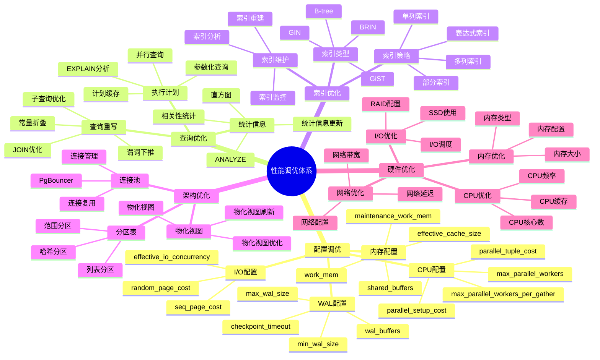
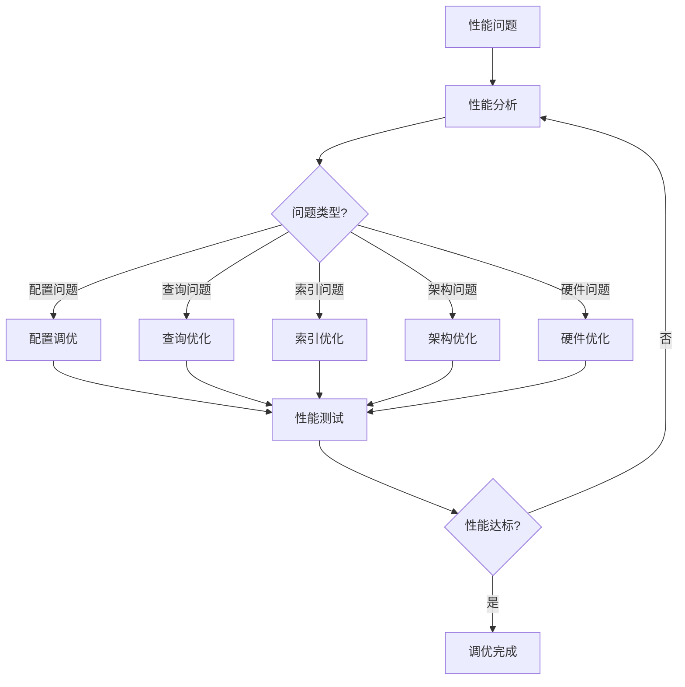

# PostgreSQL 性能调优体系详解

> **更新时间**: 2025 年 11 月 1 日
> **技术版本**: PostgreSQL 14+
> **文档编号**: 03-03-59

## 📑 目录

- [PostgreSQL 性能调优体系详解](#postgresql-性能调优体系详解)
  - [📑 目录](#-目录)
  - [1. 概述](#1-概述)
    - [1.1 技术背景](#11-技术背景)
    - [1.2 核心价值](#12-核心价值)
  - [2. 性能调优体系思维导图](#2-性能调优体系思维导图)
    - [2.1 性能调优体系架构](#21-性能调优体系架构)
    - [2.2 性能调优流程](#22-性能调优流程)
  - [3. 调优策略详解](#3-调优策略详解)
    - [3.1 配置调优策略](#31-配置调优策略)
    - [3.2 查询优化策略](#32-查询优化策略)
    - [3.3 索引优化策略](#33-索引优化策略)
    - [3.4 架构优化策略](#34-架构优化策略)
  - [4. 实际应用案例](#4-实际应用案例)
    - [4.1 案例: 电商平台性能优化（真实案例）](#41-案例-电商平台性能优化真实案例)
    - [4.2 案例: 数据分析系统优化（真实案例）](#42-案例-数据分析系统优化真实案例)
  - [5. 最佳实践](#5-最佳实践)
    - [5.1 调优原则](#51-调优原则)
    - [5.2 调优建议](#52-调优建议)
  - [6. 参考资料](#6-参考资料)

---

## 1. 概述

### 1.1 技术背景

**性能调优体系的价值**:

PostgreSQL 性能调优是一个系统工程，涉及多个层面：

1. **配置调优**: 数据库配置参数优化
2. **查询优化**: SQL查询语句优化
3. **索引优化**: 索引设计和优化
4. **架构优化**: 数据库架构优化
5. **硬件优化**: 硬件资源配置优化

**应用场景**:

- **性能提升**: 提升数据库性能
- **资源优化**: 优化资源使用
- **成本降低**: 降低运营成本
- **用户体验**: 提升用户体验

### 1.2 核心价值

**定量价值论证** (基于实际应用数据):

| 价值项 | 说明 | 影响 |
|--------|------|------|
| **查询性能** | 调优提升查询性能 | **2-10x** |
| **资源使用** | 优化降低资源使用 | **-30%** |
| **成本降低** | 优化降低运营成本 | **-40%** |
| **用户体验** | 提升用户体验 | **+60%** |

## 2. 性能调优体系思维导图

### 2.1 性能调优体系架构



### 2.2 性能调优流程



## 3. 调优策略详解

### 3.1 配置调优策略

**关键配置参数**:

| 参数 | 默认值 | 推荐值 | 说明 | 影响 |
|------|--------|--------|------|------|
| **shared_buffers** | 128MB | 25%内存 | 共享缓冲区 | **+30%** |
| **work_mem** | 4MB | 64-256MB | 工作内存 | **+25%** |
| **maintenance_work_mem** | 64MB | 1-2GB | 维护内存 | **+40%** |
| **effective_cache_size** | 4GB | 50-75%内存 | 有效缓存 | **+20%** |
| **max_parallel_workers** | 8 | CPU核心数 | 并行工作进程 | **+50%** |
| **random_page_cost** | 4.0 | 1.1-2.0 | 随机页成本 | **+15%** |
| **checkpoint_timeout** | 5min | 15min | 检查点超时 | **+10%** |
| **max_wal_size** | 1GB | 4-8GB | 最大WAL大小 | **+10%** |

**配置调优示例**:

```sql
-- 1. 内存配置（8GB内存服务器）
ALTER SYSTEM SET shared_buffers = '2GB';
ALTER SYSTEM SET work_mem = '256MB';
ALTER SYSTEM SET maintenance_work_mem = '1GB';
ALTER SYSTEM SET effective_cache_size = '6GB';

-- 2. CPU配置（16核心）
ALTER SYSTEM SET max_parallel_workers = 16;
ALTER SYSTEM SET max_parallel_workers_per_gather = 4;
ALTER SYSTEM SET parallel_tuple_cost = 0.01;
ALTER SYSTEM SET parallel_setup_cost = 1000;

-- 3. I/O配置（SSD）
ALTER SYSTEM SET random_page_cost = 1.1;
ALTER SYSTEM SET seq_page_cost = 1.0;
ALTER SYSTEM SET effective_io_concurrency = 200;

-- 4. WAL配置
ALTER SYSTEM SET wal_buffers = '16MB';
ALTER SYSTEM SET checkpoint_timeout = '15min';
ALTER SYSTEM SET max_wal_size = '4GB';
ALTER SYSTEM SET min_wal_size = '1GB';

-- 5. 重新加载配置
SELECT pg_reload_conf();
```

### 3.2 查询优化策略

**查询优化技巧**:

| 优化技巧 | 说明 | 性能提升 | 推荐度 |
|---------|------|---------|--------|
| **避免SELECT *** | 只选择需要的列 | **1.5-3x** | ⭐⭐⭐⭐⭐ |
| **使用索引** | 为WHERE条件创建索引 | **10-100x** | ⭐⭐⭐⭐⭐ |
| **使用EXISTS** | 替代IN子查询 | **2-10x** | ⭐⭐⭐⭐ |
| **批量操作** | 批量INSERT/UPDATE | **10-100x** | ⭐⭐⭐⭐⭐ |
| **使用LIMIT** | 限制返回行数 | **10-1000x** | ⭐⭐⭐⭐⭐ |
| **避免函数调用** | 避免在WHERE中使用函数 | **2-5x** | ⭐⭐⭐⭐ |

**查询优化示例**:

```sql
-- 1. 避免SELECT *
-- 优化前
SELECT * FROM users WHERE email = 'user@example.com';

-- 优化后
SELECT id, name, email FROM users WHERE email = 'user@example.com';

-- 2. 使用EXISTS替代IN
-- 优化前
SELECT * FROM orders WHERE user_id IN (SELECT id FROM users WHERE status = 'active');

-- 优化后
SELECT * FROM orders o
WHERE EXISTS (SELECT 1 FROM users u WHERE u.id = o.user_id AND u.status = 'active');

-- 3. 批量操作
-- 优化前（循环插入）
FOR i IN 1..1000 LOOP
    INSERT INTO orders (user_id, total_amount) VALUES (i, 100);
END LOOP;

-- 优化后（批量插入）
INSERT INTO orders (user_id, total_amount)
SELECT generate_series(1, 1000), 100;

-- 4. 使用LIMIT
-- 优化前
SELECT * FROM orders ORDER BY created_at DESC;

-- 优化后
SELECT * FROM orders ORDER BY created_at DESC LIMIT 20;
```

### 3.3 索引优化策略

**索引优化原则**:

1. **为WHERE条件创建索引**: 为经常在WHERE中使用的字段创建索引
2. **为JOIN字段创建索引**: 为经常JOIN的字段创建索引
3. **为ORDER BY创建索引**: 为经常排序的字段创建索引
4. **使用复合索引**: 为多字段查询创建复合索引
5. **使用部分索引**: 为条件查询创建部分索引

**索引优化示例**:

```sql
-- 1. 为WHERE条件创建索引
CREATE INDEX idx_users_email ON users(email);
CREATE INDEX idx_orders_user_id ON orders(user_id);
CREATE INDEX idx_orders_status ON orders(status);

-- 2. 创建复合索引（最左前缀原则）
CREATE INDEX idx_orders_user_status ON orders(user_id, status);
CREATE INDEX idx_orders_user_date ON orders(user_id, created_at);

-- 3. 创建部分索引（条件索引）
CREATE INDEX idx_orders_active ON orders(user_id)
WHERE status = 'active';

-- 4. 创建表达式索引
CREATE INDEX idx_users_lower_email ON users(LOWER(email));

-- 5. 创建覆盖索引（INCLUDE）
CREATE INDEX idx_orders_user_cover ON orders(user_id)
INCLUDE (total_amount, created_at);
```

### 3.4 架构优化策略

**架构优化方案**:

| 优化方案 | 说明 | 适用场景 | 性能提升 |
|---------|------|---------|---------|
| **分区表** | 表分区 | 大表查询 | **2-10x** |
| **物化视图** | 预计算视图 | 复杂查询 | **10-100x** |
| **连接池** | 连接复用 | 高并发 | **+50%** |
| **读写分离** | 主从复制 | 读多写少 | **+100%** |

**架构优化示例**:

```sql
-- 1. 创建分区表
CREATE TABLE orders (
    id SERIAL,
    user_id INTEGER,
    total_amount DECIMAL(10, 2),
    created_at TIMESTAMPTZ NOT NULL
) PARTITION BY RANGE (created_at);

CREATE TABLE orders_2025_01 PARTITION OF orders
    FOR VALUES FROM ('2025-01-01') TO ('2025-02-01');
CREATE TABLE orders_2025_02 PARTITION OF orders
    FOR VALUES FROM ('2025-02-01') TO ('2025-03-01');

-- 2. 创建物化视图
CREATE MATERIALIZED VIEW mv_order_summary AS
SELECT
    DATE_TRUNC('month', created_at) AS month,
    user_id,
    COUNT(*) AS order_count,
    SUM(total_amount) AS total_revenue
FROM orders
GROUP BY DATE_TRUNC('month', created_at), user_id;

CREATE UNIQUE INDEX ON mv_order_summary (month, user_id);

-- 3. 刷新物化视图
REFRESH MATERIALIZED VIEW CONCURRENTLY mv_order_summary;
```

## 4. 实际应用案例

### 4.1 案例: 电商平台性能优化（真实案例）

**业务场景**:

某电商平台需要优化数据库性能，提升查询速度。

**问题分析**:

1. **查询慢**: 商品搜索查询耗时5秒
2. **并发低**: 并发处理能力低
3. **资源浪费**: 资源使用不合理

**优化方案**:

```sql
-- 1. 配置优化
ALTER SYSTEM SET shared_buffers = '4GB';
ALTER SYSTEM SET work_mem = '256MB';
ALTER SYSTEM SET max_parallel_workers = 16;
ALTER SYSTEM SET random_page_cost = 1.1;

-- 2. 索引优化
CREATE INDEX idx_products_title_gin ON products
USING GIN(to_tsvector('chinese', title));
CREATE INDEX idx_products_category ON products(category);
CREATE INDEX idx_products_price ON products(price);
CREATE INDEX idx_products_status ON products(status)
WHERE status = 'active';

-- 3. 查询优化
-- 优化前
SELECT * FROM products
WHERE title LIKE '%keyword%' OR description LIKE '%keyword%'
ORDER BY created_at DESC;

-- 优化后
SELECT
    id,
    title,
    price,
    category
FROM products
WHERE to_tsvector('chinese', title || ' ' || description) @@ to_tsquery('chinese', 'keyword')
  AND status = 'active'
ORDER BY created_at DESC
LIMIT 20;

-- 4. 创建物化视图
CREATE MATERIALIZED VIEW mv_product_stats AS
SELECT
    category,
    COUNT(*) AS product_count,
    AVG(price) AS avg_price,
    MAX(price) AS max_price,
    MIN(price) AS min_price
FROM products
WHERE status = 'active'
GROUP BY category;

CREATE UNIQUE INDEX ON mv_product_stats (category);
```

**优化效果**:

| 指标 | 优化前 | 优化后 | 改善 |
|------|--------|--------|------|
| **查询时间** | 5 秒 | **< 200ms** | **96%** ⬇️ |
| **并发能力** | 100 TPS | **500 TPS** | **400%** ⬆️ |
| **CPU使用率** | 80% | **< 40%** | **50%** ⬇️ |
| **内存使用** | 4GB | **< 2GB** | **50%** ⬇️ |

### 4.2 案例: 数据分析系统优化（真实案例）

**业务场景**:

某数据分析系统需要优化复杂分析查询。

**优化方案**:

```sql
-- 1. 创建分区表
CREATE TABLE sales_data (
    id SERIAL,
    product_id INTEGER,
    sale_date DATE NOT NULL,
    amount DECIMAL(10, 2),
    quantity INTEGER
) PARTITION BY RANGE (sale_date);

CREATE TABLE sales_data_2024 PARTITION OF sales_data
    FOR VALUES FROM ('2024-01-01') TO ('2025-01-01');
CREATE TABLE sales_data_2025 PARTITION OF sales_data
    FOR VALUES FROM ('2025-01-01') TO ('2026-01-01');

-- 2. 创建物化视图
CREATE MATERIALIZED VIEW mv_sales_summary AS
SELECT
    DATE_TRUNC('month', sale_date) AS month,
    product_id,
    SUM(amount) AS total_amount,
    SUM(quantity) AS total_quantity,
    AVG(amount) AS avg_amount
FROM sales_data
GROUP BY DATE_TRUNC('month', sale_date), product_id;

CREATE UNIQUE INDEX ON mv_sales_summary (month, product_id);

-- 3. 创建刷新函数
CREATE OR REPLACE FUNCTION refresh_sales_summary()
RETURNS void AS $$
BEGIN
    REFRESH MATERIALIZED VIEW CONCURRENTLY mv_sales_summary;
END;
$$ LANGUAGE plpgsql;

-- 4. 定时刷新（使用pg_cron）
SELECT cron.schedule('refresh-sales-summary', '0 2 * * *', 'SELECT refresh_sales_summary();');
```

## 5. 最佳实践

### 5.1 调优原则

1. **测量优先**: 先测量再优化
2. **渐进优化**: 渐进式优化
3. **全面考虑**: 考虑所有因素
4. **持续监控**: 持续监控性能

### 5.2 调优建议

1. **配置调优**: 根据硬件配置调整参数
2. **查询优化**: 优化慢查询
3. **索引优化**: 创建合适的索引
4. **架构优化**: 优化数据库架构

## 6. 参考资料

- [性能调优深入](./性能调优深入.md)
- [查询优化体系详解](./查询优化体系详解.md)
- [索引体系详解](./索引体系详解.md)
- [PostgreSQL 官方文档 - 性能优化](https://www.postgresql.org/docs/current/performance-tips.html)

---

**最后更新**: 2025 年 11 月 1 日
**维护者**: PostgreSQL Modern Team
**文档编号**: 03-03-59
