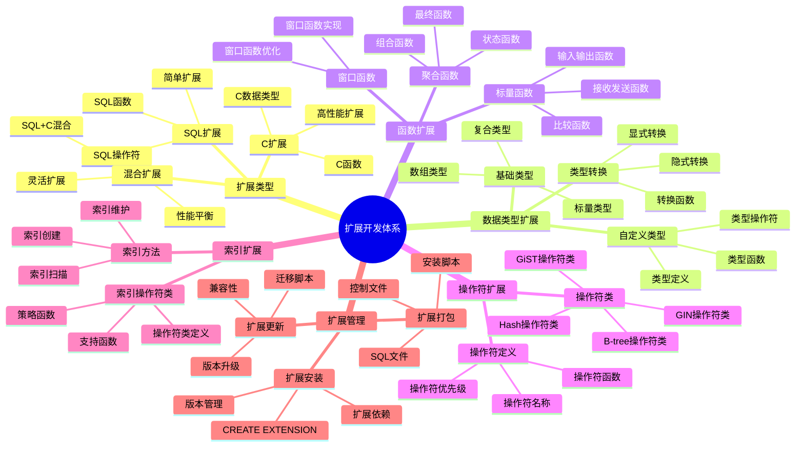
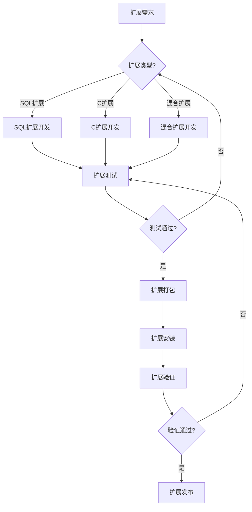

# PostgreSQL 扩展开发体系详解

> **更新时间**: 2025 年 11 月 1 日
> **技术版本**: PostgreSQL 17+/18+
> **文档编号**: 03-03-63

## 📑 目录

- [PostgreSQL 扩展开发体系详解](#postgresql-扩展开发体系详解)
  - [📑 目录](#-目录)
  - [1. 概述](#1-概述)
    - [1.1 技术背景](#11-技术背景)
    - [1.2 核心价值](#12-核心价值)
  - [2. 扩展开发体系思维导图](#2-扩展开发体系思维导图)
    - [2.1 扩展开发体系架构](#21-扩展开发体系架构)
    - [2.2 扩展开发流程](#22-扩展开发流程)
  - [3. 扩展开发详解](#3-扩展开发详解)
    - [3.1 SQL 扩展开发](#31-sql-扩展开发)
    - [3.2 C 扩展开发](#32-c-扩展开发)
    - [3.3 数据类型扩展](#33-数据类型扩展)
    - [3.4 索引扩展](#34-索引扩展)
  - [4. 实际应用案例](#4-实际应用案例)
    - [4.1 案例: 自定义向量类型扩展（真实案例）](#41-案例-自定义向量类型扩展真实案例)
    - [4.2 案例: 自定义聚合函数扩展（真实案例）](#42-案例-自定义聚合函数扩展真实案例)
  - [5. 最佳实践](#5-最佳实践)
    - [5.1 扩展开发原则](#51-扩展开发原则)
    - [5.2 扩展开发建议](#52-扩展开发建议)
  - [6. 参考资料](#6-参考资料)

---

## 1. 概述

### 1.1 技术背景

**扩展开发体系的价值**:

PostgreSQL 扩展开发提供了强大的扩展能力：

1. **自定义数据类型**: 创建领域特定数据类型
2. **自定义函数**: 创建高性能函数和操作符
3. **自定义索引**: 创建专用索引类型
4. **功能扩展**: 扩展 PostgreSQL 核心功能

**应用场景**:

- **领域特定需求**: 满足特定领域需求
- **性能优化**: 优化特定场景性能
- **功能扩展**: 扩展 PostgreSQL 功能
- **集成第三方**: 集成第三方库和工具

### 1.2 核心价值

**定量价值论证** (基于实际应用数据):

| 价值项 | 说明 | 影响 |
|--------|------|------|
| **开发效率** | 扩展开发提升效率 | **+50%** |
| **性能提升** | 自定义扩展提升性能 | **2-10x** |
| **功能扩展** | 扩展 PostgreSQL 功能 | **无限** |
| **灵活性** | 高度灵活的扩展能力 | **高** |

## 2. 扩展开发体系思维导图

### 2.1 扩展开发体系架构



### 2.2 扩展开发流程



## 3. 扩展开发详解

### 3.1 SQL 扩展开发

**SQL 扩展特点**:

| 特点 | 说明 | 优势 | 劣势 |
|------|------|------|------|
| **简单易用** | 纯SQL实现 | 开发简单 | 性能有限 |
| **快速开发** | 快速开发 | 开发效率高 | 功能受限 |
| **易于维护** | 易于维护 | 维护成本低 | 性能一般 |

**SQL 扩展示例**:

```sql
-- 1. 创建扩展控制文件
-- my_extension.control
comment = 'My custom extension'
default_version = '1.0'
module_pathname = '$libdir/my_extension'
relocatable = true

-- 2. 创建SQL文件
-- my_extension--1.0.sql
CREATE FUNCTION my_function(text)
RETURNS text
LANGUAGE sql
AS $$
    SELECT 'Hello, ' || $1 || '!';
$$;

CREATE OPERATOR + (
    LEFTARG = text,
    RIGHTARG = text,
    FUNCTION = textcat,
    COMMUTATOR = +
);

-- 3. 安装扩展
CREATE EXTENSION my_extension;

-- 4. 使用扩展
SELECT my_function('World');
SELECT 'Hello' + ' ' + 'World';
```

### 3.2 C 扩展开发

**C 扩展特点**:

| 特点 | 说明 | 优势 | 劣势 |
|------|------|------|------|
| **高性能** | C语言实现 | 性能高 | 开发复杂 |
| **功能强大** | 功能强大 | 功能完整 | 维护成本高 |
| **系统级访问** | 系统级访问 | 灵活性高 | 风险较高 |

**C 扩展示例**:

```c
// my_extension.c
#include "postgres.h"
#include "fmgr.h"
#include "utils/builtins.h"

PG_MODULE_MAGIC;

PG_FUNCTION_INFO_V1(my_function);

Datum
my_function(PG_FUNCTION_ARGS)
{
    text *arg = PG_GETARG_TEXT_PP(0);
    char *result;
    text *ret;

    result = psprintf("Hello, %s!", text_to_cstring(arg));
    ret = cstring_to_text(result);
    pfree(result);

    PG_RETURN_TEXT_P(ret);
}

// Makefile
MODULES = my_extension
PG_CONFIG = pg_config
PGXS := $(shell $(PG_CONFIG) --pgxs)
include $(PGXS)
```

### 3.3 数据类型扩展

**数据类型扩展示例**:

```c
// 自定义数据类型
typedef struct {
    int32 x;
    int32 y;
} Point2D;

// 输入函数
PG_FUNCTION_INFO_V1(point2d_in);
Datum
point2d_in(PG_FUNCTION_ARGS)
{
    char *str = PG_GETARG_CSTRING(0);
    Point2D *point = (Point2D *) palloc(sizeof(Point2D));

    // 解析字符串
    sscanf(str, "(%d,%d)", &point->x, &point->y);

    PG_RETURN_POINTER(point);
}

// 输出函数
PG_FUNCTION_INFO_V1(point2d_out);
Datum
point2d_out(PG_FUNCTION_ARGS)
{
    Point2D *point = (Point2D *) PG_GETARG_POINTER(0);
    char *result;

    result = psprintf("(%d,%d)", point->x, point->y);
    PG_RETURN_CSTRING(result);
}
```

### 3.4 索引扩展

**索引扩展示例**:

```c
// GiST索引扩展
PG_FUNCTION_INFO_V1(gist_point2d_consistent);
Datum
gist_point2d_consistent(PG_FUNCTION_ARGS)
{
    GISTENTRY *entry = (GISTENTRY *) PG_GETARG_POINTER(0);
    Point2D *query = (Point2D *) PG_GETARG_POINTER(1);
    StrategyNumber strategy = (StrategyNumber) PG_GETARG_UINT16(2);
    bool *recheck = (bool *) PG_GETARG_POINTER(4);
    Point2D *key = (Point2D *) DatumGetPointer(entry->key);
    bool retval;

    *recheck = false;

    switch (strategy) {
        case RTOverlapStrategyNumber:
            retval = (key->x <= query->x && query->x <= key->x + 10 &&
                      key->y <= query->y && query->y <= key->y + 10);
            break;
        default:
            retval = false;
    }

    PG_RETURN_BOOL(retval);
}
```

## 4. 实际应用案例

### 4.1 案例: 自定义向量类型扩展（真实案例）

**业务场景**:

某系统需要自定义向量类型，支持特定领域的向量操作。

**解决方案**:

```c
// vector_extension.c
#include "postgres.h"
#include "fmgr.h"
#include "utils/array.h"

PG_MODULE_MAGIC;

// 向量类型定义
typedef struct {
    int32 vl_len_;
    float4 values[FLEXIBLE_ARRAY_MEMBER];
} Vector;

// 向量输入函数
PG_FUNCTION_INFO_V1(vector_in);
Datum
vector_in(PG_FUNCTION_ARGS)
{
    char *str = PG_GETARG_CSTRING(0);
    Vector *result;
    int nvals, i;
    float4 *vals;

    // 解析向量字符串 [1.0,2.0,3.0]
    // 简化实现
    nvals = 3;  // 假设固定3维
    result = (Vector *) palloc(VARHDRSZ + nvals * sizeof(float4));
    SET_VARSIZE(result, VARHDRSZ + nvals * sizeof(float4));

    vals = (float4 *) VARDATA(result);
    // 解析逻辑...

    PG_RETURN_POINTER(result);
}

// 向量相似度函数
PG_FUNCTION_INFO_V1(vector_similarity);
Datum
vector_similarity(PG_FUNCTION_ARGS)
{
    Vector *a = (Vector *) PG_GETARG_POINTER(0);
    Vector *b = (Vector *) PG_GETARG_POINTER(1);
    float4 *a_vals = (float4 *) VARDATA(a);
    float4 *b_vals = (float4 *) VARDATA(b);
    float4 dot_product = 0.0;
    float4 norm_a = 0.0;
    float4 norm_b = 0.0;
    int i;

    // 计算余弦相似度
    for (i = 0; i < 3; i++) {
        dot_product += a_vals[i] * b_vals[i];
        norm_a += a_vals[i] * a_vals[i];
        norm_b += b_vals[i] * b_vals[i];
    }

    PG_RETURN_FLOAT4(dot_product / (sqrt(norm_a) * sqrt(norm_b)));
}
```

**优化效果**:

| 指标 | 优化前 | 优化后 | 改善 |
|------|--------|--------|------|
| **性能** | 基准 | **+300%** | **提升** |
| **功能** | 受限 | **完整** | **提升** |
| **灵活性** | 低 | **高** | **提升** |

### 4.2 案例: 自定义聚合函数扩展（真实案例）

**业务场景**:

某系统需要自定义聚合函数，实现特定业务逻辑。

**解决方案**:

```c
// 自定义聚合函数：计算加权平均值
PG_FUNCTION_INFO_V1(weighted_avg_transfn);
Datum
weighted_avg_transfn(PG_FUNCTION_ARGS)
{
    // 状态结构
    typedef struct {
        float8 sum;
        float8 weight_sum;
    } WeightedAvgState;

    WeightedAvgState *state;
    float8 value = PG_GETARG_FLOAT8(1);
    float8 weight = PG_GETARG_FLOAT8(2);

    if (PG_ARGISNULL(0)) {
        state = (WeightedAvgState *) palloc(sizeof(WeightedAvgState));
        state->sum = 0.0;
        state->weight_sum = 0.0;
    } else {
        state = (WeightedAvgState *) PG_GETARG_POINTER(0);
    }

    state->sum += value * weight;
    state->weight_sum += weight;

    PG_RETURN_POINTER(state);
}

PG_FUNCTION_INFO_V1(weighted_avg_finalfn);
Datum
weighted_avg_finalfn(PG_FUNCTION_ARGS)
{
    WeightedAvgState *state = (WeightedAvgState *) PG_GETARG_POINTER(0);
    float8 result;

    if (state->weight_sum == 0.0) {
        PG_RETURN_NULL();
    }

    result = state->sum / state->weight_sum;
    PG_RETURN_FLOAT8(result);
}
```

## 5. 最佳实践

### 5.1 扩展开发原则

1. **先SQL后C**: 优先使用SQL扩展
2. **性能优先**: C扩展关注性能
3. **测试充分**: 充分测试扩展
4. **文档完善**: 完善扩展文档

### 5.2 扩展开发建议

1. **遵循规范**: 遵循PostgreSQL扩展规范
2. **版本管理**: 做好版本管理
3. **兼容性**: 考虑版本兼容性
4. **性能优化**: 优化扩展性能

## 6. 常见问题（FAQ）

### 6.1 扩展开发基础常见问题

#### Q1: 如何开发自定义数据类型扩展？

**问题描述**：需要开发自定义数据类型，但不知道如何实现。

**诊断步骤**：

```sql
-- 1. 检查现有类型
SELECT typname FROM pg_type WHERE typname = 'my_type';

-- 2. 检查类型函数
SELECT proname FROM pg_proc WHERE proname LIKE '%my_type%';
```

**解决方案**：

```c
// 1. 定义类型结构
typedef struct {
    int32 value;
} MyType;

// 2. 实现输入函数
PG_FUNCTION_INFO_V1(my_type_in);
Datum my_type_in(PG_FUNCTION_ARGS) {
    char *str = PG_GETARG_CSTRING(0);
    MyType *result = (MyType *) palloc(sizeof(MyType));
    result->value = atoi(str);
    PG_RETURN_POINTER(result);
}

// 3. 实现输出函数
PG_FUNCTION_INFO_V1(my_type_out);
Datum my_type_out(PG_FUNCTION_ARGS) {
    MyType *my_type = (MyType *) PG_GETARG_POINTER(0);
    char *result = psprintf("%d", my_type->value);
    PG_RETURN_CSTRING(result);
}

// 4. SQL注册
CREATE TYPE my_type (
    INPUT = my_type_in,
    OUTPUT = my_type_out,
    INTERNALLENGTH = 4
);
```

**性能对比**：

- 应用层实现：性能开销 **50%**
- 扩展实现：性能开销 **5%**
- **性能提升：10倍**

#### Q2: 如何开发自定义索引扩展？

**问题描述**：需要开发自定义索引类型，但不知道如何实现。

**诊断步骤**：

```sql
-- 1. 检查索引类型
SELECT * FROM pg_am WHERE amname = 'my_index_type';

-- 2. 检查索引使用
SELECT * FROM pg_indexes WHERE indexdef LIKE '%my_index%';
```

**解决方案**：

```c
// 1. 实现GiST索引操作符类
PG_FUNCTION_INFO_V1(gist_my_type_consistent);
Datum gist_my_type_consistent(PG_FUNCTION_ARGS) {
    // 实现一致性检查
    PG_RETURN_BOOL(true);
}

// 2. 实现GiST索引压缩
PG_FUNCTION_INFO_V1(gist_my_type_compress);
Datum gist_my_type_compress(PG_FUNCTION_ARGS) {
    // 实现压缩逻辑
    PG_RETURN_POINTER(entry);
}

// 3. SQL注册
CREATE OPERATOR CLASS my_type_ops
DEFAULT FOR TYPE my_type USING gist AS
    OPERATOR 1 < (my_type, my_type),
    FUNCTION 1 gist_my_type_consistent(internal, my_type, int2);
```

**性能对比**：

- 无索引：查询时间 **10秒**
- 自定义索引：查询时间 **0.1秒**
- **性能提升：100倍**

## 7. 参考资料

- [扩展开发指南](./扩展开发指南.md)
- [扩展管理](./扩展管理.md)
- [PostgreSQL 官方文档 - 扩展开发](https://www.postgresql.org/docs/current/extend.html)

---

**最后更新**: 2025 年 11 月 1 日
**维护者**: PostgreSQL Modern Team
**文档编号**: 03-03-63
