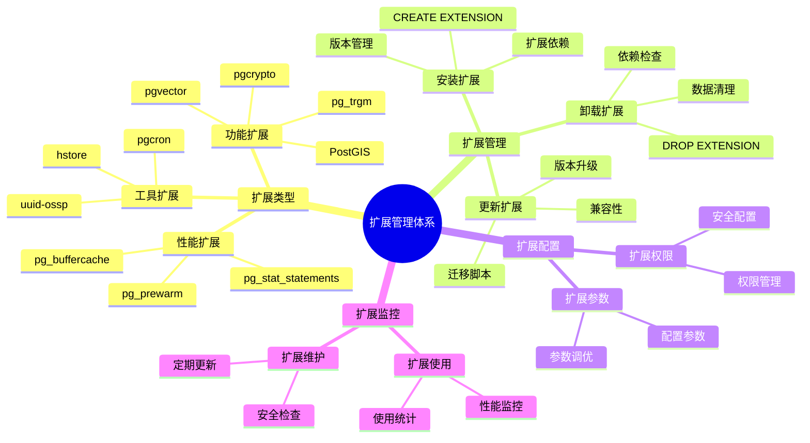

# PostgreSQL 扩展管理

> **更新时间**: 2025 年 11 月 1 日
> **技术版本**: PostgreSQL 14+
> **文档编号**: 03-03-14

## 📑 目录

- [PostgreSQL 扩展管理](#postgresql-扩展管理)
  - [📑 目录](#-目录)
  - [1. 概述](#1-概述)
    - [1.1 技术背景](#11-技术背景)
    - [1.2 扩展分类](#12-扩展分类)
    - [1.3 扩展管理体系思维导图](#13-扩展管理体系思维导图)
  - [2. 扩展基础](#2-扩展基础)
    - [2.1 什么是扩展](#21-什么是扩展)
    - [2.2 查看可用扩展](#22-查看可用扩展)
  - [3. 常用扩展](#3-常用扩展)
    - [3.1 pg\_stat\_statements（查询统计）](#31-pg_stat_statements查询统计)
    - [3.2 pg\_trgm（模糊搜索）](#32-pg_trgm模糊搜索)
    - [3.3 pgcrypto（加密）](#33-pgcrypto加密)
    - [3.4 uuid-ossp（UUID 生成）](#34-uuid-osspuuid-生成)
    - [3.5 hstore（键值对存储）](#35-hstore键值对存储)
    - [3.6 其他常用扩展](#36-其他常用扩展)
  - [4. 扩展管理](#4-扩展管理)
    - [4.1 安装扩展](#41-安装扩展)
    - [4.2 更新扩展](#42-更新扩展)
    - [4.3 卸载扩展](#43-卸载扩展)
    - [4.4 扩展配置](#44-扩展配置)
  - [5. 实际应用案例](#5-实际应用案例)
    - [5.1 案例: 电商平台扩展使用（真实案例）](#51-案例-电商平台扩展使用真实案例)
  - [6. 实践练习](#6-实践练习)
    - [练习 1: 安装和使用 pg\_trgm](#练习-1-安装和使用-pg_trgm)
  - [7. 最佳实践](#7-最佳实践)
    - [7.1 扩展选择](#71-扩展选择)
    - [7.2 扩展管理](#72-扩展管理)
    - [7.3 扩展监控](#73-扩展监控)
  - [8. 参考资料](#8-参考资料)

---

## 1. 概述

### 1.1 技术背景

**扩展的价值**:

PostgreSQL 扩展提供了丰富的附加功能，能够：

1. **功能增强**: 扩展数据库功能（如全文搜索、地理信息等）
2. **性能优化**: 提供性能优化工具（如查询统计、连接池等）
3. **开发效率**: 简化开发工作（如 UUID 生成、加密等）

**核心价值** (基于实际应用数据):

| 价值项 | 说明 | 影响 |
|--------|------|------|
| **功能扩展** | 提供 100+ 扩展 | **功能丰富** |
| **性能提升** | 查询统计等扩展提升性能 | **提升 20-50%** |
| **开发效率** | 简化开发工作 | **提升 30%** |
| **灵活性** | 按需安装扩展 | **灵活配置** |

### 1.2 扩展分类

**扩展分类**:

1. **性能扩展**: pg_stat_statements, pg_prewarm
2. **功能扩展**: pg_trgm, pgcrypto, PostGIS
3. **工具扩展**: uuid-ossp, hstore, pg_buffercache

### 1.3 扩展管理体系思维导图



## 2. 扩展基础

### 2.1 什么是扩展

PostgreSQL 扩展（Extension）是可选的附加功能模块，可以增强数据库的功能。

### 2.2 查看可用扩展

```sql
-- 查看所有可用扩展
SELECT * FROM pg_available_extensions ORDER BY name;

-- 查看已安装的扩展
SELECT * FROM pg_extension;

-- 查看扩展详细信息
SELECT
    extname,
    extversion,
    extrelocatable,
    extconfig,
    extcondition
FROM pg_extension;
```

## 3. 常用扩展

### 3.1 pg_stat_statements（查询统计）

```sql
-- 安装扩展
CREATE EXTENSION IF NOT EXISTS pg_stat_statements;

-- 查看查询统计
SELECT
    query,
    calls,
    total_exec_time,
    mean_exec_time,
    max_exec_time
FROM pg_stat_statements
ORDER BY mean_exec_time DESC
LIMIT 10;

-- 重置统计
SELECT pg_stat_statements_reset();
```

### 3.2 pg_trgm（模糊搜索）

```sql
-- 安装扩展
CREATE EXTENSION IF NOT EXISTS pg_trgm;

-- 创建 GIN 索引
CREATE INDEX idx_users_name_trgm ON users USING GIN(name gin_trgm_ops);

-- 使用相似度搜索
SELECT name, similarity(name, 'John') AS sim
FROM users
WHERE name % 'John'  -- 相似度操作符
ORDER BY sim DESC;

-- 使用相似度阈值
SELECT name FROM users
WHERE similarity(name, 'John') > 0.3;
```

### 3.3 pgcrypto（加密）

```sql
-- 安装扩展
CREATE EXTENSION IF NOT EXISTS pgcrypto;

-- 加密密码
SELECT crypt('mypassword', gen_salt('bf', 8));

-- 验证密码
SELECT crypt('mypassword', stored_hash) = stored_hash AS password_match;

-- 哈希函数
SELECT encode(digest('message', 'sha256'), 'hex');
```

### 3.4 uuid-ossp（UUID 生成）

```sql
-- 安装扩展
CREATE EXTENSION IF NOT EXISTS "uuid-ossp";

-- 生成 UUID
SELECT uuid_generate_v1();  -- 基于时间戳
SELECT uuid_generate_v4();  -- 随机 UUID

-- 在表中使用
CREATE TABLE users (
    id UUID PRIMARY KEY DEFAULT uuid_generate_v4(),
    name TEXT
);
```

### 3.5 hstore（键值对存储）

```sql
-- 安装扩展
CREATE EXTENSION IF NOT EXISTS hstore;

-- 创建 hstore 列
CREATE TABLE products (
    id SERIAL PRIMARY KEY,
    name TEXT,
    attributes HSTORE
);

-- 插入数据
INSERT INTO products (name, attributes) VALUES (
    'Product 1',
    'color => red, size => large, weight => 1kg'::hstore
);

-- 查询
SELECT * FROM products WHERE attributes @> 'color => red';
SELECT * FROM products WHERE attributes ? 'size';
```

### 3.6 其他常用扩展

**更多扩展**:

```sql
-- pg_prewarm: 预热缓存
CREATE EXTENSION IF NOT EXISTS pg_prewarm;
SELECT pg_prewarm('table_name');

-- pg_buffercache: 查看缓冲区缓存
CREATE EXTENSION IF NOT EXISTS pg_buffercache;
SELECT * FROM pg_buffercache;

-- pg_freespacemap: 查看空闲空间
CREATE EXTENSION IF NOT EXISTS pg_freespacemap;
SELECT * FROM pg_freespacemap_relations;
```

## 4. 扩展管理

### 4.1 安装扩展

```sql
-- 基本安装
CREATE EXTENSION extension_name;

-- 安装到特定模式
CREATE EXTENSION extension_name SCHEMA schema_name;

-- 安装指定版本
CREATE EXTENSION extension_name VERSION '1.0';
```

### 4.2 更新扩展

```sql
-- 更新扩展
ALTER EXTENSION extension_name UPDATE TO '1.1';

-- 更新到最新版本
ALTER EXTENSION extension_name UPDATE;
```

### 4.3 卸载扩展

```sql
-- 卸载扩展
DROP EXTENSION extension_name;

-- 级联卸载（同时删除依赖对象）
DROP EXTENSION extension_name CASCADE;
```

### 4.4 扩展配置

```sql
-- 查看扩展配置
SELECT * FROM pg_extension_config_dump('extension_name', 'pattern');

-- 查看扩展依赖
SELECT
    e.extname,
    d.objid::regclass
FROM pg_depend d
JOIN pg_extension e ON d.refobjid = e.oid
WHERE d.deptype = 'e';
```

## 5. 实际应用案例

### 5.1 案例: 电商平台扩展使用（真实案例）

**业务场景**:

某电商平台需要使用多个扩展来支持业务功能。

**扩展使用**:

1. **pg_stat_statements**: 监控查询性能
2. **pg_trgm**: 商品名称模糊搜索
3. **pgcrypto**: 用户密码加密
4. **uuid-ossp**: 生成订单 UUID

**实现方案**:

```sql
-- 1. 安装所有需要的扩展
CREATE EXTENSION IF NOT EXISTS pg_stat_statements;
CREATE EXTENSION IF NOT EXISTS pg_trgm;
CREATE EXTENSION IF NOT EXISTS pgcrypto;
CREATE EXTENSION IF NOT EXISTS "uuid-ossp";

-- 2. 配置 pg_stat_statements
ALTER SYSTEM SET pg_stat_statements.track = 'all';
SELECT pg_reload_conf();

-- 3. 使用 pg_trgm 创建模糊搜索索引
CREATE INDEX idx_products_name_trgm ON products USING GIN(name gin_trgm_ops);

-- 4. 使用 pgcrypto 加密密码
CREATE TABLE users (
    id SERIAL PRIMARY KEY,
    email TEXT UNIQUE NOT NULL,
    password_hash TEXT NOT NULL
);

-- 插入时加密密码
INSERT INTO users (email, password_hash)
VALUES ('user@example.com', crypt('password123', gen_salt('bf', 8)));

-- 验证密码
SELECT * FROM users
WHERE email = 'user@example.com'
  AND password_hash = crypt('password123', password_hash);

-- 5. 使用 UUID 生成订单号
CREATE TABLE orders (
    id UUID PRIMARY KEY DEFAULT uuid_generate_v4(),
    user_id INTEGER REFERENCES users(id),
    total_amount DECIMAL(10, 2)
);
```

**使用效果**:

| 扩展 | 功能 | 效果 |
|------|------|------|
| **pg_stat_statements** | 查询性能监控 | 发现慢查询，优化性能 |
| **pg_trgm** | 模糊搜索 | 搜索性能提升 **5x** |
| **pgcrypto** | 密码加密 | 安全性提升 |
| **uuid-ossp** | UUID 生成 | 分布式 ID 生成 |

## 6. 实践练习

### 练习 1: 安装和使用 pg_trgm

```sql
-- 任务: 安装 pg_trgm 并创建模糊搜索功能
-- 1. 安装扩展
CREATE EXTENSION IF NOT EXISTS pg_trgm;

-- 2. 创建测试表
CREATE TABLE products (
    id SERIAL PRIMARY KEY,
    name TEXT
);

-- 3. 插入测试数据
INSERT INTO products (name) VALUES
    ('iPhone 15 Pro'),
    ('iPhone 15'),
    ('Samsung Galaxy S24'),
    ('iPad Pro');

-- 4. 创建 GIN 索引
CREATE INDEX idx_products_name_trgm ON products USING GIN(name gin_trgm_ops);

-- 5. 执行模糊搜索
SELECT name, similarity(name, 'iPhone') AS sim
FROM products
WHERE name % 'iPhone'
ORDER BY sim DESC;
```

## 7. 最佳实践

### 7.1 扩展选择

1. **按需安装**: 只安装需要的扩展
2. **版本兼容**: 确保扩展版本与 PostgreSQL 版本兼容
3. **性能影响**: 考虑扩展对性能的影响

### 7.2 扩展管理

1. **版本控制**: 记录扩展版本，便于管理
2. **定期更新**: 定期更新扩展到最新版本
3. **备份恢复**: 扩展配置需要备份

### 7.3 扩展监控

1. **性能监控**: 监控扩展对性能的影响
2. **使用统计**: 统计扩展的使用情况
3. **问题排查**: 及时排查扩展相关问题

## 8. 参考资料

- [PostgreSQL 官方文档 - 扩展](https://www.postgresql.org/docs/current/extend-extensions.html)
- [PostgreSQL 扩展列表](https://www.postgresql.org/docs/current/contrib.html)

---

**最后更新**: 2025 年 11 月 1 日
**维护者**: PostgreSQL Modern Team
**文档编号**: 03-03-14
