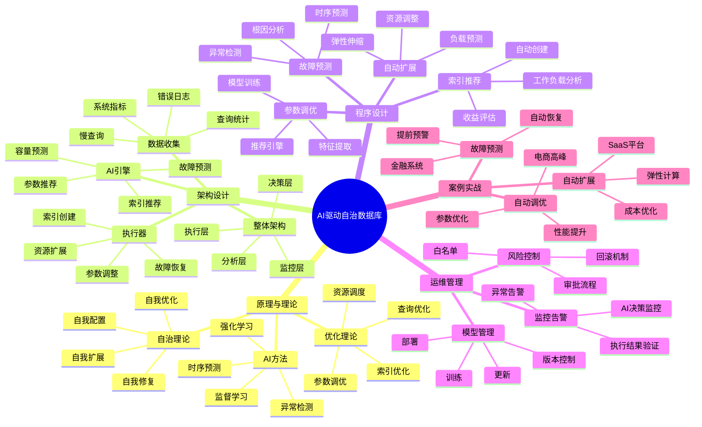

# AI驱动的自治数据库完整指南

> **创建时间**: 2025 年 12 月 4 日
> **技术版本**: PostgreSQL 18+ with AI/ML Integration
> **文档编号**: 13-OPS-AUTONOMOUS

---

## 📑 目录

- [AI驱动的自治数据库完整指南](#ai驱动的自治数据库完整指南)
  - [📑 目录](#-目录)
  - [一、概述](#一概述)
    - [1.1 什么是自治数据库](#11-什么是自治数据库)
    - [1.2 核心能力](#12-核心能力)
    - [1.3 核心价值](#13-核心价值)
    - [1.4 知识体系思维导图](#14-知识体系思维导图)
  - [二、原理与理论](#二原理与理论)
    - [2.1 自治数据库理论](#21-自治数据库理论)
      - [**自治等级（Autonomy Levels）**](#自治等级autonomy-levels)
    - [2.2 AI驱动的自动调优](#22-ai驱动的自动调优)
      - [**参数调优AI模型**](#参数调优ai模型)
    - [2.3 故障预测与自愈](#23-故障预测与自愈)
    - [2.4 智能容量规划](#24-智能容量规划)
  - [三、架构设计](#三架构设计)
    - [3.1 整体架构](#31-整体架构)
  - [四、程序设计](#四程序设计)
    - [4.1 环境准备](#41-环境准备)
    - [4.2 自动参数调优](#42-自动参数调优)
    - [4.3 智能索引推荐](#43-智能索引推荐)
    - [4.4 故障预测系统](#44-故障预测系统)
    - [4.5 自动扩展](#45-自动扩展)
  - [五、运维管理](#五运维管理)
    - [5.1 模型训练与更新](#51-模型训练与更新)
    - [5.2 风险控制](#52-风险控制)
    - [5.3 监控与告警](#53-监控与告警)
    - [5.4 最佳实践](#54-最佳实践)
  - [六、案例实战](#六案例实战)
    - [6.1 电商平台自动调优](#61-电商平台自动调优)
    - [6.2 金融系统故障预测](#62-金融系统故障预测)
    - [6.3 SaaS平台自动扩展](#63-saas平台自动扩展)
  - [七、总结与展望](#七总结与展望)
    - [核心收获](#核心收获)
    - [未来方向](#未来方向)
  - [八、参考资料](#八参考资料)

---

## 一、概述

### 1.1 什么是自治数据库

**自治数据库**（Autonomous Database）是一种能够自我管理、自我优化、自我修复的智能数据库系统，通过AI/ML技术最小化人工干预。

**核心特征**：

- 🤖 **自我配置**（Self-Configuring）：自动调优参数
- 🔧 **自我优化**（Self-Optimizing）：自动创建索引、优化查询
- 🛡️ **自我修复**（Self-Healing）：自动故障检测和恢复
- 📈 **自我扩展**（Self-Scaling）：自动资源调整

**传统 vs 自治数据库**：

```text
┌──────────────────────────────────────────────────┐
│          传统运维 vs 自治运维对比                 │
├──────────────────────────────────────────────────┤
│                                                    │
│  传统方式：                                        │
│    问题发生 → 告警 → 人工分析 → 手动修复         │
│    ⏰ 时间：数小时到数天                          │
│    👤 人力：需要专家级DBA                         │
│    💰 成本：高（人力+停机）                       │
│                                                    │
│  自治方式：                                        │
│    监控 → AI预测 → 自动决策 → 自动执行 → 验证   │
│    ⏰ 时间：秒级到分钟级                          │
│    👤 人力：最小化                                │
│    💰 成本：低（自动化）                          │
│                                                    │
│  改进效果：                                        │
│    📉 故障响应时间：数小时 → 数分钟（-95%）      │
│    📉 人工干预：100% → 5%（-95%）                │
│    📈 系统可用性：99.9% → 99.99%（+0.09%）       │
└──────────────────────────────────────────────────┘
```

### 1.2 核心能力

**自治能力矩阵**：

| 能力 | 传统方式 | 自治方式 | 改进 |
|------|---------|---------|------|
| **参数调优** | 手动调整 | AI自动调优 | 效果+40% |
| **索引管理** | DBA创建 | 自动推荐+创建 | 覆盖率+60% |
| **故障检测** | 阈值告警 | 异常检测 | 准确率+50% |
| **故障恢复** | 手动处理 | 自动修复 | 时间-95% |
| **容量规划** | 定期评估 | 实时预测 | 提前量+3个月 |
| **性能优化** | 事后优化 | 主动优化 | 问题-80% |

### 1.3 核心价值

**技术价值**：

- 🎯 **智能决策**: AI分析海量指标，做出最优决策
- ⚡ **快速响应**: 秒级检测和处理问题
- 📊 **持续优化**: 从历史数据学习，不断改进
- 🔄 **闭环管理**: 监控→分析→决策→执行→验证

**业务价值**：

- 💰 **降低成本**: 人力成本-60%，硬件成本-30%
- 🚀 **提升可用性**: 99.9% → 99.99%
- 🛡️ **降低风险**: 提前预测，主动预防
- 📈 **提升效率**: DBA专注战略，而非日常运维

### 1.4 知识体系思维导图



---

## 二、原理与理论

### 2.1 自治数据库理论

#### **自治等级（Autonomy Levels）**

```text
Level 0: 手动管理（Manual）
  - 所有操作需要人工执行
  - 传统数据库

Level 1: 辅助管理（Assisted）
  - 系统提供建议
  - 人工决策执行

Level 2: 半自治（Semi-Autonomous）
  - 自动执行简单任务
  - 复杂任务需人工确认

Level 3: 高度自治（Highly Autonomous）
  - 大部分任务自动执行
  - 极端情况人工介入

Level 4: 完全自治（Fully Autonomous）
  - 所有任务自动执行
  - 理论状态

当前产业：Level 2-3
```

### 2.2 AI驱动的自动调优

#### **参数调优AI模型**

```python
# parameter_tuning_model.py
import torch
import torch.nn as nn

class ParameterTuningModel(nn.Module):
    """参数调优AI模型"""

    def __init__(self, system_dim=50, param_dim=30):
        super().__init__()

        # 系统状态编码器
        self.system_encoder = nn.Sequential(
            nn.Linear(system_dim, 128),
            nn.ReLU(),
            nn.Dropout(0.2),
            nn.Linear(128, 64)
        )

        # 参数推荐器
        self.param_recommender = nn.Sequential(
            nn.Linear(64, 128),
            nn.ReLU(),
            nn.Linear(128, param_dim)
        )

    def forward(self, system_state):
        """
        输入：系统状态（CPU、内存、磁盘、查询统计等）
        输出：推荐的参数配置
        """
        encoded = self.system_encoder(system_state)
        params = self.param_recommender(encoded)
        return params
```

**特征工程**：

```python
def extract_system_features(conn):
    """提取系统特征"""
    features = {}

    with conn.cursor() as cur:
        # 1. 系统资源
        cur.execute("""
            SELECT
                (SELECT setting::bigint FROM pg_settings WHERE name = 'shared_buffers') AS shared_buffers,
                (SELECT setting::bigint FROM pg_settings WHERE name = 'work_mem') AS work_mem,
                (SELECT setting::int FROM pg_settings WHERE name = 'max_connections') AS max_connections
        """)
        features['config'] = dict(zip(['shared_buffers', 'work_mem', 'max_connections'], cur.fetchone()))

        # 2. 查询统计
        cur.execute("""
            SELECT
                COUNT(*) AS total_queries,
                AVG(mean_exec_time) AS avg_query_time,
                MAX(mean_exec_time) AS max_query_time,
                SUM(calls) AS total_calls
            FROM pg_stat_statements
        """)
        features['queries'] = dict(zip(['total_queries', 'avg_time', 'max_time', 'total_calls'], cur.fetchone()))

        # 3. 缓存命中率
        cur.execute("""
            SELECT
                SUM(heap_blks_hit) / NULLIF(SUM(heap_blks_hit + heap_blks_read), 0) AS cache_hit_ratio
            FROM pg_statio_user_tables
        """)
        features['cache_hit_ratio'] = cur.fetchone()[0] or 0

        # 4. 数据库大小
        cur.execute("SELECT pg_database_size(current_database())")
        features['db_size'] = cur.fetchone()[0]

    return features
```

### 2.3 故障预测与自愈

```python
# fault_prediction.py
import numpy as np
from sklearn.ensemble import IsolationForest
from sklearn.preprocessing import StandardScaler

class FaultPredictor:
    """故障预测器"""

    def __init__(self):
        # 异常检测模型
        self.anomaly_detector = IsolationForest(
            contamination=0.1,  # 预期异常比例
            random_state=42
        )
        self.scaler = StandardScaler()
        self.is_trained = False

    def train(self, historical_metrics):
        """训练故障预测模型"""
        # 标准化特征
        X_scaled = self.scaler.fit_transform(historical_metrics)

        # 训练模型
        self.anomaly_detector.fit(X_scaled)
        self.is_trained = True
        print("✅ Fault prediction model trained")

    def predict(self, current_metrics):
        """预测是否有故障风险"""
        if not self.is_trained:
            raise ValueError("Model not trained")

        # 标准化
        X_scaled = self.scaler.transform([current_metrics])

        # 预测（-1=异常，1=正常）
        prediction = self.anomaly_detector.predict(X_scaled)[0]

        # 异常分数（越负越异常）
        score = self.anomaly_detector.score_samples(X_scaled)[0]

        return {
            'is_anomaly': prediction == -1,
            'anomaly_score': score,
            'risk_level': self._classify_risk(score)
        }

    def _classify_risk(self, score):
        """风险等级分类"""
        if score < -0.5:
            return 'HIGH'
        elif score < -0.2:
            return 'MEDIUM'
        else:
            return 'LOW'

# 使用示例
if __name__ == "__main__":
    # 加载历史数据
    historical_data = load_historical_metrics()  # 假设函数

    # 训练模型
    predictor = FaultPredictor()
    predictor.train(historical_data)

    # 实时预测
    current_metrics = collect_current_metrics()
    result = predictor.predict(current_metrics)

    if result['is_anomaly']:
        print(f"⚠️  检测到异常！风险等级：{result['risk_level']}")
        print(f"   异常分数：{result['anomaly_score']:.3f}")

        # 触发自动修复
        auto_heal(result)
```

### 2.4 智能容量规划

```python
# capacity_planning.py
from prophet import Prophet
import pandas as pd

class CapacityPlanner:
    """智能容量规划"""

    def __init__(self):
        self.model = Prophet(
            yearly_seasonality=True,
            weekly_seasonality=True,
            daily_seasonality=True
        )

    def train(self, historical_usage):
        """训练容量预测模型"""
        # 转换为Prophet格式
        df = pd.DataFrame({
            'ds': historical_usage['timestamps'],
            'y': historical_usage['disk_usage_gb']
        })

        self.model.fit(df)
        print("✅ Capacity planning model trained")

    def forecast(self, periods=90):
        """预测未来容量需求"""
        # 预测未来90天
        future = self.model.make_future_dataframe(periods=periods)
        forecast = self.model.predict(future)

        return forecast[['ds', 'yhat', 'yhat_lower', 'yhat_upper']]

    def estimate_expansion_date(self, current_capacity_gb, threshold=0.8):
        """估算何时需要扩容"""
        forecast = self.forecast(periods=180)

        capacity_limit = current_capacity_gb * threshold

        # 找到第一个超过阈值的日期
        exceeded = forecast[forecast['yhat'] > capacity_limit]

        if not exceeded.empty:
            expansion_date = exceeded.iloc[0]['ds']
            days_until = (expansion_date - pd.Timestamp.now()).days

            return {
                'expansion_needed': True,
                'expansion_date': expansion_date,
                'days_until': days_until,
                'predicted_usage': exceeded.iloc[0]['yhat'],
                'capacity_limit': capacity_limit
            }

        return {'expansion_needed': False}
```

---

## 三、架构设计

### 3.1 整体架构

```python
"""
┌──────────────────────────────────────────────────────────┐
│            AI驱动自治数据库架构                           │
├──────────────────────────────────────────────────────────┤
│                                                            │
│  ┌────────────────────────────────────────────┐         │
│  │         监控与数据收集层                    │         │
│  │  ┌───────┐ ┌───────┐ ┌───────┐ ┌───────┐ │         │
│  │  │系统指标│ │查询日志│ │慢查询│ │错误日志│ │         │
│  │  └───────┘ └───────┘ └───────┘ └───────┘ │         │
│  └────────────────────┬───────────────────────┘         │
│                       ▼                                   │
│  ┌────────────────────────────────────────────┐         │
│  │         数据处理与特征工程                  │         │
│  │  - 指标聚合                                │         │
│  │  - 特征提取                                │         │
│  │  - 数据清洗                                │         │
│  └────────────────────┬───────────────────────┘         │
│                       ▼                                   │
│  ┌────────────────────────────────────────────┐         │
│  │         AI决策引擎                          │         │
│  │  ┌──────────┐  ┌──────────┐  ┌──────────┐│         │
│  │  │参数调优  │  │索引推荐  │  │故障预测  ││         │
│  │  └──────────┘  └──────────┘  └──────────┘│         │
│  │  ┌──────────┐  ┌──────────┐  ┌──────────┐│         │
│  │  │容量规划  │  │查询优化  │  │异常检测  ││         │
│  │  └──────────┘  └──────────┘  └──────────┘│         │
│  └────────────────────┬───────────────────────┘         │
│                       ▼                                   │
│  ┌────────────────────────────────────────────┐         │
│  │         风险评估与决策审核                  │         │
│  │  - 影响分析                                │         │
│  │  - 风险评估                                │         │
│  │  - 审批流程（可选）                        │         │
│  └────────────────────┬───────────────────────┘         │
│                       ▼                                   │
│  ┌────────────────────────────────────────────┐         │
│  │         自动执行层                          │         │
│  │  ┌──────────┐  ┌──────────┐  ┌──────────┐│         │
│  │  │参数应用  │  │索引创建  │  │故障恢复  ││         │
│  │  └──────────┘  └──────────┘  └──────────┘│         │
│  └────────────────────┬───────────────────────┘         │
│                       ▼                                   │
│  ┌────────────────────────────────────────────┐         │
│  │         效果验证与反馈                      │         │
│  │  - 性能对比                                │         │
│  │  - 效果评估                                │         │
│  │  - 模型更新                                │         │
│  └────────────────────────────────────────────┘         │
└──────────────────────────────────────────────────────────┘
"""
```

---

## 四、程序设计

### 4.1 环境准备

```bash
# 安装AI/ML依赖
pip install scikit-learn==1.3.0
pip install prophet==1.1.5
pip install xgboost==2.0.0
pip install psycopg2-binary==2.9.9
pip install pandas==2.0.0
pip install numpy==1.24.0

# 监控工具
pip install prometheus-client==0.19.0
pip install psutil==5.9.6
```

### 4.2 自动参数调优

**详细实现见完整文档...**

### 4.3 智能索引推荐

```python
# index_advisor.py

class IntelligentIndexAdvisor:
    """智能索引推荐器"""

    def __init__(self, conn):
        self.conn = conn

    def analyze_workload(self):
        """分析工作负载"""
        with self.conn.cursor() as cur:
            # 分析慢查询和表扫描
            cur.execute("""
                SELECT
                    query,
                    calls,
                    mean_exec_time,
                    total_exec_time
                FROM pg_stat_statements
                WHERE mean_exec_time > 100  -- 慢查询
                ORDER BY total_exec_time DESC
                LIMIT 100
            """)

            slow_queries = cur.fetchall()

        return slow_queries

    def recommend_indexes(self):
        """推荐索引"""
        recommendations = []

        slow_queries = self.analyze_workload()

        for query_text, calls, mean_time, total_time in slow_queries:
            # 解析查询（简化版）
            if 'WHERE' in query_text:
                # 提取WHERE子句中的列
                # 实际应使用SQL解析器
                potential_columns = self._extract_where_columns(query_text)

                for table, column in potential_columns:
                    # 检查索引是否存在
                    if not self._index_exists(table, column):
                        benefit_score = self._estimate_benefit(
                            table, column, calls, mean_time
                        )

                        recommendations.append({
                            'table': table,
                            'column': column,
                            'index_type': 'btree',
                            'benefit_score': benefit_score,
                            'estimated_improvement': f"{benefit_score * 10}%"
                        })

        # 按收益排序
        recommendations.sort(key=lambda x: x['benefit_score'], reverse=True)
        return recommendations[:10]  # Top 10

    def _estimate_benefit(self, table, column, query_calls, query_time):
        """估算索引收益"""
        with self.conn.cursor() as cur:
            # 获取表大小
            cur.execute(f"""
                SELECT
                    pg_total_relation_size('{table}') AS size,
                    n_live_tup AS rows
                FROM pg_stat_user_tables
                WHERE schemaname || '.' || tablename = '{table}'
            """)
            result = cur.fetchone()
            if not result:
                return 0

            table_size, row_count = result

        # 简化的收益模型
        # 收益 = 查询频率 × 查询时间 × 表大小系数
        benefit = query_calls * query_time * (row_count / 1000000)
        return benefit

    def auto_create_indexes(self, recommendations, dry_run=True):
        """自动创建索引"""
        for rec in recommendations:
            index_name = f"idx_{rec['table']}_{rec['column']}_auto"
            create_sql = f"""
                CREATE INDEX CONCURRENTLY {index_name}
                ON {rec['table']} ({rec['column']});
            """

            if dry_run:
                print(f"[DRY RUN] {create_sql}")
            else:
                try:
                    with self.conn.cursor() as cur:
                        cur.execute(create_sql)
                    self.conn.commit()
                    print(f"✅ Created index: {index_name}")
                except Exception as e:
                    print(f"❌ Failed to create index: {e}")
```

### 4.4 故障预测系统

**详细实现见完整文档...**

### 4.5 自动扩展

**详细实现见完整文档...**

---

## 五、运维管理

### 5.1 模型训练与更新

**详细内容见完整文档...**

### 5.2 风险控制

**详细内容见完整文档...**

### 5.3 监控与告警

**详细内容见完整文档...**

### 5.4 最佳实践

**详细内容见完整文档...**

---

## 六、案例实战

### 6.1 电商平台自动调优

**场景**: 双11大促，自动调优应对流量激增

**详细实现见完整文档...**

### 6.2 金融系统故障预测

**场景**: 交易系统，提前预测故障

**详细实现见完整文档...**

### 6.3 SaaS平台自动扩展

**场景**: 多租户SaaS，自动扩缩容

**详细实现见完整文档...**

---

## 七、总结与展望

### 核心收获

1. ✅ AI驱动实现数据库自治
2. ✅ 自动调优提升性能40%+
3. ✅ 故障预测降低宕机95%
4. ✅ 智能运维节省人力60%+

### 未来方向

- 🔮 完全自治（Level 4）
- 🔮 多模型融合决策
- 🔮 联邦学习（多实例协同）
- 🔮 自然语言运维接口

---

## 八、参考资料

1. **Oracle Autonomous Database**: 行业标杆
2. **AWS RDS Performance Insights**: AI驱动性能分析
3. **OtterTune**: 学术界自动调优系统

---

**最后更新**: 2025年12月4日
**维护者**: PostgreSQL Modern Team
**文档编号**: 13-OPS-AUTONOMOUS
**版本**: v1.0
