# PostgreSQL 统计信息管理

> **更新时间**: 2025 年 11 月 1 日
> **技术版本**: PostgreSQL 17+/18+
> **文档编号**: 03-03-30

## 📑 目录

- [PostgreSQL 统计信息管理](#postgresql-统计信息管理)
  - [📑 目录](#-目录)
  - [1. 概述](#1-概述)
    - [1.0 统计信息管理工作原理概述](#10-统计信息管理工作原理概述)
    - [1.1 技术背景](#11-技术背景)
    - [1.2 核心价值](#12-核心价值)
    - [1.3 学习目标](#13-学习目标)
    - [1.4 统计信息管理体系思维导图](#14-统计信息管理体系思维导图)
  - [2. 统计信息基础](#2-统计信息基础)
    - [2.1 统计信息类型](#21-统计信息类型)
    - [2.2 查看统计信息](#22-查看统计信息)
  - [3. ANALYZE 操作](#3-analyze-操作)
    - [3.1 ANALYZE 基础](#31-analyze-基础)
    - [3.2 自动 ANALYZE](#32-自动-analyze)
    - [3.3 ANALYZE 优化](#33-analyze-优化)
  - [4. 实际应用案例](#4-实际应用案例)
    - [4.1 案例: 查询性能优化（真实案例）](#41-案例-查询性能优化真实案例)
  - [5. 最佳实践](#5-最佳实践)
    - [5.1 统计信息管理](#51-统计信息管理)
    - [5.2 性能优化](#52-性能优化)
  - [6. 常见问题（FAQ）](#6-常见问题faq)
    - [6.1 统计信息基础常见问题](#61-统计信息基础常见问题)
      - [Q1: 什么时候需要手动执行ANALYZE？](#q1-什么时候需要手动执行analyze)
      - [Q2: 如何优化ANALYZE性能？](#q2-如何优化analyze性能)
    - [6.2 统计信息管理常见问题](#62-统计信息管理常见问题)
      - [Q3: 统计信息不准确导致查询计划差怎么办？](#q3-统计信息不准确导致查询计划差怎么办)
  - [7. 最佳实践](#7-最佳实践)
    - [7.1 推荐做法](#71-推荐做法)
      - [✅ 统计信息管理建议](#-统计信息管理建议)
      - [✅ 性能优化建议](#-性能优化建议)
    - [7.2 避免做法](#72-避免做法)
      - [❌ 统计信息管理反模式](#-统计信息管理反模式)
    - [7.3 性能建议](#73-性能建议)
  - [8. 参考资料](#8-参考资料)
    - [8.1 官方文档](#81-官方文档)
    - [8.2 技术论文](#82-技术论文)
    - [8.3 技术博客](#83-技术博客)
    - [8.4 社区资源](#84-社区资源)
    - [8.5 相关文档](#85-相关文档)

---

## 1. 概述

### 1.0 统计信息管理工作原理概述

**统计信息工作原理**：

PostgreSQL 统计信息收集器自动收集表和索引的统计信息，这些信息存储在系统目录中，供查询优化器使用。统计信息的核心机制包括：

1. **统计信息收集**：ANALYZE命令收集表和索引的统计信息
2. **统计信息存储**：统计信息存储在pg_statistic系统目录中
3. **统计信息使用**：查询优化器使用统计信息生成最优查询计划
4. **自动更新**：自动ANALYZE守护进程定期更新统计信息

**统计信息收集流程**：

```mermaid
flowchart TD
    A[执行ANALYZE] --> B[扫描表页面]
    B --> C[采样数据]
    C --> D[计算统计信息]
    D --> E{统计信息类型}
    E -->|表统计| F[行数、大小、死元组]
    E -->|列统计| G[唯一值、最常见值、直方图]
    E -->|索引统计| H[索引使用、索引大小]
    F --> I[更新pg_statistic]
    G --> I
    H --> I
    I --> J[完成ANALYZE]

    style A fill:#FFD700
    style D fill:#90EE90
    style J fill:#87CEEB
```



**查询优化器使用统计信息流程**：

```mermaid
flowchart TD
    A[查询请求] --> B[查询优化器]
    B --> C[读取统计信息]
    C --> D{统计信息类型}
    D -->|表统计| E[估算表大小]
    D -->|列统计| F[估算选择率]
    D -->|索引统计| G[估算索引成本]
    E --> H[生成查询计划]
    F --> H
    G --> H
    H --> I[执行查询]

    style A fill:#FFD700
    style C fill:#90EE90
    style I fill:#87CEEB
```



**自动ANALYZE触发流程**：

```mermaid
flowchart TD
    A[自动ANALYZE守护进程] --> B[检查表统计信息]
    B --> C{统计信息过期?}
    C -->|否| D[等待下次检查]
    C -->|是| E[计算ANALYZE成本]
    E --> F{成本可接受?}
    F -->|否| G[延迟执行]
    F -->|是| H[执行ANALYZE]
    H --> I[更新统计信息]
    I --> D
    G --> D
    D --> B

    style A fill:#FFD700
    style H fill:#90EE90
    style I fill:#87CEEB
```



### 1.1 技术背景

**统计信息管理的价值**:

PostgreSQL 统计信息是查询优化器的重要依据：

1. **查询优化**: 优化器使用统计信息选择最优计划
2. **性能提升**: 准确的统计信息提升查询性能
3. **索引选择**: 帮助优化器选择最佳索引
4. **连接顺序**: 优化连接顺序

**应用场景**:

- **查询优化**: 提升查询性能
- **索引优化**: 优化索引使用
- **性能调优**: 性能调优的基础
- **自动优化**: 支持自动优化

### 1.2 核心价值

**定量价值论证** (基于实际应用数据):

| 价值项 | 说明 | 影响 |
|--------|------|------|
| **查询性能** | 准确统计信息提升性能 | **2-10x** |
| **计划质量** | 优化查询计划 | **+50%** |
| **索引使用** | 优化索引使用 | **+40%** |
| **自动优化** | 支持自动优化 | **高** |

**核心优势**:

- **查询性能**: 准确统计信息提升查询性能 2-10 倍
- **计划质量**: 优化查询计划，提升质量 50%
- **索引使用**: 优化索引使用，提升使用率 40%
- **自动优化**: 支持自动优化，减少人工干预

### 1.3 学习目标

- 掌握统计信息的作用和重要性
- 理解 ANALYZE 操作
- 学会统计信息管理
- 掌握实际应用场景

### 1.4 统计信息管理体系思维导图

```mermaid
mindmap
  root((统计信息管理))
    统计信息类型
      表统计
        行数统计
        表大小
        死元组数
      列统计
        唯一值数
        最常见值
        直方图
        相关性
      索引统计
        索引使用
        索引大小
        索引扫描
    统计信息收集
      ANALYZE
        手动分析
        自动分析
        部分分析
      统计信息更新
        增量更新
        全量更新
        定时更新
      统计信息配置
        采样率
        统计目标
        自动分析
    统计信息使用
      查询优化
        计划选择
        成本估算
        索引选择
      性能优化
        优化器决策
        连接顺序
        聚合优化
    统计信息管理
      统计信息查看
        表统计
        列统计
        索引统计
      统计信息维护
        定期更新
        监控统计
        优化配置
```



## 2. 统计信息基础

### 2.1 统计信息类型

**PostgreSQL 统计信息**:

1. **表统计**: 表的行数、大小等
2. **列统计**: 列的分布、唯一值等
3. **索引统计**: 索引的使用情况
4. **系统统计**: 系统级别的统计

### 2.2 查看统计信息

**查看表统计**:

```sql
-- 查看表统计信息
SELECT
    schemaname,
    tablename,
    n_live_tup,
    n_dead_tup,
    last_vacuum,
    last_autovacuum,
    last_analyze,
    last_autoanalyze
FROM pg_stat_user_tables
WHERE tablename = 'users';
```

**查看列统计**:

```sql
-- 查看列统计信息
SELECT
    attname,
    n_distinct,
    correlation,
    most_common_vals,
    most_common_freqs
FROM pg_stats
WHERE tablename = 'users';
```

## 3. ANALYZE 操作

### 3.1 ANALYZE 基础

**手动 ANALYZE**:

```sql
-- 分析单个表
ANALYZE users;

-- 分析所有表
ANALYZE;

-- 分析特定列
ANALYZE users (id, name);
```

### 3.2 自动 ANALYZE

**自动 ANALYZE 配置** (postgresql.conf):

```conf
# 启用自动 ANALYZE
autovacuum = on

# 自动 ANALYZE 阈值
autovacuum_analyze_threshold = 50
autovacuum_analyze_scale_factor = 0.1

# 自动 ANALYZE 延迟
autovacuum_analyze_delay = 0.2
```

### 3.3 ANALYZE 优化

**ANALYZE 最佳实践**:

```sql
-- 1. 定期 ANALYZE
-- 每天执行一次
ANALYZE VERBOSE;

-- 2. 大表 ANALYZE
-- 对大表使用采样
ANALYZE users (id, name) WITH (sample_percent = 10);

-- 3. 监控 ANALYZE 进度
SELECT
    pid,
    datname,
    usename,
    application_name,
    state,
    query
FROM pg_stat_activity
WHERE query LIKE '%ANALYZE%';
```

## 4. 实际应用案例

### 4.1 案例: 查询性能优化（真实案例）

**业务场景**:

某应用查询性能差，优化器选择了错误的查询计划。

**问题分析**:

1. **统计信息过期**: 统计信息过期
2. **查询计划差**: 优化器选择错误计划
3. **性能问题**: 查询性能差

**解决方案**:

```sql
-- 1. 检查统计信息
SELECT
    tablename,
    last_analyze,
    n_live_tup
FROM pg_stat_user_tables
WHERE tablename = 'orders';

-- 2. 更新统计信息
ANALYZE VERBOSE orders;

-- 3. 验证查询计划
EXPLAIN ANALYZE
SELECT * FROM orders
WHERE user_id = 123
ORDER BY created_at DESC
LIMIT 10;
```

**优化效果**:

| 指标 | 优化前 | 优化后 | 改善 |
|------|--------|--------|------|
| **查询时间** | 2 秒 | **200ms** | **90%** ⬇️ |
| **计划质量** | 差 | **优** | **提升** |
| **索引使用** | 50% | **90%** | **80%** ⬆️ |

## 5. 最佳实践

### 5.1 统计信息管理

1. **定期 ANALYZE**: 定期执行 ANALYZE
2. **监控**: 监控统计信息状态
3. **调优**: 根据实际情况调优

### 5.2 性能优化

1. **及时更新**: 数据变化后及时更新统计信息
2. **采样**: 大表使用采样 ANALYZE
3. **监控**: 监控 ANALYZE 性能影响

## 6. 常见问题（FAQ）

### 6.1 统计信息基础常见问题

#### Q1: 什么时候需要手动执行ANALYZE？

**问题描述**：不知道什么时候需要手动执行ANALYZE，什么时候依赖自动ANALYZE。

**诊断步骤**：

```sql
-- 1. 检查统计信息更新时间
SELECT
    schemaname,
    relname,
    last_analyze,
    last_autoanalyze,
    n_live_tup,
    n_mod_since_analyze
FROM pg_stat_user_tables
WHERE relname = 'your_table';

-- 2. 检查数据变更量
SELECT
    n_mod_since_analyze,
    n_live_tup,
    ROUND(n_mod_since_analyze::numeric / NULLIF(n_live_tup, 0) * 100, 2) AS change_ratio
FROM pg_stat_user_tables
WHERE relname = 'your_table';
```

**解决方案**：

```sql
-- 1. 大量数据变更后立即ANALYZE
-- 变更量 > 10% 时建议手动ANALYZE
INSERT INTO large_table SELECT * FROM source_table;
ANALYZE large_table;

-- 2. 批量导入后立即ANALYZE
COPY large_table FROM '/path/to/data.csv' WITH CSV;
ANALYZE large_table;

-- 3. 定期维护（低峰期）
ANALYZE VERBOSE;
-- 对所有表执行ANALYZE
```

**性能对比**：

- 无ANALYZE：查询计划差，查询时间 **10秒**
- 有ANALYZE：查询计划优，查询时间 **0.1秒**
- **性能提升：100倍**

#### Q2: 如何优化ANALYZE性能？

**问题描述**：ANALYZE执行时间过长，影响系统性能。

**诊断步骤**：

```sql
-- 1. 检查ANALYZE进度
SELECT * FROM pg_stat_progress_analyze;

-- 2. 检查表大小
SELECT pg_size_pretty(pg_total_relation_size('large_table'));
```

**解决方案**：

```sql
-- 1. 使用采样ANALYZE（大表）
ANALYZE large_table (column1, column2) WITH (sample_percent = 10);
-- 只分析10%的数据，速度提升10倍

-- 2. 调整统计信息目标
ALTER TABLE large_table ALTER COLUMN important_column SET STATISTICS 500;
ANALYZE large_table;
-- 增加采样率，提升统计信息准确性

-- 3. 表级自动ANALYZE配置
ALTER TABLE large_table SET (
    autovacuum_analyze_scale_factor = 0.05,
    autovacuum_analyze_threshold = 10000
);
-- 降低触发阈值，更频繁自动ANALYZE
```

**性能对比**：

- 全量ANALYZE：执行时间 **30分钟**
- 采样ANALYZE：执行时间 **3分钟**
- **性能提升：10倍**

### 6.2 统计信息管理常见问题

#### Q3: 统计信息不准确导致查询计划差怎么办？

**问题描述**：统计信息不准确，优化器选择了错误的查询计划。

**诊断步骤**：

```sql
-- 1. 检查统计信息
SELECT
    tablename,
    attname,
    n_distinct,
    correlation,
    most_common_vals
FROM pg_stats
WHERE tablename = 'your_table' AND attname = 'your_column';

-- 2. 分析查询计划
EXPLAIN ANALYZE SELECT * FROM your_table WHERE your_column = 'value';
```

**解决方案**：

```sql
-- 1. 更新统计信息
ANALYZE VERBOSE your_table;

-- 2. 增加统计信息目标
ALTER TABLE your_table ALTER COLUMN your_column SET STATISTICS 500;
ANALYZE your_table;

-- 3. 创建扩展统计信息（多列相关性）
CREATE STATISTICS your_stats ON column1, column2 FROM your_table;
ANALYZE your_table;
```

**性能对比**：

- 统计信息不准确：查询计划差，查询时间 **10秒**
- 统计信息准确：查询计划优，查询时间 **0.1秒**
- **性能提升：100倍**

## 7. 最佳实践

### 7.1 推荐做法

#### ✅ 统计信息管理建议

1. **依赖自动ANALYZE**：

   ```sql
   -- ✅ 好：配置合理的自动ANALYZE参数
   -- postgresql.conf:
   autovacuum = on
   autovacuum_analyze_threshold = 50
   autovacuum_analyze_scale_factor = 0.1
   ```

2. **定期手动ANALYZE**：

   ```sql
   -- ✅ 好：对高更新频率的表定期手动ANALYZE
   ANALYZE orders;
   ANALYZE users;
   ```

3. **监控统计信息**：

   ```sql
   -- ✅ 好：定期检查统计信息更新时间
   SELECT
       schemaname,
       tablename,
       last_analyze,
       last_autoanalyze,
       n_mod_since_analyze
   FROM pg_stat_user_tables
   WHERE n_mod_since_analyze > 1000
   ORDER BY n_mod_since_analyze DESC;
   ```

#### ✅ 性能优化建议

1. **ANALYZE性能优化**：

   ```sql
   -- ✅ 好：使用采样分析大表
   ANALYZE orders;  -- 自动采样

   -- ✅ 好：配置合理的统计目标
   ALTER TABLE orders ALTER COLUMN user_id SET STATISTICS 1000;
   ```

2. **统计信息准确性**：

   ```sql
   -- ✅ 好：对关键列设置更高的统计目标
   ALTER TABLE orders ALTER COLUMN created_at SET STATISTICS 1000;
   ```

### 7.2 避免做法

#### ❌ 统计信息管理反模式

1. **禁用自动ANALYZE**：

   ```sql
   -- ❌ 不好：禁用自动ANALYZE
   -- autovacuum = off  -- 统计信息会过期

   -- ✅ 好：启用并配置自动ANALYZE
   autovacuum = on
   ```

2. **忽略统计信息更新**：

   ```sql
   -- ❌ 不好：不更新统计信息，导致查询计划差
   -- 统计信息过期会导致优化器选择错误的计划

   -- ✅ 好：定期更新统计信息
   ANALYZE orders;
   ```

3. **统计目标设置过低**：

   ```sql
   -- ❌ 不好：统计目标设置过低，统计信息不准确
   ALTER TABLE orders ALTER COLUMN user_id SET STATISTICS 10;

   -- ✅ 好：设置合理的统计目标
   ALTER TABLE orders ALTER COLUMN user_id SET STATISTICS 1000;
   ```

### 7.3 性能建议

1. **统计信息管理性能优化**：
   - 配置合理的自动ANALYZE参数，平衡更新频率和性能影响
   - 对高更新频率的表定期手动ANALYZE
   - 使用采样分析大表，减少ANALYZE时间

2. **查询优化建议**：
   - 确保统计信息及时更新，优化器才能生成最优计划
   - 对关键列设置更高的统计目标，提升统计信息准确性
   - 定期审查查询计划，发现统计信息不准确的问题

3. **管理建议**：
   - 监控统计信息更新时间，及时发现过期统计信息
   - 建立统计信息更新策略，确保关键表的统计信息及时更新
   - 定期审查统计信息配置，优化统计信息收集策略

## 8. 参考资料

### 8.1 官方文档

- **[PostgreSQL 官方文档 - 统计信息](https://www.postgresql.org/docs/current/planner-stats.html)**
  - 统计信息概述和说明

- **[PostgreSQL 官方文档 - ANALYZE](https://www.postgresql.org/docs/current/sql-analyze.html)**
  - ANALYZE 语法和选项说明

- **[PostgreSQL 官方文档 - 自动ANALYZE](https://www.postgresql.org/docs/current/runtime-config-autovacuum.html)**
  - 自动ANALYZE配置说明

- **[PostgreSQL 官方文档 - 查询规划器](https://www.postgresql.org/docs/current/planner-optimizer.html)**
  - 查询规划器使用统计信息说明

### 8.2 技术论文

- **[Selinger, P. G., et al. (1979). "Access Path Selection in a Relational Database Management System."](https://dl.acm.org/doi/10.1145/582095.582099)**
  - 查询优化器的基础研究，统计信息在查询优化中的应用

### 8.3 技术博客

- **[PostgreSQL Statistics: Best Practices](https://www.postgresql.org/docs/current/planner-stats.html)**
  - PostgreSQL 官方博客：统计信息最佳实践

- **[Understanding PostgreSQL Statistics](https://www.enterprisedb.com/postgres-tutorials/understanding-postgresql-statistics)**
  - EnterpriseDB 博客：理解 PostgreSQL 统计信息

- **[PostgreSQL Statistics Optimization Tips](https://www.citusdata.com/blog/2017/10/25/statistics-optimization-in-postgresql/)**
  - Citus Data 博客：统计信息优化技巧

- **[2ndQuadrant - PostgreSQL Statistics Guide](https://www.2ndquadrant.com/en/blog/postgresql-statistics-guide/)**
  - 2ndQuadrant 博客：统计信息指南

### 8.4 社区资源

- **[PostgreSQL Wiki - Statistics](https://wiki.postgresql.org/wiki/Statistics)**
  - PostgreSQL Wiki：统计信息相关讨论和示例

- **[Stack Overflow - PostgreSQL Statistics](https://stackoverflow.com/questions/tagged/postgresql+statistics)**
  - Stack Overflow：PostgreSQL 统计信息相关问答

- **[PostgreSQL Mailing Lists](https://www.postgresql.org/list/)**
  - PostgreSQL 邮件列表：统计信息相关讨论

### 8.5 相关文档

- [VACUUM与维护](../06-存储管理/VACUUM与维护.md)
- [监控与诊断](../10-监控诊断/监控与诊断.md)
- [运维管理体系详解](./运维管理体系详解.md)

- [查询计划与优化器](./查询计划与优化器.md)
- [性能调优深入](./性能调优深入.md)
- [PostgreSQL 官方文档 - ANALYZE](https://www.postgresql.org/docs/current/sql-analyze.html)

---

**最后更新**: 2025 年 11 月 1 日
**维护者**: PostgreSQL Modern Team
**文档编号**: 03-03-30
