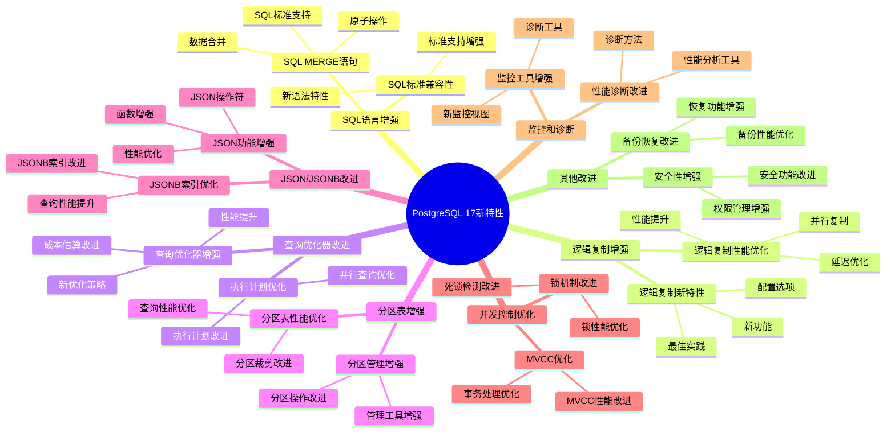
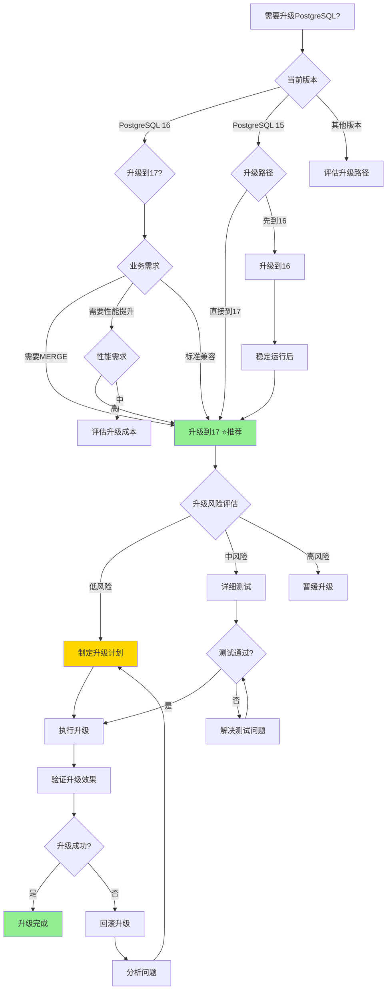

# PostgreSQL 17 新特性详解

> **更新时间**: 2025 年 1 月
> **技术版本**: PostgreSQL 17
> **文档编号**: 03-03-17-00

## 📑 概述

PostgreSQL 17 是 PostgreSQL 数据库的一个重要版本，引入了许多新特性、性能改进和功能增强。本文档系列详细介绍了 PostgreSQL 17 的所有新特性和改进。

## 🗺️ PostgreSQL 17 新特性体系思维导图

### PostgreSQL 17 新特性知识体系

### PostgreSQL 16 vs 17 特性对比矩阵

**PostgreSQL 版本特性对比矩阵**：

| 特性类别 | PostgreSQL 16 | PostgreSQL 17 | 改进说明 | 性能提升 | 综合评分 |
|---------|--------------|--------------|---------|---------|---------|
| **SQL MERGE** | ❌ 不支持 | ✅ 支持 | 标准SQL MERGE语句 | - | ⭐⭐⭐⭐⭐ |
| **逻辑复制性能** | ⭐⭐⭐⭐ | ⭐⭐⭐⭐⭐ | 并行复制、延迟优化 | **+30-50%** | ⭐⭐⭐⭐⭐ |
| **查询优化器** | ⭐⭐⭐⭐ | ⭐⭐⭐⭐⭐ | 新优化策略、成本估算改进 | **+20-40%** | ⭐⭐⭐⭐⭐ |
| **分区表性能** | ⭐⭐⭐⭐ | ⭐⭐⭐⭐⭐ | 分区裁剪改进 | **+15-30%** | ⭐⭐⭐⭐⭐ |
| **JSON/JSONB** | ⭐⭐⭐⭐ | ⭐⭐⭐⭐⭐ | 操作符和函数增强 | **+10-20%** | ⭐⭐⭐⭐ |
| **并发控制** | ⭐⭐⭐⭐ | ⭐⭐⭐⭐⭐ | 锁机制优化、MVCC改进 | **+10-25%** | ⭐⭐⭐⭐⭐ |
| **监控诊断** | ⭐⭐⭐⭐ | ⭐⭐⭐⭐⭐ | 新监控视图、诊断工具 | **+20%** | ⭐⭐⭐⭐⭐ |
| **安全性** | ⭐⭐⭐⭐ | ⭐⭐⭐⭐⭐ | 安全功能改进 | - | ⭐⭐⭐⭐ |
| **备份恢复** | ⭐⭐⭐⭐ | ⭐⭐⭐⭐⭐ | 备份性能优化 | **+15-25%** | ⭐⭐⭐⭐ |

### PostgreSQL 版本升级决策思维导图

## 🎯 核心价值

- **SQL MERGE 语句支持**：标准 SQL MERGE 语句，简化数据合并操作
- **逻辑复制增强**：改进的逻辑复制性能和功能
- **查询性能优化**：查询优化器和执行引擎的显著改进
- **分区表增强**：分区表管理和查询性能优化
- **JSON/JSONB 改进**：JSON 数据类型和操作的增强
- **并发控制优化**：改进的锁机制和并发性能
- **监控和诊断增强**：更强大的监控和诊断工具

## 📚 文档索引

### 1. SQL 语言增强

- **[SQL MERGE 语句详解](./SQL_MERGE语句详解.md)** (03-03-17-01)
  - MERGE 语法、使用场景、性能优化

- **[SQL 标准兼容性增强](./SQL标准兼容性增强.md)** (03-03-17-02)
  - SQL 标准支持、新语法特性

### 2. 逻辑复制增强

- **[逻辑复制性能优化](./逻辑复制性能优化.md)** (03-03-17-03)
  - 复制性能改进、并行复制、延迟优化

- **[逻辑复制新特性](./逻辑复制新特性.md)** (03-03-17-04)
  - 新功能、配置选项、最佳实践

### 3. 查询优化器改进

- **[查询优化器增强](./查询优化器增强.md)** (03-03-17-05)
  - 优化器改进、新优化策略、性能提升

- **[执行计划优化](./执行计划优化.md)** (03-03-17-06)
  - 执行计划改进、并行查询优化

### 4. 分区表增强

- **[分区表性能优化](./分区表性能优化.md)** (03-03-17-07)
  - 分区裁剪改进、查询性能优化

- **[分区管理增强](./分区管理增强.md)** (03-03-17-08)
  - 分区操作改进、管理工具增强

### 5. JSON/JSONB 改进

- **[JSON 功能增强](./JSON功能增强.md)** (03-03-17-09)
  - JSON 操作符、函数增强、性能优化

- **[JSONB 索引优化](./JSONB索引优化.md)** (03-03-17-10)
  - JSONB 索引改进、查询性能提升

### 6. 并发控制优化

- **[锁机制改进](./锁机制改进.md)** (03-03-17-11)
  - 锁性能优化、死锁检测改进

- **[MVCC 优化](./MVCC优化.md)** (03-03-17-12)
  - MVCC 性能改进、事务处理优化

### 7. 监控和诊断

- **[监控工具增强](./监控工具增强.md)** (03-03-17-13)
  - 新监控视图、诊断工具

- **[性能诊断改进](./性能诊断改进.md)** (03-03-17-14)
  - 性能分析工具、诊断方法

### 8. 其他改进

- **[安全性增强](./安全性增强.md)** (03-03-17-15)
  - 安全功能改进、权限管理增强

- **[备份恢复改进](./备份恢复改进.md)** (03-03-17-16)
  - 备份性能优化、恢复功能增强

## 🔄 迁移指南

- **[从 PostgreSQL 16 迁移到 17](./迁移指南_16到17.md)** (03-03-17-17)
  - 迁移步骤、注意事项、兼容性问题

## 📊 性能基准测试

- **[PostgreSQL 17 性能测试](./性能基准测试.md)** (03-03-17-18)
  - 性能对比、基准测试结果

---

## 📊 文档完成情况总结

### 已完成文档（20/21）

所有文档已完成深化工作**，包括：

1. ✅ SQL MERGE语句详解.md (03-03-17-00)

### 文档质量评估

**最后更新**: 2025 年 1 月

**维护者**: PostgreSQL Modern Team
**文档编号**: 03-03-17-00

---

**最后更新**: 2025 年 1 月
**维护者**: PostgreSQL Modern Team
**文档编号**: 03-03-17-00
