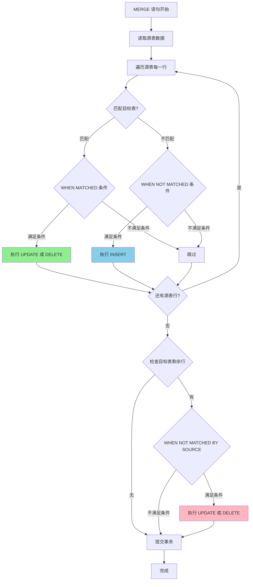

# SQL MERGE 语句详解

> **更新时间**: 2025 年 1 月
> **技术版本**: PostgreSQL 17+
> **文档编号**: 03-03-17-01

## 📑 概述

SQL MERGE 语句是 SQL 标准中用于合并数据的重要语句，PostgreSQL 17 首次原生支持 MERGE 语句。
MERGE 语句允许在一个操作中同时执行 INSERT、UPDATE 和 DELETE 操作，非常适合数据同步、ETL 和数据仓库场景。

## 🎯 核心价值

- **简化数据合并操作**：一个语句完成 INSERT/UPDATE/DELETE
- **提高数据同步效率**：减少多次查询和操作
- **保证数据一致性**：原子性操作，避免竞态条件
- **符合 SQL 标准**：标准 SQL MERGE 语法，易于迁移

## 📚 目录

- [SQL MERGE 语句详解](#sql-merge-语句详解)
  - [📑 概述](#-概述)
  - [🎯 核心价值](#-核心价值)
  - [📚 目录](#-目录)
  - [1. MERGE 语句基础](#1-merge-语句基础)
    - [1.0 MERGE 语句工作原理概述](#10-merge-语句工作原理概述)
    - [1.1 什么是 MERGE](#11-什么是-merge)
    - [1.2 MERGE 基本语法](#12-merge-基本语法)
  - [2. MERGE 语法详解](#2-merge-语法详解)
    - [2.1 完整语法结构](#21-完整语法结构)
    - [2.2 语法组件说明](#22-语法组件说明)
  - [3. MERGE 使用场景](#3-merge-使用场景)
    - [3.1 数据同步](#31-数据同步)
    - [3.2 数据仓库 ETL](#32-数据仓库-etl)
    - [3.3 增量更新](#33-增量更新)
  - [4. MERGE 性能优化](#4-merge-性能优化)
    - [4.1 索引优化](#41-索引优化)
    - [4.2 批量处理](#42-批量处理)
    - [4.3 条件过滤](#43-条件过滤)
  - [5. MERGE 最佳实践](#5-merge-最佳实践)
    - [5.1 使用建议](#51-使用建议)
    - [5.2 注意事项](#52-注意事项)
  - [6. MERGE 与 UPSERT 对比](#6-merge-与-upsert-对比)
    - [6.1 INSERT ... ON CONFLICT](#61-insert--on-conflict)
    - [6.2 MERGE 的优势](#62-merge-的优势)
  - [7. 实际案例](#7-实际案例)
    - [7.1 案例：电商订单同步](#71-案例电商订单同步)
    - [7.2 案例：用户画像更新](#72-案例用户画像更新)
  - [📊 总结](#-总结)
  - [📚 参考资料](#-参考资料)
    - [官方文档](#官方文档)
    - [SQL 标准文档](#sql-标准文档)
    - [技术博客](#技术博客)
    - [社区资源](#社区资源)

---

## 1. MERGE 语句基础

### 1.0 MERGE 语句工作原理概述

**MERGE 语句的本质**：

MERGE 语句是 SQL 标准中用于合并数据的原子操作，它根据源表和目标表的匹配条件，在一个事务中执行 INSERT、UPDATE 或 DELETE 操作。
PostgreSQL 17 首次原生支持 MERGE 语句，提供了比 INSERT ... ON CONFLICT 更强大和标准化的数据合并能力。

**MERGE 语句执行流程图**：



**MERGE 语句执行顺序**：

1. **读取源表**：读取 USING 子句指定的源表数据
2. **匹配检查**：对每行源数据，检查是否匹配目标表（ON 条件）
3. **执行操作**：
   - **WHEN MATCHED**：匹配时执行 UPDATE 或 DELETE
   - **WHEN NOT MATCHED**：不匹配时执行 INSERT
   - **WHEN NOT MATCHED BY SOURCE**：目标表中存在但源表中不存在时执行操作
4. **原子提交**：所有操作在一个事务中完成

### 1.1 什么是 MERGE

MERGE 语句根据源表和目标表的匹配条件，执行 INSERT、UPDATE 或 DELETE 操作。

**MERGE 的核心优势**：

- **原子性**：所有操作在一个事务中完成，保证数据一致性
- **灵活性**：支持多个 WHEN 子句和复杂条件
- **标准化**：符合 SQL 标准，易于迁移和维护
- **性能**：比多次 INSERT/UPDATE/DELETE 操作更高效

### 1.2 MERGE 基本语法

```sql
-- 基本 MERGE 语法
MERGE INTO target_table AS target
USING source_table AS source
ON merge_condition
WHEN MATCHED THEN
    UPDATE SET column1 = value1, ...
WHEN NOT MATCHED THEN
    INSERT (column1, column2, ...) VALUES (value1, value2, ...);

-- 完整示例
MERGE INTO users AS target
USING new_users AS source
ON target.user_id = source.user_id
WHEN MATCHED THEN
    UPDATE SET
        name = source.name,
        email = source.email,
        updated_at = CURRENT_TIMESTAMP
WHEN NOT MATCHED THEN
    INSERT (user_id, name, email, created_at)
    VALUES (source.user_id, source.name, source.email, CURRENT_TIMESTAMP);
```

---

## 2. MERGE 语法详解

### 2.1 完整语法结构

```sql
MERGE INTO target_table [AS target_alias]
USING source_table [AS source_alias]
ON join_condition
[WHEN MATCHED [AND condition] THEN
    { UPDATE SET ... | DELETE }]
[WHEN NOT MATCHED [AND condition] THEN
    INSERT (columns) VALUES (values)]
[WHEN NOT MATCHED BY SOURCE [AND condition] THEN
    { UPDATE SET ... | DELETE }];
```

### 2.2 语法组件说明

- **INTO target_table**：目标表
- **USING source_table**：源表（可以是表、视图、子查询）
- **ON join_condition**：匹配条件
- **WHEN MATCHED**：匹配时的操作
- **WHEN NOT MATCHED**：不匹配时的操作
- **WHEN NOT MATCHED BY SOURCE**：源表中不存在时的操作

---

## 3. MERGE 使用场景

### 3.1 数据同步

```sql
-- 示例：同步用户数据
MERGE INTO users AS target
USING external_users AS source
ON target.user_id = source.user_id
WHEN MATCHED THEN
    UPDATE SET
        name = source.name,
        email = source.email,
        updated_at = CURRENT_TIMESTAMP
WHEN NOT MATCHED THEN
    INSERT (user_id, name, email, created_at)
    VALUES (source.user_id, source.name, source.email, CURRENT_TIMESTAMP);
```

### 3.2 数据仓库 ETL

```sql
-- 示例：数据仓库维度表更新
MERGE INTO dim_customer AS target
USING staging_customer AS source
ON target.customer_key = source.customer_key
WHEN MATCHED AND target.last_updated < source.last_updated THEN
    UPDATE SET
        customer_name = source.customer_name,
        customer_type = source.customer_type,
        last_updated = source.last_updated
WHEN NOT MATCHED THEN
    INSERT (customer_key, customer_name, customer_type, last_updated)
    VALUES (source.customer_key, source.customer_name,
            source.customer_type, source.last_updated);
```

### 3.3 增量更新

```sql
-- 示例：增量更新订单统计
MERGE INTO order_stats AS target
USING (
    SELECT
        order_date,
        COUNT(*) as order_count,
        SUM(amount) as total_amount
    FROM new_orders
    GROUP BY order_date
) AS source
ON target.order_date = source.order_date
WHEN MATCHED THEN
    UPDATE SET
        order_count = target.order_count + source.order_count,
        total_amount = target.total_amount + source.total_amount
WHEN NOT MATCHED THEN
    INSERT (order_date, order_count, total_amount)
    VALUES (source.order_date, source.order_count, source.total_amount);
```

---

## 4. MERGE 性能优化

### 4.1 索引优化

确保 ON 条件中的列有索引：

```sql
-- 创建索引
CREATE INDEX idx_users_user_id ON users(user_id);
CREATE INDEX idx_external_users_user_id ON external_users(user_id);
```

### 4.2 批量处理

对于大量数据，考虑分批处理：

```sql
-- 分批 MERGE
DO $$
DECLARE
    batch_size INTEGER := 10000;
    offset_val INTEGER := 0;
BEGIN
    LOOP
        MERGE INTO target_table AS target
        USING (
            SELECT * FROM source_table
            LIMIT batch_size OFFSET offset_val
        ) AS source
        ON target.id = source.id
        WHEN MATCHED THEN UPDATE SET ...
        WHEN NOT MATCHED THEN INSERT ...;

        EXIT WHEN NOT FOUND;
        offset_val := offset_val + batch_size;
    END LOOP;
END $$;
```

### 4.3 条件过滤

使用 WHEN 子句的条件过滤减少不必要的操作：

```sql
MERGE INTO target AS t
USING source AS s
ON t.id = s.id
WHEN MATCHED AND s.status = 'active' THEN
    UPDATE SET ...
WHEN NOT MATCHED AND s.status = 'active' THEN
    INSERT ...;
```

---

## 5. MERGE 最佳实践

### 5.1 使用建议

**推荐做法**：

1. **明确匹配条件**（确保 ON 条件唯一且高效，使用主键或唯一索引）

   ```sql
   -- ✅ 好：使用主键作为匹配条件
   MERGE INTO users AS target
   USING new_users AS source
   ON target.user_id = source.user_id  -- 主键，高效
   WHEN MATCHED THEN UPDATE ...

   -- ❌ 不好：使用非唯一列作为匹配条件
   MERGE INTO users AS target
   USING new_users AS source
   ON target.email = source.email  -- 可能匹配多行，导致错误
   WHEN MATCHED THEN UPDATE ...
   ```

2. **合理使用条件过滤**（在 WHEN 子句中使用条件减少不必要的操作）

   ```sql
   -- ✅ 好：使用条件过滤，只更新需要更新的行
   MERGE INTO orders AS target
   USING external_orders AS source
   ON target.order_id = source.order_id
   WHEN MATCHED AND target.status != source.status THEN  -- 条件过滤
       UPDATE SET status = source.status
   WHEN NOT MATCHED AND source.status = 'active' THEN  -- 条件过滤
       INSERT (order_id, status) VALUES (source.order_id, source.status);

   -- ❌ 不好：无条件过滤，更新所有匹配的行
   MERGE INTO orders AS target
   USING external_orders AS source
   ON target.order_id = source.order_id
   WHEN MATCHED THEN  -- 无条件，可能更新不需要更新的行
       UPDATE SET status = source.status;
   ```

3. **使用索引优化性能**（为匹配条件创建索引）

   ```sql
   -- ✅ 好：创建索引提升 MERGE 性能
   CREATE INDEX idx_users_user_id ON users(user_id);
   CREATE INDEX idx_orders_order_id ON orders(order_id);

   -- MERGE 执行时会使用索引快速匹配
   MERGE INTO users AS target
   USING new_users AS source
   ON target.user_id = source.user_id;  -- 使用索引
   ```

4. **批量处理大量数据**（分批处理避免长时间锁定）

   ```sql
   -- ✅ 好：分批处理大量数据
   DO $$
   DECLARE
       batch_size INTEGER := 10000;
       offset_val INTEGER := 0;
   BEGIN
       LOOP
           MERGE INTO large_table AS target
           USING (
               SELECT * FROM source_table
               LIMIT batch_size OFFSET offset_val
           ) AS source
           ON target.id = source.id
           WHEN MATCHED THEN UPDATE ...
           WHEN NOT MATCHED THEN INSERT ...;

           EXIT WHEN NOT FOUND;
           offset_val := offset_val + batch_size;
       END LOOP;
   END $$;
   ```

5. **使用事务管理**（MERGE 是原子操作，但大量数据时考虑事务大小）

   ```sql
   -- ✅ 好：在事务中执行 MERGE
   BEGIN;
   MERGE INTO users AS target
   USING new_users AS source
   ON target.user_id = source.user_id
   WHEN MATCHED THEN UPDATE ...
   WHEN NOT MATCHED THEN INSERT ...;
   COMMIT;

   -- ✅ 好：大量数据时分批提交
   -- 每批数据执行一次 MERGE 并提交，避免长时间锁定
   ```

6. **处理约束冲突**（使用错误处理机制）

   ```sql
   -- ✅ 好：使用 DO 块处理错误
   DO $$
   BEGIN
       MERGE INTO users AS target
       USING new_users AS source
       ON target.user_id = source.user_id
       WHEN MATCHED THEN UPDATE ...
       WHEN NOT MATCHED THEN INSERT ...;
   EXCEPTION
       WHEN unique_violation THEN
           RAISE NOTICE 'Duplicate key violation';
       WHEN OTHERS THEN
           RAISE NOTICE 'Error: %', SQLERRM;
   END $$;
   ```

**避免做法**：

1. **避免使用非唯一列作为匹配条件**（可能导致匹配多行错误）
2. **避免无条件更新**（更新不需要更新的行，浪费资源）
3. **避免忽略索引**（性能差）
4. **避免一次性处理大量数据**（长时间锁定，影响并发）
5. **避免忽略错误处理**（约束冲突时无法处理）

### 5.2 注意事项

**重要注意事项**：

1. **MERGE 语句是原子操作**（所有操作在一个事务中完成）

   ```sql
   -- MERGE 是原子操作，要么全部成功，要么全部失败
   MERGE INTO users AS target
   USING new_users AS source
   ON target.user_id = source.user_id
   WHEN MATCHED THEN UPDATE ...
   WHEN NOT MATCHED THEN INSERT ...;
   -- 如果任何操作失败，整个 MERGE 回滚
   ```

2. **避免在 MERGE 中使用触发器**（可能导致意外行为）

   ```sql
   -- ⚠️ 注意：MERGE 会触发目标表的触发器
   -- 如果触发器逻辑复杂，可能导致意外行为
   -- 建议：测试触发器行为，确保符合预期
   ```

3. **注意并发情况下的锁竞争**（MERGE 会锁定目标表）

   ```sql
   -- ⚠️ 注意：MERGE 会对目标表加锁
   -- 大量数据时可能影响并发性能
   -- 建议：分批处理，减少锁定时间
   ```

4. **大量数据时考虑性能影响**（使用 EXPLAIN 分析执行计划）

   ```sql
   -- ✅ 好：分析 MERGE 执行计划
   EXPLAIN ANALYZE
   MERGE INTO users AS target
   USING new_users AS source
   ON target.user_id = source.user_id
   WHEN MATCHED THEN UPDATE ...
   WHEN NOT MATCHED THEN INSERT ...;

   -- 查看执行计划，优化性能
   ```

5. **WHEN 子句的执行顺序**（按顺序检查条件）

   ```sql
   -- ⚠️ 注意：WHEN 子句按顺序检查
   -- 第一个满足条件的 WHEN 子句会被执行
   MERGE INTO users AS target
   USING new_users AS source
   ON target.user_id = source.user_id
   WHEN MATCHED AND source.status = 'active' THEN  -- 先检查这个
       UPDATE SET status = 'active'
   WHEN MATCHED THEN  -- 如果上面的不满足，才检查这个
       UPDATE SET status = source.status;
   ```

---

## 6. MERGE 与 UPSERT 对比

### 6.1 INSERT ... ON CONFLICT

```sql
-- PostgreSQL 9.5+ 的 UPSERT
INSERT INTO users (user_id, name, email)
VALUES (1, 'John', 'john@example.com')
ON CONFLICT (user_id)
DO UPDATE SET
    name = EXCLUDED.name,
    email = EXCLUDED.email;
```

### 6.2 MERGE 的优势

- **更灵活**：支持多个 WHEN 子句和复杂条件
- **更标准**：符合 SQL 标准，易于迁移
- **更强大**：支持 DELETE 操作和源表不存在的情况

---

## 7. 实际案例

### 7.1 案例：电商订单同步

```sql
-- 同步订单数据
MERGE INTO orders AS target
USING external_orders AS source
ON target.order_id = source.order_id
WHEN MATCHED AND target.status != source.status THEN
    UPDATE SET
        status = source.status,
        updated_at = CURRENT_TIMESTAMP
WHEN NOT MATCHED THEN
    INSERT (order_id, customer_id, amount, status, created_at)
    VALUES (source.order_id, source.customer_id,
            source.amount, source.status, source.created_at)
WHEN NOT MATCHED BY SOURCE AND target.status = 'pending' THEN
    DELETE;  -- 删除源表中不存在的待处理订单
```

### 7.2 案例：用户画像更新

```sql
-- 更新用户画像
MERGE INTO user_profiles AS target
USING user_activity AS source
ON target.user_id = source.user_id
WHEN MATCHED THEN
    UPDATE SET
        last_active = source.activity_time,
        activity_count = target.activity_count + 1,
        total_score = target.total_score + source.score
WHEN NOT MATCHED THEN
    INSERT (user_id, last_active, activity_count, total_score)
    VALUES (source.user_id, source.activity_time, 1, source.score);
```

---

## 📊 总结

PostgreSQL 17 的 MERGE 语句为数据合并操作提供了强大而标准化的解决方案。通过合理使用 MERGE 语句，可以简化数据同步、ETL 和数据仓库等场景的操作，提高开发效率和数据一致性。

## 📚 参考资料

### 官方文档

- **[PostgreSQL 官方文档 - MERGE 语句](https://www.postgresql.org/docs/17/sql-merge.html)**
  - MERGE 语句完整参考手册
  - 语法和示例说明

- **[PostgreSQL 17 发布说明 - MERGE](https://www.postgresql.org/about/news/postgresql-17-released-2781/)**
  - PostgreSQL 17 新特性介绍
  - MERGE 语句功能说明

- **[PostgreSQL Wiki - MERGE Statement](https://wiki.postgresql.org/wiki/MERGE)**
  - MERGE 语句社区讨论
  - 使用示例和最佳实践

### SQL 标准文档

- **[ISO/IEC 9075 SQL 标准 - MERGE](https://www.iso.org/standard/76583.html)**
  - SQL 标准 MERGE 语句定义
  - PostgreSQL 对标准的支持情况

### 技术博客

- **[PostgreSQL 官方博客 - MERGE Statement](https://www.postgresql.org/about/news/postgresql-17-merges-into-production-2781/)**
  - MERGE 语句发布公告
  - 使用场景和优势

- **[2ndQuadrant - PostgreSQL 17 MERGE](https://www.2ndquadrant.com/en/blog/postgresql-17-merge-statement/)**
  - MERGE 语句实战
  - 性能优化建议

- **[Percona - PostgreSQL MERGE Statement](https://www.percona.com/blog/postgresql-17-merge-statement/)**
  - MERGE 语句详解
  - 与 UPSERT 对比

### 社区资源

- **[PostgreSQL Wiki - MERGE](https://wiki.postgresql.org/wiki/MERGE)**
  - MERGE 语句使用指南
  - 常见问题解答

- **[Stack Overflow - PostgreSQL MERGE](https://stackoverflow.com/questions/tagged/postgresql+merge)**
  - MERGE 相关问题解答
  - 实际应用案例

---

**最后更新**: 2025 年 1 月
**维护者**: PostgreSQL Modern Team
**文档编号**: 03-03-17-01
