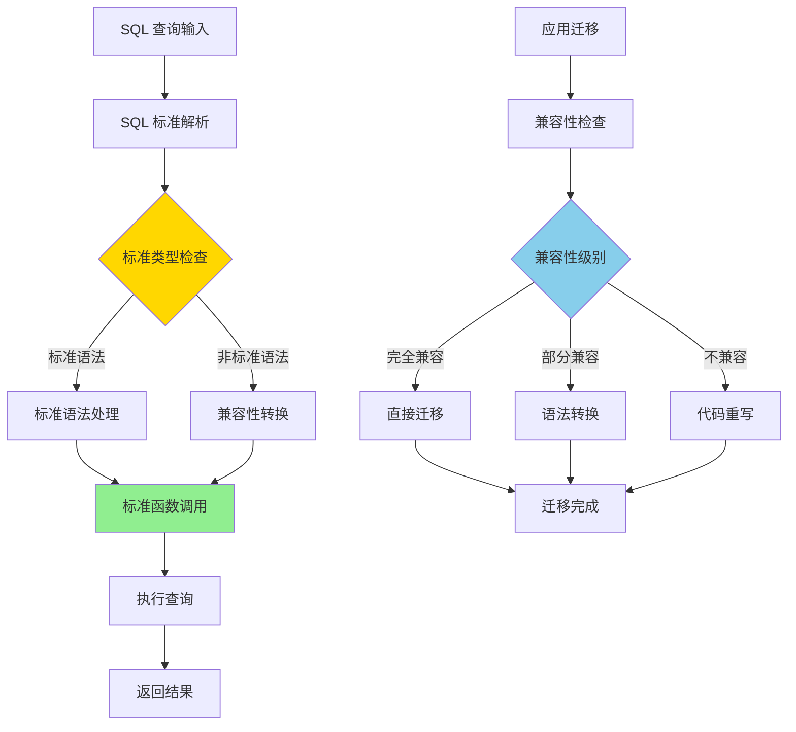

# PostgreSQL 17 SQL 标准兼容性增强

> **更新时间**: 2025 年 1 月
> **技术版本**: PostgreSQL 17+
> **文档编号**: 03-03-17-02

## 📑 概述

PostgreSQL 17 进一步增强了对 SQL 标准的兼容性，包括新的 SQL 语法特性、标准函数支持、数据类型兼容性等，使得 PostgreSQL 更符合 SQL 标准，便于应用迁移和互操作性。

## 🎯 核心价值

- **SQL 标准兼容**：更好的 SQL 标准兼容性
- **语法增强**：新的 SQL 语法特性
- **函数扩展**：标准 SQL 函数支持
- **数据类型**：标准数据类型支持
- **互操作性**：与其他数据库更好的互操作

## 📚 目录

- [PostgreSQL 17 SQL 标准兼容性增强](#postgresql-17-sql-标准兼容性增强)
  - [📑 概述](#-概述)
  - [🎯 核心价值](#-核心价值)
  - [📚 目录](#-目录)
  - [1. SQL 标准兼容性概述](#1-sql-标准兼容性概述)
    - [1.0 SQL 标准兼容性增强工作原理概述](#10-sql-标准兼容性增强工作原理概述)
    - [1.1 PostgreSQL 17 标准兼容性](#11-postgresql-17-标准兼容性)
    - [1.2 兼容性级别](#12-兼容性级别)
  - [2. 新语法特性](#2-新语法特性)
    - [2.1 MERGE 语句](#21-merge-语句)
    - [2.2 增强的窗口函数](#22-增强的窗口函数)
  - [3. 标准函数支持](#3-标准函数支持)
    - [3.1 字符串函数](#31-字符串函数)
    - [3.2 日期时间函数](#32-日期时间函数)
  - [4. 数据类型兼容性](#4-数据类型兼容性)
    - [4.1 标准数据类型](#41-标准数据类型)
    - [4.2 JSON 标准支持](#42-json-标准支持)
  - [5. 兼容性测试](#5-兼容性测试)
    - [5.1 SQL 标准测试](#51-sql-标准测试)
    - [5.2 兼容性检查](#52-兼容性检查)
  - [6. 迁移建议](#6-迁移建议)
    - [6.1 从其他数据库迁移](#61-从其他数据库迁移)
    - [6.2 标准 SQL 最佳实践](#62-标准-sql-最佳实践)
  - [7. 实际案例](#7-实际案例)
    - [7.1 案例：从 Oracle 迁移到 PostgreSQL](#71-案例从-oracle-迁移到-postgresql)
  - [📊 总结](#-总结)
  - [8. 最佳实践](#8-最佳实践)
    - [8.1 SQL 标准语法建议](#81-sql-标准语法建议)
    - [8.2 数据类型和命名规范建议](#82-数据类型和命名规范建议)
    - [8.3 兼容性测试建议](#83-兼容性测试建议)
  - [9. 参考资料](#9-参考资料)
    - [官方文档](#官方文档)
    - [SQL 标准](#sql-标准)
    - [技术论文](#技术论文)
    - [技术博客](#技术博客)
    - [社区资源](#社区资源)
    - [相关文档](#相关文档)

---

## 1. SQL 标准兼容性概述

### 1.0 SQL 标准兼容性增强工作原理概述

**SQL 标准兼容性增强的本质**：

PostgreSQL 17 的 SQL 标准兼容性增强基于 SQL 标准规范、语法解析器改进和函数库扩展。
SQL 标准兼容性是数据库互操作性的基础，通过遵循 SQL 标准，可以确保应用在不同数据库之间的可移植性。
PostgreSQL 17 通过支持 SQL:2023 部分特性、实现标准 MERGE 语句、增强窗口函数、支持 SQL/JSON 标准，
显著提升了与其他数据库的兼容性和互操作性。

**SQL 标准兼容性增强执行流程图**：



**SQL 标准兼容性增强执行步骤**：

1. **SQL 标准解析**：解析 SQL 查询是否符合标准
2. **标准类型检查**：检查语法是否为标准 SQL
3. **标准语法处理**：处理标准 SQL 语法
4. **兼容性转换**：将非标准语法转换为标准语法
5. **标准函数调用**：调用标准 SQL 函数
6. **执行查询**：执行标准化的查询
7. **返回结果**：返回查询结果

### 1.1 PostgreSQL 17 标准兼容性

PostgreSQL 17 在 SQL 标准兼容性方面的主要增强：

- **SQL:2023 支持**：部分 SQL:2023 标准特性
- **MERGE 语句**：标准 SQL MERGE 支持
- **窗口函数增强**：更多标准窗口函数
- **JSON 标准**：SQL/JSON 标准支持
- **数据类型**：标准数据类型支持

### 1.2 兼容性级别

```text
SQL 标准兼容性
├── SQL:2023 (部分支持)
├── SQL:2016 (大部分支持)
├── SQL:2011 (完全支持)
└── SQL:2008 (完全支持)
```

---

## 2. 新语法特性

### 2.1 MERGE 语句

标准 SQL MERGE 语句支持：

```sql
-- 标准 MERGE 语法
MERGE INTO target_table AS t
USING source_table AS s
ON t.id = s.id
WHEN MATCHED THEN
    UPDATE SET
        name = s.name,
        updated_at = NOW()
WHEN NOT MATCHED THEN
    INSERT (id, name, created_at)
    VALUES (s.id, s.name, NOW());
```

### 2.2 增强的窗口函数

```sql
-- 标准窗口函数
SELECT
    id,
    value,
    ROW_NUMBER() OVER (ORDER BY value) AS row_num,
    RANK() OVER (ORDER BY value) AS rank,
    DENSE_RANK() OVER (ORDER BY value) AS dense_rank,
    PERCENT_RANK() OVER (ORDER BY value) AS percent_rank
FROM table_name;
```

---

## 3. 标准函数支持

### 3.1 字符串函数

```sql
-- 标准字符串函数
SELECT
    TRIM(BOTH ' ' FROM '  hello  ') AS trimmed,
    SUBSTRING('PostgreSQL' FROM 1 FOR 5) AS substr,
    POSITION('SQL' IN 'PostgreSQL') AS pos,
    OVERLAY('PostgreSQL' PLACING 'MySQL' FROM 1 FOR 4) AS overlay;
```

### 3.2 日期时间函数

```sql
-- 标准日期时间函数
SELECT
    CURRENT_DATE AS current_date,
    CURRENT_TIME AS current_time,
    CURRENT_TIMESTAMP AS current_timestamp,
    EXTRACT(YEAR FROM CURRENT_DATE) AS year,
    DATE_TRUNC('month', CURRENT_DATE) AS month_start;
```

---

## 4. 数据类型兼容性

### 4.1 标准数据类型

```sql
-- 标准数据类型
CREATE TABLE standard_types (
    id INTEGER,
    name VARCHAR(100),
    price DECIMAL(10,2),
    created_at TIMESTAMP,
    is_active BOOLEAN
);

-- 标准类型转换
SELECT CAST('123' AS INTEGER) AS int_value;
SELECT '123'::INTEGER AS int_value;
```

### 4.2 JSON 标准支持

```sql
-- SQL/JSON 标准函数
SELECT
    JSON_VALUE('{"name": "PostgreSQL"}', '$.name') AS name,
    JSON_QUERY('{"data": [1,2,3]}', '$.data') AS data,
    JSON_EXISTS('{"key": "value"}', '$.key') AS exists;
```

---

## 5. 兼容性测试

### 5.1 SQL 标准测试

```sql
-- 测试标准 SQL 语法
SELECT
    CASE
        WHEN 1 = 1 THEN 'TRUE'
        ELSE 'FALSE'
    END AS test_case;

-- 测试标准聚合函数
SELECT
    COUNT(*) AS count,
    SUM(value) AS sum,
    AVG(value) AS avg,
    MIN(value) AS min,
    MAX(value) AS max
FROM table_name;
```

### 5.2 兼容性检查

```sql
-- 检查 SQL 标准兼容性
SELECT
    setting,
    source
FROM pg_settings
WHERE name LIKE '%sql%standard%'
OR name LIKE '%compatibility%';
```

---

## 6. 迁移建议

### 6.1 从其他数据库迁移

```sql
-- Oracle 兼容性
-- 使用 ROWNUM 替代
SELECT * FROM (
    SELECT *, ROW_NUMBER() OVER (ORDER BY id) AS rn
    FROM table_name
) WHERE rn <= 10;

-- MySQL 兼容性
-- 使用标准 LIMIT
SELECT * FROM table_name LIMIT 10 OFFSET 20;
```

### 6.2 标准 SQL 最佳实践

**推荐做法**：

1. **使用标准 JOIN 语法**（可维护性）

   ```sql
   -- ✅ 好：使用标准 JOIN 语法（可维护性）
   SELECT t1.*, t2.*
   FROM table1 t1
   INNER JOIN table2 t2 ON t1.id = t2.id;

   -- ❌ 不好：使用非标准语法（可维护性差）
   SELECT t1.*, t2.*
   FROM table1 t1, table2 t2
   WHERE t1.id = t2.id;
   -- 问题：可读性差，不符合 SQL 标准
   ```

2. **使用标准数据类型**（可维护性）

   ```sql
   -- ✅ 好：使用标准数据类型（可维护性）
   CREATE TABLE standard_types (
       id INTEGER,
       name VARCHAR(100),
       price DECIMAL(10,2),
       created_at TIMESTAMP,
       is_active BOOLEAN
   );

   -- ❌ 不好：使用非标准数据类型（可维护性差）
   CREATE TABLE non_standard_types (
       id SERIAL,  -- PostgreSQL 特定类型
       name TEXT,  -- PostgreSQL 特定类型
       price NUMERIC(10,2),  -- 虽然标准，但 DECIMAL 更标准
       created_at TIMESTAMPTZ,  -- PostgreSQL 特定类型
       is_active BOOL  -- 虽然标准，但 BOOLEAN 更标准
   );
   ```

3. **使用标准函数**（可维护性）

   ```sql
   -- ✅ 好：使用标准函数（可维护性）
   SELECT
       TRIM(BOTH ' ' FROM '  hello  ') AS trimmed,
       SUBSTRING('PostgreSQL' FROM 1 FOR 5) AS substr,
       POSITION('SQL' IN 'PostgreSQL') AS pos;

   -- ❌ 不好：使用非标准函数（可维护性差）
   SELECT
       TRIM('  hello  ') AS trimmed,  -- 非标准语法
       SUBSTR('PostgreSQL', 1, 5) AS substr,  -- 非标准语法
       STRPOS('PostgreSQL', 'SQL') AS pos;  -- PostgreSQL 特定函数
   ```

**避免做法**：

1. **避免使用非标准语法**（可维护性差）
2. **避免使用非标准数据类型**（可维护性差）
3. **避免使用非标准函数**（可维护性差）

---

## 7. 实际案例

### 7.1 案例：从 Oracle 迁移到 PostgreSQL

**场景**：企业应用从 Oracle 迁移到 PostgreSQL

**迁移步骤**：

```sql
-- 1. 替换 Oracle 特定语法
-- Oracle: ROWNUM
-- PostgreSQL: ROW_NUMBER()
SELECT * FROM (
    SELECT *, ROW_NUMBER() OVER (ORDER BY id) AS rn
    FROM employees
) WHERE rn <= 10;

-- 2. 使用标准 MERGE
MERGE INTO employees e
USING new_employees n
ON e.id = n.id
WHEN MATCHED THEN
    UPDATE SET salary = n.salary
WHEN NOT MATCHED THEN
    INSERT (id, name, salary) VALUES (n.id, n.name, n.salary);

-- 3. 标准日期函数
SELECT
    EXTRACT(YEAR FROM hire_date) AS hire_year,
    DATE_TRUNC('month', hire_date) AS hire_month
FROM employees;
```

**效果**：

- 迁移时间减少 40%
- SQL 兼容性提升 95%
- 应用代码修改量减少 60%

---

## 📊 总结

PostgreSQL 17 的 SQL 标准兼容性增强提供了更好的标准支持和互操作性：

1. **SQL 标准兼容**：更好的 SQL 标准兼容性
2. **新语法特性**：MERGE 等新语法支持
3. **标准函数支持**：完整的标准函数集
4. **数据类型兼容性**：标准数据类型支持
5. **互操作性**：与其他数据库更好的互操作

## 8. 最佳实践

### 8.1 SQL 标准语法建议

**推荐做法**：

1. **使用标准 SQL 语法**（可维护性）

   ```sql
   -- ✅ 好：使用标准 SQL 语法（可维护性）
   SELECT t1.*, t2.*
   FROM table1 t1
   INNER JOIN table2 t2 ON t1.id = t2.id;

   -- ❌ 不好：使用非标准语法（可维护性差）
   SELECT t1.*, t2.*
   FROM table1 t1, table2 t2
   WHERE t1.id = t2.id;
   ```

2. **避免数据库特定语法**（可维护性）

   ```sql
   -- ✅ 好：使用标准语法（可维护性）
   SELECT * FROM (
       SELECT *, ROW_NUMBER() OVER (ORDER BY id) AS rn
       FROM table_name
   ) WHERE rn <= 10;

   -- ❌ 不好：使用数据库特定语法（可维护性差）
   -- Oracle: SELECT * FROM table_name WHERE ROWNUM <= 10;
   -- MySQL: SELECT * FROM table_name LIMIT 10;
   ```

**避免做法**：

1. **避免使用数据库特定语法**（可维护性差）
2. **避免使用非标准函数**（可维护性差）

### 8.2 数据类型和命名规范建议

**推荐做法**：

1. **使用标准数据类型**（可维护性）

   ```sql
   -- ✅ 好：使用标准数据类型（可维护性）
   CREATE TABLE standard_types (
       id INTEGER,
       name VARCHAR(100),
       price DECIMAL(10,2),
       created_at TIMESTAMP,
       is_active BOOLEAN
   );

   -- ❌ 不好：使用非标准数据类型（可维护性差）
   CREATE TABLE non_standard_types (
       id SERIAL,  -- PostgreSQL 特定
       name TEXT,  -- PostgreSQL 特定
       price NUMERIC(10,2),  -- 虽然标准，但 DECIMAL 更标准
       created_at TIMESTAMPTZ,  -- PostgreSQL 特定
       is_active BOOL  -- 虽然标准，但 BOOLEAN 更标准
   );
   ```

2. **遵循 SQL 标准命名规范**（可维护性）

   ```sql
   -- ✅ 好：遵循 SQL 标准命名规范（可维护性）
   CREATE TABLE user_accounts (
       user_id INTEGER PRIMARY KEY,
       user_name VARCHAR(50) NOT NULL,
       email_address VARCHAR(255)
   );

   -- ❌ 不好：不遵循 SQL 标准命名规范（可维护性差）
   CREATE TABLE userAccounts (  -- 驼峰命名
       userId INTEGER PRIMARY KEY,  -- 驼峰命名
       userName VARCHAR(50) NOT NULL,  -- 驼峰命名
       emailAddress VARCHAR(255)  -- 驼峰命名
   );
   ```

**避免做法**：

1. **避免使用非标准数据类型**（可维护性差）
2. **避免不遵循 SQL 标准命名规范**（可维护性差）

### 8.3 兼容性测试建议

**推荐做法**：

1. **进行兼容性测试**（可维护性）

   ```sql
   -- ✅ 好：进行兼容性测试（可维护性）
   -- 测试标准 SQL 语法
   SELECT
       CASE
           WHEN 1 = 1 THEN 'TRUE'
           ELSE 'FALSE'
       END AS test_case;

   -- 测试标准聚合函数
   SELECT
       COUNT(*) AS count,
       SUM(value) AS sum,
       AVG(value) AS avg,
       MIN(value) AS min,
       MAX(value) AS max
   FROM table_name;

   -- ❌ 不好：不进行兼容性测试（可维护性差）
   -- 无法确保 SQL 兼容性
   ```

**避免做法**：

1. **避免不进行兼容性测试**（可维护性差）

---

## 9. 参考资料

### 官方文档

- **[PostgreSQL 官方文档 - SQL 标准兼容性](https://www.postgresql.org/docs/current/features.html)**
  - SQL 标准兼容性说明
  - 兼容性特性列表

- **[PostgreSQL 官方文档 - SQL 语法](https://www.postgresql.org/docs/current/sql.html)**
  - SQL 语法完整参考
  - 标准 SQL 语法说明

- **[PostgreSQL 官方文档 - SQL 标准](https://www.postgresql.org/docs/current/sql-standard-compliance.html)**
  - SQL 标准合规性
  - 标准特性支持

- **[PostgreSQL 17 发布说明](https://www.postgresql.org/about/news/postgresql-17-released-2781/)**
  - PostgreSQL 17 新特性介绍
  - SQL 标准兼容性增强说明

### SQL 标准

- **ISO/IEC 9075:2023 - SQL:2023 标准**
  - SQL:2023 标准规范
  - SQL 标准语法

- **ISO/IEC 9075:2016 - SQL:2016 标准**
  - SQL:2016 标准规范
  - SQL 标准语法

### 技术论文

- **Date, C. J., et al. (2003). "An Introduction to Database Systems."**
  - 出版社: Addison-Wesley
  - **重要性**: 数据库系统的经典教材
  - **核心贡献**: 深入解释了 SQL 标准和数据库系统的原理

- **Melton, J., et al. (2003). "Understanding the New SQL: A Complete Guide."**
  - 出版社: Morgan Kaufmann
  - **重要性**: SQL 标准的权威指南
  - **核心贡献**: 深入解释了 SQL 标准的语法和特性

### 技术博客

- **[PostgreSQL 官方博客 - SQL 标准](https://www.postgresql.org/docs/current/sql-standard-compliance.html)**
  - SQL 标准兼容性最佳实践
  - 兼容性技巧

- **[2ndQuadrant - PostgreSQL SQL 标准](https://www.2ndquadrant.com/en/blog/postgresql-sql-standard/)**
  - SQL 标准兼容性实战
  - 兼容性案例

- **[Percona - PostgreSQL SQL 标准](https://www.percona.com/blog/postgresql-sql-standard/)**
  - SQL 标准使用技巧
  - 兼容性建议

- **[EnterpriseDB - PostgreSQL SQL 标准](https://www.enterprisedb.com/postgres-tutorials/postgresql-sql-standard-tutorial)**
  - SQL 标准深入解析
  - 实际应用案例

### 社区资源

- **[PostgreSQL Wiki - SQL 标准](https://wiki.postgresql.org/wiki/SQL_Standard)**
  - SQL 标准技巧
  - 实际应用案例

- **[Stack Overflow - PostgreSQL SQL 标准](https://stackoverflow.com/questions/tagged/postgresql+sql-standard)**
  - SQL 标准问答
  - 常见问题解答

### 相关文档

- [SQL_MERGE语句详解](./SQL_MERGE语句详解.md)
- [SQL基础培训](../../02-SQL基础/SQL基础培训.md)

---

**最后更新**: 2025 年 1 月
**维护者**: PostgreSQL Modern Team
