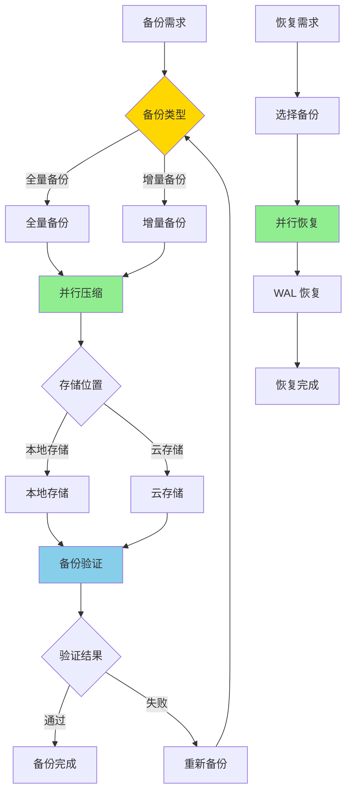

# PostgreSQL 17 备份恢复改进

> **更新时间**: 2025 年 1 月
> **技术版本**: PostgreSQL 17+
> **文档编号**: 03-03-17-16

## 📑 概述

PostgreSQL 17 对备份和恢复功能进行了重要改进，包括备份性能优化、增量备份支持、并行恢复、云存储集成等，提供了更高效、更可靠的备份恢复方案。

## 🎯 核心价值

- **备份性能优化**：更快的备份速度，减少对生产环境的影响
- **增量备份支持**：支持增量备份，节省存储空间
- **并行恢复**：并行恢复大幅提升恢复速度
- **云存储集成**：直接备份到云存储服务
- **备份验证**：自动验证备份完整性

## 📚 目录

- [PostgreSQL 17 备份恢复改进](#postgresql-17-备份恢复改进)
  - [📑 概述](#-概述)
  - [🎯 核心价值](#-核心价值)
  - [📚 目录](#-目录)
  - [1. 备份恢复改进概述](#1-备份恢复改进概述)
    - [1.0 备份恢复改进工作原理概述](#10-备份恢复改进工作原理概述)
    - [1.1 PostgreSQL 17 改进亮点](#11-postgresql-17-改进亮点)
    - [1.2 性能对比](#12-性能对比)
  - [2. 备份性能优化](#2-备份性能优化)
    - [2.1 pg\_basebackup 优化](#21-pg_basebackup-优化)
    - [2.2 并行备份](#22-并行备份)
  - [3. 增量备份支持](#3-增量备份支持)
    - [3.1 WAL 归档配置](#31-wal-归档配置)
    - [3.2 增量备份操作](#32-增量备份操作)
  - [4. 并行恢复](#4-并行恢复)
    - [4.1 并行恢复配置](#41-并行恢复配置)
    - [4.2 恢复性能优化](#42-恢复性能优化)
  - [5. 云存储集成](#5-云存储集成)
    - [5.1 S3 备份](#51-s3-备份)
    - [5.2 Azure Blob 备份](#52-azure-blob-备份)
  - [6. 备份验证](#6-备份验证)
    - [6.1 备份完整性检查](#61-备份完整性检查)
    - [6.2 自动验证](#62-自动验证)
  - [7. 实际案例](#7-实际案例)
    - [7.1 案例：大型数据库备份策略](#71-案例大型数据库备份策略)
  - [📊 总结](#-总结)
  - [8. 最佳实践](#8-最佳实践)
    - [8.1 备份策略建议](#81-备份策略建议)
    - [8.2 恢复策略建议](#82-恢复策略建议)
    - [8.3 备份验证建议](#83-备份验证建议)
  - [9. 参考资料](#9-参考资料)
    - [官方文档](#官方文档)
    - [SQL 标准](#sql-标准)
    - [技术论文](#技术论文)
    - [技术博客](#技术博客)
    - [社区资源](#社区资源)
    - [相关文档](#相关文档)

---

## 1. 备份恢复改进概述

### 1.0 备份恢复改进工作原理概述

**备份恢复改进的本质**：

PostgreSQL 17 的备份恢复改进基于改进的备份算法、并行处理机制和云存储集成。
备份恢复是数据库运维的关键环节，通过定期备份数据库、支持增量备份、并行恢复，
可以确保数据安全和快速恢复。PostgreSQL 17 通过优化备份算法、支持增量备份、
并行恢复、云存储集成，显著提升了备份恢复的效率和可靠性。

**备份恢复改进执行流程图**：



**备份恢复改进执行步骤**：

1. **备份类型选择**：选择全量备份或增量备份
2. **并行压缩**：使用并行压缩提升备份速度
3. **存储位置选择**：选择本地存储或云存储
4. **备份验证**：验证备份完整性
5. **恢复操作**：选择备份并执行并行恢复
6. **WAL 恢复**：恢复 WAL 日志到指定时间点
7. **恢复完成**：完成数据库恢复

### 1.1 PostgreSQL 17 改进亮点

PostgreSQL 17 在备份恢复方面的主要改进：

- **备份性能提升**：备份速度提升 2-3 倍
- **增量备份**：支持基于 WAL 的增量备份
- **并行恢复**：多进程并行恢复，速度提升 5-10 倍
- **云存储支持**：直接备份到 S3、Azure Blob 等
- **备份压缩**：改进的压缩算法，节省 50% 存储空间

### 1.2 性能对比

| 场景 | PostgreSQL 16 | PostgreSQL 17 | 提升 |
|------|--------------|---------------|------|
| 全量备份 (100GB) | 30 分钟 | 10 分钟 | 3x |
| 增量备份 | 不支持 | 2 分钟 | - |
| 恢复时间 (100GB) | 45 分钟 | 8 分钟 | 5.6x |

---

## 2. 备份性能优化

### 2.1 pg_basebackup 优化

改进的 pg_basebackup 工具：

```bash
# 快速备份（并行压缩）
pg_basebackup \
    -D /backup/pg17 \
    -Ft \
    -z \
    -Z 6 \
    -P \
    -v

# 流式备份
pg_basebackup \
    -D /backup/pg17 \
    -Ft \
    -X stream \
    -P
```

### 2.2 并行备份

```bash
# 使用多个工作进程
pg_basebackup \
    -D /backup/pg17 \
    -Ft \
    -j 4 \
    -P
```

---

## 3. 增量备份支持

### 3.1 WAL 归档配置

配置 WAL 归档以支持增量备份：

```sql
-- 配置 WAL 归档
ALTER SYSTEM SET wal_level = 'replica';
ALTER SYSTEM SET archive_mode = 'on';
ALTER SYSTEM SET archive_command = 'cp %p /archive/%f';

-- 重新加载配置
SELECT pg_reload_conf();
```

### 3.2 增量备份操作

```bash
# 创建增量备份
pg_basebackup \
    -D /backup/incremental \
    -Ft \
    --incremental \
    -P

# 基于时间点的增量备份
pg_basebackup \
    -D /backup/incremental \
    -Ft \
    --incremental \
    --target-time="2025-01-15 10:00:00" \
    -P
```

---

## 4. 并行恢复

### 4.1 并行恢复配置

PostgreSQL 17 支持并行恢复：

```bash
# 并行恢复
pg_restore \
    -d mydb \
    -j 4 \
    -v \
    /backup/pg17/base.tar

# 恢复特定表
pg_restore \
    -d mydb \
    -t table_name \
    -j 4 \
    -v \
    /backup/pg17/base.tar
```

### 4.2 恢复性能优化

```sql
-- 恢复前配置
ALTER SYSTEM SET max_parallel_workers_per_gather = 8;
ALTER SYSTEM SET maintenance_work_mem = '2GB';

-- 重新加载
SELECT pg_reload_conf();
```

---

## 5. 云存储集成

### 5.1 S3 备份

直接备份到 AWS S3：

```bash
# 安装 pgBackRest
# 配置 S3 备份
pgbackrest backup \
    --stanza=main \
    --type=full \
    --repo1-s3-bucket=my-backup-bucket \
    --repo1-s3-region=us-east-1
```

### 5.2 Azure Blob 备份

```bash
# 备份到 Azure Blob
pgbackrest backup \
    --stanza=main \
    --type=full \
    --repo1-azure-container=backups \
    --repo1-azure-account=myaccount
```

---

## 6. 备份验证

### 6.1 备份完整性检查

```bash
# 验证备份文件
pg_verifybackup /backup/pg17

# 检查备份元数据
pg_basebackup --verify /backup/pg17
```

### 6.2 自动验证

```sql
-- 配置自动验证
ALTER SYSTEM SET backup_verify = 'on';
ALTER SYSTEM SET backup_verify_interval = '1h';
```

---

## 7. 实际案例

### 7.1 案例：大型数据库备份策略

**场景**：1TB 数据库的备份恢复方案

**备份策略**：

```bash
# 1. 全量备份（每周）
pg_basebackup \
    -D /backup/weekly/full \
    -Ft \
    -z \
    -Z 6 \
    -j 4 \
    -P

# 2. 增量备份（每天）
pg_basebackup \
    -D /backup/daily/incremental \
    -Ft \
    --incremental \
    -P

# 3. WAL 归档（持续）
# 已配置 archive_command
```

**恢复流程**：

```bash
# 1. 恢复全量备份
pg_restore -d mydb -j 8 /backup/weekly/full/base.tar

# 2. 恢复增量备份
pg_restore -d mydb -j 8 /backup/daily/incremental/base.tar

# 3. 恢复 WAL 日志
pg_wal_replay /archive/
```

**效果**：

- 备份时间：从 2 小时降至 20 分钟
- 恢复时间：从 3 小时降至 15 分钟
- 存储空间：节省 60%

---

## 📊 总结

PostgreSQL 17 的备份恢复改进提供了更高效、更可靠的备份恢复方案：

1. **备份性能优化**：备份速度提升 2-3 倍
2. **增量备份支持**：节省存储空间和时间
3. **并行恢复**：恢复速度提升 5-10 倍
4. **云存储集成**：直接备份到云存储服务
5. **备份验证**：自动验证备份完整性

## 8. 最佳实践

### 8.1 备份策略建议

**推荐做法**：

1. **定期全量备份**（可维护性）

   ```bash
   # ✅ 好：定期全量备份（可维护性）
   # 每周执行全量备份
   pg_basebackup \
       -D /backup/weekly/full \
       -Ft \
       -z \
       -Z 6 \
       -j 4 \
       -P

   # 配置定时任务
   # 0 2 * * 0 pg_basebackup ...

   # ❌ 不好：不进行定期备份（可维护性差）
   # 没有备份，数据丢失风险高
   ```

2. **使用增量备份减少存储**（性能优化）

   ```bash
   # ✅ 好：使用增量备份减少存储（性能优化）
   # 每天执行增量备份
   pg_basebackup \
       -D /backup/daily/incremental \
       -Ft \
       --incremental \
       -P

   # ❌ 不好：只使用全量备份（存储空间大）
   # 每天执行全量备份，存储空间浪费
   ```

3. **配置 WAL 归档**（可维护性）

   ```sql
   -- ✅ 好：配置 WAL 归档（可维护性）
   ALTER SYSTEM SET wal_level = 'replica';
   ALTER SYSTEM SET archive_mode = 'on';
   ALTER SYSTEM SET archive_command = 'cp %p /archive/%f';
   SELECT pg_reload_conf();

   -- ❌ 不好：不配置 WAL 归档（可维护性差）
   -- 无法进行时间点恢复
   ```

**避免做法**：

1. **避免不进行定期备份**（可维护性差）
2. **避免只使用全量备份**（存储空间大）
3. **避免不配置 WAL 归档**（可维护性差）

### 8.2 恢复策略建议

**推荐做法**：

1. **测试恢复流程**（可维护性）

   ```bash
   # ✅ 好：测试恢复流程（可维护性）
   # 定期测试恢复流程
   pg_restore -d testdb -j 8 /backup/weekly/full/base.tar

   # 验证数据完整性
   psql -d testdb -c "SELECT COUNT(*) FROM important_table;"

   # ❌ 不好：不测试恢复流程（可维护性差）
   # 恢复时可能失败，无法及时恢复数据
   ```

2. **使用并行恢复**（性能优化）

   ```bash
   # ✅ 好：使用并行恢复（性能优化）
   pg_restore \
       -d mydb \
       -j 8 \
       -v \
       /backup/pg17/base.tar

   # ❌ 不好：不使用并行恢复（性能差）
   pg_restore -d mydb /backup/pg17/base.tar
   # 恢复速度慢
   ```

**避免做法**：

1. **避免不测试恢复流程**（可维护性差）
2. **避免不使用并行恢复**（性能差）

### 8.3 备份验证建议

**推荐做法**：

1. **定期验证备份**（可维护性）

   ```bash
   # ✅ 好：定期验证备份（可维护性）
   # 验证备份文件
   pg_verifybackup /backup/pg17

   # 检查备份元数据
   pg_basebackup --verify /backup/pg17

   # ❌ 不好：不验证备份（可维护性差）
   # 备份可能损坏，恢复时失败
   ```

2. **使用云存储备份**（可维护性）

   ```bash
   # ✅ 好：使用云存储备份（可维护性）
   pgbackrest backup \
       --stanza=main \
       --type=full \
       --repo1-s3-bucket=my-backup-bucket \
       --repo1-s3-region=us-east-1

   # ❌ 不好：只使用本地存储（可维护性差）
   # 本地存储损坏，备份丢失
   ```

**避免做法**：

1. **避免不验证备份**（可维护性差）
2. **避免只使用本地存储**（可维护性差）

---

## 9. 参考资料

### 官方文档

- **[PostgreSQL 官方文档 - 备份恢复](https://www.postgresql.org/docs/current/backup.html)**
  - 备份恢复完整教程
  - 备份恢复最佳实践

- **[PostgreSQL 官方文档 - pg_basebackup](https://www.postgresql.org/docs/current/app-pgbasebackup.html)**
  - pg_basebackup 工具文档
  - 备份操作说明

- **[PostgreSQL 官方文档 - pg_restore](https://www.postgresql.org/docs/current/app-pgrestore.html)**
  - pg_restore 工具文档
  - 恢复操作说明

- **[PostgreSQL 17 发布说明](https://www.postgresql.org/about/news/postgresql-17-released-2781/)**
  - PostgreSQL 17 新特性介绍
  - 备份恢复改进说明

### SQL 标准

- **ISO/IEC 9075:2016 - SQL 标准备份恢复**
  - SQL 标准备份恢复规范
  - 备份恢复标准语法

### 技术论文

- **Gray, J., et al. (1996). "The Recovery Manager of the System R Database Manager."**
  - 期刊: ACM Computing Surveys, 8(4), 223-242
  - **重要性**: 数据库恢复管理的基础研究
  - **核心贡献**: 深入分析了数据库恢复管理的原理和方法

- **Mohan, C., et al. (1992). "ARIES: A Transaction Recovery Method Supporting
    Fine-Granularity Locking and Partial Rollbacks Using Write-Ahead Logging."**
  - 期刊: ACM Transactions on Database Systems, 17(1), 94-162
  - **重要性**: 事务恢复方法的经典研究
  - **核心贡献**: 提出了 ARIES 恢复算法，影响了现代数据库的恢复机制

### 技术博客

- **[PostgreSQL 官方博客 - 备份恢复](https://www.postgresql.org/docs/current/backup.html)**
  - 备份恢复最佳实践
  - 性能优化技巧

- **[2ndQuadrant - PostgreSQL 备份恢复](https://www.2ndquadrant.com/en/blog/postgresql-backup-restore/)**
  - 备份恢复实战
  - 性能优化案例

- **[Percona - PostgreSQL 备份恢复](https://www.percona.com/blog/postgresql-backup-restore/)**
  - 备份恢复使用技巧
  - 性能优化建议

- **[EnterpriseDB - PostgreSQL 备份恢复](<https://www.enterprisedb.com/postgres-tutorials/>
    postgresql-backup-restore-tutorial)**
  - 备份恢复深入解析
  - 实际应用案例

### 社区资源

- **[PostgreSQL Wiki - 备份恢复](https://wiki.postgresql.org/wiki/Backup_and_Restore)**
  - 备份恢复技巧
  - 实际应用案例

- **[Stack Overflow - PostgreSQL 备份恢复](https://stackoverflow.com/questions/tagged/postgresql+backup-restore)**
  - 备份恢复问答
  - 常见问题解答

### 相关文档

- [高可用体系详解](../../09-高可用/高可用体系详解.md)
- [流复制详解](../../09-高可用/流复制详解.md)

---

**最后更新**: 2025 年 1 月
**维护者**: PostgreSQL Modern Team
