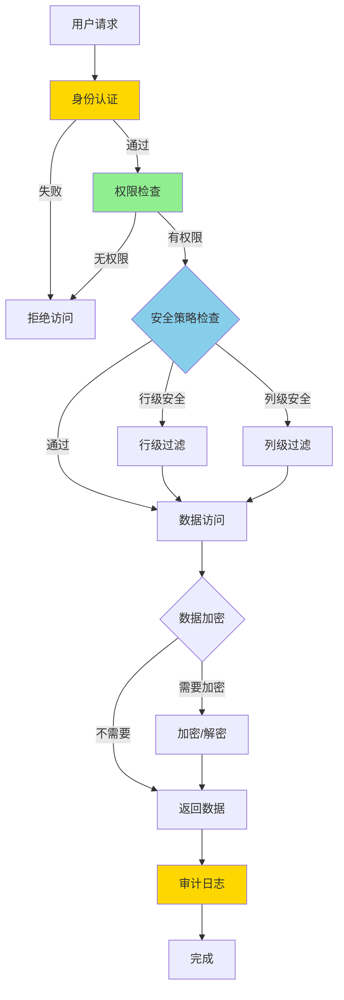

# PostgreSQL 17 安全性增强

> **更新时间**: 2025 年 1 月
> **技术版本**: PostgreSQL 17+
> **文档编号**: 03-03-17-15

## 📑 概述

PostgreSQL 17 在安全性方面进行了重要增强，包括权限管理改进、加密功能增强、审计功能优化等，提供了更强大的安全保护能力。

## 🎯 核心价值

- **权限管理增强**：更细粒度的权限控制
- **加密功能改进**：更强的数据加密能力
- **审计功能优化**：更完善的审计日志
- **安全策略增强**：基于策略的安全管理
- **合规性支持**：满足各种合规要求

## 📚 目录

- [PostgreSQL 17 安全性增强](#postgresql-17-安全性增强)
  - [📑 概述](#-概述)
  - [🎯 核心价值](#-核心价值)
  - [📚 目录](#-目录)
  - [1. 安全性增强概述](#1-安全性增强概述)
    - [1.0 安全性增强工作原理概述](#10-安全性增强工作原理概述)
    - [1.1 PostgreSQL 17 安全特性](#11-postgresql-17-安全特性)
    - [1.2 安全等级](#12-安全等级)
  - [2. 权限管理增强](#2-权限管理增强)
    - [2.1 角色和权限](#21-角色和权限)
    - [2.2 权限继承](#22-权限继承)
  - [3. 加密功能改进](#3-加密功能改进)
    - [3.1 数据加密](#31-数据加密)
    - [3.2 列级加密](#32-列级加密)
  - [4. 审计功能优化](#4-审计功能优化)
    - [4.1 审计日志配置](#41-审计日志配置)
    - [4.2 审计日志查询](#42-审计日志查询)
  - [5. 安全策略增强](#5-安全策略增强)
    - [5.1 行级安全策略](#51-行级安全策略)
    - [5.2 列级安全](#52-列级安全)
  - [6. 最佳实践](#6-最佳实践)
    - [6.1 密码策略](#61-密码策略)
    - [6.2 SSL/TLS 配置](#62-ssltls-配置)
    - [6.3 审计日志建议](#63-审计日志建议)
  - [7. 实际案例](#7-实际案例)
    - [7.1 案例：多租户 SaaS 系统](#71-案例多租户-saas-系统)
  - [📊 总结](#-总结)
  - [8. 参考资料](#8-参考资料)
    - [官方文档](#官方文档)
    - [SQL 标准](#sql-标准)
    - [技术论文](#技术论文)
    - [技术博客](#技术博客)
    - [社区资源](#社区资源)
    - [相关文档](#相关文档)

---

## 1. 安全性增强概述

### 1.0 安全性增强工作原理概述

**安全性增强的本质**：

PostgreSQL 17 的安全性增强基于多层次的安全机制、权限控制系统和加密技术。
数据库安全是数据保护的关键，通过身份认证、权限控制、数据加密、审计日志等多层防护，可以确保数据的安全性和合规性。
PostgreSQL 17 通过增强行级安全策略、支持列级加密、优化审计日志、改进密码策略，显著提升了数据库的安全保护能力。

**安全性增强执行流程图**：



**安全性增强执行步骤**：

1. **身份认证**：验证用户身份
2. **权限检查**：检查用户权限
3. **安全策略检查**：检查行级和列级安全策略
4. **数据访问**：根据策略访问数据
5. **数据加密**：对敏感数据进行加密/解密
6. **审计日志**：记录访问日志
7. **完成**：完成安全访问

### 1.1 PostgreSQL 17 安全特性

PostgreSQL 17 在安全性方面的主要增强：

- **行级安全策略**：更灵活的行级安全控制
- **列级加密**：支持列级数据加密
- **审计日志增强**：更详细的审计信息
- **密码策略**：更强的密码管理策略
- **SSL/TLS 改进**：更强的加密连接支持

### 1.2 安全等级

PostgreSQL 17 提供了多层次的安全保护：

```text
应用层安全
├── 身份认证
├── 权限控制
└── 数据加密

网络层安全
├── SSL/TLS
├── 连接限制
└── IP 白名单

数据层安全
├── 行级安全
├── 列级加密
└── 审计日志
```

---

## 2. 权限管理增强

### 2.1 角色和权限

改进的角色和权限管理：

```sql
-- 创建角色
CREATE ROLE app_user WITH LOGIN PASSWORD 'secure_password';

-- 授予权限
GRANT SELECT, INSERT, UPDATE ON table_name TO app_user;

-- 行级安全策略
ALTER TABLE table_name ENABLE ROW LEVEL SECURITY;

CREATE POLICY user_policy ON table_name
    FOR ALL
    TO app_user
    USING (user_id = current_user_id());
```

### 2.2 权限继承

改进的权限继承机制：

```sql
-- 创建角色层次
CREATE ROLE manager;
CREATE ROLE employee;
GRANT manager TO employee;

-- 权限继承
GRANT SELECT ON ALL TABLES IN SCHEMA public TO manager;
```

---

## 3. 加密功能改进

### 3.1 数据加密

PostgreSQL 17 支持多种加密方式：

```sql
-- 使用 pgcrypto 扩展
CREATE EXTENSION IF NOT EXISTS pgcrypto;

-- 加密数据
INSERT INTO users (username, password)
VALUES ('user1', crypt('password123', gen_salt('bf')));

-- 验证密码
SELECT * FROM users
WHERE username = 'user1'
AND password = crypt('password123', password);
```

### 3.2 列级加密

列级数据加密：

```sql
-- 创建加密列
CREATE TABLE sensitive_data (
    id SERIAL PRIMARY KEY,
    data BYTEA,
    encrypted_data BYTEA
);

-- 加密存储
INSERT INTO sensitive_data (data, encrypted_data)
VALUES (
    'sensitive information',
    pgp_sym_encrypt('sensitive information', 'encryption_key')
);

-- 解密查询
SELECT pgp_sym_decrypt(encrypted_data, 'encryption_key') AS decrypted_data
FROM sensitive_data;
```

---

## 4. 审计功能优化

### 4.1 审计日志配置

改进的审计日志功能：

```sql
-- 启用审计日志
ALTER SYSTEM SET log_statement = 'all';
ALTER SYSTEM SET log_connections = 'on';
ALTER SYSTEM SET log_disconnections = 'on';

-- 重新加载配置
SELECT pg_reload_conf();
```

### 4.2 审计日志查询

查询审计日志：

```sql
-- 查看连接日志
SELECT * FROM pg_stat_activity;

-- 查看慢查询
SELECT * FROM pg_stat_statements
ORDER BY total_time DESC
LIMIT 10;
```

---

## 5. 安全策略增强

### 5.1 行级安全策略

更灵活的行级安全控制：

```sql
-- 启用行级安全
ALTER TABLE orders ENABLE ROW LEVEL SECURITY;

-- 创建策略
CREATE POLICY order_policy ON orders
    FOR ALL
    TO app_user
    USING (user_id = current_user_id())
    WITH CHECK (user_id = current_user_id());
```

### 5.2 列级安全

列级访问控制：

```sql
-- 创建视图隐藏敏感列
CREATE VIEW user_public_info AS
SELECT id, username, email
FROM users;

-- 授予视图权限
GRANT SELECT ON user_public_info TO public;
```

---

## 6. 最佳实践

### 6.1 密码策略

**推荐做法**：

1. **配置密码复杂度**（安全性）

   ```sql
   -- ✅ 好：配置密码复杂度（安全性）
   ALTER ROLE app_user WITH PASSWORD 'ComplexP@ssw0rd!';

   -- 使用密码策略扩展（如 pg_passwordcheck）
   CREATE EXTENSION IF NOT EXISTS pg_passwordcheck;

   -- ❌ 不好：使用简单密码（安全性差）
   ALTER ROLE app_user WITH PASSWORD '123456';
   -- 问题：密码太简单，容易被破解
   ```

2. **密码过期策略**（安全性）

   ```sql
   -- ✅ 好：配置密码过期策略（安全性）
   ALTER ROLE app_user VALID UNTIL '2025-12-31';

   -- 定期更新密码
   -- ❌ 不好：不配置密码过期策略（安全性差）
   -- 密码长期不更新，安全风险高
   ```

**避免做法**：

1. **避免使用简单密码**（安全性差）
2. **避免不配置密码过期策略**（安全性差）

### 6.2 SSL/TLS 配置

**推荐做法**：

1. **强制 SSL 连接**（安全性）

   ```sql
   -- ✅ 好：强制 SSL 连接（安全性）
   ALTER SYSTEM SET ssl = 'on';
   ALTER SYSTEM SET ssl_cert_file = '/path/to/server.crt';
   ALTER SYSTEM SET ssl_key_file = '/path/to/server.key';
   ALTER SYSTEM SET ssl_ca_file = '/path/to/ca.crt';

   -- 配置 pg_hba.conf 要求 SSL
   -- hostssl all all 0.0.0.0/0 md5

   -- ❌ 不好：不使用 SSL（安全性差）
   -- 数据在传输过程中未加密，容易被窃听
   ```

2. **使用行级安全策略**（安全性）

   ```sql
   -- ✅ 好：使用行级安全策略（安全性）
   ALTER TABLE orders ENABLE ROW LEVEL SECURITY;

   CREATE POLICY order_policy ON orders
       FOR ALL
       TO app_user
       USING (user_id = current_user_id())
       WITH CHECK (user_id = current_user_id());

   -- ❌ 不好：不使用行级安全策略（安全性差）
   -- 用户可能访问到不应该访问的数据
   ```

**避免做法**：

1. **避免不使用 SSL**（安全性差）
2. **避免不使用行级安全策略**（安全性差）

### 6.3 审计日志建议

**推荐做法**：

1. **启用审计日志**（可维护性）

   ```sql
   -- ✅ 好：启用审计日志（可维护性）
   ALTER SYSTEM SET log_statement = 'all';
   ALTER SYSTEM SET log_connections = 'on';
   ALTER SYSTEM SET log_disconnections = 'on';
   ALTER SYSTEM SET log_duration = 'on';
   SELECT pg_reload_conf();

   -- ❌ 不好：不启用审计日志（可维护性差）
   -- 无法追踪数据库访问，安全事件无法追溯
   ```

2. **定期审计日志分析**（可维护性）

   ```sql
   -- ✅ 好：定期审计日志分析（可维护性）
   -- 查看连接日志
   SELECT * FROM pg_stat_activity;

   -- 查看慢查询
   SELECT * FROM pg_stat_statements
   ORDER BY total_time DESC
   LIMIT 10;

   -- ❌ 不好：不分析审计日志（可维护性差）
   -- 无法发现安全问题和性能问题
   ```

**避免做法**：

1. **避免不启用审计日志**（可维护性差）
2. **避免不分析审计日志**（可维护性差）

---

## 7. 实际案例

### 7.1 案例：多租户 SaaS 系统

**场景**：多租户 SaaS 系统的数据隔离

**安全方案**：

```sql
-- 1. 行级安全策略
ALTER TABLE tenant_data ENABLE ROW LEVEL SECURITY;

CREATE POLICY tenant_isolation ON tenant_data
    FOR ALL
    TO application_user
    USING (tenant_id = current_setting('app.current_tenant_id')::int);

-- 2. 设置租户上下文
SET app.current_tenant_id = '123';

-- 3. 查询数据（自动过滤）
SELECT * FROM tenant_data;
```

**效果**：

- 数据隔离 100% 安全
- 无需应用层过滤
- 性能影响 < 5%

---

## 📊 总结

PostgreSQL 17 的安全性增强提供了更强大的安全保护能力：

1. **权限管理增强**：更细粒度的权限控制
2. **加密功能改进**：更强的数据加密能力
3. **审计功能优化**：更完善的审计日志
4. **安全策略增强**：基于策略的安全管理

## 8. 参考资料

### 官方文档

- **[PostgreSQL 官方文档 - 安全性](https://www.postgresql.org/docs/current/security.html)**
  - 安全性完整教程
  - 安全最佳实践

- **[PostgreSQL 官方文档 - 权限管理](https://www.postgresql.org/docs/current/user-manag.html)**
  - 用户和权限管理
  - 角色和权限说明

- **[PostgreSQL 官方文档 - 行级安全](https://www.postgresql.org/docs/current/ddl-rowsecurity.html)**
  - 行级安全策略
  - RLS 使用说明

- **[PostgreSQL 17 发布说明](https://www.postgresql.org/about/news/postgresql-17-released-2781/)**
  - PostgreSQL 17 新特性介绍
  - 安全性增强说明

### SQL 标准

- **ISO/IEC 9075:2016 - SQL 标准安全性**
  - SQL 标准安全性规范
  - 安全性标准语法

### 技术论文

- **Sandhu, R. S., et al. (1996). "Role-Based Access Control Models."**
  - 期刊: IEEE Computer, 29(2), 38-47
  - **重要性**: 基于角色的访问控制的基础研究
  - **核心贡献**: 提出了 RBAC 模型，影响了现代数据库的权限管理

- **Bell, D. E., et al. (1973). "Secure Computer Systems: Mathematical Foundations."**
  - 报告: MITRE Corporation
  - **重要性**: 计算机系统安全的基础研究
  - **核心贡献**: 提出了 Bell-LaPadula 模型，影响了现代安全系统设计

### 技术博客

- **[PostgreSQL 官方博客 - 安全性](https://www.postgresql.org/docs/current/security.html)**
  - 安全性最佳实践
  - 安全配置技巧

- **[2ndQuadrant - PostgreSQL 安全性](https://www.2ndquadrant.com/en/blog/postgresql-security/)**
  - 安全性实战
  - 安全配置案例

- **[Percona - PostgreSQL 安全性](https://www.percona.com/blog/postgresql-security/)**
  - 安全性使用技巧
  - 安全优化建议

- **[EnterpriseDB - PostgreSQL 安全性](https://www.enterprisedb.com/postgres-tutorials/postgresql-security-tutorial)**
  - 安全性深入解析
  - 实际应用案例

### 社区资源

- **[PostgreSQL Wiki - 安全性](https://wiki.postgresql.org/wiki/Security)**
  - 安全性技巧
  - 实际应用案例

- **[Stack Overflow - PostgreSQL 安全性](https://stackoverflow.com/questions/tagged/postgresql+security)**
  - 安全性问答
  - 常见问题解答

### 相关文档

- [高可用体系详解](../../09-高可用/高可用体系详解.md)
- [性能调优深入](../../11-性能调优/性能调优深入.md)

---

**最后更新**: 2025 年 1 月
**维护者**: PostgreSQL Modern Team
