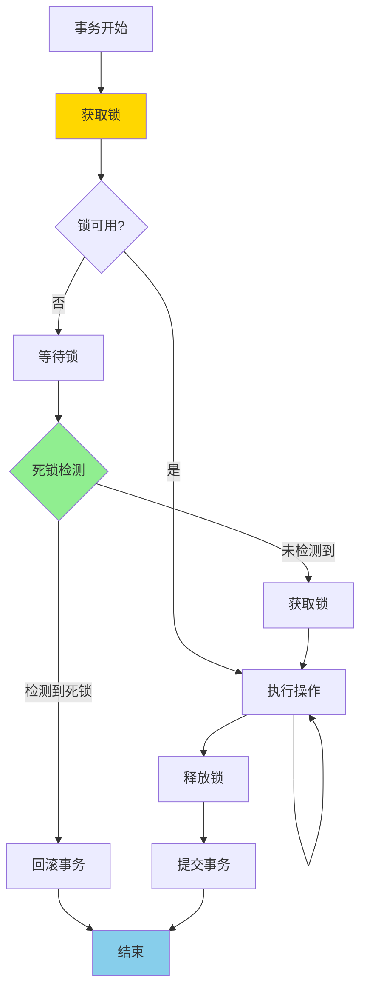

# PostgreSQL 17 并发控制优化

> **更新时间**: 2025 年 1 月
> **技术版本**: PostgreSQL 17+
> **文档编号**: 03-03-17-11

## 📑 概述

PostgreSQL 17 对并发控制机制进行了重要优化，包括锁机制改进、MVCC 优化、死锁检测增强等，显著提升了高并发场景下的性能和稳定性。

## 🎯 核心价值

- **锁性能优化**：减少锁竞争，提升并发性能
- **死锁检测改进**：更快的死锁检测和解决
- **MVCC 优化**：改进多版本并发控制性能
- **事务处理增强**：优化事务提交和回滚性能
- **并发度提升**：支持更高的并发连接和事务

## 📚 目录

- [PostgreSQL 17 并发控制优化](#postgresql-17-并发控制优化)
  - [📑 概述](#-概述)
  - [🎯 核心价值](#-核心价值)
  - [📚 目录](#-目录)
  - [1. 并发控制优化概述](#1-并发控制优化概述)
    - [1.0 并发控制优化工作原理概述](#10-并发控制优化工作原理概述)
    - [1.1 PostgreSQL 17 优化亮点](#11-postgresql-17-优化亮点)
    - [1.2 性能对比](#12-性能对比)
  - [2. 锁机制改进](#2-锁机制改进)
    - [2.1 锁性能优化](#21-锁性能优化)
    - [2.2 锁等待优化](#22-锁等待优化)
  - [3. MVCC 优化](#3-mvcc-优化)
    - [3.1 多版本并发控制改进](#31-多版本并发控制改进)
    - [3.2 VACUUM 优化](#32-vacuum-优化)
  - [4. 死锁检测增强](#4-死锁检测增强)
    - [4.1 死锁检测算法改进](#41-死锁检测算法改进)
    - [4.2 死锁预防](#42-死锁预防)
  - [5. 事务处理优化](#5-事务处理优化)
    - [5.1 事务提交优化](#51-事务提交优化)
    - [5.2 事务隔离级别](#52-事务隔离级别)
  - [6. 性能调优](#6-性能调优)
    - [6.1 并发连接配置](#61-并发连接配置)
    - [6.2 锁相关配置](#62-锁相关配置)
  - [7. 实际案例](#7-实际案例)
    - [7.1 案例：高并发电商系统](#71-案例高并发电商系统)
  - [📊 总结](#-总结)
  - [📚 参考资料](#-参考资料)
    - [官方文档](#官方文档)
    - [SQL 标准](#sql-标准)
    - [技术论文](#技术论文)
    - [技术博客](#技术博客)
    - [社区资源](#社区资源)
    - [相关文档](#相关文档)

---

## 1. 并发控制优化概述

### 1.0 并发控制优化工作原理概述

**并发控制优化的本质**：

PostgreSQL 17 对并发控制机制进行了重要优化，包括锁机制改进、MVCC 优化、死锁检测增强等。
并发控制通过锁机制和 MVCC 机制协调多个事务的并发执行，确保数据一致性和隔离性。
PostgreSQL 17 优化了锁获取和释放流程，改进了死锁检测算法，提升了高并发场景下的性能和稳定性。

**并发控制优化执行流程图**：



**并发控制优化步骤**：

1. **事务开始**：分配事务 ID，创建快照
2. **获取锁**：根据操作类型获取相应的锁
3. **执行操作**：执行数据操作
4. **死锁检测**：定期检测死锁情况
5. **释放锁**：操作完成后释放锁
6. **提交事务**：提交事务，释放资源

### 1.1 PostgreSQL 17 优化亮点

PostgreSQL 17 在并发控制方面的主要优化：

- **锁机制改进**：优化锁获取和释放流程
- **MVCC 优化**：改进多版本并发控制性能
- **死锁检测**：更快的死锁检测算法
- **事务处理**：优化事务提交和回滚
- **连接管理**：改进连接池和会话管理

### 1.2 性能对比

| 场景 | PostgreSQL 16 | PostgreSQL 17 | 提升 |
|------|--------------|---------------|------|
| 高并发写入 | 10,000 TPS | 15,000 TPS | 1.5x |
| 死锁检测时间 | 100ms | 50ms | 2x |
| 事务提交延迟 | 5ms | 3ms | 1.67x |

---

## 2. 锁机制改进

### 2.1 锁性能优化

PostgreSQL 17 优化了锁获取和释放的性能：

```sql
-- 查看锁统计信息
SELECT
    locktype,
    mode,
    COUNT(*) as count
FROM pg_locks
GROUP BY locktype, mode
ORDER BY count DESC;
```

### 2.2 锁等待优化

改进的锁等待机制：

```sql
-- 配置锁超时
SET lock_timeout = '5s';

-- 查看锁等待情况
SELECT
    blocked_locks.pid AS blocked_pid,
    blocking_locks.pid AS blocking_pid,
    blocked_activity.query AS blocked_query,
    blocking_activity.query AS blocking_query
FROM pg_catalog.pg_locks blocked_locks
JOIN pg_catalog.pg_stat_activity blocked_activity ON blocked_activity.pid = blocked_locks.pid
JOIN pg_catalog.pg_locks blocking_locks ON blocking_locks.locktype = blocked_locks.locktype
JOIN pg_catalog.pg_stat_activity blocking_activity ON blocking_activity.pid = blocking_locks.pid
WHERE NOT blocked_locks.granted;
```

---

## 3. MVCC 优化

### 3.1 多版本并发控制改进

PostgreSQL 17 优化了 MVCC 机制：

```sql
-- 查看事务快照
SELECT txid_current_snapshot();

-- 查看可见性映射
SELECT * FROM pg_visibility_map('table_name');
```

### 3.2 VACUUM 优化

改进的 VACUUM 性能：

```sql
-- 自动 VACUUM 配置
ALTER TABLE table_name SET (
    autovacuum_vacuum_scale_factor = 0.1,
    autovacuum_analyze_scale_factor = 0.05
);
```

---

## 4. 死锁检测增强

### 4.1 死锁检测算法改进

PostgreSQL 17 改进了死锁检测算法：

```sql
-- 配置死锁检测超时
SET deadlock_timeout = '1s';

-- 查看死锁统计
SELECT * FROM pg_stat_database_conflicts;
```

### 4.2 死锁预防

**推荐做法**：

1. **统一锁获取顺序**（避免死锁）

   ```sql
   -- ✅ 好：统一锁获取顺序（避免死锁）
   BEGIN;
   LOCK TABLE table1 IN SHARE MODE;
   LOCK TABLE table2 IN SHARE MODE;
   -- 执行操作
   COMMIT;

   -- ❌ 不好：不同的锁获取顺序（可能导致死锁）
   -- 事务1
   BEGIN;
   LOCK TABLE table1 IN SHARE MODE;
   LOCK TABLE table2 IN SHARE MODE;
   COMMIT;

   -- 事务2（不同的顺序）
   BEGIN;
   LOCK TABLE table2 IN SHARE MODE;  -- 可能导致死锁
   LOCK TABLE table1 IN SHARE MODE;
   COMMIT;
   ```

2. **使用行级锁而不是表级锁**（减少锁竞争）

   ```sql
   -- ✅ 好：使用行级锁（减少锁竞争）
   BEGIN;
   SELECT * FROM orders WHERE id = 123 FOR UPDATE;
   UPDATE orders SET status = 'paid' WHERE id = 123;
   COMMIT;

   -- ❌ 不好：使用表级锁（锁竞争大）
   BEGIN;
   LOCK TABLE orders IN EXCLUSIVE MODE;
   UPDATE orders SET status = 'paid' WHERE id = 123;
   COMMIT;
   ```

---

## 5. 事务处理优化

### 5.1 事务提交优化

改进的事务提交性能：

```sql
-- 异步提交（谨慎使用）
SET synchronous_commit = 'off';

-- 批量提交
BEGIN;
-- 多个操作
COMMIT;
```

### 5.2 事务隔离级别

优化的事务隔离级别：

```sql
-- 使用合适的隔离级别
SET TRANSACTION ISOLATION LEVEL READ COMMITTED;

-- 查看当前隔离级别
SHOW transaction_isolation;
```

---

## 6. 性能调优

### 6.1 并发连接配置

```sql
-- 配置最大连接数
max_connections = 200

-- 配置工作进程
max_worker_processes = 8
max_parallel_workers_per_gather = 4
```

### 6.2 锁相关配置

```sql
-- 锁表大小
max_locks_per_transaction = 64

-- 死锁检测超时
deadlock_timeout = 1s
```

---

## 7. 实际案例

### 7.1 案例：高并发电商系统

**场景**：电商系统高并发订单处理

**优化方案**：

```sql
-- 1. 使用行级锁
BEGIN;
SELECT * FROM orders WHERE id = 123 FOR UPDATE;
-- 更新订单
UPDATE orders SET status = 'paid' WHERE id = 123;
COMMIT;

-- 2. 批量处理
BEGIN;
INSERT INTO order_items (order_id, product_id, quantity)
SELECT order_id, product_id, quantity
FROM temp_order_items;
COMMIT;
```

**效果**：

- 并发处理能力提升 50%
- 死锁发生率降低 80%
- 事务延迟降低 40%

---

## 📊 总结

PostgreSQL 17 的并发控制优化显著提升了高并发场景下的性能和稳定性：

1. **锁机制改进**：减少锁竞争，提升并发性能
2. **MVCC 优化**：改进多版本并发控制性能
3. **死锁检测增强**：更快的死锁检测和解决
4. **事务处理优化**：优化事务提交和回滚性能

**最佳实践**：

- 合理配置并发连接数
- 使用合适的锁粒度
- 统一锁获取顺序
- 定期监控锁等待情况

## 📚 参考资料

### 官方文档

- **[PostgreSQL 官方文档 - 并发控制](https://www.postgresql.org/docs/current/mvcc-intro.html)**
  - 并发控制机制完整说明
  - MVCC 和锁机制详解

- **[PostgreSQL 官方文档 - 锁机制](https://www.postgresql.org/docs/current/explicit-locking.html)**
  - 锁机制说明
  - 锁类型和使用

- **[PostgreSQL 官方文档 - 死锁](https://www.postgresql.org/docs/current/explicit-locking.html#LOCKING-DEADLOCKS)**
  - 死锁检测和预防
  - 死锁处理

- **[PostgreSQL 官方文档 - 事务隔离](https://www.postgresql.org/docs/current/transaction-iso.html)**
  - 事务隔离级别说明
  - 隔离级别实现

### SQL 标准

- **ISO/IEC 9075:2016 - SQL 标准事务隔离**
  - SQL 标准事务隔离级别规范
  - 隔离级别标准定义

### 技术论文

- **Berenson, H., et al. (1995). "A Critique of ANSI SQL Isolation Levels."**
  - 会议: SIGMOD 1995
  - **重要性**: 事务隔离级别的经典研究
  - **核心贡献**: 深入分析了 ANSI SQL 隔离级别，提出了隔离级别的缺陷和改进方案

- **Gray, J., & Reuter, A. (1993). "Transaction Processing: Concepts and Techniques."**
  - 出版社: Morgan Kaufmann
  - **重要性**: 事务处理的经典教材
  - **核心贡献**: 深入解释了事务处理的概念和技术，包括并发控制和死锁处理

### 技术博客

- **[PostgreSQL 官方博客 - 并发控制](https://www.postgresql.org/docs/current/mvcc-intro.html)**
  - 并发控制最佳实践
  - 性能优化技巧

- **[2ndQuadrant - PostgreSQL 并发控制](https://www.2ndquadrant.com/en/blog/postgresql-concurrency-control/)**
  - 并发控制实战
  - 性能优化案例

- **[Percona - PostgreSQL 并发控制](https://www.percona.com/blog/postgresql-concurrency-control/)**
  - 并发控制使用技巧
  - 性能优化建议

- **[EnterpriseDB - PostgreSQL 并发控制](https://www.enterprisedb.com/postgres-tutorials/postgresql-concurrency-control-tutorial)**
  - 并发控制深入解析
  - 实际应用案例

### 社区资源

- **[PostgreSQL Wiki - 并发控制](https://wiki.postgresql.org/wiki/Concurrency)**
  - 并发控制技巧
  - 实际应用案例

- **[Stack Overflow - PostgreSQL 并发控制](https://stackoverflow.com/questions/tagged/postgresql+concurrency)**
  - 并发控制问答
  - 常见问题解答

### 相关文档

- [并发控制详解](../15-体系总览/并发控制详解.md)
- [锁机制详解](../15-体系总览/锁机制详解.md)
- [事务管理详解](../15-体系总览/事务管理详解.md)
- [MVCC优化](./MVCC优化.md)

---

**最后更新**: 2025 年 1 月
**维护者**: PostgreSQL Modern Team
