# PostgreSQL 17 性能诊断改进

> **更新时间**: 2025 年 1 月
> **技术版本**: PostgreSQL 17+
> **文档编号**: 03-03-17-14

## 📑 概述

PostgreSQL 17 对性能诊断工具进行了重要改进，包括新的诊断视图、性能分析工具、查询追踪增强等，使得性能问题的定位和分析更加便捷和高效。

## 🎯 核心价值

- **诊断工具增强**：新的性能诊断视图和工具
- **查询追踪改进**：更详细的查询执行信息
- **性能分析优化**：更准确的性能分析结果
- **问题定位快速**：快速定位性能瓶颈
- **监控能力提升**：更全面的性能监控

## 📚 目录

- [PostgreSQL 17 性能诊断改进](#postgresql-17-性能诊断改进)
  - [📑 概述](#-概述)
  - [🎯 核心价值](#-核心价值)
  - [📚 目录](#-目录)
  - [1. 性能诊断改进概述](#1-性能诊断改进概述)
    - [1.0 性能诊断改进工作原理概述](#10-性能诊断改进工作原理概述)
    - [1.1 PostgreSQL 17 改进亮点](#11-postgresql-17-改进亮点)
    - [1.2 功能对比](#12-功能对比)
  - [2. 新诊断视图](#2-新诊断视图)
    - [2.1 pg\_stat\_statements 增强](#21-pg_stat_statements-增强)
    - [2.2 pg\_stat\_progress 视图](#22-pg_stat_progress-视图)
    - [2.3 pg\_stat\_activity 增强](#23-pg_stat_activity-增强)
  - [3. 查询追踪增强](#3-查询追踪增强)
    - [3.1 执行计划追踪](#31-执行计划追踪)
    - [3.2 查询统计追踪](#32-查询统计追踪)
    - [3.3 等待事件追踪](#33-等待事件追踪)
  - [4. 性能分析工具](#4-性能分析工具)
    - [4.1 EXPLAIN 增强](#41-explain-增强)
    - [4.2 性能分析脚本](#42-性能分析脚本)
    - [4.3 自动化诊断](#43-自动化诊断)
  - [5. 监控和告警](#5-监控和告警)
    - [5.1 性能指标监控](#51-性能指标监控)
    - [5.2 慢查询监控](#52-慢查询监控)
    - [5.3 告警配置](#53-告警配置)
  - [6. 最佳实践](#6-最佳实践)
    - [6.1 诊断流程建议](#61-诊断流程建议)
    - [6.2 性能分析建议](#62-性能分析建议)
    - [6.3 监控配置建议](#63-监控配置建议)
  - [7. 实际案例](#7-实际案例)
    - [7.1 案例：慢查询诊断优化](#71-案例慢查询诊断优化)
    - [7.2 案例：性能瓶颈定位](#72-案例性能瓶颈定位)
    - [7.3 案例：等待事件分析优化](#73-案例等待事件分析优化)
  - [8. 常见问题解答（FAQ）](#8-常见问题解答faq)
    - [Q1: pg\_stat\_statements 没有数据怎么办？](#q1-pg_stat_statements-没有数据怎么办)
    - [Q2: 如何查看特定查询的性能？](#q2-如何查看特定查询的性能)
    - [Q3: 如何监控长时间运行的查询？](#q3-如何监控长时间运行的查询)
    - [Q4: 如何分析等待事件？](#q4-如何分析等待事件)
    - [Q5: 如何诊断慢查询？](#q5-如何诊断慢查询)
    - [Q6: 如何监控 VACUUM 进度？](#q6-如何监控-vacuum-进度)
    - [Q7: 如何诊断锁竞争问题？](#q7-如何诊断锁竞争问题)
    - [Q8: 如何重置性能统计信息？](#q8-如何重置性能统计信息)
  - [9. 故障排查指南](#9-故障排查指南)
    - [9.1 常见问题诊断](#91-常见问题诊断)
    - [9.2 性能问题排查流程](#92-性能问题排查流程)
    - [9.3 诊断工具使用技巧](#93-诊断工具使用技巧)
  - [10. 性能优化检查清单](#10-性能优化检查清单)
  - [📊 总结](#-总结)
  - [11. 参考资料](#11-参考资料)
    - [官方文档](#官方文档)
    - [SQL 标准](#sql-标准)
    - [技术论文](#技术论文)
    - [技术博客](#技术博客)
    - [社区资源](#社区资源)
    - [相关文档](#相关文档)

---

## 1. 性能诊断改进概述

### 1.0 性能诊断改进工作原理概述

**性能诊断改进的本质**：

PostgreSQL 17 的性能诊断改进基于增强的统计信息收集、新的诊断视图和智能的性能分析工具。
性能诊断是数据库运维的关键环节，通过实时监控数据库活动、收集性能指标、分析性能瓶颈，可以及时发现和解决性能问题。
PostgreSQL 17 通过新增诊断视图、增强查询追踪、优化性能分析，显著提升了性能问题的定位和分析效率。

**性能诊断改进执行流程图**：

```mermaid
flowchart TD
    A[性能问题报告] --> B[性能指标收集]
    B --> C{诊断类型}
    C -->|慢查询| D[查询统计分析]
    C -->|资源瓶颈| E[资源使用分析]
    C -->|等待事件| F[等待事件分析]
    D --> G[执行计划分析]
    E --> G
    F --> G
    G --> H[问题定位]
    H --> I{问题类型}
    I -->|索引问题| J[索引优化]
    I -->|查询问题| K[查询优化]
    I -->|配置问题| L[配置优化]
    J --> M[验证优化效果]
    K --> M
    L --> M
    M --> N[问题解决]

    style B fill:#FFD700
    style C fill:#90EE90
    style G fill:#87CEEB
    style H fill:#FFD700
    style N fill:#87CEEB
```



**性能诊断改进执行步骤**：

1. **性能指标收集**：收集数据库活动的性能指标
2. **诊断类型识别**：识别性能问题的类型（慢查询、资源瓶颈、等待事件）
3. **执行计划分析**：分析查询的执行计划
4. **问题定位**：定位性能问题的根本原因
5. **优化方案**：制定优化方案（索引优化、查询优化、配置优化）
6. **验证优化效果**：验证优化后的效果
7. **问题解决**：完成性能问题的解决

### 1.1 PostgreSQL 17 改进亮点

PostgreSQL 17 在性能诊断方面的主要改进：

- **新诊断视图**：pg_stat_progress_vacuum、pg_stat_progress_cluster 等
- **查询追踪增强**：更详细的查询执行信息
- **性能分析优化**：更准确的性能分析结果
- **自动化诊断**：支持自动化性能诊断
- **监控能力提升**：更全面的性能监控

### 1.2 功能对比

| 功能 | PostgreSQL 16 | PostgreSQL 17 |
|------|--------------|---------------|
| 进度视图 | 基础 | 增强 |
| 查询追踪 | 支持 | 增强 |
| 性能分析 | 基础 | 优化 |
| 自动化诊断 | ❌ | ✅ |

---

## 2. 新诊断视图

### 2.1 pg_stat_statements 增强

```sql
-- 启用 pg_stat_statements
CREATE EXTENSION IF NOT EXISTS pg_stat_statements;

-- 查看查询统计（PostgreSQL 17 增强）
SELECT
    query,
    calls,
    total_exec_time,
    mean_exec_time,
    max_exec_time,
    min_exec_time,
    stddev_exec_time,
    rows,
    100.0 * shared_blks_hit / NULLIF(shared_blks_hit + shared_blks_read, 0) AS hit_percent
FROM pg_stat_statements
WHERE query NOT LIKE '%pg_stat_statements%'
ORDER BY total_exec_time DESC
LIMIT 20;

-- 查看查询计划统计
SELECT
    query,
    plans,
    total_plan_time,
    mean_plan_time,
    calls,
    total_exec_time,
    mean_exec_time
FROM pg_stat_statements
WHERE plans > 0
ORDER BY total_plan_time DESC
LIMIT 20;
```

### 2.2 pg_stat_progress 视图

```sql
-- 查看 VACUUM 进度
SELECT
    pid,
    datname,
    relid::regclass,
    phase,
    heap_blks_total,
    heap_blks_scanned,
    heap_blks_vacuumed,
    index_vacuum_count,
    max_dead_tuples,
    num_dead_tuples
FROM pg_stat_progress_vacuum;

-- 查看 CLUSTER 进度
SELECT
    pid,
    datname,
    relid::regclass,
    command,
    phase,
    cluster_index_relid::regclass,
    heap_tuples_scanned,
    heap_tuples_written,
    heap_blks_total,
    heap_blks_scanned
FROM pg_stat_progress_cluster;

-- 查看 CREATE INDEX 进度
SELECT
    pid,
    datname,
    relid::regclass,
    index_relid::regclass,
    command,
    phase,
    tuples_total,
    tuples_done,
    partitions_total,
    partitions_done
FROM pg_stat_progress_create_index;
```

### 2.3 pg_stat_activity 增强

```sql
-- 查看活动连接（PostgreSQL 17 增强）
SELECT
    pid,
    usename,
    application_name,
    client_addr,
    state,
    wait_event_type,
    wait_event,
    query_start,
    state_change,
    backend_start,
    xact_start,
    query_start,
    state_change,
    query
FROM pg_stat_activity
WHERE state != 'idle'
ORDER BY query_start;

-- 查看等待事件统计
SELECT
    wait_event_type,
    wait_event,
    COUNT(*) AS count
FROM pg_stat_activity
WHERE wait_event IS NOT NULL
GROUP BY wait_event_type, wait_event
ORDER BY count DESC;
```

---

## 3. 查询追踪增强

### 3.1 执行计划追踪

```sql
-- 启用查询追踪
SET track_io_timing = on;
SET track_functions = all;

-- 查看详细执行计划
EXPLAIN (ANALYZE, BUFFERS, VERBOSE, COSTS, TIMING)
SELECT * FROM orders WHERE status = 'pending';

-- 查看执行计划统计
SELECT
    query,
    plans,
    total_plan_time,
    mean_plan_time,
    calls,
    total_exec_time,
    mean_exec_time
FROM pg_stat_statements
WHERE query LIKE '%orders%'
ORDER BY total_exec_time DESC;
```

### 3.2 查询统计追踪

```sql
-- 查看查询统计详情
SELECT
    queryid,
    query,
    calls,
    total_exec_time,
    mean_exec_time,
    max_exec_time,
    min_exec_time,
    stddev_exec_time,
    rows,
    shared_blks_hit,
    shared_blks_read,
    shared_blks_dirtied,
    shared_blks_written,
    local_blks_hit,
    local_blks_read,
    local_blks_dirtied,
    local_blks_written,
    temp_blks_read,
    temp_blks_written,
    blk_read_time,
    blk_write_time
FROM pg_stat_statements
WHERE query NOT LIKE '%pg_stat_statements%'
ORDER BY total_exec_time DESC
LIMIT 10;
```

### 3.3 等待事件追踪

```sql
-- 查看等待事件
SELECT
    pid,
    usename,
    application_name,
    wait_event_type,
    wait_event,
    state,
    query
FROM pg_stat_activity
WHERE wait_event IS NOT NULL
ORDER BY wait_event_type, wait_event;

-- 查看等待事件统计
SELECT
    wait_event_type,
    wait_event,
    COUNT(*) AS count,
    AVG(EXTRACT(EPOCH FROM (now() - state_change))) AS avg_wait_time
FROM pg_stat_activity
WHERE wait_event IS NOT NULL
GROUP BY wait_event_type, wait_event
ORDER BY count DESC;
```

---

## 4. 性能分析工具

### 4.1 EXPLAIN 增强

```sql
-- 详细执行计划分析
EXPLAIN (ANALYZE, BUFFERS, VERBOSE, COSTS, TIMING, SUMMARY, FORMAT JSON)
SELECT * FROM orders WHERE status = 'pending';

-- 查看执行计划树
EXPLAIN (ANALYZE, BUFFERS, VERBOSE, COSTS, TIMING, FORMAT TEXT)
SELECT
    o.id,
    o.order_date,
    SUM(oi.amount) AS total_amount
FROM orders o
JOIN order_items oi ON o.id = oi.order_id
WHERE o.status = 'pending'
GROUP BY o.id, o.order_date;

-- 查看并行执行计划
EXPLAIN (ANALYZE, BUFFERS, VERBOSE, COSTS, TIMING, FORMAT TEXT)
SELECT * FROM orders
WHERE order_date BETWEEN '2025-01-01' AND '2025-01-31';
```

### 4.2 性能分析脚本

```sql
-- 查找慢查询
SELECT
    query,
    calls,
    total_exec_time,
    mean_exec_time,
    max_exec_time,
    rows,
    100.0 * shared_blks_hit / NULLIF(shared_blks_hit + shared_blks_read, 0) AS hit_percent
FROM pg_stat_statements
WHERE mean_exec_time > 1000  -- 平均执行时间超过 1 秒
AND query NOT LIKE '%pg_stat_statements%'
ORDER BY mean_exec_time DESC
LIMIT 20;

-- 查找高 I/O 查询
SELECT
    query,
    calls,
    total_exec_time,
    mean_exec_time,
    shared_blks_read,
    shared_blks_hit,
    blk_read_time,
    blk_write_time
FROM pg_stat_statements
WHERE shared_blks_read > 1000
AND query NOT LIKE '%pg_stat_statements%'
ORDER BY shared_blks_read DESC
LIMIT 20;

-- 查找频繁执行的查询
SELECT
    query,
    calls,
    total_exec_time,
    mean_exec_time,
    rows
FROM pg_stat_statements
WHERE calls > 10000
AND query NOT LIKE '%pg_stat_statements%'
ORDER BY calls DESC
LIMIT 20;
```

### 4.3 自动化诊断

```sql
-- 创建性能诊断函数
CREATE OR REPLACE FUNCTION diagnose_performance()
RETURNS TABLE (
    metric TEXT,
    value NUMERIC,
    threshold NUMERIC,
    status TEXT
) AS $$
BEGIN
    RETURN QUERY
    SELECT
        'slow_queries'::TEXT,
        COUNT(*)::NUMERIC,
        10::NUMERIC,
        CASE WHEN COUNT(*) > 10 THEN 'WARNING' ELSE 'OK' END
    FROM pg_stat_statements
    WHERE mean_exec_time > 1000;

    RETURN QUERY
    SELECT
        'high_io_queries'::TEXT,
        COUNT(*)::NUMERIC,
        5::NUMERIC,
        CASE WHEN COUNT(*) > 5 THEN 'WARNING' ELSE 'OK' END
    FROM pg_stat_statements
    WHERE shared_blks_read > 10000;

    RETURN QUERY
    SELECT
        'cache_hit_ratio'::TEXT,
        (SELECT
            100.0 * SUM(shared_blks_hit) / NULLIF(SUM(shared_blks_hit) + SUM(shared_blks_read), 0)
         FROM pg_stat_statements)::NUMERIC,
        95::NUMERIC,
        CASE
            WHEN (SELECT 100.0 * SUM(shared_blks_hit) / NULLIF(SUM(shared_blks_hit) + SUM(shared_blks_read), 0)
                  FROM pg_stat_statements) < 95
            THEN 'WARNING'
            ELSE 'OK'
        END;
END;
$$ LANGUAGE plpgsql;

-- 执行性能诊断
SELECT * FROM diagnose_performance();
```

---

## 5. 监控和告警

### 5.1 性能指标监控

```sql
-- 监控数据库性能指标
SELECT
    datname,
    numbackends,
    xact_commit,
    xact_rollback,
    blks_read,
    blks_hit,
    100.0 * blks_hit / NULLIF(blks_hit + blks_read, 0) AS cache_hit_ratio,
    tup_returned,
    tup_fetched,
    tup_inserted,
    tup_updated,
    tup_deleted,
    conflicts,
    temp_files,
    temp_bytes,
    deadlocks
FROM pg_stat_database
WHERE datname = current_database();

-- 监控表性能指标
SELECT
    schemaname,
    tablename,
    seq_scan,
    seq_tup_read,
    idx_scan,
    idx_tup_fetch,
    n_tup_ins,
    n_tup_upd,
    n_tup_del,
    n_live_tup,
    n_dead_tup,
    last_vacuum,
    last_autovacuum
FROM pg_stat_user_tables
WHERE schemaname = 'public'
ORDER BY seq_scan DESC;
```

### 5.2 慢查询监控

```sql
-- 创建慢查询监控视图
CREATE OR REPLACE VIEW slow_queries AS
SELECT
    query,
    calls,
    total_exec_time,
    mean_exec_time,
    max_exec_time,
    rows,
    100.0 * shared_blks_hit / NULLIF(shared_blks_hit + shared_blks_read, 0) AS hit_percent
FROM pg_stat_statements
WHERE mean_exec_time > 1000  -- 平均执行时间超过 1 秒
AND query NOT LIKE '%pg_stat_statements%'
ORDER BY mean_exec_time DESC;

-- 查看慢查询
SELECT * FROM slow_queries LIMIT 20;

-- 监控慢查询趋势
SELECT
    DATE_TRUNC('hour', now()) AS hour,
    COUNT(*) AS slow_query_count,
    AVG(mean_exec_time) AS avg_exec_time
FROM slow_queries
GROUP BY DATE_TRUNC('hour', now())
ORDER BY hour DESC;
```

### 5.3 告警配置

```sql
-- 创建性能告警函数
CREATE OR REPLACE FUNCTION check_performance_alerts()
RETURNS TABLE (
    alert_type TEXT,
    message TEXT,
    severity TEXT
) AS $$
BEGIN
    -- 检查缓存命中率
    IF (SELECT 100.0 * SUM(shared_blks_hit) / NULLIF(SUM(shared_blks_hit) + SUM(shared_blks_read), 0)
        FROM pg_stat_statements) < 95 THEN
        RETURN QUERY SELECT
            'cache_hit_ratio'::TEXT,
            'Cache hit ratio is below 95%'::TEXT,
            'WARNING'::TEXT;
    END IF;

    -- 检查慢查询数量
    IF (SELECT COUNT(*) FROM pg_stat_statements WHERE mean_exec_time > 1000) > 10 THEN
        RETURN QUERY SELECT
            'slow_queries'::TEXT,
            'Too many slow queries detected'::TEXT,
            'WARNING'::TEXT;
    END IF;

    -- 检查死锁
    IF (SELECT deadlocks FROM pg_stat_database WHERE datname = current_database()) > 0 THEN
        RETURN QUERY SELECT
            'deadlocks'::TEXT,
            'Deadlocks detected'::TEXT,
            'ERROR'::TEXT;
    END IF;
END;
$$ LANGUAGE plpgsql;

-- 执行告警检查
SELECT * FROM check_performance_alerts();
```

---

## 6. 最佳实践

### 6.1 诊断流程建议

**推荐做法**：

1. **建立系统化的诊断流程**（可维护性）

   ```sql
   -- ✅ 好：建立系统化的诊断流程（可维护性）
   -- 1. 查看整体性能指标
   SELECT * FROM pg_stat_database WHERE datname = current_database();

   -- 2. 查找慢查询
   SELECT * FROM pg_stat_statements
   WHERE mean_exec_time > 1000
   ORDER BY mean_exec_time DESC
   LIMIT 20;

   -- 3. 分析执行计划
   EXPLAIN (ANALYZE, BUFFERS, VERBOSE, COSTS, TIMING)
   -- 慢查询语句

   -- 4. 检查等待事件
   SELECT * FROM pg_stat_activity WHERE wait_event IS NOT NULL;

   -- 5. 检查资源使用
   SELECT * FROM pg_stat_progress_vacuum;

   -- ❌ 不好：没有系统化的诊断流程（可维护性差）
   -- 随机检查，无法系统性地定位问题
   ```

2. **定期分析查询统计**（可维护性）

   ```sql
   -- ✅ 好：定期分析查询统计（可维护性）
   SELECT
       query,
       calls,
       mean_exec_time,
       rows,
       100.0 * shared_blks_hit / NULLIF(shared_blks_hit + shared_blks_read, 0) AS hit_percent
   FROM pg_stat_statements
   WHERE query NOT LIKE '%pg_stat_statements%'
   ORDER BY total_exec_time DESC
   LIMIT 20;

   -- ❌ 不好：不分析查询统计（可维护性差）
   -- 无法及时发现性能问题
   ```

**避免做法**：

1. **避免没有系统化的诊断流程**（可维护性差）
2. **避免不分析查询统计**（可维护性差）

### 6.2 性能分析建议

**推荐做法**：

1. **使用 EXPLAIN 分析执行计划**（性能优化）

   ```sql
   -- ✅ 好：使用 EXPLAIN 分析执行计划（性能优化）
   EXPLAIN (ANALYZE, BUFFERS, VERBOSE, COSTS, TIMING)
   SELECT * FROM orders
   WHERE status = 'pending'
   AND order_date > '2025-01-01';

   -- 分析执行计划，发现问题
   -- ❌ 不好：不使用 EXPLAIN（性能差）
   -- 无法了解查询的执行计划，无法优化
   ```

2. **分析索引使用情况**（性能优化）

   ```sql
   -- ✅ 好：分析索引使用情况（性能优化）
   SELECT
       schemaname,
       tablename,
       indexname,
       idx_scan,
       idx_tup_read,
       idx_tup_fetch
   FROM pg_stat_user_indexes
   WHERE schemaname = 'public'
   ORDER BY idx_scan DESC;

   -- 发现未使用的索引，可以删除
   -- ❌ 不好：不分析索引使用情况（性能差）
   -- 无法发现未使用的索引，浪费存储空间
   ```

**避免做法**：

1. **避免不使用 EXPLAIN**（性能差）
2. **避免不分析索引使用情况**（性能差）

### 6.3 监控配置建议

**推荐做法**：

1. **配置性能追踪**（可维护性）

   ```sql
   -- ✅ 好：配置性能追踪（可维护性）
   -- postgresql.conf
   track_io_timing = on
   track_functions = all
   track_activity_query_size = 2048

   -- 启用 pg_stat_statements
   CREATE EXTENSION IF NOT EXISTS pg_stat_statements;

   -- 配置 pg_stat_statements
   -- postgresql.conf
   pg_stat_statements.max = 10000
   pg_stat_statements.track = all
   pg_stat_statements.track_utility = on

   -- ❌ 不好：不配置性能追踪（可维护性差）
   -- 无法收集性能指标，无法诊断问题
   ```

2. **配置合理的性能告警**（可维护性）

   ```sql
   -- ✅ 好：配置合理的性能告警（可维护性）
   -- 创建告警函数
   CREATE OR REPLACE FUNCTION check_performance_alerts()
   RETURNS TABLE (
       alert_type TEXT,
       alert_message TEXT
   ) AS $$
   BEGIN
       -- 检查慢查询
       IF EXISTS (
           SELECT 1 FROM pg_stat_statements
           WHERE mean_exec_time > 5000
       ) THEN
           RETURN QUERY SELECT 'slow_query'::TEXT, '发现慢查询'::TEXT;
       END IF;

       -- 检查等待事件
       IF EXISTS (
           SELECT 1 FROM pg_stat_activity
           WHERE wait_event IS NOT NULL
           AND state = 'active'
       ) THEN
           RETURN QUERY SELECT 'wait_event'::TEXT, '发现等待事件'::TEXT;
       END IF;
   END;
   $$ LANGUAGE plpgsql;

   -- ❌ 不好：不配置性能告警（可维护性差）
   -- 无法及时发现性能问题
   ```

**避免做法**：

1. **避免不配置性能追踪**（可维护性差）
2. **避免不配置性能告警**（可维护性差）

---

## 7. 实际案例

### 7.1 案例：慢查询诊断优化

**场景**：电商系统的慢查询诊断和优化

**问题**：

- 订单查询响应时间超过 5 秒
- 系统负载高
- 用户体验差

**诊断过程**：

```sql
-- 1. 查找慢查询
SELECT
    query,
    calls,
    mean_exec_time,
    max_exec_time
FROM pg_stat_statements
WHERE query LIKE '%orders%'
AND mean_exec_time > 1000
ORDER BY mean_exec_time DESC;

-- 2. 分析执行计划
EXPLAIN (ANALYZE, BUFFERS, VERBOSE, COSTS, TIMING)
SELECT * FROM orders
WHERE status = 'pending'
AND order_date > '2025-01-01';

-- 3. 发现问题：缺少索引
CREATE INDEX idx_orders_status_date
ON orders(status, order_date);

-- 4. 验证优化效果
EXPLAIN (ANALYZE, BUFFERS, VERBOSE, COSTS, TIMING)
SELECT * FROM orders
WHERE status = 'pending'
AND order_date > '2025-01-01';
```

**效果**：

- 查询响应时间从 5 秒降至 50 毫秒
- 系统负载降低 60%
- 用户体验显著提升

### 7.2 案例：性能瓶颈定位

**场景**：数据分析系统的性能瓶颈定位

**问题**：

- 报表生成时间过长
- 系统资源使用率高
- 无法定位具体瓶颈

**诊断过程**：

```sql
-- 1. 查看等待事件
SELECT
    wait_event_type,
    wait_event,
    COUNT(*) AS count
FROM pg_stat_activity
WHERE wait_event IS NOT NULL
GROUP BY wait_event_type, wait_event;

-- 2. 查看 I/O 统计
SELECT
    query,
    shared_blks_read,
    shared_blks_hit,
    blk_read_time,
    blk_write_time
FROM pg_stat_statements
WHERE shared_blks_read > 10000
ORDER BY shared_blks_read DESC;

-- 3. 查看 VACUUM 进度
SELECT * FROM pg_stat_progress_vacuum;

-- 4. 发现问题：表需要 VACUUM
VACUUM ANALYZE large_table;

-- 5. 优化查询
-- 添加索引、优化查询语句等
```

**效果**：

- 报表生成时间从 10 分钟降至 2 分钟
- 系统资源使用率降低 40%
- 性能瓶颈清晰定位

### 7.3 案例：等待事件分析优化

**场景**：高并发系统的等待事件分析和优化

**问题**：

- 系统响应时间慢
- 大量连接处于等待状态
- 锁竞争严重

**诊断过程**：

```sql
-- 1. 查看等待事件统计
SELECT
    wait_event_type,
    wait_event,
    COUNT(*) AS wait_count,
    SUM(EXTRACT(EPOCH FROM (NOW() - state_change))) AS total_wait_time
FROM pg_stat_activity
WHERE wait_event IS NOT NULL
GROUP BY wait_event_type, wait_event
ORDER BY total_wait_time DESC;

-- 2. 查看锁等待情况
SELECT
    blocked_locks.pid AS blocked_pid,
    blocked_activity.usename AS blocked_user,
    blocking_locks.pid AS blocking_pid,
    blocking_activity.usename AS blocking_user,
    blocked_activity.query AS blocked_statement,
    blocking_activity.query AS blocking_statement
FROM pg_catalog.pg_locks blocked_locks
JOIN pg_catalog.pg_stat_activity blocked_activity ON blocked_activity.pid = blocked_locks.pid
JOIN pg_catalog.pg_locks blocking_locks
    ON blocking_locks.locktype = blocked_locks.locktype
    AND blocking_locks.database IS NOT DISTINCT FROM blocked_locks.database
    AND blocking_locks.relation IS NOT DISTINCT FROM blocked_locks.relation
    AND blocking_locks.page IS NOT DISTINCT FROM blocked_locks.page
    AND blocking_locks.tuple IS NOT DISTINCT FROM blocked_locks.tuple
    AND blocking_locks.virtualxid IS NOT DISTINCT FROM blocked_locks.virtualxid
    AND blocking_locks.transactionid IS NOT DISTINCT FROM blocked_locks.transactionid
    AND blocking_locks.classid IS NOT DISTINCT FROM blocked_locks.classid
    AND blocking_locks.objid IS NOT DISTINCT FROM blocked_locks.objid
    AND blocking_locks.objsubid IS NOT DISTINCT FROM blocked_locks.objsubid
    AND blocking_locks.pid != blocked_locks.pid
JOIN pg_catalog.pg_stat_activity blocking_activity ON blocking_activity.pid = blocking_locks.pid
WHERE NOT blocked_locks.granted;

-- 3. 优化：减少锁竞争
-- 使用更细粒度的锁
-- 优化事务大小
-- 使用合适的隔离级别

-- 4. 验证优化效果
SELECT
    wait_event_type,
    COUNT(*) AS wait_count
FROM pg_stat_activity
WHERE wait_event IS NOT NULL
GROUP BY wait_event_type;
```

**效果**：

- 等待事件减少 60%
- 锁竞争降低 50%
- 系统响应时间提升 40%

---

## 8. 常见问题解答（FAQ）

### Q1: pg_stat_statements 没有数据怎么办？

**答**: 检查是否启用了扩展和配置。

```sql
-- 1. 检查扩展是否启用
SELECT * FROM pg_extension WHERE extname = 'pg_stat_statements';

-- 2. 如果没有，创建扩展
CREATE EXTENSION IF NOT EXISTS pg_stat_statements;

-- 3. 检查配置
SHOW pg_stat_statements.max;
SHOW pg_stat_statements.track;

-- 4. 重置统计信息（如果需要）
SELECT pg_stat_statements_reset();
```

### Q2: 如何查看特定查询的性能？

**答**: 使用 pg_stat_statements 查询特定查询模式。

```sql
-- 查找包含特定表的查询
SELECT
    query,
    calls,
    mean_exec_time,
    total_exec_time
FROM pg_stat_statements
WHERE query LIKE '%table_name%'
ORDER BY total_exec_time DESC;
```

### Q3: 如何监控长时间运行的查询？

**答**: 使用 pg_stat_activity 监控活动查询。

```sql
-- 查看运行时间超过 5 分钟的查询
SELECT
    pid,
    usename,
    application_name,
    NOW() - query_start AS duration,
    state,
    query
FROM pg_stat_activity
WHERE state = 'active'
  AND NOW() - query_start > INTERVAL '5 minutes'
ORDER BY query_start;
```

### Q4: 如何分析等待事件？

**答**: 使用 pg_stat_activity 分析等待事件。

```sql
-- 查看等待事件统计
SELECT
    wait_event_type,
    wait_event,
    COUNT(*) AS count
FROM pg_stat_activity
WHERE wait_event IS NOT NULL
GROUP BY wait_event_type, wait_event
ORDER BY count DESC;
```

### Q5: 如何诊断慢查询？

**答**: 结合 pg_stat_statements 和 EXPLAIN 分析。

```sql
-- 1. 查找慢查询
SELECT
    query,
    calls,
    mean_exec_time,
    max_exec_time
FROM pg_stat_statements
WHERE mean_exec_time > 1000
ORDER BY mean_exec_time DESC
LIMIT 10;

-- 2. 分析执行计划
EXPLAIN (ANALYZE, BUFFERS, VERBOSE)
-- 粘贴慢查询语句
```

### Q6: 如何监控 VACUUM 进度？

**答**: 使用 pg_stat_progress_vacuum 视图。

```sql
-- 查看 VACUUM 进度
SELECT
    pid,
    phase,
    ROUND(100.0 * heap_blks_scanned / NULLIF(heap_blks_total, 0), 2) AS progress_pct,
    heap_blks_vacuumed,
    num_dead_tuples
FROM pg_stat_progress_vacuum;
```

### Q7: 如何诊断锁竞争问题？

**答**: 查询 pg_locks 和 pg_stat_activity。

```sql
-- 查看锁等待
SELECT
    blocked_locks.pid AS blocked_pid,
    blocking_locks.pid AS blocking_pid,
    blocked_activity.query AS blocked_query,
    blocking_activity.query AS blocking_query
FROM pg_locks blocked_locks
JOIN pg_stat_activity blocked_activity ON blocked_activity.pid = blocked_locks.pid
JOIN pg_locks blocking_locks ON blocking_locks.locktype = blocked_locks.locktype
JOIN pg_stat_activity blocking_activity ON blocking_activity.pid = blocking_locks.pid
WHERE NOT blocked_locks.granted
  AND blocking_locks.pid != blocked_locks.pid;
```

### Q8: 如何重置性能统计信息？

**答**: 使用相应的重置函数。

```sql
-- 重置 pg_stat_statements
SELECT pg_stat_statements_reset();

-- 重置特定数据库统计
SELECT pg_stat_reset();

-- 重置特定表统计
SELECT pg_stat_reset_single_table_counters('table_name'::regclass);
```

## 9. 故障排查指南

### 9.1 常见问题诊断

**问题 1: 查询性能突然下降**:

**诊断步骤**：

```sql
-- 1. 检查慢查询
SELECT
    query,
    calls,
    mean_exec_time,
    max_exec_time
FROM pg_stat_statements
WHERE mean_exec_time > 1000
ORDER BY mean_exec_time DESC
LIMIT 10;

-- 2. 检查统计信息是否过期
SELECT
    schemaname,
    tablename,
    last_analyze,
    last_autoanalyze
FROM pg_stat_user_tables
WHERE last_analyze IS NULL
   OR last_analyze < NOW() - INTERVAL '7 days';

-- 3. 检查索引使用情况
SELECT
    schemaname,
    tablename,
    idx_scan,
    seq_scan,
    CASE
        WHEN idx_scan + seq_scan > 0
        THEN ROUND(100.0 * idx_scan / (idx_scan + seq_scan), 2)
        ELSE 0
    END AS idx_scan_pct
FROM pg_stat_user_tables
WHERE seq_scan > 1000
ORDER BY seq_scan DESC;
```

**问题 2: 系统负载高**:

**诊断步骤**：

```sql
-- 1. 检查活动连接数
SELECT COUNT(*) FROM pg_stat_activity WHERE state != 'idle';

-- 2. 检查等待事件
SELECT
    wait_event_type,
    wait_event,
    COUNT(*) AS count
FROM pg_stat_activity
WHERE wait_event IS NOT NULL
GROUP BY wait_event_type, wait_event
ORDER BY count DESC;

-- 3. 检查锁竞争
SELECT COUNT(*) FROM pg_locks WHERE NOT granted;

-- 4. 检查 I/O 统计
SELECT
    datname,
    blks_read,
    blks_hit,
    100.0 * blks_hit / NULLIF(blks_hit + blks_read, 0) AS cache_hit_ratio
FROM pg_stat_database
WHERE datname = current_database();
```

**问题 3: 内存使用高**:

**诊断步骤**：

```sql
-- 1. 检查共享缓冲区使用
SELECT
    setting,
    unit
FROM pg_settings
WHERE name = 'shared_buffers';

-- 2. 检查工作内存使用
SELECT
    setting,
    unit
FROM pg_settings
WHERE name = 'work_mem';

-- 3. 检查临时文件使用
SELECT
    datname,
    temp_files,
    temp_bytes
FROM pg_stat_database
WHERE datname = current_database();
```

### 9.2 性能问题排查流程

**标准排查流程**：

1. **收集性能指标**

   ```sql
   -- 收集关键指标
   SELECT * FROM pg_stat_statements ORDER BY total_exec_time DESC LIMIT 20;
   SELECT * FROM pg_stat_activity WHERE state != 'idle';
   SELECT * FROM pg_stat_progress_vacuum;
   ```

2. **识别问题类型**
   - 慢查询 → 查询优化
   - 资源瓶颈 → 资源配置优化
   - 等待事件 → 锁优化、I/O 优化

3. **分析执行计划**

   ```sql
   EXPLAIN (ANALYZE, BUFFERS, VERBOSE) -- 查询语句
   ```

4. **制定优化方案**
   - 索引优化
   - 查询重写
   - 配置调整

5. **验证优化效果**

   ```sql
   -- 对比优化前后的性能指标
   ```

### 9.3 诊断工具使用技巧

**技巧 1: 定期收集性能快照**:

```sql
-- 创建性能快照表
CREATE TABLE IF NOT EXISTS performance_snapshots (
    snapshot_time TIMESTAMPTZ DEFAULT NOW(),
    metric_name TEXT,
    metric_value NUMERIC
);

-- 收集快照
INSERT INTO performance_snapshots (metric_name, metric_value)
SELECT
    'slow_queries',
    COUNT(*)::NUMERIC
FROM pg_stat_statements
WHERE mean_exec_time > 1000;
```

**技巧 2: 使用自动化诊断脚本**:

```sql
-- 创建自动化诊断函数
CREATE OR REPLACE FUNCTION auto_diagnose()
RETURNS TABLE (
    issue_type TEXT,
    issue_description TEXT,
    severity TEXT
) AS $$
BEGIN
    -- 检查慢查询
    IF EXISTS (
        SELECT 1 FROM pg_stat_statements
        WHERE mean_exec_time > 5000
    ) THEN
        RETURN QUERY SELECT
            'slow_query'::TEXT,
            '发现执行时间超过 5 秒的查询'::TEXT,
            'HIGH'::TEXT;
    END IF;

    -- 检查锁等待
    IF EXISTS (
        SELECT 1 FROM pg_locks WHERE NOT granted
    ) THEN
        RETURN QUERY SELECT
            'lock_wait'::TEXT,
            '发现锁等待'::TEXT,
            'MEDIUM'::TEXT;
    END IF;

    -- 检查统计信息过期
    IF EXISTS (
        SELECT 1 FROM pg_stat_user_tables
        WHERE last_analyze IS NULL
           OR last_analyze < NOW() - INTERVAL '7 days'
    ) THEN
        RETURN QUERY SELECT
            'stale_stats'::TEXT,
            '发现统计信息过期'::TEXT,
            'LOW'::TEXT;
    END IF;
END;
$$ LANGUAGE plpgsql;

-- 执行诊断
SELECT * FROM auto_diagnose();
```

**技巧 3: 性能对比分析**:

```sql
-- 创建性能对比视图
CREATE OR REPLACE VIEW performance_comparison AS
SELECT
    query,
    calls,
    mean_exec_time,
    max_exec_time,
    CASE
        WHEN mean_exec_time > 5000 THEN 'CRITICAL'
        WHEN mean_exec_time > 1000 THEN 'HIGH'
        WHEN mean_exec_time > 500 THEN 'MEDIUM'
        ELSE 'LOW'
    END AS severity
FROM pg_stat_statements
WHERE query NOT LIKE '%pg_stat_statements%'
ORDER BY mean_exec_time DESC;
```

## 10. 性能优化检查清单

**查询优化**：

- [ ] 是否分析了慢查询的执行计划？
- [ ] 是否创建了必要的索引？
- [ ] 是否优化了查询语句？
- [ ] 是否使用了合适的 JOIN 类型？
- [ ] 是否避免了全表扫描？

**索引优化**：

- [ ] 是否为常用查询列创建了索引？
- [ ] 是否创建了复合索引？
- [ ] 是否定期维护索引（REINDEX）？
- [ ] 是否删除了未使用的索引？

**统计信息**：

- [ ] 是否定期更新统计信息（ANALYZE）？
- [ ] 统计信息是否准确？
- [ ] 是否设置了合适的统计信息目标？

**配置优化**：

- [ ] 是否配置了合适的 shared_buffers？
- [ ] 是否配置了合适的 work_mem？
- [ ] 是否配置了合适的 max_connections？
- [ ] 是否启用了 pg_stat_statements？

**监控和诊断**：

- [ ] 是否启用了性能监控？
- [ ] 是否配置了性能告警？
- [ ] 是否定期分析性能指标？
- [ ] 是否建立了诊断流程？

**维护任务**：

- [ ] 是否定期执行 VACUUM？
- [ ] 是否定期执行 ANALYZE？
- [ ] 是否定期检查表膨胀？
- [ ] 是否定期检查索引使用情况？

---

## 📊 总结

PostgreSQL 17 的性能诊断改进显著提升了性能问题的定位和分析能力：

1. **新诊断视图**：pg_stat_progress_vacuum、pg_stat_progress_cluster 等
2. **查询追踪增强**：更详细的查询执行信息
3. **性能分析优化**：更准确的性能分析结果
4. **自动化诊断**：支持自动化性能诊断
5. **监控能力提升**：更全面的性能监控

**最佳实践**：

- 定期分析查询统计信息
- 使用 EXPLAIN 分析执行计划
- 监控等待事件和资源使用
- 配置合理的性能告警
- 建立系统化的诊断流程

---

## 11. 参考资料

### 官方文档

- **[PostgreSQL 官方文档 - 性能诊断](https://www.postgresql.org/docs/current/performance-tips.html)**
  - 性能诊断完整教程
  - 性能优化技巧

- **[PostgreSQL 官方文档 - EXPLAIN](https://www.postgresql.org/docs/current/sql-explain.html)**
  - EXPLAIN 语法说明
  - 执行计划分析

- **[PostgreSQL 官方文档 - pg_stat_statements](https://www.postgresql.org/docs/current/pgstatstatements.html)**
  - pg_stat_statements 扩展文档
  - 查询性能监控

- **[PostgreSQL 17 发布说明](https://www.postgresql.org/about/news/postgresql-17-released-2781/)**
  - PostgreSQL 17 新特性介绍
  - 性能诊断改进说明

### SQL 标准

- **ISO/IEC 9075:2016 - SQL 标准性能诊断**
  - SQL 标准性能诊断规范
  - 性能诊断标准语法

### 技术论文

- **Chaudhuri, S., et al. (2004). "Self-Tuning Database Systems: A Decade of Progress."**
  - 会议: VLDB 2004
  - **重要性**: 数据库自调优的基础研究
  - **核心贡献**: 深入分析了数据库性能诊断和自调优的方法

- **Graefe, G. (1995). "The Cascades Framework for Query Optimization."**
  - 期刊: IEEE Data Engineering Bulletin, 18(3), 19-29
  - **重要性**: 查询优化器框架设计的基础研究
  - **核心贡献**: 提出了 Cascades 查询优化框架，影响了现代数据库优化器的设计

### 技术博客

- **[PostgreSQL 官方博客 - 性能诊断](https://www.postgresql.org/docs/current/performance-tips.html)**
  - 性能诊断最佳实践
  - 性能优化技巧

- **[2ndQuadrant - PostgreSQL 性能诊断](https://www.2ndquadrant.com/en/blog/postgresql-performance-diagnosis/)**
  - 性能诊断实战
  - 性能优化案例

- **[Percona - PostgreSQL 性能诊断](https://www.percona.com/blog/postgresql-performance-diagnosis/)**
  - 性能诊断使用技巧
  - 性能优化建议

- **[EnterpriseDB - PostgreSQL 性能诊断](https://www.enterprisedb.com/postgres-tutorials/postgresql-performance-diagnosis-tutorial)**
  - 性能诊断深入解析
  - 实际应用案例

### 社区资源

- **[PostgreSQL Wiki - 性能诊断](https://wiki.postgresql.org/wiki/Performance_Diagnosis)**
  - 性能诊断技巧
  - 实际应用案例

- **[Stack Overflow - PostgreSQL 性能诊断](https://stackoverflow.com/questions/tagged/postgresql+performance-diagnosis)**
  - 性能诊断问答
  - 常见问题解答

### 相关文档

- [性能调优深入](../../11-性能调优/性能调优深入.md)
- [监控工具增强](./监控工具增强.md)

---

**最后更新**: 2025 年 1 月
**维护者**: PostgreSQL Modern Team
