# PostgreSQL 17 监控工具增强

> **更新时间**: 2025 年 1 月
> **技术版本**: PostgreSQL 17+
> **文档编号**: 03-03-17-13

## 📑 概述

PostgreSQL 17 对监控工具进行了重大增强，包括新的监控视图、改进的统计信息收集、更好的性能诊断工具等，显著提升了数据库监控和诊断能力。本文档详细介绍这些增强特性和使用方法。

## 🎯 核心价值

- **新监控视图**：更多监控视图和统计信息
- **性能诊断增强**：更强大的性能诊断工具
- **实时监控**：实时监控数据库活动
- **告警支持**：更好的告警和通知支持
- **可观测性提升**：全面的数据库可观测性

## 📚 目录

- [PostgreSQL 17 监控工具增强](#postgresql-17-监控工具增强)
  - [📑 概述](#-概述)
  - [🎯 核心价值](#-核心价值)
  - [📚 目录](#-目录)
  - [1. 监控工具增强概述](#1-监控工具增强概述)
    - [1.0 监控工具增强工作原理概述](#10-监控工具增强工作原理概述)
    - [1.1 PostgreSQL 17 增强亮点](#11-postgresql-17-增强亮点)
    - [1.2 监控能力对比](#12-监控能力对比)
  - [2. 新监控视图](#2-新监控视图)
    - [2.1 pg\_stat\_io 视图](#21-pg_stat_io-视图)
    - [2.2 pg\_stat\_progress\_copy 增强](#22-pg_stat_progress_copy-增强)
    - [2.3 pg\_stat\_progress\_vacuum 增强](#23-pg_stat_progress_vacuum-增强)
  - [3. 性能诊断工具](#3-性能诊断工具)
    - [3.1 pg\_stat\_statements 增强](#31-pg_stat_statements-增强)
    - [3.2 pg\_stat\_activity 增强](#32-pg_stat_activity-增强)
    - [3.3 锁监控增强](#33-锁监控增强)
  - [4. 实时监控](#4-实时监控)
    - [4.1 实时查询监控](#41-实时查询监控)
    - [4.2 实时性能监控](#42-实时性能监控)
  - [5. 统计信息收集](#5-统计信息收集)
    - [5.1 数据库统计信息](#51-数据库统计信息)
    - [5.2 表统计信息](#52-表统计信息)
    - [5.3 索引统计信息](#53-索引统计信息)
  - [6. 最佳实践](#6-最佳实践)
    - [6.1 监控配置](#61-监控配置)
    - [6.2 监控查询](#62-监控查询)
  - [7. 实际案例](#7-实际案例)
    - [7.1 案例：性能问题诊断](#71-案例性能问题诊断)
    - [7.2 案例：容量规划](#72-案例容量规划)
  - [📊 总结](#-总结)
  - [8. 参考资料](#8-参考资料)
    - [官方文档](#官方文档)
    - [SQL 标准](#sql-标准)
    - [技术论文](#技术论文)
    - [技术博客](#技术博客)
    - [社区资源](#社区资源)
    - [相关文档](#相关文档)

---

## 1. 监控工具增强概述

### 1.0 监控工具增强工作原理概述

**监控工具增强的本质**：

PostgreSQL 17 的监控工具增强基于改进的统计信息收集机制、新的监控视图和增强的诊断工具。
数据库监控是运维的重要组成部分，通过实时监控数据库活动、收集统计信息、诊断性能问题，可以及时发现和解决数据库问题。
PostgreSQL 17 通过新增监控视图、增强统计信息收集、改进诊断工具，显著提升了数据库的可观测性和运维效率。

**监控工具增强执行流程图**：

```mermaid
flowchart TD
    A[数据库活动] --> B[统计信息收集]
    B --> C{监控类型}
    C -->|I/O监控| D[pg_stat_io]
    C -->|查询监控| E[pg_stat_statements]
    C -->|活动监控| F[pg_stat_activity]
    C -->|锁监控| G[pg_locks]
    D --> H[监控视图]
    E --> H
    F --> H
    G --> H
    H --> I[性能诊断]
    I --> J{问题识别}
    J -->|发现问题| K[告警通知]
    J -->|正常| L[继续监控]
    K --> M[问题处理]
    L --> A
    M --> A

    style B fill:#FFD700
    style C fill:#90EE90
    style I fill:#87CEEB
    style J fill:#FFD700
```



**监控工具增强执行步骤**：

1. **统计信息收集**：收集数据库活动的统计信息
2. **监控类型识别**：识别需要监控的类型（I/O、查询、活动、锁）
3. **监控视图更新**：更新相应的监控视图
4. **性能诊断**：使用诊断工具分析性能问题
5. **问题识别**：识别潜在的性能问题
6. **告警通知**：发送告警通知
7. **问题处理**：处理发现的问题

### 1.1 PostgreSQL 17 增强亮点

PostgreSQL 17 在监控工具方面的主要增强：

- **新监控视图**：pg_stat_progress_* 系列视图增强
- **性能诊断**：pg_stat_statements 增强
- **实时监控**：pg_stat_activity 增强
- **锁监控**：pg_locks 和 pg_blocking_pids 增强
- **I/O 监控**：pg_stat_io 新视图

### 1.2 监控能力对比

| 监控项 | PostgreSQL 16 | PostgreSQL 17 | 提升 |
|--------|--------------|---------------|------|
| 监控视图数量 | 20+ | 30+ | 50% |
| 实时监控精度 | 秒级 | 毫秒级 | - |
| 诊断工具 | 基础 | 增强 | - |

---

## 2. 新监控视图

### 2.1 pg_stat_io 视图

PostgreSQL 17 新增了 I/O 统计视图。

```sql
-- 查看 I/O 统计信息
SELECT
    backend_type,
    object,
    context,
    reads,
    writes,
    extends,
    fsyncs,
    read_time,
    write_time
FROM pg_stat_io
ORDER BY reads DESC;

-- 按对象类型统计 I/O
SELECT
    object,
    SUM(reads) AS total_reads,
    SUM(writes) AS total_writes,
    SUM(read_time) AS total_read_time,
    SUM(write_time) AS total_write_time
FROM pg_stat_io
GROUP BY object
ORDER BY total_reads DESC;
```

### 2.2 pg_stat_progress_copy 增强

PostgreSQL 17 增强了 COPY 操作的进度监控。

```sql
-- 查看 COPY 操作进度
SELECT
    pid,
    datid,
    datname,
    relid,
    command,
    type,
    bytes_processed,
    bytes_total,
    tuples_processed,
    tuples_excluded
FROM pg_stat_progress_copy;

-- 计算进度百分比
SELECT
    pid,
    command,
    ROUND(100.0 * bytes_processed / NULLIF(bytes_total, 0), 2) AS progress_pct,
    tuples_processed,
    tuples_excluded
FROM pg_stat_progress_copy;
```

### 2.3 pg_stat_progress_vacuum 增强

PostgreSQL 17 增强了 VACUUM 操作的进度监控。

```sql
-- 查看 VACUUM 操作进度
SELECT
    pid,
    datid,
    datname,
    relid,
    phase,
    heap_blks_total,
    heap_blks_scanned,
    heap_blks_vacuumed,
    index_vacuum_count,
    max_dead_tuples,
    num_dead_tuples
FROM pg_stat_progress_vacuum;

-- 计算 VACUUM 进度
SELECT
    pid,
    phase,
    ROUND(100.0 * heap_blks_scanned / NULLIF(heap_blks_total, 0), 2) AS progress_pct,
    heap_blks_vacuumed,
    num_dead_tuples
FROM pg_stat_progress_vacuum;
```

---

## 3. 性能诊断工具

### 3.1 pg_stat_statements 增强

PostgreSQL 17 增强了 pg_stat_statements 扩展。

```sql
-- 启用 pg_stat_statements
CREATE EXTENSION IF NOT EXISTS pg_stat_statements;

-- 查看查询统计
SELECT
    query,
    calls,
    total_exec_time,
    mean_exec_time,
    max_exec_time,
    min_exec_time,
    stddev_exec_time,
    rows,
    100.0 * shared_blks_hit / NULLIF(shared_blks_hit + shared_blks_read, 0) AS hit_percent
FROM pg_stat_statements
ORDER BY total_exec_time DESC
LIMIT 20;

-- 查看慢查询
SELECT
    query,
    calls,
    mean_exec_time,
    max_exec_time,
    total_exec_time
FROM pg_stat_statements
WHERE mean_exec_time > 1000  -- 平均执行时间超过 1 秒
ORDER BY mean_exec_time DESC
LIMIT 10;
```

### 3.2 pg_stat_activity 增强

PostgreSQL 17 增强了活动会话监控。

```sql
-- 查看当前活动会话
SELECT
    pid,
    usename,
    application_name,
    client_addr,
    state,
    query_start,
    state_change,
    wait_event_type,
    wait_event,
    query
FROM pg_stat_activity
WHERE state != 'idle'
ORDER BY query_start;

-- 查看长时间运行的查询
SELECT
    pid,
    usename,
    application_name,
    state,
    NOW() - query_start AS duration,
    query
FROM pg_stat_activity
WHERE state = 'active'
  AND NOW() - query_start > INTERVAL '5 minutes'
ORDER BY query_start;
```

### 3.3 锁监控增强

PostgreSQL 17 增强了锁监控功能。

```sql
-- 查看当前锁
SELECT
    l.locktype,
    l.database,
    l.relation,
    l.page,
    l.tuple,
    l.virtualxid,
    l.transactionid,
    l.classid,
    l.objid,
    l.objsubid,
    l.virtualtransaction,
    l.pid,
    l.mode,
    l.granted,
    a.usename,
    a.query,
    a.query_start
FROM pg_locks l
LEFT JOIN pg_stat_activity a ON l.pid = a.pid
WHERE NOT l.granted
ORDER BY l.pid;

-- 查看阻塞关系
SELECT
    blocked_locks.pid AS blocked_pid,
    blocked_activity.usename AS blocked_user,
    blocking_locks.pid AS blocking_pid,
    blocking_activity.usename AS blocking_user,
    blocked_activity.query AS blocked_statement,
    blocking_activity.query AS blocking_statement
FROM pg_catalog.pg_locks blocked_locks
JOIN pg_catalog.pg_stat_activity blocked_activity ON blocked_activity.pid = blocked_locks.pid
JOIN pg_catalog.pg_locks blocking_locks
    ON blocking_locks.locktype = blocked_locks.locktype
    AND blocking_locks.database IS NOT DISTINCT FROM blocked_locks.database
    AND blocking_locks.relation IS NOT DISTINCT FROM blocked_locks.relation
    AND blocking_locks.page IS NOT DISTINCT FROM blocked_locks.page
    AND blocking_locks.tuple IS NOT DISTINCT FROM blocked_locks.tuple
    AND blocking_locks.virtualxid IS NOT DISTINCT FROM blocked_locks.virtualxid
    AND blocking_locks.transactionid IS NOT DISTINCT FROM blocked_locks.transactionid
    AND blocking_locks.classid IS NOT DISTINCT FROM blocked_locks.classid
    AND blocking_locks.objid IS NOT DISTINCT FROM blocked_locks.objid
    AND blocking_locks.objsubid IS NOT DISTINCT FROM blocked_locks.objsubid
    AND blocking_locks.pid != blocked_locks.pid
JOIN pg_catalog.pg_stat_activity blocking_activity ON blocking_activity.pid = blocking_locks.pid
WHERE NOT blocked_locks.granted;
```

---

## 4. 实时监控

### 4.1 实时查询监控

```sql
-- 创建实时监控视图
CREATE OR REPLACE VIEW real_time_queries AS
SELECT
    pid,
    usename,
    application_name,
    client_addr,
    state,
    query_start,
    NOW() - query_start AS duration,
    wait_event_type,
    wait_event,
    LEFT(query, 100) AS query_preview
FROM pg_stat_activity
WHERE state != 'idle'
  AND pid != pg_backend_pid()
ORDER BY query_start;

-- 查询实时监控
SELECT * FROM real_time_queries;
```

### 4.2 实时性能监控

```sql
-- 创建性能监控视图
CREATE OR REPLACE VIEW performance_monitor AS
SELECT
    NOW() AS timestamp,
    (SELECT count(*) FROM pg_stat_activity WHERE state = 'active') AS active_connections,
    (SELECT count(*) FROM pg_stat_activity WHERE state = 'idle') AS idle_connections,
    (SELECT sum(numbackends) FROM pg_stat_database) AS total_connections,
    (SELECT sum(xact_commit) FROM pg_stat_database) AS total_commits,
    (SELECT sum(xact_rollback) FROM pg_stat_database) AS total_rollbacks,
    (SELECT sum(blks_read) FROM pg_stat_database) AS total_disk_reads,
    (SELECT sum(blks_hit) FROM pg_stat_database) AS total_cache_hits,
    (SELECT sum(tup_returned) FROM pg_stat_database) AS total_tuples_returned,
    (SELECT sum(tup_fetched) FROM pg_stat_database) AS total_tuples_fetched;

-- 查询性能监控
SELECT * FROM performance_monitor;
```

---

## 5. 统计信息收集

### 5.1 数据库统计信息

```sql
-- 查看数据库统计信息
SELECT
    datname,
    numbackends,
    xact_commit,
    xact_rollback,
    blks_read,
    blks_hit,
    tup_returned,
    tup_fetched,
    tup_inserted,
    tup_updated,
    tup_deleted,
    conflicts,
    temp_files,
    temp_bytes,
    deadlocks,
    checksum_failures,
    blk_read_time,
    blk_write_time
FROM pg_stat_database
WHERE datname NOT IN ('template0', 'template1', 'postgres')
ORDER BY xact_commit DESC;
```

### 5.2 表统计信息

```sql
-- 查看表统计信息
SELECT
    schemaname,
    tablename,
    seq_scan,
    seq_tup_read,
    idx_scan,
    idx_tup_fetch,
    n_tup_ins,
    n_tup_upd,
    n_tup_del,
    n_live_tup,
    n_dead_tup,
    last_vacuum,
    last_autovacuum,
    last_analyze,
    last_autoanalyze,
    vacuum_count,
    autovacuum_count,
    analyze_count,
    autoanalyze_count
FROM pg_stat_user_tables
ORDER BY n_live_tup DESC;
```

### 5.3 索引统计信息

```sql
-- 查看索引统计信息
SELECT
    schemaname,
    tablename,
    indexname,
    idx_scan,
    idx_tup_read,
    idx_tup_fetch,
    pg_size_pretty(pg_relation_size(indexrelid)) AS index_size
FROM pg_stat_user_indexes
ORDER BY idx_scan DESC;
```

---

## 6. 最佳实践

### 6.1 监控配置

**推荐做法**：

1. **启用统计信息收集**（可维护性）

   ```sql
   -- ✅ 好：启用统计信息收集（可维护性）
   -- postgresql.conf
   track_activities = on
   track_counts = on
   track_io_timing = on
   track_functions = all

   -- 重启后生效
   -- ❌ 不好：不启用统计信息收集（可维护性差）
   -- 没有统计信息，无法监控数据库活动
   ```

2. **配置 pg_stat_statements**（可维护性）

   ```sql
   -- ✅ 好：配置 pg_stat_statements（可维护性）
   -- postgresql.conf
   shared_preload_libraries = 'pg_stat_statements'
   pg_stat_statements.track = all
   pg_stat_statements.max = 10000

   -- 创建扩展
   CREATE EXTENSION IF NOT EXISTS pg_stat_statements;

   -- ❌ 不好：不配置 pg_stat_statements（可维护性差）
   -- 无法监控查询性能
   ```

**避免做法**：

1. **避免不启用统计信息收集**（可维护性差）
2. **避免不配置 pg_stat_statements**（可维护性差）

### 6.2 监控查询

**推荐做法**：

1. **定期收集监控数据**（可维护性）

   ```sql
   -- ✅ 好：定期收集监控数据（可维护性）
   CREATE TABLE monitoring_snapshots (
       id SERIAL PRIMARY KEY,
       snapshot_time TIMESTAMPTZ DEFAULT NOW(),
       active_connections INTEGER,
       total_connections INTEGER,
       cache_hit_ratio NUMERIC,
       slow_queries_count INTEGER
   );

   -- 插入监控快照
   INSERT INTO monitoring_snapshots (
       active_connections,
       total_connections,
       cache_hit_ratio,
       slow_queries_count
   )
   SELECT
       (SELECT count(*) FROM pg_stat_activity WHERE state = 'active'),
       (SELECT sum(numbackends) FROM pg_stat_database),
       (SELECT
           ROUND(100.0 * sum(blks_hit) / NULLIF(sum(blks_hit) + sum(blks_read), 0), 2)
        FROM pg_stat_database),
       (SELECT count(*) FROM pg_stat_statements WHERE mean_exec_time > 1000);

   -- 配置定时任务（使用 pg_cron）
   SELECT cron.schedule(
       'monitoring-snapshot',
       '*/5 * * * *',  -- 每5分钟执行一次
       $$INSERT INTO monitoring_snapshots (...) SELECT ...$$
   );

   -- ❌ 不好：不收集监控数据（可维护性差）
   -- 没有历史数据，无法分析趋势
   ```

2. **监控慢查询**（可维护性）

   ```sql
   -- ✅ 好：监控慢查询（可维护性）
   SELECT
       query,
       calls,
       mean_exec_time,
       max_exec_time,
       total_exec_time
   FROM pg_stat_statements
   WHERE mean_exec_time > 1000
   ORDER BY total_exec_time DESC
   LIMIT 10;

   -- ❌ 不好：不监控慢查询（可维护性差）
   -- 无法及时发现性能问题
   ```

3. **监控锁等待**（可维护性）

   ```sql
   -- ✅ 好：监控锁等待（可维护性）
   SELECT
       blocked_locks.pid AS blocked_pid,
       blocking_locks.pid AS blocking_pid,
       blocked_activity.query AS blocked_query,
       blocking_activity.query AS blocking_query
   FROM pg_locks blocked_locks
   JOIN pg_stat_activity blocked_activity ON blocked_activity.pid = blocked_locks.pid
   JOIN pg_locks blocking_locks ON blocking_locks.locktype = blocked_locks.locktype
   JOIN pg_stat_activity blocking_activity ON blocking_activity.pid = blocking_locks.pid
   WHERE NOT blocked_locks.granted
     AND blocking_locks.pid != blocked_locks.pid;

   -- ❌ 不好：不监控锁等待（可维护性差）
   -- 无法及时发现死锁问题
   ```

**避免做法**：

1. **避免不收集监控数据**（可维护性差）
2. **避免不监控慢查询**（可维护性差）
3. **避免不监控锁等待**（可维护性差）

---

## 7. 实际案例

### 7.1 案例：性能问题诊断

```sql
-- 场景：数据库性能下降
-- 步骤 1：查看慢查询
SELECT
    query,
    calls,
    mean_exec_time,
    max_exec_time,
    total_exec_time
FROM pg_stat_statements
WHERE mean_exec_time > 1000
ORDER BY total_exec_time DESC
LIMIT 10;

-- 步骤 2：查看当前活动会话
SELECT
    pid,
    usename,
    state,
    wait_event_type,
    wait_event,
    query
FROM pg_stat_activity
WHERE state != 'idle'
ORDER BY query_start;

-- 步骤 3：查看锁等待
SELECT
    blocked_locks.pid AS blocked_pid,
    blocking_locks.pid AS blocking_pid,
    blocked_activity.query AS blocked_query,
    blocking_activity.query AS blocking_query
FROM pg_locks blocked_locks
JOIN pg_stat_activity blocked_activity ON blocked_activity.pid = blocked_locks.pid
JOIN pg_locks blocking_locks ON blocking_locks.locktype = blocked_locks.locktype
JOIN pg_stat_activity blocking_activity ON blocking_activity.pid = blocking_locks.pid
WHERE NOT blocked_locks.granted
  AND blocking_locks.pid != blocked_locks.pid;

-- 步骤 4：查看 I/O 统计
SELECT
    object,
    SUM(reads) AS total_reads,
    SUM(writes) AS total_writes,
    SUM(read_time) AS total_read_time
FROM pg_stat_io
GROUP BY object
ORDER BY total_reads DESC;
```

### 7.2 案例：容量规划

```sql
-- 场景：数据库容量规划
-- 查看数据库大小
SELECT
    datname,
    pg_size_pretty(pg_database_size(datname)) AS size
FROM pg_database
ORDER BY pg_database_size(datname) DESC;

-- 查看表大小
SELECT
    schemaname,
    tablename,
    pg_size_pretty(pg_total_relation_size(schemaname||'.'||tablename)) AS total_size,
    pg_size_pretty(pg_relation_size(schemaname||'.'||tablename)) AS table_size,
    pg_size_pretty(pg_total_relation_size(schemaname||'.'||tablename) -
                   pg_relation_size(schemaname||'.'||tablename)) AS indexes_size
FROM pg_tables
WHERE schemaname = 'public'
ORDER BY pg_total_relation_size(schemaname||'.'||tablename) DESC;

-- 查看增长趋势
SELECT
    snapshot_time,
    total_connections,
    cache_hit_ratio
FROM monitoring_snapshots
WHERE snapshot_time >= NOW() - INTERVAL '7 days'
ORDER BY snapshot_time;
```

---

## 📊 总结

PostgreSQL 17 的监控工具增强显著提升了数据库监控和诊断能力。通过合理使用新的监控视图、性能诊断工具、实时监控等功能，可以在生产环境中及时发现和解决性能问题。建议定期收集监控数据，建立监控告警机制，并持续优化数据库性能。

---

## 8. 参考资料

### 官方文档

- **[PostgreSQL 官方文档 - 监控](https://www.postgresql.org/docs/current/monitoring.html)**
  - 监控完整教程
  - 监控视图和统计信息

- **[PostgreSQL 官方文档 - pg_stat_statements](https://www.postgresql.org/docs/current/pgstatstatements.html)**
  - pg_stat_statements 扩展文档
  - 查询性能监控

- **[PostgreSQL 官方文档 - 统计信息视图](https://www.postgresql.org/docs/current/monitoring-stats.html)**
  - 统计信息视图说明
  - pg_stat_* 系列视图

- **[PostgreSQL 17 发布说明](https://www.postgresql.org/about/news/postgresql-17-released-2781/)**
  - PostgreSQL 17 新特性介绍
  - 监控工具增强说明

### SQL 标准

- **ISO/IEC 9075:2016 - SQL 标准监控**
  - SQL 标准监控规范
  - 监控标准语法

### 技术论文

- **Chaudhuri, S., et al. (2004). "Self-Tuning Database Systems: A Decade of Progress."**
  - 会议: VLDB 2004
  - **重要性**: 数据库自调优的基础研究
  - **核心贡献**: 深入分析了数据库监控和自调优的方法

- **Hellerstein, J. M., et al. (2004). "Feedback Control of Computing Systems."**
  - 出版社: Wiley-IEEE Press
  - **重要性**: 计算系统反馈控制的经典教材
  - **核心贡献**: 深入解释了监控和反馈控制的原理

### 技术博客

- **[PostgreSQL 官方博客 - 监控](https://www.postgresql.org/docs/current/monitoring.html)**
  - 监控最佳实践
  - 性能诊断技巧

- **[2ndQuadrant - PostgreSQL 监控](https://www.2ndquadrant.com/en/blog/postgresql-monitoring/)**
  - 监控实战
  - 性能诊断案例

- **[Percona - PostgreSQL 监控](https://www.percona.com/blog/postgresql-monitoring/)**
  - 监控使用技巧
  - 性能优化建议

- **[EnterpriseDB - PostgreSQL 监控](https://www.enterprisedb.com/postgres-tutorials/postgresql-monitoring-tutorial)**
  - 监控深入解析
  - 实际应用案例

### 社区资源

- **[PostgreSQL Wiki - 监控](https://wiki.postgresql.org/wiki/Monitoring)**
  - 监控技巧
  - 实际应用案例

- **[Stack Overflow - PostgreSQL 监控](https://stackoverflow.com/questions/tagged/postgresql+monitoring)**
  - 监控问答
  - 常见问题解答

### 相关文档

- [性能调优深入](../../11-性能调优/性能调优深入.md)
- [性能诊断改进](./性能诊断改进.md)

---

**最后更新**: 2025 年 1 月
**维护者**: PostgreSQL Modern Team
**文档编号**: 03-03-17-13
