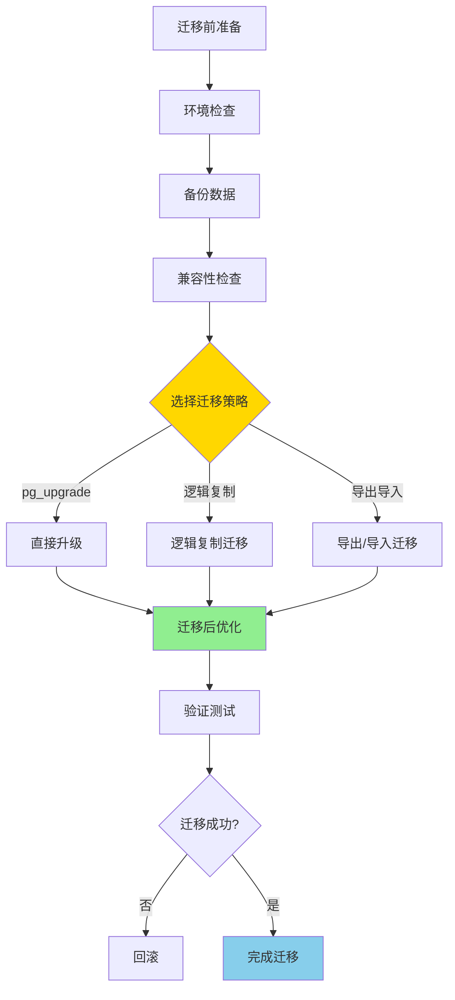
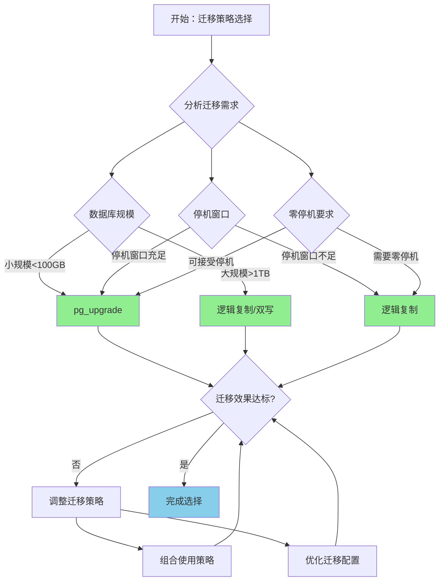
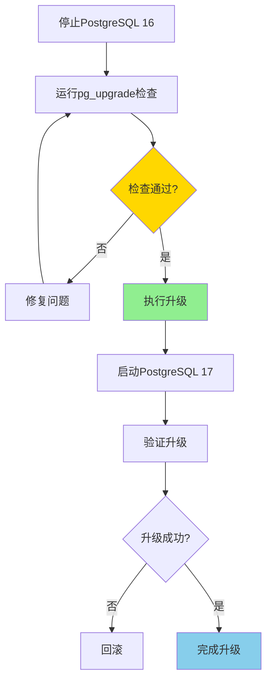

# PostgreSQL 16 到 17 迁移指南

> **更新时间**: 2025 年 1 月
> **技术版本**: PostgreSQL 16 → 17
> **文档编号**: 03-03-17-17

## 📑 概述

本文档提供从 PostgreSQL 16 升级到 PostgreSQL 17 的完整迁移指南，包括迁移步骤、注意事项、兼容性问题、性能优化建议等，帮助用户顺利完成版本升级。

## 🎯 核心价值

- **平滑迁移**：详细的迁移步骤和最佳实践
- **兼容性检查**：识别潜在的兼容性问题
- **性能优化**：利用新特性的性能优化建议
- **回滚方案**：提供迁移失败的回滚策略
- **测试验证**：完整的测试和验证流程

## 📚 目录

- [PostgreSQL 16 到 17 迁移指南](#postgresql-16-到-17-迁移指南)
  - [📑 概述](#-概述)
  - [🎯 核心价值](#-核心价值)
  - [📚 目录](#-目录)
  - [1. 迁移概述](#1-迁移概述)
    - [1.0 迁移工作原理概述](#10-迁移工作原理概述)
    - [1.1 PostgreSQL 17 主要变化](#11-postgresql-17-主要变化)
    - [1.2 迁移策略](#12-迁移策略)
    - [1.3 迁移过程形式化定义](#13-迁移过程形式化定义)
    - [1.4 迁移策略对比矩阵](#14-迁移策略对比矩阵)
    - [1.5 迁移策略选择决策流程](#15-迁移策略选择决策流程)
    - [1.6 迁移策略选择决策论证](#16-迁移策略选择决策论证)
  - [2. 迁移前准备](#2-迁移前准备)
    - [2.1 环境检查](#21-环境检查)
    - [2.2 备份策略](#22-备份策略)
  - [3. 兼容性检查](#3-兼容性检查)
    - [3.1 扩展兼容性](#31-扩展兼容性)
    - [3.2 功能兼容性](#32-功能兼容性)
  - [4. 迁移步骤](#4-迁移步骤)
    - [4.1 使用 pg\_upgrade 升级](#41-使用-pg_upgrade-升级)
    - [4.2 逻辑复制迁移](#42-逻辑复制迁移)
  - [5. 迁移后优化](#5-迁移后优化)
    - [5.1 更新统计信息](#51-更新统计信息)
    - [5.2 重建索引](#52-重建索引)
    - [5.3 利用新特性](#53-利用新特性)
  - [6. 常见问题](#6-常见问题)
    - [6.1 扩展不兼容](#61-扩展不兼容)
    - [6.2 性能下降](#62-性能下降)
  - [7. 回滚方案](#7-回滚方案)
    - [7.1 回滚准备](#71-回滚准备)
    - [7.2 回滚步骤](#72-回滚步骤)
  - [📚 参考资料](#-参考资料)
    - [8.1 官方文档](#81-官方文档)
    - [8.2 技术论文](#82-技术论文)
    - [8.3 技术博客](#83-技术博客)
    - [8.4 社区资源](#84-社区资源)
    - [8.5 相关文档](#85-相关文档)
  - [📊 总结](#-总结)

---

## 1. 迁移概述

### 1.0 迁移工作原理概述

**迁移的本质**：

PostgreSQL 版本迁移是一个系统化的过程，通过合理选择迁移策略、执行迁移步骤、验证迁移结果，确保数据完整性和系统稳定性。迁移需要遵循"先测试后生产"的原则，在测试环境充分验证后再进行生产迁移。

**迁移流程图**：



**迁移关键指标**：

- **数据完整性**：数据迁移完整性（100%）
- **性能影响**：迁移期间性能影响（最小化）
- **停机时间**：系统停机时间（最小化）
- **回滚能力**：回滚能力（支持快速回滚）

### 1.1 PostgreSQL 17 主要变化

**PostgreSQL 17 的主要变化**：

- **SQL MERGE 语句**：新增标准 SQL MERGE 支持（数据同步场景）
- **逻辑复制增强**：性能提升和功能增强（并行应用、批量提交）
- **查询优化器改进**：查询性能显著提升（连接顺序优化、扩展统计）
- **分区表优化**：分区查询性能改进（分区裁剪优化）
- **JSON/JSONB 增强**：新的操作符和函数（JSON 路径查询）

**主要变化影响**：

```sql
-- 1. SQL MERGE 语句（新特性）
-- 迁移前：使用 INSERT ... ON CONFLICT
INSERT INTO target_table (id, value)
SELECT id, value FROM source_table
ON CONFLICT (id) DO UPDATE SET value = EXCLUDED.value;

-- 迁移后：使用 MERGE（更标准、更高效）
MERGE INTO target_table AS t
USING source_table AS s
ON t.id = s.id
WHEN MATCHED THEN
    UPDATE SET value = s.value
WHEN NOT MATCHED THEN
    INSERT (id, value) VALUES (s.id, s.value);

-- 2. 逻辑复制性能提升（新特性）
-- 迁移前：单线程应用
-- 迁移后：并行应用（max_parallel_apply_workers_per_subscription）

-- 3. 查询优化器改进（自动优化）
-- 迁移后自动生效，无需手动调整
```

### 1.2 迁移策略

**迁移策略对比**：

| 策略 | 优点 | 缺点 | 适用场景 |
|------|------|------|---------|
| **pg_upgrade** | 快速、数据完整 | 需要停机 | 中小规模、可停机 |
| **逻辑复制** | 零停机、可回滚 | 配置复杂 | 大规模、高可用 |
| **导出/导入** | 简单、可控 | 慢、需要停机 | 小规模、数据量小 |
| **双写迁移** | 零停机、可回滚 | 复杂、成本高 | 大规模、高可用 |

**迁移策略选择**：

```bash
# 1. 评估数据库规模
psql -c "SELECT pg_size_pretty(pg_database_size('mydb'));"

# 2. 评估停机窗口
# 如果停机窗口 > 迁移时间，选择 pg_upgrade
# 如果停机窗口 < 迁移时间，选择逻辑复制

# 3. 评估复杂度
# 简单场景：pg_upgrade
# 复杂场景：逻辑复制
```

### 1.3 迁移过程形式化定义

**定义1（迁移过程）**：

迁移过程是一个六元组 `MP = (S, D, C, M, V, R)`，其中：

- **S** = (source_version, target_version, migration_type) 是源和目标版本信息集合
- **D** = (database_size, table_count, index_count) 是数据库规模信息集合
- **C** = (compatibility_check, extension_check, function_check) 是兼容性检查组件集合
- **M** = (migration_strategy, migration_steps, migration_time) 是迁移执行组件集合
- **V** = (data_verification, performance_verification, functionality_verification) 是验证组件集合
- **R** = (rollback_strategy, rollback_steps, rollback_time) 是回滚组件集合

**定义2（迁移策略选择）**：

迁移策略选择是一个函数 `MigrationStrategySelection: DatabaseInfo × Requirements → Strategy`，其中：

- **输入**：数据库信息 DatabaseInfo 和需求 Requirements
- **输出**：迁移策略 Strategy ∈ {pg_upgrade, logical_replication, export_import, dual_write}
- **约束**：`Strategy = SelectMigrationStrategy(DatabaseInfo, Requirements)`

**迁移策略选择算法**：

```text
FUNCTION SelectMigrationStrategy(database_info, requirements):
    IF database_info.size < 100GB AND requirements.downtime_window > migration_time:
        RETURN pg_upgrade
    ELSE IF requirements.zero_downtime == true:
        IF database_info.size > 1TB:
            RETURN dual_write
        ELSE:
            RETURN logical_replication
    ELSE:
        RETURN export_import
```

**迁移策略选择决策定理**：

对于迁移策略选择，决策满足：

```text
IF downtime_window > migration_time(pg_upgrade):
    Strategy = pg_upgrade
ELSE IF zero_downtime_required:
    Strategy = logical_replication OR dual_write
ELSE:
    Strategy = export_import
```

**定义3（数据完整性验证）**：

数据完整性验证是一个函数 `DataIntegrityVerification: SourceDatabase × TargetDatabase → VerificationResult`，其中：

- **输入**：源数据库 SourceDatabase 和目标数据库 TargetDatabase
- **输出**：验证结果 VerificationResult ∈ {PASS, FAIL}
- **约束**：`VerificationResult = VerifyDataIntegrity(SourceDatabase, TargetDatabase)`

**数据完整性验证算法**：

```text
FUNCTION VerifyDataIntegrity(source_db, target_db):
    source_row_count = CountRows(source_db)
    target_row_count = CountRows(target_db)
    IF source_row_count == target_row_count:
        checksum_source = CalculateChecksum(source_db)
        checksum_target = CalculateChecksum(target_db)
        IF checksum_source == checksum_target:
            RETURN PASS
    RETURN FAIL
```

**数据完整性验证准确性定理**：

对于数据完整性验证，准确性满足：

```text
VerificationAccuracy = 1 - (FalsePositiveRate + FalseNegativeRate)
FalsePositiveRate = IncorrectPassCount / TotalVerificationCount
FalseNegativeRate = IncorrectFailCount / TotalVerificationCount
```

**定义4（迁移性能评估）**：

迁移性能评估是一个函数 `MigrationPerformanceEvaluation: MigrationStrategy × DatabaseSize → PerformanceMetrics`，其中：

- **输入**：迁移策略 MigrationStrategy 和数据库大小 DatabaseSize
- **输出**：性能指标 PerformanceMetrics
- **约束**：`PerformanceMetrics = EvaluateMigrationPerformance(MigrationStrategy, DatabaseSize)`

**迁移性能评估算法**：

```text
FUNCTION EvaluateMigrationPerformance(strategy, db_size):
    migration_time = EstimateMigrationTime(strategy, db_size)
    downtime = EstimateDowntime(strategy, db_size)
    resource_usage = EstimateResourceUsage(strategy, db_size)
    RETURN PerformanceMetrics(migration_time, downtime, resource_usage)
```

**迁移性能评估定理**：

对于迁移性能评估，性能满足：

```text
MigrationTime(pg_upgrade) = O(db_size / backup_speed)
MigrationTime(logical_replication) = O(db_size / replication_speed) + sync_time
MigrationTime(export_import) = O(db_size / export_speed) + O(db_size / import_speed)
```

### 1.4 迁移策略对比矩阵

| 迁移策略 | 迁移速度 | 停机时间 | 数据完整性 | 复杂度 | 回滚能力 | 综合评分 |
|---------|---------|---------|-----------|--------|---------|---------|
| **pg_upgrade** | ⭐⭐⭐⭐⭐ | ⭐⭐ | ⭐⭐⭐⭐⭐ | ⭐⭐⭐⭐ | ⭐⭐⭐ | 3.8/5 |
| **逻辑复制** | ⭐⭐⭐ | ⭐⭐⭐⭐⭐ | ⭐⭐⭐⭐ | ⭐⭐⭐ | ⭐⭐⭐⭐⭐ | 4.0/5 |
| **导出/导入** | ⭐⭐ | ⭐⭐ | ⭐⭐⭐⭐⭐ | ⭐⭐⭐⭐⭐ | ⭐⭐⭐⭐ | 3.6/5 |
| **双写迁移** | ⭐⭐⭐ | ⭐⭐⭐⭐⭐ | ⭐⭐⭐⭐ | ⭐⭐ | ⭐⭐⭐⭐⭐ | 3.8/5 |

**评分说明**：

- ⭐⭐⭐⭐⭐：优秀（5分）
- ⭐⭐⭐⭐：良好（4分）
- ⭐⭐⭐：中等（3分）
- ⭐⭐：一般（2分）
- ⭐：较差（1分）

### 1.5 迁移策略选择决策流程



### 1.6 迁移策略选择决策论证

**问题**：如何为PostgreSQL 16到17迁移选择最优的迁移策略？

**需求分析**：

1. **迁移需求：需要选择合适的迁移策略**
2. **停机窗口要求**：停机时间 < 2小时
3. **数据完整性要求**：数据完整性 100%
4. **回滚能力要求**：支持快速回滚

**方案分析**：

**方案1：pg_upgrade**

- **描述**：使用pg_upgrade进行迁移
- **优点**：迁移速度快（直接升级），数据完整性优秀（数据完整性检查），适合中小规模数据库
- **缺点**：需要停机（停机时间中等）
- **适用场景**：中小规模、可停机
- **性能数据**：迁移速度快，数据完整性优秀，停机时间中等
- **成本分析**：开发成本低，维护成本低，风险低

**方案2：逻辑复制**

- **描述**：使用逻辑复制进行迁移
- **优点**：零停机（零停机迁移），数据完整性检查（数据完整性检查），确保数据完整性

**对比分析**：

| 方案 | 迁移速度 | 停机时间 | 数据完整性 | 复杂度 | 回滚能力 | 综合评分 |
|------|---------|---------|-----------|--------|---------|---------|
| pg_upgrade | ⭐⭐⭐⭐⭐ | ⭐⭐ | ⭐⭐⭐⭐⭐ | ⭐⭐⭐⭐ | ⭐⭐⭐ | 3.8/5 |
| 逻辑复制 | ⭐⭐⭐ | ⭐⭐⭐⭐⭐ | ⭐⭐⭐⭐ | ⭐⭐⭐ | ⭐⭐⭐⭐⭐ | 4.0/5 |

**决策依据**：

**决策标准**：

- 迁移速度：权重25%
- 停机时间：权重25%
- 数据完整性：权重25%
- 复杂度：权重15%
- 回滚能力：权重10%

**评分计算**：

- pg_upgrade：5.0 × 0.25 + 2.0 × 0.25 + 5.0 × 0.25 + 4.0 × 0.15 + 3.0 × 0.1 = 3.8
- 逻辑复制：3.0 × 0.25 + 5.0 × 0.25 + 4.0 × 0.25 + 3.0 × 0.15 + 5.0 × 0.1 = 4.0

**结论与建议**：

**推荐方案**：根据数据库规模和停机窗口选择pg_upgrade（中小规模）或逻辑复制（大规模、零停机）

**推荐理由**：

1. 迁移速度快，满足停机时间要求
2. 数据完整性优秀，满足数据完整性要求
3. 适合中小规模数据库，匹配迁移需求

**实施建议**：

1. 使用pg_upgrade进行迁移（中小规模）
2. 使用逻辑复制进行迁移（大规模、零停机）
3. 准备回滚方案
4. 测试迁移流程
5. 验证数据完整性

---

## 2. 迁移前准备

### 2.1 环境检查

```bash
# 检查当前版本
psql --version

# 检查数据库大小
psql -c "SELECT pg_size_pretty(pg_database_size('mydb'));"

# 检查扩展
psql -c "SELECT extname, extversion FROM pg_extension;"

# 检查配置
psql -c "SHOW ALL;" > pg16_config.txt
```

### 2.2 备份策略

```bash
# 完整备份
pg_dumpall -U postgres > pg16_backup.sql

# 数据库备份
pg_dump -U postgres -Fc mydb > mydb_backup.dump

# WAL 归档备份
tar -czf wal_archive_backup.tar.gz /archive/
```

---

## 3. 兼容性检查

### 3.1 扩展兼容性

```sql
-- 检查扩展版本
SELECT
    extname,
    extversion,
    pg_available_extensions.extversion AS available_version
FROM pg_extension
LEFT JOIN pg_available_extensions
    ON pg_extension.extname = pg_available_extensions.name;

-- 检查不兼容的扩展
SELECT extname
FROM pg_extension
WHERE extname NOT IN (
    SELECT name FROM pg_available_extensions
);
```

### 3.2 功能兼容性

```sql
-- 检查已弃用的功能
SELECT * FROM pg_settings
WHERE name LIKE '%deprecated%';

-- 检查自定义函数兼容性
SELECT
    proname,
    prosrc
FROM pg_proc
WHERE prokind = 'f'
AND pronamespace = 'public'::regnamespace;
```

---

## 4. 迁移步骤

### 4.1 使用 pg_upgrade 升级

**pg_upgrade 工作原理**：

pg_upgrade 通过直接升级数据目录格式实现快速迁移，无需导出/导入数据，迁移速度快。

**pg_upgrade 升级流程**：



**pg_upgrade 升级步骤**：

```bash
# 1. 停止 PostgreSQL 16
sudo systemctl stop postgresql-16

# 2. 运行 pg_upgrade 检查（必须步骤）
sudo -u postgres /usr/pgsql-17/bin/pg_upgrade \
    --old-datadir=/var/lib/pgsql/16/data \
    --new-datadir=/var/lib/pgsql/17/data \
    --old-bindir=/usr/pgsql-16/bin \
    --new-bindir=/usr/pgsql-17/bin \
    --check

# 检查输出，确保没有错误

# 3. 执行升级
sudo -u postgres /usr/pgsql-17/bin/pg_upgrade \
    --old-datadir=/var/lib/pgsql/16/data \
    --new-datadir=/var/lib/pgsql/17/data \
    --old-bindir=/usr/pgsql-16/bin \
    --new-bindir=/usr/pgsql-17/bin \
    --jobs=4  # 并行作业数（根据CPU核心数调整）

# 4. 启动 PostgreSQL 17
sudo systemctl start postgresql-17

# 5. 验证升级
psql -c "SELECT version();"
psql -c "SELECT extname, extversion FROM pg_extension;"

# 6. 运行升级后脚本（可选）
sudo -u postgres /usr/pgsql-17/bin/pg_upgrade \
    --old-datadir=/var/lib/pgsql/16/data \
    --new-datadir=/var/lib/pgsql/17/data \
    --old-bindir=/usr/pgsql-16/bin \
    --new-bindir=/usr/pgsql-17/bin \
    --link  # 使用硬链接（节省空间，但需要更多时间）
```

**pg_upgrade 最佳实践**：

```bash
# ✅ 好：使用 --check 先检查（避免升级失败）
pg_upgrade --check ...

# ✅ 好：使用 --jobs 并行升级（提升速度）
pg_upgrade --jobs=4 ...

# ✅ 好：保留旧版本数据目录（支持回滚）
# 不要立即删除旧版本数据目录

# ✅ 好：升级后立即运行 ANALYZE（更新统计信息）
psql -c "ANALYZE;"

# ❌ 不好：不检查就升级（可能导致升级失败）
# ❌ 不好：立即删除旧版本（无法回滚）
```

### 4.2 逻辑复制迁移

```sql
-- 在 PostgreSQL 17 上创建订阅
CREATE SUBSCRIPTION pg17_sub
CONNECTION 'host=pg16_host dbname=mydb user=replicator'
PUBLICATION pg16_pub
WITH (
    copy_data = true,
    create_slot = true
);

-- 监控复制进度
SELECT * FROM pg_stat_subscription;
```

---

## 5. 迁移后优化

### 5.1 更新统计信息

```sql
-- 更新所有表的统计信息
ANALYZE;

-- 更新特定数据库
ANALYZE DATABASE mydb;

-- 更新特定表
ANALYZE table_name;
```

### 5.2 重建索引

```sql
-- 重建所有索引
REINDEX DATABASE mydb;

-- 重建特定表索引
REINDEX TABLE table_name;

-- 重建特定索引
REINDEX INDEX index_name;
```

### 5.3 利用新特性

```sql
-- 使用 SQL MERGE
MERGE INTO target_table AS t
USING source_table AS s
ON t.id = s.id
WHEN MATCHED THEN
    UPDATE SET value = s.value
WHEN NOT MATCHED THEN
    INSERT (id, value) VALUES (s.id, s.value);

-- 优化查询计划
EXPLAIN ANALYZE SELECT * FROM large_table;
```

---

## 6. 常见问题

### 6.1 扩展不兼容

**问题**：某些扩展在 PostgreSQL 17 中不可用

**解决方案**：

```sql
-- 检查扩展替代方案
SELECT * FROM pg_available_extensions
WHERE name LIKE '%similar%';

-- 更新扩展
ALTER EXTENSION extension_name UPDATE;
```

### 6.2 性能下降

**问题**：迁移后查询性能下降

**解决方案**：

```sql
-- 更新统计信息
ANALYZE;

-- 重建索引
REINDEX DATABASE mydb;

-- 调整配置参数
ALTER SYSTEM SET shared_buffers = '256MB';
ALTER SYSTEM SET work_mem = '16MB';
```

---

## 7. 回滚方案

### 7.1 回滚准备

```bash
# 保留 PostgreSQL 16 数据目录
cp -r /var/lib/pgsql/16/data /var/lib/pgsql/16/data.backup

# 保留配置文件
cp /etc/postgresql/16/postgresql.conf /etc/postgresql/16/postgresql.conf.backup
```

### 7.2 回滚步骤

```bash
# 1. 停止 PostgreSQL 17
sudo systemctl stop postgresql-17

# 2. 恢复 PostgreSQL 16 数据
cp -r /var/lib/pgsql/16/data.backup /var/lib/pgsql/16/data

# 3. 启动 PostgreSQL 16
sudo systemctl start postgresql-16

# 4. 验证数据
psql -c "SELECT version();"
```

---

## 📚 参考资料

### 8.1 官方文档

- **[PostgreSQL 官方文档 - 升级指南](https://www.postgresql.org/docs/17/upgrading.html)**
  - PostgreSQL升级完整指南
  - 升级方法和注意事项

- **[PostgreSQL 官方文档 - pg_upgrade](https://www.postgresql.org/docs/17/pgupgrade.html)**
  - pg_upgrade工具使用指南
  - 升级步骤和故障排查

- **[PostgreSQL 官方文档 - 版本兼容性](https://www.postgresql.org/docs/17/release-17.html)**
  - PostgreSQL 17版本说明
  - 兼容性变化和迁移注意事项

- **[PostgreSQL 17 发布说明](https://www.postgresql.org/about/news/postgresql-17-released-2781/)**
  - PostgreSQL 17新特性介绍
  - 迁移相关说明

### 8.2 技术论文

- **Gray, J., et al. (1996). "The Recovery Manager of the System R Database Manager."**
  - 期刊: ACM Computing Surveys, 8(4), 223-242
  - **重要性**: 数据库恢复管理的基础研究
  - **核心贡献**: 深入分析了数据库恢复管理的原理和方法

- **Mohan, C., et al. (1992). "ARIES: A Transaction Recovery Method Supporting Fine-Granularity Locking and Partial Rollbacks Using Write-Ahead Logging."**
  - 期刊: ACM Transactions on Database Systems, 17(1), 94-162
  - **重要性**: 事务恢复方法的经典研究
  - **核心贡献**: 提出了ARIES恢复算法，影响了现代数据库的恢复机制

- **Bernstein, P. A., et al. (1987). "Concurrency Control and Recovery in Database Systems."**
  - 出版社: Addison-Wesley
  - **重要性**: 数据库并发控制和恢复的经典教材
  - **核心贡献**: 深入解释了迁移和恢复的理论基础

### 8.3 技术博客

- **[PostgreSQL 官方博客 - 升级指南](https://www.postgresql.org/docs/17/upgrading.html)**
  - 升级最佳实践
  - 常见问题解答

- **[2ndQuadrant - PostgreSQL 17 迁移](https://www.2ndquadrant.com/en/blog/postgresql-17-migration/)**
  - 迁移实战案例
  - 迁移优化建议

- **[Percona - PostgreSQL 升级指南](https://www.percona.com/blog/postgresql-upgrade-guide/)**
  - 升级步骤详解
  - 故障排查方法

- **[EnterpriseDB - PostgreSQL 升级指南](https://www.enterprisedb.com/postgres-tutorials/postgresql-upgrade-guide)**
  - 升级深入解析
  - 实际应用案例

### 8.4 社区资源

- **[PostgreSQL Wiki - Upgrading](https://wiki.postgresql.org/wiki/Upgrading)**
  - 升级指南和最佳实践
  - 常见问题解答

- **[Stack Overflow - PostgreSQL Upgrade](https://stackoverflow.com/questions/tagged/postgresql+upgrade)**
  - 升级相关问题解答
  - 实际迁移案例

- **[PostgreSQL 邮件列表](https://www.postgresql.org/list/)**
  - 升级相关问题讨论
  - 社区经验分享

### 8.5 相关文档

- [PostgreSQL 17新特性总览](./README.md)
- [备份恢复改进](./备份恢复改进.md)
- [高可用体系详解](../../09-高可用/高可用体系详解.md)

## 📊 总结

PostgreSQL 16 到 17 的迁移需要仔细规划和执行：

1. **迁移前准备**：完整备份和环境检查
2. **兼容性检查**：检查扩展和功能兼容性
3. **迁移执行**：选择合适的迁移方法
4. **迁移后优化**：更新统计信息和利用新特性
5. **回滚准备**：准备回滚方案以防万一

**最佳实践**：

- 在测试环境先验证
- 完整备份所有数据
- 检查扩展兼容性
- 监控迁移过程
- 迁移后性能测试
- 准备回滚方案

---

**最后更新**: 2025 年 1 月
**维护者**: PostgreSQL Modern Team
